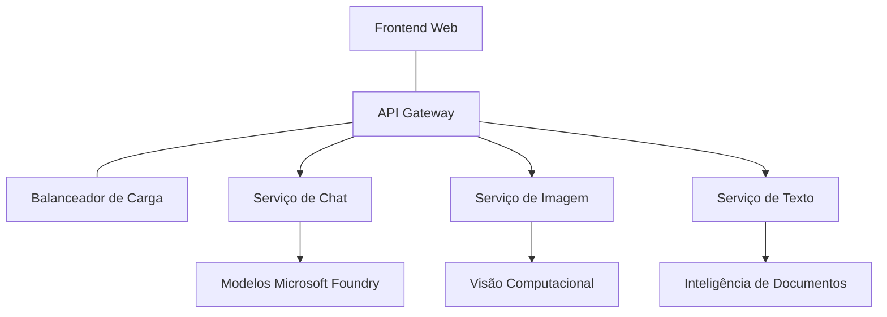

# Melhores Práticas para Cargas de Trabalho de IA em Produção com AZD

**Navegação pelo Capítulo:**
- **📚 Início do Curso**: [AZD Para Iniciantes](../../README.md)
- **📖 Capítulo Atual**: Capítulo 8 - Padrões de Produção e Empresariais
- **⬅️ Capítulo Anterior**: [Capítulo 7: Resolução de Problemas](../chapter-07-troubleshooting/debugging.md)
- **⬅️ Também Relacionado**: [Laboratório do Workshop de IA](ai-workshop-lab.md)
- **🎯 Curso Completo**: [AZD Para Iniciantes](../../README.md)

## Visão Geral

Este guia apresenta melhores práticas abrangentes para implementar cargas de trabalho de IA prontas para produção usando a Azure Developer CLI (AZD). Baseado no feedback da comunidade Microsoft Foundry Discord e em implementações reais de clientes, estas práticas abordam os desafios mais comuns em sistemas de IA em produção.

## Principais Desafios Abordados

Com base nos resultados da nossa sondagem comunitária, estes são os principais desafios enfrentados pelos desenvolvedores:

- **45%** têm dificuldades com implementações de IA multi-serviço
- **38%** enfrentam problemas com gestão de credenciais e segredos  
- **35%** encontram dificuldades com prontidão para produção e escalabilidade
- **32%** necessitam de melhores estratégias de otimização de custos
- **29%** precisam de melhor monitorização e resolução de problemas

## Padrões de Arquitetura para IA em Produção

### Padrão 1: Arquitetura de Microserviços para IA

**Quando usar**: Aplicações de IA complexas com múltiplas capacidades



**Implementação com AZD**:

```yaml
# azure.yaml
name: enterprise-ai-platform
services:
  web:
    project: ./web
    host: staticwebapp
  api-gateway:
    project: ./api-gateway
    host: containerapp
  chat-service:
    project: ./services/chat
    host: containerapp
  vision-service:
    project: ./services/vision
    host: containerapp
  text-service:
    project: ./services/text
    host: containerapp
```

### Padrão 2: Processamento de IA Orientado a Eventos

**Quando usar**: Processamento em lote, análise de documentos, fluxos de trabalho assíncronos

```bicep
// Event Hub for AI processing pipeline
resource eventHub 'Microsoft.EventHub/namespaces@2023-01-01-preview' = {
  name: eventHubNamespaceName
  location: location
  sku: {
    name: 'Standard'
    tier: 'Standard'
    capacity: 1
  }
}

// Service Bus for reliable message processing
resource serviceBus 'Microsoft.ServiceBus/namespaces@2022-10-01-preview' = {
  name: serviceBusNamespaceName
  location: location
  sku: {
    name: 'Premium'
    tier: 'Premium'
    capacity: 1
  }
}

// Function App for processing
resource functionApp 'Microsoft.Web/sites@2023-01-01' = {
  name: functionAppName
  location: location
  kind: 'functionapp,linux'
  properties: {
    siteConfig: {
      appSettings: [
        {
          name: 'FUNCTIONS_EXTENSION_VERSION'
          value: '~4'
        }
        {
          name: 'AZURE_OPENAI_ENDPOINT'
          value: '@Microsoft.KeyVault(VaultName=${keyVault.name};SecretName=openai-endpoint)'
        }
      ]
    }
  }
}
```

## Pensando na Saúde do Agente de IA

Quando uma aplicação web tradicional falha, os sintomas são familiares: uma página não carrega, uma API retorna um erro, ou uma implementação falha. Aplicações dotadas de IA podem falhar da mesma forma — mas também podem comportar-se de formas mais subtis que não produzem mensagens evidentes de erro.

Esta secção ajuda a construir um modelo mental para monitorizar cargas de trabalho de IA para saber onde procurar quando algo não parece correto.

### Como a Saúde do Agente Difere da Saúde de uma App Tradicional

Uma aplicação tradicional ou funciona ou não funciona. Um agente de IA pode aparentar funcionar mas produzir resultados pobres. Pense na saúde do agente em duas camadas:

| Camada | O que Observar | Onde Procurar |
|--------|----------------|---------------|
| **Saúde da infraestrutura** | O serviço está a correr? Os recursos estão provisionados? Os endpoints são acessíveis? | `azd monitor`, saúde dos recursos no Azure Portal, logs de containers/aplicações |
| **Saúde do comportamento** | O agente responde com precisão? As respostas são atempadas? O modelo está a ser chamado corretamente? | Rastreamentos do Application Insights, métricas de latência das chamadas ao modelo, logs de qualidade das respostas |

A saúde da infraestrutura é familiar — é igual para qualquer app AZD. A saúde do comportamento é a nova camada introduzida pelas cargas de trabalho de IA.

### Onde Procurar Quando as Apps de IA Não Funcionam Como Esperado

Se a sua aplicação de IA não está a produzir os resultados que espera, aqui está uma lista de verificação conceptual:

1. **Comece pelo básico.** A app está a correr? Consegue aceder às suas dependências? Verifique `azd monitor` e a saúde dos recursos como faria para qualquer app.
2. **Verifique a ligação ao modelo.** A sua aplicação está a chamar com sucesso o modelo de IA? Chamadas falhadas ou com timeout ao modelo são a causa mais comum de problemas e aparecem nos logs da aplicação.
3. **Observe o que o modelo recebeu.** As respostas da IA dependem da entrada (o prompt e qualquer contexto recuperado). Se a saída estiver errada, normalmente a entrada também está. Verifique se a sua aplicação está a enviar os dados corretos para o modelo.
4. **Revise a latência da resposta.** Chamadas a modelos de IA são mais lentas do que chamadas típicas de API. Se a sua app parecer lenta, verifique se os tempos de resposta do modelo aumentaram — isso pode indicar limitação, limites de capacidade ou congestionamento regional.
5. **Atente aos sinais de custo.** Picos inesperados no uso de tokens ou chamadas de API podem indicar um ciclo, um prompt mal configurado ou múltiplas tentativas excessivas.

Não precisa dominar imediatamente as ferramentas de observabilidade. O ponto principal é que as apps de IA têm uma camada extra de comportamento para monitorizar, e a monitorização integrada no azd (`azd monitor`) fornece um ponto de partida para investigar ambas as camadas.

---

## Melhores Práticas de Segurança

### 1. Modelo de Segurança Zero-Trust

**Estratégia de Implementação**:
- Nenhuma comunicação entre serviços sem autenticação
- Todas as chamadas API usam identidades geridas
- Isolamento de rede com endpoints privados
- Controlo de acesso com privilégios mínimos

```bicep
// Managed Identity for each service
resource chatServiceIdentity 'Microsoft.ManagedIdentity/userAssignedIdentities@2023-01-31' = {
  name: 'chat-service-identity'
  location: location
}

// Role assignments with minimal permissions
resource openAIUserRole 'Microsoft.Authorization/roleAssignments@2022-04-01' = {
  scope: openAIAccount
  name: guid(openAIAccount.id, chatServiceIdentity.id, openAIUserRoleDefinitionId)
  properties: {
    roleDefinitionId: subscriptionResourceId('Microsoft.Authorization/roleDefinitions', '5e0bd9bd-7b93-4f28-af87-19fc36ad61bd')
    principalId: chatServiceIdentity.properties.principalId
    principalType: 'ServicePrincipal'
  }
}
```

### 2. Gestão Segura de Segredos

**Padrão de Integração com Key Vault**:

```bicep
// Key Vault with proper access policies
resource keyVault 'Microsoft.KeyVault/vaults@2023-02-01' = {
  name: keyVaultName
  location: location
  properties: {
    tenantId: tenant().tenantId
    sku: {
      family: 'A'
      name: 'premium'  // Use premium for production
    }
    enableRbacAuthorization: true  // Use RBAC instead of access policies
    enablePurgeProtection: true    // Prevent accidental deletion
    enableSoftDelete: true
    softDeleteRetentionInDays: 90
  }
}

// Store all AI service credentials
resource openAIKeySecret 'Microsoft.KeyVault/vaults/secrets@2023-02-01' = {
  parent: keyVault
  name: 'openai-api-key'
  properties: {
    value: openAIAccount.listKeys().key1
    attributes: {
      enabled: true
    }
  }
}
```

### 3. Segurança de Rede

**Configuração de Endpoint Privado**:

```bicep
// Virtual Network for AI services
resource virtualNetwork 'Microsoft.Network/virtualNetworks@2023-04-01' = {
  name: vnetName
  location: location
  properties: {
    addressSpace: {
      addressPrefixes: ['10.0.0.0/16']
    }
    subnets: [
      {
        name: 'ai-services-subnet'
        properties: {
          addressPrefix: '10.0.1.0/24'
          privateEndpointNetworkPolicies: 'Disabled'
        }
      }
      {
        name: 'app-services-subnet'
        properties: {
          addressPrefix: '10.0.2.0/24'
          delegations: [
            {
              name: 'Microsoft.Web/serverFarms'
              properties: {
                serviceName: 'Microsoft.Web/serverFarms'
              }
            }
          ]
        }
      }
    ]
  }
}

// Private endpoints for all AI services
resource openAIPrivateEndpoint 'Microsoft.Network/privateEndpoints@2023-04-01' = {
  name: '${openAIAccountName}-pe'
  location: location
  properties: {
    subnet: {
      id: virtualNetwork.properties.subnets[0].id
    }
    privateLinkServiceConnections: [
      {
        name: 'openai-connection'
        properties: {
          privateLinkServiceId: openAIAccount.id
          groupIds: ['account']
        }
      }
    ]
  }
}
```

## Performance e Escalabilidade

### 1. Estratégias de Auto-escalabilidade

**Autoescalabilidade para Container Apps**:

```bicep
resource containerApp 'Microsoft.App/containerApps@2023-05-01' = {
  name: containerAppName
  location: location
  properties: {
    configuration: {
      ingress: {
        external: true
        targetPort: 8000
        transport: 'http'
      }
    }
    template: {
      scale: {
        minReplicas: 2  // Always have 2 instances minimum
        maxReplicas: 50 // Scale up to 50 for high load
        rules: [
          {
            name: 'http-scaling'
            http: {
              metadata: {
                concurrentRequests: '20'  // Scale when >20 concurrent requests
              }
            }
          }
          {
            name: 'cpu-scaling'
            custom: {
              type: 'cpu'
              metadata: {
                type: 'Utilization'
                value: '70'  // Scale when CPU >70%
              }
            }
          }
        ]
      }
    }
  }
}
```

### 2. Estratégias de Cache

**Cache Redis para Respostas de IA**:

```bicep
// Redis Premium for production workloads
resource redisCache 'Microsoft.Cache/redis@2023-04-01' = {
  name: redisCacheName
  location: location
  properties: {
    sku: {
      name: 'Premium'
      family: 'P'
      capacity: 1
    }
    enableNonSslPort: false
    minimumTlsVersion: '1.2'
    redisConfiguration: {
      'maxmemory-policy': 'allkeys-lru'
    }
    // Enable clustering for high availability
    redisVersion: '6.0'
    shardCount: 2
  }
}

// Cache configuration in application
var cacheConnectionString = '${redisCache.properties.hostName}:6380,password=${redisCache.listKeys().primaryKey},ssl=True,abortConnect=False'
```

### 3. Balanceamento de Carga e Gestão de Tráfego

**Application Gateway com WAF**:

```bicep
// Application Gateway with Web Application Firewall
resource applicationGateway 'Microsoft.Network/applicationGateways@2023-04-01' = {
  name: appGatewayName
  location: location
  properties: {
    sku: {
      name: 'WAF_v2'
      tier: 'WAF_v2'
      capacity: 2
    }
    webApplicationFirewallConfiguration: {
      enabled: true
      firewallMode: 'Prevention'
      ruleSetType: 'OWASP'
      ruleSetVersion: '3.2'
    }
    // Backend pools for AI services
    backendAddressPools: [
      {
        name: 'ai-services-pool'
        properties: {
          backendAddresses: [
            {
              fqdn: '${containerApp.properties.configuration.ingress.fqdn}'
            }
          ]
        }
      }
    ]
  }
}
```

## 💰 Otimização de Custos

### 1. Dimensionamento Correto dos Recursos

**Configurações Específicas por Ambiente**:

```bash
# Ambiente de desenvolvimento
azd env new development
azd env set AZURE_OPENAI_SKU "S0"
azd env set AZURE_OPENAI_CAPACITY 10
azd env set AZURE_SEARCH_SKU "basic"
azd env set CONTAINER_CPU 0.5
azd env set CONTAINER_MEMORY 1.0

# Ambiente de produção
azd env new production
azd env set AZURE_OPENAI_SKU "S0"
azd env set AZURE_OPENAI_CAPACITY 100
azd env set AZURE_SEARCH_SKU "standard"
azd env set CONTAINER_CPU 2.0
azd env set CONTAINER_MEMORY 4.0
```

### 2. Monitorização de Custos e Orçamentos

```bicep
// Cost management and budgets
resource budget 'Microsoft.Consumption/budgets@2023-05-01' = {
  name: 'ai-workload-budget'
  properties: {
    timePeriod: {
      startDate: '2024-01-01'
      endDate: '2024-12-31'
    }
    timeGrain: 'Monthly'
    amount: 2000  // $2000 monthly budget
    category: 'Cost'
    notifications: {
      warning: {
        enabled: true
        operator: 'GreaterThan'
        threshold: 80
        contactEmails: [
          'finance@company.com'
          'engineering@company.com'
        ]
        contactRoles: [
          'Owner'
          'Contributor'
        ]
      }
      critical: {
        enabled: true
        operator: 'GreaterThan'
        threshold: 95
        contactEmails: [
          'cto@company.com'
        ]
      }
    }
  }
}
```

### 3. Otimização do Uso de Tokens

**Gestão de Custos OpenAI**:

```typescript
// Otimização de tokens ao nível da aplicação
class TokenOptimizer {
  private readonly maxTokens = 4000;
  private readonly reserveTokens = 500;
  
  optimizePrompt(userInput: string, context: string): string {
    const availableTokens = this.maxTokens - this.reserveTokens;
    const estimatedTokens = this.estimateTokens(userInput + context);
    
    if (estimatedTokens > availableTokens) {
      // Truncar contexto, não a entrada do utilizador
      context = this.truncateContext(context, availableTokens - this.estimateTokens(userInput));
    }
    
    return `${context}\n\nUser: ${userInput}`;
  }
  
  private estimateTokens(text: string): number {
    // Estimativa aproximada: 1 token ≈ 4 caracteres
    return Math.ceil(text.length / 4);
  }
}
```

## Monitorização e Observabilidade

### 1. Application Insights Abrangente

```bicep
// Application Insights with advanced features
resource applicationInsights 'Microsoft.Insights/components@2020-02-02' = {
  name: applicationInsightsName
  location: location
  kind: 'web'
  properties: {
    Application_Type: 'web'
    WorkspaceResourceId: logAnalyticsWorkspace.id
    SamplingPercentage: 100  // Full sampling for AI apps
    DisableIpMasking: false  // Enable for security
  }
}

// Custom metrics for AI operations
resource aiMetricAlerts 'Microsoft.Insights/metricAlerts@2018-03-01' = {
  name: 'ai-high-error-rate'
  location: 'global'
  properties: {
    description: 'Alert when AI service error rate is high'
    severity: 2
    enabled: true
    scopes: [
      applicationInsights.id
    ]
    evaluationFrequency: 'PT1M'
    windowSize: 'PT5M'
    criteria: {
      'odata.type': 'Microsoft.Azure.Monitor.SingleResourceMultipleMetricCriteria'
      allOf: [
        {
          name: 'high-error-rate'
          metricName: 'requests/failed'
          operator: 'GreaterThan'
          threshold: 10
          timeAggregation: 'Count'
        }
      ]
    }
  }
}
```

### 2. Monitorização Específica de IA

**Dashboards Personalizados para Métricas de IA**:

```json
// Dashboard configuration for AI workloads
{
  "dashboard": {
    "name": "AI Application Monitoring",
    "tiles": [
      {
        "name": "OpenAI Request Volume",
        "query": "requests | where name contains 'openai' | summarize count() by bin(timestamp, 5m)"
      },
      {
        "name": "AI Response Latency",
        "query": "requests | where name contains 'openai' | summarize avg(duration) by bin(timestamp, 5m)"
      },
      {
        "name": "Token Usage",
        "query": "customMetrics | where name == 'openai_tokens_used' | summarize sum(value) by bin(timestamp, 1h)"
      },
      {
        "name": "Cost per Hour",
        "query": "customMetrics | where name == 'openai_cost' | summarize sum(value) by bin(timestamp, 1h)"
      }
    ]
  }
}
```

### 3. Verificações de Saúde e Monitorização de Disponibilidade

```bicep
// Application Insights availability tests
resource availabilityTest 'Microsoft.Insights/webtests@2022-06-15' = {
  name: 'ai-app-availability-test'
  location: location
  tags: {
    'hidden-link:${applicationInsights.id}': 'Resource'
  }
  properties: {
    SyntheticMonitorId: 'ai-app-availability-test'
    Name: 'AI Application Availability Test'
    Description: 'Tests AI application endpoints'
    Enabled: true
    Frequency: 300  // 5 minutes
    Timeout: 120    // 2 minutes
    Kind: 'ping'
    Locations: [
      {
        Id: 'us-east-2-azr'
      }
      {
        Id: 'us-west-2-azr'
      }
    ]
    Configuration: {
      WebTest: '''
        <WebTest Name="AI Health Check" 
                 Id="8d2de8d2-a2b0-4c2e-9a0d-8f9c9a0b8c8d" 
                 Enabled="True" 
                 CssProjectStructure="" 
                 CssIteration="" 
                 Timeout="120" 
                 WorkItemIds="" 
                 xmlns="http://microsoft.com/schemas/VisualStudio/TeamTest/2010" 
                 Description="" 
                 CredentialUserName="" 
                 CredentialPassword="" 
                 PreAuthenticate="True" 
                 Proxy="default" 
                 StopOnError="False" 
                 RecordedResultFile="" 
                 ResultsLocale="">
          <Items>
            <Request Method="GET" 
                     Guid="a5f10126-e4cd-570d-961c-cea43999a200" 
                     Version="1.1" 
                     Url="${webApp.properties.defaultHostName}/health" 
                     ThinkTime="0" 
                     Timeout="120" 
                     ParseDependentRequests="True" 
                     FollowRedirects="True" 
                     RecordResult="True" 
                     Cache="False" 
                     ResponseTimeGoal="0" 
                     Encoding="utf-8" 
                     ExpectedHttpStatusCode="200" 
                     ExpectedResponseUrl="" 
                     ReportingName="" 
                     IgnoreHttpStatusCode="False" />
          </Items>
        </WebTest>
      '''
    }
  }
}
```

## Recuperação de Desastres e Alta Disponibilidade

### 1. Implementação Multi-Região

```yaml
# azure.yaml - Multi-region configuration
name: ai-app-multiregion
services:
  api-primary:
    project: ./api
    host: containerapp
    env:
      - AZURE_REGION=eastus
  api-secondary:
    project: ./api
    host: containerapp
    env:
      - AZURE_REGION=westus2
```

```bicep
// Traffic Manager for global load balancing
resource trafficManager 'Microsoft.Network/trafficManagerProfiles@2022-04-01' = {
  name: trafficManagerProfileName
  location: 'global'
  properties: {
    profileStatus: 'Enabled'
    trafficRoutingMethod: 'Priority'
    dnsConfig: {
      relativeName: trafficManagerProfileName
      ttl: 30
    }
    monitorConfig: {
      protocol: 'HTTPS'
      port: 443
      path: '/health'
      intervalInSeconds: 30
      toleratedNumberOfFailures: 3
      timeoutInSeconds: 10
    }
    endpoints: [
      {
        name: 'primary-endpoint'
        type: 'Microsoft.Network/trafficManagerProfiles/azureEndpoints'
        properties: {
          targetResourceId: primaryAppService.id
          endpointStatus: 'Enabled'
          priority: 1
        }
      }
      {
        name: 'secondary-endpoint'
        type: 'Microsoft.Network/trafficManagerProfiles/azureEndpoints'
        properties: {
          targetResourceId: secondaryAppService.id
          endpointStatus: 'Enabled'
          priority: 2
        }
      }
    ]
  }
}
```

### 2. Backup e Recuperação de Dados

```bicep
// Backup configuration for critical data
resource backupVault 'Microsoft.DataProtection/backupVaults@2023-05-01' = {
  name: backupVaultName
  location: location
  identity: {
    type: 'SystemAssigned'
  }
  properties: {
    storageSettings: [
      {
        datastoreType: 'VaultStore'
        type: 'LocallyRedundant'
      }
    ]
  }
}

// Backup policy for AI models and data
resource backupPolicy 'Microsoft.DataProtection/backupVaults/backupPolicies@2023-05-01' = {
  parent: backupVault
  name: 'ai-data-backup-policy'
  properties: {
    policyRules: [
      {
        backupParameters: {
          backupType: 'Full'
          objectType: 'AzureBackupParams'
        }
        trigger: {
          schedule: {
            repeatingTimeIntervals: [
              'R/2024-01-01T02:00:00+00:00/P1D'  // Daily at 2 AM
            ]
          }
          objectType: 'ScheduleBasedTriggerContext'
        }
        dataStore: {
          datastoreType: 'VaultStore'
          objectType: 'DataStoreInfoBase'
        }
        name: 'BackupDaily'
        objectType: 'AzureBackupRule'
      }
    ]
  }
}
```

## DevOps e Integração CI/CD

### 1. Fluxo de Trabalho GitHub Actions

```yaml
# .github/workflows/deploy-ai-app.yml
name: Deploy AI Application

on:
  push:
    branches: [main]
  pull_request:
    branches: [main]

jobs:
  test:
    runs-on: ubuntu-latest
    steps:
      - uses: actions/checkout@v4
      
      - name: Setup Python
        uses: actions/setup-python@v4
        with:
          python-version: '3.11'
          
      - name: Install dependencies
        run: |
          pip install -r requirements.txt
          pip install pytest
          
      - name: Run tests
        run: pytest tests/
        
      - name: AI Safety Tests
        run: |
          python scripts/test_ai_safety.py
          python scripts/validate_prompts.py

  deploy-staging:
    needs: test
    if: github.event_name == 'pull_request'
    runs-on: ubuntu-latest
    steps:
      - uses: actions/checkout@v4
      
      - name: Setup AZD
        uses: Azure/setup-azd@v2
        
      - name: Login to Azure
        uses: azure/login@v1
        with:
          creds: ${{ secrets.AZURE_CREDENTIALS }}
          
      - name: Deploy to Staging
        run: |
          azd env select staging
          azd deploy

  deploy-production:
    needs: test
    if: github.ref == 'refs/heads/main'
    runs-on: ubuntu-latest
    steps:
      - uses: actions/checkout@v4
      
      - name: Setup AZD
        uses: Azure/setup-azd@v2
        
      - name: Login to Azure
        uses: azure/login@v1
        with:
          creds: ${{ secrets.AZURE_CREDENTIALS }}
          
      - name: Deploy to Production
        run: |
          azd env select production
          azd deploy
          
      - name: Run Production Health Checks
        run: |
          python scripts/health_check.py --env production
```

### 2. Validação da Infraestrutura

```bash
# scripts/validate_infrastructure.sh
#!/bin/bash

echo "Validating AI infrastructure deployment..."

# Verificar se todos os serviços necessários estão a funcionar
services=("openai" "search" "storage" "keyvault")
for service in "${services[@]}"; do
    echo "Checking $service..."
    if ! az resource list --resource-type "Microsoft.CognitiveServices/accounts" --query "[?contains(name, '$service')]" -o tsv; then
        echo "ERROR: $service not found"
        exit 1
    fi
done

# Validar implementações de modelos OpenAI
echo "Validating OpenAI model deployments..."
models=$(az cognitiveservices account deployment list --name $AZURE_OPENAI_NAME --resource-group $AZURE_RESOURCE_GROUP --query "[].name" -o tsv)
if [[ ! $models == *"gpt-4.1-mini"* ]]; then
  echo "ERROR: Required model gpt-4.1-mini not deployed"
    exit 1
fi

# Testar a conectividade do serviço de IA
echo "Testing AI service connectivity..."
python scripts/test_connectivity.py

echo "Infrastructure validation completed successfully!"
```

## Lista de Verificação de Prontidão para Produção

### Segurança ✅
- [ ] Todos os serviços usam identidades geridas
- [ ] Segredos armazenados no Key Vault
- [ ] Endpoints privados configurados
- [ ] Grupos de segurança de rede implementados
- [ ] RBAC com menor privilégio
- [ ] WAF ativado nos endpoints públicos

### Performance ✅
- [ ] Autoescalabilidade configurada
- [ ] Cache implementado
- [ ] Balanceamento de carga configurado
- [ ] CDN para conteúdos estáticos
- [ ] Pooling de conexão a base de dados
- [ ] Otimização do uso de tokens

### Monitorização ✅
- [ ] Application Insights configurado
- [ ] Métricas personalizadas definidas
- [ ] Regras de alerta configuradas
- [ ] Dashboard criado
- [ ] Verificações de saúde implementadas
- [ ] Políticas de retenção de logs

### Fiabilidade ✅
- [ ] Implementação multi-região
- [ ] Plano de backup e recuperação
- [ ] Circuit breakers implementados
- [ ] Políticas de retry configuradas
- [ ] Degradação graciosa
- [ ] Endpoints para verificações de saúde

### Gestão de Custos ✅
- [ ] Alertas de orçamento configurados
- [ ] Dimensionamento correto dos recursos
- [ ] Descontos para dev/test aplicados
- [ ] Instâncias reservadas adquiridas
- [ ] Dashboard de monitorização de custos
- [ ] Revisões regulares de custos

### Conformidade ✅
- [ ] Requisitos de residência de dados cumpridos
- [ ] Logs de auditoria ativados
- [ ] Políticas de conformidade aplicadas
- [ ] Baselines de segurança implementados
- [ ] Avaliações regulares de segurança
- [ ] Plano de resposta a incidentes

## Métricas de Performance

### Métricas Típicas de Produção

| Métrica | Objetivo | Monitorização |
|---------|----------|--------------|
| **Tempo de Resposta** | < 2 segundos | Application Insights |
| **Disponibilidade** | 99,9% | Monitorização de uptime |
| **Taxa de Erro** | < 0,1% | Logs da aplicação |
| **Uso de Tokens** | < $500/mês | Gestão de custos |
| **Utilizadores Concorrentes** | 1000+ | Testes de carga |
| **Tempo de Recuperação** | < 1 hora | Testes de recuperação de desastres |

### Testes de Carga

```bash
# Script de teste de carga para aplicações de IA
python scripts/load_test.py \
  --endpoint https://your-ai-app.azurewebsites.net \
  --concurrent-users 100 \
  --duration 300 \
  --ramp-up 60
```

## 🤝 Melhores Práticas da Comunidade

Baseado no feedback da comunidade Microsoft Foundry Discord:

### Principais Recomendações da Comunidade:

1. **Comece Pequeno, Escale Gradualmente**: Comece com SKUs básicos e escale conforme o uso real
2. **Monitorize Tudo**: Configure monitorização abrangente desde o primeiro dia
3. **Automatize a Segurança**: Use infraestrutura como código para segurança consistente
4. **Teste Exaustivamente**: Inclua testes específicos de IA no seu pipeline
5. **Planeie os Custos**: Monitorize o uso de tokens e configure alertas de orçamento cedo

### Erros Comuns a Evitar:

- ❌ Incorporar chaves API diretamente no código
- ❌ Não configurar monitorização adequada
- ❌ Ignorar otimização de custos
- ❌ Não testar cenários de falha
- ❌ Implementar sem verificações de saúde

## Comandos e Extensões AZD AI CLI

O AZD inclui um conjunto crescente de comandos e extensões específicas de IA que facilitam os fluxos de trabalho de IA em produção. Estas ferramentas fazem a ponte entre desenvolvimento local e implementação em produção para cargas de trabalho IA.

### Extensões AZD para IA

O AZD usa um sistema de extensões para adicionar capacidades específicas de IA. Instale e gere extensões com:

```bash
# Listar todas as extensões disponíveis (incluindo IA)
azd extension list

# Inspecionar detalhes da extensão instalada
azd extension show azure.ai.agents

# Instalar a extensão de agentes Foundry
azd extension install azure.ai.agents

# Instalar a extensão de afinação fina
azd extension install azure.ai.finetune

# Instalar a extensão de modelos personalizados
azd extension install azure.ai.models

# Atualizar todas as extensões instaladas
azd extension upgrade --all
```

**Extensões AI disponíveis:**

| Extensão | Propósito | Estado |
|----------|-----------|--------|
| `azure.ai.agents` | Gestão do Serviço de Agentes Foundry | Pré-visualização |
| `azure.ai.skills` | Skills reutilizáveis para agentes | Pré-visualização |
| `azure.ai.connections` | Conexões Foundry (fontes de dados, ferramentas) | Pré-visualização |
| `azure.ai.finetune` | Fine-tuning de modelos Foundry | Pré-visualização |
| `azure.ai.models` | Modelos personalizados Foundry | Pré-visualização |
| `azure.coding-agent` | Configuração de agente de codificação | Disponível |

> A extensão `azure.ai.agents` evolui rapidamente. Este curso é validado contra a versão `0.1.40-preview`. Execute `azd extension upgrade --all` para obter o conjunto de comandos mais recente, e `azd extension show azure.ai.agents` para confirmar a sua versão instalada.

**O que são as extensões mais recentes `skills` e `connections`?**

Duas extensões em pré-visualização surgiram juntamente com as ferramentas do agente e valem a pena ser compreendidas mesmo para iniciantes:

- **`azure.ai.skills`** — Uma **skill** é uma capacidade reutilizável (uma ferramenta ou comportamento empacotado) que pode ser anexada a um ou mais agentes em vez de ser reimplementada cada vez. Pense nela como um bloco de construção partilhado: defina uma skill para "pesquisar na documentação" ou "consultar uma encomenda" uma vez, e reutilize-a em vários agentes. Isto mantém sistemas multi-agente (Capítulo 5) consistentes e evita cópia e colagem.
- **`azure.ai.connections`** — Uma **connection** é uma ligação gerida do seu projeto Foundry a um recurso externo que os seus agentes precisam — uma fonte de dados (como Azure AI Search), um endpoint de ferramenta ou outro serviço. As conexões centralizam *onde* e *como* os agentes acedem a dados, de modo que as credenciais e endpoints vivem num único local governado em vez de espalhados pelo código.

Não precisa destas para implementar os seus primeiros agentes — fique com `azure.ai.agents` enquanto aprende. Opte por `skills` quando tiver de duplicar a mesma ferramenta entre agentes, e por `connections` quando vários agentes partilham a mesma fonte de dados.

### Inicializando Projetos de Agentes com `azd ai agent init`

O comando `azd ai agent init` cria a estrutura de um projeto de agente de IA pronto para produção, integrado com o Serviço de Agentes Microsoft Foundry:

```bash
# Inicializar um novo projeto de agente a partir de um manifesto de agente
azd ai agent init -m <manifest-path-or-uri>

# Inicializar e direcionar um projeto Foundry específico
azd ai agent init -m agent-manifest.yaml --project-id <foundry-project-id>

# Inicializar com um diretório de origem personalizado
azd ai agent init -m agent-manifest.yaml --src ./agents/my-agent

# Direcionar Aplicações de Contentores como o anfitrião
azd ai agent init -m agent-manifest.yaml --host containerapp
```

**Bandeiras principais:**

| Bandeira | Descrição |
|----------|-----------|
| `-m, --manifest` | Caminho ou URI para um manifesto de agente a adicionar ao projeto |
| `-p, --project-id` | ID do Projeto Microsoft Foundry existente para o seu ambiente azd |
| `-s, --src` | Diretório para descarregar a definição do agente (padrão `src/<agent-id>`) |
| `--host` | Sobrescreve o host padrão (ex.: `containerapp`) |
| `-e, --environment` | Ambiente azd a usar |

**Dica para produção**: Use `--project-id` para ligar diretamente a um projeto Foundry existente, mantendo o código do agente e os recursos cloud ligados desde o início.

### Gerindo o Ciclo de Vida do Agente

Para além do `init`, a extensão `azure.ai.agents` fornece comandos para todo o ciclo de vida de um agente hospedado — testar, avaliar, otimizar e retirá-lo:

```bash
# Invocar um agente implantado e ver o tempo de resposta do servidor
# (latência total e tempo até ao primeiro byte)
azd ai agent invoke

# Mostrar a configuração do endpoint ativo antes de a alterar
azd ai agent endpoint show

# Gerar um conjunto de dados de avaliação para o agente
azd ai agent eval generate --dataset ./eval/dataset.jsonl

# Otimizar as instruções do agente com base nos seus dados de avaliação
# (requer um optimization_model no projeto do agente)
azd ai agent optimize

# Descarregar o código fonte implantado de um agente alojado baseado em código
# (com verificação SHA-256)
azd ai agent code download

# Eliminar um agente alojado e todas as suas versões
# (--force termina sessões ativas)
azd ai agent delete --force
```

**Visão geral do ciclo de vida:**

| Etapa | Comando | Uso em produção |
|-------|---------|-----------------|
| Testar | `azd ai agent invoke` | Validar respostas e medir latência antes do lançamento |
| Inspecionar | `azd ai agent endpoint show` | Rever autenticação/configuração do endpoint; detectar alterações disruptivas cedo |
| Medir | `azd ai agent eval generate` | Construir um conjunto de avaliação repetível a partir de rastreamentos reais |
| Melhorar | `azd ai agent optimize` | Ajustar instruções com base na qualidade medida |
| Recuperar | `azd ai agent code download` | Recuperar o código exato em produção para auditoria ou rollback |
| Retirar | `azd ai agent delete --force` | Remover limpidamente um agente e as suas versões |

> Estes são comandos de pré-visualização e podem mudar entre versões da extensão. Execute `azd ai agent --help` para ver os subcomandos exactos disponíveis na sua versão instalada.

### Protocolo de Contexto do Modelo (MCP) com `azd mcp`
AZD inclui suporte incorporado ao servidor MCP (Alpha), permitindo que agentes e ferramentas de IA interajam com os seus recursos Azure através de um protocolo padronizado:

```bash
# Iniciar o servidor MCP para o seu projeto
azd mcp start

# Rever as regras atuais de consentimento do Copilot para a execução da ferramenta
azd copilot consent list
```

O servidor MCP expõe o contexto do seu projeto azd — ambientes, serviços e recursos Azure — para ferramentas de desenvolvimento com IA. Isto permite:

- **Desenvolvimento assistido por IA**: Deixe agentes de programação consultar o estado do seu projeto e iniciar implantações
- **Descoberta de recursos**: Ferramentas de IA podem descobrir quais recursos Azure o seu projeto utiliza
- **Gestão de ambientes**: Agentes podem alternar entre ambientes de desenvolvimento/teste/produção

### Geração de Infraestrutura com `azd infra generate`

Para cargas de IA em produção, pode gerar e personalizar Infraestrutura como Código em vez de depender do aprovisionamento automático:

```bash
# Gere ficheiros Bicep/Terraform a partir da definição do seu projeto
azd infra generate
```

Isto grava IaC no disco para que você possa:
- Rever e auditar a infraestrutura antes de implantar
- Adicionar políticas de segurança personalizadas (regras de rede, endpoints privados)
- Integrar com processos existentes de revisão de IaC
- Controlar versões das alterações de infraestrutura separadamente do código da aplicação

### Ganchos do Ciclo de Vida de Produção

Os ganchos AZD permitem-lhe injetar lógica personalizada em cada etapa do ciclo de vida de implantação — fundamental para fluxos de trabalho de IA em produção:

```yaml
# azure.yaml - Production hooks example
name: ai-production-app
hooks:
  preprovision:
    shell: sh
    run: scripts/validate-quotas.sh    # Check AI model quota before provisioning
  postprovision:
    shell: sh
    run: scripts/configure-networking.sh  # Set up private endpoints
  predeploy:
    shell: sh
    run: scripts/run-ai-safety-tests.sh  # Run prompt safety checks
  postdeploy:
    shell: sh
    run: scripts/smoke-test.sh           # Verify agent responses post-deploy
services:
  agent-api:
    project: ./src/agent
    host: containerapp
    hooks:
      predeploy:
        shell: sh
        run: scripts/validate-model-access.sh  # Per-service hook
```

```bash
# Execute um hook específico manualmente durante o desenvolvimento
azd hooks run predeploy
```

**Ganchos recomendados para cargas de IA em produção:**

| Gancho | Casos de Uso |
|--------|--------------|
| `preprovision` | Validar quotas de subscrição para capacidade do modelo de IA |
| `postprovision` | Configurar endpoints privados, implantar pesos do modelo |
| `predeploy` | Executar testes de segurança de IA, validar modelos de prompt |
| `postdeploy` | Testar respostas do agente, verificar conectividade do modelo |

### Configuração do Pipeline CI/CD

Use `azd pipeline config` para ligar o seu projeto ao GitHub Actions ou Azure Pipelines com autenticação segura no Azure:

```bash
# Configurar pipeline CI/CD (interativo)
azd pipeline config

# Configurar com um fornecedor específico
azd pipeline config --provider github
```

Este comando:
- Cria um principal de serviço com acesso limitado ao mínimo necessário
- Configura credenciais federadas (sem segredos armazenados)
- Gera ou atualiza o ficheiro de definição do pipeline
- Define variáveis ambiente necessárias no seu sistema CI/CD

#### Passo-a-passo: o seu primeiro pipeline GitHub Actions

Aqui está o guia completo desde um projeto azd funcional até implantações automatizadas a cada push.

**1. Certifique-se que o seu projeto está no GitHub**

```bash
git init
git add .
git commit -m "Initial azd project"
gh repo create my-ai-app --private --source=. --push
```

**2. Executar pipeline config**

```bash
azd pipeline config --provider github
```

O azd irá, interativamente:
- Perguntar qual subscrição Azure e ambiente usar
- Criar um **registo de aplicação + principal de serviço** no Entra para o pipeline
- Configurar **credenciais federadas (OIDC)** — para que o GitHub se autentique no Azure com tokens de curta duração e **sem segredos armazenados**
- Enviar as **variáveis** necessárias para o seu repositório GitHub (`AZURE_CLIENT_ID`, `AZURE_TENANT_ID`, `AZURE_SUBSCRIPTION_ID`, `AZURE_ENV_NAME`, `AZURE_LOCATION`)

**3. Compreender o workflow gerado**

O azd adiciona `.github/workflows/azure-dev.yml`. As partes essenciais são assim:

```yaml
# .github/workflows/azure-dev.yml
on:
  push:
    branches: [ main ]
  workflow_dispatch:        # lets you run it manually too

permissions:
  id-token: write           # required for OIDC federated login
  contents: read

jobs:
  build:
    runs-on: ubuntu-latest
    env:
      AZURE_CLIENT_ID: ${{ vars.AZURE_CLIENT_ID }}
      AZURE_TENANT_ID: ${{ vars.AZURE_TENANT_ID }}
      AZURE_SUBSCRIPTION_ID: ${{ vars.AZURE_SUBSCRIPTION_ID }}
      AZURE_ENV_NAME: ${{ vars.AZURE_ENV_NAME }}
      AZURE_LOCATION: ${{ vars.AZURE_LOCATION }}
    steps:
      - uses: actions/checkout@v4
      - name: Install azd
        uses: Azure/setup-azd@v2
      - name: Log in with OIDC
        run: azd auth login --client-id "$AZURE_CLIENT_ID" --federated-credential-provider "github" --tenant-id "$AZURE_TENANT_ID"
      - name: Provision infrastructure
        run: azd provision --no-prompt
      - name: Deploy application
        run: azd deploy --no-prompt
```

**4. Verifique que funciona**

```bash
# Faça um push de uma alteração para ativar a pipeline
git commit -am "Trigger pipeline" --allow-empty
git push
```

Abra o separador **Actions** no seu repositório GitHub e veja o workflow executar `azd provision` e `azd deploy` automaticamente.

> **Porque as credenciais federadas são importantes:** pipelines mais antigos armazenavam um segredo de cliente no GitHub. Credenciais federadas OIDC removem completamente esse segredo — o GitHub solicita um token de curta duração em tempo de execução, o que é mais seguro e não requer rodízios ou riscos de vazamento. Esta é a configuração padrão de `azd pipeline config`.

> **Segredos vs variáveis:** identificadores não sensíveis (`AZURE_CLIENT_ID`, etc.) devem estar em **variáveis** do repositório. Se a sua aplicação realmente precisa de um segredo no build, adicione-o como **segredo** no GitHub e refira-o com `${{ secrets.NOME }}` — mas prefira Key Vault + identidade gerida em tempo de execução (veja [Capítulo 3](../chapter-03-configuration/authsecurity.md)).

**Workflow de produção com pipeline config:**

```bash
# 1. Configurar o ambiente de produção
azd env new production
azd env set AZURE_OPENAI_CAPACITY 100

# 2. Configurar a pipeline
azd pipeline config --provider github

# 3. A pipeline executa azd deploy a cada push para o branch main
```

#### Passo-a-passo: Azure DevOps Pipelines

Prefere Azure DevOps em vez de GitHub Actions? O azd suporta nativamente com o provedor `azdo`. O fluxo é quase idêntico — o azd gera o ficheiro do pipeline, cria uma conexão de serviço, e configura a autenticação.

**1. Certifique-se que tem um projeto Azure DevOps**

Precisa de uma organização e um projeto em `https://dev.azure.com/<your-org>`. Gere um Token de Acesso Pessoal (PAT) com os escopos **Build (Ler & executar)**, **Code (Ler & escrever)**, e **Service Connections (Ler, consultar & gerir)** — irá ser solicitado pelo azd.

**2. Configure o pipeline**

```bash
azd pipeline config --provider azdo
```

O azd irá:
- Perguntar pela sua organização e projeto Azure DevOps
- Criar (ou reutilizar) uma **conexão de serviço** para Azure usando um principal de serviço
- Configurar **federação de identidade workload (OIDC)** para que nenhum segredo de cliente seja armazenado
- Fazer commit do ficheiro de definição do pipeline `azure-dev.yml` para o seu repositório

**3. Reveja o `azure-dev.yml` gerado**

O azd cria um pipeline que aprovisiona e implanta a cada push para a branch `main`:

```yaml
# azure-dev.yml
trigger:
  - main

pool:
  vmImage: ubuntu-latest

steps:
  - task: setup-azd@1
    displayName: Install azd

  - script: azd provision --no-prompt
    displayName: Provision Infrastructure
    env:
      AZURE_SUBSCRIPTION_ID: $(AZURE_SUBSCRIPTION_ID)
      AZURE_ENV_NAME: $(AZURE_ENV_NAME)
      AZURE_LOCATION: $(AZURE_LOCATION)

  - script: azd deploy --no-prompt
    displayName: Deploy Application
    env:
      AZURE_SUBSCRIPTION_ID: $(AZURE_SUBSCRIPTION_ID)
      AZURE_ENV_NAME: $(AZURE_ENV_NAME)
      AZURE_LOCATION: $(AZURE_LOCATION)
```

**4. De onde vêm as variáveis**

O azd guarda os valores do ambiente (`AZURE_ENV_NAME`, `AZURE_LOCATION`, `AZURE_SUBSCRIPTION_ID`) como um **grupo de variáveis** no Azure DevOps para que o pipeline os possa ler. Pode vê-los e editá-los em **Pipelines → Library**.

> **Mesmo benefício OIDC que no GitHub:** o provedor `azdo` também configura a federação de identidade workload por defeito, de modo a não armazenar sigilo de cliente na conexão de serviço — o Azure DevOps troca um token de curta duração em tempo de execução. Passe `--auth-type client-credentials` apenas se a sua organização ainda não puder usar OIDC.

**5. Execute-o**

```bash
git commit -am "Add Azure DevOps pipeline" --allow-empty
git push
```

Abra **Pipelines** no Azure DevOps para ver `azd provision` e `azd deploy` a correr.

### Adicionar Componentes com `azd add`

Adicione incrementalmente serviços Azure a um projeto existente:

```bash
# Adicionar um novo componente de serviço de forma interativa
azd add
```

Isto é particularmente útil para expandir aplicações IA em produção — por exemplo, adicionar um serviço de pesquisa vetorial, um novo endpoint de agente, ou um componente de monitorização a uma implantação existente.

## Recursos Adicionais

- **Azure Well-Architected Framework**: [Orientação para cargas IA](https://learn.microsoft.com/azure/well-architected/ai/)
- **Documentação Microsoft Foundry**: [Documentação oficial](https://learn.microsoft.com/azure/ai-studio/)
- **Templates da Comunidade**: [Azure Samples](https://github.com/Azure-Samples)
- **Comunidade Discord**: [Canal #Azure](https://discord.gg/microsoft-azure)
- **Competências de Agentes para Azure**: [microsoft/github-copilot-for-azure on skills.sh](https://skills.sh/microsoft/github-copilot-for-azure) - 37 competências de agentes abertas para Azure AI, Foundry, implantação, otimização de custos e diagnóstico. Instale no seu editor:
  ```bash
  npx skills add microsoft/github-copilot-for-azure
  ```

---

**Navegação do Capítulo:**
- **📚 Início do Curso**: [AZD Para Iniciantes](../../README.md)
- **📖 Capítulo Atual**: Capítulo 8 - Padrões de Produção & Empresariais
- **⬅️ Capítulo Anterior**: [Capítulo 7: Resolução de Problemas](../chapter-07-troubleshooting/debugging.md)
- **⬅️ Também Relacionado**: [Workshop de IA](ai-workshop-lab.md)
- **🏁 Curso Completo**: [AZD Para Iniciantes](../../README.md)

**Lembre-se:** Cargas de trabalho IA em produção requerem planeamento cuidadoso, monitorização e otimização contínua. Comece com estes padrões e adapte-os às suas necessidades específicas.

---

<!-- CO-OP TRANSLATOR DISCLAIMER START -->
**Aviso Legal**:
Este documento foi traduzido utilizando o serviço de tradução automática [Co-op Translator](https://github.com/Azure/co-op-translator). Embora nos esforcemos pela precisão, esteja ciente de que traduções automáticas podem conter erros ou imprecisões. O documento original na sua língua nativa deve ser considerado a fonte autorizada. Para informações críticas, recomenda-se tradução profissional humana. Não nos responsabilizamos por quaisquer mal-entendidos ou interpretações incorretas resultantes da utilização desta tradução.
<!-- CO-OP TRANSLATOR DISCLAIMER END -->