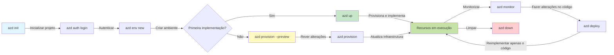
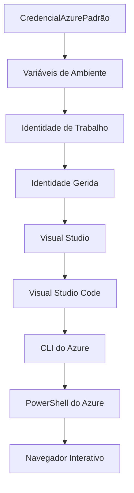

# Noções Básicas do AZD - Compreendendo o Azure Developer CLI

# Noções Básicas do AZD - Conceitos e Fundamentos Principais

**Navegação do Capítulo:**
- **📚 Página Inicial do Curso**: [AZD Para Iniciantes](../../README.md)
- **📖 Capítulo Atual**: Capítulo 1 - Fundamentos e Início Rápido
- **⬅️ Anterior**: [Visão Geral do Curso](../../README.md#-chapter-1-foundation--quick-start)
- **➡️ Próximo**: [Instalação e Configuração](installation.md)
- **🚀 Próximo Capítulo**: [Capítulo 2: Desenvolvimento com Foco em IA](../microsoft-foundry/microsoft-foundry-integration.md)

## Introdução

Esta lição apresenta o Azure Developer CLI (azd), uma ferramenta poderosa de linha de comando que acelera sua jornada do desenvolvimento local para a implantação no Azure. Você aprenderá os conceitos fundamentais, os principais recursos e entenderá como o azd simplifica a implantação de aplicações nativas na nuvem.

## Objetivos de Aprendizagem

Ao final desta lição, você será capaz de:
- Compreender o que é o Azure Developer CLI e seu principal propósito
- Aprender os conceitos principais de templates, ambientes e serviços
- Explorar recursos-chave, incluindo desenvolvimento orientado por templates e Infraestrutura como Código
- Entender a estrutura e o fluxo de trabalho de projetos azd
- Estar preparado para instalar e configurar o azd no seu ambiente de desenvolvimento

## Resultados de Aprendizagem

Após concluir esta lição, você será capaz de:
- Explicar o papel do azd nos fluxos de trabalho modernos de desenvolvimento em nuvem
- Identificar os componentes da estrutura de um projeto azd
- Descrever como templates, ambientes e serviços trabalham juntos
- Compreender os benefícios da Infraestrutura como Código com o azd
- Reconhecer diferentes comandos do azd e seus propósitos

## O que é o Azure Developer CLI (azd)?

O Azure Developer CLI (azd) é uma ferramenta de linha de comando projetada para acelerar sua jornada do desenvolvimento local para a implantação no Azure. Ele simplifica o processo de criação, implantação e gerenciamento de aplicações nativas na nuvem no Azure.

### 🎯 Por que usar o AZD? Uma Comparação do Mundo Real

Vamos comparar a implantação de uma aplicação web simples com banco de dados:

#### ❌ SEM AZD: Implantação Manual no Azure (30+ minutos)

```bash
# Passo 1: Criar grupo de recursos
az group create --name myapp-rg --location eastus

# Passo 2: Criar Plano de Serviço de Aplicações
az appservice plan create --name myapp-plan \
  --resource-group myapp-rg \
  --sku B1 --is-linux

# Passo 3: Criar Aplicação Web
az webapp create --name myapp-web-unique123 \
  --resource-group myapp-rg \
  --plan myapp-plan \
  --runtime "NODE:18-lts"

# Passo 4: Criar conta do Cosmos DB (10-15 minutos)
az cosmosdb create --name myapp-cosmos-unique123 \
  --resource-group myapp-rg \
  --kind MongoDB

# Passo 5: Criar base de dados
az cosmosdb mongodb database create \
  --account-name myapp-cosmos-unique123 \
  --resource-group myapp-rg \
  --name tododb

# Passo 6: Criar coleção
az cosmosdb mongodb collection create \
  --account-name myapp-cosmos-unique123 \
  --resource-group myapp-rg \
  --database-name tododb \
  --name todos

# Passo 7: Obter string de conexão
CONN_STR=$(az cosmosdb keys list \
  --name myapp-cosmos-unique123 \
  --resource-group myapp-rg \
  --type connection-strings \
  --query "connectionStrings[0].connectionString" -o tsv)

# Passo 8: Configurar definições da aplicação
az webapp config appsettings set \
  --name myapp-web-unique123 \
  --resource-group myapp-rg \
  --settings MONGODB_URI="$CONN_STR"

# Passo 9: Ativar registo de logs
az webapp log config --name myapp-web-unique123 \
  --resource-group myapp-rg \
  --application-logging filesystem \
  --detailed-error-messages true

# Passo 10: Configurar Application Insights
az monitor app-insights component create \
  --app myapp-insights \
  --location eastus \
  --resource-group myapp-rg

# Passo 11: Ligar App Insights à Aplicação Web
INSTRUMENTATION_KEY=$(az monitor app-insights component show \
  --app myapp-insights \
  --resource-group myapp-rg \
  --query "instrumentationKey" -o tsv)

az webapp config appsettings set \
  --name myapp-web-unique123 \
  --resource-group myapp-rg \
  --settings APPINSIGHTS_INSTRUMENTATIONKEY="$INSTRUMENTATION_KEY"

# Passo 12: Construir aplicação localmente
npm install
npm run build

# Passo 13: Criar pacote de implementação
zip -r app.zip . -x "*.git*" "node_modules/*"

# Passo 14: Implementar aplicação
az webapp deployment source config-zip \
  --resource-group myapp-rg \
  --name myapp-web-unique123 \
  --src app.zip

# Passo 15: Esperar e rezar para que funcione 🙏
# (Sem validação automatizada, é necessário teste manual)
```

**Problemas:**
- ❌ 15+ comandos para lembrar e executar na ordem correta
- ❌ 30-45 minutos de trabalho manual
- ❌ Fácil cometer erros (erros de digitação, parâmetros errados)
- ❌ Strings de conexão expostas no histórico do terminal
- ❌ Sem rollback automatizado se algo falhar
- ❌ Difícil de replicar para outros membros da equipe
- ❌ Diferente a cada vez (não reproduzível)

#### ✅ COM AZD: Implantação Automatizada (5 comandos, 10-15 minutos)

```bash
# Passo 1: Inicializar a partir do modelo
azd init --template todo-nodejs-mongo

# Passo 2: Autenticar
azd auth login

# Passo 3: Criar ambiente
azd env new dev

# Passo 4: Pré-visualizar alterações (opcional, mas recomendado)
azd provision --preview

# Passo 5: Implementar tudo
azd up

# ✨ Feito! Tudo está implementado, configurado e monitorizado
```

**Benefícios:**
- ✅ **5 comandos** vs. 15+ etapas manuais
- ✅ **10-15 minutos** no total (principalmente aguardando o Azure)
- ✅ **Zero erros** - automatizado e testado
- ✅ **Segredos gerenciados com segurança** via Key Vault
- ✅ **Rollback automático** em caso de falhas
- ✅ **Totalmente reproduzível** - mesmo resultado todas as vezes
- ✅ **Pronto para equipes** - qualquer pessoa pode implantar com os mesmos comandos
- ✅ **Infraestrutura como Código** - templates Bicep versionados
- ✅ **Monitoramento integrado** - Application Insights configurado automaticamente

### 📊 Redução de Tempo e Erros

| Métrica | Implantação Manual | Implantação com AZD | Melhoria |
|:-------|:------------------|:---------------|:------------|
| **Comandos** | 15+ | 5 | 67% a menos |
| **Tempo** | 30-45 min | 10-15 min | 60% mais rápido |
| **Taxa de Erros** | ~40% | <5% | 88% de redução |
| **Consistência** | Baixa (manual) | 100% (automatizada) | Perfeita |
| **Onboarding da Equipe** | 2-4 horas | 30 minutos | 75% mais rápido |
| **Tempo de Rollback** | 30+ min (manual) | 2 min (automatizado) | 93% mais rápido |

## Conceitos Principais

### Templates
Os templates são a base do azd. Eles contêm:
- **Código da aplicação** - Seu código-fonte e dependências
- **Definições de infraestrutura** - Recursos do Azure definidos em Bicep ou Terraform
- **Arquivos de configuração** - Configurações e variáveis de ambiente
- **Scripts de implantação** - Fluxos de trabalho de implantação automatizados

### Ambientes
Os ambientes representam diferentes alvos de implantação:
- **Desenvolvimento** - Para testes e desenvolvimento
- **Staging** - Ambiente pré-produção
- **Produção** - Ambiente de produção ao vivo

Cada ambiente mantém seu próprio:
- Grupo de recursos do Azure
- Configurações
- Estado de implantação

### Serviços
Os serviços são os blocos de construção da sua aplicação:
- **Frontend** - Aplicações web, SPAs
- **Backend** - APIs, microsserviços
- **Banco de Dados** - Soluções de armazenamento de dados
- **Armazenamento** - Armazenamento de arquivos e blobs

## Recursos Principais

### 1. Desenvolvimento Orientado por Templates
```bash
# Navegar pelos modelos disponíveis
azd template list

# Inicializar a partir de um modelo
azd init --template <template-name>
```

### 2. Infraestrutura como Código
- **Bicep** - Linguagem específica do domínio do Azure
- **Terraform** - Ferramenta de infraestrutura multi-nuvem
- **Templates ARM** - Templates do Azure Resource Manager

### 3. Fluxos de Trabalho Integrados
```bash
# Fluxo de trabalho de implementação completo
azd up            # Provisionar + Implementar, isto é automático para a configuração inicial

# 🧪 NOVO: Pré-visualizar alterações na infraestrutura antes da implementação (SEGURO)
azd provision --preview    # Simular a implementação da infraestrutura sem fazer alterações

azd provision     # Criar recursos Azure se atualizar a infraestrutura, use isto
azd deploy        # Implementar código da aplicação ou reimplementar código da aplicação após atualização
azd down          # Limpar recursos
```

#### 🛡️ Planejamento Seguro de Infraestrutura com Preview
O comando `azd provision --preview` é uma mudança de jogo para implantações seguras:
- **Análise de simulação** - Mostra o que será criado, modificado ou excluído
- **Risco zero** - Nenhuma alteração real é feita no seu ambiente Azure
- **Colaboração em equipe** - Compartilhe os resultados do preview antes da implantação
- **Estimativa de custos** - Entenda os custos dos recursos antes de se comprometer

```bash
# Exemplo de fluxo de trabalho de pré-visualização
azd provision --preview           # Veja o que irá mudar
# Reveja o resultado, discuta com a equipa
azd provision                     # Aplique as alterações com confiança
```

### 📊 Visual: Fluxo de Trabalho de Desenvolvimento com AZD


**Explicação do Fluxo de Trabalho:**
1. **Init** - Comece com um template ou novo projeto
2. **Auth** - Autentique-se com o Azure
3. **Environment** - Crie um ambiente de implantação isolado
4. **Preview** - 🆕 Sempre visualize as alterações de infraestrutura primeiro (prática segura)
5. **Provision** - Crie/atualize recursos do Azure
6. **Deploy** - Envie seu código da aplicação
7. **Monitor** - Observe o desempenho da aplicação
8. **Iterate** - Faça alterações e reimplante o código
9. **Cleanup** - Remova os recursos quando terminar

### 4. Gerenciamento de Ambientes
```bash
# Criar e gerir ambientes
azd env new <environment-name>
azd env select <environment-name>
azd env list
```

## 📁 Estrutura do Projeto

Uma estrutura típica de projeto azd:
```
my-app/
├── .azd/                    # azd configuration
│   └── config.json
├── .azure/                  # Azure deployment artifacts
├── .devcontainer/          # Development container config
├── .github/workflows/      # GitHub Actions
├── .vscode/               # VS Code settings
├── infra/                 # Infrastructure code
│   ├── main.bicep        # Main infrastructure template
│   ├── main.parameters.json
│   └── modules/          # Reusable modules
├── src/                  # Application source code
│   ├── api/             # Backend services
│   └── web/             # Frontend application
├── azure.yaml           # azd project configuration
└── README.md
```

## 🔧 Arquivos de Configuração

### azure.yaml
O principal arquivo de configuração do projeto:
```yaml
name: my-awesome-app
metadata:
  template: my-template@1.0.0

services:
  web:
    project: ./src/web
    language: js
    host: appservice
  api:
    project: ./src/api
    language: js
    host: appservice

hooks:
  preprovision:
    shell: pwsh
    run: echo "Preparing to provision..."
```

### .azure/config.json
Configuração específica do ambiente:
```json
{
  "version": 1,
  "defaultEnvironment": "dev",
  "environments": {
    "dev": {
      "subscriptionId": "your-subscription-id",
      "location": "eastus"
    }
  }
}
```

## 🎪 Fluxos de Trabalho Comuns com Exercícios Práticos

> **💡 Dica de Aprendizagem:** Siga esses exercícios na ordem para desenvolver suas habilidades com o AZD progressivamente.

### 🎯 Exercício 1: Inicialize Seu Primeiro Projeto

**Objetivo:** Criar um projeto AZD e explorar sua estrutura

**Passos:**
```bash
# Use um modelo comprovado
azd init --template todo-nodejs-mongo

# Explore os ficheiros gerados
ls -la  # Veja todos os ficheiros, incluindo os ocultos

# Ficheiros principais criados:
# - azure.yaml (configuração principal)
# - infra/ (código de infraestrutura)
# - src/ (código da aplicação)
```

**✅ Sucesso:** Você terá os diretórios azure.yaml, infra/ e src/

---

### 🎯 Exercício 2: Implantar no Azure

**Objetivo:** Concluir a implantação de ponta a ponta

**Passos:**
```bash
# 1. Autenticar
az login && azd auth login

# 2. Criar ambiente
azd env new dev
azd env set AZURE_LOCATION eastus

# 3. Pré-visualizar alterações (RECOMENDADO)
azd provision --preview

# 4. Implementar tudo
azd up

# 5. Verificar implementação
azd show    # Ver o URL da sua aplicação
```

**Tempo Estimado:** 10-15 minutos  
**✅ Sucesso:** URL da aplicação aberta no navegador

---

### 🎯 Exercício 3: Múltiplos Ambientes

**Objetivo:** Implantar em dev e staging

**Passos:**
```bash
# Já tem dev, criar staging
azd env new staging
azd env set AZURE_LOCATION westus2
azd up

# Alternar entre eles
azd env list
azd env select dev
```

**✅ Sucesso:** Dois grupos de recursos separados no Portal do Azure

---

### 🛡️ Limpeza Completa: `azd down --force --purge`

Quando você precisar reiniciar completamente:

```bash
azd down --force --purge
```

**O que faz:**
- `--force`: Sem prompts de confirmação
- `--purge`: Exclui todo o estado local e recursos do Azure

**Use quando:**
- A implantação falhou no meio do processo
- Mudando de projetos
- Necessidade de um novo começo

---

## 🎪 Referência do Fluxo de Trabalho Original

### Iniciando um Novo Projeto
```bash
# Método 1: Usar modelo existente
azd init --template todo-nodejs-mongo

# Método 2: Começar do zero
azd init

# Método 3: Usar o diretório atual
azd init .
```

### Ciclo de Desenvolvimento
```bash
# Configurar o ambiente de desenvolvimento
azd auth login
azd env new dev
azd env select dev

# Implementar tudo
azd up

# Fazer alterações e reimplementar
azd deploy

# Limpar quando terminar
azd down --force --purge # o comando na Azure Developer CLI é um **reset completo** para o seu ambiente—especialmente útil quando está a resolver problemas de implementações falhadas, a limpar recursos órfãos ou a preparar para uma nova reimplementação.
```

## Compreendendo `azd down --force --purge`
O comando `azd down --force --purge` é uma maneira poderosa de desmontar completamente seu ambiente azd e todos os recursos associados. Aqui está um detalhamento do que cada flag faz:
```
--force
```
- Ignora prompts de confirmação.
- Útil para automação ou scripts onde a entrada manual não é viável.
- Garante que a desmontagem prossiga sem interrupções, mesmo se o CLI detectar inconsistências.

```
--purge
```
Exclui **todos os metadados associados**, incluindo:
Estado do ambiente  
Pasta local `.azure`  
Informações de implantação em cache  
Evita que o azd "lembre" implantações anteriores, o que pode causar problemas como grupos de recursos incompatíveis ou referências de registro obsoletas.

### Por que usar ambos?
Quando você encontra problemas com `azd up` devido a estado residual ou implantações parciais, essa combinação garante um **novo começo**.

É especialmente útil após exclusões manuais de recursos no portal do Azure ou ao alternar templates, ambientes ou convenções de nomenclatura de grupos de recursos.

### Gerenciando Múltiplos Ambientes
```bash
# Criar ambiente de staging
azd env new staging
azd env select staging
azd up

# Voltar para dev
azd env select dev

# Comparar ambientes
azd env list
```

## 🔐 Autenticação e Credenciais

Compreender a autenticação é crucial para implantações bem-sucedidas com o azd. O Azure utiliza vários métodos de autenticação, e o azd aproveita a mesma cadeia de credenciais usada por outras ferramentas do Azure.

### Autenticação com Azure CLI (`az login`)

Antes de usar o azd, você precisa se autenticar com o Azure. O método mais comum é usando o Azure CLI:

```bash
# Login interativo (abre o navegador)
az login

# Login com inquilino específico
az login --tenant <tenant-id>

# Login com principal de serviço
az login --service-principal -u <app-id> -p <password> --tenant <tenant-id>

# Verificar estado atual do login
az account show

# Listar subscrições disponíveis
az account list --output table

# Definir subscrição padrão
az account set --subscription <subscription-id>
```

### Fluxo de Autenticação
1. **Login Interativo**: Abre seu navegador padrão para autenticação
2. **Fluxo de Código de Dispositivo**: Para ambientes sem acesso ao navegador
3. **Principal de Serviço**: Para cenários de automação e CI/CD
4. **Identidade Gerenciada**: Para aplicações hospedadas no Azure

### Cadeia de Credenciais DefaultAzureCredential

`DefaultAzureCredential` é um tipo de credencial que fornece uma experiência de autenticação simplificada, tentando automaticamente várias fontes de credenciais em uma ordem específica:

#### Ordem da Cadeia de Credenciais

#### 1. Variáveis de Ambiente
```bash
# Definir variáveis de ambiente para o principal de serviço
export AZURE_CLIENT_ID="<app-id>"
export AZURE_CLIENT_SECRET="<password>"
export AZURE_TENANT_ID="<tenant-id>"
```

#### 2. Identidade de Trabalho (Kubernetes/GitHub Actions)
Usado automaticamente em:
- Azure Kubernetes Service (AKS) com Identidade de Trabalho
- GitHub Actions com federação OIDC
- Outros cenários de identidade federada

#### 3. Identidade Gerenciada
Para recursos do Azure como:
- Máquinas Virtuais
- App Service
- Azure Functions
- Instâncias de Contêiner

```bash
# Verificar se está a ser executado num recurso Azure com identidade gerida
az account show --query "user.type" --output tsv
# Retorna: "servicePrincipal" se estiver a usar identidade gerida
```

#### 4. Integração com Ferramentas de Desenvolvimento
- **Visual Studio**: Usa automaticamente a conta conectada
- **VS Code**: Usa credenciais da extensão Azure Account
- **Azure CLI**: Usa credenciais do `az login` (mais comum para desenvolvimento local)

### Configuração de Autenticação do AZD

```bash
# Método 1: Usar Azure CLI (Recomendado para desenvolvimento)
az login
azd auth login  # Usa credenciais existentes do Azure CLI

# Método 2: Autenticação direta azd
azd auth login --use-device-code  # Para ambientes sem interface gráfica

# Método 3: Verificar estado da autenticação
azd auth login --check-status

# Método 4: Terminar sessão e reautenticar
azd auth logout
azd auth login
```

### Melhores Práticas de Autenticação

#### Para Desenvolvimento Local
```bash
# 1. Iniciar sessão com o Azure CLI
az login

# 2. Verificar a subscrição correta
az account show
az account set --subscription "Your Subscription Name"

# 3. Usar azd com credenciais existentes
azd auth login
```

#### Para Pipelines CI/CD
```yaml
# GitHub Actions example
- name: Azure Login
  uses: azure/login@v1
  with:
    creds: ${{ secrets.AZURE_CREDENTIALS }}

- name: Deploy with azd
  run: |
    azd auth login --client-id ${{ secrets.AZURE_CLIENT_ID }} \
                    --client-secret ${{ secrets.AZURE_CLIENT_SECRET }} \
                    --tenant-id ${{ secrets.AZURE_TENANT_ID }}
    azd up --no-prompt
```

#### Para Ambientes de Produção
- Use **Identidade Gerenciada** ao executar em recursos do Azure
- Use **Principal de Serviço** para cenários de automação
- Evite armazenar credenciais em código ou arquivos de configuração
- Use **Azure Key Vault** para configurações sensíveis

### Problemas Comuns de Autenticação e Soluções

#### Problema: "Nenhuma assinatura encontrada"
```bash
# Solução: Definir subscrição padrão
az account list --output table
az account set --subscription "<subscription-id>"
azd env set AZURE_SUBSCRIPTION_ID "<subscription-id>"
```

#### Problema: "Permissões insuficientes"
```bash
# Solução: Verificar e atribuir funções necessárias
az role assignment list --assignee $(az account show --query user.name --output tsv)

# Funções necessárias comuns:
# - Contribuidor (para gestão de recursos)
# - Administrador de Acesso de Utilizador (para atribuições de funções)
```

#### Problema: "Token expirado"
```bash
# Solução: Reautenticar
az logout
az login
azd auth logout
azd auth login
```

### Autenticação em Diferentes Cenários

#### Desenvolvimento Local
```bash
# Conta de desenvolvimento pessoal
az login
azd auth login
```

#### Desenvolvimento em Equipe
```bash
# Usar inquilino específico para a organização
az login --tenant contoso.onmicrosoft.com
azd auth login
```

#### Cenários Multi-inquilino
```bash
# Alternar entre inquilinos
az login --tenant tenant1.onmicrosoft.com
# Implementar no inquilino 1
azd up

az login --tenant tenant2.onmicrosoft.com  
# Implementar no inquilino 2
azd up
```

### Considerações de Segurança

1. **Armazenamento de Credenciais**: Nunca armazene credenciais no código-fonte
2. **Limitação de Escopo**: Use o princípio de menor privilégio para principais de serviço
3. **Rotação de Tokens**: Gire regularmente os segredos dos principais de serviço
4. **Trilha de Auditoria**: Monitore atividades de autenticação e implantação
5. **Segurança de Rede**: Use endpoints privados sempre que possível

### Solução de Problemas de Autenticação

```bash
# Depurar problemas de autenticação
azd auth login --check-status
az account show
az account get-access-token

# Comandos de diagnóstico comuns
whoami                          # Contexto do utilizador atual
az ad signed-in-user show      # Detalhes do utilizador do Azure AD
az group list                  # Testar acesso a recursos
```

## Compreendendo `azd down --force --purge`

### Descoberta
```bash
azd template list              # Procurar modelos
azd template show <template>   # Detalhes do modelo
azd init --help               # Opções de inicialização
```

### Gerenciamento de Projetos
```bash
azd show                     # Visão geral do projeto
azd env show                 # Ambiente atual
azd config list             # Configurações de configuração
```

### Monitoramento
```bash
azd monitor                  # Abrir o portal do Azure
azd pipeline config          # Configurar CI/CD
azd logs                     # Ver registos da aplicação
```

## Melhores Práticas

### 1. Use Nomes Significativos
```bash
# Bom
azd env new production-east
azd init --template web-app-secure

# Evitar
azd env new env1
azd init --template template1
```

### 2. Aproveite os Templates
- Comece com templates existentes
- Personalize para suas necessidades
- Crie templates reutilizáveis para sua organização

### 3. Isolamento de Ambientes
- Use ambientes separados para dev/staging/prod
- Nunca implante diretamente na produção a partir da máquina local
- Use pipelines CI/CD para implantações em produção

### 4. Gerenciamento de Configuração
- Use variáveis de ambiente para dados sensíveis
- Mantenha a configuração no controle de versão
- Documente configurações específicas de ambiente

## Progressão de Aprendizagem

### Iniciante (Semana 1-2)
1. Instale o azd e autentique-se
2. Implante um template simples
3. Entenda a estrutura do projeto
4. Aprenda comandos básicos (up, down, deploy)

### Intermediário (Semana 3-4)
1. Personalize templates
2. Gerencie múltiplos ambientes
3. Entenda o código de infraestrutura
4. Configure pipelines CI/CD

### Avançado (Semana 5+)
1. Crie templates personalizados
2. Padrões avançados de infraestrutura
3. Implantações multi-região
4. Configurações de nível empresarial

## Próximos Passos

**📖 Continue o Aprendizado do Capítulo 1:**
- [Instalação e Configuração](installation.md) - Instale e configure o azd
- [O Seu Primeiro Projeto](first-project.md) - Tutorial prático completo
- [Guia de Configuração](configuration.md) - Opções avançadas de configuração

**🎯 Pronto para o Próximo Capítulo?**
- [Capítulo 2: Desenvolvimento com Foco em IA](../microsoft-foundry/microsoft-foundry-integration.md) - Comece a criar aplicações de IA

## Recursos Adicionais

- [Visão Geral do Azure Developer CLI](https://learn.microsoft.com/en-us/azure/developer/azure-developer-cli/)
- [Galeria de Modelos](https://azure.github.io/awesome-azd/)
- [Exemplos da Comunidade](https://github.com/Azure-Samples)

---

## 🙋 Perguntas Frequentes

### Perguntas Gerais

**P: Qual é a diferença entre AZD e Azure CLI?**

R: O Azure CLI (`az`) é usado para gerir recursos individuais do Azure. O AZD (`azd`) é usado para gerir aplicações completas:

```bash
# Azure CLI - Gestão de recursos de baixo nível
az webapp create --name myapp --resource-group rg
az sql server create --name myserver --resource-group rg
# ...muitos mais comandos necessários

# AZD - Gestão a nível de aplicação
azd up  # Implementa a aplicação inteira com todos os recursos
```

**Pense desta forma:**
- `az` = Operar em peças individuais de Lego
- `azd` = Trabalhar com conjuntos completos de Lego

---

**P: Preciso saber Bicep ou Terraform para usar o AZD?**

R: Não! Comece com os modelos:
```bash
# Usar modelo existente - não é necessário conhecimento de IaC
azd init --template todo-nodejs-mongo
azd up
```

Pode aprender Bicep mais tarde para personalizar a infraestrutura. Os modelos fornecem exemplos práticos para aprender.

---

**P: Quanto custa executar os modelos do AZD?**

R: Os custos variam por modelo. A maioria dos modelos de desenvolvimento custa entre $50-150/mês:

```bash
# Pré-visualizar os custos antes de implementar
azd provision --preview

# Limpar sempre quando não estiver a usar
azd down --force --purge  # Remove todos os recursos
```

**Dica profissional:** Use os níveis gratuitos quando disponíveis:
- App Service: Nível F1 (Gratuito)
- Azure OpenAI: 50.000 tokens/mês gratuitos
- Cosmos DB: Nível gratuito de 1000 RU/s

---

**P: Posso usar o AZD com recursos existentes do Azure?**

R: Sim, mas é mais fácil começar do zero. O AZD funciona melhor quando gere todo o ciclo de vida. Para recursos existentes:

```bash
# Opção 1: Importar recursos existentes (avançado)
azd init
# Depois modifique infra/ para referenciar recursos existentes

# Opção 2: Começar do zero (recomendado)
azd init --template matching-your-stack
azd up  # Cria um novo ambiente
```

---

**P: Como partilho o meu projeto com colegas de equipa?**

R: Faça commit do projeto AZD no Git (mas NÃO da pasta .azure):

```bash
# Já está em .gitignore por padrão
.azure/        # Contém segredos e dados de ambiente
*.env          # Variáveis de ambiente

# Membros da equipa então:
git clone <your-repo>
azd auth login
azd env new <their-name>-dev
azd up
```

Todos terão infraestrutura idêntica a partir dos mesmos modelos.

---

### Perguntas de Resolução de Problemas

**P: O comando "azd up" falhou a meio. O que faço?**

R: Verifique o erro, corrija-o e tente novamente:

```bash
# Ver logs detalhados
azd show

# Correções comuns:

# 1. Se o limite foi excedido:
azd env set AZURE_LOCATION "westus2"  # Tente uma região diferente

# 2. Se houver conflito no nome do recurso:
azd down --force --purge  # Recomeçar do zero
azd up  # Tentar novamente

# 3. Se a autenticação expirou:
az login
azd auth login
azd up
```

**Problema mais comum:** Subscrição do Azure errada selecionada
```bash
az account list --output table
az account set --subscription "<correct-subscription>"
```

---

**P: Como faço para implementar apenas alterações no código sem reprovisionar?**

R: Use `azd deploy` em vez de `azd up`:

```bash
azd up          # Primeira vez: provisionar + implementar (lento)

# Fazer alterações no código...

azd deploy      # Vezes subsequentes: apenas implementar (rápido)
```

Comparação de velocidade:
- `azd up`: 10-15 minutos (provisiona infraestrutura)
- `azd deploy`: 2-5 minutos (apenas código)

---

**P: Posso personalizar os modelos de infraestrutura?**

R: Sim! Edite os ficheiros Bicep na pasta `infra/`:

```bash
# Após azd init
cd infra/
code main.bicep  # Editar no VS Code

# Pré-visualizar alterações
azd provision --preview

# Aplicar alterações
azd provision
```

**Dica:** Comece pequeno - altere os SKUs primeiro:
```bicep
// infra/main.bicep
sku: {
  name: 'B1'  // Change to 'P1V2' for production
}
```

---

**P: Como apago tudo o que o AZD criou?**

R: Um comando remove todos os recursos:

```bash
azd down --force --purge

# Isto elimina:
# - Todos os recursos do Azure
# - Grupo de recursos
# - Estado do ambiente local
# - Dados de implementação em cache
```

**Execute sempre isto quando:**
- Terminar de testar um modelo
- Trocar para um projeto diferente
- Quiser começar do zero

**Poupança de custos:** Apagar recursos não utilizados = $0 de encargos

---

**P: E se eu apagar recursos acidentalmente no Portal do Azure?**

R: O estado do AZD pode ficar desatualizado. Abordagem de "folha limpa":

```bash
# 1. Remover estado local
azd down --force --purge

# 2. Começar de novo
azd up

# Alternativa: Deixar o AZD detetar e corrigir
azd provision  # Irá criar recursos em falta
```

---

### Perguntas Avançadas

**P: Posso usar o AZD em pipelines CI/CD?**

R: Sim! Exemplo com GitHub Actions:

```yaml
# .github/workflows/deploy.yml
name: Deploy with AZD

on:
  push:
    branches: [main]

jobs:
  deploy:
    runs-on: ubuntu-latest
    steps:
      - uses: actions/checkout@v2
      
      - name: Install azd
        run: curl -fsSL https://aka.ms/install-azd.sh | bash
      
      - name: Azure Login
        run: |
          azd auth login \
            --client-id ${{ secrets.AZURE_CLIENT_ID }} \
            --client-secret ${{ secrets.AZURE_CLIENT_SECRET }} \
            --tenant-id ${{ secrets.AZURE_TENANT_ID }}
      
      - name: Deploy
        run: azd up --no-prompt
```

---

**P: Como lido com segredos e dados sensíveis?**

R: O AZD integra-se automaticamente com o Azure Key Vault:

```bash
# Os segredos são armazenados no Key Vault, não no código
azd env set DATABASE_PASSWORD "$(openssl rand -base64 32)"

# O AZD automaticamente:
# 1. Cria o Key Vault
# 2. Armazena o segredo
# 3. Concede acesso à aplicação através de Identidade Gerida
# 4. Injeta em tempo de execução
```

**Nunca faça commit de:**
- Pasta `.azure/` (contém dados do ambiente)
- Ficheiros `.env` (segredos locais)
- Strings de conexão

---

**P: Posso implementar em várias regiões?**

R: Sim, crie um ambiente por região:

```bash
# Ambiente Leste dos EUA
azd env new prod-eastus
azd env set AZURE_LOCATION eastus
azd up

# Ambiente Oeste da Europa
azd env new prod-westeurope
azd env set AZURE_LOCATION westeurope
azd up

# Cada ambiente é independente
azd env list
```

Para aplicações verdadeiramente multi-região, personalize os modelos Bicep para implementar em várias regiões simultaneamente.

---

**P: Onde posso obter ajuda se estiver com dificuldades?**

1. **Documentação do AZD:** https://learn.microsoft.com/azure/developer/azure-developer-cli/
2. **GitHub Issues:** https://github.com/Azure/azure-dev/issues
3. **Discord:** [Azure Discord](https://discord.gg/microsoft-azure) - Canal #azure-developer-cli
4. **Stack Overflow:** Tag `azure-developer-cli`
5. **Este Curso:** [Guia de Resolução de Problemas](../troubleshooting/common-issues.md)

**Dica profissional:** Antes de perguntar, execute:
```bash
azd show       # Mostra o estado atual
azd version    # Mostra a sua versão
```
Inclua esta informação na sua pergunta para obter ajuda mais rapidamente.

---

## 🎓 O Que Vem a Seguir?

Agora compreende os fundamentos do AZD. Escolha o seu caminho:

### 🎯 Para Iniciantes:
1. **Próximo:** [Instalação e Configuração](installation.md) - Instale o AZD na sua máquina
2. **Depois:** [O Seu Primeiro Projeto](first-project.md) - Implemente a sua primeira aplicação
3. **Pratique:** Complete os 3 exercícios desta lição

### 🚀 Para Desenvolvedores de IA:
1. **Avance para:** [Capítulo 2: Desenvolvimento com Foco em IA](../microsoft-foundry/microsoft-foundry-integration.md)
2. **Implemente:** Comece com `azd init --template get-started-with-ai-chat`
3. **Aprenda:** Construa enquanto implementa

### 🏗️ Para Desenvolvedores Experientes:
1. **Revise:** [Guia de Configuração](configuration.md) - Configurações avançadas
2. **Explore:** [Infraestrutura como Código](../deployment/provisioning.md) - Detalhes sobre Bicep
3. **Construa:** Crie modelos personalizados para a sua stack

---

**Navegação do Capítulo:**
- **📚 Página Inicial do Curso**: [AZD Para Iniciantes](../../README.md)
- **📖 Capítulo Atual**: Capítulo 1 - Fundamentos e Início Rápido  
- **⬅️ Anterior**: [Visão Geral do Curso](../../README.md#-chapter-1-foundation--quick-start)
- **➡️ Próximo**: [Instalação e Configuração](installation.md)
- **🚀 Próximo Capítulo**: [Capítulo 2: Desenvolvimento com Foco em IA](../microsoft-foundry/microsoft-foundry-integration.md)

---

<!-- CO-OP TRANSLATOR DISCLAIMER START -->
**Aviso Legal**:  
Este documento foi traduzido utilizando o serviço de tradução por IA [Co-op Translator](https://github.com/Azure/co-op-translator). Embora nos esforcemos para garantir a precisão, esteja ciente de que traduções automáticas podem conter erros ou imprecisões. O documento original no seu idioma nativo deve ser considerado a fonte autoritária. Para informações críticas, recomenda-se uma tradução profissional humana. Não nos responsabilizamos por quaisquer mal-entendidos ou interpretações incorretas resultantes do uso desta tradução.
<!-- CO-OP TRANSLATOR DISCLAIMER END -->