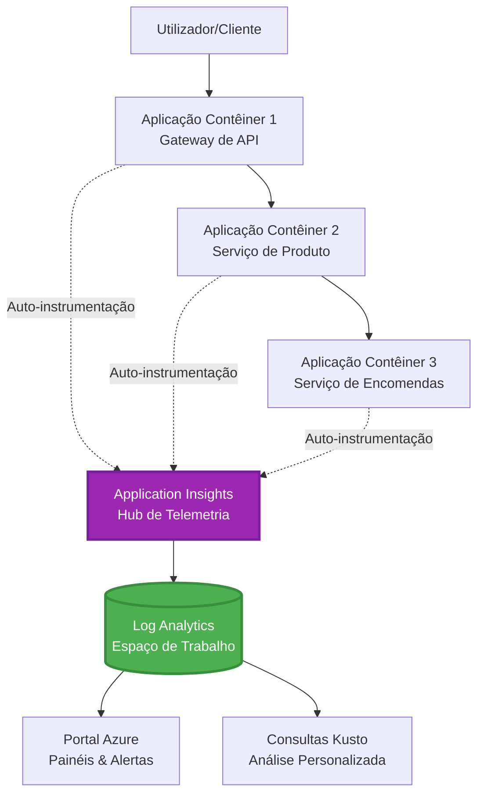
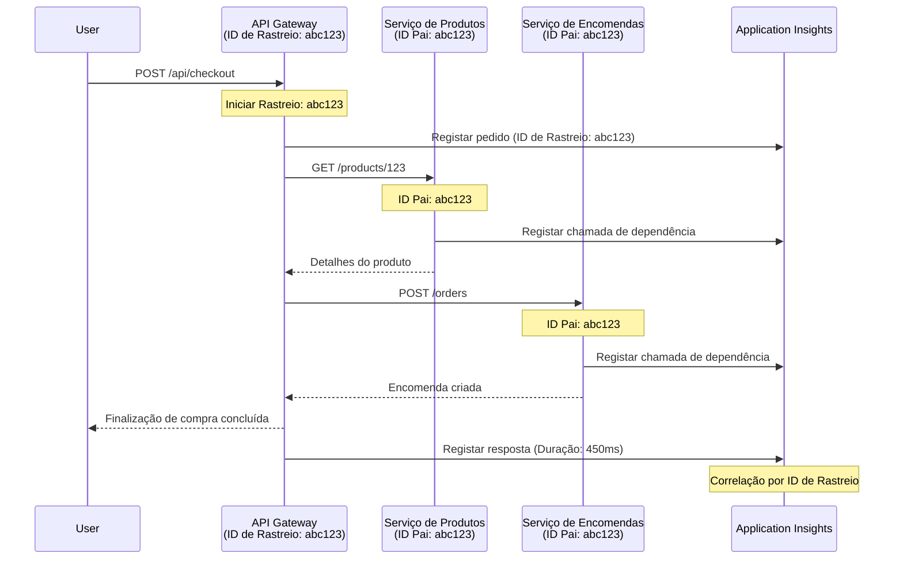

# Integração do Application Insights com AZD

⏱️ **Tempo Estimado**: 40-50 minutos | 💰 **Impacto de Custo**: ~$5-15/mês | ⭐ **Complexidade**: Intermediário

**📚 Caminho de Aprendizagem:**
- ← Anterior: [Verificações Preliminares](preflight-checks.md) - Validação pré-implantação
- 🎯 **Você Está Aqui**: Integração do Application Insights (Monitorização, telemetria, depuração)
- → Próximo: [Guia de Implantação](../deployment/deployment-guide.md) - Implantação no Azure
- 🏠 [Página Inicial do Curso](../../README.md)

---

## O Que Você Vai Aprender

Ao concluir esta lição, você será capaz de:
- Integrar **Application Insights** automaticamente em projetos AZD
- Configurar **rastreamento distribuído** para microsserviços
- Implementar **telemetria personalizada** (métricas, eventos, dependências)
- Configurar **métricas ao vivo** para monitorização em tempo real
- Criar **alertas e dashboards** a partir de implantações AZD
- Depurar problemas de produção com **consultas de telemetria**
- Otimizar **custos e estratégias de amostragem**
- Monitorizar **aplicações de IA/LLM** (tokens, latência, custos)

## Por Que o Application Insights com AZD é Importante

### O Desafio: Observabilidade em Produção

**Sem Application Insights:**
```
❌ No visibility into production behavior
❌ Manual log aggregation across services
❌ Reactive debugging (wait for customer complaints)
❌ No performance metrics
❌ Cannot trace requests across services
❌ Unknown failure rates and bottlenecks
```

**Com Application Insights + AZD:**
```
✅ Automatic telemetry collection
✅ Centralized logs from all services
✅ Proactive issue detection
✅ End-to-end request tracing
✅ Performance metrics and insights
✅ Real-time dashboards
✅ AZD provisions everything automatically
```

**Analogia**: O Application Insights é como ter uma "caixa preta" de gravador de voo + painel de controle para sua aplicação. Você vê tudo o que está acontecendo em tempo real e pode reproduzir qualquer incidente.

---

## Visão Geral da Arquitetura

### Application Insights na Arquitetura AZD


```mermaid
graph TB
    User[Utilizador/Cliente]
    App1[Aplicação Contêiner 1<br/>Gateway de API]
    App2[Aplicação Contêiner 2<br/>Serviço de Produto]
    App3[Aplicação Contêiner 3<br/>Serviço de Encomendas]
    
    AppInsights[Application Insights<br/>Hub de Telemetria]
    LogAnalytics[(Log Analytics<br/>Espaço de Trabalho)]
    
    Portal[Portal Azure<br/>Painéis & Alertas]
    Query[Consultas Kusto<br/>Análise Personalizada]
    
    User --> App1
    App1 --> App2
    App2 --> App3
    
    App1 -.->|Auto-instrumentação| AppInsights
    App2 -.->|Auto-instrumentação| AppInsights
    App3 -.->|Auto-instrumentação| AppInsights
    
    AppInsights --> LogAnalytics
    LogAnalytics --> Portal
    LogAnalytics --> Query
    
    style AppInsights fill:#9C27B0,stroke:#7B1FA2,stroke-width:3px,color:#fff
    style LogAnalytics fill:#4CAF50,stroke:#388E3C,stroke-width:3px,color:#fff
```
### O Que é Monitorizado Automaticamente

| Tipo de Telemetria | O Que Captura | Caso de Uso |
|--------------------|---------------|-------------|
| **Requests**       | Requisições HTTP, códigos de status, duração | Monitorização de desempenho de API |
| **Dependencies**   | Chamadas externas (DB, APIs, armazenamento) | Identificar gargalos |
| **Exceptions**     | Erros não tratados com rastreamento de pilha | Depuração de falhas |
| **Custom Events**  | Eventos de negócios (registo, compra) | Análise e funis |
| **Metrics**        | Contadores de desempenho, métricas personalizadas | Planeamento de capacidade |
| **Traces**         | Mensagens de log com severidade | Depuração e auditoria |
| **Availability**   | Testes de tempo de atividade e tempo de resposta | Monitorização de SLA |

---

## Pré-requisitos

### Ferramentas Necessárias

```bash
# Verificar Azure Developer CLI
azd version
# ✅ Esperado: azd versão 1.0.0 ou superior

# Verificar Azure CLI
az --version
# ✅ Esperado: azure-cli 2.50.0 ou superior
```

### Requisitos do Azure

- Assinatura ativa do Azure
- Permissões para criar:
  - Recursos do Application Insights
  - Workspaces do Log Analytics
  - Container Apps
  - Grupos de recursos

### Pré-requisitos de Conhecimento

Você deve ter concluído:
- [Fundamentos do AZD](../getting-started/azd-basics.md) - Conceitos principais do AZD
- [Configuração](../getting-started/configuration.md) - Configuração do ambiente
- [Primeiro Projeto](../getting-started/first-project.md) - Implantação básica

---

## Lição 1: Application Insights Automático com AZD

### Como o AZD Provisiona o Application Insights

O AZD cria e configura automaticamente o Application Insights ao implantar. Vamos ver como funciona.

### Estrutura do Projeto

```
monitored-app/
├── azure.yaml                     # AZD configuration
├── infra/
│   ├── main.bicep                # Main infrastructure
│   ├── core/
│   │   └── monitoring.bicep      # Application Insights + Log Analytics
│   └── app/
│       └── api.bicep             # Container App with monitoring
└── src/
    ├── app.py                    # Application with telemetry
    ├── requirements.txt
    └── Dockerfile
```

---

### Passo 1: Configurar AZD (azure.yaml)

**Arquivo: `azure.yaml`**

```yaml
name: monitored-app
metadata:
  template: monitored-app@1.0.0

services:
  api:
    project: ./src
    language: python
    host: containerapp

# AZD automatically provisions monitoring!
```

**É isso!** O AZD criará o Application Insights por padrão. Nenhuma configuração extra é necessária para monitorização básica.

---

### Passo 2: Infraestrutura de Monitorização (Bicep)

**Arquivo: `infra/core/monitoring.bicep`**

```bicep
param logAnalyticsName string
param applicationInsightsName string
param location string = resourceGroup().location
param tags object = {}

// Log Analytics Workspace (required for Application Insights)
resource logAnalytics 'Microsoft.OperationalInsights/workspaces@2022-10-01' = {
  name: logAnalyticsName
  location: location
  tags: tags
  properties: {
    sku: {
      name: 'PerGB2018'  // Pay-as-you-go pricing
    }
    retentionInDays: 30  // Keep logs for 30 days
    features: {
      enableLogAccessUsingOnlyResourcePermissions: true
    }
  }
}

// Application Insights
resource applicationInsights 'Microsoft.Insights/components@2020-02-02' = {
  name: applicationInsightsName
  location: location
  tags: tags
  kind: 'web'
  properties: {
    Application_Type: 'web'
    WorkspaceResourceId: logAnalytics.id
    IngestionMode: 'LogAnalytics'
    publicNetworkAccessForIngestion: 'Enabled'
    publicNetworkAccessForQuery: 'Enabled'
  }
}

// Outputs for Container Apps
output logAnalyticsWorkspaceId string = logAnalytics.id
output logAnalyticsWorkspaceName string = logAnalytics.name
output applicationInsightsConnectionString string = applicationInsights.properties.ConnectionString
output applicationInsightsInstrumentationKey string = applicationInsights.properties.InstrumentationKey
output applicationInsightsName string = applicationInsights.name
```

---

### Passo 3: Conectar Container App ao Application Insights

**Arquivo: `infra/app/api.bicep`**

```bicep
param name string
param location string
param tags object = {}
param containerAppsEnvironmentName string
param applicationInsightsConnectionString string

resource containerApp 'Microsoft.App/containerApps@2023-05-01' = {
  name: name
  location: location
  tags: tags
  properties: {
    configuration: {
      ingress: {
        external: true
        targetPort: 8000
      }
      secrets: [
        {
          name: 'appinsights-connection-string'
          value: applicationInsightsConnectionString
        }
      ]
    }
    template: {
      containers: [
        {
          name: 'api'
          image: 'myregistry.azurecr.io/api:latest'
          resources: {
            cpu: json('0.5')
            memory: '1Gi'
          }
          env: [
            {
              name: 'APPLICATIONINSIGHTS_CONNECTION_STRING'
              secretRef: 'appinsights-connection-string'
            }
            {
              name: 'APPLICATIONINSIGHTS_ENABLED'
              value: 'true'
            }
          ]
        }
      ]
    }
  }
}

output uri string = 'https://${containerApp.properties.configuration.ingress.fqdn}'
```

---

### Passo 4: Código da Aplicação com Telemetria

**Arquivo: `src/app.py`**

```python
from flask import Flask, request, jsonify
from opencensus.ext.azure.log_exporter import AzureLogHandler
from opencensus.ext.azure.trace_exporter import AzureExporter
from opencensus.ext.flask.flask_middleware import FlaskMiddleware
from opencensus.trace.samplers import ProbabilitySampler
import logging
import os

app = Flask(__name__)

# Obter a string de conexão do Application Insights
connection_string = os.environ.get('APPLICATIONINSIGHTS_CONNECTION_STRING')

if connection_string:
    # Configurar rastreamento distribuído
    middleware = FlaskMiddleware(
        app,
        exporter=AzureExporter(connection_string=connection_string),
        sampler=ProbabilitySampler(rate=1.0)  # 100% de amostragem para desenvolvimento
    )
    
    # Configurar registo
    logger = logging.getLogger(__name__)
    logger.addHandler(AzureLogHandler(connection_string=connection_string))
    logger.setLevel(logging.INFO)
    
    print("✅ Application Insights enabled")
else:
    logger = logging.getLogger(__name__)
    logger.setLevel(logging.INFO)
    print("⚠️ Application Insights not configured")

@app.route('/health')
def health():
    logger.info('Health check endpoint called')
    return jsonify({'status': 'healthy', 'monitoring': 'enabled'})

@app.route('/api/products')
def get_products():
    logger.info('Fetching products')
    
    # Simular chamada de base de dados (rastreada automaticamente como dependência)
    products = [
        {'id': 1, 'name': 'Laptop', 'price': 999.99},
        {'id': 2, 'name': 'Mouse', 'price': 29.99},
        {'id': 3, 'name': 'Keyboard', 'price': 79.99}
    ]
    
    logger.info(f'Returned {len(products)} products')
    return jsonify(products)

@app.route('/api/error-test')
def error_test():
    """Test error tracking"""
    logger.error('Testing error tracking')
    try:
        raise ValueError('This is a test exception')
    except Exception as e:
        logger.exception('Exception occurred in error-test endpoint')
        return jsonify({'error': str(e)}), 500

@app.route('/api/slow')
def slow_endpoint():
    """Test performance tracking"""
    import time
    logger.info('Slow endpoint called')
    time.sleep(3)  # Simular operação lenta
    logger.warning('Endpoint took 3 seconds to respond')
    return jsonify({'message': 'Slow operation completed'})

if __name__ == '__main__':
    app.run(host='0.0.0.0', port=8000)
```

**Arquivo: `src/requirements.txt`**

```txt
Flask==3.0.0
opencensus-ext-azure==1.1.13
opencensus-ext-flask==0.8.1
gunicorn==21.2.0
```

---

### Passo 5: Implantar e Verificar

```bash
# Inicializar AZD
azd init

# Implementar (provisiona o Application Insights automaticamente)
azd up

# Obter URL da aplicação
APP_URL=$(azd env get-values | grep API_URL | cut -d '=' -f2 | tr -d '"')

# Gerar telemetria
curl $APP_URL/health
curl $APP_URL/api/products
curl $APP_URL/api/error-test
curl $APP_URL/api/slow
```

**✅ Resultado esperado:**
```json
{
  "status": "healthy",
  "monitoring": "enabled"
}
```

---

### Passo 6: Visualizar Telemetria no Portal do Azure

```bash
# Obter detalhes do Application Insights
azd env get-values | grep APPLICATIONINSIGHTS

# Abrir no Portal do Azure
az monitor app-insights component show \
  --app $(azd env get-values | grep APPLICATIONINSIGHTS_NAME | cut -d '=' -f2 | tr -d '"') \
  --resource-group $(azd env get-values | grep AZURE_RESOURCE_GROUP | cut -d '=' -f2 | tr -d '"') \
  --query "appId" -o tsv
```

**Navegue até o Portal do Azure → Application Insights → Pesquisa de Transações**

Você deve ver:
- ✅ Requisições HTTP com códigos de status
- ✅ Duração das requisições (3+ segundos para `/api/slow`)
- ✅ Detalhes de exceções de `/api/error-test`
- ✅ Mensagens de log personalizadas

---

## Lição 2: Telemetria e Eventos Personalizados

### Rastrear Eventos de Negócios

Vamos adicionar telemetria personalizada para eventos críticos de negócios.

**Arquivo: `src/telemetry.py`**

```python
from opencensus.ext.azure import metrics_exporter
from opencensus.stats import aggregation as aggregation_module
from opencensus.stats import measure as measure_module
from opencensus.stats import stats as stats_module
from opencensus.stats import view as view_module
from opencensus.tags import tag_map as tag_map_module
from opencensus.ext.azure.log_exporter import AzureLogHandler
from opencensus.ext.azure.trace_exporter import AzureExporter
from opencensus.trace import tracer as tracer_module
import logging
import os

class TelemetryClient:
    """Custom telemetry client for Application Insights"""
    
    def __init__(self, connection_string=None):
        self.connection_string = connection_string or os.environ.get('APPLICATIONINSIGHTS_CONNECTION_STRING')
        
        if not self.connection_string:
            print("⚠️ Application Insights connection string not found")
            return
        
        # Configurar o registo
        self.logger = logging.getLogger(__name__)
        self.logger.addHandler(AzureLogHandler(connection_string=self.connection_string))
        self.logger.setLevel(logging.INFO)
        
        # Configurar o exportador de métricas
        self.stats = stats_module.stats
        self.view_manager = self.stats.view_manager
        self.stats_recorder = self.stats.stats_recorder
        
        exporter = metrics_exporter.new_metrics_exporter(
            connection_string=self.connection_string
        )
        self.view_manager.register_exporter(exporter)
        
        # Configurar o rastreador
        self.tracer = tracer_module.Tracer(
            exporter=AzureExporter(connection_string=self.connection_string)
        )
        
        print("✅ Custom telemetry client initialized")
    
    def track_event(self, event_name: str, properties: dict = None):
        """Track custom business event"""
        properties = properties or {}
        self.logger.info(
            f"CustomEvent: {event_name}",
            extra={
                'custom_dimensions': {
                    'event_name': event_name,
                    **properties
                }
            }
        )
    
    def track_metric(self, metric_name: str, value: float, properties: dict = None):
        """Track custom metric"""
        properties = properties or {}
        self.logger.info(
            f"CustomMetric: {metric_name} = {value}",
            extra={
                'custom_dimensions': {
                    'metric_name': metric_name,
                    'value': value,
                    **properties
                }
            }
        )
    
    def track_dependency(self, name: str, dependency_type: str, duration: float, success: bool):
        """Track external dependency call"""
        with self.tracer.span(name=name) as span:
            span.add_attribute('dependency.type', dependency_type)
            span.add_attribute('duration', duration)
            span.add_attribute('success', success)

# Cliente global de telemetria
telemetry = TelemetryClient()
```

### Atualizar Aplicação com Eventos Personalizados

**Arquivo: `src/app.py` (melhorado)**

```python
from flask import Flask, request, jsonify
from telemetry import telemetry
import time
import random

app = Flask(__name__)

@app.route('/api/purchase', methods=['POST'])
def purchase():
    """Track purchase event with custom telemetry"""
    data = request.json
    product_id = data.get('product_id')
    quantity = data.get('quantity', 1)
    price = data.get('price', 0)
    
    # Rastrear evento de negócio
    telemetry.track_event('Purchase', {
        'product_id': product_id,
        'quantity': quantity,
        'total_amount': price * quantity,
        'user_id': request.headers.get('X-User-Id', 'anonymous')
    })
    
    # Rastrear métrica de receita
    telemetry.track_metric('Revenue', price * quantity, {
        'product_id': product_id,
        'currency': 'USD'
    })
    
    return jsonify({
        'order_id': f'ORD-{random.randint(1000, 9999)}',
        'status': 'confirmed',
        'total': price * quantity
    })

@app.route('/api/search')
def search():
    """Track search queries"""
    query = request.args.get('q', '')
    
    start_time = time.time()
    
    # Simular pesquisa (seria uma consulta real à base de dados)
    results = [{'id': 1, 'name': f'Result for {query}'}]
    
    duration = (time.time() - start_time) * 1000  # Converter para ms
    
    # Rastrear evento de pesquisa
    telemetry.track_event('Search', {
        'query': query,
        'results_count': len(results),
        'duration_ms': duration
    })
    
    # Rastrear métrica de desempenho de pesquisa
    telemetry.track_metric('SearchDuration', duration, {
        'query_length': len(query)
    })
    
    return jsonify({'results': results, 'count': len(results)})

@app.route('/api/external-call')
def external_call():
    """Track external API dependency"""
    import requests
    
    start_time = time.time()
    success = True
    
    try:
        # Simular chamada de API externa
        response = requests.get('https://api.example.com/data', timeout=5)
        result = response.json()
    except Exception as e:
        success = False
        result = {'error': str(e)}
    
    duration = (time.time() - start_time) * 1000
    
    # Rastrear dependência
    telemetry.track_dependency(
        name='ExternalAPI',
        dependency_type='HTTP',
        duration=duration,
        success=success
    )
    
    return jsonify(result)

if __name__ == '__main__':
    app.run(host='0.0.0.0', port=8000)
```

### Testar Telemetria Personalizada

```bash
# Rastrear evento de compra
curl -X POST $APP_URL/api/purchase \
  -H "Content-Type: application/json" \
  -H "X-User-Id: user123" \
  -d '{"product_id": 1, "quantity": 2, "price": 29.99}'

# Rastrear evento de pesquisa
curl "$APP_URL/api/search?q=laptop"

# Rastrear dependência externa
curl $APP_URL/api/external-call
```

**Visualizar no Portal do Azure:**

Navegue até Application Insights → Logs, e execute:

```kusto
// View purchase events
traces
| where customDimensions.event_name == "Purchase"
| project 
    timestamp,
    product_id = tostring(customDimensions.product_id),
    total_amount = todouble(customDimensions.total_amount),
    user_id = tostring(customDimensions.user_id)
| order by timestamp desc

// View revenue metrics
traces
| where customDimensions.metric_name == "Revenue"
| summarize TotalRevenue = sum(todouble(customDimensions.value)) by bin(timestamp, 1h)
| render timechart

// View search performance
traces
| where customDimensions.event_name == "Search"
| summarize 
    AvgDuration = avg(todouble(customDimensions.duration_ms)),
    SearchCount = count()
  by bin(timestamp, 5m)
| render timechart
```

---

## Lição 3: Rastreamento Distribuído para Microsserviços

### Ativar Rastreamento Entre Serviços

Para microsserviços, o Application Insights correlaciona automaticamente requisições entre serviços.

**Arquivo: `infra/main.bicep`**

```bicep
targetScope = 'subscription'

param environmentName string
param location string = 'eastus'

var tags = { 'azd-env-name': environmentName }

resource rg 'Microsoft.Resources/resourceGroups@2021-04-01' = {
  name: 'rg-${environmentName}'
  location: location
  tags: tags
}

// Monitoring (shared by all services)
module monitoring './core/monitoring.bicep' = {
  name: 'monitoring'
  scope: rg
  params: {
    logAnalyticsName: 'log-${environmentName}'
    applicationInsightsName: 'appi-${environmentName}'
    location: location
    tags: tags
  }
}

// API Gateway
module apiGateway './app/api-gateway.bicep' = {
  name: 'api-gateway'
  scope: rg
  params: {
    name: 'ca-gateway-${environmentName}'
    location: location
    tags: union(tags, { 'azd-service-name': 'gateway' })
    applicationInsightsConnectionString: monitoring.outputs.applicationInsightsConnectionString
  }
}

// Product Service
module productService './app/product-service.bicep' = {
  name: 'product-service'
  scope: rg
  params: {
    name: 'ca-products-${environmentName}'
    location: location
    tags: union(tags, { 'azd-service-name': 'products' })
    applicationInsightsConnectionString: monitoring.outputs.applicationInsightsConnectionString
  }
}

// Order Service
module orderService './app/order-service.bicep' = {
  name: 'order-service'
  scope: rg
  params: {
    name: 'ca-orders-${environmentName}'
    location: location
    tags: union(tags, { 'azd-service-name': 'orders' })
    applicationInsightsConnectionString: monitoring.outputs.applicationInsightsConnectionString
  }
}

output APPLICATIONINSIGHTS_CONNECTION_STRING string = monitoring.outputs.applicationInsightsConnectionString
output GATEWAY_URL string = apiGateway.outputs.uri
```

### Visualizar Transação de Ponta a Ponta


```mermaid
sequenceDiagram
    participant User
    participant Gateway as API Gateway<br/>(ID de Rastreio: abc123)
    participant Product as Serviço de Produtos<br/>(ID Pai: abc123)
    participant Order as Serviço de Encomendas<br/>(ID Pai: abc123)
    participant AppInsights as Application Insights
    
    User->>Gateway: POST /api/checkout
    Note over Gateway: Iniciar Rastreio: abc123
    Gateway->>AppInsights: Registar pedido (ID de Rastreio: abc123)
    
    Gateway->>Product: GET /products/123
    Note over Product: ID Pai: abc123
    Product->>AppInsights: Registar chamada de dependência
    Product-->>Gateway: Detalhes do produto
    
    Gateway->>Order: POST /orders
    Note over Order: ID Pai: abc123
    Order->>AppInsights: Registar chamada de dependência
    Order-->>Gateway: Encomenda criada
    
    Gateway-->>User: Finalização de compra concluída
    Gateway->>AppInsights: Registar resposta (Duração: 450ms)
    
    Note over AppInsights: Correlação por ID de Rastreio
```
**Consultar rastreamento de ponta a ponta:**

```kusto
// Find complete request flow
let traceId = "abc123...";  // Get from response header
dependencies
| union requests
| where operation_Id == traceId
| project 
    timestamp,
    type = itemType,
    name,
    duration,
    success,
    cloud_RoleName
| order by timestamp asc
```

---

## Lição 4: Métricas ao Vivo e Monitorização em Tempo Real

### Ativar Stream de Métricas ao Vivo

As Métricas ao Vivo fornecem telemetria em tempo real com latência <1 segundo.

**Acessar Métricas ao Vivo:**

```bash
# Obter recurso do Application Insights
APPI_NAME=$(azd env get-values | grep APPLICATIONINSIGHTS_NAME | cut -d '=' -f2 | tr -d '"')

# Obter grupo de recursos
RG_NAME=$(azd env get-values | grep AZURE_RESOURCE_GROUP | cut -d '=' -f2 | tr -d '"')

echo "Navigate to: Azure Portal → Resource Groups → $RG_NAME → $APPI_NAME → Live Metrics"
```

**O que você vê em tempo real:**
- ✅ Taxa de requisições recebidas (requisições/segundo)
- ✅ Chamadas de dependências externas
- ✅ Contagem de exceções
- ✅ Uso de CPU e memória
- ✅ Contagem de servidores ativos
- ✅ Telemetria amostrada

### Gerar Carga para Testes

```bash
# Gerar carga para ver métricas em tempo real
for i in {1..100}; do
  curl $APP_URL/api/products &
  curl $APP_URL/api/search?q=test$i &
done

# Ver métricas em tempo real no Portal do Azure
# Deverá ver um pico na taxa de pedidos
```

---

## Exercícios Práticos

### Exercício 1: Configurar Alertas ⭐⭐ (Médio)

**Objetivo**: Criar alertas para altas taxas de erro e respostas lentas.

**Passos:**

1. **Criar alerta para taxa de erro:**

```bash
# Obter ID do recurso do Application Insights
APPI_ID=$(az monitor app-insights component show \
  --app $APPI_NAME \
  --resource-group $RG_NAME \
  --query "id" -o tsv)

# Criar alerta de métrica para pedidos falhados
az monitor metrics alert create \
  --name "High-Error-Rate" \
  --resource-group $RG_NAME \
  --scopes $APPI_ID \
  --condition "count requests/failed > 10" \
  --window-size 5m \
  --evaluation-frequency 1m \
  --description "Alert when error rate exceeds 10 per 5 minutes"
```

2. **Criar alerta para respostas lentas:**

```bash
az monitor metrics alert create \
  --name "Slow-Responses" \
  --resource-group $RG_NAME \
  --scopes $APPI_ID \
  --condition "avg requests/duration > 3000" \
  --window-size 5m \
  --evaluation-frequency 1m \
  --description "Alert when average response time exceeds 3 seconds"
```

3. **Criar alerta via Bicep (preferido para AZD):**

**Arquivo: `infra/core/alerts.bicep`**

```bicep
param applicationInsightsId string
param actionGroupId string = ''
param location string = resourceGroup().location

// High error rate alert
resource errorRateAlert 'Microsoft.Insights/metricAlerts@2018-03-01' = {
  name: 'high-error-rate'
  location: 'global'
  properties: {
    description: 'Alert when error rate exceeds threshold'
    severity: 2
    enabled: true
    scopes: [
      applicationInsightsId
    ]
    evaluationFrequency: 'PT1M'
    windowSize: 'PT5M'
    criteria: {
      'odata.type': 'Microsoft.Azure.Monitor.SingleResourceMultipleMetricCriteria'
      allOf: [
        {
          name: 'Error rate'
          metricName: 'requests/failed'
          operator: 'GreaterThan'
          threshold: 10
          timeAggregation: 'Count'
        }
      ]
    }
    actions: actionGroupId != '' ? [
      {
        actionGroupId: actionGroupId
      }
    ] : []
  }
}

// Slow response alert
resource slowResponseAlert 'Microsoft.Insights/metricAlerts@2018-03-01' = {
  name: 'slow-responses'
  location: 'global'
  properties: {
    description: 'Alert when response time is too high'
    severity: 3
    enabled: true
    scopes: [
      applicationInsightsId
    ]
    evaluationFrequency: 'PT1M'
    windowSize: 'PT5M'
    criteria: {
      'odata.type': 'Microsoft.Azure.Monitor.SingleResourceMultipleMetricCriteria'
      allOf: [
        {
          name: 'Response duration'
          metricName: 'requests/duration'
          operator: 'GreaterThan'
          threshold: 3000
          timeAggregation: 'Average'
        }
      ]
    }
  }
}

output errorAlertId string = errorRateAlert.id
output slowResponseAlertId string = slowResponseAlert.id
```

4. **Testar alertas:**

```bash
# Gerar erros
for i in {1..20}; do
  curl $APP_URL/api/error-test
done

# Gerar respostas lentas
for i in {1..10}; do
  curl $APP_URL/api/slow
done

# Verificar estado de alerta (esperar 5-10 minutos)
az monitor metrics alert list \
  --resource-group $RG_NAME \
  --query "[].{Name:name, Enabled:enabled, State:properties.enabled}" \
  --output table
```

**✅ Critérios de Sucesso:**
- ✅ Alertas criados com sucesso
- ✅ Alertas acionados quando limites excedidos
- ✅ Histórico de alertas visível no Portal do Azure
- ✅ Integrado com implantação AZD

**Tempo**: 20-25 minutos

---

### Exercício 2: Criar Dashboard Personalizado ⭐⭐ (Médio)

**Objetivo**: Construir um dashboard mostrando métricas principais da aplicação.

**Passos:**

1. **Criar dashboard via Portal do Azure:**

Navegue até: Portal do Azure → Dashboards → Novo Dashboard

2. **Adicionar tiles para métricas principais:**

- Contagem de requisições (últimas 24 horas)
- Tempo médio de resposta
- Taxa de erro
- Top 5 operações mais lentas
- Distribuição geográfica de usuários

3. **Criar dashboard via Bicep:**

**Arquivo: `infra/core/dashboard.bicep`**

```bicep
param dashboardName string
param applicationInsightsId string
param location string = resourceGroup().location

resource dashboard 'Microsoft.Portal/dashboards@2020-09-01-preview' = {
  name: dashboardName
  location: location
  properties: {
    lenses: [
      {
        order: 0
        parts: [
          // Request count
          {
            position: { x: 0, y: 0, rowSpan: 4, colSpan: 6 }
            metadata: {
              type: 'Extension/Microsoft_OperationsManagementSuite_Workspace/PartType/LogsDashboardPart'
              inputs: [
                {
                  name: 'resourceId'
                  value: applicationInsightsId
                }
                {
                  name: 'query'
                  value: '''
                    requests
                    | summarize RequestCount = count() by bin(timestamp, 1h)
                    | render timechart
                  '''
                }
              ]
            }
          }
          // Error rate
          {
            position: { x: 6, y: 0, rowSpan: 4, colSpan: 6 }
            metadata: {
              type: 'Extension/Microsoft_OperationsManagementSuite_Workspace/PartType/LogsDashboardPart'
              inputs: [
                {
                  name: 'resourceId'
                  value: applicationInsightsId
                }
                {
                  name: 'query'
                  value: '''
                    requests
                    | summarize 
                        Total = count(),
                        Failed = countif(success == false)
                    | extend ErrorRate = (Failed * 100.0) / Total
                    | project ErrorRate
                  '''
                }
              ]
            }
          }
        ]
      }
    ]
  }
}

output dashboardId string = dashboard.id
```

4. **Implantar dashboard:**

```bash
# Adicionar ao main.bicep
module dashboard './core/dashboard.bicep' = {
  name: 'dashboard'
  scope: rg
  params: {
    dashboardName: 'dashboard-${environmentName}'
    applicationInsightsId: monitoring.outputs.applicationInsightsId
    location: location
  }
}

# Implementar
azd up
```

**✅ Critérios de Sucesso:**
- ✅ Dashboard exibe métricas principais
- ✅ Pode fixar na página inicial do Portal do Azure
- ✅ Atualizações em tempo real
- ✅ Implantável via AZD

**Tempo**: 25-30 minutos

---

### Exercício 3: Monitorizar Aplicação de IA/LLM ⭐⭐⭐ (Avançado)

**Objetivo**: Rastrear uso do Azure OpenAI (tokens, custos, latência).

**Passos:**

1. **Criar wrapper de monitorização de IA:**

**Arquivo: `src/ai_telemetry.py`**

```python
from telemetry import telemetry
from openai import AzureOpenAI
import time

class MonitoredAzureOpenAI:
    """Azure OpenAI client with automatic telemetry"""
    
    def __init__(self, api_key, endpoint, api_version="2024-02-01"):
        self.client = AzureOpenAI(
            api_key=api_key,
            api_version=api_version,
            azure_endpoint=endpoint
        )
    
    def chat_completion(self, model: str, messages: list, **kwargs):
        """Track chat completion with telemetry"""
        start_time = time.time()
        
        try:
            # Chamar Azure OpenAI
            response = self.client.chat.completions.create(
                model=model,
                messages=messages,
                **kwargs
            )
            
            duration = (time.time() - start_time) * 1000  # ms
            
            # Extrair utilização
            usage = response.usage
            prompt_tokens = usage.prompt_tokens
            completion_tokens = usage.completion_tokens
            total_tokens = usage.total_tokens
            
            # Calcular custo (preços GPT-4)
            prompt_cost = (prompt_tokens / 1000) * 0.03  # $0,03 por 1K tokens
            completion_cost = (completion_tokens / 1000) * 0.06  # $0,06 por 1K tokens
            total_cost = prompt_cost + completion_cost
            
            # Rastrear evento personalizado
            telemetry.track_event('OpenAI_Request', {
                'model': model,
                'prompt_tokens': prompt_tokens,
                'completion_tokens': completion_tokens,
                'total_tokens': total_tokens,
                'duration_ms': duration,
                'cost_usd': total_cost,
                'success': True
            })
            
            # Rastrear métricas
            telemetry.track_metric('OpenAI_Tokens', total_tokens, {
                'model': model,
                'type': 'total'
            })
            
            telemetry.track_metric('OpenAI_Cost', total_cost, {
                'model': model,
                'currency': 'USD'
            })
            
            telemetry.track_metric('OpenAI_Duration', duration, {
                'model': model
            })
            
            return response
            
        except Exception as e:
            duration = (time.time() - start_time) * 1000
            
            telemetry.track_event('OpenAI_Request', {
                'model': model,
                'duration_ms': duration,
                'success': False,
                'error': str(e)
            })
            
            raise
```

2. **Usar cliente monitorizado:**

```python
from flask import Flask, request, jsonify
from ai_telemetry import MonitoredAzureOpenAI
import os

app = Flask(__name__)

# Inicializar cliente OpenAI monitorizado
openai_client = MonitoredAzureOpenAI(
    api_key=os.environ['AZURE_OPENAI_API_KEY'],
    endpoint=os.environ['AZURE_OPENAI_ENDPOINT']
)

@app.route('/api/chat', methods=['POST'])
def chat():
    data = request.json
    user_message = data.get('message')
    
    # Chamar com monitorização automática
    response = openai_client.chat_completion(
        model='gpt-4',
        messages=[
            {'role': 'user', 'content': user_message}
        ]
    )
    
    return jsonify({
        'response': response.choices[0].message.content,
        'tokens': response.usage.total_tokens
    })
```

3. **Consultar métricas de IA:**

```kusto
// Total AI spend over time
traces
| where customDimensions.event_name == "OpenAI_Request"
| where customDimensions.success == "True"
| summarize TotalCost = sum(todouble(customDimensions.cost_usd)) by bin(timestamp, 1h)
| render timechart

// Token usage by model
traces
| where customDimensions.event_name == "OpenAI_Request"
| summarize 
    TotalTokens = sum(toint(customDimensions.total_tokens)),
    RequestCount = count()
  by Model = tostring(customDimensions.model)

// Average latency
traces
| where customDimensions.event_name == "OpenAI_Request"
| summarize AvgDuration = avg(todouble(customDimensions.duration_ms))
| project AvgDurationSeconds = AvgDuration / 1000

// Cost per request
traces
| where customDimensions.event_name == "OpenAI_Request"
| extend Cost = todouble(customDimensions.cost_usd)
| summarize 
    TotalCost = sum(Cost),
    RequestCount = count(),
    AvgCostPerRequest = avg(Cost)
```

**✅ Critérios de Sucesso:**
- ✅ Cada chamada ao OpenAI rastreada automaticamente
- ✅ Uso de tokens e custos visíveis
- ✅ Latência monitorizada
- ✅ Pode configurar alertas de orçamento

**Tempo**: 35-45 minutos

---

## Otimização de Custos

### Estratégias de Amostragem

Controle custos amostrando telemetria:

```python
from opencensus.trace.samplers import ProbabilitySampler

# Desenvolvimento: 100% de amostragem
sampler = ProbabilitySampler(rate=1.0)

# Produção: 10% de amostragem (reduzir custos em 90%)
sampler = ProbabilitySampler(rate=0.1)

# Amostragem adaptativa (ajusta automaticamente)
from opencensus.trace.samplers import AdaptiveSampler
sampler = AdaptiveSampler()
```

**Em Bicep:**

```bicep
resource applicationInsights 'Microsoft.Insights/components@2020-02-02' = {
  name: applicationInsightsName
  properties: {
    SamplingPercentage: 10  // 10% sampling
  }
}
```

### Retenção de Dados

```bicep
resource logAnalytics 'Microsoft.OperationalInsights/workspaces@2022-10-01' = {
  name: logAnalyticsName
  properties: {
    retentionInDays: 30  // Minimum (cheapest)
    // Options: 30, 31, 60, 90, 120, 180, 270, 365, 550, 730
  }
}
```

### Estimativas de Custo Mensal

| Volume de Dados | Retenção | Custo Mensal |
|-----------------|----------|--------------|
| 1 GB/mês       | 30 dias  | ~$2-5        |
| 5 GB/mês       | 30 dias  | ~$10-15      |
| 10 GB/mês      | 90 dias  | ~$25-40      |
| 50 GB/mês      | 90 dias  | ~$100-150    |

**Camada gratuita**: 5 GB/mês incluídos

---

## Ponto de Verificação de Conhecimento

### 1. Integração Básica ✓

Teste seu entendimento:

- [ ] **Q1**: Como o AZD provisiona o Application Insights?
  - **A**: Automaticamente via templates Bicep em `infra/core/monitoring.bicep`

- [ ] **Q2**: Qual variável de ambiente habilita o Application Insights?
  - **A**: `APPLICATIONINSIGHTS_CONNECTION_STRING`

- [ ] **Q3**: Quais são os três principais tipos de telemetria?
  - **A**: Requests (chamadas HTTP), Dependencies (chamadas externas), Exceptions (erros)

**Verificação Prática:**
```bash
# Verificar se o Application Insights está configurado
azd env get-values | grep APPLICATIONINSIGHTS

# Verificar se a telemetria está a fluir
az monitor app-insights metrics show \
  --app $APPI_NAME \
  --resource-group $RG_NAME \
  --metric "requests/count"
```

---

### 2. Telemetria Personalizada ✓

Teste seu entendimento:

- [ ] **Q1**: Como você rastreia eventos de negócios personalizados?
  - **A**: Use logger com `custom_dimensions` ou `TelemetryClient.track_event()`

- [ ] **Q2**: Qual é a diferença entre eventos e métricas?
  - **A**: Eventos são ocorrências discretas, métricas são medições numéricas

- [ ] **Q3**: Como você correlaciona telemetria entre serviços?
  - **A**: O Application Insights usa automaticamente `operation_Id` para correlação

**Verificação Prática:**
```kusto
// Verify custom events
traces
| where customDimensions.event_name != ""
| summarize count() by tostring(customDimensions.event_name)
```

---

### 3. Monitorização em Produção ✓

Teste seu entendimento:

- [ ] **Q1**: O que é amostragem e por que usá-la?
  - **A**: A amostragem reduz o volume de dados (e custo) capturando apenas uma porcentagem da telemetria

- [ ] **Q2**: Como configurar alertas?
  - **A**: Use alertas de métricas no Bicep ou Portal do Azure com base nas métricas do Application Insights

- [ ] **Q3**: Qual é a diferença entre Log Analytics e Application Insights?
  - **A**: O Application Insights armazena dados no workspace do Log Analytics; App Insights fornece visualizações específicas da aplicação

**Verificação Prática:**
```bash
# Verificar configuração de amostragem
az monitor app-insights component show \
  --app $APPI_NAME \
  --resource-group $RG_NAME \
  --query "properties.SamplingPercentage"
```

---

## Melhores Práticas

### ✅ FAÇA:

1. **Use IDs de correlação**
   ```python
   logger.info('Processing order', extra={
       'custom_dimensions': {
           'order_id': order_id,
           'user_id': user_id
       }
   })
   ```

2. **Configure alertas para métricas críticas**
   ```bicep
   // Error rate, slow responses, availability
   ```

3. **Use logs estruturados**
   ```python
   # ✅ BOM: Estruturado
   logger.info('User signup', extra={'custom_dimensions': {'user_id': 123}})
   
   # ❌ MAU: Não estruturado
   logger.info(f'User 123 signed up')
   ```

4. **Monitorize dependências**
   ```python
   # Monitorizar automaticamente chamadas à base de dados, pedidos HTTP, etc.
   ```

5. **Use Métricas ao Vivo durante implantações**

### ❌ NÃO FAÇA:

1. **Não registre dados sensíveis**
   ```python
   # ❌ MAU
   logger.info(f'Login: {username}:{password}')
   
   # ✅ BOM
   logger.info('Login attempt', extra={'custom_dimensions': {'username': username}})
   ```

2. **Não use 100% de amostragem em produção**
   ```python
   # ❌ Caro
   sampler = ProbabilitySampler(rate=1.0)
   
   # ✅ Económico
   sampler = ProbabilitySampler(rate=0.1)
   ```

3. **Não ignore filas de mensagens não entregues**

4. **Não esqueça de definir limites de retenção de dados**

---

## Resolução de Problemas

### Problema: Nenhuma telemetria aparecendo

**Diagnóstico:**
```bash
# Verificar se a string de conexão está definida
azd env get-values | grep APPLICATIONINSIGHTS

# Verificar os registos da aplicação
azd logs api --tail 50
```

**Solução:**
```bash
# Verificar a string de conexão na Aplicação de Contêiner
az containerapp show \
  --name $APP_NAME \
  --resource-group $RG_NAME \
  --query "properties.template.containers[0].env" \
  | grep -i applicationinsights
```

---

### Problema: Custos elevados

**Diagnóstico:**
```bash
# Verificar a ingestão de dados
az monitor app-insights metrics show \
  --app $APPI_NAME \
  --resource-group $RG_NAME \
  --metric "availabilityResults/count"
```

**Solução:**
- Reduzir taxa de amostragem
- Diminuir período de retenção
- Remover logs detalhados

---

## Saiba Mais

### Documentação Oficial
- [Visão Geral do Application Insights](https://learn.microsoft.com/azure/azure-monitor/app/app-insights-overview)
- [Application Insights para Python](https://learn.microsoft.com/azure/azure-monitor/app/opencensus-python)
- [Linguagem de Consulta Kusto](https://learn.microsoft.com/azure/data-explorer/kusto/query/)
- [Monitorização com AZD](https://learn.microsoft.com/azure/developer/azure-developer-cli/monitor-your-app)

### Próximos Passos Neste Curso
- ← Anterior: [Verificações Preliminares](preflight-checks.md)
- → Próximo: [Guia de Implantação](../deployment/deployment-guide.md)
- 🏠 [Página Inicial do Curso](../../README.md)

### Exemplos Relacionados
- [Exemplo Azure OpenAI](../../../../examples/azure-openai-chat) - Telemetria de IA
- [Exemplo Microsserviços](../../../../examples/microservices) - Rastreamento distribuído

---

## Resumo

**Você aprendeu:**
- ✅ Provisionamento automático do Application Insights com AZD
- ✅ Telemetria personalizada (eventos, métricas, dependências)
- ✅ Rastreamento distribuído entre microsserviços
- ✅ Métricas ao vivo e monitorização em tempo real
- ✅ Alertas e dashboards
- ✅ Monitorização de aplicações AI/LLM  
- ✅ Estratégias de otimização de custos  

**Principais pontos:**  
1. **AZD configura monitorização automaticamente** - Sem necessidade de configuração manual  
2. **Utilize registos estruturados** - Facilita as consultas  
3. **Acompanhe eventos de negócio** - Não apenas métricas técnicas  
4. **Monitorize os custos de IA** - Acompanhe tokens e gastos  
5. **Configure alertas** - Seja proativo, não reativo  
6. **Otimize custos** - Utilize amostragem e limites de retenção  

**Próximos passos:**  
1. Concluir os exercícios práticos  
2. Adicionar Application Insights aos seus projetos AZD  
3. Criar dashboards personalizados para a sua equipa  
4. Aprender [Guia de Implementação](../deployment/deployment-guide.md)  

---

<!-- CO-OP TRANSLATOR DISCLAIMER START -->
**Aviso Legal**:  
Este documento foi traduzido utilizando o serviço de tradução por IA [Co-op Translator](https://github.com/Azure/co-op-translator). Embora nos esforcemos para garantir a precisão, esteja ciente de que traduções automáticas podem conter erros ou imprecisões. O documento original no seu idioma nativo deve ser considerado a fonte autoritária. Para informações críticas, recomenda-se uma tradução profissional humana. Não nos responsabilizamos por quaisquer mal-entendidos ou interpretações incorretas resultantes do uso desta tradução.
<!-- CO-OP TRANSLATOR DISCLAIMER END -->