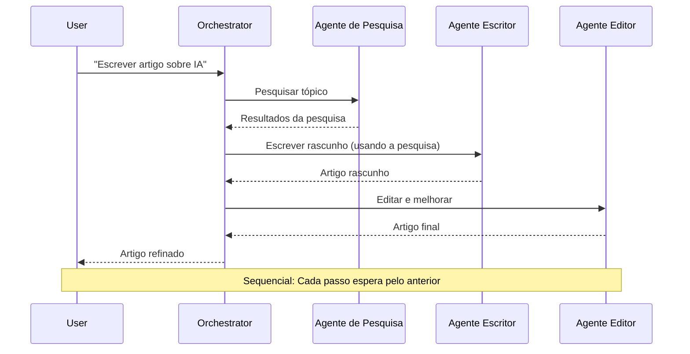
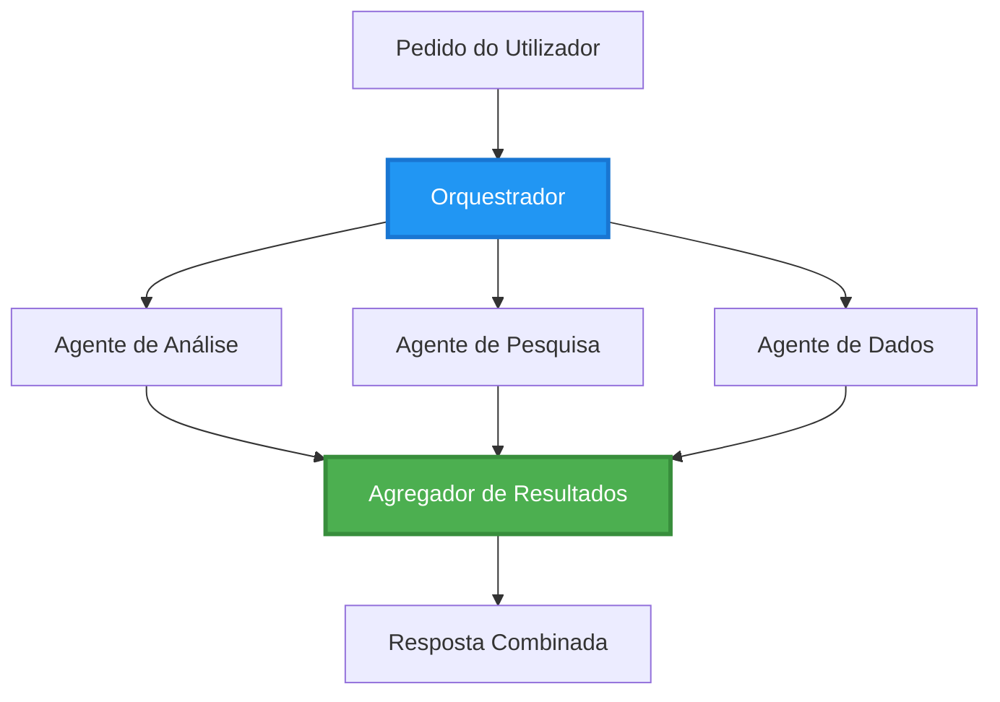
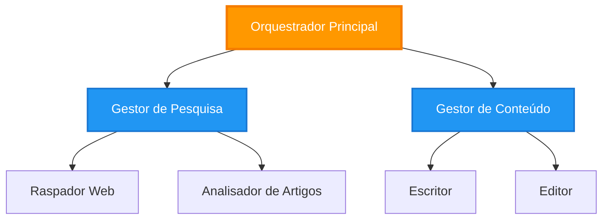
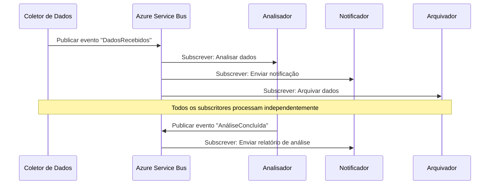
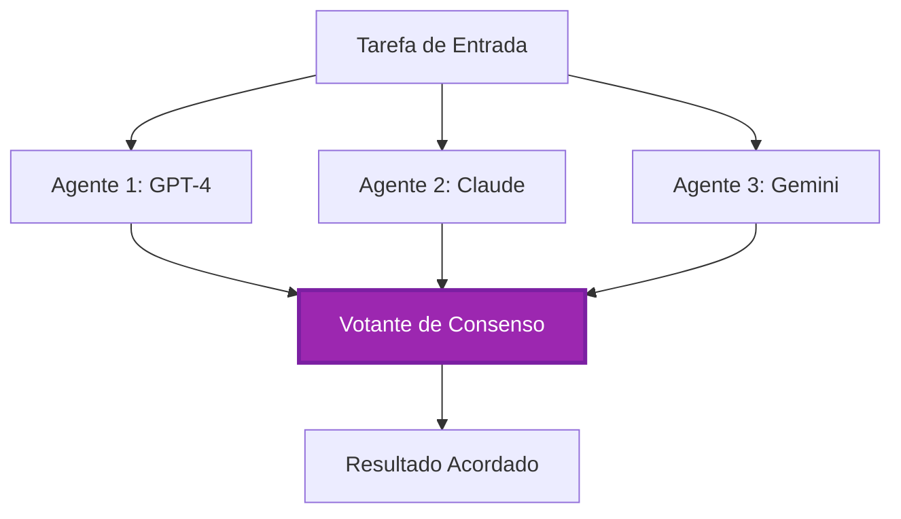
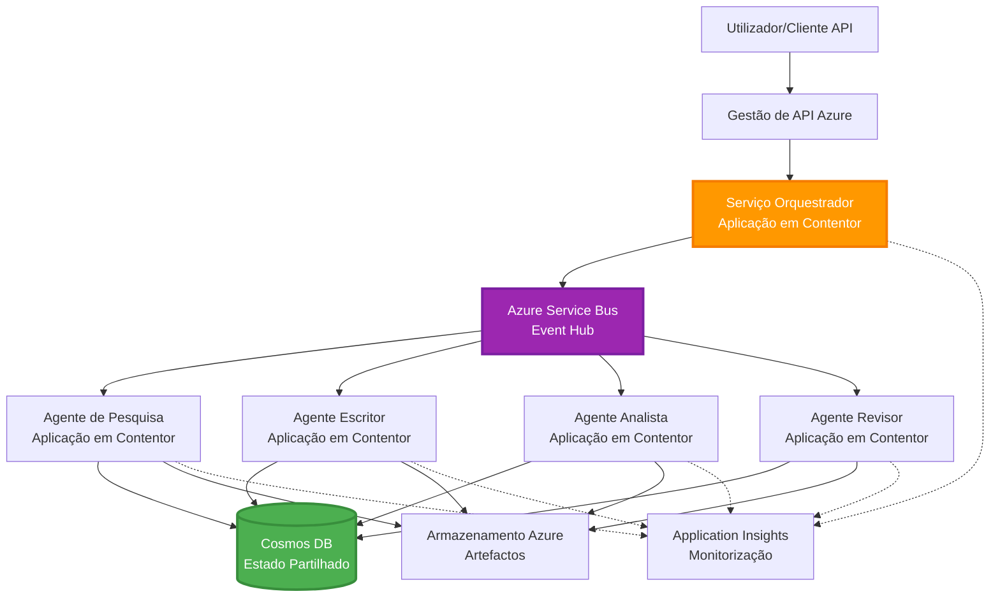

# Padrões de Coordenação Multi-Agente

⏱️ **Tempo Estimado**: 60-75 minutos | 💰 **Custo Estimado**: ~$100-300/mês | ⭐ **Complexidade**: Avançado

**📚 Caminho de Aprendizagem:**
- ← Anterior: [Planeamento de Capacidade](capacity-planning.md) - Estratégias de dimensionamento e escalabilidade de recursos
- 🎯 **Você Está Aqui**: Padrões de Coordenação Multi-Agente (Orquestração, comunicação, gestão de estado)
- → Próximo: [Seleção de SKU](sku-selection.md) - Escolher os serviços Azure adequados
- 🏠 [Página Inicial do Curso](../../README.md)

---

## O Que Você Vai Aprender

Ao concluir esta lição, você irá:
- Compreender os padrões de **arquitetura multi-agente** e quando utilizá-los
- Implementar **padrões de orquestração** (centralizada, descentralizada, hierárquica)
- Projetar estratégias de **comunicação entre agentes** (síncrona, assíncrona, orientada a eventos)
- Gerir o **estado compartilhado** entre agentes distribuídos
- Implementar **sistemas multi-agente** no Azure com AZD
- Aplicar **padrões de coordenação** em cenários reais de IA
- Monitorizar e depurar sistemas de agentes distribuídos

## Por Que a Coordenação Multi-Agente É Importante

### A Evolução: De Agente Único para Multi-Agente

**Agente Único (Simples):**
```
User → Agent → Response
```
- ✅ Fácil de entender e implementar
- ✅ Rápido para tarefas simples
- ❌ Limitado pelas capacidades de um único modelo
- ❌ Não consegue paralelizar tarefas complexas
- ❌ Sem especialização

**Sistema Multi-Agente (Avançado):**
```
           ┌─────────────┐
           │ Orchestrator│
           └──────┬──────┘
        ┌─────────┼─────────┐
        │         │         │
    ┌───▼──┐  ┌──▼───┐  ┌──▼────┐
    │Agent1│  │Agent2│  │Agent3 │
    │(Plan)│  │(Code)│  │(Review)│
    └──────┘  └──────┘  └───────┘
```
- ✅ Agentes especializados para tarefas específicas
- ✅ Execução paralela para maior velocidade
- ✅ Modular e de fácil manutenção
- ✅ Melhor em fluxos de trabalho complexos
- ⚠️ Requer lógica de coordenação

**Analogia**: Um agente único é como uma pessoa a fazer todas as tarefas. Um sistema multi-agente é como uma equipa onde cada membro tem habilidades especializadas (investigador, programador, revisor, escritor) a trabalhar em conjunto.

---

## Padrões de Coordenação Principais

### Padrão 1: Coordenação Sequencial (Cadeia de Responsabilidade)

**Quando usar**: As tarefas devem ser concluídas numa ordem específica, cada agente constrói sobre a saída do anterior.


**Benefícios:**
- ✅ Fluxo de dados claro
- ✅ Fácil de depurar
- ✅ Ordem de execução previsível

**Limitações:**
- ❌ Mais lento (sem paralelismo)
- ❌ Uma falha bloqueia toda a cadeia
- ❌ Não consegue lidar com tarefas interdependentes

**Exemplos de Uso:**
- Pipeline de criação de conteúdo (investigar → escrever → editar → publicar)
- Geração de código (planear → implementar → testar → implementar)
- Geração de relatórios (coleta de dados → análise → visualização → resumo)

---

### Padrão 2: Coordenação Paralela (Fan-Out/Fan-In)

**Quando usar**: Tarefas independentes podem ser executadas simultaneamente, com os resultados combinados no final.


**Benefícios:**
- ✅ Rápido (execução paralela)
- ✅ Tolerante a falhas (resultados parciais aceitáveis)
- ✅ Escala horizontalmente

**Limitações:**
- ⚠️ Resultados podem chegar fora de ordem
- ⚠️ Necessidade de lógica de agregação
- ⚠️ Gestão de estado complexa

**Exemplos de Uso:**
- Coleta de dados de múltiplas fontes (APIs + bases de dados + scraping web)
- Análise competitiva (múltiplos modelos geram soluções, a melhor é selecionada)
- Serviços de tradução (traduzir para múltiplos idiomas simultaneamente)

---

### Padrão 3: Coordenação Hierárquica (Gestor-Trabalhador)

**Quando usar**: Fluxos de trabalho complexos com subtarefas, onde é necessária delegação.


**Benefícios:**
- ✅ Lida com fluxos de trabalho complexos
- ✅ Modular e de fácil manutenção
- ✅ Limites de responsabilidade claros

**Limitações:**
- ⚠️ Arquitetura mais complexa
- ⚠️ Maior latência (múltiplas camadas de coordenação)
- ⚠️ Requer orquestração sofisticada

**Exemplos de Uso:**
- Processamento de documentos empresariais (classificar → encaminhar → processar → arquivar)
- Pipelines de dados multi-etapas (ingestão → limpeza → transformação → análise → relatório)
- Fluxos de trabalho de automação complexos (planeamento → alocação de recursos → execução → monitorização)

---

### Padrão 4: Coordenação Orientada a Eventos (Publicar-Subscrever)

**Quando usar**: Agentes precisam reagir a eventos, com acoplamento fraco.


**Benefícios:**
- ✅ Acoplamento fraco entre agentes
- ✅ Fácil adicionar novos agentes (basta subscrever)
- ✅ Processamento assíncrono
- ✅ Resiliente (persistência de mensagens)

**Limitações:**
- ⚠️ Consistência eventual
- ⚠️ Depuração complexa
- ⚠️ Desafios de ordenação de mensagens

**Exemplos de Uso:**
- Sistemas de monitorização em tempo real (alertas, dashboards, logs)
- Notificações multi-canal (email, SMS, push, Slack)
- Pipelines de processamento de dados (múltiplos consumidores dos mesmos dados)

---

### Padrão 5: Coordenação Baseada em Consenso (Votação/Quórum)

**Quando usar**: É necessário acordo de múltiplos agentes antes de prosseguir.


**Benefícios:**
- ✅ Maior precisão (múltiplas opiniões)
- ✅ Tolerante a falhas (falhas minoritárias aceitáveis)
- ✅ Garantia de qualidade embutida

**Limitações:**
- ❌ Caro (múltiplas chamadas de modelo)
- ❌ Mais lento (espera por todos os agentes)
- ⚠️ Necessidade de resolução de conflitos

**Exemplos de Uso:**
- Moderação de conteúdo (múltiplos modelos analisam o conteúdo)
- Revisão de código (múltiplos linters/analisadores)
- Diagnóstico médico (múltiplos modelos de IA, validação de especialistas)

---

## Visão Geral da Arquitetura

### Sistema Multi-Agente Completo no Azure


**Componentes Principais:**

| Componente | Finalidade | Serviço Azure |
|------------|------------|---------------|
| **API Gateway** | Ponto de entrada, limitação de taxa, autenticação | API Management |
| **Orquestrador** | Coordena fluxos de trabalho de agentes | Container Apps |
| **Fila de Mensagens** | Comunicação assíncrona | Service Bus / Event Hubs |
| **Agentes** | Trabalhadores de IA especializados | Container Apps / Functions |
| **Armazenamento de Estado** | Estado compartilhado, rastreamento de tarefas | Cosmos DB |
| **Armazenamento de Artefatos** | Documentos, resultados, logs | Blob Storage |
| **Monitorização** | Rastreamento distribuído, logs | Application Insights |

---

## Pré-requisitos

### Ferramentas Necessárias

```bash
# Verificar Azure Developer CLI
azd version
# ✅ Esperado: azd versão 1.0.0 ou superior

# Verificar Azure CLI
az --version
# ✅ Esperado: azure-cli 2.50.0 ou superior

# Verificar Docker (para testes locais)
docker --version
# ✅ Esperado: Docker versão 20.10 ou superior
```

### Requisitos do Azure

- Subscrição ativa do Azure
- Permissões para criar:
  - Container Apps
  - Namespaces do Service Bus
  - Contas do Cosmos DB
  - Contas de Armazenamento
  - Application Insights

### Pré-requisitos de Conhecimento

Você deve ter concluído:
- [Gestão de Configuração](../getting-started/configuration.md)
- [Autenticação e Segurança](../getting-started/authsecurity.md)
- [Exemplo de Microserviços](../../../../examples/microservices)

---

## Guia de Implementação

### Estrutura do Projeto

```
multi-agent-system/
├── azure.yaml                    # AZD configuration
├── infra/
│   ├── main.bicep               # Main infrastructure
│   ├── core/
│   │   ├── servicebus.bicep     # Message queue
│   │   ├── cosmos.bicep         # State store
│   │   ├── storage.bicep        # Artifact storage
│   │   └── monitoring.bicep     # Application Insights
│   └── app/
│       ├── orchestrator.bicep   # Orchestrator service
│       └── agent.bicep          # Agent template
└── src/
    ├── orchestrator/            # Orchestration logic
    │   ├── app.py
    │   ├── workflows.py
    │   └── Dockerfile
    ├── agents/
    │   ├── research/            # Research agent
    │   ├── writer/              # Writer agent
    │   ├── analyst/             # Analyst agent
    │   └── reviewer/            # Reviewer agent
    └── shared/
        ├── state_manager.py     # Shared state logic
        └── message_handler.py   # Message handling
```

---

## Lição 1: Padrão de Coordenação Sequencial

### Implementação: Pipeline de Criação de Conteúdo

Vamos construir um pipeline sequencial: Investigar → Escrever → Editar → Publicar

### 1. Configuração AZD

**Ficheiro: `azure.yaml`**

```yaml
name: content-pipeline
metadata:
  template: multi-agent-sequential@1.0.0

services:
  orchestrator:
    project: ./src/orchestrator
    language: python
    host: containerapp
  
  research-agent:
    project: ./src/agents/research
    language: python
    host: containerapp
  
  writer-agent:
    project: ./src/agents/writer
    language: python
    host: containerapp
  
  editor-agent:
    project: ./src/agents/editor
    language: python
    host: containerapp
```

### 2. Infraestrutura: Service Bus para Coordenação

**Ficheiro: `infra/core/servicebus.bicep`**

```bicep
param name string
param location string
param tags object = {}

resource serviceBusNamespace 'Microsoft.ServiceBus/namespaces@2022-10-01-preview' = {
  name: name
  location: location
  tags: tags
  sku: {
    name: 'Standard'
    tier: 'Standard'
  }
  properties: {
    minimumTlsVersion: '1.2'
  }
}

// Queue for orchestrator → research agent
resource researchQueue 'Microsoft.ServiceBus/namespaces/queues@2022-10-01-preview' = {
  parent: serviceBusNamespace
  name: 'research-tasks'
  properties: {
    maxDeliveryCount: 3
    lockDuration: 'PT5M'
    deadLetteringOnMessageExpiration: true
  }
}

// Queue for research agent → writer agent
resource writerQueue 'Microsoft.ServiceBus/namespaces/queues@2022-10-01-preview' = {
  parent: serviceBusNamespace
  name: 'writer-tasks'
  properties: {
    maxDeliveryCount: 3
    lockDuration: 'PT5M'
  }
}

// Queue for writer agent → editor agent
resource editorQueue 'Microsoft.ServiceBus/namespaces/queues@2022-10-01-preview' = {
  parent: serviceBusNamespace
  name: 'editor-tasks'
  properties: {
    maxDeliveryCount: 3
    lockDuration: 'PT5M'
  }
}

output namespace string = serviceBusNamespace.name
output connectionString string = listKeys('${serviceBusNamespace.id}/AuthorizationRules/RootManageSharedAccessKey', serviceBusNamespace.apiVersion).primaryConnectionString
```

### 3. Gestor de Estado Compartilhado

**Ficheiro: `src/shared/state_manager.py`**

```python
from azure.cosmos import CosmosClient, PartitionKey
from datetime import datetime
import os

class StateManager:
    """Manages shared state across agents using Cosmos DB"""
    
    def __init__(self):
        endpoint = os.environ['COSMOS_ENDPOINT']
        key = os.environ['COSMOS_KEY']
        
        self.client = CosmosClient(endpoint, key)
        self.database = self.client.get_database_client('agent-state')
        self.container = self.database.get_container_client('tasks')
    
    def create_task(self, task_id: str, task_type: str, input_data: dict):
        """Create a new task"""
        task = {
            'id': task_id,
            'type': task_type,
            'status': 'pending',
            'input': input_data,
            'created_at': datetime.utcnow().isoformat(),
            'steps': []
        }
        self.container.create_item(task)
        return task
    
    def update_task_step(self, task_id: str, step_name: str, result: dict):
        """Update task with completed step"""
        task = self.container.read_item(task_id, partition_key=task_id)
        
        task['steps'].append({
            'name': step_name,
            'completed_at': datetime.utcnow().isoformat(),
            'result': result
        })
        
        self.container.replace_item(task_id, task)
        return task
    
    def complete_task(self, task_id: str, final_result: dict):
        """Mark task as complete"""
        task = self.container.read_item(task_id, partition_key=task_id)
        task['status'] = 'completed'
        task['result'] = final_result
        task['completed_at'] = datetime.utcnow().isoformat()
        self.container.replace_item(task_id, task)
        return task
    
    def get_task(self, task_id: str):
        """Retrieve task state"""
        return self.container.read_item(task_id, partition_key=task_id)
```

### 4. Serviço Orquestrador

**Ficheiro: `src/orchestrator/app.py`**

```python
from flask import Flask, request, jsonify
from azure.servicebus import ServiceBusClient, ServiceBusMessage
import json
import uuid
import os
from shared.state_manager import StateManager

app = Flask(__name__)
state_manager = StateManager()

# Conexão do Service Bus
servicebus_connection_str = os.environ['SERVICEBUS_CONNECTION_STRING']
servicebus_client = ServiceBusClient.from_connection_string(servicebus_connection_str)

@app.route('/health', methods=['GET'])
def health():
    return jsonify({'status': 'healthy', 'service': 'orchestrator'})

@app.route('/create-content', methods=['POST'])
def create_content():
    """
    Sequential workflow: Research → Write → Edit → Publish
    """
    data = request.json
    topic = data.get('topic')
    
    if not topic:
        return jsonify({'error': 'Topic required'}), 400
    
    # Criar tarefa no armazenamento de estado
    task_id = str(uuid.uuid4())
    task = state_manager.create_task(
        task_id=task_id,
        task_type='content_creation',
        input_data={'topic': topic}
    )
    
    # Enviar mensagem para o agente de pesquisa (primeiro passo)
    sender = servicebus_client.get_queue_sender('research-tasks')
    message = ServiceBusMessage(
        body=json.dumps({
            'task_id': task_id,
            'topic': topic,
            'next_queue': 'writer-tasks'  # Onde enviar os resultados
        }),
        content_type='application/json'
    )
    
    with sender:
        sender.send_messages(message)
    
    return jsonify({
        'task_id': task_id,
        'status': 'started',
        'workflow': 'sequential',
        'steps': ['research', 'write', 'edit', 'publish'],
        'message': 'Content creation pipeline initiated'
    }), 202

@app.route('/task/<task_id>', methods=['GET'])
def get_task_status(task_id):
    """Check task status"""
    try:
        task = state_manager.get_task(task_id)
        return jsonify(task)
    except Exception as e:
        return jsonify({'error': str(e)}), 404

if __name__ == '__main__':
    app.run(host='0.0.0.0', port=8080)
```

### 5. Agente de Pesquisa

**Ficheiro: `src/agents/research/app.py`**

```python
from azure.servicebus import ServiceBusClient, ServiceBusMessage
from openai import AzureOpenAI
import json
import os
import time
from shared.state_manager import StateManager

# Inicializar clientes
state_manager = StateManager()
servicebus_client = ServiceBusClient.from_connection_string(
    os.environ['SERVICEBUS_CONNECTION_STRING']
)

openai_client = AzureOpenAI(
    api_key=os.environ['AZURE_OPENAI_API_KEY'],
    api_version="2024-02-01",
    azure_endpoint=os.environ['AZURE_OPENAI_ENDPOINT']
)

def process_research_task(message_data):
    """Process research request and pass to writer"""
    task_id = message_data['task_id']
    topic = message_data['topic']
    next_queue = message_data['next_queue']
    
    print(f"🔬 Researching: {topic}")
    
    # Chamar Azure OpenAI para pesquisa
    response = openai_client.chat.completions.create(
        model="gpt-4",
        messages=[
            {"role": "system", "content": "You are a research assistant. Provide comprehensive research on the given topic."},
            {"role": "user", "content": f"Research this topic thoroughly: {topic}"}
        ],
        max_tokens=1500
    )
    
    research_results = response.choices[0].message.content
    
    # Atualizar estado
    state_manager.update_task_step(
        task_id=task_id,
        step_name='research',
        result={'research': research_results}
    )
    
    # Enviar para o próximo agente (escritor)
    sender = servicebus_client.get_queue_sender(next_queue)
    message = ServiceBusMessage(
        body=json.dumps({
            'task_id': task_id,
            'topic': topic,
            'research': research_results,
            'next_queue': 'editor-tasks'
        }),
        content_type='application/json'
    )
    
    with sender:
        sender.send_messages(message)
    
    print(f"✅ Research complete for task {task_id}")

def main():
    """Listen to research queue"""
    receiver = servicebus_client.get_queue_receiver('research-tasks')
    
    print("🔬 Research Agent started, listening for tasks...")
    
    with receiver:
        while True:
            messages = receiver.receive_messages(max_wait_time=5)
            for message in messages:
                try:
                    message_data = json.loads(str(message))
                    process_research_task(message_data)
                    receiver.complete_message(message)
                except Exception as e:
                    print(f"❌ Error processing message: {e}")
                    receiver.abandon_message(message)

if __name__ == '__main__':
    main()
```

### 6. Agente Escritor

**Ficheiro: `src/agents/writer/app.py`**

```python
from azure.servicebus import ServiceBusClient, ServiceBusMessage
from openai import AzureOpenAI
import json
import os
from shared.state_manager import StateManager

state_manager = StateManager()
servicebus_client = ServiceBusClient.from_connection_string(
    os.environ['SERVICEBUS_CONNECTION_STRING']
)

openai_client = AzureOpenAI(
    api_key=os.environ['AZURE_OPENAI_API_KEY'],
    api_version="2024-02-01",
    azure_endpoint=os.environ['AZURE_OPENAI_ENDPOINT']
)

def process_writing_task(message_data):
    """Write article based on research"""
    task_id = message_data['task_id']
    topic = message_data['topic']
    research = message_data['research']
    next_queue = message_data['next_queue']
    
    print(f"✍️ Writing article: {topic}")
    
    # Chamar Azure OpenAI para escrever artigo
    response = openai_client.chat.completions.create(
        model="gpt-4",
        messages=[
            {"role": "system", "content": "You are a professional writer. Write engaging, well-structured articles."},
            {"role": "user", "content": f"Based on this research:\n\n{research}\n\nWrite a comprehensive article about: {topic}"}
        ],
        max_tokens=2000
    )
    
    article_draft = response.choices[0].message.content
    
    # Atualizar estado
    state_manager.update_task_step(
        task_id=task_id,
        step_name='writing',
        result={'draft': article_draft}
    )
    
    # Enviar para o editor
    sender = servicebus_client.get_queue_sender(next_queue)
    message = ServiceBusMessage(
        body=json.dumps({
            'task_id': task_id,
            'topic': topic,
            'draft': article_draft
        }),
        content_type='application/json'
    )
    
    with sender:
        sender.send_messages(message)
    
    print(f"✅ Article draft complete for task {task_id}")

def main():
    """Listen to writer queue"""
    receiver = servicebus_client.get_queue_receiver('writer-tasks')
    
    print("✍️ Writer Agent started, listening for tasks...")
    
    with receiver:
        while True:
            messages = receiver.receive_messages(max_wait_time=5)
            for message in messages:
                try:
                    message_data = json.loads(str(message))
                    process_writing_task(message_data)
                    receiver.complete_message(message)
                except Exception as e:
                    print(f"❌ Error: {e}")
                    receiver.abandon_message(message)

if __name__ == '__main__':
    main()
```

### 7. Agente Editor

**Ficheiro: `src/agents/editor/app.py`**

```python
from azure.servicebus import ServiceBusClient
from openai import AzureOpenAI
import json
import os
from shared.state_manager import StateManager

state_manager = StateManager()
servicebus_client = ServiceBusClient.from_connection_string(
    os.environ['SERVICEBUS_CONNECTION_STRING']
)

openai_client = AzureOpenAI(
    api_key=os.environ['AZURE_OPENAI_API_KEY'],
    api_version="2024-02-01",
    azure_endpoint=os.environ['AZURE_OPENAI_ENDPOINT']
)

def process_editing_task(message_data):
    """Edit and finalize article"""
    task_id = message_data['task_id']
    topic = message_data['topic']
    draft = message_data['draft']
    
    print(f"📝 Editing article: {topic}")
    
    # Chamar Azure OpenAI para editar
    response = openai_client.chat.completions.create(
        model="gpt-4",
        messages=[
            {"role": "system", "content": "You are an expert editor. Improve grammar, clarity, and structure."},
            {"role": "user", "content": f"Edit and improve this article:\n\n{draft}"}
        ],
        max_tokens=2000
    )
    
    final_article = response.choices[0].message.content
    
    # Marcar tarefa como concluída
    state_manager.complete_task(
        task_id=task_id,
        final_result={
            'topic': topic,
            'final_article': final_article,
            'word_count': len(final_article.split())
        }
    )
    
    print(f"✅ Article finalized for task {task_id}")

def main():
    """Listen to editor queue"""
    receiver = servicebus_client.get_queue_receiver('editor-tasks')
    
    print("📝 Editor Agent started, listening for tasks...")
    
    with receiver:
        while True:
            messages = receiver.receive_messages(max_wait_time=5)
            for message in messages:
                try:
                    message_data = json.loads(str(message))
                    process_editing_task(message_data)
                    receiver.complete_message(message)
                except Exception as e:
                    print(f"❌ Error: {e}")
                    receiver.abandon_message(message)

if __name__ == '__main__':
    main()
```

### 8. Implementar e Testar

```bash
# Inicializar e implementar
azd init
azd up

# Obter URL do orquestrador
ORCHESTRATOR_URL=$(azd env get-values | grep ORCHESTRATOR_URL | cut -d '=' -f2 | tr -d '"')

# Criar conteúdo
curl -X POST $ORCHESTRATOR_URL/create-content \
  -H "Content-Type: application/json" \
  -d '{"topic": "The Future of AI in Healthcare"}'
```

**✅ Saída Esperada:**
```json
{
  "task_id": "a1b2c3d4-e5f6-7890-abcd-ef1234567890",
  "status": "started",
  "workflow": "sequential",
  "steps": ["research", "write", "edit", "publish"],
  "message": "Content creation pipeline initiated"
}
```

**Verificar progresso da tarefa:**
```bash
TASK_ID="a1b2c3d4-e5f6-7890-abcd-ef1234567890"
curl $ORCHESTRATOR_URL/task/$TASK_ID
```

**✅ Saída Esperada (concluído):**
```json
{
  "id": "a1b2c3d4-e5f6-7890-abcd-ef1234567890",
  "type": "content_creation",
  "status": "completed",
  "steps": [
    {
      "name": "research",
      "completed_at": "2025-11-19T10:30:00Z",
      "result": {"research": "..."}
    },
    {
      "name": "writing",
      "completed_at": "2025-11-19T10:32:00Z",
      "result": {"draft": "..."}
    }
  ],
  "result": {
    "topic": "The Future of AI in Healthcare",
    "final_article": "...",
    "word_count": 1500
  }
}
```

---

## Lição 2: Padrão de Coordenação Paralela

### Implementação: Agregador de Pesquisa Multi-Fonte

Vamos construir um sistema paralelo que reúne informações de múltiplas fontes simultaneamente.

### Orquestrador Paralelo

**Ficheiro: `src/orchestrator/parallel_workflow.py`**

```python
from flask import Flask, request, jsonify
from azure.servicebus import ServiceBusClient, ServiceBusMessage
import json
import uuid
import os
from shared.state_manager import StateManager

app = Flask(__name__)
state_manager = StateManager()

servicebus_client = ServiceBusClient.from_connection_string(
    os.environ['SERVICEBUS_CONNECTION_STRING']
)

@app.route('/research-parallel', methods=['POST'])
def research_parallel():
    """
    Parallel workflow: Multiple agents work simultaneously
    """
    data = request.json
    query = data.get('query')
    
    task_id = str(uuid.uuid4())
    task = state_manager.create_task(
        task_id=task_id,
        task_type='parallel_research',
        input_data={
            'query': query,
            'agents': ['web', 'academic', 'news', 'social']
        }
    )
    
    # Fan-out: Enviar para todos os agentes simultaneamente
    agents = [
        ('web-research-queue', 'web'),
        ('academic-research-queue', 'academic'),
        ('news-research-queue', 'news'),
        ('social-research-queue', 'social')
    ]
    
    for queue_name, agent_type in agents:
        sender = servicebus_client.get_queue_sender(queue_name)
        message = ServiceBusMessage(
            body=json.dumps({
                'task_id': task_id,
                'query': query,
                'agent_type': agent_type,
                'result_queue': 'aggregation-queue'
            }),
            content_type='application/json'
        )
        
        with sender:
            sender.send_messages(message)
    
    return jsonify({
        'task_id': task_id,
        'status': 'started',
        'workflow': 'parallel',
        'agents_dispatched': 4,
        'message': 'Parallel research initiated'
    }), 202

if __name__ == '__main__':
    app.run(host='0.0.0.0', port=8080)
```

### Lógica de Agregação

**Ficheiro: `src/agents/aggregator/app.py`**

```python
from azure.servicebus import ServiceBusClient
import json
import os
from collections import defaultdict
from shared.state_manager import StateManager

state_manager = StateManager()
servicebus_client = ServiceBusClient.from_connection_string(
    os.environ['SERVICEBUS_CONNECTION_STRING']
)

# Acompanhar resultados por tarefa
task_results = defaultdict(list)
expected_agents = 4  # web, académico, notícias, social

def process_result(message_data):
    """Aggregate results from parallel agents"""
    task_id = message_data['task_id']
    agent_type = message_data['agent_type']
    result = message_data['result']
    
    # Armazenar resultado
    task_results[task_id].append({
        'agent': agent_type,
        'data': result
    })
    
    print(f"📊 Received result from {agent_type} agent ({len(task_results[task_id])}/{expected_agents})")
    
    # Verificar se todos os agentes concluíram (fan-in)
    if len(task_results[task_id]) == expected_agents:
        print(f"✅ All agents completed for task {task_id}. Aggregating...")
        
        # Combinar resultados
        aggregated = {
            'query': message_data['query'],
            'sources': task_results[task_id],
            'summary': generate_summary(task_results[task_id])
        }
        
        # Marcar como concluído
        state_manager.complete_task(task_id, aggregated)
        
        # Limpar
        del task_results[task_id]
        
        print(f"✅ Aggregation complete for task {task_id}")

def generate_summary(results):
    """Generate summary from all sources"""
    summaries = [r['data'].get('summary', '') for r in results]
    return '\n\n'.join(summaries)

def main():
    """Listen to aggregation queue"""
    receiver = servicebus_client.get_queue_receiver('aggregation-queue')
    
    print("📊 Aggregator started, listening for results...")
    
    with receiver:
        while True:
            messages = receiver.receive_messages(max_wait_time=5)
            for message in messages:
                try:
                    message_data = json.loads(str(message))
                    process_result(message_data)
                    receiver.complete_message(message)
                except Exception as e:
                    print(f"❌ Error: {e}")
                    receiver.abandon_message(message)

if __name__ == '__main__':
    main()
```

**Benefícios do Padrão Paralelo:**
- ⚡ **4x mais rápido** (agentes executam simultaneamente)
- 🔄 **Tolerante a falhas** (resultados parciais aceitáveis)
- 📈 **Escalável** (adicionar mais agentes facilmente)

---

## Exercícios Práticos

### Exercício 1: Adicionar Gestão de Timeout ⭐⭐ (Médio)

**Objetivo**: Implementar lógica de timeout para que o agregador não espere indefinidamente por agentes lentos.

**Passos**:

1. **Adicionar rastreamento de timeout ao agregador:**

```python
from datetime import datetime, timedelta

task_timeouts = {}  # task_id -> tempo_de_expiração

def process_result(message_data):
    task_id = message_data['task_id']
    
    # Definir tempo limite no primeiro resultado
    if task_id not in task_timeouts:
        task_timeouts[task_id] = datetime.utcnow() + timedelta(seconds=30)
    
    task_results[task_id].append({
        'agent': message_data['agent_type'],
        'data': message_data['result']
    })
    
    # Verificar se está completo OU expirou
    if len(task_results[task_id]) == expected_agents or \
       datetime.utcnow() > task_timeouts[task_id]:
        
        print(f"📊 Aggregating with {len(task_results[task_id])}/{expected_agents} results")
        
        aggregated = {
            'query': message_data['query'],
            'sources': task_results[task_id],
            'completed_agents': len(task_results[task_id]),
            'timed_out': len(task_results[task_id]) < expected_agents
        }
        
        state_manager.complete_task(task_id, aggregated)
        
        # Limpeza
        del task_results[task_id]
        del task_timeouts[task_id]
```

2. **Testar com atrasos artificiais:**

```python
# Em um agente, adicione atraso para simular processamento lento
import time
time.sleep(35)  # Excede o limite de tempo de 30 segundos
```

3. **Implementar e verificar:**

```bash
azd deploy aggregator

# Submeter tarefa
curl -X POST $ORCHESTRATOR_URL/research-parallel \
  -H "Content-Type: application/json" \
  -d '{"query": "AI safety research"}'

# Verificar resultados após 30 segundos
curl $ORCHESTRATOR_URL/task/$TASK_ID
```

**✅ Critérios de Sucesso:**
- ✅ Tarefa conclui após 30 segundos, mesmo que agentes não completem
- ✅ Resposta indica resultados parciais (`"timed_out": true`)
- ✅ Resultados disponíveis são retornados (3 de 4 agentes)

**Tempo**: 20-25 minutos

---

### Exercício 2: Implementar Lógica de Retry ⭐⭐⭐ (Avançado)

**Objetivo**: Repetir automaticamente tarefas de agentes falhados antes de desistir.

**Passos**:

1. **Adicionar rastreamento de retry ao orquestrador:**

```python
from dataclasses import dataclass
from typing import Dict

@dataclass
class RetryConfig:
    max_retries: int = 3
    backoff_seconds: int = 5

retry_counts: Dict[str, int] = {}  # message_id -> contagem_de_tentativas

def send_with_retry(queue_name: str, message_data: dict, retry_config: RetryConfig):
    """Send message with retry metadata"""
    message_id = message_data.get('message_id', str(uuid.uuid4()))
    message_data['message_id'] = message_id
    message_data['retry_count'] = retry_counts.get(message_id, 0)
    message_data['max_retries'] = retry_config.max_retries
    
    sender = servicebus_client.get_queue_sender(queue_name)
    message = ServiceBusMessage(
        body=json.dumps(message_data),
        content_type='application/json',
        message_id=message_id
    )
    
    with sender:
        sender.send_messages(message)
```

2. **Adicionar handler de retry aos agentes:**

```python
def process_with_retry(message, receiver, process_func):
    """Process message with automatic retry on failure"""
    try:
        message_data = json.loads(str(message))
        
        # Processar a mensagem
        process_func(message_data)
        
        # Sucesso - concluído
        receiver.complete_message(message)
        
    except Exception as e:
        message_id = message.message_id
        retry_count = message_data.get('retry_count', 0)
        max_retries = message_data.get('max_retries', 3)
        
        if retry_count < max_retries:
            # Tentar novamente: abandonar e reencaminhar com contagem incrementada
            print(f"⚠️ Retry {retry_count + 1}/{max_retries} for message {message_id}")
            
            message_data['retry_count'] = retry_count + 1
            
            # Enviar de volta para a mesma fila com atraso
            time.sleep(5 * (retry_count + 1))  # Recuo exponencial
            send_with_retry(queue_name, message_data, RetryConfig())
            
            receiver.complete_message(message)  # Remover original
        else:
            # Número máximo de tentativas excedido - mover para a fila de mensagens mortas
            print(f"❌ Max retries exceeded for message {message_id}")
            receiver.dead_letter_message(
                message,
                reason="MaxRetriesExceeded",
                error_description=str(e)
            )
```

3. **Monitorizar fila de mensagens mortas:**

```python
def monitor_dead_letters():
    """Check dead letter queue for failed messages"""
    receiver = servicebus_client.get_queue_receiver(
        'research-queue',
        sub_queue='deadletter'
    )
    
    with receiver:
        messages = receiver.receive_messages(max_wait_time=5)
        for message in messages:
            print(f"☠️ Dead letter: {message.message_id}")
            print(f"Reason: {message.dead_letter_reason}")
            print(f"Description: {message.dead_letter_error_description}")
```

**✅ Critérios de Sucesso:**
- ✅ Tarefas falhadas são repetidas automaticamente (até 3 vezes)
- ✅ Backoff exponencial entre tentativas (5s, 10s, 15s)
- ✅ Após tentativas máximas, mensagens vão para fila de mensagens mortas
- ✅ Fila de mensagens mortas pode ser monitorizada e reproduzida

**Tempo**: 30-40 minutos

---

### Exercício 3: Implementar Circuit Breaker ⭐⭐⭐ (Avançado)

**Objetivo**: Prevenir falhas em cascata ao parar pedidos para agentes com falhas.

**Passos**:

1. **Criar classe de circuit breaker:**

```python
from enum import Enum
from datetime import datetime, timedelta

class CircuitState(Enum):
    CLOSED = "closed"      # Operação normal
    OPEN = "open"          # Falha, rejeitar pedidos
    HALF_OPEN = "half_open"  # A testar se recuperado

class CircuitBreaker:
    def __init__(self, failure_threshold=5, timeout_seconds=60):
        self.failure_threshold = failure_threshold
        self.timeout_seconds = timeout_seconds
        self.failure_count = 0
        self.last_failure_time = None
        self.state = CircuitState.CLOSED
    
    def call(self, func):
        """Execute function with circuit breaker protection"""
        if self.state == CircuitState.OPEN:
            # Verificar se o tempo limite expirou
            if datetime.utcnow() - self.last_failure_time > timedelta(seconds=self.timeout_seconds):
                self.state = CircuitState.HALF_OPEN
                print("🔄 Circuit breaker: HALF_OPEN (testing)")
            else:
                raise Exception(f"Circuit breaker OPEN for agent. Try again in {self.timeout_seconds}s")
        
        try:
            result = func()
            
            # Sucesso
            if self.state == CircuitState.HALF_OPEN:
                self.state = CircuitState.CLOSED
                self.failure_count = 0
                print("✅ Circuit breaker: CLOSED (recovered)")
            
            return result
            
        except Exception as e:
            self.failure_count += 1
            self.last_failure_time = datetime.utcnow()
            
            if self.failure_count >= self.failure_threshold:
                self.state = CircuitState.OPEN
                print(f"🔴 Circuit breaker: OPEN (too many failures)")
            
            raise e
```

2. **Aplicar a chamadas de agentes:**

```python
# No orquestrador
agent_circuits = {
    'web': CircuitBreaker(failure_threshold=5, timeout_seconds=60),
    'academic': CircuitBreaker(failure_threshold=5, timeout_seconds=60),
    'news': CircuitBreaker(failure_threshold=5, timeout_seconds=60),
    'social': CircuitBreaker(failure_threshold=5, timeout_seconds=60)
}

def send_to_agent(agent_type, message_data):
    """Send with circuit breaker protection"""
    circuit = agent_circuits[agent_type]
    
    try:
        circuit.call(lambda: send_message(agent_type, message_data))
    except Exception as e:
        print(f"⚠️ Skipping {agent_type} agent: {e}")
        # Continuar com outros agentes
```

3. **Testar circuit breaker:**

```bash
# Simular falhas repetidas (parar um agente)
az containerapp stop --name web-research-agent --resource-group rg-agents

# Enviar múltiplos pedidos
for i in {1..10}; do
  curl -X POST $ORCHESTRATOR_URL/research-parallel \
    -H "Content-Type: application/json" \
    -d '{"query": "test query '$i'"}'
  sleep 2
done

# Verificar os registos - deve ver o circuito aberto após 5 falhas
azd logs orchestrator --tail 50
```

**✅ Critérios de Sucesso:**
- ✅ Após 5 falhas, circuito abre (rejeita pedidos)
- ✅ Após 60 segundos, circuito vai para meio-aberto (testa recuperação)
- ✅ Outros agentes continuam a funcionar normalmente
- ✅ Circuito fecha automaticamente quando agente recupera

**Tempo**: 40-50 minutos

---

## Monitorização e Depuração

### Rastreamento Distribuído com Application Insights

**Ficheiro: `src/shared/tracing.py`**

```python
from opencensus.ext.azure.log_exporter import AzureLogHandler
from opencensus.ext.azure.trace_exporter import AzureExporter
from opencensus.trace import config_integration
from opencensus.trace.tracer import Tracer
from opencensus.trace.samplers import AlwaysOnSampler
import logging
import os

# Configurar rastreamento
config_integration.trace_integrations(['requests', 'logging'])

connection_string = os.environ.get('APPLICATIONINSIGHTS_CONNECTION_STRING')

# Criar rastreador
tracer = Tracer(
    exporter=AzureExporter(connection_string=connection_string),
    sampler=AlwaysOnSampler()
)

# Configurar registo
logger = logging.getLogger(__name__)
logger.addHandler(AzureLogHandler(connection_string=connection_string))
logger.setLevel(logging.INFO)

def trace_agent_call(agent_name, task_id, operation):
    """Trace agent operations"""
    with tracer.span(name=f'{agent_name}.{operation}') as span:
        span.add_attribute('agent', agent_name)
        span.add_attribute('task_id', task_id)
        span.add_attribute('operation', operation)
        
        try:
            result = operation()
            span.add_attribute('status', 'success')
            return result
        except Exception as e:
            span.add_attribute('status', 'error')
            span.add_attribute('error', str(e))
            raise
```

### Consultas no Application Insights

**Rastrear fluxos de trabalho multi-agente:**

```kusto
// Trace complete workflow for a task
traces
| where customDimensions.task_id == "a1b2c3d4-..."
| project timestamp, message, customDimensions.agent, customDimensions.operation
| order by timestamp asc
```

**Comparação de desempenho de agentes:**

```kusto
// Compare agent execution times
dependencies
| where name contains "agent"
| summarize 
    avg_duration = avg(duration),
    p95_duration = percentile(duration, 95),
    count = count()
  by agent = tostring(customDimensions.agent)
| order by avg_duration desc
```

**Análise de falhas:**

```kusto
// Find which agents fail most
exceptions
| where customDimensions.agent != ""
| summarize 
    failure_count = count(),
    unique_errors = dcount(outerMessage)
  by agent = tostring(customDimensions.agent)
| order by failure_count desc
```

---

## Análise de Custos

### Custos do Sistema Multi-Agente (Estimativas Mensais)

| Componente | Configuração | Custo |
|------------|--------------|-------|
| **Orquestrador** | 1 Container App (1 vCPU, 2GB) | $30-50 |
| **4 Agentes** | 4 Container Apps (0.5 vCPU, 1GB cada) | $60-120 |
| **Service Bus** | Nível Standard, 10M mensagens | $10-20 |
| **Cosmos DB** | Serverless, 5GB de armazenamento, 1M RUs | $25-50 |
| **Blob Storage** | 10GB de armazenamento, 100K operações | $5-10 |
| **Application Insights** | 5GB de ingestão | $10-15 |
| **Azure OpenAI** | GPT-4, 10M tokens | $100-300 |
| **Total** | | **$240-565/mês** |

### Estratégias de Otimização de Custos

1. **Utilizar serverless sempre que possível:**
   ```bicep
   // Cosmos DB serverless (no minimum cost)
   properties: {
     databaseAccountOfferType: 'Standard'
     capabilities: [{ name: 'EnableServerless' }]
   }
   ```

2. **Escalar agentes para zero quando ociosos:**
   ```bicep
   scale: {
     minReplicas: 0  // Scale to zero when no messages
     maxReplicas: 10
   }
   ```

3. **Utilizar batching para o Service Bus:**
   ```python
   # Enviar mensagens em lotes (mais barato)
   sender.send_messages([message1, message2, message3])
   ```

4. **Fazer cache de resultados frequentemente usados:**
   ```python
   # Usar o Azure Cache para Redis
   if cache.exists(query_hash):
       return cache.get(query_hash)
   ```

---

## Melhores Práticas

### ✅ FAÇA:

1. **Utilizar operações idempotentes**
   ```python
   # O agente pode processar com segurança a mesma mensagem várias vezes
   def process_task(task_id):
       if state_manager.task_exists(task_id):
           print(f"Task {task_id} already processed, skipping")
           return
       # Processar tarefa...
   ```

2. **Implementar logging abrangente**
   ```python
   logger.info(f"Agent: {agent_name}, Task: {task_id}, Action: {action}")
   ```

3. **Usar IDs de correlação**
   ```python
   # Passar task_id por todo o fluxo de trabalho
   message_data = {
       'task_id': task_id,  # ID de correlação
       'timestamp': datetime.utcnow().isoformat()
   }
   ```

4. **Definir TTL (tempo de vida) para mensagens**
   ```bicep
   properties: {
     defaultMessageTimeToLive: 'PT1H'  // 1 hour max
   }
   ```

5. **Monitorizar filas de mensagens mortas**
   ```python
   # Monitorização regular de mensagens falhadas
   monitor_dead_letters()
   ```

### ❌ NÃO FAÇA:

1. **Não crie dependências circulares**
   ```python
   # ❌ MAU: Agente A → Agente B → Agente A (ciclo infinito)
   # ✅ BOM: Definir um grafo acíclico direcionado (DAG) claro
   ```

2. **Não bloqueie threads de agentes**
   ```python
   # ❌ MAU: Espera síncrona
   while not task_complete:
       time.sleep(1)
   
   # ✅ BOM: Usar callbacks da fila de mensagens
   ```

3. **Não ignore falhas parciais**
   ```python
   # ❌ MAU: Falhar todo o fluxo de trabalho se um agente falhar
   # ✅ BOM: Retornar resultados parciais com indicadores de erro
   ```

4. **Não use retries infinitos**
   ```python
   # ❌ MAU: tentar novamente para sempre
   # ✅ BOM: max_retries = 3, depois dead letter
   ```

---
## Guia de Resolução de Problemas

### Problema: Mensagens presas na fila

**Sintomas:**
- Mensagens acumulam-se na fila
- Agentes não processam
- Estado da tarefa permanece em "pendente"

**Diagnóstico:**
```bash
# Verificar a profundidade da fila
az servicebus queue show \
  --namespace-name mybus \
  --name research-tasks \
  --query "countDetails"

# Verificar a saúde do agente
azd logs research-agent --tail 50
```

**Soluções:**

1. **Aumentar réplicas de agentes:**
   ```bash
   az containerapp update \
     --name research-agent \
     --min-replicas 3 \
     --max-replicas 10
   ```

2. **Verificar fila de mensagens mortas:**
   ```bash
   az servicebus queue show \
     --namespace-name mybus \
     --name research-tasks \
     --query "countDetails.deadLetterMessageCount"
   ```

---

### Problema: Tempo limite da tarefa/nunca conclui

**Sintomas:**
- Estado da tarefa permanece "em_progresso"
- Alguns agentes concluem, outros não
- Sem mensagens de erro

**Diagnóstico:**
```bash
# Verificar o estado da tarefa
curl $ORCHESTRATOR_URL/task/$TASK_ID

# Verificar o Application Insights
# Executar consulta: traces | where customDimensions.task_id == "..."
```

**Soluções:**

1. **Implementar tempo limite no agregador (Exercício 1)**

2. **Verificar falhas nos agentes:**
   ```bash
   azd logs --follow | grep "ERROR\|FAIL"
   ```

3. **Confirmar que todos os agentes estão em execução:**
   ```bash
   az containerapp list \
     --resource-group rg-agents \
     --query "[].{name:name, status:properties.runningStatus}"
   ```

---

## Saiba Mais

### Documentação Oficial
- [Azure Service Bus](https://learn.microsoft.com/azure/service-bus-messaging/service-bus-messaging-overview)
- [Cosmos DB](https://learn.microsoft.com/azure/cosmos-db/introduction)
- [Container Apps DAPR](https://learn.microsoft.com/azure/container-apps/dapr-overview)
- [Padrões de Design Multi-Agente](https://learn.microsoft.com/azure/architecture/guide/ai/multi-agent-systems)

### Próximos Passos neste Curso
- ← Anterior: [Planeamento de Capacidade](capacity-planning.md)
- → Seguinte: [Seleção de SKU](sku-selection.md)
- 🏠 [Página Inicial do Curso](../../README.md)

### Exemplos Relacionados
- [Exemplo de Microserviços](../../../../examples/microservices) - Padrões de comunicação entre serviços
- [Exemplo Azure OpenAI](../../../../examples/azure-openai-chat) - Integração com IA

---

## Resumo

**Aprendeste:**
- ✅ Cinco padrões de coordenação (sequencial, paralelo, hierárquico, orientado a eventos, consenso)
- ✅ Arquitetura multi-agente no Azure (Service Bus, Cosmos DB, Container Apps)
- ✅ Gestão de estado em agentes distribuídos
- ✅ Gestão de tempos limite, tentativas e circuit breakers
- ✅ Monitorização e depuração de sistemas distribuídos
- ✅ Estratégias de otimização de custos

**Principais Conclusões:**
1. **Escolhe o padrão certo** - Sequencial para fluxos ordenados, paralelo para velocidade, orientado a eventos para flexibilidade
2. **Gerir o estado com cuidado** - Usa Cosmos DB ou similar para estado partilhado
3. **Lidar com falhas de forma eficaz** - Tempos limite, tentativas, circuit breakers, filas de mensagens mortas
4. **Monitorizar tudo** - A rastreabilidade distribuída é essencial para depuração
5. **Otimizar custos** - Escalar para zero, usar serverless, implementar caching

**Próximos Passos:**
1. Completar os exercícios práticos
2. Construir um sistema multi-agente para o teu caso de uso
3. Estudar [Seleção de SKU](sku-selection.md) para otimizar desempenho e custo

---

<!-- CO-OP TRANSLATOR DISCLAIMER START -->
**Aviso Legal**:  
Este documento foi traduzido utilizando o serviço de tradução por IA [Co-op Translator](https://github.com/Azure/co-op-translator). Embora nos esforcemos para garantir a precisão, esteja ciente de que traduções automáticas podem conter erros ou imprecisões. O documento original no seu idioma nativo deve ser considerado a fonte autoritária. Para informações críticas, recomenda-se uma tradução profissional humana. Não nos responsabilizamos por quaisquer mal-entendidos ou interpretações incorretas resultantes do uso desta tradução.
<!-- CO-OP TRANSLATOR DISCLAIMER END -->