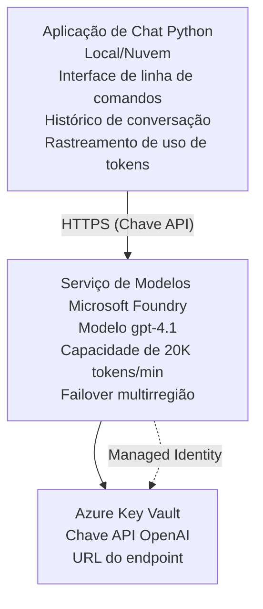

# Aplicação de Chat Microsoft Foundry Models

**Percurso de Aprendizagem:** Intermédio ⭐⭐ | **Duração:** 35-45 minutos | **Custo:** 50-200 $/mês

Uma aplicação completa de chat Microsoft Foundry Models implementada usando Azure Developer CLI (azd). Este exemplo demonstra a implementação do gpt-4.1, acesso seguro à API e uma interface simples de chat.

## 🎯 O Que Vai Aprender

- Implementar o Serviço Microsoft Foundry Models com o modelo gpt-4.1  
- Proteger chaves da API OpenAI com Key Vault  
- Criar uma interface simples de chat com Python  
- Monitorizar a utilização de tokens e custos  
- Implementar limitação de taxa e tratamento de erros  

## 📦 O Que Está Incluído

✅ **Serviço Microsoft Foundry Models** - implementação do modelo gpt-4.1  
✅ **Aplicação de Chat em Python** - Interface simples em linha de comandos  
✅ **Integração com Key Vault** - Armazenamento seguro de chaves API  
✅ **Templates ARM** - Infraestrutura completa como código  
✅ **Monitorização de Custos** - Acompanhamento da utilização de tokens  
✅ **Limitação de Taxa** - Prevenção de esgotamento de quotas  

## Arquitetura


## Pré-requisitos

### Requerido

- **Azure Developer CLI (azd)** - [Guia de instalação](https://learn.microsoft.com/azure/developer/azure-developer-cli/install-azd)  
- **Subscrição Azure** com acesso OpenAI - [Solicitar acesso](https://aka.ms/oai/access)  
- **Python 3.9+** - [Instalar Python](https://www.python.org/downloads/)  

### Verificar Pré-requisitos

```bash
# Verificar a versão do azd (é necessário 1.5.0 ou superior)
azd version

# Verificar login no Azure
azd auth login

# Verificar a versão do Python
python --version  # ou python3 --version

# Verificar o acesso ao OpenAI (verificar no Portal Azure)
az cognitiveservices account list-skus \
  --kind OpenAI \
  --location eastus
```

> **⚠️ Importante:** Microsoft Foundry Models requer aprovação de aplicação. Se ainda não solicitou, visite [aka.ms/oai/access](https://aka.ms/oai/access). A aprovação normalmente demora 1-2 dias úteis.

## ⏱️ Cronograma de Implementação

| Fase | Duração | O Que Acontece |
|-------|----------|--------------|
| Verificação de pré-requisitos | 2-3 minutos | Verificar disponibilidade da quota OpenAI |
| Implementar infraestrutura | 8-12 minutos | Criar OpenAI, Key Vault, implementação do modelo |
| Configurar aplicação | 2-3 minutos | Configurar ambiente e dependências |
| **Total** | **12-18 minutos** | Pronto para chat com gpt-4.1 |

**Nota:** A primeira implementação OpenAI pode demorar mais devido ao provisionamento do modelo.

## Início Rápido

```bash
# Navegar para o exemplo
cd examples/azure-openai-chat

# Inicializar o ambiente
azd env new myopenai

# Desplegar tudo (infraestrutura + configuração)
azd up
# Ser-lhe-á solicitado para:
# 1. Selecionar subscrição Azure
# 2. Escolher localização com disponibilidade OpenAI (ex: eastus, eastus2, westus)
# 3. Aguardar 12-18 minutos para o despliege

# Instalar dependências Python
pip install -r requirements.txt

# Começar a conversar!
python chat.py
```

**Saída Esperada:**  
```
🤖 Microsoft Foundry Models Chat Application
Connected to: gpt-4.1 (eastus)
Type your message (or 'quit' to exit)

You: Hello! Tell me about Microsoft Foundry Models.
Assistant: Microsoft Foundry Models Service provides REST API access to OpenAI's powerful language models including gpt-4.1, GPT-3.5-Turbo, and Embeddings...

[Tokens used: 145 | Estimated cost: $0.0044]
```

## ✅ Verificar a Implementação

### Passo 1: Verificar Recursos Azure

```bash
# Ver recursos implantados
azd show

# A saída esperada mostra:
# - Serviço OpenAI: (nome do recurso)
# - Cofre de Chaves: (nome do recurso)
# - Implantação: gpt-4.1
# - Localização: eastus (ou a sua região selecionada)
```

### Passo 2: Testar API OpenAI

```bash
# Obter endpoint e chave da OpenAI
OPENAI_ENDPOINT=$(azd env get-value AZURE_OPENAI_ENDPOINT)
OPENAI_KEY=$(azd env get-value AZURE_OPENAI_API_KEY)

# Testar chamada API
curl "$OPENAI_ENDPOINT/openai/deployments/gpt-4.1/chat/completions?api-version=2024-08-01-preview" \
  -H "Content-Type: application/json" \
  -H "api-key: $OPENAI_KEY" \
  -d '{
    "messages": [{"role": "user", "content": "Say hello!"}],
    "max_tokens": 50
  }'
```

**Resposta Esperada:**  
```json
{
  "choices": [
    {
      "message": {
        "role": "assistant",
        "content": "Hello! How can I assist you today?"
      }
    }
  ],
  "usage": {
    "prompt_tokens": 8,
    "completion_tokens": 9,
    "total_tokens": 17
  }
}
```

### Passo 3: Verificar Acesso ao Key Vault

```bash
# Listar segredos no Key Vault
KV_NAME=$(azd env get-value AZURE_KEY_VAULT_NAME)

az keyvault secret list \
  --vault-name $KV_NAME \
  --query "[].name" \
  --output table
```

**Segredos Esperados:**  
- `openai-api-key`  
- `openai-endpoint`  

**Critérios de Sucesso:**  
- ✅ Serviço OpenAI implementado com gpt-4.1  
- ✅ Chamada API retorna completamento válido  
- ✅ Segredos armazenados no Key Vault  
- ✅ Monitorização da utilização de tokens funciona  

## Estrutura do Projeto

```
azure-openai-chat/
├── README.md                   ✅ This guide
├── azure.yaml                  ✅ AZD configuration
├── infra/                      ✅ Infrastructure as Code
│   ├── main.bicep             ✅ Main Bicep template
│   ├── main.parameters.json   ✅ Parameters
│   └── openai.bicep           ✅ OpenAI resource definition
├── src/                        ✅ Application code
│   ├── chat.py                ✅ Chat interface
│   ├── config.py              ✅ Configuration loader
│   └── requirements.txt       ✅ Python dependencies
└── .gitignore                  ✅ Git ignore rules
```

## Funcionalidades da Aplicação

### Interface de Chat (`chat.py`)

A aplicação de chat inclui:

- **Histórico da Conversa** - Mantém o contexto entre mensagens  
- **Contagem de Tokens** - Acompanhamento da utilização e estimativa de custos  
- **Tratamento de Erros** - Gestão adequada de limites de taxa e erros API  
- **Estimativa de Custos** - Cálculo em tempo real do custo por mensagem  
- **Suporte a Streaming** - Respostas por streaming opcionais  

### Comandos

Enquanto conversa, pode usar:  
- `quit` ou `exit` - Terminar a sessão  
- `clear` - Limpar histórico da conversa  
- `tokens` - Mostrar total de tokens usados  
- `cost` - Mostrar custo total estimado  

### Configuração (`config.py`)

Carrega configuração a partir de variáveis de ambiente:  
```python
AZURE_OPENAI_ENDPOINT  # Do Cofre de Chaves
AZURE_OPENAI_API_KEY   # Do Cofre de Chaves
AZURE_OPENAI_MODEL     # Padrão: gpt-4.1
AZURE_OPENAI_MAX_TOKENS # Padrão: 800
```

## Exemplos de Utilização

### Chat Básico

```bash
python chat.py
```

### Chat com Modelo Personalizado

```bash
export AZURE_OPENAI_MODEL=gpt-35-turbo
python chat.py
```

### Chat com Streaming

```bash
python chat.py --stream
```

### Exemplo de Conversa

```
You: Explain Microsoft Foundry Models Service in 3 sentences.
Assistant: Microsoft Foundry Models Service is Microsoft Azure's cloud platform offering 
that provides access to OpenAI's powerful language models. It enables developers 
to integrate capabilities like gpt-4.1 into their applications with enterprise-grade 
security and compliance. The service includes features for content filtering, 
abuse monitoring, and responsible AI practices.

[Tokens used: 89 | Estimated cost: $0.0027]

You: What models are available?
Assistant: Microsoft Foundry Models Service offers several model families including gpt-4.1 
(most capable), GPT-3.5-Turbo (faster and cost-effective), and Embeddings models 
for vector search. Each model has different capabilities, pricing, and token limits.

[Tokens used: 67 | Estimated cost: $0.0020]

Total session: 156 tokens | $0.0047
```

## Gestão de Custos

### Preço por Token (gpt-4.1)

| Modelo | Entrada (por 1K tokens) | Saída (por 1K tokens) |
|-------|----------------------|------------------------|
| gpt-4.1 | $0.03 | $0.06 |
| GPT-3.5-Turbo | $0.0015 | $0.002 |

### Custos Mensais Estimados

Com base em padrões de utilização:

| Nível de Utilização | Mensagens/Dia | Tokens/Dia | Custo Mensal |
|-------------|--------------|------------|--------------|
| **Leve** | 20 mensagens | 3,000 tokens | $3-5 |
| **Moderado** | 100 mensagens | 15,000 tokens | $15-25 |
| **Elevado** | 500 mensagens | 75,000 tokens | $75-125 |

**Custo Base da Infraestrutura:** 1-2 $/mês (Key Vault + computação mínima)

### Dicas para Otimização de Custos

```bash
# 1. Use GPT-3.5-Turbo para tarefas mais simples (20x mais barato)
export AZURE_OPENAI_MODEL=gpt-35-turbo

# 2. Reduza o número máximo de tokens para respostas mais curtas
export AZURE_OPENAI_MAX_TOKENS=400

# 3. Monitorize o uso de tokens
python chat.py --show-tokens

# 4. Configure alertas de orçamento
az consumption budget create \
  --budget-name "openai-budget" \
  --amount 50 \
  --time-grain Monthly
```

## Monitorização

### Ver Utilização de Tokens

```bash
# No Portal Azure:
# Recurso OpenAI → Métricas → Selecione "Transação de Token"

# Ou via Azure CLI:
az monitor metrics list \
  --resource $(azd env get-value AZURE_OPENAI_RESOURCE_ID) \
  --metric "TokenTransaction" \
  --start-time $(date -u -d '1 hour ago' '+%Y-%m-%dT%H:%M:%S') \
  --interval PT1M
```

### Ver Logs da API

```bash
# Transmitir registos de diagnóstico
az monitor diagnostic-settings create \
  --resource $(azd env get-value AZURE_OPENAI_RESOURCE_ID) \
  --name openai-logs \
  --logs '[{"category": "Audit", "enabled": true}]' \
  --workspace $(azd env get-value LOG_ANALYTICS_WORKSPACE_ID)

# Consultar registos
az monitor log-analytics query \
  --workspace $(azd env get-value LOG_ANALYTICS_WORKSPACE_ID) \
  --analytics-query "AzureDiagnostics | where Category == 'Audit' | top 10 by TimeGenerated"
```

## Resolução de Problemas

### Problema: Erro "Access Denied"

**Sintomas:** 403 Forbidden ao chamar API

**Soluções:**  
```bash
# 1. Verifique se o acesso ao OpenAI está aprovado
az cognitiveservices account show \
  --name $(azd env get-value AZURE_OPENAI_NAME) \
  --resource-group $(azd env get-value AZURE_RESOURCE_GROUP)

# 2. Verifique se a chave API está correta
azd env get-value AZURE_OPENAI_API_KEY

# 3. Verifique o formato da URL do endpoint
azd env get-value AZURE_OPENAI_ENDPOINT
# Deve ser: https://[nome].openai.azure.com/
```

### Problema: "Rate Limit Exceeded"

**Sintomas:** 429 Too Many Requests

**Soluções:**  
```bash
# 1. Verificar a quota atual
az cognitiveservices account deployment show \
  --name $(azd env get-value AZURE_OPENAI_NAME) \
  --resource-group $(azd env get-value AZURE_RESOURCE_GROUP) \
  --deployment-name gpt-4.1

# 2. Solicitar aumento da quota (se necessário)
# Ir para o Portal Azure → Recurso OpenAI → Quotas → Solicitar Aumento

# 3. Implementar a lógica de nova tentativa (já está em chat.py)
# A aplicação tenta automaticamente de novo com retrocesso exponencial
```

### Problema: "Model Not Found"

**Sintomas:** Erro 404 na implementação

**Soluções:**  
```bash
# 1. Listar implementações disponíveis
az cognitiveservices account deployment list \
  --name $(azd env get-value AZURE_OPENAI_NAME) \
  --resource-group $(azd env get-value AZURE_RESOURCE_GROUP)

# 2. Verificar o nome do modelo no ambiente
echo $AZURE_OPENAI_MODEL

# 3. Atualizar para o nome correto da implementação
export AZURE_OPENAI_MODEL=gpt-4.1  # ou gpt-35-turbo
```

### Problema: Alta Latência

**Sintomas:** Respostas lentas (>5 segundos)

**Soluções:**  
```bash
# 1. Verificar latência regional
# Implantar na região mais próxima dos utilizadores

# 2. Reduzir max_tokens para respostas mais rápidas
export AZURE_OPENAI_MAX_TOKENS=400

# 3. Utilizar streaming para melhor experiência de utilizador
python chat.py --stream
```

## Melhores Práticas de Segurança

### 1. Proteja as Chaves da API

```bash
# Nunca faça commit de chaves para o controlo de versão
# Use o Key Vault (já configurado)

# Rode as chaves regularmente
az cognitiveservices account keys regenerate \
  --name $(azd env get-value AZURE_OPENAI_NAME) \
  --resource-group $(azd env get-value AZURE_RESOURCE_GROUP) \
  --key-name key1
```

### 2. Implementar Filtragem de Conteúdo

```python
# Microsoft Foundry Models inclui filtragem de conteúdo incorporada
# Configurar no Portal Azure:
# Recurso OpenAI → Filtros de Conteúdo → Criar Filtro Personalizado

# Categorias: Ódio, Sexual, Violência, Autoagressão
# Níveis: Filtragem Baixa, Média, Alta
```

### 3. Use Identidade Gerida (Produção)

```bash
# Para implantações de produção, utilize identidade gerida
# em vez de chaves API (requer alojamento da aplicação na Azure)

# Atualize infra/openai.bicep para incluir:
# identity: { tipo: 'SystemAssigned' }
```

## Desenvolvimento

### Executar Localmente

```bash
# Instalar dependências
pip install -r src/requirements.txt

# Definir variáveis de ambiente
export AZURE_OPENAI_ENDPOINT="https://[name].openai.azure.com/"
export AZURE_OPENAI_API_KEY="your-api-key"
export AZURE_OPENAI_MODEL="gpt-4.1"

# Executar aplicação
python src/chat.py
```

### Executar Testes

```bash
# Instalar dependências de teste
pip install pytest pytest-cov

# Executar testes
pytest tests/ -v

# Com cobertura
pytest tests/ --cov=src --cov-report=html
```

### Atualizar Implementação do Modelo

```bash
# Implementar versão diferente do modelo
az cognitiveservices account deployment create \
  --name $(azd env get-value AZURE_OPENAI_NAME) \
  --resource-group $(azd env get-value AZURE_RESOURCE_GROUP) \
  --deployment-name gpt-35-turbo \
  --model-name gpt-35-turbo \
  --model-version "0613" \
  --model-format OpenAI \
  --sku-capacity 20 \
  --sku-name "Standard"
```

## Limpeza

```bash
# Eliminar todos os recursos do Azure
azd down --force --purge

# Isto remove:
# - Serviço OpenAI
# - Key Vault (com eliminação suave de 90 dias)
# - Grupo de Recursos
# - Todas as implementações e configurações
```

## Próximos Passos

### Expandir este Exemplo

1. **Adicionar Interface Web** - Construir frontend React/Vue  
   ```bash
   # Adicionar serviço frontend ao azure.yaml
   # Implantar nas Azure Static Web Apps
   ```

2. **Implementar RAG** - Adicionar pesquisa documental com Azure AI Search  
   ```python
   # Integrar a Pesquisa Cognitiva Azure
   # Carregar documentos e criar índice vetorial
   ```

3. **Adicionar Invocação de Funções** - Permitir uso de ferramentas  
   ```python
   # Definir funções em chat.py
   # Permitir que o gpt-4.1 chame APIs externas
   ```

4. **Suporte Multi-Modelo** - Implementar múltiplos modelos  
   ```bash
   # Adicionar gpt-35-turbo, modelos de embeddings
   # Implementar lógica de encaminhamento de modelos
   ```

### Exemplos Relacionados

- **[Retail Multi-Agent](../retail-scenario.md)** - Arquitetura multi-agente avançada  
- **[Database App](../../../../examples/database-app)** - Adicionar armazenamento persistente  
- **[Container Apps](../../../../examples/container-app)** - Implementar como serviço conteinerizado  

### Recursos de Aprendizagem

- 📚 [Curso AZD Para Iniciantes](../../README.md) - Página principal do curso  
- 📚 [Documentação Microsoft Foundry Models](https://learn.microsoft.com/azure/ai-services/openai/) - Documentação oficial  
- 📚 [Referência API OpenAI](https://platform.openai.com/docs/api-reference) - Detalhes da API  
- 📚 [IA Responsável](https://www.microsoft.com/ai/responsible-ai) - Melhores práticas  

## Recursos Adicionais

### Documentação
- **[Serviço Microsoft Foundry Models](https://learn.microsoft.com/azure/ai-services/openai/)** - Guia completo  
- **[Modelos gpt-4.1](https://learn.microsoft.com/azure/ai-services/openai/concepts/models)** - Capacidades do modelo  
- **[Filtragem de Conteúdo](https://learn.microsoft.com/azure/ai-services/openai/concepts/content-filter)** - Funcionalidades de segurança  
- **[Azure Developer CLI](https://learn.microsoft.com/azure/developer/azure-developer-cli/)** - Referência azd  

### Tutoriais
- **[Início Rápido OpenAI](https://learn.microsoft.com/azure/ai-services/openai/quickstart)** - Primeira implementação  
- **[Completions de Chat](https://learn.microsoft.com/azure/ai-services/openai/how-to/chatgpt)** - Construção de aplicações de chat  
- **[Invocação de Funções](https://learn.microsoft.com/azure/ai-services/openai/how-to/function-calling)** - Funcionalidades avançadas  

### Ferramentas
- **[Microsoft Foundry Models Studio](https://oai.azure.com/)** - Ambiente web interativo  
- **[Guia de Engenharia de Prompts](https://platform.openai.com/docs/guides/prompt-engineering)** - Escrever melhores prompts  
- **[Calculadora de Tokens](https://platform.openai.com/tokenizer)** - Estimar utilização de tokens  

### Comunidade
- **[Discord Azure AI](https://discord.gg/azure)** - Obter ajuda da comunidade  
- **[Discussões GitHub](https://github.com/Azure-Samples/openai/discussions)** - Fórum de perguntas e respostas  
- **[Blog Azure](https://azure.microsoft.com/blog/tag/azure-openai-service/)** - Atualizações recentes  

---

**🎉 Sucesso!** Implementou Microsoft Foundry Models e criou uma aplicação de chat funcional. Comece a explorar as capacidades do gpt-4.1 e experimente diferentes prompts e casos de uso.

**Dúvidas?** [Abra uma questão](https://github.com/microsoft/AZD-for-beginners/issues) ou consulte as [FAQ](../../resources/faq.md)

**Alerta de Custo:** Lembre-se de executar `azd down` ao terminar os testes para evitar cobranças contínuas (~50-100 $/mês para uso ativo).

---

<!-- CO-OP TRANSLATOR DISCLAIMER START -->
**Aviso Legal**:  
Este documento foi traduzido utilizando o serviço de tradução por IA [Co-op Translator](https://github.com/Azure/co-op-translator). Embora nos esforcemos pela precisão, por favor, esteja ciente de que traduções automáticas podem conter erros ou imprecisões. O documento original na sua língua nativa deve ser considerado a fonte autorizada. Para informações críticas, recomenda-se tradução profissional humana. Não nos responsabilizamos por quaisquer mal-entendidos ou interpretações erradas decorrentes do uso desta tradução.
<!-- CO-OP TRANSLATOR DISCLAIMER END -->