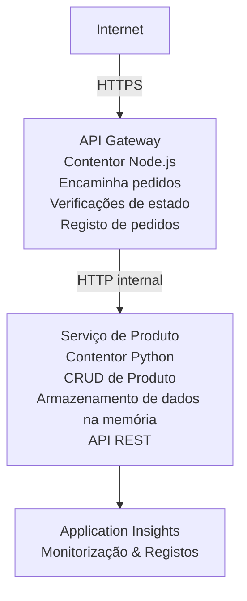

# Arquitectura de Microserviços - Exemplo de Container App

⏱️ **Tempo Estimado**: 25-35 minutos | 💰 **Custo Estimado**: ~$50-100/mês | ⭐ **Complexidade**: Avançado

Uma arquitetura de microserviços **simplificada mas funcional** implementada em Azure Container Apps usando AZD CLI. Este exemplo demonstra comunicação entre serviços, orquestração de containers e monitorização com uma configuração prática de 2 serviços.

> **📚 Abordagem de Aprendizagem**: Este exemplo começa com uma arquitetura mínima de 2 serviços (API Gateway + Serviço Backend) que pode realmente implantar e aprender. Depois de dominar esta base, damos orientações para expansão para um ecossistema completo de microserviços.

## O Que Vai Aprender

Ao completar este exemplo, irá:
- Implementar múltiplos containers no Azure Container Apps
- Implementar comunicação serviço-a-serviço com rede interna
- Configurar escalonamento e verificações de saúde baseados no ambiente
- Monitorizar aplicações distribuidas com Application Insights
- Compreender padrões e melhores práticas de implantação de microserviços
- Aprender expansão progressiva de arquiteturas simples para complexas

## Arquitetura

### Fase 1: O Que Estamos a Construir (Incluído Neste Exemplo)


**Por Que Começar Simples?**
- ✅ Implantar e compreender rapidamente (25-35 minutos)
- ✅ Aprender padrões essenciais de microserviços sem complexidade
- ✅ Código funcional que pode modificar e experimentar
- ✅ Custo reduzido para aprendizagem (~$50-100/mês vs $300-1400/mês)
- ✅ Construir confiança antes de adicionar bases de dados e filas de mensagens

**Analogia**: Pense nisto como aprender a conduzir. Começa num parque vazio (2 serviços), domina o básico, depois passa ao trânsito da cidade (5+ serviços com bases de dados).

### Fase 2: Expansão Futura (Arquitetura de Referência)

Quando dominar a arquitetura de 2 serviços, pode expandir para:

```
Full Architecture (Not Included - For Reference)
├── API Gateway (✅ Included)
├── Product Service (✅ Included)
├── Order Service (🔜 Add next)
├── User Service (🔜 Add next)
├── Notification Service (🔜 Add last)
├── Azure Service Bus (🔜 For async communication)
├── Cosmos DB (🔜 For product persistence)
├── Azure SQL (🔜 For order management)
└── Azure Storage (🔜 For file storage)
```

Veja a secção "Guia de Expansão" no final para instruções passo a passo.

## Funcionalidades Incluídas

✅ **Descoberta de Serviços**: Descoberta automática baseada em DNS entre containers  
✅ **Balanceamento de Carga**: Balanceamento de carga incorporado entre réplicas  
✅ **Autoescalonamento**: Escalonamento independente por serviço com base em pedidos HTTP  
✅ **Monitorização da Saúde**: Probes de liveness e readiness para ambos os serviços  
✅ **Logs Distribuídos**: Logging centralizado com Application Insights  
✅ **Rede Interna**: Comunicação segura serviço-a-serviço  
✅ **Orquestração de Containers**: Implantação e escalonamento automáticos  
✅ **Atualizações sem Downtime**: Atualizações progressivas com gestão de revisões  

## Pré-requisitos

### Ferramentas Necessárias

Antes de começar, verifique se tem estas ferramentas instaladas:

1. **[Azure Developer CLI (azd)](https://learn.microsoft.com/azure/developer/azure-developer-cli/install-azd)** (versão 1.0.0 ou superior)
   ```bash
   azd version
   # Resultado esperado: versão azd 1.0.0 ou superior
   ```

2. **[Azure CLI](https://learn.microsoft.com/cli/azure/install-azure-cli)** (versão 2.50.0 ou superior)
   ```bash
   az --version
   # Saída esperada: azure-cli 2.50.0 ou superior
   ```

3. **[Docker](https://www.docker.com/get-started)** (para desenvolvimento/testes locais - opcional)
   ```bash
   docker --version
   # Saída esperada: Versão do Docker 20.10 ou superior
   ```

### Requisitos Azure

- Uma **subscrição Azure** ativa ([crie uma conta grátis](https://azure.microsoft.com/free/))
- Permissões para criar recursos na sua subscrição
- Papel de **Colaborador** na subscrição ou grupo de recursos

### Conhecimentos Pré-requisitos

Este é um exemplo de nível **avançado**. Deve ter:
- Completo o [Exemplo Simples de API Flask](../../../../../examples/container-app/simple-flask-api) 
- Compreensão básica de arquitetura de microserviços
- Familiaridade com APIs REST e HTTP
- Compreensão de conceitos de containers

**Novo nos Container Apps?** Comece pelo [Exemplo Simples de API Flask](../../../../../examples/container-app/simple-flask-api) para aprender o básico.

## Início Rápido (Passo a Passo)

### Passo 1: Clonar e Navegar

```bash
git clone https://github.com/microsoft/AZD-for-beginners.git
cd AZD-for-beginners/examples/container-app/microservices
```

**✓ Verificação de Sucesso**: Verifique se vê `azure.yaml`:
```bash
ls
# Esperado: README.md, azure.yaml, infra/, src/
```

### Passo 2: Autenticar no Azure

```bash
azd auth login
```

Isto abre o seu navegador para autenticação no Azure. Inicie sessão com as suas credenciais Azure.

**✓ Verificação de Sucesso**: Deve ver:
```
Logged in to Azure.
```

### Passo 3: Inicializar o Ambiente

```bash
azd init
```

**Perguntas que verá**:
- **Nome do Ambiente**: Introduza um nome curto (ex.: `microservices-dev`)
- **Subscrição Azure**: Selecione a sua subscrição
- **Localização Azure**: Escolha uma região (ex.: `eastus`, `westeurope`)

**✓ Verificação de Sucesso**: Deve ver:
```
SUCCESS: New project initialized!
```

### Passo 4: Implantar Infraestrutura e Serviços

```bash
azd up
```

**O que acontece** (leva 8-12 minutos):
1. Cria ambiente Container Apps
2. Cria Application Insights para monitorização
3. Constroi container API Gateway (Node.js)
4. Constroi container Product Service (Python)
5. Implanta ambos os containers no Azure
6. Configura rede e verificações de saúde
7. Configura monitorização e logging

**✓ Verificação de Sucesso**: Deve ver:
```
SUCCESS: Your application was deployed to Azure in X minutes Y seconds.
Endpoint: https://api-gateway-<unique-id>.azurecontainerapps.io
```

**⏱️ Tempo**: 8-12 minutos

### Passo 5: Testar a Implantação

```bash
# Obter o endpoint do gateway
GATEWAY_URL=$(azd env get-values | grep API_GATEWAY_URL | cut -d '=' -f2 | tr -d '"')

# Testar a saúde do API Gateway
curl $GATEWAY_URL/health

# Saída esperada:
# {"status":"healthy","service":"api-gateway","timestamp":"2025-11-19T10:30:00Z"}
```

**Testar serviço de produtos através do gateway**:
```bash
# Listar produtos
curl $GATEWAY_URL/api/products

# Saída esperada:
# [
#   {"id":1,"name":"Laptop","price":999.99,"stock":50},
#   {"id":2,"name":"Mouse","price":29.99,"stock":200},
#   {"id":3,"name":"Keyboard","price":79.99,"stock":150}
# ]
```

**✓ Verificação de Sucesso**: Ambos endpoints devolvem dados JSON sem erros.

---

**🎉 Parabéns!** Implantou uma arquitetura de microserviços no Azure!

## Estrutura do Projeto

Todos os ficheiros de implementação estão incluídos — este é um exemplo completo e funcional:

```
microservices/
│
├── README.md                         # This file
├── azure.yaml                        # AZD configuration
├── .gitignore                        # Git ignore patterns
│
├── infra/                           # Infrastructure as Code (Bicep)
│   ├── main.bicep                   # Main orchestration
│   ├── abbreviations.json           # Naming conventions
│   ├── core/                        # Shared infrastructure
│   │   ├── container-apps-environment.bicep  # Container environment + registry
│   │   └── monitor.bicep            # Application Insights + Log Analytics
│   └── app/                         # Service definitions
│       ├── api-gateway.bicep        # API Gateway container app
│       └── product-service.bicep    # Product Service container app
│
└── src/                             # Application source code
    ├── api-gateway/                 # Node.js API Gateway
    │   ├── app.js                   # Express server with routing
    │   ├── package.json             # Node dependencies
    │   └── Dockerfile               # Container definition
    └── product-service/             # Python Product Service
        ├── main.py                  # Flask API with product data
        ├── requirements.txt         # Python dependencies
        └── Dockerfile               # Container definition
```

**O Que Cada Componente Faz:**

**Infraestrutura (infra/)**:
- `main.bicep`: Orquestra todos os recursos Azure e suas dependências
- `core/container-apps-environment.bicep`: Cria o ambiente Container Apps e Azure Container Registry
- `core/monitor.bicep`: Configura Application Insights para logging distribuído
- `app/*.bicep`: Definições individuais de container app com escalonamento e verificações de saúde

**API Gateway (src/api-gateway/)**:
- Serviço público que encaminha pedidos para serviços backend
- Implementa logging, tratamento de erros e encaminhamento de pedidos
- Demonstra comunicação HTTP serviço-a-serviço

**Serviço de Produto (src/product-service/)**:
- Serviço interno com catálogo de produtos (em memória para simplicidade)
- API REST com verificações de saúde
- Exemplo de padrão backend de microserviço

## Visão Geral dos Serviços

### API Gateway (Node.js/Express)

**Porta**: 8080  
**Acesso**: Público (ingresso externo)  
**Finalidade**: Encaminha pedidos para serviços backend apropriados  

**Endpoints**:
- `GET /` - Informação do serviço
- `GET /health` - Endpoint de verificação de saúde
- `GET /api/products` - Encaminha para serviço de produtos (listar todos)
- `GET /api/products/:id` - Encaminha para serviço de produtos (obter por ID)

**Características Principais**:
- Encaminhamento de pedidos com axios
- Logging centralizado
- Tratamento de erros e gestão de timeouts
- Descoberta de serviços via variáveis de ambiente
- Integração com Application Insights

**Destaque do Código** (`src/api-gateway/app.js`):
```javascript
// Comunicação interna do serviço
app.get('/api/products', async (req, res) => {
  const response = await axios.get(`${PRODUCT_SERVICE_URL}/products`);
  res.json(response.data);
});
```

### Serviço de Produto (Python/Flask)

**Porta**: 8000  
**Acesso**: Apenas interno (sem ingresso externo)  
**Finalidade**: Gere o catálogo de produtos com dados em memória  

**Endpoints**:
- `GET /` - Informação do serviço
- `GET /health` - Endpoint de verificação de saúde
- `GET /products` - Lista todos os produtos
- `GET /products/<id>` - Obtém produto por ID

**Características Principais**:
- API RESTful com Flask
- Armazenamento de produtos em memória (simples, sem base de dados)
- Monitorização de saúde com probes
- Logging estruturado
- Integração com Application Insights

**Modelo de Dados**:
```python
{
  "id": 1,
  "name": "Laptop",
  "description": "High-performance laptop",
  "price": 999.99,
  "stock": 50
}
```

**Por Que Apenas Interno?**
O serviço de produtos não está exposto publicamente. Todos os pedidos têm que passar pelo API Gateway, que oferece:
- Segurança: Ponto de acesso controlado
- Flexibilidade: Pode alterar backend sem afetar clientes
- Monitorização: Logging centralizado de pedidos

## Compreender Comunicação Entre Serviços

### Como os Serviços Comunicam entre Si

Neste exemplo, o API Gateway comunica com o Serviço de Produto usando chamadas HTTP **internas**:

```javascript
// API Gateway (src/api-gateway/app.js)
const PRODUCT_SERVICE_URL = process.env.PRODUCT_SERVICE_URL;

// Fazer pedido HTTP interno
const response = await axios.get(`${PRODUCT_SERVICE_URL}/products`);
```

**Pontos-Chave**:

1. **Descoberta Baseada em DNS**: Container Apps providencia DNS automático para serviços internos
   - FQDN Serviço de Produto: `product-service.internal.<environment>.azurecontainerapps.io`
   - Simplificado como: `http://product-service` (Container Apps resolve isto)

2. **Sem Exposição Pública**: Serviço de Produto tem `external: false` no Bicep
   - Acessível apenas dentro do ambiente Container Apps
   - Não acessível da internet

3. **Variáveis de Ambiente**: URLs dos serviços são injetados no tempo de implantação
   - Bicep passa o FQDN interno para o gateway
   - Não há URLs hardcoded no código da aplicação

**Analogia**: Pense nisto como salas de escritório. O API Gateway é a receção (pública), o Serviço de Produto é uma sala de escritório (apenas interna). Visitantes têm que passar pela receção para chegar a qualquer sala.

## Opções de Implantação

### Implantação Completa (Recomendada)

```bash
# Implementar a infraestrutura e ambos os serviços
azd up
```

Isto implanta:
1. Ambiente Container Apps
2. Application Insights
3. Registry de Containers
4. Container API Gateway
5. Container Serviço de Produto

**Tempo**: 8-12 minutos

### Implantar Serviço Individual

```bash
# Desplegar apenas um serviço (após o azd up inicial)
azd deploy api-gateway

# Ou desplegar o serviço do produto
azd deploy product-service
```

**Caso de Uso**: Quando atualizou o código num serviço e quer apenas redeployar esse serviço.

### Atualizar Configuração

```bash
# Alterar parâmetros de escala
azd env set GATEWAY_MAX_REPLICAS 30

# Reimplantar com nova configuração
azd up
```

## Configuração

### Configuração de Escalonamento

Ambos serviços têm escalonamento automático baseado em HTTP definido nos seus ficheiros Bicep:

**API Gateway**:
- Mínimo de réplicas: 2 (sempre pelo menos 2 para disponibilidade)
- Máximo de réplicas: 20
- Gatilho de escala: 50 pedidos concorrentes por réplica

**Serviço de Produto**:
- Mínimo de réplicas: 1 (pode escalar para zero se necessário)
- Máximo de réplicas: 10
- Gatilho de escala: 100 pedidos concorrentes por réplica

**Personalizar Escalonamento** (em `infra/app/*.bicep`):
```bicep
scale: {
  minReplicas: 1
  maxReplicas: 10
  rules: [
    {
      name: 'http-scale-rule'
      http: {
        metadata: {
          concurrentRequests: '100'  // Adjust this
        }
      }
    }
  ]
}
```

### Alocação de Recursos

**API Gateway**:
- CPU: 1.0 vCPU
- Memória: 2 GiB
- Justificação: Gere todo o tráfego externo

**Serviço de Produto**:
- CPU: 0.5 vCPU
- Memória: 1 GiB
- Justificação: Operações leves em memória

### Verificações de Saúde

Ambos serviços incluem probes de liveness e readiness:

```bicep
probes: [
  {
    type: 'Liveness'
    httpGet: {
      path: '/health'
      port: 8080
    }
    initialDelaySeconds: 10
    periodSeconds: 30
  }
  {
    type: 'Readiness'
    httpGet: {
      path: '/health'
      port: 8080
    }
    initialDelaySeconds: 5
    periodSeconds: 10
  }
]
```

**O Que Isto Significa**:
- **Liveness**: Se falhar, Container Apps reinicia o container
- **Readiness**: Se não estiver pronto, Container Apps para de encaminhar tráfego para essa réplica


## Monitorização & Observabilidade

### Ver Logs do Serviço

```bash
# Ver registos usando azd monitor
azd monitor --logs

# Ou usar o Azure CLI para apps de contentor específicas:
# Transmitir registos do API Gateway
az containerapp logs show --name api-gateway --resource-group $RG_NAME --follow

# Ver registos recentes do serviço de produtos
az containerapp logs show --name product-service --resource-group $RG_NAME --tail 100
```

**Saída Esperada**:
```
[api-gateway] API Gateway listening on port 8080
[api-gateway] Product Service URL: http://product-service
[api-gateway] GET /api/products 200 - 45ms
[product-service] Retrieved 5 products
```

### Queries no Application Insights

Aceda ao Application Insights no Portal Azure, depois execute estas queries:

**Encontrar Pedidos Lentos**:
```kusto
requests
| where timestamp > ago(1h)
| where duration > 1000  // Requests taking >1 second
| summarize count() by name, cloud_RoleName
| order by count_ desc
```

**Monitorizar Chamadas Serviço-a-Serviço**:
```kusto
dependencies
| where timestamp > ago(1h)
| where type == "Http"
| project timestamp, name, target, duration, success
| order by timestamp desc
```

**Taxa de Erro por Serviço**:
```kusto
exceptions
| where timestamp > ago(24h)
| summarize errorCount = count() by cloud_RoleName, type
| order by errorCount desc
```

**Volume de Pedidos ao Longo do Tempo**:
```kusto
requests
| where timestamp > ago(1h)
| summarize requestCount = count() by bin(timestamp, 5m), cloud_RoleName
| render timechart
```

### Aceder ao Dashboard de Monitorização

```bash
# Obter detalhes do Application Insights
azd env get-values | grep APPLICATIONINSIGHTS

# Abrir monitorização do Azure Portal
az monitor app-insights component show \
  --app $(azd env get-values | grep APPLICATIONINSIGHTS_CONNECTION_STRING | cut -d '=' -f2) \
  --resource-group $(azd env get-values | grep AZURE_RESOURCE_GROUP | cut -d '=' -f2) \
  --query "appId" -o tsv
```

### Métricas em Tempo Real

1. Navegue para Application Insights no Portal Azure
2. Clique em "Live Metrics"
3. Veja pedidos, falhas e desempenho em tempo real
4. Teste executando: `curl $(azd env get-values | grep API_GATEWAY_URL | cut -d '=' -f2 | tr -d '"')/api/products`

## Exercícios Práticos

[Nota: Veja os exercícios completos acima na secção "Exercícios Práticos" para exercícios detalhados passo a passo incluindo verificação de implantação, modificação de dados, testes de autoescalonamento, tratamento de erros e adicionar um terceiro serviço.]

## Análise de Custos

### Custos Mensais Estimados (Para Este Exemplo de 2 Serviços)

| Recurso | Configuração | Custo Estimado |
|----------|--------------|----------------|
| API Gateway | 2-20 réplicas, 1 vCPU, 2GB RAM | $30-150 |
| Serviço de Produto | 1-10 réplicas, 0.5 vCPU, 1GB RAM | $15-75 |
| Registry de Containers | Plano básico | $5 |
| Application Insights | 1-2 GB/mês | $5-10 |
| Log Analytics | 1 GB/mês | $3 |
| **Total** | | **$58-243/mês** |

**Detalhe do Custo por Uso**:
- **Tráfego leve** (teste/aprendizagem): ~$60/mês
- **Tráfego moderado** (produção pequena): ~$120/mês
- **Tráfego intenso** (períodos de pico): ~$240/mês

### Dicas para Otimização de Custos

1. **Escalonar para Zero em Desenvolvimento**:
   ```bicep
   scale: {
     minReplicas: 0  // Save $30-40/month when not in use
     maxReplicas: 10
   }
   ```

2. **Usar Plano Consumo para Cosmos DB** (quando adicionar):
   - Paga só pelo que usar
   - Sem custo mínimo

3. **Configurar Amostragem no Application Insights**:
   ```javascript
   appInsights.defaultClient.config.samplingPercentage = 50; // Amostra 50% dos pedidos
   ```

4. **Limpar Recursos Quando Não Necessários**:
   ```bash
   azd down
   ```

### Opções no Plano Gratuito

Para aprendizagem/testes, considere:
- Use créditos gratuitos do Azure (primeiros 30 dias)
- Mantenha o número mínimo de réplicas
- Apague após o teste (sem custos contínuos)

---

## Limpeza

Para evitar custos contínuos, apague todos os recursos:

```bash
azd down --force --purge
```

**Pedido de Confirmação**:
```
? Total resources to delete: 6, are you sure you want to continue? (y/N)
```

Digite `y` para confirmar.

**O Que Será Apagado**:
- Ambiente Container Apps
- Ambos os Container Apps (gateway & serviço de produto)
- Container Registry
- Application Insights
- Log Analytics Workspace
- Grupo de Recursos

**✓ Verificar Limpeza**:
```bash
az group list --query "[?starts_with(name,'rg-microservices')]" --output table
```

Deve retornar vazio.

---

## Guia de Expansão: De 2 para 5+ Serviços

Depois de dominar esta arquitetura de 2 serviços, eis como expandir:

### Fase 1: Adicionar Persistência em Base de Dados (Próximo Passo)

**Adicionar Cosmos DB para o Serviço de Produto**:

1. Criar `infra/core/cosmos.bicep`:
   ```bicep
   resource cosmosAccount 'Microsoft.DocumentDB/databaseAccounts@2023-04-15' = {
     name: name
     location: location
     kind: 'GlobalDocumentDB'
     properties: {
       databaseAccountOfferType: 'Standard'
       locations: [{ locationName: location, failoverPriority: 0 }]
     }
   }
   ```

2. Atualizar serviço de produto para usar Cosmos DB em vez de dados em memória

3. Custo adicional estimado: ~$25/mês (serverless)

### Fase 2: Adicionar Terceiro Serviço (Gestão de Encomendas)

**Criar Serviço de Encomendas**:

1. Nova pasta: `src/order-service/` (Python/Node.js/C#)
2. Novo Bicep: `infra/app/order-service.bicep`
3. Atualizar API Gateway para direcionar `/api/orders`
4. Adicionar Azure SQL Database para persistência de encomendas

**Arquitetura fica**:
```
API Gateway → Product Service (Cosmos DB)
           → Order Service (Azure SQL)
```

### Fase 3: Adicionar Comunicação Assíncrona (Service Bus)

**Implementar Arquitetura Orientada a Eventos**:

1. Adicionar Azure Service Bus: `infra/core/servicebus.bicep`
2. Serviço de Produto publica eventos "ProductCreated"
3. Serviço de Encomendas subscreve eventos de produto
4. Adicionar Serviço de Notificações para processar eventos

**Padrão**: Pedido/Resposta (HTTP) + Orientado a Eventos (Service Bus)

### Fase 4: Adicionar Autenticação de Utilizadores

**Implementar Serviço de Utilizadores**:

1. Criar `src/user-service/` (Go/Node.js)
2. Adicionar Azure AD B2C ou autenticação JWT personalizada
3. API Gateway valida tokens
4. Serviços verificam permissões dos utilizadores

### Fase 5: Preparação para Produção

**Adicionar Estes Componentes**:
- Azure Front Door (balanceamento de carga global)
- Azure Key Vault (gestão de segredos)
- Azure Monitor Workbooks (dashboards personalizados)
- Pipeline CI/CD (GitHub Actions)
- Deployments Blue-Green
- Identidade Gerida para todos os serviços

**Custo Total da Arquitetura de Produção**: ~$300-1,400/mês

---

## Saiba Mais

### Documentação Relacionada
- [Documentação Azure Container Apps](https://learn.microsoft.com/azure/container-apps/)
- [Guia de Arquitetura Microserviços](https://learn.microsoft.com/azure/architecture/guide/architecture-styles/microservices)
- [Application Insights para Rastreamento Distribuído](https://learn.microsoft.com/azure/azure-monitor/app/distributed-tracing)
- [Documentação Azure Developer CLI](https://learn.microsoft.com/azure/developer/azure-developer-cli/)

### Próximos Passos Neste Curso
- ← Anterior: [Simple Flask API](../../../../../examples/container-app/simple-flask-api) - Exemplo simples monocontainer para iniciantes
- → Seguinte: [Guia de Integração AI](../../../../../examples/docs/ai-foundry) - Adicionar funcionalidades de IA
- 🏠 [Página Inicial do Curso](../../README.md)

### Comparação: Quando Usar Cada Opção

**Aplicação Container Única** (exemplo Simple Flask API):
- ✅ Aplicações simples
- ✅ Arquitetura monolítica
- ✅ Desdobramento rápido
- ❌ Escalabilidade limitada
- **Custo**: ~$15-50/mês

**Microserviços** (Este exemplo):
- ✅ Aplicações complexas
- ✅ Escalabilidade independente por serviço
- ✅ Autonomia das equipas (serviços diferentes, equipas diferentes)
- ❌ Mais complexo de gerir
- **Custo**: ~$60-250/mês

**Kubernetes (AKS)**:
- ✅ Controlo e flexibilidade máximos
- ✅ Portabilidade multi-cloud
- ✅ Redes avançadas
- ❌ Requer experiência em Kubernetes
- **Custo**: ~$150-500/mês mínimo

**Recomendação**: Comece com Container Apps (este exemplo), mude para AKS apenas se precisar de funcionalidades específicas de Kubernetes.

---

## Perguntas Frequentes

**P: Porque só 2 serviços em vez de 5+?**  
R: Progresso educativo. Domine o básico (comunicação de serviços, monitorização, escalabilidade) com um exemplo simples antes de adicionar complexidade. Os padrões aprendidos aqui aplicam-se a arquiteturas com 100 serviços.

**P: Posso adicionar mais serviços eu próprio?**  
R: Absolutamente! Siga o guia de expansão acima. Cada novo serviço segue o mesmo padrão: criar pasta src, criar ficheiro Bicep, atualizar azure.yaml, fazer deploy.

**P: Isto está pronto para produção?**  
R: É uma base sólida. Para produção, adicione: identidade gerida, Key Vault, bases de dados persistentes, pipeline CI/CD, alertas de monitorização e estratégia de backup.

**P: Porque não usar Dapr ou outro service mesh?**  
R: Mantenha simples para aprendizagem. Quando entender a rede nativa dos Container Apps, pode sobrepor Dapr para cenários avançados.

**P: Como faço debug localmente?**  
R: Execute services localmente com Docker:
```bash
cd src/api-gateway
docker build -t local-gateway .
docker run -p 8080:8080 -e PRODUCT_SERVICE_URL=http://localhost:8000 local-gateway
```

**P: Posso usar linguagens de programação diferentes?**  
R: Sim! Este exemplo mostra Node.js (gateway) + Python (serviço de produto). Pode misturar quaisquer linguagens que funcionem em containers.

**P: E se não tiver créditos no Azure?**  
R: Use o nível gratuito do Azure (primeiros 30 dias em contas novas) ou faça deploy para períodos curtos de teste e apague de imediato.

---

> **🎓 Resumo do Roteiro de Aprendizagem**: Aprendeu a implementar uma arquitetura multi-serviço com escalabilidade automática, rede interna, monitorização centralizada e padrões prontos para produção. Esta base prepara-o para sistemas distribuídos complexos e arquitecturas enterprise de microserviços.

**📚 Navegação do Curso:**
- ← Anterior: [Simple Flask API](../../../../../examples/container-app/simple-flask-api)
- → Seguinte: [Exemplo de Integração de Base de Dados](../../../../../examples/database-app)
- 🏠 [Página Inicial do Curso](../../../README.md)
- 📖 [Boas Práticas Container Apps](../../../docs/chapter-04-infrastructure/deployment-guide.md)

---

<!-- CO-OP TRANSLATOR DISCLAIMER START -->
**Aviso Legal**:  
Este documento foi traduzido utilizando o serviço de tradução automática [Co-op Translator](https://github.com/Azure/co-op-translator). Embora nos esforcemos por garantir a precisão, por favor tenha em conta que traduções automáticas podem conter erros ou imprecisões. O documento original na sua língua nativa deve ser considerado a fonte oficial. Para informações críticas, recomenda-se a tradução profissional humana. Não nos responsabilizamos por quaisquer mal-entendidos ou interpretações incorretas decorrentes da utilização desta tradução.
<!-- CO-OP TRANSLATOR DISCLAIMER END -->