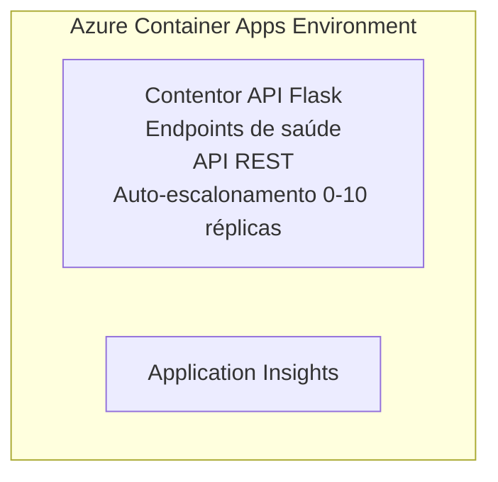

# Exemplo Simples de API Flask - Aplicação Container

**Caminho de Aprendizagem:** Iniciante ⭐ | **Duração:** 25-35 minutos | **Custo:** 0-15$/mês

Uma API REST Python Flask completa e funcional, implantada em Azure Container Apps usando Azure Developer CLI (azd). Este exemplo demonstra o deployment de containers, auto-escalagem e noções básicas de monitorização.

## 🎯 O Que Vai Aprender

- Implantar uma aplicação Python em container na Azure
- Configurar auto-escalagem com escala para zero
- Implementar sondas de saúde e verificações de prontidão
- Monitorizar logs e métricas da aplicação
- Usar Azure Developer CLI para deployment rápido

## 📦 O Que Está Incluído

✅ **Aplicação Flask** - API REST completa com operações CRUD (`src/app.py`)  
✅ **Dockerfile** - Configuração do container pronta para produção  
✅ **Infraestrutura Bicep** - Ambiente Container Apps e deployment da API  
✅ **Configuração AZD** - Deployment com um comando  
✅ **Sondas de Saúde** - Verificações de liveness e readiness configuradas  
✅ **Auto-escalagem** - 0-10 réplicas baseado na carga HTTP  

## Arquitetura



## Pré-requisitos

### Obrigatórios
- **Azure Developer CLI (azd)** - [Guia de instalação](https://learn.microsoft.com/azure/developer/azure-developer-cli/install-azd)
- **Subscrição Azure** - [Conta gratuita](https://azure.microsoft.com/free/)
- **Docker Desktop** - [Instalar Docker](https://www.docker.com/products/docker-desktop/) (para testes locais)

### Verificar Pré-requisitos

```bash
# Verificar versão do azd (necessário 1.5.0 ou superior)
azd version

# Verificar login no Azure
azd auth login

# Verificar Docker (opcional, para testes locais)
docker --version
```

## ⏱️ Cronologia do Deployment

| Fase | Duração | O Que Acontece |
|-------|----------|--------------||
| Configuração do ambiente | 30 segundos | Criar ambiente azd |
| Construção do container | 2-3 minutos | Docker build da aplicação Flask |
| Provisão da infraestrutura | 3-5 minutos | Criar Container Apps, registo, monitorização |
| Deployment da aplicação | 2-3 minutos | Fazer push da imagem e deploy no Container Apps |
| **Total** | **8-12 minutos** | Deployment completo e pronto |

## Início Rápido

```bash
# Navegar para o exemplo
cd examples/container-app/simple-flask-api

# Inicializar ambiente (escolher nome único)
azd env new myflaskapi

# Implantar tudo (infraestrutura + aplicação)
azd up
# Será solicitado que:
# 1. Selecione a subscrição Azure
# 2. Escolha a localização (ex., eastus2)
# 3. Espere 8-12 minutos para a implantação

# Obtenha o seu endpoint da API
azd env get-values

# Testar a API
curl $(azd env get-value API_ENDPOINT)/health
```

**Saída Esperada:**
```json
{
  "status": "healthy",
  "timestamp": "2025-11-19T10:30:00Z",
  "service": "simple-flask-api",
  "version": "1.0.0"
}
```

## ✅ Verificar Deployment

### Passo 1: Verificar Estado do Deployment

```bash
# Ver serviços implantados
azd show

# A saída esperada mostra:
# - Serviço: api
# - Ponto de acesso: https://ca-api-[env].xxx.azurecontainerapps.io
# - Estado: A correr
```

### Passo 2: Testar Endpoints da API

```bash
# Obter endpoint da API
API_URL=$(azd env get-value API_ENDPOINT)

# Testar estado de saúde
curl $API_URL/health

# Testar endpoint raiz
curl $API_URL/

# Criar um item
curl -X POST $API_URL/api/items \
  -H "Content-Type: application/json" \
  -d '{"name": "Test Item", "description": "My first item"}'

# Obter todos os itens
curl $API_URL/api/items
```

**Critérios de Sucesso:**
- ✅ Endpoint de health retorna HTTP 200
- ✅ Endpoint raiz mostra informação da API
- ✅ POST cria item e retorna HTTP 201
- ✅ GET retorna itens criados

### Passo 3: Consultar Logs

```bash
# Transmitir registos em direto usando azd monitor
azd monitor --logs

# Ou usar Azure CLI:
az containerapp logs show --name api --resource-group $RG_NAME --follow

# Deverá ver:
# - Mensagens de arranque do Gunicorn
# - Registos de pedidos HTTP
# - Registos de informações da aplicação
```

## Estrutura do Projeto

```
simple-flask-api/
├── azure.yaml              # AZD configuration
├── infra/
│   ├── main.bicep         # Main infrastructure
│   ├── main.parameters.json
│   └── app/
│       ├── container-env.bicep
│       └── api.bicep
└── src/
    ├── app.py             # Flask application
    ├── requirements.txt
    └── Dockerfile
```

## Endpoints da API

| Endpoint | Método | Descrição |
|----------|--------|-------------|
| `/health` | GET | Verificação de saúde |
| `/api/items` | GET | Listar todos os itens |
| `/api/items` | POST | Criar novo item |
| `/api/items/{id}` | GET | Obter item específico |
| `/api/items/{id}` | PUT | Atualizar item |
| `/api/items/{id}` | DELETE | Apagar item |

## Configuração

### Variáveis de Ambiente

```bash
# Definir configuração personalizada
azd env set PORT 8000
azd env set LOG_LEVEL info
azd env set MAX_REPLICAS 20
```

### Configuração de Escalagem

A API escala automaticamente com base no tráfego HTTP:
- **Mínimo de Réplicas**: 0 (escala para zero quando inativa)
- **Máximo de Réplicas**: 10
- **Pedidos concorrentes por réplica**: 50

## Desenvolvimento

### Executar Localmente

```bash
# Instalar dependências
cd src
pip install -r requirements.txt

# Executar a aplicação
python app.py

# Testar localmente
curl http://localhost:8000/health
```

### Construir e Testar Container

```bash
# Construir imagem Docker
docker build -t flask-api:local ./src

# Executar contentor localmente
docker run -p 8000:8000 flask-api:local

# Testar contentor
curl http://localhost:8000/health
```

## Deployment

### Deployment Completo

```bash
# Desplegar infraestrutura e aplicação
azd up
```

### Deployment Apenas do Código

```bash
# Deploy apenas o código da aplicação (infraestrutura inalterada)
azd deploy api
```

### Atualizar Configuração

```bash
# Atualizar variáveis de ambiente
azd env set API_KEY "new-api-key"

# Reimplantar com nova configuração
azd deploy api
```

## Monitorização

### Visualizar Logs

```bash
# Transmitir logs em direto usando azd monitor
azd monitor --logs

# Ou use a Azure CLI para Aplicações de Contentores:
az containerapp logs show --name api --resource-group $RG_NAME --follow

# Ver as últimas 100 linhas
az containerapp logs show --name api --resource-group $RG_NAME --tail 100
```

### Monitorizar Métricas

```bash
# Abrir painel do Azure Monitor
azd monitor --overview

# Ver métricas específicas
az monitor metrics list \
  --resource $(azd show --output json | jq -r '.services.api.resourceId') \
  --metric "Requests,ResponseTime"
```

## Testes

### Verificação de Saúde

```bash
curl $(azd show --output json | jq -r '.services.api.endpoint')/health
```

Resposta esperada:
```json
{
  "status": "healthy",
  "timestamp": "2025-11-19T10:30:00Z"
}
```

### Criar Item

```bash
curl -X POST $(azd show --output json | jq -r '.services.api.endpoint')/api/items \
  -H "Content-Type: application/json" \
  -d '{"name": "Test Item", "description": "A test item"}'
```

### Obter Todos os Itens

```bash
curl $(azd show --output json | jq -r '.services.api.endpoint')/api/items
```

## Otimização de Custos

Este deployment utiliza escala para zero, pelo que só paga quando a API está a processar pedidos:

- **Custo em repouso**: ~0$/mês (escala para zero)
- **Custo ativo**: ~0.000024$/segundo por réplica
- **Custo mensal esperado** (uso leve): 5-15$

### Reduzir Custos Ainda Mais

```bash
# Reduzir o número máximo de réplicas para dev
azd env set MAX_REPLICAS 3

# Usar um tempo de inatividade mais curto
azd env set SCALE_TO_ZERO_TIMEOUT 300  # 5 minutos
```

## Resolução de Problemas

### Container Não Arranca

```bash
# Verificar logs do contentor utilizando Azure CLI
az containerapp logs show --name api --resource-group $RG_NAME --tail 100

# Verificar builds de imagem Docker localmente
docker build -t test ./src
```

### API Não Acessível

```bash
# Verificar se o ingresso é externo
az containerapp show --name api --resource-group rg-simple-flask-api \
  --query properties.configuration.ingress.external
```

### Tempos de Resposta Elevados

```bash
# Verificar utilização da CPU/Memória
az monitor metrics list \
  --resource $(azd show --output json | jq -r '.services.api.resourceId') \
  --metric "CPUPercentage,MemoryPercentage"

# Aumentar recursos se necessário
az containerapp update --name api --resource-group rg-simple-flask-api \
  --cpu 1.0 --memory 2Gi
```

## Limpeza

```bash
# Eliminar todos os recursos
azd down --force --purge
```

## Próximos Passos

### Expandir Este Exemplo

1. **Adicionar Base de Dados** - Integrar Azure Cosmos DB ou SQL Database  
   ```bash
   # Adicionar módulo Cosmos DB ao infra/main.bicep
   # Atualizar app.py com a ligação à base de dados
   ```

2. **Adicionar Autenticação** - Implementar Microsoft Entra ID ou chaves API  
   ```python
   # Adicionar middleware de autenticação ao app.py
   from functools import wraps
   ```

3. **Configurar CI/CD** - Workflow com GitHub Actions  
   ```yaml
   # Create .github/workflows/deploy.yml
   name: Deploy to Azure
   on: [push]
   ```

4. **Adicionar Identidade Gerida** - Acesso seguro a serviços Azure  
   ```bicep
   # Update infra/app/api.bicep
   identity: { type: 'SystemAssigned' }
   ```

### Exemplos Relacionados

- **[Aplicação Base de Dados](../../../../../examples/database-app)** - Exemplo completo com SQL Database
- **[Microserviços](../../../../../examples/container-app/microservices)** - Arquitetura multi-serviço
- **[Guia Mestre Container Apps](../README.md)** - Todos os padrões de containers

### Recursos de Aprendizagem

- 📚 [Curso AZD para Iniciantes](../../../README.md) - Página principal do curso
- 📚 [Padrões Container Apps](../README.md) - Mais padrões de deployment
- 📚 [Galeria de Templates AZD](https://azure.github.io/awesome-azd/) - Templates da comunidade

## Recursos Adicionais

### Documentação
- **[Documentação Flask](https://flask.palletsprojects.com/)** - Guia do framework Flask
- **[Azure Container Apps](https://learn.microsoft.com/azure/container-apps/)** - Documentação oficial da Azure
- **[Azure Developer CLI](https://learn.microsoft.com/azure/developer/azure-developer-cli/)** - Referência dos comandos azd

### Tutoriais
- **[Início Rápido Container Apps](https://learn.microsoft.com/azure/container-apps/quickstart-portal)** - Deploy da sua primeira app
- **[Python na Azure](https://learn.microsoft.com/azure/developer/python/)** - Guia de desenvolvimento Python
- **[Linguagem Bicep](https://learn.microsoft.com/azure/azure-resource-manager/bicep/)** - Infraestrutura como código

### Ferramentas
- **[Portal Azure](https://portal.azure.com)** - Gestão visual de recursos
- **[Extensão Azure para VS Code](https://marketplace.visualstudio.com/items?itemName=ms-azuretools.vscode-azurecontainerapps)** - Integração no IDE

---

**🎉 Parabéns!** Implantou uma API Flask pronta para produção nos Azure Container Apps com auto-escalagem e monitorização.

**Dúvidas?** [Abra uma issue](https://github.com/microsoft/AZD-for-beginners/issues) ou consulte o [FAQ](../../../resources/faq.md)

---

<!-- CO-OP TRANSLATOR DISCLAIMER START -->
**Aviso Legal**:
Este documento foi traduzido utilizando o serviço de tradução automática [Co-op Translator](https://github.com/Azure/co-op-translator). Embora nos esforcemos pela precisão, esteja ciente de que traduções automáticas podem conter erros ou imprecisões. O documento original na sua língua nativa deve ser considerado a fonte autorizada. Para informações críticas, recomenda-se tradução profissional humana. Não nos responsabilizamos por quaisquer mal-entendidos ou interpretações incorretas resultantes da utilização desta tradução.
<!-- CO-OP TRANSLATOR DISCLAIMER END -->