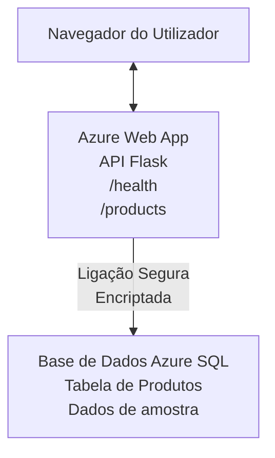

# Implantação de uma Base de Dados Microsoft SQL e Aplicação Web com AZD

⏱️ **Tempo Estimado**: 20-30 minutos | 💰 **Custo Estimado**: ~$15-25/mês | ⭐ **Complexidade**: Intermédio

Este **exemplo completo e funcional** demonstra como usar o [Azure Developer CLI (azd)](https://learn.microsoft.com/azure/developer/azure-developer-cli/) para implantar uma aplicação web Python Flask com uma Base de Dados Microsoft SQL no Azure. Todo o código está incluído e testado — não são necessárias dependências externas.

## O Que Vai Aprender

Ao completar este exemplo, irá:
- Implantar uma aplicação em múltiplas camadas (app web + base de dados) usando infraestrutura como código
- Configurar ligações seguras à base de dados sem codificar segredos diretamente
- Monitorizar o estado da aplicação com Application Insights
- Gerir recursos Azure eficientemente com AZD CLI
- Seguir as melhores práticas Azure para segurança, otimização de custos e observabilidade

## Visão Geral do Cenário
- **App Web**: API REST Python Flask com conectividade à base de dados
- **Base de Dados**: Base de Dados SQL Azure com dados de exemplo
- **Infraestrutura**: Provisionada usando Bicep (templates modulares e reutilizáveis)
- **Implantação**: Totalmente automatizada com comandos `azd`
- **Monitorização**: Application Insights para logs e telemetria

## Pré-requisitos

### Ferramentas Necessárias

Antes de começar, verifique que tem estas ferramentas instaladas:

1. **[Azure CLI](https://learn.microsoft.com/cli/azure/install-azure-cli)** (versão 2.50.0 ou superior)
   ```sh
   az --version
   # Saída esperada: azure-cli 2.50.0 ou superior
   ```

2. **[Azure Developer CLI (azd)](https://learn.microsoft.com/azure/developer/azure-developer-cli/install-azd)** (versão 1.0.0 ou superior)
   ```sh
   azd version
   # Saída esperada: azd versão 1.0.0 ou superior
   ```

3. **[Python 3.8+](https://www.python.org/downloads/)** (para desenvolvimento local)
   ```sh
   python --version
   # Saída esperada: Python 3.8 ou superior
   ```

4. **[Docker](https://www.docker.com/get-started)** (opcional, para desenvolvimento local em containers)
   ```sh
   docker --version
   # Saída esperada: Versão do Docker 20.10 ou superior
   ```

### Requisitos Azure

- Uma **subscrição Azure ativa** ([crie uma conta gratuita](https://azure.microsoft.com/free/))
- Permissões para criar recursos na sua subscrição
- Papel de **Owner** ou **Contributor** na subscrição ou grupo de recursos

### Conhecimentos Necessários

Este é um exemplo de nível **intermédio**. Deve estar familiarizado com:
- Operações básicas na linha de comando
- Conceitos fundamentais de cloud (recursos, grupos de recursos)
- Compreensão básica de aplicações web e bases de dados

**Novo no AZD?** Comece pelo [Guia de Introdução](../../docs/chapter-01-foundation/azd-basics.md).

## Arquitetura

Este exemplo implanta uma arquitetura em duas camadas com uma aplicação web e base de dados SQL:



**Implantação dos Recursos:**
- **Grupo de Recursos**: Contentor para todos os recursos
- **App Service Plan**: Hosting baseado em Linux (tier B1 para eficiência de custo)
- **App Web**: Runtime Python 3.11 com aplicação Flask
- **Servidor SQL**: Servidor de base de dados gerido com TLS 1.2 mínimo
- **Base de Dados SQL**: Tier Básico (2GB, adequado para desenvolvimento/testes)
- **Application Insights**: Monitorização e logging
- **Espaço de Trabalho Log Analytics**: Armazenamento centralizado de logs

**Analogia**: Pensa nisto como um restaurante (app web) com um congelador de armazenamento (base de dados). Os clientes fazem pedidos do menu (endpoints API), e a cozinha (aplicação Flask) retira ingredientes (dados) do congelador. O gerente do restaurante (Application Insights) acompanha tudo o que acontece.

## Estrutura de Pastas

Todos os ficheiros estão incluídos neste exemplo — não são necessárias dependências externas:

```
examples/database-app/
│
├── README.md                    # This file
├── azure.yaml                   # AZD configuration file
├── .env.sample                  # Sample environment variables
├── .gitignore                   # Git ignore patterns
│
├── infra/                       # Infrastructure as Code (Bicep)
│   ├── main.bicep              # Main orchestration template
│   ├── abbreviations.json      # Azure naming conventions
│   └── resources/              # Modular resource templates
│       ├── sql-server.bicep    # SQL Server configuration
│       ├── sql-database.bicep  # Database configuration
│       ├── app-service-plan.bicep  # Hosting plan
│       ├── app-insights.bicep  # Monitoring setup
│       └── web-app.bicep       # Web application
│
└── src/
    └── web/                    # Application source code
        ├── app.py              # Flask REST API
        ├── requirements.txt    # Python dependencies
        └── Dockerfile          # Container definition
```

**Função de Cada Ficheiro:**
- **azure.yaml**: Indica ao AZD o que implantar e onde
- **infra/main.bicep**: Orquestra todos os recursos Azure
- **infra/resources/*.bicep**: Definições individuais de recursos (modulares para reutilização)
- **src/web/app.py**: Aplicação Flask com lógica da base de dados
- **requirements.txt**: Dependências Python
- **Dockerfile**: Instruções para containerização na implantação

## Início Rápido (Passo a Passo)

### Passo 1: Clonar e Navegar

```sh
git clone https://github.com/microsoft/AZD-for-beginners.git
cd AZD-for-beginners/examples/database-app
```

**✓ Verificação de Sucesso**: Verifique que vê `azure.yaml` e a pasta `infra/`:
```sh
ls
# Esperado: README.md, azure.yaml, infra/, src/
```

### Passo 2: Autenticar no Azure

```sh
azd auth login
```

Isto abre o navegador para autenticar no Azure. Inicie sessão com as suas credenciais Azure.

**✓ Verificação de Sucesso**: Deve ver:
```
Logged in to Azure.
```

### Passo 3: Inicializar o Ambiente

```sh
azd init
```

**O que acontece**: AZD cria uma configuração local para a implantação.

**Respostas solicitadas**:
- **Nome do ambiente**: Introduza um nome curto (ex.: `dev`, `myapp`)
- **Subscrição Azure**: Selecione a sua subscrição da lista
- **Localização Azure**: Escolha uma região (ex.: `eastus`, `westeurope`)

**✓ Verificação de Sucesso**: Deve ver:
```
SUCCESS: New project initialized!
```

### Passo 4: Provisionar Recursos Azure

```sh
azd provision
```

**O que acontece**: AZD implanta toda a infraestrutura (leva 5-8 minutos):
1. Cria grupo de recursos
2. Cria Servidor SQL e Base de Dados
3. Cria App Service Plan
4. Cria App Web
5. Cria Application Insights
6. Configura rede e segurança

**Será solicitado**:
- **Nome de utilizador admin SQL**: Introduza um nome (ex.: `sqladmin`)
- **Palavra-passe admin SQL**: Introduza uma palavra-passe forte (guarde esta!)

**✓ Verificação de Sucesso**: Deve ver:
```
SUCCESS: Your application was provisioned in Azure in X minutes Y seconds.
You can view the resources created under the resource group rg-<env-name> in Azure Portal:
https://portal.azure.com/#@/resource/subscriptions/.../resourceGroups/rg-<env-name>
```

**⏱️ Tempo**: 5-8 minutos

### Passo 5: Implantar a Aplicação

```sh
azd deploy
```

**O que acontece**: AZD constrói e implanta a sua aplicação Flask:
1. Empacota a aplicação Python
2. Constrói o container Docker
3. Faz push para Azure Web App
4. Inicializa a base de dados com dados de exemplo
5. Inicia a aplicação

**✓ Verificação de Sucesso**: Deve ver:
```
SUCCESS: Your application was deployed to Azure in X minutes Y seconds.
You can view the resources created under the resource group rg-<env-name> in Azure Portal:
https://portal.azure.com/#@/resource/subscriptions/.../resourceGroups/rg-<env-name>
```

**⏱️ Tempo**: 3-5 minutos

### Passo 6: Navegar na Aplicação

```sh
azd browse
```

Este passo abre a sua app web implantada no navegador em `https://app-<unique-id>.azurewebsites.net`

**✓ Verificação de Sucesso**: Deve ver a saída em JSON:
```json
{
  "message": "Welcome to the Database App API",
  "endpoints": {
    "/": "This help message",
    "/health": "Health check endpoint",
    "/products": "List all products",
    "/products/<id>": "Get product by ID"
  }
}
```

### Passo 7: Testar os Endpoints da API

**Verificação de Saúde** (verifica ligação à base de dados):
```sh
curl https://app-<your-id>.azurewebsites.net/health
```

**Resposta Esperada**:
```json
{
  "status": "healthy",
  "database": "connected"
}
```

**Listar Produtos** (dados de exemplo):
```sh
curl https://app-<your-id>.azurewebsites.net/products
```

**Resposta Esperada**:
```json
[
  {
    "id": 1,
    "name": "Laptop",
    "description": "High-performance laptop",
    "price": 1299.99,
    "created_at": "2025-11-19T10:30:00"
  },
  ...
]
```

**Obter Produto Individual**:
```sh
curl https://app-<your-id>.azurewebsites.net/products/1
```

**✓ Verificação de Sucesso**: Todos os endpoints retornam dados JSON sem erros.

---

**🎉 Parabéns!** Implantou com sucesso uma aplicação web com base de dados no Azure usando AZD.

## Análise Detalhada da Configuração

### Variáveis de Ambiente

Os segredos são geridos de forma segura via configuração do Azure App Service—**nunca codificados diretamente no código fonte**.

**Configurado Automaticamente pelo AZD**:
- `SQL_CONNECTION_STRING`: Ligação à base de dados com credenciais encriptadas
- `APPLICATIONINSIGHTS_CONNECTION_STRING`: Endpoint de telemetria da monitorização
- `SCM_DO_BUILD_DURING_DEPLOYMENT`: Ativa instalação automática de dependências

**Onde os Segredos São Guardados**:
1. Durante o `azd provision`, fornece credenciais SQL via prompts seguros
2. O AZD armazena estes dados no ficheiro local `.azure/<env-name>/.env` (ignorando no git)
3. AZD injeta-os na configuração do Azure App Service (encriptados em descanso)
4. A aplicação lê-os via `os.getenv()` em runtime

### Desenvolvimento Local

Para testes locais, crie um ficheiro `.env` a partir do exemplo:

```sh
cp .env.sample .env
# Edite o .env com a ligação à base de dados local
```

**Fluxo de Trabalho para Desenvolvimento Local**:
```sh
# Instalar dependências
cd src/web
pip install -r requirements.txt

# Definir variáveis de ambiente
export SQL_CONNECTION_STRING="your-local-connection-string"

# Executar a aplicação
python app.py
```

**Testar localmente**:
```sh
curl http://localhost:8000/health
# Esperado: {"status": "healthy", "database": "connected"}
```

### Infraestrutura como Código

Todos os recursos Azure estão definidos em **templates Bicep** (pasta `infra/`):

- **Design Modular**: Cada tipo de recurso tem o seu ficheiro para reutilização
- **Parametrizado**: Personalize SKUs, regiões, convenções de nomenclatura
- **Melhores Práticas**: Segue padrões Azure de nomenclatura e segurança padrão
- **Versionado**: Mudanças na infraestrutura são controladas via Git

**Exemplo de Personalização**:
Para alterar o tier da base de dados, edite `infra/resources/sql-database.bicep`:
```bicep
sku: {
  name: 'Standard'  // Changed from 'Basic'
  tier: 'Standard'
  capacity: 10
}
```

## Melhores Práticas de Segurança

Este exemplo segue as melhores práticas de segurança Azure:

### 1. **Sem Segredos no Código Fonte**
- ✅ Credenciais armazenadas na configuração do Azure App Service (encriptadas)
- ✅ Ficheiros `.env` excluídos do Git via `.gitignore`
- ✅ Segredos passados via parâmetros seguros durante o provisionamento

### 2. **Ligações Encriptadas**
- ✅ TLS 1.2 mínimo para Servidor SQL
- ✅ HTTPS obrigatório na App Web
- ✅ Ligações à base de dados utilizam canais encriptados

### 3. **Segurança de Rede**
- ✅ Firewall do Servidor SQL configurado para permitir apenas serviços Azure
- ✅ Acesso público à rede restringido (pode ser fechado com Private Endpoints)
- ✅ FTPS desativado na App Web

### 4. **Autenticação & Autorização**
- ⚠️ **Atual**: Autenticação SQL (nome de utilizador/palavra-passe)
- ✅ **Recomendação para Produção**: Usar Managed Identity Azure para autenticação sem palavra-passe

**Para Atualizar para Managed Identity** (em produção):
1. Ative managed identity na App Web
2. Conceda permissões SQL à identidade
3. Atualize a string de ligação para usar managed identity
4. Remova autenticação por palavra-passe

### 5. **Auditoria & Conformidade**
- ✅ Application Insights regista todas as requisições e erros
- ✅ Auditoria da Base de Dados SQL ativada (pode ser configurada para conformidade)
- ✅ Todos os recursos etiquetados para governança

**Lista de Verificação de Segurança Antes da Produção**:
- [ ] Ativar Azure Defender para SQL
- [ ] Configurar Private Endpoints para Base de Dados SQL
- [ ] Ativar Web Application Firewall (WAF)
- [ ] Implementar Azure Key Vault para rotação de segredos
- [ ] Configurar autenticação Microsoft Entra ID
- [ ] Ativar logging diagnóstico para todos os recursos

## Otimização de Custos

**Custos Mensais Estimados** (a partir de novembro de 2025):

| Recurso | SKU/Tier | Custo Estimado |
|----------|----------|----------------|
| App Service Plan | B1 (Básico) | ~$13/mês |
| Base de Dados SQL | Básico (2GB) | ~$5/mês |
| Application Insights | Pay-as-you-go | ~$2/mês (baixo tráfego) |
| **Total** | | **~$20/mês** |

**💡 Dicas para Poupar Custos**:

1. **Usar Tier Gratuito para Aprendizagem**:
   - App Service: tier F1 (grátis, horas limitadas)
   - Base de Dados SQL: usar Azure SQL Database serverless
   - Application Insights: 5GB/mês ingestão gratuita

2. **Parar Recursos Quando Não Utilizados**:
   ```sh
   # Parar a aplicação web (a base de dados continua a cobrar)
   az webapp stop --name <app-name> --resource-group <rg-name>
   
   # Reiniciar quando necessário
   az webapp start --name <app-name> --resource-group <rg-name>
   ```

3. **Eliminar Tudo Após Testes**:
   ```sh
   azd down
   ```
   Isto remove TODOS os recursos e para encargos.

4. **SKUs para Desenvolvimento vs Produção**:
   - **Desenvolvimento**: tier Básico (usado neste exemplo)
   - **Produção**: tier Standard/Premium com redundância

**Monitorização de Custos**:
- Veja custos no [Azure Cost Management](https://portal.azure.com/#view/Microsoft_Azure_CostManagement)
- Configure alertas de custo para evitar surpresas
- Etiquete todos os recursos com `azd-env-name` para tracking

**Alternativa Tier Gratuito**:
Para fins de aprendizagem, pode modificar `infra/resources/app-service-plan.bicep`:
```bicep
sku: {
  name: 'F1'  // Free tier
  tier: 'Free'
}
```
**Nota**: O tier gratuito tem limitações (60 min/dia CPU, sem always-on).

## Monitorização & Observabilidade

### Integração com Application Insights

Este exemplo inclui **Application Insights** para monitorização abrangente:

**O Que é Monitorizado**:
- ✅ Requisições HTTP (latência, códigos de estado, endpoints)
- ✅ Erros e exceções da aplicação
- ✅ Logging personalizado da aplicação Flask
- ✅ Estado da ligação à base de dados
- ✅ Métricas de desempenho (CPU, memória)

**Aceder ao Application Insights**:
1. Abra o [Portal Azure](https://portal.azure.com)
2. Navegue para o seu grupo de recursos (`rg-<env-name>`)
3. Clique no recurso Application Insights (`appi-<unique-id>`)

**Consultas Úteis** (Application Insights → Logs):

**Ver Todas as Requisições**:
```kusto
requests
| where timestamp > ago(1h)
| order by timestamp desc
| project timestamp, name, url, resultCode, duration
```

**Encontrar Erros**:
```kusto
exceptions
| where timestamp > ago(24h)
| order by timestamp desc
| project timestamp, type, outerMessage, operation_Name
```

**Verificar Endpoint de Saúde**:
```kusto
requests
| where name contains "health"
| summarize count() by resultCode, bin(timestamp, 1h)
```

### Auditoria da Base de Dados SQL

**Auditoria da Base de Dados SQL está ativada** para monitorizar:
- Padrões de acesso à base de dados
- Tentativas de login falhadas
- Alterações ao esquema
- Acesso a dados (para conformidade)

**Aceder aos Logs de Auditoria**:
1. Portal Azure → Base de Dados SQL → Auditoria
2. Visualizar logs no workspace Log Analytics

### Monitorização em Tempo Real

**Ver Métricas em Tempo Real**:
1. Application Insights → Live Metrics
2. Veja requisições, falhas e desempenho em tempo real

**Configurar Alertas**:
Crie alertas para eventos críticos:
- Erros HTTP 500 > 5 em 5 minutos
- Falhas de ligação à base de dados
- Tempos de resposta elevados (>2 segundos)

**Exemplo de Criação de Alerta**:
```sh
az monitor metrics alert create \
  --name "High-Response-Time" \
  --resource-group <rg-name> \
  --scopes <app-insights-resource-id> \
  --condition "avg requests/duration > 2000" \
  --description "Alert when response time exceeds 2 seconds"
```

## Resolução de Problemas
### Problemas Comuns e Soluções

#### 1. `azd provision` falha com "Location not available"

**Sintoma**:
```
Error: The subscription is not registered for the resource type 'components' in the location 'centralus'.
```

**Solução**:
Escolha uma região Azure diferente ou registe o fornecedor de recursos:
```sh
az provider register --namespace Microsoft.Insights
```

#### 2. Falha de Conexão SQL Durante o Deployment

**Sintoma**:
```
pyodbc.OperationalError: ('08001', '[08001] [Microsoft][ODBC Driver 18 for SQL Server]TCP Provider...')
```

**Solução**:
- Verifique se o firewall do SQL Server permite serviços Azure (configurado automaticamente)
- Confirme que a password do administrador SQL foi inserida corretamente durante o `azd provision`
- Assegure que o SQL Server está totalmente provisionado (pode demorar 2-3 minutos)

**Verificar Conexão**:
```sh
# No Portal do Azure, vá a Base de Dados SQL → Editor de consultas
# Tente ligar-se com as suas credenciais
```

#### 3. Aplicação Web Mostra "Application Error"

**Sintoma**:
O browser mostra uma página de erro genérica.

**Solução**:
Verifique os logs da aplicação:
```sh
# Ver registos recentes
az webapp log tail --name <app-name> --resource-group <rg-name>
```

**Causas comuns**:
- Variáveis de ambiente em falta (verifique App Service → Configuração)
- Falha na instalação dos pacotes Python (verifique os logs de deployment)
- Erro na inicialização da base de dados (verifique a conectividade SQL)

#### 4. `azd deploy` Falha com "Build Error"

**Sintoma**:
```
Error: Failed to build project
```

**Solução**:
- Verifique se o `requirements.txt` não tem erros de sintaxe
- Confirme que o Python 3.11 está especificado em `infra/resources/web-app.bicep`
- Verifique se o Dockerfile tem a imagem base correta

**Debug localmente**:
```sh
cd src/web
docker build -t test-app .
docker run -p 8000:8000 test-app
```

#### 5. "Unauthorized" ao Executar Comandos AZD

**Sintoma**:
```
ERROR: (Unauthorized) The client '<id>' with object id '<id>' does not have authorization
```

**Solução**:
Reautentique-se no Azure:
```sh
# Obrigatório para fluxos de trabalho AZD
azd auth login

# Opcional se também estiver a usar comandos Azure CLI diretamente
az login
```

Verifique se tem as permissões corretas (função Contribuidor) na subscrição.

#### 6. Custos Elevados na Base de Dados

**Sintoma**:
Fatura inesperada da Azure.

**Solução**:
- Verifique se se esqueceu de executar `azd down` após os testes
- Confirme que a Base de Dados SQL está a usar o nível Básico (não Premium)
- Reveja os custos no Azure Cost Management
- Configure alertas de custos

### Obter Ajuda

**Ver Todas as Variáveis de Ambiente AZD**:
```sh
azd env get-values
```

**Verificar Estado do Deployment**:
```sh
az webapp show --name <app-name> --resource-group <rg-name> --query state
```

**Aceder aos Logs da Aplicação**:
```sh
az webapp log download --name <app-name> --resource-group <rg-name> --log-file app-logs.zip
```

**Precisa de Mais Ajuda?**
- [Guia de Resolução de Problemas AZD](../../docs/chapter-07-troubleshooting/common-issues.md)
- [Resolução de Problemas do Azure App Service](https://learn.microsoft.com/azure/app-service/troubleshoot-diagnostic-logs)
- [Resolução de Problemas do Azure SQL](https://learn.microsoft.com/azure/azure-sql/database/troubleshoot-common-errors-issues)

## Exercícios Práticos

### Exercício 1: Verificar o Seu Deployment (Iniciante)

**Objetivo**: Confirmar que todos os recursos estão implantados e que a aplicação está a funcionar.

**Passos**:
1. Liste todos os recursos no seu grupo de recursos:
   ```sh
   az resource list --resource-group rg-<env-name> --output table
   ```
   **Esperado**: 6-7 recursos (Web App, SQL Server, Base de Dados SQL, Plano App Service, Application Insights, Log Analytics)

2. Teste todos os endpoints da API:
   ```sh
   curl https://app-<your-id>.azurewebsites.net/
   curl https://app-<your-id>.azurewebsites.net/health
   curl https://app-<your-id>.azurewebsites.net/products
   curl https://app-<your-id>.azurewebsites.net/products/1
   ```
   **Esperado**: Todos retornam JSON válido sem erros

3. Verifique o Application Insights:
   - Navegue até Application Insights no Portal Azure
   - Vá a "Live Metrics"
   - Atualize o browser na aplicação web
   **Esperado**: Ver pedidos a aparecer em tempo real

**Critério de Sucesso**: Todos os 6-7 recursos existem, todos os endpoints retornam dados, Live Metrics mostra atividade.

---

### Exercício 2: Adicionar um Novo Endpoint API (Intermédio)

**Objetivo**: Estender a aplicação Flask com um novo endpoint.

**Código Inicial**: Endpoints atuais em `src/web/app.py`

**Passos**:
1. Edite `src/web/app.py` e adicione um novo endpoint depois da função `get_product()`:
   ```python
   @app.route('/products/search/<keyword>')
   def search_products(keyword):
       """Search products by name or description."""
       try:
           conn = get_db_connection()
           cursor = conn.cursor()
           cursor.execute(
               "SELECT id, name, description, price, created_at FROM products WHERE name LIKE ? OR description LIKE ?",
               (f'%{keyword}%', f'%{keyword}%')
           )
           
           products = []
           for row in cursor.fetchall():
               products.append({
                   'id': row[0],
                   'name': row[1],
                   'description': row[2],
                   'price': float(row[3]) if row[3] else None,
                   'created_at': row[4].isoformat() if row[4] else None
               })
           
           cursor.close()
           conn.close()
           
           logger.info(f"Search for '{keyword}' returned {len(products)} results")
           return jsonify(products), 200
           
       except Exception as e:
           logger.error(f"Error searching products: {str(e)}")
           return jsonify({'error': str(e)}), 500
   ```

2. Faça o deploy da aplicação atualizada:
   ```sh
   azd deploy
   ```

3. Teste o novo endpoint:
   ```sh
   curl https://app-<your-id>.azurewebsites.net/products/search/laptop
   ```
   **Esperado**: Retorna produtos que correspondem a "laptop"

**Critério de Sucesso**: O novo endpoint funciona, retorna resultados filtrados, aparece nos logs do Application Insights.

---

### Exercício 3: Adicionar Monitorização e Alertas (Avançado)

**Objetivo**: Configurar monitorização proativa com alertas.

**Passos**:
1. Crie um alerta para erros HTTP 500:
   ```sh
   # Obter o ID do recurso do Application Insights
   AI_ID=$(az monitor app-insights component show \
     --app appi-<your-id> \
     --resource-group rg-<env-name> \
     --query id -o tsv)
   
   # Criar alerta
   az monitor metrics alert create \
     --name "High-Error-Rate" \
     --resource-group rg-<env-name> \
     --scopes $AI_ID \
     --condition "count requests/failed > 5" \
     --window-size 5m \
     --evaluation-frequency 1m \
     --description "Alert when >5 failed requests in 5 minutes"
   ```

2. Dispare o alerta causando erros:
   ```sh
   # Solicitar um produto inexistente
   for i in {1..10}; do curl https://app-<your-id>.azurewebsites.net/products/999; done
   ```

3. Verifique se o alerta foi disparado:
   - Portal Azure → Alertas → Regras de Alerta
   - Verifique o seu email (se configurado)

**Critério de Sucesso**: Regra de alerta criada, dispara em erros, notificações recebidas.

---

### Exercício 4: Alteração do Esquema da Base de Dados (Avançado)

**Objetivo**: Adicionar uma nova tabela e modificar a aplicação para usá-la.

**Passos**:
1. Conecte-se à Base de Dados SQL via Query Editor do Portal Azure

2. Crie uma nova tabela `categories`:
   ```sql
   CREATE TABLE categories (
       id INT PRIMARY KEY IDENTITY(1,1),
       name NVARCHAR(50) NOT NULL,
       description NVARCHAR(200)
   );
   
   INSERT INTO categories (name, description) VALUES
   ('Electronics', 'Electronic devices and accessories'),
   ('Office Supplies', 'Office equipment and supplies');
   
   -- Add category to products table
   ALTER TABLE products ADD category_id INT;
   UPDATE products SET category_id = 1; -- Set all to Electronics
   ```

3. Atualize `src/web/app.py` para incluir informação de categoria nas respostas

4. Faça deploy e teste

**Critério de Sucesso**: Nova tabela existe, produtos mostram informação de categoria, aplicação continua a funcionar.

---

### Exercício 5: Implementar Cache (Especialista)

**Objetivo**: Adicionar Azure Redis Cache para melhorar desempenho.

**Passos**:
1. Adicione Redis Cache a `infra/main.bicep`
2. Atualize `src/web/app.py` para fazer cache das consultas de produtos
3. Meça a melhoria de desempenho com Application Insights
4. Compare tempos de resposta antes/depois do cache

**Critério de Sucesso**: Redis está implantado, cache funciona, tempos de resposta melhoram >50%.

**Dica**: Comece com a [documentação do Azure Cache for Redis](https://learn.microsoft.com/azure/azure-cache-for-redis/).

---

## Limpeza

Para evitar custos contínuos, elimine todos os recursos quando terminar:

```sh
azd down
```

**Pedido de confirmação**:
```
? Total resources to delete: 7, are you sure you want to continue? (y/N)
```

Digite `y` para confirmar.

**✓ Verificação de Sucesso**: 
- Todos os recursos são eliminados no Portal Azure
- Não há cobranças em curso
- Pode eliminar a pasta local `.azure/<env-name>`

**Alternativa** (manter infraestrutura, apagar dados):
```sh
# Eliminar apenas o grupo de recursos (manter a configuração AZD)
az group delete --name rg-<env-name> --yes
```
## Saiba Mais

### Documentação Relacionada
- [Documentação Azure Developer CLI](https://learn.microsoft.com/azure/developer/azure-developer-cli/)
- [Documentação Azure SQL Database](https://learn.microsoft.com/azure/azure-sql/database/)
- [Documentação Azure App Service](https://learn.microsoft.com/azure/app-service/)
- [Documentação Application Insights](https://learn.microsoft.com/azure/azure-monitor/app/app-insights-overview)
- [Referência da Linguagem Bicep](https://learn.microsoft.com/azure/azure-resource-manager/bicep/)

### Próximos Passos Neste Curso
- **[Exemplo Container Apps](../../../../examples/container-app)**: Implante microservices com Azure Container Apps
- **[Guia de Integração AI](../../../../docs/ai-foundry)**: Adicione capacidades de IA à sua aplicação
- **[Boas Práticas de Deployment](../../docs/chapter-04-infrastructure/deployment-guide.md)**: Padrões para deployment em produção

### Tópicos Avançados
- **Managed Identity**: Elimine passwords e use autenticação Microsoft Entra ID
- **Private Endpoints**: Proteja as ligações da base de dados dentro da rede virtual
- **Integração CI/CD**: Automatize deployments com GitHub Actions ou Azure DevOps
- **Multi-Ambiente**: Configure ambientes de desenvolvimento, staging e produção
- **Migrações de Base de Dados**: Use Alembic ou Entity Framework para versionamento de esquema

### Comparação com Outras Abordagens

**AZD vs. ARM Templates**:
- ✅ AZD: Abstração de nível superior, comandos mais simples
- ⚠️ ARM: Mais verboso, controlo granular

**AZD vs. Terraform**:
- ✅ AZD: Nativo Azure, integrado com serviços Azure
- ⚠️ Terraform: Multi-cloud, ecossistema maior

**AZD vs. Portal Azure**:
- ✅ AZD: Repetível, versionado, automatizável
- ⚠️ Portal: Cliques manuais, difícil de reproduzir

**Pense no AZD como**: Docker Compose para Azure—configuração simplificada para deployments complexos.

---

## Perguntas Frequentes

**Q: Posso usar uma linguagem de programação diferente?**  
A: Sim! Substitua `src/web/` por Node.js, C#, Go, ou qualquer linguagem. Atualize `azure.yaml` e Bicep em conformidade.

**Q: Como adiciono mais bases de dados?**  
A: Adicione outro módulo de Base de Dados SQL em `infra/main.bicep` ou use PostgreSQL/MySQL dos serviços Azure Database.

**Q: Posso usar isto em produção?**  
A: Isto é um ponto de partida. Para produção, adicione: identidade gerida, private endpoints, redundância, estratégia de backup, WAF, e monitorização avançada.

**Q: E se quiser usar containers em vez de deployment de código?**  
A: Consulte o [Exemplo Container Apps](../../../../examples/container-app) que usa containers Docker em todo o processo.

**Q: Como faço para ligar à base de dados a partir da minha máquina local?**  
A: Adicione o seu IP ao firewall do SQL Server:
```sh
az sql server firewall-rule create \
  --resource-group rg-<env-name> \
  --server sql-<unique-id> \
  --name AllowMyIP \
  --start-ip-address <your-ip> \
  --end-ip-address <your-ip>
```

**Q: Posso usar uma base de dados existente em vez de criar uma nova?**  
A: Sim, modifique `infra/main.bicep` para referenciar um SQL Server existente e atualize os parâmetros da string de ligação.

---

> **Nota:** Este exemplo demonstra as melhores práticas para implantar uma aplicação web com uma base de dados usando AZD. Inclui código funcional, documentação abrangente e exercícios práticos para reforçar a aprendizagem. Para deployments em produção, reveja os requisitos de segurança, escalabilidade, conformidade e custos específicos da sua organização.

**📚 Navegação do Curso:**
- ← Anterior: [Exemplo Container Apps](../../../../examples/container-app)
- → Seguinte: [Guia de Integração AI](../../../../docs/ai-foundry)
- 🏠 [Início do Curso](../../README.md)

---

<!-- CO-OP TRANSLATOR DISCLAIMER START -->
**Aviso Legal**:
Este documento foi traduzido utilizando o serviço de tradução automática [Co-op Translator](https://github.com/Azure/co-op-translator). Embora nos esforcemos pela precisão, esteja ciente de que traduções automáticas podem conter erros ou imprecisões. O documento original na sua língua nativa deve ser considerado a fonte autorizada. Para informações críticas, recomenda-se tradução profissional humana. Não nos responsabilizamos por quaisquer mal-entendidos ou interpretações incorretas resultantes da utilização desta tradução.
<!-- CO-OP TRANSLATOR DISCLAIMER END -->