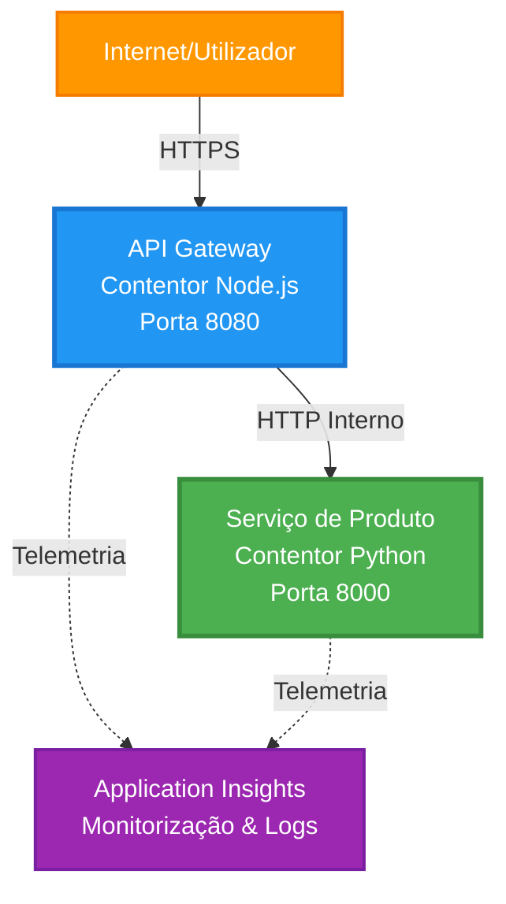
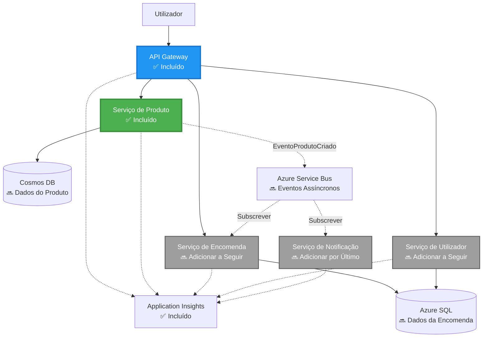
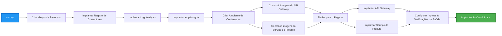
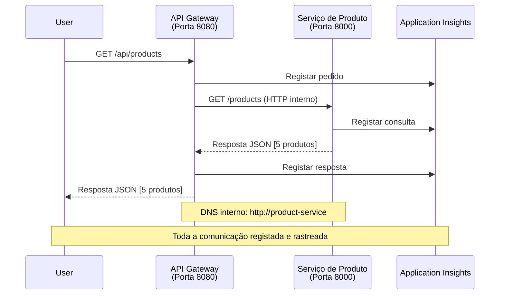

# Arquitectura de Microserviços - Exemplo de Container App

⏱️ **Tempo Estimado**: 25-35 minutos | 💰 **Custo Estimado**: ~50-100$/mês | ⭐ **Complexidade**: Avançado

**📚 Caminho de Aprendizagem:**
- ← Anterior: [Simple Flask API](../../../../examples/container-app/simple-flask-api) - Fundamentos de um único contentor
- 🎯 **Aqui Está**: Arquitectura de Microserviços (base com 2 serviços)
- → Seguinte: [AI Integration](../../../../docs/ai-foundry) - Adicione inteligência aos seus serviços
- 🏠 [Início do Curso](../../README.md)

---

Uma arquitetura de microserviços **simplificada mas funcional** implantada em Azure Container Apps usando AZD CLI. Este exemplo demonstra comunicação entre serviços, orquestração de contentores e monitorização com uma configuração prática de 2 serviços.

> **📚 Abordagem de Aprendizagem**: Este exemplo começa com uma arquitetura mínima de 2 serviços (API Gateway + Serviço Backend) que pode realmente implantar e aprender com ela. Depois de dominar esta base, fornecemos orientações para expansão para um ecossistema completo de microserviços.

## O Que Vai Aprender

Ao completar este exemplo, irá:
- Implantar múltiplos contentores em Azure Container Apps
- Implementar comunicação entre serviços com rede interna
- Configurar escalonamento e verificações de estado baseadas no ambiente
- Monitorizar aplicações distribuídas com Application Insights
- Compreender padrões de implantação de microserviços e boas práticas
- Aprender expansão progressiva de arquiteturas simples para complexas

## Arquitetura

### Fase 1: O Que Estamos a Construir (Incluído Neste Exemplo)


**Detalhes dos Componentes:**

| Componente | Finalidade | Acesso | Recursos |
|-----------|------------|--------|----------|
| **API Gateway** | Roteia pedidos externos para serviços backend | Público (HTTPS) | 1 vCPU, 2GB RAM, 2-20 réplicas |
| **Serviço de Produto** | Gere catálogo de produtos com dados em memória | Apenas interno | 0.5 vCPU, 1GB RAM, 1-10 réplicas |
| **Application Insights** | Logging centralizado e tracing distribuído | Portal Azure | 1-2 GB/mês ingestão de dados |

**Por Que Começar pelo Simples?**
- ✅ Implante e compreenda rapidamente (25-35 minutos)
- ✅ Aprenda padrões essenciais de microserviços sem complexidade
- ✅ Código funcional para modificar e experimentar
- ✅ Custo reduzido para aprender (~50-100$/mês vs 300-1400$/mês)
- ✅ Ganhe confiança antes de adicionar bases de dados e filas de mensagens

**Analogia**: Pense nisto como aprender a conduzir. Começa num parque de estacionamento vazio (2 serviços), domina o básico e depois avança para o trânsito da cidade (5+ serviços com bases de dados).

### Fase 2: Expansão Futura (Arquitetura de Referência)

Depois de dominar a arquitetura de 2 serviços, pode expandir para:


Consulte a secção "Guia de Expansão" no final para instruções passo a passo.

## Funcionalidades Incluídas

✅ **Descoberta de Serviço**: Descoberta automática baseada em DNS entre contentores  
✅ **Balanceamento de Carga**: Balanceamento integrado entre réplicas  
✅ **Autoescalonamento**: Escalonamento independente por serviço baseado em pedidos HTTP  
✅ **Monitorização de Saúde**: Probes de liveness e readiness para ambos os serviços  
✅ **Logging Distribuído**: Logging centralizado com Application Insights  
✅ **Rede Interna**: Comunicação segura entre serviços  
✅ **Orquestração de Contentores**: Implantação e escalonamento automáticos  
✅ **Atualizações Sem Downtime**: Updates progressivos com gestão de revisões  

## Pré-requisitos

### Ferramentas Necessárias

Antes de começar, verifique que tem estas ferramentas instaladas:

1. **[Azure Developer CLI (azd)](https://learn.microsoft.com/azure/developer/azure-developer-cli/install-azd)** (versão 1.0.0 ou superior)
   ```bash
   azd version
   # Saída esperada: versão azd 1.0.0 ou superior
   ```

2. **[Azure CLI](https://learn.microsoft.com/cli/azure/install-azure-cli)** (versão 2.50.0 ou superior)
   ```bash
   az --version
   # Saída esperada: azure-cli 2.50.0 ou superior
   ```

3. **[Docker](https://www.docker.com/get-started)** (para desenvolvimento/teste local - opcional)
   ```bash
   docker --version
   # Saída esperada: Versão do Docker 20.10 ou superior
   ```

### Verifique a Sua Configuração

Execute estes comandos para confirmar que está pronto:

```bash
# Verificar Azure Developer CLI
azd version
# ✅ Esperado: azd versão 1.0.0 ou superior

# Verificar Azure CLI
az --version
# ✅ Esperado: azure-cli 2.50.0 ou superior

# Verificar Docker (opcional)
docker --version
# ✅ Esperado: Docker versão 20.10 ou superior
```

**Critério de Sucesso**: Todos os comandos retornam números de versão iguais ou superiores aos mínimos.

### Requisitos do Azure

- Uma **subscrição Azure** ativa ([crie uma conta gratuita](https://azure.microsoft.com/free/))
- Permissões para criar recursos na sua subscrição
- Papel de **Contributor** na subscrição ou grupo de recursos

### Conhecimentos Pré-Requisitos

Este é um exemplo de **nível avançado**. Deve ter:
- Completado o [exemplo Simple Flask API](../../../../examples/container-app/simple-flask-api) 
- Compreensão básica de arquitetura de microserviços
- Familiaridade com APIs REST e HTTP
- Entendimento dos conceitos de contentores

**Novo nos Container Apps?** Comece pelo [exemplo Simple Flask API](../../../../examples/container-app/simple-flask-api) para aprender o básico.

## Início Rápido (Passo a Passo)

### Passo 1: Clonar e Navegar

```bash
git clone https://github.com/microsoft/AZD-for-beginners.git
cd AZD-for-beginners/examples/microservices
```

**✓ Verificação de Sucesso**: Verifique se vê o ficheiro `azure.yaml`:
```bash
ls
# Esperado: README.md, azure.yaml, infra/, src/
```

### Passo 2: Autentique-se no Azure

```bash
azd auth login
```

Isto abre o seu navegador para autenticação Azure. Inicie sessão com as suas credenciais Azure.

**✓ Verificação de Sucesso**: Deverá ver:
```
Logged in to Azure.
```

### Passo 3: Inicialize o Ambiente

```bash
azd init
```

**Perguntas que verá**:
- **Nome do ambiente**: Insira um nome curto (ex: `microservices-dev`)
- **Subscrição Azure**: Selecione a sua subscrição
- **Localização Azure**: Escolha uma região (ex: `eastus`, `westeurope`)

**✓ Verificação de Sucesso**: Deverá ver:
```
SUCCESS: New project initialized!
```

### Passo 4: Implemente Infraestrutura e Serviços

```bash
azd up
```

**O que acontece** (leva 8-12 minutos):


**✓ Verificação de Sucesso**: Deverá ver:
```
SUCCESS: Your application was deployed to Azure in X minutes Y seconds.
Endpoint: https://api-gateway-<unique-id>.azurecontainerapps.io
```

**⏱️ Tempo**: 8-12 minutos

### Passo 5: Teste a Implantação

```bash
# Obter o endpoint do gateway
GATEWAY_URL=$(azd env get-values | grep API_GATEWAY_URL | cut -d '=' -f2 | tr -d '"')

# Testar a saúde do API Gateway
curl $GATEWAY_URL/health
```

**✅ Saída Esperada:**
```json
{
  "status": "healthy",
  "service": "api-gateway",
  "timestamp": "2025-11-19T10:30:00Z"
}
```

**Teste do serviço de produto via gateway**:
```bash
# Listar produtos
curl $GATEWAY_URL/api/products
```

**✅ Saída Esperada:**
```json
[
  {"id":1,"name":"Laptop","price":999.99,"stock":50},
  {"id":2,"name":"Mouse","price":29.99,"stock":200},
  {"id":3,"name":"Keyboard","price":79.99,"stock":150}
]
```

**✓ Verificação de Sucesso**: Ambos os endpoints retornam dados JSON sem erros.

---

**🎉 Parabéns!** Implantou uma arquitetura de microserviços no Azure!

## Estrutura do Projeto

Todos os ficheiros de implementação estão incluídos—este é um exemplo completo e funcional:

```
microservices/
│
├── README.md                         # This file
├── azure.yaml                        # AZD configuration
├── .gitignore                        # Git ignore patterns
│
├── infra/                           # Infrastructure as Code (Bicep)
│   ├── main.bicep                   # Main orchestration
│   ├── abbreviations.json           # Naming conventions
│   ├── core/                        # Shared infrastructure
│   │   ├── container-apps-environment.bicep  # Container environment + registry
│   │   └── monitor.bicep            # Application Insights + Log Analytics
│   └── app/                         # Service definitions
│       ├── api-gateway.bicep        # API Gateway container app
│       └── product-service.bicep    # Product Service container app
│
└── src/                             # Application source code
    ├── api-gateway/                 # Node.js API Gateway
    │   ├── app.js                   # Express server with routing
    │   ├── package.json             # Node dependencies
    │   └── Dockerfile               # Container definition
    └── product-service/             # Python Product Service
        ├── main.py                  # Flask API with product data
        ├── requirements.txt         # Python dependencies
        └── Dockerfile               # Container definition
```

**O Que Cada Componente Faz:**

**Infraestrutura (infra/)**:
- `main.bicep`: Orquestra todos os recursos Azure e suas dependências
- `core/container-apps-environment.bicep`: Cria o ambiente Container Apps e o Azure Container Registry
- `core/monitor.bicep`: Configura Application Insights para logging distribuído
- `app/*.bicep`: Definições individuais das apps container com escalonamento e probes de saúde

**API Gateway (src/api-gateway/)**:
- Serviço público que encaminha pedidos para serviços backend
- Implementa logging, gestão de erros e encaminhamento de pedidos
- Demonstra comunicação HTTP entre serviços

**Serviço de Produto (src/product-service/)**:
- Serviço interno com catálogo de produtos (em memória para simplicidade)
- API REST com probes de saúde
- Exemplo do padrão de microserviço backend

## Visão Geral dos Serviços

### API Gateway (Node.js/Express)

**Porta**: 8080  
**Acesso**: Público (ingresso externo)  
**Finalidade**: Roteia pedidos recebidos para os serviços backend apropriados  

**Endpoints**:
- `GET /` - Informação do serviço
- `GET /health` - Endpoint de verificação de saúde
- `GET /api/products` - Encaminha para serviço de produto (lista todos)
- `GET /api/products/:id` - Encaminha para serviço de produto (obter por ID)

**Principais Características**:
- Roteamento de pedidos com axios
- Logging centralizado
- Gestão de erros e timeouts
- Descoberta de serviços via variáveis de ambiente
- Integração com Application Insights

**Destaque de Código** (`src/api-gateway/app.js`):
```javascript
// Comunicação interna do serviço
app.get('/api/products', async (req, res) => {
  const response = await axios.get(`${PRODUCT_SERVICE_URL}/products`, {
    timeout: 5000
  });
  res.json(response.data);
});
```

### Serviço de Produto (Python/Flask)

**Porta**: 8000  
**Acesso**: Apenas interno (sem ingresso externo)  
**Finalidade**: Gere catálogo de produtos com dados em memória  

**Endpoints**:
- `GET /` - Informação do serviço
- `GET /health` - Endpoint de verificação de saúde
- `GET /products` - Lista todos os produtos
- `GET /products/<id>` - Obtém produto por ID

**Principais Características**:
- API REST com Flask
- Armazenamento de produtos em memória (simples, sem base de dados)
- Monitorização de saúde com probes
- Logging estruturado
- Integração com Application Insights

**Modelo de Dados**:
```python
{
  "id": 1,
  "name": "Laptop",
  "description": "High-performance laptop",
  "price": 999.99,
  "stock": 50
}
```

**Por Que Apenas Interno?**
O serviço de produto não é exposto publicamente. Todos os pedidos têm que passar pelo API Gateway, que providencia:
- Segurança: Ponto de acesso controlado
- Flexibilidade: Pode alterar backend sem afetar clientes
- Monitorização: Logging centralizado dos pedidos

## Compreender a Comunicação Entre Serviços

### Como os Serviços Comunicarem


Neste exemplo, o API Gateway comunica-se com o Serviço de Produto usando **chamadas HTTP internas**:

```javascript
// Gateway da API (src/api-gateway/app.js)
const PRODUCT_SERVICE_URL = process.env.PRODUCT_SERVICE_URL;

// Fazer pedido HTTP interno
const response = await axios.get(`${PRODUCT_SERVICE_URL}/products`);
```

**Pontos-Chave**:

1. **Descoberta Baseada em DNS**: Container Apps fornece automaticamente DNS para serviços internos
   - FQDN Serviço Produto: `product-service.internal.<environment>.azurecontainerapps.io`
   - Simplificado para: `http://product-service` (Container Apps resolve)

2. **Sem Exposição Pública**: Serviço Produto tem `external: false` no Bicep
   - Acesso apenas dentro do ambiente Container Apps
   - Não pode ser acedido pela internet

3. **Variáveis de Ambiente**: URLs dos serviços são injetadas na implantação
   - Bicep passa o FQDN interno para o gateway
   - Sem URLs codificadas no código da aplicação

**Analogia**: Pense nisto como salas num escritório. O API Gateway é a receção (público), e o Serviço Produto é uma sala internamente acessível. Visitantes têm de passar pela receção para chegar a qualquer sala.

## Opções de Implantação

### Implantação Completa (Recomendada)

```bash
# Implantar a infraestrutura e ambos os serviços
azd up
```

Isto implanta:
1. Ambiente Container Apps
2. Application Insights
3. Container Registry
4. Contentor do API Gateway
5. Contentor do Serviço Produto

**Tempo**: 8-12 minutos

### Implantar Serviço Individual

```bash
# Implementar apenas um serviço (após o azd up inicial)
azd deploy api-gateway

# Ou implementar o serviço de produto
azd deploy product-service
```

**Caso de Uso**: Quando atualizou o código num serviço e quer implantar apenas esse serviço.

### Atualizar Configuração

```bash
# Alterar parâmetros de escala
azd env set GATEWAY_MAX_REPLICAS 30

# Reimplantar com nova configuração
azd up
```

## Configuração

### Configuração de Escalonamento

Ambos os serviços estão configurados com autoscaling baseado em HTTP nos seus ficheiros Bicep:

**API Gateway**:
- Réplicas mínimas: 2 (sempre pelo menos 2 para disponibilidade)
- Réplicas máximas: 20
- Trigger de escala: 50 pedidos concorrentes por réplica

**Serviço Produto**:
- Réplicas mínimas: 1 (pode escalar até zero se necessário)
- Réplicas máximas: 10
- Trigger de escala: 100 pedidos concorrentes por réplica

**Personalizar Escalonamento** (em `infra/app/*.bicep`):
```bicep
scale: {
  minReplicas: 1
  maxReplicas: 10
  rules: [
    {
      name: 'http-scale-rule'
      http: {
        metadata: {
          concurrentRequests: '100'  // Adjust this
        }
      }
    }
  ]
}
```

### Alocação de Recursos

**API Gateway**:
- CPU: 1.0 vCPU
- Memória: 2 GiB
- Motivo: Gere todo o tráfego externo

**Serviço Produto**:
- CPU: 0.5 vCPU
- Memória: 1 GiB
- Motivo: Operações leves em memória

### Verificações de Saúde

Ambos os serviços incluem probes de liveness e readiness:

```bicep
probes: [
  {
    type: 'Liveness'
    httpGet: {
      path: '/health'
      port: 8080
    }
    initialDelaySeconds: 10
    periodSeconds: 30
  }
  {
    type: 'Readiness'
    httpGet: {
      path: '/health'
      port: 8080
    }
    initialDelaySeconds: 5
    periodSeconds: 10
  }
]
```

**O Que Isto Significa**:
- **Liveness**: Se a verificação falhar, Container Apps reinicia o contentor
- **Readiness**: Se não estiver pronto, Container Apps deixa de encaminhar tráfego para essa réplica

## Monitorização & Observabilidade

### Visualizar Logs dos Serviços

```bash
# Ver logs usando azd monitor
azd monitor --logs

# Ou usar o Azure CLI para Apps de Contentores específicos:
# Transmitir logs do API Gateway
az containerapp logs show --name api-gateway --resource-group $RG_NAME --follow

# Ver logs recentes do serviço de produtos
az containerapp logs show --name product-service --resource-group $RG_NAME --tail 100
```

**Saída Esperada**:
```
[api-gateway] API Gateway listening on port 8080
[api-gateway] Product Service URL: http://product-service
[api-gateway] GET /api/products 200 - 45ms
[product-service] Retrieved 5 products
```

### Queries do Application Insights

Aceda ao Application Insights no Portal Azure e execute estas queries:

**Encontrar Pedidos Lentos**:
```kusto
requests
| where timestamp > ago(1h)
| where duration > 1000  // Requests taking >1 second
| summarize count() by name, cloud_RoleName
| order by count_ desc
```

**Rastrear Chamadas Entre Serviços**:
```kusto
dependencies
| where timestamp > ago(1h)
| where type == "Http"
| project timestamp, name, target, duration, success
| order by timestamp desc
```

**Taxa de Erro por Serviço**:
```kusto
exceptions
| where timestamp > ago(24h)
| summarize errorCount = count() by cloud_RoleName, type
| order by errorCount desc
```

**Volume de Pedidos ao Longo do Tempo**:
```kusto
requests
| where timestamp > ago(1h)
| summarize requestCount = count() by bin(timestamp, 5m), cloud_RoleName
| render timechart
```

### Aceder ao Dashboard de Monitorização

```bash
# Obter detalhes do Application Insights
azd env get-values | grep APPLICATIONINSIGHTS

# Abrir monitorização do Portal Azure
az monitor app-insights component show \
  --app $(azd env get-values | grep APPLICATIONINSIGHTS_CONNECTION_STRING | cut -d '=' -f2) \
  --resource-group $(azd env get-values | grep AZURE_RESOURCE_GROUP | cut -d '=' -f2) \
  --query "appId" -o tsv
```

### Métricas em Tempo Real

1. Navegue para Application Insights no Portal Azure
2. Clique em "Live Metrics"
3. Veja pedidos, falhas e desempenho em tempo real
4. Teste com: `curl $(azd env get-values | grep API_GATEWAY_URL | cut -d '=' -f2 | tr -d '"')/api/products`

## Exercícios Práticos

### Exercício 1: Adicionar Novo Endpoint de Produto ⭐ (Fácil)

**Objetivo**: Adicione um endpoint POST para criar novos produtos

**Ponto de Partida**: `src/product-service/main.py`

**Passos**:

1. Adicione este endpoint após a função `get_product` em `main.py`:

```python
@app.route('/products', methods=['POST'])
def create_product():
    """Create a new product"""
    data = request.get_json()
    
    # Validar campos obrigatórios
    if not data or 'name' not in data or 'price' not in data:
        return jsonify({'error': 'Missing required fields: name, price'}), 400
    
    new_id = max(p['id'] for p in products) + 1
    new_product = {
        'id': new_id,
        'name': data['name'],
        'description': data.get('description', ''),
        'price': float(data['price']),
        'stock': int(data.get('stock', 0))
    }
    products.append(new_product)
    logger.info(f"Created product {new_id}")
    return jsonify(new_product), 201
```

2. Adicione a rota POST no API Gateway (`src/api-gateway/app.js`):

```javascript
// Adicione isto depois da rota GET /api/products
app.post('/api/products', async (req, res) => {
  try {
    console.log(`Forwarding POST request to ${PRODUCT_SERVICE_URL}/products`);
    const response = await axios.post(`${PRODUCT_SERVICE_URL}/products`, req.body, {
      timeout: 5000
    });
    res.status(201).json(response.data);
  } catch (error) {
    console.error('Error calling product service:', error.message);
    res.status(503).json({
      error: 'Product service unavailable',
      message: error.message
    });
  }
});
```

3. Reimplantar ambos os serviços:

```bash
azd deploy product-service
azd deploy api-gateway
```

4. Testar o novo endpoint:

```bash
GATEWAY_URL=$(azd env get-values | grep API_GATEWAY_URL | cut -d '=' -f2 | tr -d '"')

# Criar um novo produto
curl -X POST $GATEWAY_URL/api/products \
  -H "Content-Type: application/json" \
  -d '{"name":"USB Cable","price":9.99,"stock":500}'
```

**✅ Saída esperada:**
```json
{"id":6,"name":"USB Cable","description":"","price":9.99,"stock":500}
```

5. Verificar se aparece na lista:

```bash
curl $GATEWAY_URL/api/products
# Agora deverá mostrar 6 produtos incluindo o novo Cabo USB
```

**Critérios de Sucesso**:
- ✅ Pedido POST retorna HTTP 201
- ✅ Novo produto aparece na lista GET /api/products
- ✅ Produto tem ID auto-incrementado

**Tempo**: 10-15 minutos

---

### Exercício 2: Modificar Regras de Autoscaling ⭐⭐ (Médio)

**Objetivo**: Alterar Product Service para escalar mais agressivamente

**Ponto de Partida**: `infra/app/product-service.bicep`

**Passos**:

1. Abrir `infra/app/product-service.bicep` e encontrar o bloco `scale` (por volta da linha 95)

2. Alterar de:
```bicep
scale: {
  minReplicas: 1
  maxReplicas: 10
  rules: [
    {
      name: 'http-scale-rule'
      http: {
        metadata: {
          concurrentRequests: '100'  // OLD
        }
      }
    }
  ]
}
```

Para:
```bicep
scale: {
  minReplicas: 2  // Always have 2 running
  maxReplicas: 20  // Allow more scaling
  rules: [
    {
      name: 'http-scale-rule'
      http: {
        metadata: {
          concurrentRequests: '20'  // Scale at lower threshold
        }
      }
    }
  ]
}
```

3. Reimplantar a infraestrutura:

```bash
azd up
```

4. Verificar nova configuração de escala:

```bash
az containerapp show \
  --name $(azd env get-values | grep PRODUCT_SERVICE | head -1 | cut -d '/' -f5) \
  --resource-group $(azd env get-values | grep AZURE_RESOURCE_GROUP | cut -d '=' -f2 | tr -d '"') \
  --query "properties.template.scale" -o json
```

**✅ Saída esperada:**
```json
{
  "minReplicas": 2,
  "maxReplicas": 20,
  "rules": [...]
}
```

5. Testar autoscaling com carga:

```bash
# Gerar pedidos concorrentes
for i in {1..500}; do curl $GATEWAY_URL/api/products & done

# Monitorizar a escalação usando o Azure CLI
az containerapp logs show --name product-service --resource-group $RG_NAME --follow
# Procure por: eventos de escalação das aplicações de contentores
```

**Critérios de Sucesso**:
- ✅ Product Service executa sempre pelo menos 2 réplicas
- ✅ Sob carga, escala para mais de 2 réplicas
- ✅ Portal Azure mostra as novas regras de escalonamento

**Tempo**: 15-20 minutos

---

### Exercício 3: Adicionar Consulta de Monitorização Personalizada ⭐⭐ (Médio)

**Objetivo**: Criar uma consulta personalizada no Application Insights para monitorizar o desempenho da API de produtos

**Passos**:

1. Navegar para Application Insights no Azure Portal:
   - Ir ao Azure Portal
   - Encontrar o seu grupo de recursos (rg-microservices-*)
   - Clicar no recurso Application Insights

2. Clicar em "Logs" no menu lateral

3. Criar esta consulta:

```kusto
requests
| where timestamp > ago(1h)
| where name contains "products"
| summarize 
    RequestCount = count(),
    AvgDuration = avg(duration),
    P95Duration = percentile(duration, 95),
    SuccessRate = 100.0 * countif(success == true) / count()
  by bin(timestamp, 5m)
| render timechart
```

4. Clicar em "Run" para executar a consulta

5. Guardar a consulta:
   - Clicar em "Save"
   - Nome: "Product API Performance"
   - Categoria: "Performance"

6. Gerar tráfego de teste:

```bash
for i in {1..100}; do curl $GATEWAY_URL/api/products; sleep 1; done
```

7. Atualizar a consulta para ver os dados

**✅ Saída esperada:**
- Gráfico a mostrar o número de pedidos ao longo do tempo
- Duração média < 500ms
- Taxa de sucesso = 100%
- Intervalos de tempo de 5 minutos

**Critérios de Sucesso**:
- ✅ A consulta mostra mais de 100 pedidos
- ✅ Taxa de sucesso é 100%
- ✅ Duração média < 500ms
- ✅ Gráfico exibe intervalos de 5 minutos

**Resultado de Aprendizagem**: Compreender como monitorizar o desempenho do serviço com consultas personalizadas

**Tempo**: 10-15 minutos

---

### Exercício 4: Implementar Lógica de Retry ⭐⭐⭐ (Avançado)

**Objetivo**: Adicionar lógica de tentativas ao API Gateway quando o Product Service estiver temporariamente indisponível

**Ponto de Partida**: `src/api-gateway/app.js`

**Passos**:

1. Instalar biblioteca de retry:

```bash
cd src/api-gateway
npm install axios-retry --save
cd ../..
```

2. Atualizar `src/api-gateway/app.js` (adicionar após a importação do axios):

```javascript
const axiosRetry = require('axios-retry');

// Configurar lógica de tentativas
axiosRetry(axios, {
  retries: 3,
  retryDelay: (retryCount) => {
    return retryCount * 1000; // 1s, 2s, 3s
  },
  retryCondition: (error) => {
    // Tentar novamente em erros de rede ou respostas 5xx
    return axiosRetry.isNetworkOrIdempotentRequestError(error) ||
           (error.response && error.response.status >= 500);
  }
});

console.log('Retry logic configured: 3 retries with exponential backoff');
```

3. Reimplantar o API Gateway:

```bash
azd deploy api-gateway
```

4. Testar o comportamento de retry simulando falha do serviço:

```bash
# Escalar o serviço de produto para 0 (simular falha)
az containerapp update \
  --name $(azd env get-values | grep PRODUCT_SERVICE | head -1 | cut -d '/' -f5) \
  --resource-group $(azd env get-values | grep AZURE_RESOURCE_GROUP | cut -d '=' -f2 | tr -d '"') \
  --min-replicas 0 \
  --max-replicas 0

# Tentar aceder aos produtos (irá tentar 3 vezes)
time curl -v $GATEWAY_URL/api/products
# Observação: A resposta demora ~6 segundos (1s + 2s + 3s tentativas)

# Restaurar o serviço de produto
az containerapp update \
  --name $(azd env get-values | grep PRODUCT_SERVICE | head -1 | cut -d '/' -f5) \
  --resource-group $(azd env get-values | grep AZURE_RESOURCE_GROUP | cut -d '=' -f2 | tr -d '"') \
  --min-replicas 1 \
  --max-replicas 10
```

5. Ver logs de retry:

```bash
az containerapp logs show --name api-gateway --resource-group $RG_NAME --tail 50
# Procure por: Mensagens de tentativas de nova tentativa
```

**✅ Comportamento esperado:**
- Os pedidos tentam 3 vezes antes de falhar
- Cada tentativa espera mais tempo (1s, 2s, 3s)
- Pedidos são bem-sucedidos após reinício do serviço
- Logs mostram as tentativas de retry

**Critérios de Sucesso**:
- ✅ Pedidos tentam 3 vezes antes de falhar
- ✅ Cada tentativa espera mais tempo (backoff exponencial)
- ✅ Pedidos bem-sucedidos após reinício do serviço
- ✅ Logs mostram as tentativas de retry

**Resultado de Aprendizagem**: Compreender padrões de resiliência em microserviços (circuit breakers, retries, timeouts)

**Tempo**: 20-25 minutos

---

## Verificação de Conhecimento

Após completar este exemplo, verifique a sua compreensão:

### 1. Comunicação entre Serviços ✓

Teste os seus conhecimentos:
- [ ] Sabe explicar como o API Gateway descobre o Product Service? (descoberta de serviço baseada em DNS)
- [ ] O que acontece se o Product Service estiver indisponível? (Gateway retorna erro 503)
- [ ] Como adicionaria um terceiro serviço? (Criar novo ficheiro Bicep, adicionar a main.bicep, criar pasta src)

**Verificação Prática:**
```bash
# Simular falha no serviço
az containerapp update --name <product-service-name> --min-replicas 0 --max-replicas 0
curl $GATEWAY_URL/api/products
# ✅ Esperado: 503 Serviço Indisponível

# Restaurar serviço
az containerapp update --name <product-service-name> --min-replicas 1 --max-replicas 10
```

### 2. Monitorização e Observabilidade ✓

Teste os seus conhecimentos:
- [ ] Onde vê os registos distribuídos? (Application Insights no Azure Portal)
- [ ] Como rastrear pedidos lentos? (Consulta Kusto: `requests | where duration > 1000`)
- [ ] Consegue identificar qual serviço causou um erro? (Ver campo `cloud_RoleName` nos registos)

**Verificação Prática:**
```bash
# Gerar uma simulação de pedido lento
curl "$GATEWAY_URL/api/products?delay=2000"

# Consultar o Application Insights para pedidos lentos
# Navegar para o Azure Portal → Application Insights → Logs
# Executar: requests | where duration > 1000 | project timestamp, name, duration, cloud_RoleName
```

### 3. Escalonamento e Performance ✓

Teste os seus conhecimentos:
- [ ] O que desencadeia o autoscaling? (Regras de pedidos HTTP concorrentes: 50 para gateway, 100 para produto)
- [ ] Quantas réplicas estão a correr agora? (Verificar com `az containerapp revision list`)
- [ ] Como escalaria o Product Service para 5 réplicas? (Atualizar minReplicas no Bicep)

**Verificação Prática:**
```bash
# Gerar carga para testar o autoescalonamento
for i in {1..1000}; do curl $GATEWAY_URL/api/products & done

# Ver o aumento de réplicas usando a Azure CLI
az containerapp logs show --name api-gateway --resource-group $RG_NAME --follow
# ✅ Esperado: Ver eventos de escalonamento nos logs
```

**Critérios de Sucesso**: Conseguir responder a todas as perguntas e verificar com comandos práticos.

---

## Análise de Custos

### Custos Mensais Estimados (Para Este Exemplo de 2 Serviços)

| Recurso | Configuração | Custo Estimado |
|---------|--------------|----------------|
| API Gateway | 2-20 réplicas, 1 vCPU, 2GB RAM | $30-150 |
| Product Service | 1-10 réplicas, 0.5 vCPU, 1GB RAM | $15-75 |
| Container Registry | Nível Básico | $5 |
| Application Insights | 1-2 GB/mês | $5-10 |
| Log Analytics | 1 GB/mês | $3 |
| **Total** | | **$58-243/mês** |

### Desglose de Custos por Uso

**Tráfego leve** (teste/aprendizagem): ~$60/mês
- API Gateway: 2 réplicas × 24/7 = $30
- Product Service: 1 réplica × 24/7 = $15
- Monitorização + Registry = $13

**Tráfego moderado** (pequena produção): ~$120/mês
- API Gateway: 5 réplicas médias = $75
- Product Service: 3 réplicas médias = $45
- Monitorização + Registry = $13

**Tráfego elevado** (períodos de pico): ~$240/mês
- API Gateway: 15 réplicas médias = $225
- Product Service: 8 réplicas médias = $120
- Monitorização + Registry = $13

### Dicas para Otimização de Custos

1. **Escalar para Zero no Desenvolvimento**:
   ```bicep
   scale: {
     minReplicas: 0  // Save $30-40/month when not in use
     maxReplicas: 10
   }
   ```

2. **Usar Plano Consumption para Cosmos DB** (quando o adicionar):
   - Pagar apenas pelo que usar
   - Sem custo mínimo

3. **Definir Amostragem no Application Insights**:
   ```javascript
   appInsights.defaultClient.config.samplingPercentage = 50; // Amostrar 50% dos pedidos
   ```

4. **Limpar Recursos Quando Não Necessários**:
   ```bash
   azd down --force --purge
   ```

### Opções de Nível Gratuito

Para aprendizagem/testes, considere:
- ✅ Usar créditos gratuitos do Azure ($200 nos primeiros 30 dias em contas novas)
- ✅ Manter réplicas mínimas (economiza ~50% dos custos)
- ✅ Apagar após o teste (sem cobranças contínuas)
- ✅ Escalar para zero entre sessões de aprendizagem

**Exemplo**: Executar este exemplo 2 horas/dia × 30 dias = ~$5/mês em vez de $60/mês

---

## Referência Rápida de Resolução de Problemas

### Problema: `azd up` falha com "Subscription not found"

**Solução**:
```bash
# Iniciar sessão novamente com subscrição explícita
az account set --subscription <your-subscription-id>
azd env set AZURE_SUBSCRIPTION_ID <your-subscription-id>
azd up
```

### Problema: API Gateway retorna 503 "Product service unavailable"

**Diagnóstico**:
```bash
# Verificar registos do serviço de produto usando Azure CLI
az containerapp logs show --name product-service --resource-group $RG_NAME --tail 50

# Verificar o estado de saúde do serviço de produto
az containerapp show \
  --name $(azd env get-values | grep PRODUCT_SERVICE | head -1 | cut -d '/' -f5) \
  --resource-group $(azd env get-values | grep AZURE_RESOURCE_GROUP | cut -d '=' -f2 | tr -d '"') \
  --query "properties.runningStatus"
```

**Causas comuns**:
1. Product service não iniciou (verificar erros Python nos logs)
2. Verificação de saúde falha (confirmar que endpoint `/health` funciona)
3. Falha na construção da imagem do container (verificar na registry)

### Problema: Autoscaling não funciona

**Diagnóstico**:
```bash
# Verificar contagem atual de réplicas
az containerapp revision list \
  --name $(azd env get-values | grep API_GATEWAY | head -1 | cut -d '/' -f5) \
  --resource-group $(azd env get-values | grep AZURE_RESOURCE_GROUP | cut -d '=' -f2 | tr -d '"') \
  --query "[].properties.replicas"

# Gerar carga para testar
for i in {1..1000}; do curl $GATEWAY_URL/api/products & done

# Monitorizar eventos de escalonamento usando Azure CLI
az containerapp logs show --name api-gateway --resource-group $RG_NAME --follow | grep -i scale
```

**Causas comuns**:
1. Carga insuficiente para disparar regra de escala (precisa >50 pedidos concorrentes)
2. Já atingiu número máximo de réplicas (ver configuração Bicep)
3. Regra de escala configurada incorretamente no Bicep (verificar valor de concurrentRequests)

### Problema: Application Insights não mostra logs

**Diagnóstico**:
```bash
# Verificar se a cadeia de ligação está definida
azd env get-values | grep APPLICATIONINSIGHTS

# Verificar se os serviços estão a enviar telemetria
az monitor app-insights component show \
  --app $(azd env get-values | grep APPLICATIONINSIGHTS_NAME | cut -d '=' -f2 | tr -d '"') \
  --resource-group $(azd env get-values | grep AZURE_RESOURCE_GROUP | cut -d '=' -f2 | tr -d '"') \
  --query "properties.InstrumentationKey"
```

**Causas comuns**:
1. Connection string não passada ao container (ver variáveis de ambiente)
2. SDK do Application Insights não configurado (ver imports no código)
3. Firewall a bloquear telemetria (raro, verificar regras de rede)

### Problema: Falha na construção local do Docker

**Diagnóstico**:
```bash
# Testar compilação do API Gateway
cd src/api-gateway
docker build -t test-gateway .

# Testar compilação do Serviço de Produto
cd ../product-service
docker build -t test-product .
```

**Causas comuns**:
1. Dependências em falta em package.json/requirements.txt
2. Erros de sintaxe no Dockerfile
3. Problemas de rede ao baixar dependências

**Ainda com problemas?** Consulte o [Guia de Problemas Comuns](../../docs/chapter-07-troubleshooting/common-issues.md) ou [Resolução de Problemas do Azure Container Apps](https://learn.microsoft.com/azure/container-apps/troubleshooting)

---

## Limpeza

Para evitar cobranças contínuas, elimine todos os recursos:

```bash
azd down --force --purge
```

**Pedido de Confirmação**:
```
? Total resources to delete: 6, are you sure you want to continue? (y/N)
```

Digite `y` para confirmar.

**O que Será Eliminado**:
- Ambiente Container Apps
- Ambos os Container Apps (gateway & product service)
- Container Registry
- Application Insights
- Espaço de trabalho Log Analytics
- Grupo de recursos

**✓ Verificar Limpeza**:
```bash
az group list --query "[?starts_with(name,'rg-microservices')]" --output table
```

Deve retornar vazio.

---

## Guia de Expansão: De 2 para 5+ Serviços

Depois de dominar esta arquitetura de 2 serviços, veja como expandir:

### Fase 1: Adicionar Persistência com Base de Dados (Próximo Passo)

**Adicionar Cosmos DB ao Product Service**:

1. Criar `infra/core/cosmos.bicep`:
   ```bicep
   resource cosmosAccount 'Microsoft.DocumentDB/databaseAccounts@2023-04-15' = {
     name: name
     location: location
     kind: 'GlobalDocumentDB'
     properties: {
       databaseAccountOfferType: 'Standard'
       consistencyPolicy: { defaultConsistencyLevel: 'Session' }
       locations: [{ locationName: location, failoverPriority: 0 }]
     }
   }
   ```

2. Atualizar product service para usar Azure Cosmos DB SDK para Python em vez de dados em memória

3. Custo adicional estimado: ~$25/mês (serverless)

### Fase 2: Adicionar Terceiro Serviço (Gestão de Pedidos)

**Criar Order Service**:

1. Nova pasta: `src/order-service/` (Python/Node.js/C#)
2. Novo Bicep: `infra/app/order-service.bicep`
3. Atualizar API Gateway para encaminhar `/api/orders`
4. Adicionar Azure SQL Database para persistência de pedidos

**Arquitetura fica**:
```
API Gateway → Product Service (Cosmos DB)
           → Order Service (Azure SQL)
```

### Fase 3: Adicionar Comunicação Assíncrona (Service Bus)

**Implementar Arquitetura Event-Driven**:

1. Adicionar Azure Service Bus: `infra/core/servicebus.bicep`
2. Product Service publica eventos "ProductCreated"
3. Order Service subscreve eventos de produto
4. Adicionar Notification Service para processar eventos

**Padrão**: Request/Response (HTTP) + Event-Driven (Service Bus)

### Fase 4: Adicionar Autenticação de Utilizadores

**Implementar User Service**:

1. Criar `src/user-service/` (Go/Node.js)
2. Adicionar Azure AD B2C ou autenticação JWT personalizada
3. API Gateway valida tokens antes de rotear
4. Serviços verificam permissões do utilizador

### Fase 5: Preparação para Produção

**Adicionar Estes Componentes**:
- ✅ Azure Front Door (balanceamento global)
- ✅ Azure Key Vault (gestão de segredos)
- ✅ Azure Monitor Workbooks (painéis personalizados)
- ✅ Pipeline CI/CD (GitHub Actions)
- ✅ Deployments Blue-Green
- ✅ Identidade Gerida para todos os serviços

**Custo Total da Arquitetura de Produção**: ~$300-1,400/mês

---

## Saiba Mais

### Documentação Relacionada
- [Documentação Azure Container Apps](https://learn.microsoft.com/azure/container-apps/)
- [Guia de Arquitetura de Microservices](https://learn.microsoft.com/azure/architecture/guide/architecture-styles/microservices)
- [Application Insights para Tracing Distribuído](https://learn.microsoft.com/azure/azure-monitor/app/distributed-tracing)
- [Documentação Azure Developer CLI](https://learn.microsoft.com/azure/developer/azure-developer-cli/)

### Próximos Passos Neste Curso
- ← Anterior: [API Flask Simples](../../../../examples/container-app/simple-flask-api) - Exemplo iniciante de container único
- → Seguinte: [Guia de Integração AI](../../../../docs/ai-foundry) - Adicionar capacidades de AI
- 🏠 [Página Inicial do Curso](../../README.md)

### Comparação: Quando Usar O Quê

| Funcionalidade | Container Único | Microservices (Este) | Kubernetes (AKS) |
|----------------|-----------------|---------------------|------------------|
| **Caso de Uso** | Apps simples | Apps complexas | Apps empresariais |
| **Escalabilidade** | Escala serviço único | Escala por serviço | Máxima flexibilidade |
| **Complexidade** | Baixa | Média | Alta |
| **Tamanho da Equipa** | 1-3 desenvolvedores | 3-10 desenvolvedores | 10+ desenvolvedores |
| **Custo** | ~$15-50/mês | ~$60-250/mês | ~$150-500/mês |
| **Tempo de Deploy** | 5-10 minutos | 8-12 minutos | 15-30 minutos |
| **Melhor Para** | MVPs, protótipos | Aplicações de produção | Multicloud, rede avançada |

**Recomendação**: Comece com Container Apps (este exemplo), passe para AKS apenas se necessitar de funcionalidades específicas do Kubernetes.

---

## Perguntas Frequentes

**P: Porque apenas 2 serviços em vez de 5+?**  
R: Progressão educativa. Domine os fundamentos (comunicação entre serviços, monitorização, escalabilidade) com um exemplo simples antes de adicionar complexidade. Os padrões que aprende aqui aplicam-se a arquiteturas com 100 serviços.

**P: Posso adicionar mais serviços eu próprio?**  
R: Absolutamente! Siga o guia de expansão acima. Cada novo serviço segue o mesmo padrão: criar pasta src, criar ficheiro Bicep, atualizar azure.yaml, implementar.

**P: Isto está pronto para produção?**  
R: É uma base sólida. Para produção, adicione: identidade gerida, Key Vault, bases de dados persistentes, pipeline CI/CD, alertas de monitorização, e estratégia de backup.

**P: Porque não usar Dapr ou outra malha de serviços?**  
R: Mantenha simples para aprender. Depois de compreender a rede nativa do Container Apps, pode adicionar o Dapr para cenários avançados (gestão de estado, pub/sub, binds).

**P: Como faço debug localmente?**  
R: Execute serviços localmente com Docker:  
```bash
cd src/api-gateway
docker build -t local-gateway .
docker run -p 8080:8080 -e PRODUCT_SERVICE_URL=http://localhost:8000 local-gateway
```
  
**P: Posso usar diferentes linguagens de programação?**  
R: Sim! Este exemplo mostra Node.js (gateway) + Python (serviço de produtos). Pode misturar qualquer linguagem que corra em containers: C#, Go, Java, Ruby, PHP, etc.

**P: E se não tiver créditos Azure?**  
R: Use o nível gratuito Azure (os primeiros 30 dias em contas novas têm $200 de créditos) ou implemente para períodos curtos de teste e apague imediatamente. Este exemplo custa ~2$/dia.

**P: Em que isto difere do Azure Kubernetes Service (AKS)?**  
R: Container Apps é mais simples (não precisa de conhecimentos Kubernetes) mas menos flexível. AKS dá controlo total do Kubernetes mas exige mais expertise. Comece com Container Apps, avance para AKS se necessário.

**P: Posso usar isto com serviços Azure existentes?**  
R: Sim! Pode ligar a bases de dados existentes, contas de armazenamento, Service Bus, etc. Atualize os ficheiros Bicep para referenciar recursos existentes em vez de criar novos.

---

> **🎓 Resumo do Percurso de Aprendizagem**: Aprendeu a implementar uma arquitetura multi-serviços com escalabilidade automática, rede interna, monitorização centralizada e padrões prontos para produção. Esta base prepara-o para sistemas distribuídos complexos e arquiteturas empresariais de microserviços.

**📚 Navegação do Curso:**  
- ← Anterior: [Simple Flask API](../../../../examples/container-app/simple-flask-api)  
- → Seguinte: [Database Integration Example](../../../../database-app)  
- 🏠 [Início do Curso](../../README.md)  
- 📖 [Boas Práticas Container Apps](../../docs/chapter-04-infrastructure/deployment-guide.md)

---

**✨ Parabéns!** Completou o exemplo de microserviços. Agora sabe como construir, implementar e monitorizar aplicações distribuídas no Azure Container Apps. Quer adicionar capacidades de IA? Veja o [Guia de Integração de IA](../../../../docs/ai-foundry)!

---

<!-- CO-OP TRANSLATOR DISCLAIMER START -->
**Aviso Legal**:
Este documento foi traduzido utilizando o serviço de tradução automática [Co-op Translator](https://github.com/Azure/co-op-translator). Embora nos esforcemos para garantir a precisão, tenha em atenção que traduções automáticas podem conter erros ou imprecisões. O documento original na sua língua nativa deve ser considerado a fonte oficial. Para informações críticas, é recomendada a tradução profissional humana. Não nos responsabilizamos por quaisquer mal-entendidos ou interpretações erradas decorrentes do uso desta tradução.
<!-- CO-OP TRANSLATOR DISCLAIMER END -->