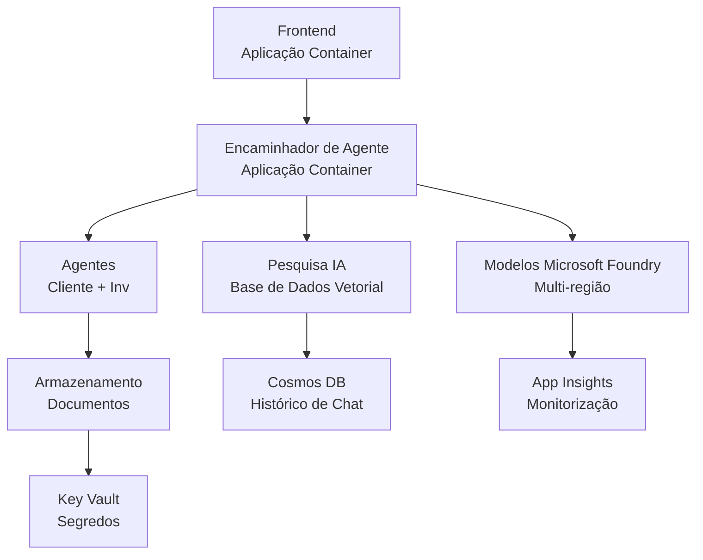

# Retail Multi-Agent Solution - Template de Infraestrutura

**Capítulo 5: Pacote de Implantação em Produção**  
- **📚 Página Inicial do Curso**: [AZD For Beginners](../../README.md)  
- **📖 Capítulo Relacionado**: [Capítulo 5: Soluções Multi-Agente de IA](../../README.md#-chapter-5-multi-agent-ai-solutions-advanced)  
- **📝 Guia de Cenário**: [Arquitetura Completa](../retail-scenario.md)  
- **🎯 Implantação Rápida**: [Implantação com Um Clique](#-quick-deployment)  

> **⚠️ SOMENTE TEMPLATE DE INFRAESTRUTURA**  
> Este template ARM implanta **recursos Azure** para um sistema multi-agente.  
>  
> **O que é implantado (15-25 minutos):**  
> - ✅ Serviços Microsoft Foundry Models (gpt-4.1, gpt-4.1-mini, embeddings em 3 regiões)  
> - ✅ Serviço AI Search (vazio, pronto para criação de índice)  
> - ✅ Apps de Contentores (imagens placeholder, prontas para o seu código)  
> - ✅ Storage, Cosmos DB, Key Vault, Application Insights  
>  
> **O que NÃO está incluído (requer desenvolvimento):**  
> - ❌ Código de implementação dos agentes (Agente Cliente, Agente de Inventário)  
> - ❌ Lógica de roteamento e endpoints API  
> - ❌ Interface do chat no frontend  
> - ❌ Esquemas de índice de pesquisa e pipelines de dados  
> - ❌ **Esforço estimado de desenvolvimento: 80-120 horas**  
>  
> **Use este template se:**  
> - ✅ Quer provisionar infraestrutura Azure para um projeto multi-agente  
> - ✅ Planeia desenvolver a implementação dos agentes separadamente  
> - ✅ Precisa de uma linha base de infraestrutura pronta para produção  
>  
> **Não use se:**  
> - ❌ Espera um demo multi-agente funcional imediatamente  
> - ❌ Procura exemplos completos de código de aplicação  

## Visão Geral

Este diretório contém um template abrangente Azure Resource Manager (ARM) para implantar a **fundação da infraestrutura** de um sistema multi-agente de suporte ao cliente. O template provisiona todos os serviços Azure necessários, devidamente configurados e interligados, prontos para o desenvolvimento da sua aplicação.

**Após a implantação, terá:** Infraestrutura Azure pronta para produção  
**Para completar o sistema, precisa de:** Código dos agentes, UI frontend e configuração de dados (veja [Guia de Arquitetura](../retail-scenario.md))

## 🎯 O Que É Implantado

### Infraestrutura Principal (Estado Após Implantação)

✅ **Serviços Microsoft Foundry Models** (Pronto para chamadas API)  
- Região primária: deployment gpt-4.1 (capacidade 20K TPM)  
- Região secundária: deployment gpt-4.1-mini (capacidade 10K TPM)  
- Região terciária: modelo de embeddings de texto (capacidade 30K TPM)  
- Região de avaliação: modelo gpt-4.1 grader (capacidade 15K TPM)  
- **Estado:** Totalmente funcional - pode fazer chamadas API de imediato

✅ **Azure AI Search** (Vazio – pronto para configuração)  
- Capacidades de pesquisa vetorial ativadas  
- Tier Standard com 1 partição, 1 réplica  
- **Estado:** Serviço a funcionar, mas requer criação de índice  
- **Ação necessária:** Criar índice de pesquisa com o seu esquema

✅ **Conta Azure Storage** (Vazia – pronta para uploads)  
- Containers blob: `documents`, `uploads`  
- Configuração segura (somente HTTPS, sem acesso público)  
- **Estado:** Pronta para receber ficheiros  
- **Ação necessária:** Carregue os dados dos seus produtos e documentos

⚠️ **Ambiente Container Apps** (Imagens placeholder implantadas)  
- App de roteador de agentes (imagem padrão nginx)  
- App frontend (imagem padrão nginx)  
- Autoescalamento configurado (0-10 instâncias)  
- **Estado:** Contentores placeholder em execução  
- **Ação necessária:** Construa e implante as suas aplicações de agentes

✅ **Azure Cosmos DB** (Vazio – pronto para dados)  
- Base de dados e container pré-configurados  
- Otimizado para operações de baixa latência  
- TTL ativado para limpeza automática  
- **Estado:** Pronto para armazenar histórico de chat

✅ **Azure Key Vault** (Opcional - pronto para segredos)  
- Soft delete ativado  
- RBAC configurado para identidades geridas  
- **Estado:** Pronto para armazenar chaves API e strings de conexão

✅ **Application Insights** (Opcional - monitorização ativa)  
- Ligado ao workspace Log Analytics  
- Métricas e alertas personalizados configurados  
- **Estado:** Pronto para receber telemetria das suas apps

✅ **Document Intelligence** (Pronto para chamadas API)  
- Tier S0 para cargas de trabalho de produção  
- **Estado:** Pronto para processar documentos carregados

✅ **Bing Search API** (Pronto para chamadas API)  
- Tier S1 para pesquisas em tempo real  
- **Estado:** Pronto para consultas de pesquisa web

### Modos de Implantação

| Modo | Capacidade OpenAI | Instâncias Container | Tier Search | Redundância de Storage | Ideal para |
|------|-------------------|---------------------|-------------|-----------------------|------------|
| **Mínimo** | 10K-20K TPM | 0-2 réplicas | Básico | LRS (Local) | Dev/teste, aprendizagem, prova de conceito |
| **Standard** | 30K-60K TPM | 2-5 réplicas | Standard | ZRS (Zona) | Produção, tráfego moderado (<10K utilizadores) |
| **Premium** | 80K-150K TPM | 5-10 réplicas, zona-redudante | Premium | GRS (Geo) | Empresarial, tráfego elevado (>10K utilizadores), SLA 99,99% |

**Impacto de Custo:**  
- **Mínimo → Standard:** ~4x aumento de custo (100-370$/mês → 420-1,450$/mês)  
- **Standard → Premium:** ~3x aumento de custo (420-1,450$/mês → 1,150-3,500$/mês)  
- **Escolha baseado em:** Carga esperada, requisitos SLA, restrições orçamentais

**Planeamento de Capacidade:**  
- **TPM (Tokens Por Minuto):** Total em todas as implementações de modelo  
- **Instâncias Container:** Intervalo de autoescalamento (mín-máx réplicas)  
- **Tier Search:** Afeta desempenho das queries e limites de tamanho do índice

## 📋 Pré-requisitos

### Ferramentas Necessárias  
1. **Azure CLI** (versão 2.50.0 ou superior)  
   ```bash
   az --version  # Verificar versão
   az login      # Autenticar
   ```
  
2. **Subscripção Azure ativa** com acesso de Proprietário ou Contribuidor  
   ```bash
   az account show  # Verificar subscrição
   ```
  

### Quotas Azure Necessárias

Antes da implantação, verifique se há quotas suficientes nas regiões alvo:

```bash
# Verifique a disponibilidade dos Modelos Microsoft Foundry na sua região
az cognitiveservices account list-skus \
  --kind OpenAI \
  --location eastus2

# Verifique a quota OpenAI (exemplo para gpt-4.1)
az cognitiveservices usage list \
  --location eastus2 \
  --query "[?name.value=='OpenAI.Standard.gpt-4.1']"

# Verifique a quota das Aplicações em Contentores
az provider show \
  --namespace Microsoft.App \
  --query "resourceTypes[?resourceType=='managedEnvironments'].locations"
```
  
**Quotas Mínimas Requeridas:**  
- **Microsoft Foundry Models:** 3-4 deployments de modelos em várias regiões  
  - gpt-4.1: 20K TPM (Tokens Por Minuto)  
  - gpt-4.1-mini: 10K TPM  
  - text-embedding-ada-002: 30K TPM  
  - **Nota:** gpt-4.1 pode ter lista de espera em algumas regiões - consulte [disponibilidade dos modelos](https://learn.microsoft.com/azure/ai-services/openai/concepts/models)  
- **Container Apps:** Ambiente gerido + 2-10 instâncias de container  
- **AI Search:** Tier Standard (Básico insuficiente para pesquisa vetorial)  
- **Cosmos DB:** Throughput provisionado Standard  

**Se quota insuficiente:**  
1. Vá ao Portal Azure → Quotas → Solicitar aumento  
2. Ou use Azure CLI:  
   ```bash
   az support tickets create \
     --ticket-name "OpenAI-Quota-Increase" \
     --severity "minimal" \
     --description "Request quota increase for Microsoft Foundry Models gpt-4.1 in eastus2"
   ```
  
3. Considere regiões alternativas com disponibilidade  

## 🚀 Implantação Rápida

### Opção 1: Usando Azure CLI

```bash
# Clonar ou descarregar os ficheiros do modelo
git clone <repository-url>
cd examples/retail-multiagent-arm-template

# Tornar o script de implantação executável
chmod +x deploy.sh

# Implantar com configurações padrão
./deploy.sh -g myResourceGroup

# Implantar para produção com funcionalidades premium
./deploy.sh -g myProdRG -e prod -m premium -l eastus2
```
  

### Opção 2: Usando Azure Portal

[](https://portal.azure.com/#create/Microsoft.Template/uri/https%3A%2F%2Fraw.githubusercontent.com%2Fmicrosoft%2Fazd-for-beginners%2Fmain%2Fexamples%2Fretail-multiagent-arm-template%2Fazuredeploy.json)  

### Opção 3: Usar Azure CLI diretamente

```bash
# Criar grupo de recursos
az group create --name myResourceGroup --location eastus2

# Desdobrar modelo
az deployment group create \
  --resource-group myResourceGroup \
  --template-file azuredeploy.json \
  --parameters azuredeploy.parameters.json
```
  

## ⏱️ Cronologia da Implantação

### O Que Esperar

| Fase | Duração | O Que Acontece |
|-------|----------|----------------|
| **Validação do Template** | 30-60 segundos | Azure valida sintaxe ARM e parâmetros |
| **Configuração do Grupo de Recursos** | 10-20 segundos | Cria grupo de recursos (se necessário) |
| **Provisionamento OpenAI** | 5-8 minutos | Cria 3-4 contas OpenAI e implanta modelos |
| **Container Apps** | 3-5 minutos | Cria ambiente e implanta containers placeholder |
| **Search & Storage** | 2-4 minutos | Provisiona serviço AI Search e contas storage |
| **Cosmos DB** | 2-3 minutos | Cria base de dados e configura containers |
| **Configuração Monitorização** | 2-3 minutos | Configura Application Insights e Log Analytics |
| **Configuração RBAC** | 1-2 minutos | Configura identidades geridas e permissões |
| **Implantação Total** | **15-25 minutos** | Infraestrutura completa pronta |

**Após Implantação:**  
- ✅ **Infraestrutura Pronta:** Todos os serviços Azure provisionados e em execução  
- ⏱️ **Desenvolvimento da Aplicação:** 80-120 horas (sob sua responsabilidade)  
- ⏱️ **Configuração do Índice:** 15-30 minutos (requer seu esquema)  
- ⏱️ **Upload de Dados:** Variável conforme tamanho do conjunto de dados  
- ⏱️ **Testes & Validação:** 2-4 horas  

---

## ✅ Verificar Sucesso da Implantação

### Passo 1: Verificar Provisionamento dos Recursos (2 minutos)

```bash
# Verificar se todos os recursos foram implementados com sucesso
az resource list \
  --resource-group myResourceGroup \
  --query "[?provisioningState!='Succeeded'].{Name:name, Status:provisioningState, Type:type}" \
  --output table
```
  
**Esperado:** Tabela vazia (todos os recursos mostram estado "Succeeded")

### Passo 2: Verificar Deployments dos Microsoft Foundry Models (3 minutos)

```bash
# Listar todas as contas OpenAI
az cognitiveservices account list \
  --resource-group myResourceGroup \
  --query "[?kind=='OpenAI'].{Name:name, Location:location, Status:properties.provisioningState}" \
  --output table

# Verificar as implementações do modelo para a região principal
OPENAI_NAME=$(az cognitiveservices account list \
  --resource-group myResourceGroup \
  --query "[?kind=='OpenAI'] | [0].name" -o tsv)

az cognitiveservices account deployment list \
  --name $OPENAI_NAME \
  --resource-group myResourceGroup \
  --output table
```
  
**Esperado:**  
- 3-4 contas OpenAI (regiões primária, secundária, terciária, avaliação)  
- 1-2 deployments de modelo por conta (gpt-4.1, gpt-4.1-mini, text-embedding-ada-002)

### Passo 3: Testar Endpoints da Infraestrutura (5 minutos)

```bash
# Obter URLs da App de Contentor
az containerapp list \
  --resource-group myResourceGroup \
  --query "[].{Name:name, URL:properties.configuration.ingress.fqdn, Status:properties.runningStatus}" \
  --output table

# Testar endpoint do router (imagem de espaço reservado responderá)
ROUTER_URL=$(az containerapp show \
  --name retail-router \
  --resource-group myResourceGroup \
  --query "properties.configuration.ingress.fqdn" -o tsv)

echo "Testing: https://$ROUTER_URL"
curl -I https://$ROUTER_URL || echo "Container running (placeholder image - expected)"
```
  
**Esperado:**  
- Container Apps mostram estado "Running"  
- Placeholder nginx responde com HTTP 200 ou 404 (ainda sem código de aplicação)

### Passo 4: Verificar Acesso API Microsoft Foundry Models (3 minutos)

```bash
# Obter endpoint e chave da OpenAI
OPENAI_ENDPOINT=$(az cognitiveservices account show \
  --name $OPENAI_NAME \
  --resource-group myResourceGroup \
  --query "properties.endpoint" -o tsv)

OPENAI_KEY=$(az cognitiveservices account keys list \
  --name $OPENAI_NAME \
  --resource-group myResourceGroup \
  --query "key1" -o tsv)

# Testar deployment do gpt-4.1
curl "${OPENAI_ENDPOINT}openai/deployments/gpt-4.1/chat/completions?api-version=2024-08-01-preview" \
  -H "Content-Type: application/json" \
  -H "api-key: $OPENAI_KEY" \
  -d '{
    "messages": [{"role": "user", "content": "Say hello"}],
    "max_tokens": 10
  }'
```
  
**Esperado:** Resposta JSON com conclusão de chat (confirma funcionalidade OpenAI)

### O Que Funciona vs. O Que Ainda Não Funciona

**✅ Funciona Após Implantação:**  
- Modelos Microsoft Foundry Models implantados e aceitando chamadas API  
- Serviço AI Search em execução (vazio, sem índices ainda)  
- Container Apps em execução (imagens nginx placeholder)  
- Contas Storage acessíveis e prontas para upload  
- Cosmos DB pronto para operações de dados  
- Application Insights a coletar telemetria da infraestrutura  
- Key Vault pronto para armazenamento de segredos

**❌ Ainda Não Funciona (Requer Desenvolvimento):**  
- Endpoints dos agentes (sem código de aplicação implantado)  
- Funcionalidade de chat (requer implementação frontend + backend)  
- Consultas de pesquisa (nenhum índice criado ainda)  
- Pipeline de processamento de documentos (sem dados carregados)  
- Telemetria personalizada (requer instrumentação da aplicação)

**Próximos Passos:** Veja [Configuração Pós-Implantação](#-post-deployment-next-steps) para desenvolver e implantar sua aplicação

---

## ⚙️ Opções de Configuração

### Parâmetros do Template

| Parâmetro | Tipo | Padrão | Descrição |
|-----------|------|--------|-----------|
| `projectName` | string | "retail" | Prefixo para todos os nomes de recursos |
| `location` | string | Localização do grupo de recursos | Região primária de implantação |
| `secondaryLocation` | string | "westus2" | Região secundária para implantação multi-região |
| `tertiaryLocation` | string | "francecentral" | Região para o modelo de embeddings |
| `environmentName` | string | "dev" | Designação do ambiente (dev/staging/prod) |
| `deploymentMode` | string | "standard" | Configuração do deployment (minimal/standard/premium) |
| `enableMultiRegion` | bool | true | Ativa implantação multi-região |
| `enableMonitoring` | bool | true | Ativa Application Insights e logging |
| `enableSecurity` | bool | true | Ativa Key Vault e segurança reforçada |

### Personalização dos Parâmetros

Edite `azuredeploy.parameters.json`:

```json
{
  "$schema": "https://schema.management.azure.com/schemas/2019-04-01/deploymentParameters.json#",
  "contentVersion": "1.0.0.0",
  "parameters": {
    "projectName": {
      "value": "mycompany"
    },
    "environmentName": {
      "value": "prod"
    },
    "deploymentMode": {
      "value": "premium"
    },
    "location": {
      "value": "eastus2"
    }
  }
}
```
  

## 🏗️ Visão Geral da Arquitetura



## 📖 Uso do Script de Implantação

O script `deploy.sh` fornece uma experiência interativa de implantação:

```bash
# Mostrar ajuda
./deploy.sh --help

# Implementação básica
./deploy.sh -g myResourceGroup

# Implementação avançada com definições personalizadas
./deploy.sh \
  -g myProductionRG \
  -p companyname \
  -e prod \
  -m premium \
  -l eastus2

# Implementação de desenvolvimento sem multi-região
./deploy.sh \
  -g myDevRG \
  -e dev \
  -m minimal \
  --no-multi-region \
  --no-security
```
  

### Funcionalidades do Script

- ✅ **Validação dos pré-requisitos** (Azure CLI, estado de login, ficheiros do template)  
- ✅ **Gestão do grupo de recursos** (cria se não existir)  
- ✅ **Validação do template** antes da implantação  
- ✅ **Monitorização do progresso** com saída colorida  
- ✅ **Exibição dos outputs da implantação**  
- ✅ **Orientação pós-implantação**

## 📊 Monitorização da Implantação

### Verificar Estado da Implantação

```bash
# Listar implementações
az deployment group list --resource-group myResourceGroup --output table

# Obter detalhes da implementação
az deployment group show \
  --resource-group myResourceGroup \
  --name retail-deployment-YYYYMMDD-HHMMSS

# Monitorizar progresso da implementação
az deployment group create \
  --resource-group myResourceGroup \
  --template-file azuredeploy.json \
  --parameters azuredeploy.parameters.json \
  --verbose
```
  

### Outputs da Implantação

Após implantação bem sucedida, os seguintes outputs estarão disponíveis:

- **URL Frontend**: Ponto final público para a interface web  
- **URL do Router**: Endpoint API para o roteador dos agentes  
- **Endpoints OpenAI**: Endpoints primário e secundário do serviço OpenAI  
- **Serviço de Pesquisa**: Endpoint do Azure AI Search  
- **Conta Storage**: Nome da conta storage para documentos  
- **Key Vault**: Nome do Key Vault (se ativado)  
- **Application Insights**: Nome do serviço de monitorização (se ativado)  

## 🔧 Pós-Implantação: Próximos Passos 
> **📝 Importante:** A infraestrutura está implementada, mas necessita de desenvolver e implementar o código da aplicação.

### Fase 1: Desenvolver Aplicações Agentes (Sua Responsabilidade)

O template ARM cria **Container Apps vazios** com imagens nginx de marcador de posição. Deve:

**Desenvolvimento Obrigatório:**
1. **Implementação do Agente** (30-40 horas)
   - Agente de atendimento ao cliente com integração gpt-4.1
   - Agente de inventário com integração gpt-4.1-mini
   - Lógica de encaminhamento dos agentes

2. **Desenvolvimento Frontend** (20-30 horas)
   - Interface de chat UI (React/Vue/Angular)
   - Funcionalidade de upload de ficheiros
   - Renderização e formatação das respostas

3. **Serviços Backend** (12-16 horas)
   - Router FastAPI ou Express
   - Middleware de autenticação
   - Integração de telemetria

**Ver:** [Guia de Arquitetura](../retail-scenario.md) para padrões de implementação detalhados e exemplos de código

### Fase 2: Configurar Índice de Pesquisa AI (15-30 minutos)

Crie um índice de pesquisa que corresponda ao seu modelo de dados:

```bash
# Obter detalhes do serviço de pesquisa
SEARCH_NAME=$(az search service list \
  --resource-group myResourceGroup \
  --query "[0].name" -o tsv)

SEARCH_KEY=$(az search admin-key show \
  --service-name $SEARCH_NAME \
  --resource-group myResourceGroup \
  --query "primaryKey" -o tsv)

# Criar índice com o seu esquema (exemplo)
curl -X POST "https://${SEARCH_NAME}.search.windows.net/indexes?api-version=2023-11-01" \
  -H "Content-Type: application/json" \
  -H "api-key: ${SEARCH_KEY}" \
  -d '{
    "name": "products",
    "fields": [
      {"name": "id", "type": "Edm.String", "key": true},
      {"name": "title", "type": "Edm.String", "searchable": true},
      {"name": "content", "type": "Edm.String", "searchable": true},
      {"name": "category", "type": "Edm.String", "filterable": true},
      {"name": "content_vector", "type": "Collection(Edm.Single)", 
       "searchable": true, "dimensions": 1536, "vectorSearchProfile": "default"}
    ],
    "vectorSearch": {
      "algorithms": [{"name": "default", "kind": "hnsw"}],
      "profiles": [{"name": "default", "algorithm": "default"}]
    }
  }'
```

**Recursos:**
- [Design do Esquema do Índice de Pesquisa AI](https://learn.microsoft.com/azure/search/search-what-is-an-index)
- [Configuração de Pesquisa Vetorial](https://learn.microsoft.com/azure/search/vector-search-how-to-create-index)

### Fase 3: Carregar Os Seus Dados (Tempo variável)

Assim que tiver dados de produtos e documentos:

```bash
# Obter detalhes da conta de armazenamento
STORAGE_NAME=$(az storage account list \
  --resource-group myResourceGroup \
  --query "[0].name" -o tsv)

STORAGE_KEY=$(az storage account keys list \
  --account-name $STORAGE_NAME \
  --resource-group myResourceGroup \
  --query "[0].value" -o tsv)

# Carregue os seus documentos
az storage blob upload-batch \
  --destination documents \
  --source /path/to/your/product/docs \
  --account-name $STORAGE_NAME \
  --account-key $STORAGE_KEY

# Exemplo: Carregar ficheiro único
az storage blob upload \
  --container-name documents \
  --name "product-manual.pdf" \
  --file /path/to/product-manual.pdf \
  --account-name $STORAGE_NAME \
  --account-key $STORAGE_KEY
```

### Fase 4: Construir e Implementar As Suas Aplicações (8-12 horas)

Depois de ter desenvolvido o seu código de agente:

```bash
# 1. Criar o Azure Container Registry (se necessário)
az acr create \
  --name myregistry \
  --resource-group myResourceGroup \
  --sku Basic

# 2. Construir e enviar a imagem do agente router
docker build -t myregistry.azurecr.io/agent-router:v1 /path/to/your/router/code
az acr login --name myregistry
docker push myregistry.azurecr.io/agent-router:v1

# 3. Construir e enviar a imagem do frontend
docker build -t myregistry.azurecr.io/frontend:v1 /path/to/your/frontend/code
docker push myregistry.azurecr.io/frontend:v1

# 4. Atualizar as Container Apps com as suas imagens
az containerapp update \
  --name retail-router \
  --resource-group myResourceGroup \
  --image myregistry.azurecr.io/agent-router:v1

az containerapp update \
  --name retail-frontend \
  --resource-group myResourceGroup \
  --image myregistry.azurecr.io/frontend:v1

# 5. Configurar as variáveis de ambiente
az containerapp update \
  --name retail-router \
  --resource-group myResourceGroup \
  --set-env-vars \
    OPENAI_ENDPOINT=secretref:openai-endpoint \
    OPENAI_KEY=secretref:openai-key \
    SEARCH_ENDPOINT=secretref:search-endpoint \
    SEARCH_KEY=secretref:search-key
```

### Fase 5: Testar A Sua Aplicação (2-4 horas)

```bash
# Obtenha a URL da sua aplicação
ROUTER_URL=$(az containerapp show \
  --name retail-router \
  --resource-group myResourceGroup \
  --query "properties.configuration.ingress.fqdn" -o tsv)

# Ponto final do agente de teste (uma vez que o seu código esteja implementado)
curl -X POST "https://${ROUTER_URL}/chat" \
  -H "Content-Type: application/json" \
  -d '{
    "message": "Hello, I need help with my order",
    "agent": "customer"
  }'

# Verifique os registos da aplicação
az containerapp logs show \
  --name retail-router \
  --resource-group myResourceGroup \
  --follow
```

### Recursos Para Implementação

**Arquitetura & Design:**
- 📖 [Guia Completo de Arquitetura](../retail-scenario.md) - Padrões de implementação detalhados
- 📖 [Padrões de Design Multi-Agente](https://learn.microsoft.com/azure/architecture/ai-ml/guide/multi-agent-systems)

**Exemplos de Código:**
- 🔗 [Exemplo de Chat com Microsoft Foundry Models](https://github.com/Azure-Samples/azure-search-openai-demo) - Padrão RAG
- 🔗 [Semantic Kernel](https://github.com/microsoft/semantic-kernel) - Framework de agentes (C#)
- 🔗 [LangChain Azure](https://github.com/langchain-ai/langchain) - Orquestração de agentes (Python)
- 🔗 [AutoGen](https://github.com/microsoft/autogen) - Conversas multi-agente

**Esforço Total Estimado:**
- Implementação da infraestrutura: 15-25 minutos (✅ Completo)
- Desenvolvimento das aplicações: 80-120 horas (🔨 Seu trabalho)
- Testes e otimização: 15-25 horas (🔨 Seu trabalho)

## 🛠️ Resolução de Problemas

### Problemas Comuns

#### 1. Quota de Microsoft Foundry Models Excedida

```bash
# Verificar o uso atual da quota
az cognitiveservices usage list --location eastus2

# Solicitar aumento da quota
az support tickets create \
  --ticket-name "OpenAI-Quota-Increase" \
  --severity "minimal" \
  --description "Request quota increase for Microsoft Foundry Models in region X"
```

#### 2. Falha na Implementação dos Container Apps

```bash
# Verificar logs da aplicação do contentor
az containerapp logs show \
  --name retail-router \
  --resource-group myResourceGroup \
  --follow

# Reiniciar aplicação do contentor
az containerapp revision restart \
  --name retail-router \
  --resource-group myResourceGroup
```

#### 3. Inicialização do Serviço de Pesquisa

```bash
# Verificar estado do serviço de pesquisa
az search service show \
  --name <search-service-name> \
  --resource-group myResourceGroup

# Testar conectividade do serviço de pesquisa
curl -X GET "https://<search-service-name>.search.windows.net/indexes?api-version=2023-11-01" \
  -H "api-key: <search-admin-key>"
```

### Validação da Implementação

```bash
# Validar que todos os recursos foram criados
az resource list \
  --resource-group myResourceGroup \
  --output table

# Verificar a saúde dos recursos
az resource list \
  --resource-group myResourceGroup \
  --query "[?provisioningState!='Succeeded'].{Name:name, Status:provisioningState, Type:type}" \
  --output table
```

## 🔐 Considerações de Segurança

### Gestão de Chaves
- Todos os segredos são armazenados no Azure Key Vault (quando ativado)
- As container apps usam identidade gerida para autenticação
- As contas de armazenamento têm predefinições seguras (HTTPS apenas, sem acesso público a blobs)

### Segurança de Rede
- As container apps usam rede interna sempre que possível
- Serviço de pesquisa configurado com opção de endpoints privados
- Cosmos DB configurado com permissões mínimas necessárias

### Configuração RBAC
```bash
# Atribuir funções necessárias para identidade gerida
az role assignment create \
  --assignee <container-app-managed-identity> \
  --role "Cognitive Services OpenAI User" \
  --scope <openai-resource-id>
```

## 💰 Otimização de Custos

### Estimativas de Custos (Mensal, USD)

| Modo | OpenAI | Container Apps | Pesquisa | Armazenamento | Total Estimado |
|------|--------|----------------|----------|---------------|----------------|
| Mínimo | $50-200 | $20-50 | $25-100 | $5-20 | $100-370 |
| Padrão | $200-800 | $100-300 | $100-300 | $20-50 | $420-1450 |
| Premium | $500-2000 | $300-800 | $300-600 | $50-100 | $1150-3500 |

### Monitorização de Custos

```bash
# Definir alertas de orçamento
az consumption budget create \
  --account-name <subscription-id> \
  --budget-name "retail-budget" \
  --amount 500 \
  --time-grain Monthly \
  --start-date 2024-01-01 \
  --end-date 2024-12-31
```

## 🔄 Atualizações e Manutenção

### Atualizações do Template
- Controlar versões dos ficheiros ARM template
- Testar alterações primeiro no ambiente de desenvolvimento
- Usar modo de implementação incremental para atualizações

### Atualizações de Recursos
```bash
# Atualizar com novos parâmetros
az deployment group create \
  --resource-group myResourceGroup \
  --template-file azuredeploy.json \
  --parameters azuredeploy.parameters.json \
  --mode Incremental
```

### Backup e Recuperação
- Backup automático do Cosmos DB ativado
- Eliminação suave do Key Vault ativada
- Revisões das container apps mantidas para rollback

## 📞 Suporte

- **Problemas com o Template**: [GitHub Issues](https://github.com/microsoft/azd-for-beginners/issues)
- **Suporte Azure**: [Portal de Suporte Azure](https://portal.azure.com/#blade/Microsoft_Azure_Support/HelpAndSupportBlade)
- **Comunidade**: [Azure AI Discord](https://discord.gg/microsoft-azure)

---

**⚡ Pronto para implementar a sua solução multi-agente?**

Comece com: `./deploy.sh -g myResourceGroup`

---

<!-- CO-OP TRANSLATOR DISCLAIMER START -->
**Aviso Legal**:  
Este documento foi traduzido utilizando o serviço de tradução por IA [Co-op Translator](https://github.com/Azure/co-op-translator). Embora nos esforcemos para garantir a precisão, por favor tenha em consideração que traduções automáticas podem conter erros ou imprecisões. O documento original na sua língua nativa deve ser considerado a fonte autorizada. Para informações críticas, recomenda-se a tradução profissional humana. Não nos responsabilizamos por quaisquer mal-entendidos ou interpretações incorretas decorrentes da utilização desta tradução.
<!-- CO-OP TRANSLATOR DISCLAIMER END -->