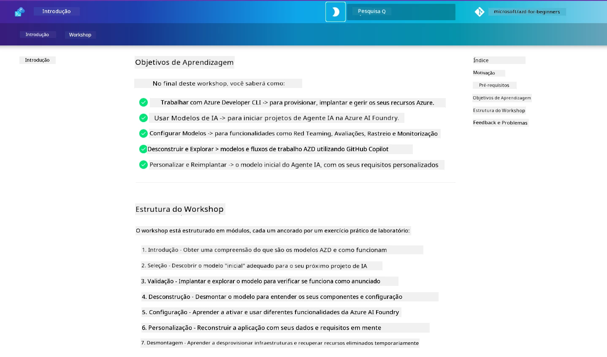

<div align="center">
  <div style="background: linear-gradient(135deg, #0078d4, #106ebe); border-radius: 10px; padding: 20px; margin: 20px 0; box-shadow: 0 4px 15px rgba(0, 120, 212, 0.3); border: 2px solid #005a9e;">
    <h2 style="color: white; margin: 0; font-size: 24px; text-shadow: 1px 1px 2px rgba(0,0,0,0.3);">
      🎯 Workshop AZD para Desenvolvedores de IA
    </h2>
    <p style="color: white; margin: 10px 0 0 0; font-size: 16px; text-shadow: 1px 1px 2px rgba(0,0,0,0.3);">
      <strong>Um workshop prático para construir aplicações de IA com Azure Developer CLI.</strong><br>
      Complete 7 módulos para dominar templates AZD e fluxos de trabalho de implementação de IA.
    </p>
    <div style="margin-top: 15px;">
      <span style="background: rgba(255,255,255,0.2); padding: 5px 10px; border-radius: 15px; color: white; font-size: 14px;">
        📅 Atualizado em: fevereiro de 2026
      </span>
    </div>
  </div>
</div>

# Workshop AZD para Desenvolvedores de IA

Bem-vindo ao workshop prático para aprender Azure Developer CLI (AZD) com foco na implementação de aplicações de IA. Este workshop ajuda-o a adquirir um entendimento aplicado dos templates AZD em 3 passos:

1. **Descoberta** - encontre o template certo para si.
1. **Implementação** - implemente e valide que funciona
1. **Personalização** - modifique e itere para o tornar seu!

Ao longo deste workshop, será também apresentado a ferramentas e fluxos de trabalho essenciais para desenvolvedores, que o ajudarão a simplificar a sua jornada de desenvolvimento de ponta a ponta.

<br/>

## Guia Baseado no Navegador

As lições do workshop estão em Markdown. Pode navegar nelas diretamente no GitHub — ou lançar uma pré-visualização baseada no navegador como mostrado na captura de ecrã abaixo.



Para usar esta opção — faça fork do repositório para o seu perfil e lance o GitHub Codespaces. Quando o terminal do VS Code estiver ativo, digite este comando:

```bash title="" linenums="0"
mkdocs serve > /dev/null 2>&1 &
```

Em poucos segundos, verá um diálogo pop-up. Selecione a opção `Abrir no navegador`. O guia web abrir-se-á numa nova aba do navegador. Alguns benefícios desta pré-visualização:

1. **Pesquisa incorporada** - encontre palavras-chave ou lições rapidamente.
1. **Ícone de copiar** - passe o cursor sobre blocos de código para ver esta opção
1. **Alternar tema** - alterne entre temas claro e escuro
1. **Obter ajuda** - clique no ícone do Discord no rodapé para participar!

<br/>

## Resumo do Workshop

**Duração:** 3-4 horas  
**Nível:** Iniciante a Intermédio  
**Pré-requisitos:** Familiaridade com Azure, conceitos de IA, VS Code e ferramentas de linha de comando.

Este é um workshop prático onde aprende fazendo. Após concluir os exercícios, recomendamos rever o currículo AZD Para Iniciantes para continuar a sua jornada de aprendizagem em Segurança e Melhores Práticas de Produtividade.

| Tempo| Módulo  | Objetivo |
|:---|:---|:---|
| 15 mins | [Introdução](docs/instructions/0-Introduction.md) | Preparar o terreno, compreender os objetivos |
| 30 mins | [Selecionar Template de IA](docs/instructions/1-Select-AI-Template.md) | Explorar opções e escolher um ponto de partida | 
| 30 mins | [Validar Template de IA](docs/instructions/2-Validate-AI-Template.md) | Implementar solução padrão no Azure |
| 30 mins | [Desconstruir Template de IA](docs/instructions/3-Deconstruct-AI-Template.md) | Explorar estrutura e configuração |
| 30 mins | [Configurar Template de IA](docs/instructions/4-Configure-AI-Template.md) | Ativar e experimentar funcionalidades disponíveis |
| 30 mins | [Personalizar Template de IA](docs/instructions/5-Customize-AI-Template.md) | Adaptar o template às suas necessidades |
| 30 mins | [Desmontar Infraestrutura](docs/instructions/6-Teardown-Infrastructure.md) | Limpeza e libertar recursos |
| 15 mins | [Conclusão & Próximos Passos](docs/instructions/7-Wrap-up.md) | Recursos de aprendizagem, desafio do workshop |

<br/>

## O que Vai Aprender

Pense no Template AZD como uma caixa de areia para aprender, para explorar várias capacidades e ferramentas para desenvolvimento completo na Microsoft Foundry. Ao terminar este workshop, deverá ter uma noção intuitiva sobre várias ferramentas e conceitos neste contexto.

| Conceito  | Objetivo |
|:---|:---|
| **Azure Developer CLI** | Compreender comandos e fluxos de trabalho da ferramenta |
| **Templates AZD**| Compreender estrutura do projeto e configuração |
| **Azure AI Agent**| Provisionar e implementar projeto Microsoft Foundry |
| **Azure AI Search**| Habilitar engenharia de contexto com agentes |
| **Observabilidade**| Explorar tracing, monitorização e avaliações |
| **Red Teaming**| Explorar testes adversariais e mitigação |

<br/>

## Estrutura do Workshop

O workshop está estruturado para o levar numa jornada desde a descoberta do template, à implementação, desconstrução e personalização — usando o template oficial [Getting Started with AI Agents](https://github.com/Azure-Samples/get-started-with-ai-agents) como base.

### [Módulo 1: Selecionar Template de IA](docs/instructions/1-Select-AI-Template.md) (30 mins)

- O que são Templates de IA?
- Onde posso encontrar Templates de IA?
- Como posso começar a construir Agentes de IA?
- **Laboratório**: Início rápido com GitHub Codespaces

### [Módulo 2: Validar Template de IA](docs/instructions/2-Validate-AI-Template.md) (30 mins)

- Qual é a arquitetura do Template de IA?
- Qual é o fluxo de trabalho de desenvolvimento AZD?
- Como posso obter ajuda com o desenvolvimento AZD?
- **Laboratório**: Implementar e validar template de Agentes de IA

### [Módulo 3: Desconstruir Template de IA](docs/instructions/3-Deconstruct-AI-Template.md) (30 mins)

- Explore o seu ambiente em `.azure/` 
- Explore a configuração dos seus recursos em `infra/` 
- Explore a configuração AZD nos `azure.yaml`
- **Laboratório**: Modificar variáveis de ambiente e redeploy

### [Módulo 4: Configurar Template de IA](docs/instructions/4-Configure-AI-Template.md) (30 mins)
- Explorar: Geração Aumentada por Recuperação
- Explorar: Avaliação de Agentes e Red Teaming
- Explorar: Tracing e Monitorização
- **Laboratório**: Explorar Agente de IA + Observabilidade

### [Módulo 5: Personalizar Template de IA](docs/instructions/5-Customize-AI-Template.md) (30 mins)
- Definir: PRD com requisitos de cenário
- Configurar: Variáveis de ambiente para AZD
- Implementar: Hooks de ciclo de vida para tarefas adicionais
- **Laboratório**: Personalizar template para o meu cenário

### [Módulo 6: Desmontar Infraestrutura](docs/instructions/6-Teardown-Infrastructure.md) (30 mins)
- Recapitular: O que são Templates AZD?
- Recapitular: Porque usar Azure Developer CLI?
- Próximos Passos: Experimente outro template!
- **Laboratório**: Desprovisionar infraestrutura e limpeza

<br/>

## Desafio do Workshop

Quer desafiar-se a ir mais longe? Aqui estão algumas sugestões de projetos — ou partilhe as suas ideias connosco!!

| Projeto | Descrição |
|:---|:---|
|1. **Desconstruir um Template Complexo de IA** | Use o fluxo de trabalho e as ferramentas que delineámos e veja se consegue implementar, validar e personalizar um template diferente de solução de IA. _O que aprendeu?_|
|2. **Personalizar com o Seu Cenário**  | Tente escrever um PRD (Documento de Requisitos do Produto) para um cenário diferente. Depois use o GitHub Copilot no seu repositório de template no Agent Model — e peça para gerar um fluxo de trabalho de personalização. _O que aprendeu? Como poderia melhorar estas sugestões?_|
| | |

## Tem feedback?

1. Abra uma issue neste repositório - marque-a com `Workshop` para facilitar.
1. Junte-se ao Discord Microsoft Foundry - conecte-se com os seus pares!

| | | 
|:---|:---|
| **📚 Página do Curso**| [AZD Para Iniciantes](../README.md)|
| **📖 Documentação** | [Começar com templates de IA](https://learn.microsoft.com/en-us/azure/ai-foundry/how-to/develop/ai-template-get-started)|
| **🛠️ Templates de IA** | [Templates Microsoft Foundry](https://ai.azure.com/templates) |
|**🚀 Próximos Passos** | [Iniciar Workshop](../../../workshop) |
| | |

<br/>

---

**Navegação:** [Curso Principal](../README.md) | [Introdução](docs/instructions/0-Introduction.md) | [Módulo 1: Selecionar Template](docs/instructions/1-Select-AI-Template.md)

**Pronto para começar a construir aplicações de IA com AZD?**

[Iniciar Workshop: Introdução →](docs/instructions/0-Introduction.md)

---

<!-- CO-OP TRANSLATOR DISCLAIMER START -->
**Aviso Legal**:  
Este documento foi traduzido utilizando o serviço de tradução automática [Co-op Translator](https://github.com/Azure/co-op-translator). Embora nos esforcemos por garantir a precisão, por favor tenha em conta que traduções automáticas podem conter erros ou imprecisões. O documento original, no seu idioma nativo, deve ser considerado a fonte autorizada. Para informação crítica, recomenda-se tradução profissional humana. Não nos responsabilizamos por quaisquer mal-entendidos ou interpretações incorretas decorrentes do uso desta tradução.
<!-- CO-OP TRANSLATOR DISCLAIMER END -->