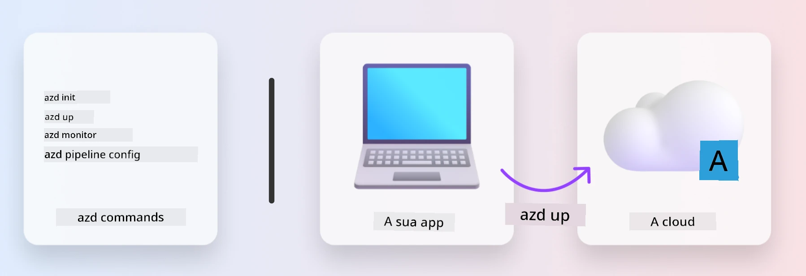
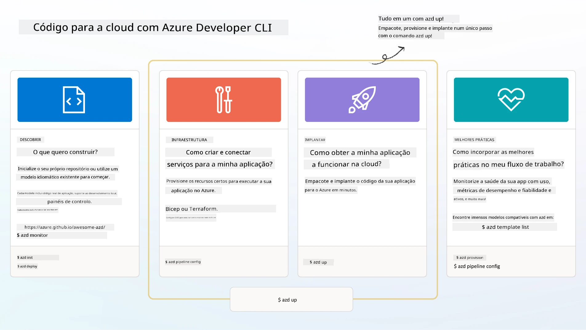

# 1. Selecionar um Modelo

!!! tip "NO FINAL DESTE MÓDULO VAI SER CAPAZ DE"

    - [ ] Descrever o que são os modelos AZD
    - [ ] Descobrir e usar modelos AZD para IA
    - [ ] Começar com o modelo de Agentes de IA
    - [ ] **Laboratório 1:** Início rápido com AZD no Codespaces ou num contentor de desenvolvimento

---

## 1. Uma Analogía do Construtor

Construir uma aplicação de IA moderna e preparada para empresas _do zero_ pode ser assustador. É um pouco como construir a sua nova casa sozinho, tijolo a tijolo. Sim, é possível! Mas não é a forma mais eficaz de obter o resultado final desejado!

Em vez disso, muitas vezes começamos com uma _planta de design_ existente, e trabalhamos com um arquiteto para a personalizar de acordo com os nossos requisitos pessoais. E é exatamente essa a abordagem a seguir quando se constroem aplicações inteligentes. Primeiro, encontre uma boa arquitetura de design que se adapte ao seu espaço de problema. Depois, trabalhe com um arquiteto de soluções para personalizar e desenvolver a solução para o seu cenário específico.

Mas onde podemos encontrar essas plantas de design? E como encontrar um arquiteto disposto a ensinar-nos a personalizar e implantar essas plantas por nossa conta? Neste workshop, respondemos a essas questões apresentando três tecnologias:

1. [Azure Developer CLI](https://aka.ms/azd) - uma ferramenta open-source que acelera o caminho do desenvolvedor do desenvolvimento local (build) até à implantação na cloud (ship).
1. [Modelos Microsoft Foundry](https://ai.azure.com/templates) - repositórios open-source padronizados que contêm código de exemplo, infraestrutura e ficheiros de configuração para implantar uma arquitetura de solução de IA.
1. [Modo Agente GitHub Copilot](https://code.visualstudio.com/docs/copilot/chat/chat-agent-mode) - um agente de codificação baseado no conhecimento Azure, que pode guiar-nos na navegação pela base de código e na realização de alterações - usando linguagem natural.

Com estas ferramentas em mãos, podemos agora _descobrir_ o modelo certo, _implantar_ para validar que funciona, e _personalizar_ para adequar ao nosso cenário específico. Vamos explorar e aprender como funcionam.

---

## 2. Azure Developer CLI

A [Azure Developer CLI](https://learn.microsoft.com/en-us/azure/developer/azure-developer-cli/) (ou `azd`) é uma ferramenta de linha de comandos open-source que pode acelerar a sua jornada de código para cloud com um conjunto de comandos amigáveis para desenvolvedores que funcionam de forma consistente no seu IDE (desenvolvimento) e nos ambientes CI/CD (devops).

Com `azd`, a sua jornada de implantação pode ser tão simples como:

- `azd init` - Inicializa um novo projeto de IA a partir de um modelo AZD existente.
- `azd up` - Providencia infraestrutura e implanta a sua aplicação num único passo.
- `azd monitor` - Obtenha monitorização em tempo real e diagnósticos para a sua aplicação implantada.
- `azd pipeline config` - Configure pipelines CI/CD para automatizar a implantação no Azure.

**🎯 | EXERCÍCIO**: <br/> Explore a ferramenta de linha de comandos `azd` no seu ambiente atual do workshop agora. Pode ser no GitHub Codespaces, num contentor dev, ou um clone local com os pré-requisitos instalados. Comece por escrever este comando para ver o que a ferramenta pode fazer:

```bash title="" linenums="0"
azd help
```



---

## 3. O Modelo AZD

Para que o `azd` consiga isto, precisa de saber qual a infraestrutura a providenciar, quais as configurações a impor, e qual a aplicação a implantar. É aqui que entram os [modelos AZD](https://learn.microsoft.com/en-us/azure/developer/azure-developer-cli/azd-templates?tabs=csharp).

Os modelos AZD são repositórios open-source que combinam código de exemplo com ficheiros de infraestrutura e configuração necessários para a implantação da arquitetura da solução.
Ao usar uma abordagem de _Infraestrutura como Código_ (IaC), estes permitem que as definições dos recursos do modelo e configurações sejam controladas por versão (tal como o código fonte da app) - criando fluxos de trabalho reutilizáveis e consistentes entre os utilizadores desse projeto.

Ao criar ou reutilizar um modelo AZD para _seu_ cenário, considere estas questões:

1. O que está a construir? → Existe um modelo que contenha código inicial para esse cenário?
1. Como está arquitetada a sua solução? → Existe um modelo que possua os recursos necessários?
1. Como é que a sua solução é implantada? → Pense em `azd deploy` com hooks de pré/pós-processamento!
1. Como pode otimizar ainda mais? → Pense em monitorização incorporada e pipelines de automação!

**🎯 | EXERCÍCIO**: <br/> 
Visite a galeria [Awesome AZD](https://azure.github.io/awesome-azd/) e use os filtros para explorar os mais de 250 modelos atualmente disponíveis. Veja se encontra algum que se alinhe com os requisitos do _seu_ cenário.



---

## 4. Modelos de Aplicações de IA

Para aplicações alimentadas por IA, a Microsoft fornece modelos especializados com **Microsoft Foundry** e **Foundry Agents**. Estes modelos aceleram o seu caminho para construir aplicações inteligentes e prontas para produção.

### Modelos Microsoft Foundry & Foundry Agents

Selecione um modelo abaixo para implantar. Cada modelo está disponível em [Awesome AZD](https://azure.github.io/awesome-azd/) e pode ser inicializado com um único comando.

| Modelo | Descrição | Comando de Implantação |
|----------|-------------|----------------|
| **[AI Chat com RAG](https://azure.github.io/awesome-azd/?tags=ai&tags=rag)** | Aplicação de chat com Geração Aumentada por Recuperação usando Microsoft Foundry | `azd init -t azure-samples/azure-search-openai-demo` |
| **[Foundry Agent Service Starter](https://azure.github.io/awesome-azd/?tags=ai&tags=agents)** | Construir agentes de IA com Foundry Agents para execução autónoma de tarefas | `azd init -t azure-samples/foundry-agent-service-starter` |
| **[Orquestração Multi-Agente](https://azure.github.io/awesome-azd/?tags=ai&tags=agents)** | Coordenar múltiplos Foundry Agents para fluxos de trabalho complexos | `azd init -t azure-samples/multi-agent-orchestration` |
| **[Inteligência de Documentos IA](https://azure.github.io/awesome-azd/?tags=ai&tags=document)** | Extrair e analisar documentos com modelos Microsoft Foundry | `azd init -t azure-samples/ai-document-processing` |
| **[Bot de IA Conversacional](https://azure.github.io/awesome-azd/?tags=ai&tags=bot)** | Construir chatbots inteligentes com integração Microsoft Foundry | `azd init -t azure-samples/ai-chat-protocol` |
| **[Geração de Imagens IA](https://azure.github.io/awesome-azd/?tags=ai&tags=dalle)** | Gerar imagens usando DALL-E via Microsoft Foundry | `azd init -t azure-samples/ai-image-generation` |
| **[Agente Semantic Kernel](https://azure.github.io/awesome-azd/?tags=ai&tags=semantic-kernel)** | Agentes IA usando Semantic Kernel com Foundry Agents | `azd init -t azure-samples/semantic-kernel-agent` |
| **[AutoGen Multi-Agente](https://azure.github.io/awesome-azd/?tags=ai&tags=autogen)** | Sistemas multi-agentes usando o framework AutoGen | `azd init -t azure-samples/autogen-multi-agent` |

### Início Rápido

1. **Navegar pelos modelos**: Visite [https://azure.github.io/awesome-azd/](https://azure.github.io/awesome-azd/) e filtre por `AI`, `Agents` ou `Microsoft Foundry`
2. **Selecionar o seu modelo**: Escolha um que corresponda ao seu caso de uso
3. **Inicializar**: Execute o comando `azd init` para o modelo escolhido
4. **Implantar**: Execute `azd up` para providenciar e implantar

**🎯 | EXERCÍCIO**: <br/>
Selecione um dos modelos acima conforme o seu cenário:

- **A construir um chatbot?** → Comece com **AI Chat com RAG** ou **Bot de IA Conversacional**
- **Precisa de agentes autónomos?** → Experimente **Foundry Agent Service Starter** ou **Orquestração Multi-Agente**
- **A processar documentos?** → Use **Inteligência de Documentos IA**
- **Quer assistência de codificação com IA?** → Explore **Agente Semantic Kernel** ou **AutoGen Multi-Agente**

```bash title="Example: Deploy the AI Chat with RAG template" linenums="0"
azd init -t azure-samples/azure-search-openai-demo
azd up
```

!!! info "Explore Mais Modelos"
    A [Galeria Awesome AZD](https://azure.github.io/awesome-azd/) contém mais de 250 modelos. Use os filtros para encontrar modelos que correspondam aos seus requisitos específicos de linguagem, framework e serviços Azure.

---

<!-- CO-OP TRANSLATOR DISCLAIMER START -->
**Aviso Legal**:  
Este documento foi traduzido utilizando o serviço de tradução automática [Co-op Translator](https://github.com/Azure/co-op-translator). Embora nos esforcemos pela precisão, por favor esteja ciente de que traduções automáticas podem conter erros ou imprecisões. O documento original, na sua língua nativa, deve ser considerado a fonte autoritativa. Para informações críticas, recomenda-se a tradução profissional humana. Não nos responsabilizamos por quaisquer mal-entendidos ou interpretações erradas decorrentes do uso desta tradução.
<!-- CO-OP TRANSLATOR DISCLAIMER END -->