# 2. Validar um Template

> Validado contra `azd 1.23.12` em março de 2026.

!!! tip "NO FINAL DESTE MÓDULO IRÁ CONSEGUIR"

    - [ ] Analisar a Arquitetura da Solução de IA
    - [ ] Compreender o Fluxo de Trabalho de Deployment do AZD
    - [ ] Usar o GitHub Copilot para obter ajuda na utilização do AZD
    - [ ] **Lab 2:** Deploy & Validar o template AI Agents

---


## 1. Introdução

O [Azure Developer CLI](https://learn.microsoft.com/en-us/azure/developer/azure-developer-cli/) ou `azd` é uma ferramenta de linha de comandos open-source que simplifica o fluxo de trabalho do programador ao construir e deployar aplicações no Azure. 

[Templates AZD](https://learn.microsoft.com/azure/developer/azure-developer-cli/azd-templates) são repositórios padronizados que incluem código de aplicação de exemplo, ativos de _infraestrutura-como-código_ e ficheiros de configuração do `azd` para uma arquitetura de solução coerente. O provisionamento da infraestrutura torna-se tão simples quanto o comando `azd provision` - enquanto usar `azd up` permite-lhe provisionar a infraestrutura **e** deployar a sua aplicação em uma só operação!

Como resultado, iniciar o seu processo de desenvolvimento de aplicações pode ser tão simples como encontrar o template AZD Starter certo que mais se aproxime das suas necessidades de aplicação e infraestrutura - depois personalizar o repositório para se adequar aos requisitos do seu cenário.

Antes de começar, vamos garantir que tem o Azure Developer CLI instalado.

1. Abra um terminal do VS Code e digite este comando:

      ```bash title="" linenums="0"
      azd version
      ```

1. Deverá ver algo como isto!

      ```bash title="" linenums="0"
      azd version 1.23.12 (commit <current-build>)
      ```

**Agora está pronto para selecionar e deployar um template com azd**

---

## 2. Seleção do Template

A plataforma Microsoft Foundry vem com um [conjunto de templates AZD recomendados](https://learn.microsoft.com/en-us/azure/ai-foundry/how-to/develop/ai-template-get-started) que cobrem cenários populares de solução como _automação de workflows multi-agente_ e _processamento multimodal de conteúdo_. Também pode descobrir estes templates visitando o portal Microsoft Foundry.

1. Visite [https://ai.azure.com/templates](https://ai.azure.com/templates)
1. Inicie sessão no portal Microsoft Foundry quando solicitado - verá algo assim.

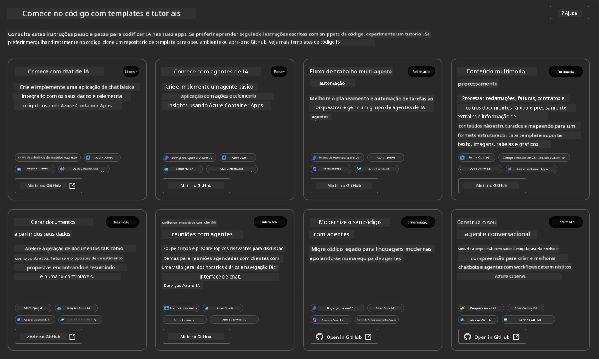


As opções **Basic** são os seus templates de início:

1. [ ] [Começar com AI Chat](https://github.com/Azure-Samples/get-started-with-ai-chat) que deploya uma aplicação básica de chat _com os seus dados_ para Azure Container Apps. Utilize isto para explorar um cenário básico de chatbot de IA.
1. [X] [Começar com AI Agents](https://github.com/Azure-Samples/get-started-with-ai-agents) que também deploya um Agente AI padrão (com os Foundry Agents). Use isto para se familiarizar com soluções de IA agenticas envolvendo ferramentas e modelos.

Visite o segundo link numa nova aba do navegador (ou clique em `Open in GitHub` para o cartão relacionado). Deverá ver o repositório para este Template AZD. Tire um momento para explorar o README. A arquitetura da aplicação é assim:

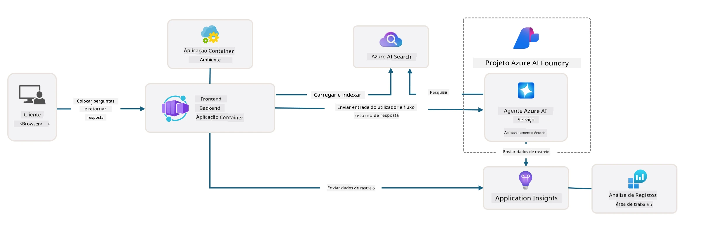

---

## 3. Ativação do Template

Vamos tentar deployar este template e garantir que é válido. Seguiremos as diretrizes na secção [Getting Started](https://github.com/Azure-Samples/get-started-with-ai-agents?tab=readme-ov-file#getting-started).

1. Escolha um ambiente de trabalho para o repositório do template:

      - **GitHub Codespaces**: Clique [neste link](https://github.com/codespaces/new/Azure-Samples/get-started-with-ai-agents) e confirme `Create codespace`
      - **Clone local ou contentor de desenvolvimento**: Clone `Azure-Samples/get-started-with-ai-agents` e abra-o no VS Code

1. Aguarde até o terminal do VS Code estar pronto, depois digite o seguinte comando:

   ```bash title="" linenums="0"
   azd up
   ```

Complete as etapas do workflow que isto irá disparar:

1. Será solicitado que faça login no Azure - siga as instruções para autenticar
1. Introduza um nome de ambiente único para si - p.ex., usei `nitya-mshack-azd`
1. Isto criará uma pasta `.azure/` - verá uma subpasta com o nome do ambiente
1. Será solicitado para selecionar um nome de subscrição - selecione o padrão
1. Será solicitado por uma localização - use `East US 2`

Agora, aguarde a conclusão do provisionamento. **Isto demora 10-15 minutos**

1. Quando terminar, o seu console exibirá uma mensagem de SUCESSO assim:
      ```bash title="" linenums="0"
      SUCCESS: Your up workflow to provision and deploy to Azure completed in 10 minutes 17 seconds.
      ```
1. O seu Portal Azure terá agora um grupo de recursos provisionado com esse nome de ambiente:

      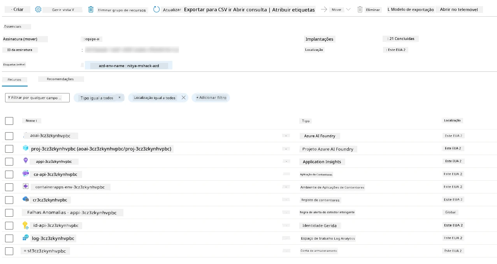

1. **Está agora pronto para validar a infraestrutura e aplicação deployadas**.

---

## 4. Validação do Template

1. Visite a página [Resource Groups](https://portal.azure.com/#browse/resourcegroups) no Azure Portal - faça login quando solicitado
1. Clique no RG com o nome do seu ambiente - verá a página acima

      - clique no recurso Azure Container Apps
      - clique no Application Url na secção _Essentials_ (canto superior direito)

1. Deverá ver uma UI da aplicação front-end hospedada assim:

   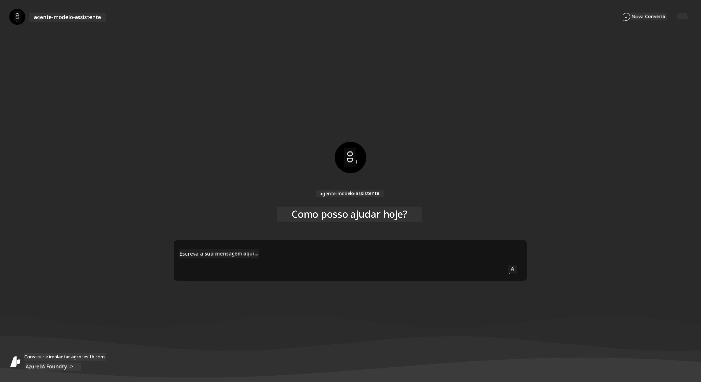

1. Experimente colocar algumas [perguntas de exemplo](https://github.com/Azure-Samples/get-started-with-ai-agents/blob/main/docs/sample_questions.md)

      1. Pergunte: ```Qual é a capital de França?``` 
      1. Pergunte: ```Qual é a melhor tenda abaixo de $200 para duas pessoas, e que características ela inclui?```

1. Deverá obter respostas semelhantes às mostradas abaixo. _Mas como é que isto funciona?_ 

      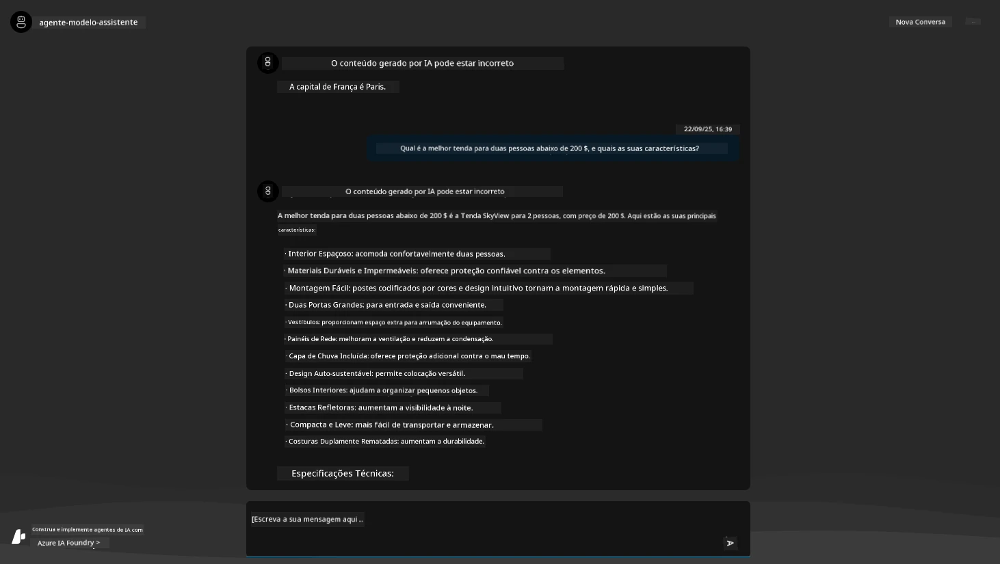

---

## 5. Validação do Agente

A Azure Container App deploya um endpoint que se liga ao Agente de IA provisionado no projeto Microsoft Foundry para este template. Vamos ver o que isso significa.

1. Volte à página de _Overview_ do Azure Portal para o seu grupo de recursos

1. Clique no recurso `Microsoft Foundry` nessa lista

1. Deverá ver isto. Clique no botão `Go to Microsoft Foundry Portal`. 
   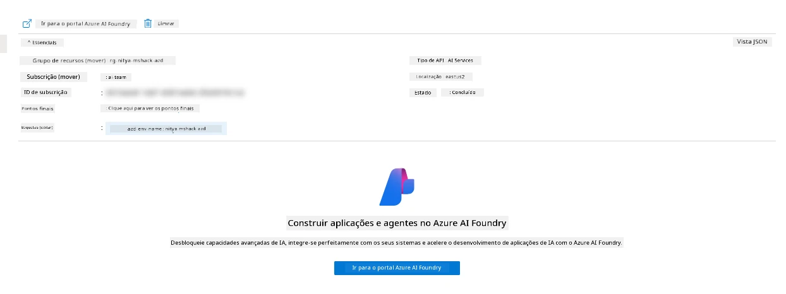

1. Deverá ver a página do Projeto Foundry para a sua aplicação de IA
   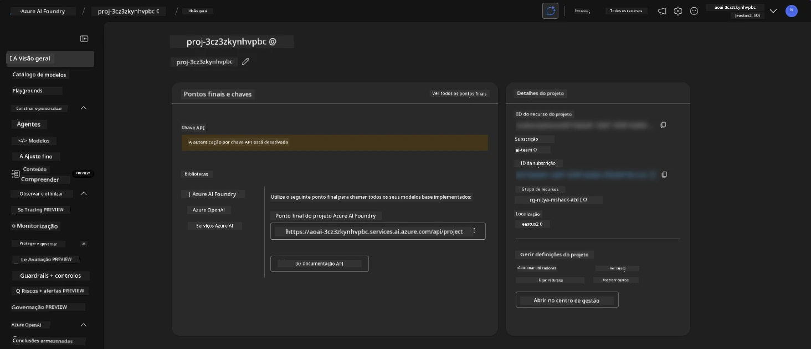

1. Clique em `Agents` - verá o Agente padrão provisionado no seu projeto
   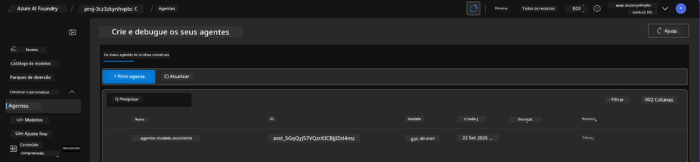

1. Selecione-o - verá os detalhes do Agente. Note o seguinte:

      - O agente usa File Search por defeito (sempre)
      - O `Knowledge` do agente indica que tem 32 ficheiros carregados (para pesquisa de ficheiros)
      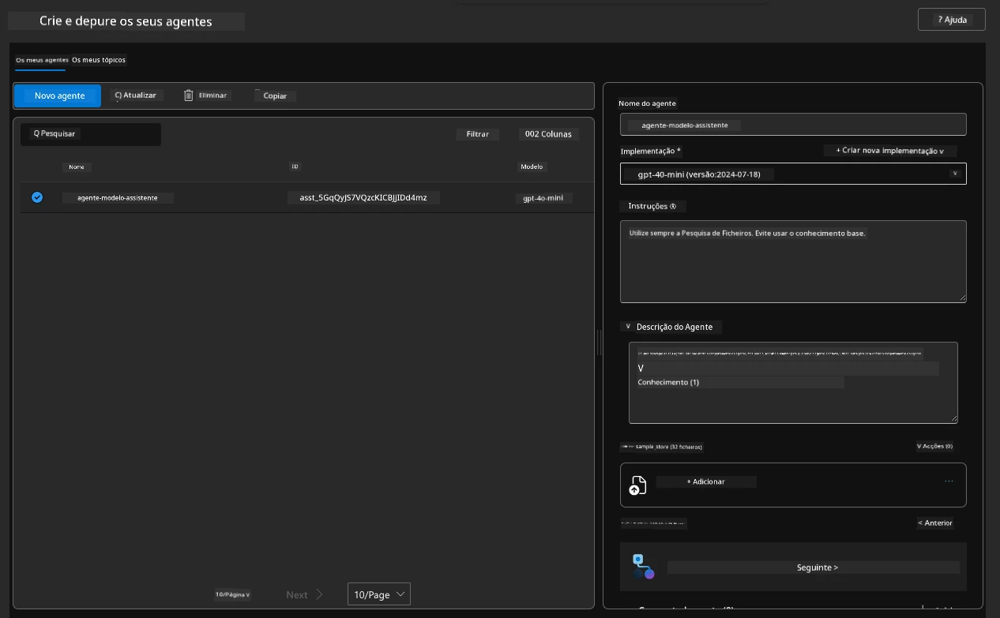

1. Procure a opção `Data+indexes` no menu à esquerda e clique para detalhes. 

      - Deverá ver os 32 ficheiros de dados carregados para conhecimento.
      - Estes corresponderão aos 12 ficheiros de clientes e 20 ficheiros de produtos na pasta `src/files` 
      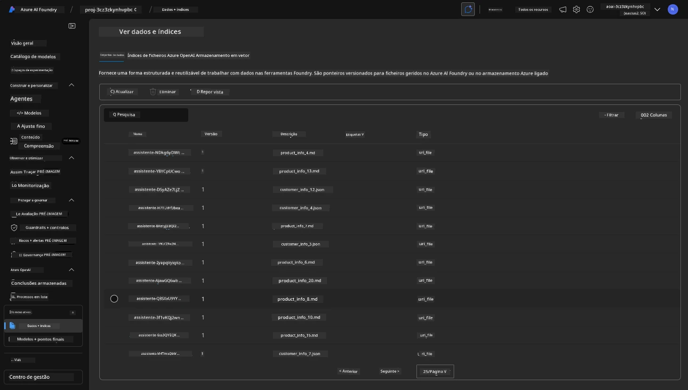

**Validou a operação do Agente!** 

1. As respostas do agente estão fundamentadas no conhecimento desses ficheiros. 
1. Pode agora colocar perguntas relacionadas com esses dados e obter respostas fundamentadas.
1. Exemplo: `customer_info_10.json` descreve as 3 compras feitas pela "Amanda Perez"

Volte à aba do navegador com o endpoint da Container App e pergunte: `Que produtos tem Amanda Perez?`. Deverá ver algo assim:

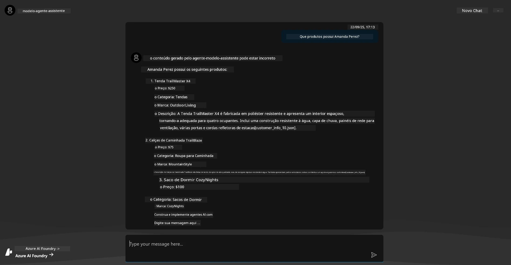

---

## 6. Playground do Agente

Vamos construir um pouco mais de intuição sobre as capacidades do Microsoft Foundry, testando o Agente no Agents Playground. 

1. Volte à página `Agents` no Microsoft Foundry - selecione o agente padrão
1. Clique na opção `Try in Playground` - deverá obter uma UI do Playground assim
1. Pergunte a mesma pergunta: `Que produtos tem Amanda Perez?`

    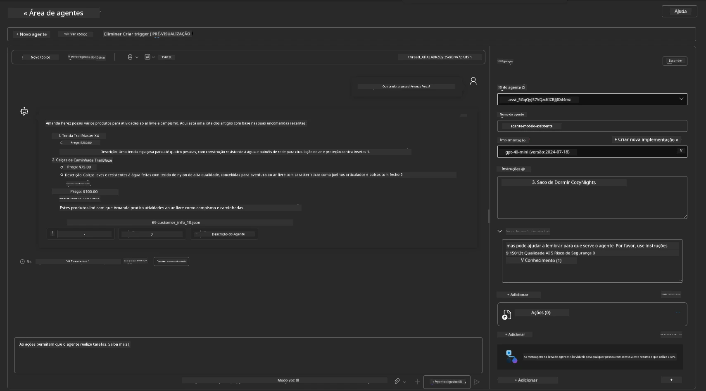

Obtém a mesma resposta (ou semelhante) - mas também recebe informação adicional que pode usar para entender a qualidade, custo e desempenho da sua aplicação agentica. Por exemplo:

1. Note que a resposta cita os ficheiros de dados usados para "fundamentar" a resposta
1. Passe o cursor sobre quaisquer destes rótulos de ficheiros - os dados correspondem à sua questão e resposta exibida?

Também verá uma linha de _estatísticas_ abaixo da resposta. 

1. Passe o cursor sobre qualquer métrica - p.ex., Segurança. Vê algo assim
1. A classificação avaliada corresponde à sua intuição para o nível de segurança da resposta?

      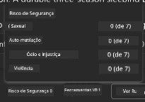

---

## 7. Observabilidade incorporada

Observabilidade trata do processo de instrumentar a sua aplicação para gerar dados que podem ser usados para entender, debugar e otimizar as suas operações. Para ter uma noção disso:

1. Clique no botão `View Run Info` - deverá ver esta vista. Este é um exemplo de [Agente a tracar ações](https://learn.microsoft.com/en-us/azure/ai-foundry/how-to/develop/trace-agents-sdk#view-trace-results-in-the-azure-ai-foundry-agents-playground) em ação. _Também pode obter esta vista clicando em Thread Logs no menu superior_.

   - Perceba os passos da execução e ferramentas ativadas pelo agente
   - Compreenda o total de tokens usados (vs. tokens de output) para a resposta
   - Entenda a latência e onde o tempo está a ser gasto na execução

      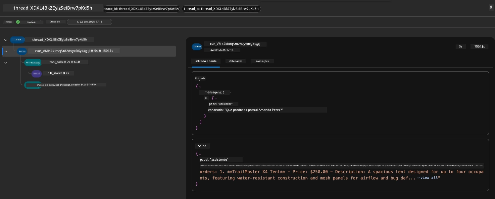

1. Clique na aba `Metadata` para ver atributos adicionais da execução, que podem fornecer contexto útil para futuras depurações.   

      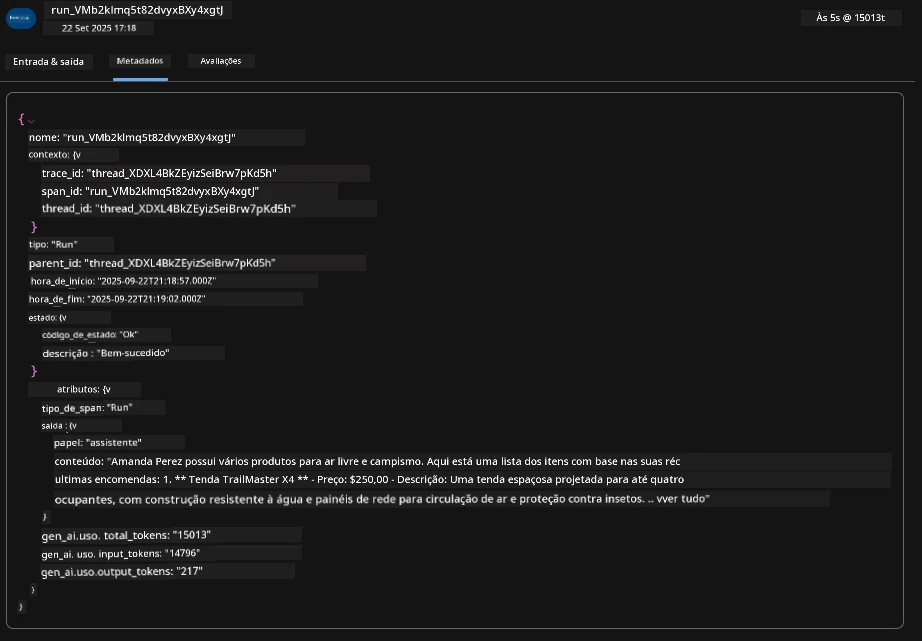


1. Clique na aba `Evaluations` para ver auto-avaliações feitas sobre a resposta do agente. Estas incluem avaliações de segurança (p.ex., Auto-dano) e avaliações específicas do agente (p.ex., Resolução de intenção, Adesão à tarefa).

      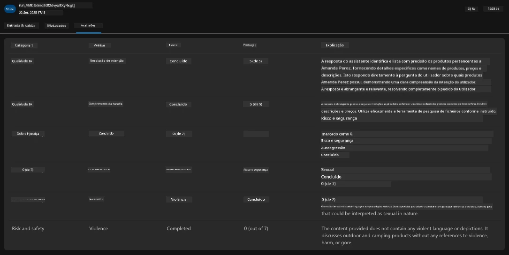

1. Por fim, clique na aba `Monitoring` no menu lateral.

      - Selecione a aba `Resource usage` na página exibida - e veja as métricas.
      - Acompanhe o uso da aplicação em termos de custos (tokens) e carga (requests).
      - Acompanhe a latência da aplicação para o primeiro byte (processamento de input) e último byte (output).

      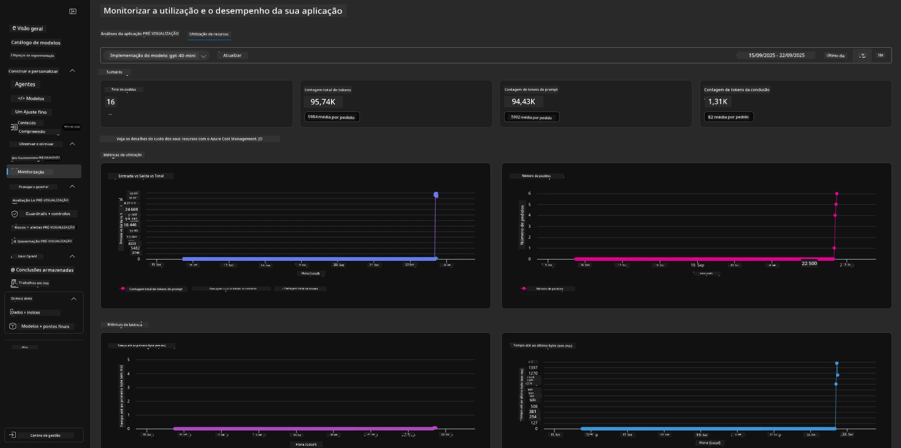

---

## 8. Variáveis de Ambiente

Até agora, percorremos o deployment no navegador - e validámos que a nossa infraestrutura está provisionada e a aplicação está operacional. Mas para trabalhar com o código da aplicação _first-code_, precisamos de configurar o nosso ambiente de desenvolvimento local com as variáveis relevantes exigidas para trabalhar com esses recursos. Usar `azd` torna isto fácil.

1. O Azure Developer CLI [usa variáveis de ambiente](https://learn.microsoft.com/en-us/azure/developer/azure-developer-cli/manage-environment-variables?tabs=bash) para armazenar e gerir as definições de configuração das aplicações deployadas.

1. As variáveis de ambiente são armazenadas em `.azure/<env-name>/.env` - isto escopo para o ambiente `env-name` usado durante o deployment e ajuda a isolar ambientes entre diferentes destinos de deployment no mesmo repositório.

1. As variáveis de ambiente são automaticamente carregadas pelo comando `azd` sempre que executa um comando específico (p.ex., `azd up`). Note que o `azd` não lê automaticamente variáveis de ambiente ao nível do SO (p.ex., definidas na shell) - use em vez disso `azd set env` e `azd get env` para transferir informação dentro de scripts.


Vamos experimentar alguns comandos:

1. Obter todas as variáveis de ambiente definidas para o `azd` neste ambiente:

      ```bash title="" linenums="0"
      azd env get-values
      ```
      
      Vê algo assim:

      ```bash title="" linenums="0"
      AZURE_AI_AGENT_DEPLOYMENT_NAME="gpt-4.1-mini"
      AZURE_AI_AGENT_NAME="agent-template-assistant"
      AZURE_AI_EMBED_DEPLOYMENT_NAME="text-embedding-3-small"
      AZURE_AI_EMBED_DIMENSIONS=100
      ...
      ```

1. Obter um valor específico - p.ex., quero saber se definimos o valor `AZURE_AI_AGENT_MODEL_NAME`

      ```bash title="" linenums="0"
      azd env get-value AZURE_AI_AGENT_MODEL_NAME 
      ```
      
      Vê algo assim - não foi definido por defeito!

      ```bash title="" linenums="0"
      ERROR: key 'AZURE_AI_AGENT_MODEL_NAME' not found in the environment values
      ```

1. Definir uma nova variável de ambiente para o `azd`. Aqui, atualizamos o nome do modelo do agente. _Nota: quaisquer alterações feitas serão imediatamente refletidas no ficheiro `.azure/<env-name>/.env`.

      ```bash title="" linenums="0"
      azd env set AZURE_AI_AGENT_MODEL_NAME gpt-4.1
      azd env set AZURE_AI_AGENT_MODEL_VERSION 2025-04-14
      azd env set AZURE_AI_AGENT_DEPLOYMENT_CAPACITY 150
      ```

      Agora, deverá encontrar o valor definido:

      ```bash title="" linenums="0"
      azd env get-value AZURE_AI_AGENT_MODEL_NAME 
      ```

1. Note que alguns recursos são persistentes (p.ex., deployments de modelos) e vão requerer mais do que um simples `azd up` para forçar o redeployment. Vamos tentar desmontar o deployment original e redeployar com as variáveis de ambiente alteradas.

1. **Refresh** Se já tinha deployado infraestrutura usando um template azd antes - pode _atualizar_ o estado das suas variáveis de ambiente locais com base no estado atual do seu deployment Azure usando este comando:

      ```bash title="" linenums="0"
      azd env refresh
      ```

      Esta é uma forma poderosa de _sincronizar_ variáveis de ambiente entre dois ou mais ambientes de desenvolvimento locais (por exemplo, uma equipa com vários programadores) - permitindo que a infraestrutura implementada sirva como a verdade fundamental para o estado das variáveis de ambiente. Os membros da equipa simplesmente _atualizam_ as variáveis para voltarem a estar sincronizados.

---

## 9. Parabéns 🏆

Acabou de completar um fluxo de trabalho de ponta a ponta onde você:

- [X] Selecionou o Modelo AZD que Quer Usar
- [X] Abriu o modelo num ambiente de desenvolvimento suportado
- [X] Implementou o Modelo e validou que funciona

---

<!-- CO-OP TRANSLATOR DISCLAIMER START -->
**Aviso**:  
Este documento foi traduzido utilizando o serviço de tradução automática [Co-op Translator](https://github.com/Azure/co-op-translator). Embora nos esforcemos para garantir a precisão, por favor, tenha em consideração que as traduções automáticas podem conter erros ou imprecisões. O documento original na sua língua nativa deve ser considerado a fonte oficial. Para informações críticas, recomenda-se a tradução profissional realizada por humanos. Não nos responsabilizamos por quaisquer mal-entendidos ou interpretações incorretas decorrentes da utilização desta tradução.
<!-- CO-OP TRANSLATOR DISCLAIMER END -->