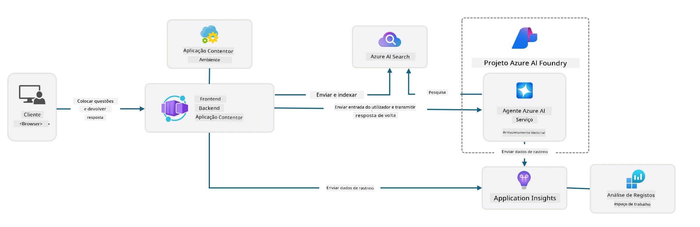

# 3. Desconstruir um Template

!!! tip "NO FINAL DESTE MÓDULO SERÁS CAPAZ DE"

    - [ ] Ativar o GitHub Copilot com servidores MCP para assistência Azure
    - [ ] Perceber a estrutura de pastas e componentes do template AZD
    - [ ] Explorar padrões de organização de infraestrutura-como-código (Bicep)
    - [ ] **Lab 3:** Usar o GitHub Copilot para explorar e compreender a arquitetura do repositório

---


Com templates AZD e a Azure Developer CLI (`azd`) podemos iniciar rapidamente a nossa jornada de desenvolvimento AI com repositórios padronizados que fornecem código exemplo, infraestrutura e ficheiros de configuração – na forma de um projeto _starter_ pronto a implantar.

**Mas agora, precisamos de compreender a estrutura do projeto e a base de código – e ser capazes de personalizar o template AZD – sem qualquer experiência prévia ou compreensão do AZD!**

---

## 1. Ativar o GitHub Copilot

### 1.1 Instalar o GitHub Copilot Chat

É hora de explorar o [GitHub Copilot com Modo Agente](https://code.visualstudio.com/docs/copilot/chat/chat-agent-mode). Agora, podemos usar linguagem natural para descrever a nossa tarefa numa visão geral e obter assistência na execução. Para este laboratório, usaremos o [plano gratuito do Copilot](https://github.com/github-copilot/signup) que tem um limite mensal para conclusões e interações de chat.

A extensão pode ser instalada a partir do marketplace e frequentemente já está disponível em Codespaces ou ambientes de dev container. _Clique em `Open Chat` no menu suspenso do ícone do Copilot – e escreva um prompt como `What can you do?`_ – poderá ser solicitado que inicies sessão. **O GitHub Copilot Chat está pronto**.

### 1.2. Instalar Servidores MCP

Para que o modo Agente seja eficaz, precisa de acesso às ferramentas certas para ajudar a recuperar conhecimento ou executar ações. É aqui que os servidores MCP podem ajudar. Vamos configurar os seguintes servidores:

1. [Servidor Azure MCP](../../../../../workshop/docs/instructions)
1. [Servidor Microsoft Docs MCP](../../../../../workshop/docs/instructions)

Para ativar estes:

1. Cria um ficheiro chamado `.vscode/mcp.json` se não existir
1. Copia o seguinte para esse ficheiro – e inicia os servidores!
   ```json title=".vscode/mcp.json"
   {
      "servers": {
         "Azure MCP Server": {
            "command": "npx",
            "args": [
            "-y",
            "@azure/mcp@latest",
            "server",
            "start"
            ]
         },
         "microsoft.docs.mcp": {
            "type": "http",
            "url": "https://learn.microsoft.com/api/mcp"
         }
      }
   }
   ```

??? warning "Poderá receber um erro de que o `npx` não está instalado (clicar para expandir a solução)"

      Para resolver, abre o ficheiro `.devcontainer/devcontainer.json` e adiciona esta linha na secção features. Depois reconstrói o container. Agora deverás ter o `npx` instalado.

      ```title="" linenums="0"
         "features": {
            "ghcr.io/devcontainers/features/node:1": {},
            ...
         },
      ```

---

### 1.3. Testar o GitHub Copilot Chat

**Usa primeiro `azd auth login` para autenticar-te no Azure a partir da linha de comandos do VS Code. Usa também `az login` somente se planeares executar comandos Azure CLI diretamente.**

Agora deverás conseguir consultar o estado da tua subscrição Azure e fazer perguntas sobre recursos implantados ou configurações. Experimenta estes prompts:

1. `List my Azure resource groups`
1. `#foundry list my current deployments`

Também podes colocar perguntas sobre documentação Azure e obter respostas baseadas no servidor MCP da Microsoft Docs. Experimenta estes prompts:

1. `#microsoft_docs_search What is Azure Developer CLI?`
1. `#microsoft_docs_search Show me a Python tutorial to chat with deployed model`

Ou podes pedir fragmentos de código para completar uma tarefa. Experimenta este prompt:

1. `Give me a Python code example that uses AAD for an interactive chat client`

No modo `Ask`, isto fornecerá código que podes copiar e testar. No modo `Agent`, pode ir além e criar os recursos relevantes para ti – incluindo scripts de configuração e documentação – para ajudar-te a executar essa tarefa.

**Estás agora preparado para começar a explorar o repositório do template**

---

## 2. Desconstruir a Arquitetura

??? prompt "PERGUNTA: Explica a arquitetura da aplicação em docs/images/architecture.png em 1 parágrafo"

      Esta aplicação é uma aplicação de chat impulsionada por IA construída no Azure que demonstra uma arquitetura moderna baseada em agentes. A solução centra-se numa Azure Container App que aloja o código principal da aplicação, que processa a entrada do utilizador e gera respostas inteligentes através de um agente de IA.
      
      A arquitetura aproveita o Microsoft Foundry Project como base para capacidades de IA, ligando-se aos Serviços Azure AI que fornecem os modelos de linguagem subjacentes (como o gpt-4.1-mini) e funcionalidade de agente.
      
      As interações dos utilizadores fluem através de uma frontend baseada em React para um backend FastAPI que comunica com o serviço de agente AI para gerar respostas contextuais.
      
      O sistema incorpora capacidades de recuperação de conhecimento quer por pesquisa de ficheiros ou pelo serviço Azure AI Search, permitindo ao agente aceder e citar informações de documentos carregados.
      
      Para excelência operacional, a arquitetura inclui monitorização abrangente através do Application Insights e Log Analytics Workspace para rastreamento, registo e otimização de desempenho.
      
      O Azure Storage fornece armazenamento blob para dados da aplicação e upload de ficheiros, enquanto o Managed Identity garante acesso seguro entre recursos Azure sem armazenar credenciais.
      
      Toda a solução é concebida para escalabilidade e manutenção, com a aplicação conteinerizada a escalar automaticamente conforme a procura, ao mesmo tempo que proporciona segurança, monitorização e capacidades CI/CD integradas através do ecossistema de serviços geridos do Azure.



---

## 3. Estrutura do Repositório

!!! prompt "PERGUNTA: Explica a estrutura de pastas do template. Começa com um diagrama hierárquico visual."

??? info "RESPOSTA: Diagrama Hierárquico Visual"

      ```bash title="" 
      get-started-with-ai-agents/
      ├── 📋 Configuration & Setup
      │   ├── azure.yaml                    # Configuração da Azure Developer CLI
      │   ├── docker-compose.yaml           # Containers para desenvolvimento local
      │   ├── pyproject.toml                # Configuração do projeto Python
      │   ├── requirements-dev.txt          # Dependências de desenvolvimento
      │   └── .devcontainer/                # Configuração do dev container para VS Code
      │
      ├── 🏗️ Infrastructure (infra/)
      │   ├── main.bicep                    # Template principal de infraestrutura
      │   ├── api.bicep                     # Recursos específicos da API
      │   ├── main.parameters.json          # Parâmetros da infraestrutura
      │   └── core/                         # Componentes modulares de infraestrutura
      │       ├── ai/                       # Configurações de serviços AI
      │       ├── host/                     # Infraestrutura de hospedagem
      │       ├── monitor/                  # Monitorização e logging
      │       ├── search/                   # Configuração Azure AI Search
      │       ├── security/                 # Segurança e identidade
      │       └── storage/                  # Configurações de conta de armazenamento
      │
      ├── 💻 Application Source (src/)
      │   ├── api/                          # API backend
      │   │   ├── main.py                   # Entrada da aplicação FastAPI
      │   │   ├── routes.py                 # Definições das rotas da API
      │   │   ├── search_index_manager.py   # Funcionalidade de pesquisa
      │   │   ├── data/                     # Manipulação de dados da API
      │   │   ├── static/                   # Recursos estáticos web
      │   │   └── templates/                # Templates HTML
      │   ├── frontend/                     # Frontend React/TypeScript
      │   │   ├── package.json              # Dependências Node.js
      │   │   ├── vite.config.ts            # Configuração de build Vite
      │   │   └── src/                      # Código fonte do frontend
      │   ├── data/                         # Ficheiros de dados de exemplo
      │   │   └── embeddings.csv            # Embeddings pré-computados
      │   ├── files/                        # Ficheiros da base de conhecimento
      │   │   ├── customer_info_*.json      # Exemplos de dados de clientes
      │   │   └── product_info_*.md         # Documentação de produtos
      │   ├── Dockerfile                    # Configuração do container
      │   └── requirements.txt              # Dependências Python
      │
      ├── 🔧 Automation & Scripts (scripts/)
      │   ├── postdeploy.sh/.ps1           # Configuração pós-implantação
      │   ├── setup_credential.sh/.ps1     # Configuração de credenciais
      │   ├── validate_env_vars.sh/.ps1    # Validação de variáveis de ambiente
      │   └── resolve_model_quota.sh/.ps1  # Gestão de quota de modelos
      │
      ├── 🧪 Testing & Evaluation
      │   ├── tests/                        # Testes unitários e de integração
      │   │   └── test_search_index_manager.py
      │   ├── evals/                        # Framework de avaliação de agentes
      │   │   ├── evaluate.py               # Executor de avaliações
      │   │   ├── eval-queries.json         # Consultas de teste
      │   │   └── eval-action-data-path.json
      │   ├── sandbox/                      # Ambiente de desenvolvimento
      │   │   ├── 1-quickstart.py           # Exemplos para começar rapidamente
      │   │   └── aad-interactive-chat.py   # Exemplos de autenticação
      │   └── airedteaming/                 # Avaliação de segurança AI
      │       └── ai_redteaming.py          # Testes red team
      │
      ├── 📚 Documentation (docs/)
      │   ├── deployment.md                 # Guia de implantação
      │   ├── local_development.md          # Instruções para configuração local
      │   ├── troubleshooting.md            # Problemas comuns e soluções
      │   ├── azure_account_setup.md        # Pré-requisitos Azure
      │   └── images/                       # Recursos para documentação
      │
      └── 📄 Project Metadata
         ├── README.md                     # Visão geral do projeto
         ├── CODE_OF_CONDUCT.md           # Regras da comunidade
         ├── CONTRIBUTING.md              # Guia de contribuição
         ├── LICENSE                      # Termos da licença
         └── next-steps.md                # Orientações pós-implantação
      ```

### 3.1. Arquitetura Principal da App

Este template segue um padrão de **aplicação web full-stack** com:

- **Backend**: Python FastAPI com integração Azure AI
- **Frontend**: TypeScript/React com sistema de build Vite
- **Infraestrutura**: Templates Azure Bicep para recursos cloud
- **Conteinerização**: Docker para implantação consistente

### 3.2 Infraestrutura Como Código (bicep)

A camada de infraestrutura usa templates **Azure Bicep** organizados modularmente:

   - **`main.bicep`**: Orquestra todos os recursos Azure
   - **módulos `core/`**: Componentes reutilizáveis para diferentes serviços
      - Serviços AI (Modelos Microsoft Foundry, AI Search)
      - Hospedagem (Azure Container Apps)
      - Monitorização (Application Insights, Log Analytics)
      - Segurança (Key Vault, Managed Identity)

### 3.3 Código Fonte da Aplicação (`src/`)

**API Backend (`src/api/`)**:

- API REST baseada em FastAPI
- Integração com Foundry Agents
- Gestão de índices de pesquisa para recuperação de conhecimento
- Capacidades de upload e processamento de ficheiros

**Frontend (`src/frontend/`)**:

- SPA moderna React/TypeScript
- Vite para desenvolvimento rápido e builds otimizados
- Interface de chat para interações com agentes

**Base de Conhecimento (`src/files/`)**:

- Exemplos de dados de clientes e produtos
- Demonstra recuperação de conhecimento baseada em ficheiros
- Exemplos em formatos JSON e Markdown


### 3.4 DevOps & Automação

**Scripts (`scripts/`)**:

- Scripts multiplataforma PowerShell e Bash
- Validação e configuração do ambiente
- Configuração pós-implantação
- Gestão de quotas de modelos

**Integração Azure Developer CLI**:

- Configuração `azure.yaml` para fluxos de trabalho `azd`
- Provisionamento e implantação automatizados
- Gestão de variáveis de ambiente

### 3.5 Testes & Garantia de Qualidade

**Framework de Avaliação (`evals/`)**:

- Avaliação da performance dos agentes
- Testes de qualidade de resposta a consultas
- Pipeline de avaliação automatizada

**Segurança AI (`airedteaming/`)**:

- Testes red team para segurança AI
- Análise de vulnerabilidades de segurança
- Práticas responsáveis em AI

---

## 4. Parabéns 🏆

Usaste com sucesso o GitHub Copilot Chat com servidores MCP para explorar o repositório.

- [X] Ativaste o GitHub Copilot para Azure
- [X] Compreendeste a Arquitetura da Aplicação
- [X] Exploraste a estrutura do template AZD

Isto dá-te uma noção dos ativos de _infraestrutura como código_ para este template. A seguir, vamos analisar o ficheiro de configuração para AZD.

---

<!-- CO-OP TRANSLATOR DISCLAIMER START -->
**Aviso Legal**:  
Este documento foi traduzido utilizando o serviço de tradução automática [Co-op Translator](https://github.com/Azure/co-op-translator). Embora nos esforcemos pela precisão, por favor tenha em atenção que traduções automáticas podem conter erros ou imprecisões. O documento original na sua língua nativa deve ser considerado a fonte autorizada. Para informações críticas, recomenda-se tradução profissional humana. Não nos responsabilizamos por quaisquer mal-entendidos ou interpretações incorretas decorrentes da utilização desta tradução.
<!-- CO-OP TRANSLATOR DISCLAIMER END -->