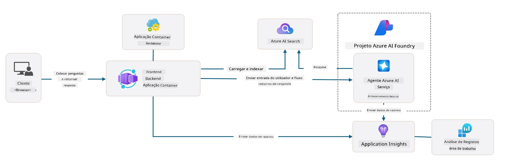

# 3. Desconstruir um Modelo

!!! tip "NO FINAL DESTE MÓDULO IRÁ APRENDER A"

    - [ ] Use GitHub Copilot and optional MCP tools for Azure documentation and read-only exploration
    - [ ] Identify the template's application, infrastructure, configuration, and test entry points
    - [ ] Verify generated explanations against actual repository files
    - [ ] **Lab 3:** Trace one request and one configuration input through the project

---

## 1. Ativar o GitHub Copilot

Abra o exemplo de IA inicializado no VS Code e ative o [GitHub Copilot](https://code.visualstudio.com/docs/copilot/chat/chat-agent-mode). Inicie sessão com uma conta que tenha um plano elegível; os limites de uso variam. Peça ao Copilot para explicar o repositório antes de autorizar alterações.

### Servidores MCP opcionais

Estes serviços podem fornecer ferramentas adicionais:

- [Servidor Azure MCP](https://learn.microsoft.com/azure/developer/azure-mcp-server/overview)
- [Servidor Microsoft Learn MCP](https://learn.microsoft.com/training/support/mcp)

No VS Code, reveja a [orientação de configuração MCP](https://code.visualstudio.com/docs/copilot/chat/mcp-servers) e crie `.vscode/mcp.json` se necessário:

```json
{
  "servers": {
    "Azure MCP Server": {
      "type": "stdio",
      "command": "npx",
      "args": ["-y", "@azure/mcp@latest", "server", "start"]
    },
    "microsoft.docs.mcp": {
      "type": "http",
      "url": "https://learn.microsoft.com/api/mcp"
    }
  }
}
```

O comando `npx` requer uma instalação suportada do Node.js/npm e descarrega código executável. Reveja o pacote e fixe uma versão aprovada para uma configuração de equipa reproduzível. Inicie os servidores usando os controlos MCP do VS Code e inspeccione as ferramentas disponíveis; os nomes podem mudar entre versões.

**A autenticação é separada.** Use `azd auth login` para AZD. Siga o fluxo de autenticação documentado do Azure MCP para as suas ferramentas; o login AZD sozinho não estabelece uma sessão MCP. Use `az login` separadamente quando um exercício ou gancho invocar o Azure CLI.

Experimente prompts apenas de leitura:

1. “Use Microsoft Learn MCP para encontrar a documentação de configuração da Azure Developer CLI.”
2. “Explique o `azure.yaml` deste repositório; cite os ficheiros que implementam cada gancho.”
3. “Usando as ferramentas Azure MCP disponíveis, liste os meus recursos implantados sem modificar nada.”

Verifique a subscrição/inquilino selecionado e cada chamada de ferramenta proposta. Não aprove a criação, eliminação ou alterações de acesso de recursos apenas para explorar a arquitetura.

## 2. Compreender a arquitetura

O exemplo hospeda um backend Python FastAPI e um frontend React/TypeScript em Azure Container Apps. O backend comunica-se com um agente num projeto Microsoft Foundry. A recuperação e observabilidade dependem das funcionalidades do modelo ativadas e da configuração bem-sucedida; não são garantidas apenas porque a aplicação foi implantada.



Compare este diagrama com o [guia de implantação atual](https://github.com/Azure-Samples/get-started-with-ai-agents/blob/main/docs/deployment.md) e os seus recursos reais. Verifique o modelo de implantação configurado, ferramentas do agente, identidade gerida, atribuições de função e recursos opcionais do AI Search/Application Insights.

**Exercício:** Peça ao Copilot para rastrear um pedido de chat desde o frontend através da API até ao Foundry, com referências de ficheiro e função. Abra essas referências e verifique a explicação. Não infira autenticação, roteamento ou autorização implementados apenas a partir de um diagrama.

## 3. Estrutura do repositório

Os seguintes caminhos selecionados foram verificados em comparação com o exemplo em 4 de novembro de 2026. A sua revisão inicializada permanece a fonte de verdade:

```text
get-started-with-ai-agents/
  azure.yaml
  docker-compose.yaml
  requirements-dev.txt
  .devcontainer/
  infra/
    main.bicep
    main.parameters.json
    api.bicep
    core/
  src/
    Dockerfile
    pyproject.toml
    requirements.txt
    api/
      main.py
      routes.py
      search_index_manager.py
    frontend/
      package.json
      src/
    files/
  scripts/
    validate_env_vars.sh
    validate_env_vars.ps1
    postdeploy.sh
    postdeploy.ps1
  tests/
    test_evaluation.py
    test_red_teaming.py
  docs/
    deployment.md
    deploy_customization.md
    ai_search.md
    observability.md
    local_development.md
    troubleshooting.md
```

### Infraestrutura e configuração

`infra/main.bicep` orquestra os recursos; `main.parameters.json` liga as entradas do modelo aos valores de ambiente AZD. `azure.yaml` seleciona o serviço da aplicação e os ganchos de ciclo de vida. Siga um input como `USE_AZURE_AI_SEARCH_SERVICE` através destes ficheiros para encontrar o que realmente muda.

### Aplicação e identidade

Leia `src/api/` e `src/frontend/` em conjunto. Identifique onde o agente é criado ou recuperado, onde instruções/ferramentas são configuradas, e qual identidade cada chamada Azure usa. Os ficheiros do exemplo sob `src/files/` são dados de demonstração, não um catálogo de produção ou modelo de autorização.

### Testes e observabilidade

Os pontos de entrada atuais para avaliação e red-teaming estão sob `tests/`; referências antigas de diretórios `evals/` e `airedteaming/` são obsoletas para este exemplo. Leia `docs/observability.md` para pré-requisitos e custos antes de executar testes na cloud. Estes testes Python são separados da extensão opcional `azure.ai.evaluations` AZD.

## 4. Verifique as suas conclusões

- Identifique a rota API, interação do agente, e código de recuperação para uma questão de amostra.
- Explique qual identidade acede ao Foundry e qual configuração seleciona o seu endpoint.
- Encontre os scripts reais pré-up e pós-deploy e o seu comportamento de tratamento de erros.
- Liste as dependências ou funcionalidades opcionais que estão ausentes da sua implantação.

Continue para [Configurar um Modelo](4-Configure-AI-Template.md).

---

<!-- CO-OP TRANSLATOR DISCLAIMER START -->
**Aviso Legal**:
Este documento foi traduzido utilizando o serviço de tradução automática [Co-op Translator](https://github.com/Azure/co-op-translator). Embora nos esforcemos pela precisão, esteja ciente de que traduções automáticas podem conter erros ou imprecisões. O documento original na sua língua nativa deve ser considerado a fonte autorizada. Para informações críticas, recomenda-se tradução profissional humana. Não nos responsabilizamos por quaisquer mal-entendidos ou interpretações incorretas resultantes da utilização desta tradução.
<!-- CO-OP TRANSLATOR DISCLAIMER END -->