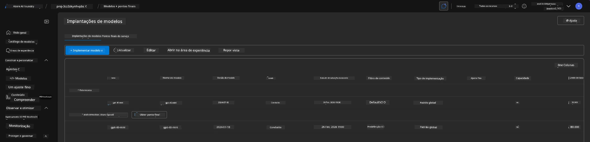
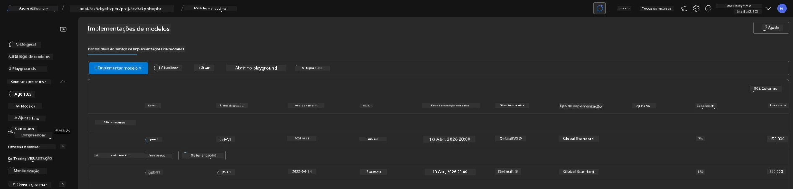

# 6. Desmontar Infraestrutura

!!! tip "NO FINAL DESTE MÓDULO IRÁ CONSEGUIR"

    - [ ] Compreender a importância da limpeza de recursos e gestão de custos
    - [ ] Usar `azd down` para remover a infraestrutura com segurança
    - [ ] Recuperar Serviços Azure AI apagados suavemente se necessário
    - [ ] **Laboratório 6:** Limpar recursos Azure e verificar a remoção

---

## Exercícios Bónus

Antes de desmontar o projeto, reserve alguns minutos para uma exploração aberta.

!!! info "Experimente estas sugestões de exploração"

    **Experimente o GitHub Copilot:**
    
    1. Pergunte: `Que outros modelos AZD poderia experimentar para cenários multi-agente?`
    2. Pergunte: `Como posso personalizar as instruções do agente para um caso de uso na área da saúde?`
    3. Pergunte: `Que variáveis de ambiente controlam a otimização de custos?`
    
    **Explore o Portal Azure:**
    
    1. Reveja as métricas do Application Insights para a sua implementação
    2. Verifique a análise de custos dos recursos provisionados
    3. Explore novamente o playground do agente do portal Microsoft Foundry

---

## Remover Infraestrutura

1. Desmontar a infraestrutura é tão fácil como:
      
      ```bash title="" linenums="0"
      azd down --purge
      ```
1. A flag `--purge` garante também a purga dos recursos do Cognitive Service apagados suavemente, libertando assim a quota detida por esses recursos. Quando terminar verá algo como isto:
      
      ```bash title="" linenums="0"
      ? Total resources to delete: 11, are you sure you want to continue? Yes
      Deleting your resources can take some time.
      (✓) Done: Deleted resource group rg-nitya-mshack-azd
      (✓) Done: Purging Cognitive Account: aoai-3cz3zkynhvpbc

      SUCCESS: Your application was removed from Azure in 11 minutes 4 seconds.
      ```

1. (Opcional) Se agora executar `azd up` novamente, irá notar que o modelo gpt-4.1 é implantado porque a variável de ambiente foi alterada (e guardada) na pasta local `.azure`.

      Aqui está a implantação dos modelos **antes**:

      

      E aqui está **depois**:
      

---

<!-- CO-OP TRANSLATOR DISCLAIMER START -->
**Aviso Legal**:
Este documento foi traduzido utilizando o serviço de tradução automática [Co-op Translator](https://github.com/Azure/co-op-translator). Embora nos esforcemos pela precisão, esteja ciente de que traduções automáticas podem conter erros ou imprecisões. O documento original na sua língua nativa deve ser considerado a fonte autorizada. Para informações críticas, recomenda-se tradução profissional humana. Não nos responsabilizamos por quaisquer mal-entendidos ou interpretações incorretas resultantes da utilização desta tradução.
<!-- CO-OP TRANSLATOR DISCLAIMER END -->