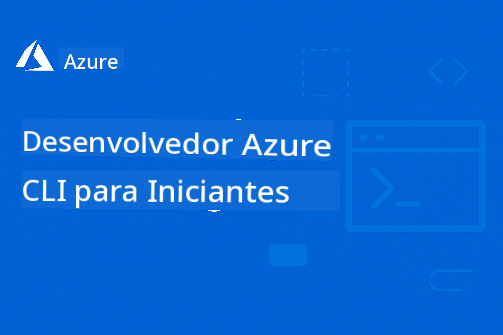

<!--
CO_OP_TRANSLATOR_METADATA:
{
  "original_hash": "05c30c9e5ed7951c72855108c6788034",
  "translation_date": "2025-12-25T02:51:40+00:00",
  "source_file": "README.md",
  "language_code": "pt"
}
-->
# AZD Para Iniciantes: Uma Jornada de Aprendizagem Estruturada

 

[](https://GitHub.com/microsoft/azd-for-beginners/watchers/)
[](https://GitHub.com/microsoft/azd-for-beginners/network/)
[](https://GitHub.com/microsoft/azd-for-beginners/stargazers/)

[](https://discord.gg/microsoft-azure)
[](https://discord.gg/nTYy5BXMWG)

## Começar com este Curso

Siga estes passos para iniciar a sua jornada de aprendizagem AZD:

1. **Fork do Repositório**: Clique [](https://GitHub.com/microsoft/azd-for-beginners/fork)
2. **Clonar o Repositório**: `git clone https://github.com/microsoft/azd-for-beginners.git`
3. **Juntar-se à Comunidade**: [Azure Discord Communities](https://discord.com/invite/ByRwuEEgH4) para suporte de especialistas
4. **Escolher o Seu Percurso de Aprendizagem**: Selecione um capítulo abaixo que corresponda ao seu nível de experiência

### Suporte Multilingue

#### Traduções Automáticas (Sempre Atualizadas)

<!-- CO-OP TRANSLATOR LANGUAGES TABLE START -->
[Árabe](../ar/README.md) | [Bengalês](../bn/README.md) | [Búlgaro](../bg/README.md) | [Birmanês (Myanmar)](../my/README.md) | [Chinês (Simplificado)](../zh/README.md) | [Chinês (Tradicional, Hong Kong)](../hk/README.md) | [Chinês (Tradicional, Macau)](../mo/README.md) | [Chinês (Tradicional, Taiwan)](../tw/README.md) | [Croata](../hr/README.md) | [Checo](../cs/README.md) | [Dinamarquês](../da/README.md) | [Holandês](../nl/README.md) | [Estónio](../et/README.md) | [Finlandês](../fi/README.md) | [Francês](../fr/README.md) | [Alemão](../de/README.md) | [Grego](../el/README.md) | [Hebraico](../he/README.md) | [Hindi](../hi/README.md) | [Húngaro](../hu/README.md) | [Indonésio](../id/README.md) | [Italiano](../it/README.md) | [Japonês](../ja/README.md) | [Kannada](../kn/README.md) | [Coreano](../ko/README.md) | [Lituano](../lt/README.md) | [Malaio](../ms/README.md) | [Malayalam](../ml/README.md) | [Marathi](../mr/README.md) | [Nepalês](../ne/README.md) | [Pidgin da Nigéria](../pcm/README.md) | [Norueguês](../no/README.md) | [Persa (Farsi)](../fa/README.md) | [Polaco](../pl/README.md) | [Português (Brasil)](../br/README.md) | [Português (Portugal)](./README.md) | [Punjabi (Gurmukhi)](../pa/README.md) | [Romeno](../ro/README.md) | [Russo](../ru/README.md) | [Sérvio (Cirílico)](../sr/README.md) | [Eslovaco](../sk/README.md) | [Esloveno](../sl/README.md) | [Espanhol](../es/README.md) | [Suaíli](../sw/README.md) | [Sueco](../sv/README.md) | [Tagalo (Filipino)](../tl/README.md) | [Tamil](../ta/README.md) | [Telugu](../te/README.md) | [Tailandês](../th/README.md) | [Turco](../tr/README.md) | [Ucraniano](../uk/README.md) | [Urdu](../ur/README.md) | [Vietnamita](../vi/README.md)
<!-- CO-OP TRANSLATOR LANGUAGES TABLE END -->

## Visão Geral do Curso

Domine o Azure Developer CLI (azd) através de capítulos estruturados concebidos para uma aprendizagem progressiva. **Foco especial na implantação de aplicações de IA com integração com o Microsoft Foundry.**

### Porque este Curso é Essencial para Desenvolvedores Modernos

Com base em informações da comunidade Microsoft Foundry Discord, **45% dos desenvolvedores querem usar o AZD para cargas de trabalho de IA** mas encontram desafios com:
- Arquiteturas de IA complexas com múltiplos serviços
- Melhores práticas para implantação de IA em produção  
- Integração e configuração de serviços Azure AI
- Otimização de custos para cargas de trabalho de IA
- Resolução de problemas específicos de implantação de IA

### Objetivos de Aprendizagem

Ao completar este curso estruturado, você irá:
- **Dominar os Fundamentos do AZD**: Conceitos principais, instalação e configuração
- **Implementar Aplicações de IA**: Usar o AZD com serviços Microsoft Foundry
- **Implementar Infraestrutura como Código**: Gerir recursos Azure com modelos Bicep
- **Resolver Problemas de Implantação**: Solucionar problemas comuns e depurar
- **Otimizar para Produção**: Segurança, escalabilidade, monitorização e gestão de custos
- **Construir Soluções Multi-Agente**: Implementar arquiteturas de IA complexas

## 📚 Capítulos de Aprendizagem

*Selecione o seu percurso de aprendizagem com base no nível de experiência e objetivos*

### 🚀 Capítulo 1: Fundamentos e Início Rápido
**Pré-requisitos**: Subscrição Azure, conhecimentos básicos de linha de comando  
**Duração**: 30-45 minutos  
**Complexidade**: ⭐

#### O que vai aprender
- Compreender os fundamentos do Azure Developer CLI
- Instalar o AZD na sua plataforma
- A sua primeira implantação bem-sucedida

#### Recursos de Aprendizagem
- **🎯 Comece aqui**: [O que é o Azure Developer CLI?](../..)
- **📖 Teoria**: [Noções básicas do AZD](docs/getting-started/azd-basics.md) - Conceitos e terminologia essenciais
- **⚙️ Configuração**: [Instalação e Configuração](docs/getting-started/installation.md) - Guias específicos por plataforma
- **🛠️ Prática**: [O seu Primeiro Projeto](docs/getting-started/first-project.md) - Tutorial passo a passo
- **📋 Referência Rápida**: [Folha de Comandos](resources/cheat-sheet.md)

#### Exercícios Práticos
```bash
# Verificação rápida da instalação
azd version

# Implante a sua primeira aplicação
azd init --template todo-nodejs-mongo
azd up
```

**💡 Resultado do Capítulo**: Implantar com sucesso uma aplicação web simples no Azure usando o AZD

**✅ Validação de Sucesso:**
```bash
# Depois de concluir o Capítulo 1, deverá ser capaz de:
azd version              # Mostra a versão instalada
azd init --template todo-nodejs-mongo  # Inicializa o projeto
azd up                  # Implementa no Azure
azd show                # Mostra a URL da aplicação em execução
# A aplicação abre no navegador e funciona
azd down --force --purge  # Limpa os recursos
```

**📊 Investimento de Tempo:** 30-45 minutos  
**📈 Nível de Competência Após:** Capaz de implantar aplicações básicas de forma independente

**✅ Validação de Sucesso:**
```bash
# Depois de concluir o Capítulo 1, deverá ser capaz de:
azd version              # Mostra a versão instalada
azd init --template todo-nodejs-mongo  # Inicializa o projeto
azd up                  # Implanta no Azure
azd show                # Mostra a URL da aplicação em execução
# A aplicação abre no navegador e funciona
azd down --force --purge  # Limpa os recursos
```

**📊 Investimento de Tempo:** 30-45 minutos  
**📈 Nível de Competência Após:** Capaz de implantar aplicações básicas de forma independente

---

### 🤖 Capítulo 2: Desenvolvimento com Foco em IA (Recomendado para Desenvolvedores de IA)
**Pré-requisitos**: Capítulo 1 concluído  
**Duração**: 1-2 horas  
**Complexidade**: ⭐⭐

#### O que vai aprender
- Integração do Microsoft Foundry com o AZD
- Implementação de aplicações potenciadas por IA
- Compreender as configurações de serviços de IA

#### Recursos de Aprendizagem
- **🎯 Comece aqui**: [Integração Microsoft Foundry](docs/microsoft-foundry/microsoft-foundry-integration.md)
- **📖 Padrões**: [Implantação de Modelos de IA](docs/microsoft-foundry/ai-model-deployment.md) - Implementar e gerir modelos de IA
- **🛠️ Workshop**: [Laboratório de IA](docs/microsoft-foundry/ai-workshop-lab.md) - Prepare as suas soluções de IA para o AZD
- **🎥 Guia Interativo**: [Materiais do Workshop](workshop/README.md) - Aprendizagem no navegador com MkDocs * Ambiente DevContainer
- **📋 Modelos**: [Modelos Microsoft Foundry](../..)
- **📝 Exemplos**: [Exemplos de Implantação AZD](examples/README.md)

#### Exercícios Práticos
```bash
# Implemente a sua primeira aplicação de IA
azd init --template azure-search-openai-demo
azd up

# Experimente modelos adicionais de IA
azd init --template openai-chat-app-quickstart
azd init --template agent-openai-python-prompty
```

**💡 Resultado do Capítulo**: Implementar e configurar uma aplicação de chat potenciadas por IA com capacidades RAG

**✅ Validação de Sucesso:**
```bash
# Depois do Capítulo 2, deverá ser capaz de:
azd init --template azure-search-openai-demo
azd up
# Testar a interface de chat da IA
# Fazer perguntas e obter respostas geradas pela IA com fontes
# Verificar se a integração da pesquisa funciona
azd monitor  # Verificar que o Application Insights apresenta telemetria
azd down --force --purge
```

**📊 Investimento de Tempo:** 1-2 horas  
**📈 Nível de Competência Após:** Capaz de implantar e configurar aplicações de IA prontas para produção  
**💰 Noção de Custos:** Compreender custos de desenvolvimento de $80-150/mês, custos de produção de $300-3500/mês

#### 💰 Considerações de Custos para Implantações de IA

**Ambiente de Desenvolvimento (Estimado $80-150/mês):**
- Azure OpenAI (Pagamento por utilização): $0-50/mês (com base no uso de tokens)
- AI Search (nível Básico): $75/mês
- Container Apps (Consumo): $0-20/mês
- Armazenamento (Standard): $1-5/mês

**Ambiente de Produção (Estimado $300-3,500+/mês):**
- Azure OpenAI (PTU para desempenho consistente): $3,000+/mês OU Pagamento por utilização com elevado volume
- AI Search (nível Standard): $250/mês
- Container Apps (Dedicado): $50-100/mês
- Application Insights: $5-50/mês
- Armazenamento (Premium): $10-50/mês

**💡 Dicas de Otimização de Custos:**
- Use o **Nível Gratuito** do Azure OpenAI para aprendizagem (50.000 tokens/mês incluídos)
- Execute `azd down` para desalocar recursos quando não estiver a desenvolver ativamente
- Comece com faturação por consumo, atualize para PTU apenas em produção
- Use `azd provision --preview` para estimar custos antes da implantação
- Ative a escalabilidade automática: pague apenas pelo uso efetivo

**Monitorização de Custos:**
```bash
# Verificar custos mensais estimados
azd provision --preview

# Monitorizar os custos reais no Portal do Azure
az consumption budget list --resource-group <your-rg>
```

---

### ⚙️ Capítulo 3: Configuração e Autenticação
**Pré-requisitos**: Capítulo 1 concluído  
**Duração**: 45-60 minutos  
**Complexidade**: ⭐⭐

#### O que vai aprender
- Configuração e gestão de ambientes
- Melhores práticas de autenticação e segurança
- Nomenclatura e organização de recursos

#### Recursos de Aprendizagem
- **📖 Configuração**: [Guia de Configuração](docs/getting-started/configuration.md) - Definição de ambientes
- **🔐 Segurança**: [Padrões de autenticação e identidade gerida](docs/getting-started/authsecurity.md) - Padrões de autenticação
- **📝 Exemplos**: [Exemplo de Aplicação de Base de Dados](examples/database-app/README.md) - Exemplos AZD com bases de dados

#### Exercícios Práticos
- Configurar múltiplos ambientes (dev, staging, prod)
- Configurar autenticação com identidade gerida
- Implementar configurações específicas por ambiente

**💡 Resultado do Capítulo**: Gerir múltiplos ambientes com autenticação e segurança adequadas

---

### 🏗️ Capítulo 4: Infraestrutura como Código e Implantação
**Pré-requisitos**: Capítulos 1-3 concluídos  
**Duração**: 1-1.5 horas  
**Complexidade**: ⭐⭐⭐

#### O que vai aprender
- Padrões avançados de implantação
- Infraestrutura como Código com Bicep
- Estratégias de aprovisionamento de recursos

#### Recursos de Aprendizagem
- **📖 Implantação**: [Guia de Implantação](docs/deployment/deployment-guide.md) - Fluxos de trabalho completos
- **🏗️ Aprovisionamento**: [Aprovisionamento de Recursos](docs/deployment/provisioning.md) - Gestão de recursos Azure
- **📝 Exemplos**: [Exemplo de Container App](../../examples/container-app) - Implantações conteinerizadas

#### Exercícios Práticos
- Criar modelos Bicep personalizados
- Implementar aplicações multi-serviço
- Implementar estratégias de implantação blue-green

**💡 Resultado do Capítulo**: Implementar aplicações complexas multi-serviço usando modelos de infraestrutura personalizados

---

### 🎯 Capítulo 5: Soluções de IA Multi-Agente (Avançado)
**Pré-requisitos**: Capítulos 1-2 concluídos  
**Duração**: 2-3 horas  
**Complexidade**: ⭐⭐⭐⭐

#### O que vai aprender
- Padrões de arquitetura multi-agente
- Orquestração e coordenação de agentes
- Implantações de IA prontas para produção

#### Recursos de Aprendizagem
- **🤖 Projeto em Destaque**: [Solução Multi-Agente para Retalho](examples/retail-scenario.md) - Implementação completa
- **🛠️ Modelos ARM**: [Pacote de Templates ARM](../../examples/retail-multiagent-arm-template) - Implantação com um clique
- **📖 Arquitetura**: [Padrões de coordenação multi-agente](/docs/pre-deployment/coordination-patterns.md) - Padrões

#### Exercícios Práticos
```bash
# Implementar a solução completa de retalho com múltiplos agentes
cd examples/retail-multiagent-arm-template
./deploy.sh

# Explorar configurações de agentes
az deployment group show --resource-group <rg-name> --name <deployment-name>
```

**💡 Resultado do Capítulo**: Implementar e gerir uma solução de IA multi-agente pronta para produção com agentes de Cliente e Inventário

---

### 🔍 Capítulo 6: Validação e Planeamento Pré-Implantação
**Pré-requisitos**: Capítulo 4 concluído  
**Duração**: 1 hora  
**Complexidade**: ⭐⭐

#### O que vai aprender
- Planeamento de capacidade e validação de recursos
- Estratégias de seleção de SKU
- Verificações pré-implantação e automatização

#### Recursos de Aprendizagem
- **📊 Planeamento**: [Planeamento de Capacidade](docs/pre-deployment/capacity-planning.md) - Validação de recursos
- **💰 Seleção**: [Seleção de SKU](docs/pre-deployment/sku-selection.md) - Escolhas custo-eficazes
- **✅ Validação**: [Verificações pré-implantação](docs/pre-deployment/preflight-checks.md) - Scripts automatizados

#### Exercícios Práticos
- Executar scripts de validação de capacidade
- Otimizar a seleção de SKU para custo
- Implementar verificações pré-implantação automatizadas

**💡 Resultado do Capítulo**: Validar e otimizar implantações antes da execução

---

### 🚨 Capítulo 7: Resolução de problemas e Depuração
**Pré-requisitos**: Qualquer capítulo de implantação concluído  
**Duração**: 1-1,5 horas  
**Complexidade**: ⭐⭐

#### O que vai aprender
- Abordagens sistemáticas de depuração
- Problemas comuns e soluções
- Resolução de problemas específica de IA

#### Recursos de Aprendizagem
- **🔧 Problemas Comuns**: [Problemas Comuns](docs/troubleshooting/common-issues.md) - FAQ e soluções
- **🕵️ Depuração**: [Guia de Depuração](docs/troubleshooting/debugging.md) - Estratégias passo a passo
- **🤖 Problemas de IA**: [Resolução de Problemas Específica de IA](docs/troubleshooting/ai-troubleshooting.md) - Problemas de serviços de IA

#### Exercícios Práticos
- Diagnosticar falhas de implantação
- Resolver problemas de autenticação
- Depurar a conectividade dos serviços de IA

**💡 Resultado do Capítulo**: Diagnosticar e resolver de forma autónoma problemas comuns de implantação

---

### 🏢 Capítulo 8: Padrões de Produção e Empresariais
**Pré-requisitos**: Capítulos 1-4 concluídos  
**Duração**: 2-3 horas  
**Complexidade**: ⭐⭐⭐⭐

#### O que vai aprender
- Estratégias de implantação em produção
- Padrões de segurança empresariais
- Monitorização e otimização de custos

#### Recursos de Aprendizagem
- **🏭 Produção**: [Melhores Práticas de IA para Produção](docs/microsoft-foundry/production-ai-practices.md) - Padrões empresariais
- **📝 Exemplos**: [Exemplo de Microserviços](../../examples/microservices) - Arquiteturas complexas
- **📊 Monitorização**: [Integração com Application Insights](docs/pre-deployment/application-insights.md) - Monitorização

#### Exercícios Práticos
- Implementar padrões de segurança empresariais
- Configurar monitorização abrangente
- Implantar em produção com governança adequada

**💡 Resultado do Capítulo**: Implantar aplicações prontas para ambiente empresarial com todas as capacidades de produção

---

## 🎓 Visão Geral do Workshop: Experiência Prática de Aprendizagem

> **⚠️ ESTADO DO WORKSHOP: Em Desenvolvimento Ativo**  
> Os materiais do workshop estão atualmente a ser desenvolvidos e refinados. Os módulos principais são funcionais, mas algumas secções avançadas estão incompletas. Estamos a trabalhar ativamente para completar todo o conteúdo. [Acompanhar progresso →](workshop/README.md)

### Materiais Interativos do Workshop
**Aprendizagem prática abrangente com ferramentas baseadas no navegador e exercícios guiados**

Os materiais do nosso workshop fornecem uma experiência de aprendizagem estruturada e interativa que complementa o currículo baseado em capítulos acima. O workshop está concebido tanto para aprendizagem auto-dirigida como para sessões conduzidas por instrutor.

#### 🛠️ Funcionalidades do Workshop
- **Interface Baseada no Navegador**: Workshop completo com MkDocs com funcionalidades de pesquisa, cópia e temas
- **Integração com GitHub Codespaces**: Configuração do ambiente de desenvolvimento com um clique
- **Percurso de Aprendizagem Estruturado**: Exercícios guiados em 7 passos (3,5 horas no total)
- **Descoberta → Implantação → Personalização**: Metodologia progressiva
- **Ambiente DevContainer Interativo**: Ferramentas e dependências pré-configuradas

#### 📚 Estrutura do Workshop
O workshop segue uma metodologia **Descoberta → Implantação → Personalização**:

1. **Fase de Descoberta** (45 mins)
   - Explorar os templates e serviços do Microsoft Foundry
   - Compreender padrões de arquitetura multi-agente
   - Rever requisitos de implantação e pré-requisitos

2. **Fase de Implantação** (2 horas)
   - Implantação prática de aplicações de IA com o AZD
   - Configurar serviços e endpoints Azure AI
   - Implementar padrões de segurança e autenticação

3. **Fase de Personalização** (45 mins)
   - Modificar aplicações para casos de uso específicos
   - Otimizar para implantação em produção
   - Implementar monitorização e gestão de custos

#### 🚀 Começar com o Workshop
```bash
# Opção 1: GitHub Codespaces (Recomendado)
# Clique em "Code" → "Create codespace on main" no repositório

# Opção 2: Desenvolvimento Local
git clone https://github.com/microsoft/azd-for-beginners.git
cd azd-for-beginners/workshop
# Siga as instruções de configuração em workshop/README.md
```

#### 🎯 Resultados de Aprendizagem do Workshop
Ao completar o workshop, os participantes irão:
- **Implantar Aplicações de IA em Produção**: Utilizar o AZD com os serviços Microsoft Foundry
- **Dominar Arquiteturas Multi-Agente**: Implementar soluções coordenadas de agentes de IA
- **Implementar Melhores Práticas de Segurança**: Configurar autenticação e controlo de acesso
- **Otimizar para Escalabilidade**: Projetar implantações eficientes em custo e desempenho
- **Resolver Problemas de Implantação**: Resolver problemas comuns de forma autónoma

#### 📖 Recursos do Workshop
- **🎥 Guia Interativo**: [Materiais do Workshop](workshop/README.md) - Ambiente de aprendizagem baseado no navegador
- **📋 Instruções Passo a Passo**: [Exercícios Guiados](../../workshop/docs/instructions) - Orientações detalhadas
- **🛠️ Laboratório do Workshop de IA**: [AI Workshop Lab](docs/microsoft-foundry/ai-workshop-lab.md) - Exercícios centrados em IA
- **💡 Arranque Rápido**: [Guia de Configuração do Workshop](workshop/README.md#quick-start) - Configuração do ambiente

**Perfeito para**: Formação corporativa, cursos universitários, aprendizagem auto-dirigida e bootcamps de desenvolvimento.

---

## 📖 O que é o Azure Developer CLI?

Azure Developer CLI (azd) é uma interface de linha de comandos centrada no programador que acelera o processo de criação e implantação de aplicações no Azure. Fornece:

- **Implantações baseadas em modelos** - Utilizar modelos pré-construídos para padrões de aplicação comuns
- **Infraestrutura como Código** - Gerir recursos Azure usando Bicep ou Terraform  
- **Fluxos de trabalho integrados** - Provisionar, implantar e monitorizar aplicações sem descontinuidades
- **Amigável para programadores** - Otimizado para produtividade e experiência do programador

### **AZD + Microsoft Foundry: Perfeito para Implantações de IA**

**Porquê o AZD para Soluções de IA?** O AZD responde aos principais desafios que os programadores de IA enfrentam:

- **Modelos Prontos para IA** - Modelos pré-configurados para Azure OpenAI, Cognitive Services e cargas de trabalho de ML
- **Implantações de IA Seguras** - Padrões de segurança incorporados para serviços de IA, chaves de API e endpoints de modelos  
- **Padrões de IA para Produção** - Melhores práticas para implantações de aplicações de IA escaláveis e custo-eficazes
- **Fluxos de Trabalho de IA de Ponta a Ponta** - Desde o desenvolvimento do modelo até à implantação em produção com monitorização adequada
- **Otimização de Custos** - Alocação de recursos inteligente e estratégias de escalabilidade para cargas de trabalho de IA
- **Integração com Microsoft Foundry** - Ligação perfeita ao catálogo de modelos e endpoints do Microsoft Foundry

---

## 🎯 Biblioteca de Modelos e Exemplos

### Em Destaque: Modelos Microsoft Foundry
**Comece aqui se estiver a implantar aplicações de IA!**

> **Nota:** Estes modelos demonstram vários padrões de IA. Alguns são Azure Samples externos, outros são implementações locais.

| Modelo | Capítulo | Complexidade | Serviços | Tipo |
|----------|---------|------------|----------|------|
| [**Começar com chat de IA**](https://github.com/Azure-Samples/get-started-with-ai-chat) | Capítulo 2 | ⭐⭐ | AzureOpenAI + Azure AI Model Inference API + Azure AI Search + Azure Container Apps + Application Insights | Externo |
| [**Começar com agentes de IA**](https://github.com/Azure-Samples/get-started-with-ai-agents) | Capítulo 2 | ⭐⭐ | Azure AI Agent Service + AzureOpenAI + Azure AI Search + Azure Container Apps + Application Insights| Externo |
| [**Demonstração Azure Search + OpenAI**](https://github.com/Azure-Samples/azure-search-openai-demo) | Capítulo 2 | ⭐⭐ | AzureOpenAI + Azure AI Search + App Service + Storage | Externo |
| [**OpenAI Chat App Quickstart**](https://github.com/Azure-Samples/openai-chat-app-quickstart) | Capítulo 2 | ⭐ | AzureOpenAI + Container Apps + Application Insights | Externo |
| [**Agent OpenAI Python Prompty**](https://github.com/Azure-Samples/agent-openai-python-prompty) | Capítulo 5 | ⭐⭐⭐ | AzureOpenAI + Azure Functions + Prompty | Externo |
| [**Contoso Chat RAG**](https://github.com/Azure-Samples/contoso-chat) | Capítulo 8 | ⭐⭐⭐⭐ | AzureOpenAI + AI Search + Cosmos DB + Container Apps | Externo |
| [**Solução Multi-Agente Retail**](examples/retail-scenario.md) | Capítulo 5 | ⭐⭐⭐⭐ | AzureOpenAI + AI Search + Storage + Container Apps + Cosmos DB | **Local** |

### Em Destaque: Cenários de Aprendizagem Completa
**Modelos de aplicações prontos para produção mapeados para capítulos de aprendizagem**

| Modelo | Capítulo de Aprendizagem | Complexidade | Principais Aprendizagens |
|----------|------------------|------------|--------------|
| [**openai-chat-app-quickstart**](https://github.com/Azure-Samples/openai-chat-app-quickstart) | Capítulo 2 | ⭐ | Padrões básicos de implantação de IA |
| [**azure-search-openai-demo**](https://github.com/Azure-Samples/azure-search-openai-demo) | Capítulo 2 | ⭐⭐ | Implementação RAG com Azure AI Search |
| [**ai-document-processing**](https://github.com/Azure-Samples/ai-document-processing) | Capítulo 4 | ⭐⭐ | Integração do Document Intelligence |
| [**agent-openai-python-prompty**](https://github.com/Azure-Samples/agent-openai-python-prompty) | Capítulo 5 | ⭐⭐⭐ | Framework de agentes e chamadas de funções |
| [**contoso-chat**](https://github.com/Azure-Samples/contoso-chat) | Capítulo 8 | ⭐⭐⭐ | Orquestração de IA empresarial |
| [**retail-multi-agent-solution**](examples/retail-scenario.md) | Capítulo 5 | ⭐⭐⭐⭐ | Arquitetura multi-agente com agentes de Cliente e Inventário |

### Aprender por Tipo de Exemplo

> **📌 Exemplos Locais vs. Externos:**  
> **Exemplos Locais** (neste repositório) = Prontos a usar imediatamente  
> **Exemplos Externos** (Azure Samples) = Clonar dos repositórios ligados

#### Exemplos Locais (Prontos a Usar)
- [**Solução Multi-Agente Retail**](examples/retail-scenario.md) - Implementação completa pronta para produção com templates ARM
  - Arquitetura multi-agente (agentes Cliente + Inventário)
  - Monitorização e avaliação abrangentes
  - Implantação com um clique via template ARM

#### Exemplos Locais - Aplicações em Contentores (Capítulos 2-5)
**Exemplos abrangentes de implantação de contentores neste repositório:**
- [**Exemplos de Container App**](examples/container-app/README.md) - Guia completo para implantações em contentores
  - [API Flask Simples](../../examples/container-app/simple-flask-api) - API REST básica com escala para zero
  - [Arquitetura de Microserviços](../../examples/container-app/microservices) - Implantação multi-serviço pronta para produção
  - Início Rápido, Produção e Padrões de implantação Avançados
  - Orientação sobre monitorização, segurança e otimização de custos

#### Exemplos Externos - Aplicações Simples (Capítulos 1-2)
**Clone estes repositórios Azure Samples para começar:**
- [Aplicação Web Simples - Node.js + MongoDB](https://github.com/Azure-Samples/todo-nodejs-mongo) - Padrões básicos de implantação
- [Website Estático - React SPA](https://github.com/Azure-Samples/todo-csharp-sql-swa-func) - Implantação de conteúdo estático
- [Container App - Python Flask](https://github.com/Azure-Samples/container-apps-store-api-microservice) - Implantação de API REST

#### Exemplos Externos - Integração de Bases de Dados (Capítulos 3-4)  
- [Aplicação de Base Dados - C# + SQL](https://github.com/Azure-Samples/todo-csharp-sql) - Padrões de conectividade a bases de dados
- [Functions + Cosmos DB](https://github.com/Azure-Samples/todo-python-mongo-swa-func) - Fluxo de trabalho de dados serverless

#### Exemplos Externos - Padrões Avançados (Capítulos 4-8)
- [Java Microservices](https://github.com/Azure-Samples/java-microservices-aca-lab) - Arquiteturas multi-serviço
- [Container Apps Jobs](https://github.com/Azure-Samples/container-apps-jobs) - Processamento em segundo plano  
- [Enterprise ML Pipeline](https://github.com/Azure-Samples/mlops-v2) - Padrões ML prontos para produção

### Coleções de Modelos Externas
- [**Galeria Oficial de Templates AZD**](https://azure.github.io/awesome-azd/) - Coleção selecionada de templates oficiais e da comunidade
- [**Templates do Azure Developer CLI**](https://learn.microsoft.com/en-us/azure/developer/azure-developer-cli/azd-templates) - Documentação de templates no Microsoft Learn
- [**Directório de Exemplos**](examples/README.md) - Exemplos locais de aprendizagem com explicações detalhadas

---

## 📚 Recursos de Aprendizagem e Referências

### Referências Rápidas
- [**Folha de Consulta de Comandos**](resources/cheat-sheet.md) - Comandos azd essenciais organizados por capítulo
- [**Glossário**](resources/glossary.md) - Terminologia do Azure e do azd  
- [**FAQ**](resources/faq.md) - Perguntas comuns organizadas por capítulo de aprendizagem
- [**Guia de Estudo**](resources/study-guide.md) - Exercícios práticos abrangentes

### Workshops Práticos
- [**Laboratório do Workshop de IA**](docs/microsoft-foundry/ai-workshop-lab.md) - Torne as suas soluções de IA implantáveis com AZD (2-3 hours)
- [**Guia Interativo do Workshop**](workshop/README.md) - Workshop baseado no navegador com MkDocs e ambiente DevContainer
- [**Caminho de Aprendizagem Estruturado**](../../workshop/docs/instructions) -7-step exercícios guiados (Descoberta → Implantação → Personalização)
- [**Workshop AZD para Principiantes**](workshop/README.md) - Material completo do workshop prático com integração GitHub Codespaces

### Recursos de Aprendizagem Externos
- [Documentação do Azure Developer CLI](https://learn.microsoft.com/en-us/azure/developer/azure-developer-cli/)
- [Centro de Arquitetura Azure](https://learn.microsoft.com/en-us/azure/architecture/)
- [Calculadora de Preços Azure](https://azure.microsoft.com/pricing/calculator/)
- [Estado do Azure](https://status.azure.com/)

---

## 🔧 Guia Rápido de Resolução de Problemas

**Problemas comuns que os iniciantes enfrentam e soluções imediatas:**

### ❌ "azd: command not found"

```bash
# Instale primeiro o AZD
# Windows (PowerShell):
winget install microsoft.azd

# macOS:
brew tap azure/azd && brew install azd

# Linux:
curl -fsSL https://aka.ms/install-azd.sh | bash

# Verifique a instalação
azd version
```

### ❌ "No subscription found" or "Subscription not set"

```bash
# Listar assinaturas disponíveis
az account list --output table

# Definir assinatura predefinida
az account set --subscription "<subscription-id-or-name>"

# Definir para o ambiente AZD
azd env set AZURE_SUBSCRIPTION_ID "<subscription-id>"

# Verificar
az account show
```

### ❌ "InsufficientQuota" or "Quota exceeded"

```bash
# Experimente uma região do Azure diferente
azd env set AZURE_LOCATION "westus2"
azd up

# Ou utilize SKUs mais pequenos durante o desenvolvimento
# Edite infra/main.parameters.json:
{
  "sku": "B1"  // Instead of "P1V2"
}
```

### ❌ "azd up" fails halfway through

```bash
# Opção 1: Limpar e tentar novamente
azd down --force --purge
azd up

# Opção 2: Apenas corrigir a infraestrutura
azd provision

# Opção 3: Verificar registos detalhados
azd show
azd logs
```

### ❌ "Authentication failed" or "Token expired"

```bash
# Reautenticar
az logout
az login

azd auth logout
azd auth login

# Verificar autenticação
az account show
```

### ❌ "Resource already exists" or naming conflicts

```bash
# AZD gera nomes únicos, mas em caso de conflito:
azd down --force --purge

# Em seguida, tente novamente com um ambiente limpo
azd env new dev-v2
azd up
```

### ❌ Template deployment taking too long

**Tempos de espera normais:**
- Aplicação web simples: 5-10 minutos
- Aplicação com base de dados: 10-15 minutos
- Aplicações de IA: 15-25 minutos (o provisionamento da OpenAI é lento)

```bash
# Verificar o progresso
azd show

# Se estiver preso mais de 30 minutos, verifique o Portal do Azure:
azd monitor
# Procure implantações falhadas
```

### ❌ "Permission denied" or "Forbidden"

```bash
# Verifique a sua função no Azure
az role assignment list --assignee $(az account show --query user.name -o tsv)

# Precisa, pelo menos, da função "Contributor"
# Peça ao seu administrador do Azure para conceder:
# - Contributor (para recursos)
# - User Access Administrator (para atribuições de funções)
```

### ❌ Can't find deployed application URL

```bash
# Mostrar todos os endpoints de serviço
azd show

# Ou abrir o Portal do Azure
azd monitor

# Verificar um serviço específico
azd env get-values
# Procure variáveis *_URL
```

### 📚 Recursos completos de resolução de problemas

- **Guia de Problemas Comuns:** [Soluções Detalhadas](docs/troubleshooting/common-issues.md)
- **Problemas Específicos de IA:** [Resolução de Problemas de IA](docs/troubleshooting/ai-troubleshooting.md)
- **Guia de Depuração:** [Depuração passo a passo](docs/troubleshooting/debugging.md)
- **Obter Ajuda:** [Azure Discord](https://discord.gg/microsoft-azure) #azure-developer-cli

---

## 🔧 Guia Rápido de Resolução de Problemas

**Problemas comuns que os iniciantes enfrentam e soluções imediatas:**

<details>
<summary><strong>❌ "azd: command not found"</strong></summary>

```bash
# Instale primeiro o AZD
# Windows (PowerShell):
winget install microsoft.azd

# macOS:
brew tap azure/azd && brew install azd

# Linux:
curl -fsSL https://aka.ms/install-azd.sh | bash

# Verifique a instalação
azd version
```
</details>

<details>
<summary><strong>❌ "No subscription found" or "Subscription not set"</strong></summary>

```bash
# Listar subscrições disponíveis
az account list --output table

# Definir subscrição padrão
az account set --subscription "<subscription-id-or-name>"

# Definir para o ambiente AZD
azd env set AZURE_SUBSCRIPTION_ID "<subscription-id>"

# Verificar
az account show
```
</details>

<details>
<summary><strong>❌ "InsufficientQuota" or "Quota exceeded"</strong></summary>

```bash
# Tente uma região Azure diferente
azd env set AZURE_LOCATION "westus2"
azd up

# Ou use SKUs mais pequenos em desenvolvimento
# Edite infra/main.parameters.json:
{
  "sku": "B1"  // Instead of "P1V2"
}
```
</details>

<details>
<summary><strong>❌ "azd up" fails halfway through</strong></summary>

```bash
# Opção 1: Limpar e tentar novamente
azd down --force --purge
azd up

# Opção 2: Apenas corrigir a infraestrutura
azd provision

# Opção 3: Verificar registos detalhados
azd show
azd logs
```
</details>

<details>
<summary><strong>❌ "Authentication failed" or "Token expired"</strong></summary>

```bash
# Reautenticar
az logout
az login

azd auth logout
azd auth login

# Verificar autenticação
az account show
```
</details>

<details>
<summary><strong>❌ "Resource already exists" or naming conflicts</strong></summary>

```bash
# AZD gera nomes únicos, mas se houver conflito:
azd down --force --purge

# Então tente novamente com um ambiente limpo
azd env new dev-v2
azd up
```
</details>

<details>
<summary><strong>❌ Template deployment taking too long</strong></summary>

**Tempos de espera normais:**
- Aplicação web simples: 5-10 minutos
- Aplicação com base de dados: 10-15 minutos
- Aplicações de IA: 15-25 minutos (o provisionamento da OpenAI é lento)

```bash
# Verificar o progresso
azd show

# Se ficar bloqueado por mais de 30 minutos, verifique o Azure Portal:
azd monitor
# Procure implantações com falha
```
</details>

<details>
<summary><strong>❌ "Permission denied" or "Forbidden"</strong></summary>

```bash
# Verifique a sua função no Azure
az role assignment list --assignee $(az account show --query user.name -o tsv)

# Precisa, no mínimo, da função "Contributor"
# Peça ao administrador do Azure para conceder:
# - Contributor (para os recursos)
# - User Access Administrator (para atribuições de função)
```
</details>

<details>
<summary><strong>❌ Can't find deployed application URL</strong></summary>

```bash
# Mostrar todos os endpoints de serviço
azd show

# Ou abra o Portal do Azure
azd monitor

# Verificar um serviço específico
azd env get-values
# Procure variáveis *_URL
```
</details>

### 📚 Recursos completos de resolução de problemas

- **Guia de Problemas Comuns:** [Soluções Detalhadas](docs/troubleshooting/common-issues.md)
- **Problemas Específicos de IA:** [Resolução de Problemas de IA](docs/troubleshooting/ai-troubleshooting.md)
- **Guia de Depuração:** [Depuração passo a passo](docs/troubleshooting/debugging.md)
- **Obter Ajuda:** [Azure Discord](https://discord.gg/microsoft-azure) #azure-developer-cli

---

## 🎓 Conclusão do Curso e Certificação

### Acompanhamento de Progresso
Acompanhe o seu progresso de aprendizagem em cada capítulo:

- [ ] **Capítulo 1**: Fundamentos & Arranque Rápido ✅
- [ ] **Capítulo 2**: Desenvolvimento AI-First ✅  
- [ ] **Capítulo 3**: Configuração & Autenticação ✅
- [ ] **Capítulo 4**: Infraestrutura como Código & Implantação ✅
- [ ] **Capítulo 5**: Soluções de IA Multi-Agente ✅
- [ ] **Capítulo 6**: Validação e Planeamento Pré-Implantação ✅
- [ ] **Capítulo 7**: Resolução de Problemas & Depuração ✅
- [ ] **Capítulo 8**: Padrões de Produção & Empresa ✅

### Verificação de Aprendizagem
Após completar cada capítulo, verifique os seus conhecimentos ao:
1. **Exercício Prático**: Complete a implantação prática do capítulo
2. **Verificação de Conhecimentos**: Reveja a secção de FAQ do seu capítulo
3. **Discussão na Comunidade**: Partilhe a sua experiência no Azure Discord
4. **Próximo Capítulo**: Passe para o próximo nível de complexidade

### Benefícios ao Concluir o Curso
Ao completar todos os capítulos, irá obter:
- **Experiência de Produção**: Implantação de aplicações reais de IA no Azure
- **Competências Profissionais**: Capacidades de implantação prontas para o ambiente empresarial  
- **Reconhecimento pela Comunidade**: Membro ativo da comunidade de desenvolvedores Azure
- **Avanço na Carreira**: Competências AZD e de implantação de IA muito procuradas

---

## 🤝 Comunidade & Suporte

### Obter Ajuda e Suporte
- **Problemas Técnicos**: [Reportar bugs e solicitar funcionalidades](https://github.com/microsoft/azd-for-beginners/issues)
- **Questões de Aprendizagem**: [Comunidade Discord Microsoft Azure](https://discord.gg/microsoft-azure) and [](https://discord.gg/nTYy5BXMWG)
- **Ajuda Específica de IA**: Junte-se ao [](https://discord.gg/nTYy5BXMWG)
- **Documentação**: [Documentação oficial do Azure Developer CLI](https://learn.microsoft.com/en-us/azure/developer/azure-developer-cli/)

### Insights da comunidade do Discord da Microsoft Foundry

**Resultados recentes da sondagem do canal #Azure:**
- **45%** dos desenvolvedores querem usar AZD para cargas de trabalho de IA
- **Principais desafios**: Implantações com múltiplos serviços, gestão de credenciais, prontidão para produção  
- **Mais solicitados**: modelos específicos para IA, guias de resolução de problemas, melhores práticas

**Junte-se à nossa comunidade para:**
- Partilhar as suas experiências com AZD + IA e obter ajuda
- Aceder a pré-visualizações de novos modelos de IA
- Contribuir para as melhores práticas de implantação de IA
- Influenciar o desenvolvimento futuro de funcionalidades AI + AZD

### Contribuir para o Curso
Aceitamos contribuições! Por favor leia o nosso [Guia de Contribuição](CONTRIBUTING.md) para detalhes sobre:
- **Melhorias de Conteúdo**: Melhorar capítulos e exemplos existentes
- **Novos Exemplos**: Adicionar cenários e modelos do mundo real  
- **Tradução**: Ajudar a manter o suporte multilíngue
- **Relato de Bugs**: Melhorar a precisão e a clareza
- **Padrões da Comunidade**: Seguir as nossas directrizes inclusivas da comunidade

---

## 📄 Informações do Curso

### Licença
Este projeto está licenciado ao abrigo da Licença MIT - consulte o ficheiro [LICENSE](../../LICENSE) para detalhes.

### Recursos de Aprendizagem Relacionados

A nossa equipa produz outros cursos de aprendizagem abrangentes:

<!-- CO-OP TRANSLATOR OTHER COURSES START -->
### LangChain
[](https://aka.ms/langchain4j-for-beginners)
[](https://aka.ms/langchainjs-for-beginners?WT.mc_id=m365-94501-dwahlin)

---

### Azure / Edge / MCP / Agentes
[](https://github.com/microsoft/AZD-for-beginners?WT.mc_id=academic-105485-koreyst)
[](https://github.com/microsoft/edgeai-for-beginners?WT.mc_id=academic-105485-koreyst)
[](https://github.com/microsoft/mcp-for-beginners?WT.mc_id=academic-105485-koreyst)
[](https://github.com/microsoft/ai-agents-for-beginners?WT.mc_id=academic-105485-koreyst)

---
 
### Série IA Generativa
[](https://github.com/microsoft/generative-ai-for-beginners?WT.mc_id=academic-105485-koreyst)
[-9333EA?style=for-the-badge&labelColor=E5E7EB&color=9333EA)](https://github.com/microsoft/Generative-AI-for-beginners-dotnet?WT.mc_id=academic-105485-koreyst)
[-C084FC?style=for-the-badge&labelColor=E5E7EB&color=C084FC)](https://github.com/microsoft/generative-ai-for-beginners-java?WT.mc_id=academic-105485-koreyst)
[-E879F9?style=for-the-badge&labelColor=E5E7EB&color=E879F9)](https://github.com/microsoft/generative-ai-with-javascript?WT.mc_id=academic-105485-koreyst)

---
 
### Aprendizagem Essencial
[](https://aka.ms/ml-beginners?WT.mc_id=academic-105485-koreyst)
[](https://aka.ms/datascience-beginners?WT.mc_id=academic-105485-koreyst)
[](https://aka.ms/ai-beginners?WT.mc_id=academic-105485-koreyst)
[](https://github.com/microsoft/Security-101?WT.mc_id=academic-96948-sayoung)
[](https://aka.ms/webdev-beginners?WT.mc_id=academic-105485-koreyst)
[](https://aka.ms/iot-beginners?WT.mc_id=academic-105485-koreyst)
[](https://github.com/microsoft/xr-development-for-beginners?WT.mc_id=academic-105485-koreyst)

---
 
### Série Copilot
[](https://aka.ms/GitHubCopilotAI?WT.mc_id=academic-105485-koreyst)
[](https://github.com/microsoft/mastering-github-copilot-for-dotnet-csharp-developers?WT.mc_id=academic-105485-koreyst)
[](https://github.com/microsoft/CopilotAdventures?WT.mc_id=academic-105485-koreyst)
<!-- CO-OP TRANSLATOR OTHER COURSES END -->

---

## 🗺️ Navegação do Curso

**🚀 Pronto para Começar a Aprender?**

**Iniciantes**: Comece por [Capítulo 1: Fundamentos & Início Rápido](../..)  
**Desenvolvedores de IA**: Vá para [Capítulo 2: Desenvolvimento com Foco em IA](../..)  
**Desenvolvedores Experientes**: Comece por [Capítulo 3: Configuração & Autenticação](../..)

**Próximos Passos**: [Iniciar Capítulo 1 - Noções Básicas do AZD](docs/getting-started/azd-basics.md) →

---

<!-- CO-OP TRANSLATOR DISCLAIMER START -->
**Aviso legal**:
Este documento foi traduzido utilizando o serviço de tradução por IA [Co-op Translator](https://github.com/Azure/co-op-translator). Embora nos esforcemos por garantir a precisão, tenha em atenção que as traduções automáticas podem conter erros ou imprecisões. O documento original, na sua língua nativa, deve ser considerado a fonte fidedigna. Para informação crítica, recomenda-se uma tradução profissional realizada por tradutores humanos. Não nos responsabilizamos por quaisquer mal-entendidos ou interpretações incorretas decorrentes da utilização desta tradução.
<!-- CO-OP TRANSLATOR DISCLAIMER END -->