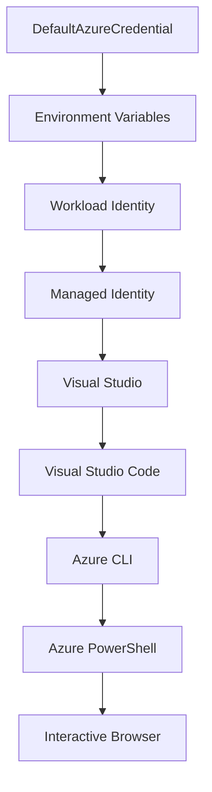

<!--
CO_OP_TRANSLATOR_METADATA:
{
  "original_hash": "4dc26ed8004b58a51875efd07203340f",
  "translation_date": "2025-09-26T18:33:46+00:00",
  "source_file": "docs/getting-started/azd-basics.md",
  "language_code": "pt"
}
-->
# AZD Básico - Compreender Azure Developer CLI

# AZD Básico - Conceitos e Fundamentos Essenciais

**Navegação do Capítulo:**
- **📚 Página Inicial do Curso**: [AZD Para Iniciantes](../../README.md)
- **📖 Capítulo Atual**: Capítulo 1 - Fundamentos & Início Rápido
- **⬅️ Anterior**: [Visão Geral do Curso](../../README.md#-chapter-1-foundation--quick-start)
- **➡️ Próximo**: [Instalação & Configuração](installation.md)
- **🚀 Próximo Capítulo**: [Capítulo 2: Desenvolvimento com Foco em IA](../ai-foundry/azure-ai-foundry-integration.md)

## Introdução

Esta lição apresenta o Azure Developer CLI (azd), uma ferramenta poderosa de linha de comando que acelera a sua jornada desde o desenvolvimento local até a implantação no Azure. Vais aprender os conceitos fundamentais, as principais funcionalidades e como o azd simplifica a implantação de aplicações nativas na cloud.

## Objetivos de Aprendizagem

Ao final desta lição, vais:
- Compreender o que é o Azure Developer CLI e o seu propósito principal
- Aprender os conceitos essenciais de templates, ambientes e serviços
- Explorar funcionalidades-chave, incluindo desenvolvimento orientado por templates e Infrastructure as Code
- Compreender a estrutura e o fluxo de trabalho de projetos azd
- Estar preparado para instalar e configurar o azd no teu ambiente de desenvolvimento

## Resultados de Aprendizagem

Após concluir esta lição, serás capaz de:
- Explicar o papel do azd nos fluxos de trabalho modernos de desenvolvimento na cloud
- Identificar os componentes da estrutura de um projeto azd
- Descrever como templates, ambientes e serviços funcionam em conjunto
- Compreender os benefícios da Infrastructure as Code com azd
- Reconhecer diferentes comandos azd e os seus propósitos

## O que é o Azure Developer CLI (azd)?

Azure Developer CLI (azd) é uma ferramenta de linha de comando projetada para acelerar a tua jornada desde o desenvolvimento local até a implantação no Azure. Simplifica o processo de construção, implantação e gestão de aplicações nativas na cloud no Azure.

## Conceitos Essenciais

### Templates
Os templates são a base do azd. Eles contêm:
- **Código da aplicação** - O teu código-fonte e dependências
- **Definições de infraestrutura** - Recursos do Azure definidos em Bicep ou Terraform
- **Ficheiros de configuração** - Definições e variáveis de ambiente
- **Scripts de implantação** - Fluxos de trabalho automatizados de implantação

### Ambientes
Os ambientes representam diferentes alvos de implantação:
- **Desenvolvimento** - Para testes e desenvolvimento
- **Staging** - Ambiente de pré-produção
- **Produção** - Ambiente de produção ao vivo

Cada ambiente mantém o seu próprio:
- Grupo de recursos do Azure
- Definições de configuração
- Estado de implantação

### Serviços
Os serviços são os blocos de construção da tua aplicação:
- **Frontend** - Aplicações web, SPAs
- **Backend** - APIs, microserviços
- **Base de Dados** - Soluções de armazenamento de dados
- **Armazenamento** - Armazenamento de ficheiros e blobs

## Funcionalidades Principais

### 1. Desenvolvimento Orientado por Templates
```bash
# Browse available templates
azd template list

# Initialize from a template
azd init --template <template-name>
```

### 2. Infrastructure as Code
- **Bicep** - Linguagem específica de domínio do Azure
- **Terraform** - Ferramenta de infraestrutura multi-cloud
- **ARM Templates** - Templates do Azure Resource Manager

### 3. Fluxos de Trabalho Integrados
```bash
# Complete deployment workflow
azd up            # Provision + Deploy this is hands off for first time setup
azd provision     # Create Azure resources if you update the infrastructure use this
azd deploy        # Deploy application code or redeploy application code once update
azd down          # Clean up resources
```

### 4. Gestão de Ambientes
```bash
# Create and manage environments
azd env new <environment-name>
azd env select <environment-name>
azd env list
```

## 📁 Estrutura do Projeto

Uma estrutura típica de projeto azd:
```
my-app/
├── .azd/                    # azd configuration
│   └── config.json
├── .azure/                  # Azure deployment artifacts
├── .devcontainer/          # Development container config
├── .github/workflows/      # GitHub Actions
├── .vscode/               # VS Code settings
├── infra/                 # Infrastructure code
│   ├── main.bicep        # Main infrastructure template
│   ├── main.parameters.json
│   └── modules/          # Reusable modules
├── src/                  # Application source code
│   ├── api/             # Backend services
│   └── web/             # Frontend application
├── azure.yaml           # azd project configuration
└── README.md
```

## 🔧 Ficheiros de Configuração

### azure.yaml
O principal ficheiro de configuração do projeto:
```yaml
name: my-awesome-app
metadata:
  template: my-template@1.0.0

services:
  web:
    project: ./src/web
    language: js
    host: appservice
  api:
    project: ./src/api
    language: js
    host: appservice

hooks:
  preprovision:
    shell: pwsh
    run: echo "Preparing to provision..."
```

### .azure/config.json
Configuração específica do ambiente:
```json
{
  "version": 1,
  "defaultEnvironment": "dev",
  "environments": {
    "dev": {
      "subscriptionId": "your-subscription-id",
      "location": "eastus"
    }
  }
}
```

## 🎪 Fluxos de Trabalho Comuns

### Iniciar um Novo Projeto
```bash
# Method 1: Use existing template
azd init --template todo-nodejs-mongo

# Method 2: Start from scratch
azd init

# Method 3: Use current directory
azd init .
```

### Ciclo de Desenvolvimento
```bash
# Set up development environment
azd auth login
azd env new dev
azd env select dev

# Deploy everything
azd up

# Make changes and redeploy
azd deploy

# Clean up when done
azd down --force --purge # command in the Azure Developer CLI is a **hard reset** for your environment—especially useful when you're troubleshooting failed deployments, cleaning up orphaned resources, or prepping for a fresh redeploy.
```

## Compreender `azd down --force --purge`
O comando `azd down --force --purge` é uma forma poderosa de desmontar completamente o teu ambiente azd e todos os recursos associados. Aqui está uma explicação do que cada parâmetro faz:
```
--force
```
- Ignora os prompts de confirmação.
- Útil para automação ou scripts onde a entrada manual não é viável.
- Garante que o processo de desmontagem prossegue sem interrupções, mesmo que a CLI detete inconsistências.

```
--purge
```
Apaga **todos os metadados associados**, incluindo:
Estado do ambiente
Pasta local `.azure`
Informações de implantação em cache
Impede que o azd "lembre-se" de implantações anteriores, o que pode causar problemas como grupos de recursos incompatíveis ou referências obsoletas de registo.

### Por que usar ambos?
Quando te deparas com problemas no `azd up` devido a estado persistente ou implantações parciais, esta combinação garante um **novo começo**.

É especialmente útil após eliminações manuais de recursos no portal do Azure ou ao mudar templates, ambientes ou convenções de nomenclatura de grupos de recursos.

### Gestão de Múltiplos Ambientes
```bash
# Create staging environment
azd env new staging
azd env select staging
azd up

# Switch back to dev
azd env select dev

# Compare environments
azd env list
```

## 🔐 Autenticação e Credenciais

Compreender a autenticação é crucial para implantações bem-sucedidas com azd. O Azure utiliza vários métodos de autenticação, e o azd aproveita a mesma cadeia de credenciais usada por outras ferramentas do Azure.

### Autenticação com Azure CLI (`az login`)

Antes de usar o azd, precisas autenticar-te com o Azure. O método mais comum é usar o Azure CLI:

```bash
# Interactive login (opens browser)
az login

# Login with specific tenant
az login --tenant <tenant-id>

# Login with service principal
az login --service-principal -u <app-id> -p <password> --tenant <tenant-id>

# Check current login status
az account show

# List available subscriptions
az account list --output table

# Set default subscription
az account set --subscription <subscription-id>
```

### Fluxo de Autenticação
1. **Login Interativo**: Abre o navegador padrão para autenticação
2. **Fluxo de Código de Dispositivo**: Para ambientes sem acesso ao navegador
3. **Service Principal**: Para cenários de automação e CI/CD
4. **Managed Identity**: Para aplicações hospedadas no Azure

### Cadeia de Credenciais DefaultAzureCredential

`DefaultAzureCredential` é um tipo de credencial que oferece uma experiência de autenticação simplificada ao tentar automaticamente várias fontes de credenciais numa ordem específica:

#### Ordem da Cadeia de Credenciais


#### 1. Variáveis de Ambiente
```bash
# Set environment variables for service principal
export AZURE_CLIENT_ID="<app-id>"
export AZURE_CLIENT_SECRET="<password>"
export AZURE_TENANT_ID="<tenant-id>"
```

#### 2. Workload Identity (Kubernetes/GitHub Actions)
Usado automaticamente em:
- Azure Kubernetes Service (AKS) com Workload Identity
- GitHub Actions com federação OIDC
- Outros cenários de identidade federada

#### 3. Managed Identity
Para recursos do Azure como:
- Máquinas Virtuais
- App Service
- Azure Functions
- Container Instances

```bash
# Check if running on Azure resource with managed identity
az account show --query "user.type" --output tsv
# Returns: "servicePrincipal" if using managed identity
```

#### 4. Integração com Ferramentas de Desenvolvimento
- **Visual Studio**: Usa automaticamente a conta autenticada
- **VS Code**: Usa as credenciais da extensão Azure Account
- **Azure CLI**: Usa as credenciais do `az login` (mais comum para desenvolvimento local)

### Configuração de Autenticação com AZD

```bash
# Method 1: Use Azure CLI (Recommended for development)
az login
azd auth login  # Uses existing Azure CLI credentials

# Method 2: Direct azd authentication
azd auth login --use-device-code  # For headless environments

# Method 3: Check authentication status
azd auth login --check-status

# Method 4: Logout and re-authenticate
azd auth logout
azd auth login
```

### Melhores Práticas de Autenticação

#### Para Desenvolvimento Local
```bash
# 1. Login with Azure CLI
az login

# 2. Verify correct subscription
az account show
az account set --subscription "Your Subscription Name"

# 3. Use azd with existing credentials
azd auth login
```

#### Para Pipelines CI/CD
```yaml
# GitHub Actions example
- name: Azure Login
  uses: azure/login@v1
  with:
    creds: ${{ secrets.AZURE_CREDENTIALS }}

- name: Deploy with azd
  run: |
    azd auth login --client-id ${{ secrets.AZURE_CLIENT_ID }} \
                    --client-secret ${{ secrets.AZURE_CLIENT_SECRET }} \
                    --tenant-id ${{ secrets.AZURE_TENANT_ID }}
    azd up --no-prompt
```

#### Para Ambientes de Produção
- Usa **Managed Identity** ao executar em recursos do Azure
- Usa **Service Principal** para cenários de automação
- Evita armazenar credenciais em código ou ficheiros de configuração
- Usa **Azure Key Vault** para configurações sensíveis

### Problemas Comuns de Autenticação e Soluções

#### Problema: "Nenhuma subscrição encontrada"
```bash
# Solution: Set default subscription
az account list --output table
az account set --subscription "<subscription-id>"
azd env set AZURE_SUBSCRIPTION_ID "<subscription-id>"
```

#### Problema: "Permissões insuficientes"
```bash
# Solution: Check and assign required roles
az role assignment list --assignee $(az account show --query user.name --output tsv)

# Common required roles:
# - Contributor (for resource management)
# - User Access Administrator (for role assignments)
```

#### Problema: "Token expirado"
```bash
# Solution: Re-authenticate
az logout
az login
azd auth logout
azd auth login
```

### Autenticação em Diferentes Cenários

#### Desenvolvimento Local
```bash
# Personal development account
az login
azd auth login
```

#### Desenvolvimento em Equipa
```bash
# Use specific tenant for organization
az login --tenant contoso.onmicrosoft.com
azd auth login
```

#### Cenários Multi-tenant
```bash
# Switch between tenants
az login --tenant tenant1.onmicrosoft.com
# Deploy to tenant 1
azd up

az login --tenant tenant2.onmicrosoft.com  
# Deploy to tenant 2
azd up
```

### Considerações de Segurança

1. **Armazenamento de Credenciais**: Nunca armazenes credenciais no código-fonte
2. **Limitação de Escopo**: Usa o princípio de menor privilégio para service principals
3. **Rotação de Tokens**: Roda regularmente os segredos de service principal
4. **Rastreabilidade**: Monitoriza atividades de autenticação e implantação
5. **Segurança de Rede**: Usa endpoints privados sempre que possível

### Resolução de Problemas de Autenticação

```bash
# Debug authentication issues
azd auth login --check-status
az account show
az account get-access-token

# Common diagnostic commands
whoami                          # Current user context
az ad signed-in-user show      # Azure AD user details
az group list                  # Test resource access
```

## Compreender `azd down --force --purge`

### Descoberta
```bash
azd template list              # Browse templates
azd template show <template>   # Template details
azd init --help               # Initialization options
```

### Gestão de Projetos
```bash
azd show                     # Project overview
azd env show                 # Current environment
azd config list             # Configuration settings
```

### Monitorização
```bash
azd monitor                  # Open Azure portal
azd pipeline config          # Set up CI/CD
azd logs                     # View application logs
```

## Melhores Práticas

### 1. Usa Nomes Significativos
```bash
# Good
azd env new production-east
azd init --template web-app-secure

# Avoid
azd env new env1
azd init --template template1
```

### 2. Aproveita os Templates
- Começa com templates existentes
- Personaliza conforme as tuas necessidades
- Cria templates reutilizáveis para a tua organização

### 3. Isolamento de Ambientes
- Usa ambientes separados para dev/staging/prod
- Nunca faças deploy diretamente para produção a partir da máquina local
- Usa pipelines CI/CD para implantações em produção

### 4. Gestão de Configuração
- Usa variáveis de ambiente para dados sensíveis
- Mantém a configuração sob controlo de versão
- Documenta as definições específicas de cada ambiente

## Progressão de Aprendizagem

### Iniciante (Semana 1-2)
1. Instalar azd e autenticar
2. Fazer deploy de um template simples
3. Compreender a estrutura do projeto
4. Aprender comandos básicos (up, down, deploy)

### Intermediário (Semana 3-4)
1. Personalizar templates
2. Gerir múltiplos ambientes
3. Compreender código de infraestrutura
4. Configurar pipelines CI/CD

### Avançado (Semana 5+)
1. Criar templates personalizados
2. Padrões avançados de infraestrutura
3. Implantações multi-região
4. Configurações de nível empresarial

## Próximos Passos

**📖 Continua a Aprendizagem do Capítulo 1:**
- [Instalação & Configuração](installation.md) - Instalar e configurar o azd
- [O Teu Primeiro Projeto](first-project.md) - Tutorial prático completo
- [Guia de Configuração](configuration.md) - Opções avançadas de configuração

**🎯 Pronto para o Próximo Capítulo?**
- [Capítulo 2: Desenvolvimento com Foco em IA](../ai-foundry/azure-ai-foundry-integration.md) - Começa a construir aplicações de IA

## Recursos Adicionais

- [Visão Geral do Azure Developer CLI](https://learn.microsoft.com/en-us/azure/developer/azure-developer-cli/)
- [Galeria de Templates](https://azure.github.io/awesome-azd/)
- [Exemplos da Comunidade](https://github.com/Azure-Samples)

---

**Navegação do Capítulo:**
- **📚 Página Inicial do Curso**: [AZD Para Iniciantes](../../README.md)
- **📖 Capítulo Atual**: Capítulo 1 - Fundamentos & Início Rápido  
- **⬅️ Anterior**: [Visão Geral do Curso](../../README.md#-chapter-1-foundation--quick-start)
- **➡️ Próximo**: [Instalação & Configuração](installation.md)
- **🚀 Próximo Capítulo**: [Capítulo 2: Desenvolvimento com Foco em IA](../ai-foundry/azure-ai-foundry-integration.md)

---

