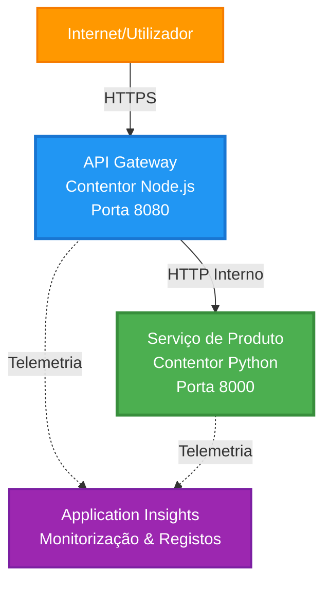
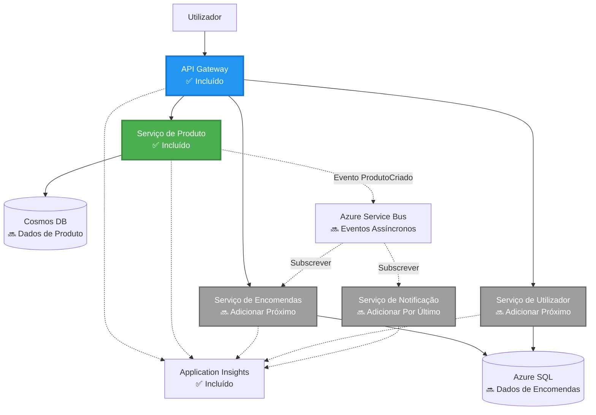
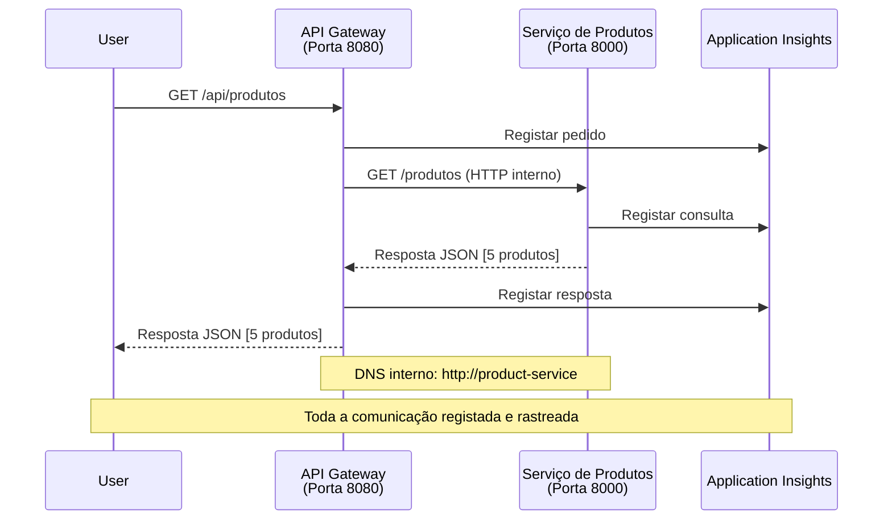

<!--
CO_OP_TRANSLATOR_METADATA:
{
  "original_hash": "eb3a4803a1e80a7f2e64f6bf63738c0f",
  "translation_date": "2025-11-19T21:21:00+00:00",
  "source_file": "examples/microservices/README.md",
  "language_code": "pt"
}
-->
# Arquitetura de Microserviços - Exemplo de Aplicação em Contêiner

⏱️ **Tempo Estimado**: 25-35 minutos | 💰 **Custo Estimado**: ~$50-100/mês | ⭐ **Complexidade**: Avançado

**📚 Caminho de Aprendizagem:**
- ← Anterior: [API Flask Simples](../../../../examples/container-app/simple-flask-api) - Conceitos básicos de contêiner único
- 🎯 **Você Está Aqui**: Arquitetura de Microserviços (base com 2 serviços)
- → Próximo: [Integração com IA](../../../../docs/ai-foundry) - Adicione inteligência aos seus serviços
- 🏠 [Página Inicial do Curso](../../README.md)

---

Uma **arquitetura de microserviços simplificada, mas funcional**, implantada no Azure Container Apps usando o AZD CLI. Este exemplo demonstra comunicação entre serviços, orquestração de contêineres e monitorização com uma configuração prática de 2 serviços.

> **📚 Abordagem de Aprendizagem**: Este exemplo começa com uma arquitetura mínima de 2 serviços (API Gateway + Serviço Backend) que você pode realmente implantar e aprender. Após dominar esta base, fornecemos orientações para expandir para um ecossistema completo de microserviços.

## O Que Você Vai Aprender

Ao concluir este exemplo, você irá:
- Implantar múltiplos contêineres no Azure Container Apps
- Implementar comunicação entre serviços com rede interna
- Configurar escalonamento baseado em ambiente e verificações de integridade
- Monitorizar aplicações distribuídas com o Application Insights
- Compreender padrões de implantação de microserviços e melhores práticas
- Aprender a expansão progressiva de arquiteturas simples para complexas

## Arquitetura

### Fase 1: O Que Estamos Construindo (Incluído Neste Exemplo)


**Detalhes dos Componentes:**

| Componente         | Finalidade                                   | Acesso         | Recursos                     |
|--------------------|----------------------------------------------|----------------|------------------------------|
| **API Gateway**    | Roteia solicitações externas para serviços backend | Público (HTTPS) | 1 vCPU, 2GB RAM, 2-20 réplicas |
| **Serviço de Produtos** | Gerencia catálogo de produtos com dados em memória | Apenas interno | 0.5 vCPU, 1GB RAM, 1-10 réplicas |
| **Application Insights** | Logging centralizado e rastreamento distribuído | Portal Azure   | 1-2 GB/mês de ingestão de dados |

**Por Que Começar Simples?**
- ✅ Implante e compreenda rapidamente (25-35 minutos)
- ✅ Aprenda padrões básicos de microserviços sem complexidade
- ✅ Código funcional que você pode modificar e experimentar
- ✅ Custo mais baixo para aprendizado (~$50-100/mês vs $300-1400/mês)
- ✅ Ganhe confiança antes de adicionar bases de dados e filas de mensagens

**Analogia**: Pense nisso como aprender a dirigir. Você começa em um estacionamento vazio (2 serviços), domina o básico e depois progride para o trânsito da cidade (5+ serviços com bases de dados).

### Fase 2: Expansão Futura (Arquitetura de Referência)

Depois de dominar a arquitetura de 2 serviços, você pode expandir para:


Consulte a seção "Guia de Expansão" no final para instruções passo a passo.

## Funcionalidades Incluídas

✅ **Descoberta de Serviços**: Descoberta automática baseada em DNS entre contêineres  
✅ **Balanceamento de Carga**: Balanceamento de carga integrado entre réplicas  
✅ **Autoescalonamento**: Escalonamento independente por serviço baseado em solicitações HTTP  
✅ **Monitorização de Integridade**: Probes de liveness e readiness para ambos os serviços  
✅ **Logging Distribuído**: Logging centralizado com Application Insights  
✅ **Rede Interna**: Comunicação segura entre serviços  
✅ **Orquestração de Contêineres**: Implantação e escalonamento automáticos  
✅ **Atualizações Sem Interrupções**: Atualizações contínuas com gerenciamento de revisões  

## Pré-requisitos

### Ferramentas Necessárias

Antes de começar, verifique se você tem estas ferramentas instaladas:

1. **[Azure Developer CLI (azd)](https://learn.microsoft.com/azure/developer/azure-developer-cli/install-azd)** (versão 1.0.0 ou superior)  
   ```bash
   azd version
   # Saída esperada: versão azd 1.0.0 ou superior
   ```

2. **[Azure CLI](https://learn.microsoft.com/cli/azure/install-azure-cli)** (versão 2.50.0 ou superior)  
   ```bash
   az --version
   # Saída esperada: azure-cli 2.50.0 ou superior
   ```

3. **[Docker](https://www.docker.com/get-started)** (para desenvolvimento/testes locais - opcional)  
   ```bash
   docker --version
   # Saída esperada: versão do Docker 20.10 ou superior
   ```

### Verifique Sua Configuração

Execute estes comandos para confirmar que está tudo pronto:

```bash
# Verificar Azure Developer CLI
azd version
# ✅ Esperado: azd versão 1.0.0 ou superior

# Verificar Azure CLI
az --version
# ✅ Esperado: azure-cli 2.50.0 ou superior

# Verificar Docker (opcional)
docker --version
# ✅ Esperado: Docker versão 20.10 ou superior
```

**Critério de Sucesso**: Todos os comandos retornam números de versão iguais ou superiores aos mínimos exigidos.

### Requisitos do Azure

- Uma **subscrição ativa do Azure** ([crie uma conta gratuita](https://azure.microsoft.com/free/))
- Permissões para criar recursos na sua subscrição
- Papel de **Colaborador** na subscrição ou grupo de recursos

### Conhecimentos Necessários

Este é um exemplo de nível **avançado**. Você deve ter:
- Concluído o [exemplo de API Flask Simples](../../../../examples/container-app/simple-flask-api) 
- Compreensão básica de arquitetura de microserviços
- Familiaridade com APIs REST e HTTP
- Entendimento de conceitos de contêineres

**Novo no Container Apps?** Comece com o [exemplo de API Flask Simples](../../../../examples/container-app/simple-flask-api) para aprender o básico.

## Início Rápido (Passo a Passo)

### Passo 1: Clone e Navegue

```bash
git clone https://github.com/microsoft/AZD-for-beginners.git
cd AZD-for-beginners/examples/microservices
```

**✓ Verificação de Sucesso**: Verifique se você vê `azure.yaml`:
```bash
ls
# Esperado: README.md, azure.yaml, infra/, src/
```

### Passo 2: Autentique-se no Azure

```bash
azd auth login
```

Isso abrirá o navegador para autenticação no Azure. Faça login com suas credenciais do Azure.

**✓ Verificação de Sucesso**: Você deve ver:
```
Logged in to Azure.
```

### Passo 3: Inicialize o Ambiente

```bash
azd init
```

**Perguntas que você verá**:
- **Nome do ambiente**: Insira um nome curto (ex.: `microservices-dev`)
- **Subscrição do Azure**: Selecione sua subscrição
- **Localização do Azure**: Escolha uma região (ex.: `eastus`, `westeurope`)

**✓ Verificação de Sucesso**: Você deve ver:
```
SUCCESS: New project initialized!
```

### Passo 4: Implemente a Infraestrutura e os Serviços

```bash
azd up
```

**O que acontece** (leva de 8 a 12 minutos):

```mermaid
graph LR
    A[azd up] --> B[Criar Grupo de Recursos]
    B --> C[Implementar Registo de Contentores]
    C --> D[Implementar Análise de Registos]
    D --> E[Implementar App Insights]
    E --> F[Criar Ambiente de Contentores]
    F --> G[Construir Imagem do API Gateway]
    F --> H[Construir Imagem do Serviço de Produtos]
    G --> I[Enviar para o Registo]
    H --> I
    I --> J[Implementar API Gateway]
    I --> K[Implementar Serviço de Produtos]
    J --> L[Configurar Ingress & Verificações de Saúde]
    K --> L
    L --> M[Implementação Concluída ✓]
    
    style A fill:#2196F3,stroke:#1976D2,stroke-width:3px,color:#fff
    style M fill:#4CAF50,stroke:#388E3C,stroke-width:3px,color:#fff
```


**✓ Verificação de Sucesso**: Você deve ver:
```
SUCCESS: Your application was deployed to Azure in X minutes Y seconds.
Endpoint: https://api-gateway-<unique-id>.azurecontainerapps.io
```

**⏱️ Tempo**: 8-12 minutos

### Passo 5: Teste a Implantação

```bash
# Obter o endpoint do gateway
GATEWAY_URL=$(azd env get-values | grep API_GATEWAY_URL | cut -d '=' -f2 | tr -d '"')

# Testar a saúde do API Gateway
curl $GATEWAY_URL/health
```

**✅ Saída esperada:**
```json
{
  "status": "healthy",
  "service": "api-gateway",
  "timestamp": "2025-11-19T10:30:00Z"
}
```

**Teste o serviço de produtos através do gateway**:
```bash
# Listar produtos
curl $GATEWAY_URL/api/products
```

**✅ Saída esperada:**
```json
[
  {"id":1,"name":"Laptop","price":999.99,"stock":50},
  {"id":2,"name":"Mouse","price":29.99,"stock":200},
  {"id":3,"name":"Keyboard","price":79.99,"stock":150}
]
```

**✓ Verificação de Sucesso**: Ambos os endpoints retornam dados JSON sem erros.

---

**🎉 Parabéns!** Você implantou uma arquitetura de microserviços no Azure!

## Estrutura do Projeto

Todos os arquivos de implementação estão incluídos—este é um exemplo completo e funcional:

```
microservices/
│
├── README.md                         # This file
├── azure.yaml                        # AZD configuration
├── .gitignore                        # Git ignore patterns
│
├── infra/                           # Infrastructure as Code (Bicep)
│   ├── main.bicep                   # Main orchestration
│   ├── abbreviations.json           # Naming conventions
│   ├── core/                        # Shared infrastructure
│   │   ├── container-apps-environment.bicep  # Container environment + registry
│   │   └── monitor.bicep            # Application Insights + Log Analytics
│   └── app/                         # Service definitions
│       ├── api-gateway.bicep        # API Gateway container app
│       └── product-service.bicep    # Product Service container app
│
└── src/                             # Application source code
    ├── api-gateway/                 # Node.js API Gateway
    │   ├── app.js                   # Express server with routing
    │   ├── package.json             # Node dependencies
    │   └── Dockerfile               # Container definition
    └── product-service/             # Python Product Service
        ├── main.py                  # Flask API with product data
        ├── requirements.txt         # Python dependencies
        └── Dockerfile               # Container definition
```

**O Que Cada Componente Faz:**

**Infraestrutura (infra/)**:
- `main.bicep`: Orquestra todos os recursos do Azure e suas dependências
- `core/container-apps-environment.bicep`: Cria o ambiente do Container Apps e o Azure Container Registry
- `core/monitor.bicep`: Configura o Application Insights para logging distribuído
- `app/*.bicep`: Definições individuais de aplicativos em contêiner com escalonamento e verificações de integridade

**API Gateway (src/api-gateway/)**:
- Serviço voltado ao público que roteia solicitações para serviços backend
- Implementa logging, tratamento de erros e encaminhamento de solicitações
- Demonstra comunicação HTTP entre serviços

**Serviço de Produtos (src/product-service/)**:
- Serviço interno com catálogo de produtos (em memória para simplicidade)
- API REST com verificações de integridade
- Exemplo de padrão de microserviço backend

## Visão Geral dos Serviços

### API Gateway (Node.js/Express)

**Porta**: 8080  
**Acesso**: Público (ingresso externo)  
**Finalidade**: Roteia solicitações recebidas para os serviços backend apropriados  

**Endpoints**:
- `GET /` - Informações do serviço
- `GET /health` - Endpoint de verificação de integridade
- `GET /api/products` - Encaminha para o serviço de produtos (lista todos)
- `GET /api/products/:id` - Encaminha para o serviço de produtos (obter por ID)

**Principais Funcionalidades**:
- Roteamento de solicitações com axios
- Logging centralizado
- Tratamento de erros e gerenciamento de tempo limite
- Descoberta de serviços via variáveis de ambiente
- Integração com Application Insights

**Destaque de Código** (`src/api-gateway/app.js`):
```javascript
// Comunicação interna de serviço
app.get('/api/products', async (req, res) => {
  const response = await axios.get(`${PRODUCT_SERVICE_URL}/products`, {
    timeout: 5000
  });
  res.json(response.data);
});
```

### Serviço de Produtos (Python/Flask)

**Porta**: 8000  
**Acesso**: Apenas interno (sem ingresso externo)  
**Finalidade**: Gerencia o catálogo de produtos com dados em memória  

**Endpoints**:
- `GET /` - Informações do serviço
- `GET /health` - Endpoint de verificação de integridade
- `GET /products` - Lista todos os produtos
- `GET /products/<id>` - Obtém produto por ID

**Principais Funcionalidades**:
- API RESTful com Flask
- Armazenamento de produtos em memória (simples, sem necessidade de base de dados)
- Monitorização de integridade com probes
- Logging estruturado
- Integração com Application Insights

**Modelo de Dados**:
```python
{
  "id": 1,
  "name": "Laptop",
  "description": "High-performance laptop",
  "price": 999.99,
  "stock": 50
}
```

**Por Que Apenas Interno?**
O serviço de produtos não é exposto publicamente. Todas as solicitações devem passar pelo API Gateway, que fornece:
- Segurança: Ponto de acesso controlado
- Flexibilidade: Pode alterar o backend sem impactar os clientes
- Monitorização: Logging centralizado de solicitações

## Compreendendo a Comunicação Entre Serviços

### Como os Serviços se Comunicarem


Neste exemplo, o API Gateway comunica-se com o Serviço de Produtos usando **chamadas HTTP internas**:

```javascript
// Gateway de API (src/api-gateway/app.js)
const PRODUCT_SERVICE_URL = process.env.PRODUCT_SERVICE_URL;

// Fazer pedido HTTP interno
const response = await axios.get(`${PRODUCT_SERVICE_URL}/products`);
```

**Pontos-Chave**:

1. **Descoberta Baseada em DNS**: O Container Apps fornece automaticamente DNS para serviços internos
   - FQDN do Serviço de Produtos: `product-service.internal.<environment>.azurecontainerapps.io`
   - Simplificado como: `http://product-service` (o Container Apps resolve isso)

2. **Sem Exposição Pública**: O Serviço de Produtos tem `external: false` no Bicep
   - Apenas acessível dentro do ambiente do Container Apps
   - Não pode ser alcançado pela internet

3. **Variáveis de Ambiente**: URLs dos serviços são injetados no momento da implantação
   - O Bicep passa o FQDN interno para o gateway
   - Sem URLs hardcoded no código da aplicação

**Analogia**: Pense nisso como salas de escritório. O API Gateway é a recepção (voltada ao público), e o Serviço de Produtos é uma sala de escritório (apenas interno). Os visitantes devem passar pela recepção para acessar qualquer sala.

## Opções de Implantação

### Implantação Completa (Recomendada)

```bash
# Implementar infraestrutura e ambos os serviços
azd up
```

Isso implanta:
1. Ambiente do Container Apps
2. Application Insights
3. Container Registry
4. Contêiner do API Gateway
5. Contêiner do Serviço de Produtos

**Tempo**: 8-12 minutos

### Implantar Serviço Individual

```bash
# Implementar apenas um serviço (após o azd up inicial)
azd deploy api-gateway

# Ou implementar o serviço de produto
azd deploy product-service
```

**Caso de Uso**: Quando você atualizou o código em um serviço e deseja reimplantá-lo individualmente.

### Atualizar Configuração

```bash
# Alterar parâmetros de escala
azd env set GATEWAY_MAX_REPLICAS 30

# Reimplementar com nova configuração
azd up
```

## Configuração

### Configuração de Escalonamento

Ambos os serviços estão configurados com autoescalonamento baseado em HTTP em seus arquivos Bicep:

**API Gateway**:
- Réplicas mínimas: 2 (sempre pelo menos 2 para disponibilidade)
- Réplicas máximas: 20
- Gatilho de escalonamento: 50 solicitações simultâneas por réplica

**Serviço de Produtos**:
- Réplicas mínimas: 1 (pode escalar para zero, se necessário)
- Réplicas máximas: 10
- Gatilho de escalonamento: 100 solicitações simultâneas por réplica

**Personalizar Escalonamento** (em `infra/app/*.bicep`):
```bicep
scale: {
  minReplicas: 1
  maxReplicas: 10
  rules: [
    {
      name: 'http-scale-rule'
      http: {
        metadata: {
          concurrentRequests: '100'  // Adjust this
        }
      }
    }
  ]
}
```

### Alocação de Recursos

**API Gateway**:
- CPU: 1.0 vCPU
- Memória: 2 GiB
- Motivo: Lida com todo o tráfego externo

**Serviço de Produtos**:
- CPU: 0.5 vCPU
- Memória: 1 GiB
- Motivo: Operações leves em memória

### Verificações de Integridade

Ambos os serviços incluem probes de liveness e readiness:

```bicep
probes: [
  {
    type: 'Liveness'
    httpGet: {
      path: '/health'
      port: 8080
    }
    initialDelaySeconds: 10
    periodSeconds: 30
  }
  {
    type: 'Readiness'
    httpGet: {
      path: '/health'
      port: 8080
    }
    initialDelaySeconds: 5
    periodSeconds: 10
  }
]
```

**O Que Isso Significa**:
- **Liveness**: Se a verificação de integridade falhar, o Container Apps reinicia o contêiner
- **Readiness**: Se não estiver pronto, o Container Apps para de rotear tráfego para essa réplica

## Monitorização e Observabilidade

### Visualizar Logs de Serviços

```bash
# Transmitir registos do API Gateway
azd logs api-gateway --follow

# Ver registos recentes do serviço de produtos
azd logs product-service --tail 100

# Ver todos os registos de ambos os serviços
azd logs --follow
```

**Saída Esperada**:
```
[api-gateway] API Gateway listening on port 8080
[api-gateway] Product Service URL: http://product-service
[api-gateway] GET /api/products 200 - 45ms
[product-service] Retrieved 5 products
```

### Consultas no Application Insights

Acesse o Application Insights no Portal Azure e execute estas consultas:

**Encontrar Solicitações Lentas**:
```kusto
requests
| where timestamp > ago(1h)
| where duration > 1000  // Requests taking >1 second
| summarize count() by name, cloud_RoleName
| order by count_ desc
```

**Rastrear Chamadas Entre Serviços**:
```kusto
dependencies
| where timestamp > ago(1h)
| where type == "Http"
| project timestamp, name, target, duration, success
| order by timestamp desc
```

**Taxa de Erro por Serviço**:
```kusto
exceptions
| where timestamp > ago(24h)
| summarize errorCount = count() by cloud_RoleName, type
| order by errorCount desc
```

**Volume de Solicitações ao Longo do Tempo**:
```kusto
requests
| where timestamp > ago(1h)
| summarize requestCount = count() by bin(timestamp, 5m), cloud_RoleName
| render timechart
```

### Acessar o Painel de Monitorização

```bash
# Obter detalhes do Application Insights
azd env get-values | grep APPLICATIONINSIGHTS

# Abrir monitorização do Portal Azure
az monitor app-insights component show \
  --app $(azd env get-values | grep APPLICATIONINSIGHTS_CONNECTION_STRING | cut -d '=' -f2) \
  --resource-group $(azd env get-values | grep AZURE_RESOURCE_GROUP | cut -d '=' -f2) \
  --query "appId" -o tsv
```

### Métricas em Tempo Real

1. Navegue até o Application Insights no Portal Azure
2. Clique em "Métricas em Tempo Real"
3. Veja solicitações, falhas e desempenho em tempo real
4. Teste executando: `curl $(azd env get-values | grep API_GATEWAY_URL | cut -d '=' -f2 | tr -d '"')/api/products`

## Exercícios Práticos

### Exercício 1: Adicionar um Novo Endpoint de Produto ⭐ (Fácil)

**Objetivo**: Adicionar um endpoint POST para criar novos produtos

**Ponto de Partida**: `src/product-service/main.py`

**Passos**:

1. Adicione este endpoint após a função `get_product` em `main.py`:

```python
@app.route('/products', methods=['POST'])
def create_product():
    """Create a new product"""
    data = request.get_json()
    
    # Validar campos obrigatórios
    if not data or 'name' not in data or 'price' not in data:
        return jsonify({'error': 'Missing required fields: name, price'}), 400
    
    new_id = max(p['id'] for p in products) + 1
    new_product = {
        'id': new_id,
        'name': data['name'],
        'description': data.get('description', ''),
        'price': float(data['price']),
        'stock': int(data.get('stock', 0))
    }
    products.append(new_product)
    logger.info(f"Created product {new_id}")
    return jsonify(new_product), 201
```

2. Adicione a rota POST ao API Gateway (`src/api-gateway/app.js`):

```javascript
// Adicione isto após a rota GET /api/products
app.post('/api/products', async (req, res) => {
  try {
    console.log(`Forwarding POST request to ${PRODUCT_SERVICE_URL}/products`);
    const response = await axios.post(`${PRODUCT_SERVICE_URL}/products`, req.body, {
      timeout: 5000
    });
    res.status(201).json(response.data);
  } catch (error) {
    console.error('Error calling product service:', error.message);
    res.status(503).json({
      error: 'Product service unavailable',
      message: error.message
    });
  }
});
```

3. Reimplemente ambos os serviços:

```bash
azd deploy product-service
azd deploy api-gateway
```

4. Teste o novo endpoint:

```bash
GATEWAY_URL=$(azd env get-values | grep API_GATEWAY_URL | cut -d '=' -f2 | tr -d '"')

# Criar um novo produto
curl -X POST $GATEWAY_URL/api/products \
  -H "Content-Type: application/json" \
  -d '{"name":"USB Cable","price":9.99,"stock":500}'
```

**✅ Resultado esperado:**
```json
{"id":6,"name":"USB Cable","description":"","price":9.99,"stock":500}
```

5. Verifique se aparece na lista:

```bash
curl $GATEWAY_URL/api/products
# Deve agora mostrar 6 produtos incluindo o novo Cabo USB
```

**Critérios de Sucesso**:
- ✅ A solicitação POST retorna HTTP 201
- ✅ O novo produto aparece na lista GET /api/products
- ✅ O produto possui um ID auto-incrementado

**Tempo**: 10-15 minutos

---

### Exercício 2: Modificar Regras de Autoscaling ⭐⭐ (Médio)

**Objetivo**: Alterar o Product Service para escalar de forma mais agressiva

**Ponto de Partida**: `infra/app/product-service.bicep`

**Passos**:

1. Abra `infra/app/product-service.bicep` e localize o bloco `scale` (por volta da linha 95)

2. Altere de:
```bicep
scale: {
  minReplicas: 1
  maxReplicas: 10
  rules: [
    {
      name: 'http-scale-rule'
      http: {
        metadata: {
          concurrentRequests: '100'  // OLD
        }
      }
    }
  ]
}
```

Para:
```bicep
scale: {
  minReplicas: 2  // Always have 2 running
  maxReplicas: 20  // Allow more scaling
  rules: [
    {
      name: 'http-scale-rule'
      http: {
        metadata: {
          concurrentRequests: '20'  // Scale at lower threshold
        }
      }
    }
  ]
}
```

3. Reimplemente a infraestrutura:

```bash
azd up
```

4. Verifique a nova configuração de escalonamento:

```bash
az containerapp show \
  --name $(azd env get-values | grep PRODUCT_SERVICE | head -1 | cut -d '/' -f5) \
  --resource-group $(azd env get-values | grep AZURE_RESOURCE_GROUP | cut -d '=' -f2 | tr -d '"') \
  --query "properties.template.scale" -o json
```

**✅ Resultado esperado:**
```json
{
  "minReplicas": 2,
  "maxReplicas": 20,
  "rules": [...]
}
```

5. Teste o autoscaling com carga:

```bash
# Gerar pedidos concorrentes
for i in {1..500}; do curl $GATEWAY_URL/api/products & done

# Observar o escalonamento a acontecer
azd logs product-service --follow
# Procurar por: Eventos de escalonamento de Container Apps
```

**Critérios de Sucesso**:
- ✅ O Product Service sempre executa pelo menos 2 réplicas
- ✅ Sob carga, escala para mais de 2 réplicas
- ✅ O Portal Azure mostra as novas regras de escalonamento

**Tempo**: 15-20 minutos

---

### Exercício 3: Adicionar Consulta de Monitorização Personalizada ⭐⭐ (Médio)

**Objetivo**: Criar uma consulta personalizada no Application Insights para monitorizar o desempenho da API de produtos

**Passos**:

1. Navegue até o Application Insights no Portal Azure:
   - Acesse o Portal Azure
   - Encontre o seu grupo de recursos (rg-microservices-*)
   - Clique no recurso Application Insights

2. Clique em "Logs" no menu à esquerda

3. Crie esta consulta:

```kusto
requests
| where timestamp > ago(1h)
| where name contains "products"
| summarize 
    RequestCount = count(),
    AvgDuration = avg(duration),
    P95Duration = percentile(duration, 95),
    SuccessRate = 100.0 * countif(success == true) / count()
  by bin(timestamp, 5m)
| render timechart
```

4. Clique em "Executar" para rodar a consulta

5. Guarde a consulta:
   - Clique em "Guardar"
   - Nome: "Desempenho da API de Produtos"
   - Categoria: "Desempenho"

6. Gere tráfego de teste:

```bash
for i in {1..100}; do curl $GATEWAY_URL/api/products; sleep 1; done
```

7. Atualize a consulta para ver os dados

**✅ Resultado esperado:**
- Gráfico mostrando contagem de solicitações ao longo do tempo
- Duração média < 500ms
- Taxa de sucesso = 100%
- Intervalos de tempo de 5 minutos

**Critérios de Sucesso**:
- ✅ A consulta mostra 100+ solicitações
- ✅ Taxa de sucesso é 100%
- ✅ Duração média < 500ms
- ✅ O gráfico exibe intervalos de tempo de 5 minutos

**Resultado de Aprendizagem**: Compreender como monitorizar o desempenho de serviços com consultas personalizadas

**Tempo**: 10-15 minutos

---

### Exercício 4: Implementar Lógica de Reintento ⭐⭐⭐ (Avançado)

**Objetivo**: Adicionar lógica de reintento ao API Gateway quando o Product Service estiver temporariamente indisponível

**Ponto de Partida**: `src/api-gateway/app.js`

**Passos**:

1. Instale a biblioteca de reintento:

```bash
cd src/api-gateway
npm install axios-retry --save
cd ../..
```

2. Atualize `src/api-gateway/app.js` (adicione após a importação do axios):

```javascript
const axiosRetry = require('axios-retry');

// Configurar lógica de repetição
axiosRetry(axios, {
  retries: 3,
  retryDelay: (retryCount) => {
    return retryCount * 1000; // 1s, 2s, 3s
  },
  retryCondition: (error) => {
    // Repetir em erros de rede ou respostas 5xx
    return axiosRetry.isNetworkOrIdempotentRequestError(error) ||
           (error.response && error.response.status >= 500);
  }
});

console.log('Retry logic configured: 3 retries with exponential backoff');
```

3. Reimplemente o API Gateway:

```bash
azd deploy api-gateway
```

4. Teste o comportamento de reintento simulando falha no serviço:

```bash
# Escalar o serviço de produtos para 0 (simular falha)
az containerapp update \
  --name $(azd env get-values | grep PRODUCT_SERVICE | head -1 | cut -d '/' -f5) \
  --resource-group $(azd env get-values | grep AZURE_RESOURCE_GROUP | cut -d '=' -f2 | tr -d '"') \
  --min-replicas 0 \
  --max-replicas 0

# Tentar aceder aos produtos (irá tentar novamente 3 vezes)
time curl -v $GATEWAY_URL/api/products
# Observar: A resposta demora ~6 segundos (1s + 2s + 3s tentativas)

# Restaurar o serviço de produtos
az containerapp update \
  --name $(azd env get-values | grep PRODUCT_SERVICE | head -1 | cut -d '/' -f5) \
  --resource-group $(azd env get-values | grep AZURE_RESOURCE_GROUP | cut -d '=' -f2 | tr -d '"') \
  --min-replicas 1 \
  --max-replicas 10
```

5. Veja os logs de reintento:

```bash
azd logs api-gateway --tail 50
# Procurar por: Mensagens de tentativa de repetição
```

**✅ Comportamento esperado:**
- As solicitações tentam novamente 3 vezes antes de falhar
- Cada reintento espera mais tempo (1s, 2s, 3s)
- Solicitações bem-sucedidas após o reinício do serviço
- Os logs mostram as tentativas de reintento

**Critérios de Sucesso**:
- ✅ As solicitações tentam novamente 3 vezes antes de falhar
- ✅ Cada reintento espera mais tempo (backoff exponencial)
- ✅ Solicitações bem-sucedidas após o reinício do serviço
- ✅ Os logs mostram as tentativas de reintento

**Resultado de Aprendizagem**: Compreender padrões de resiliência em microsserviços (circuit breakers, reintentos, timeouts)

**Tempo**: 20-25 minutos

---

## Ponto de Verificação de Conhecimento

Após completar este exemplo, verifique o seu entendimento:

### 1. Comunicação entre Serviços ✓

Teste o seu conhecimento:
- [ ] Consegue explicar como o API Gateway descobre o Product Service? (Descoberta de serviço baseada em DNS)
- [ ] O que acontece se o Product Service estiver inativo? (O Gateway retorna erro 503)
- [ ] Como adicionaria um terceiro serviço? (Criar novo ficheiro Bicep, adicionar ao main.bicep, criar pasta src)

**Verificação Prática**:
```bash
# Simular falha de serviço
az containerapp update --name <product-service-name> --min-replicas 0 --max-replicas 0
curl $GATEWAY_URL/api/products
# ✅ Esperado: 503 Serviço Indisponível

# Restaurar serviço
az containerapp update --name <product-service-name> --min-replicas 1 --max-replicas 10
```

### 2. Monitorização e Observabilidade ✓

Teste o seu conhecimento:
- [ ] Onde vê logs distribuídos? (Application Insights no Portal Azure)
- [ ] Como rastrear solicitações lentas? (Consulta Kusto: `requests | where duration > 1000`)
- [ ] Consegue identificar qual serviço causou um erro? (Verifique o campo `cloud_RoleName` nos logs)

**Verificação Prática**:
```bash
# Gerar uma simulação de pedido lento
curl "$GATEWAY_URL/api/products?delay=2000"

# Consultar o Application Insights para pedidos lentos
# Navegar para o Portal Azure → Application Insights → Logs
# Executar: requests | where duration > 1000 | project timestamp, name, duration, cloud_RoleName
```

### 3. Escalabilidade e Desempenho ✓

Teste o seu conhecimento:
- [ ] O que desencadeia o autoscaling? (Regras de solicitações HTTP simultâneas: 50 para o gateway, 100 para o produto)
- [ ] Quantas réplicas estão a ser executadas agora? (Verifique com `az containerapp revision list`)
- [ ] Como escalaria o Product Service para 5 réplicas? (Atualize minReplicas no Bicep)

**Verificação Prática**:
```bash
# Gerar carga para testar o dimensionamento automático
for i in {1..1000}; do curl $GATEWAY_URL/api/products & done

# Observar o aumento de réplicas
azd logs api-gateway --follow
# ✅ Esperado: Ver eventos de dimensionamento nos registos
```

**Critérios de Sucesso**: Consegue responder a todas as perguntas e verificar com comandos práticos.

---

## Análise de Custos

### Custos Mensais Estimados (Para Este Exemplo de 2 Serviços)

| Recurso | Configuração | Custo Estimado |
|---------|--------------|----------------|
| API Gateway | 2-20 réplicas, 1 vCPU, 2GB RAM | $30-150 |
| Product Service | 1-10 réplicas, 0.5 vCPU, 1GB RAM | $15-75 |
| Container Registry | Nível básico | $5 |
| Application Insights | 1-2 GB/mês | $5-10 |
| Log Analytics | 1 GB/mês | $3 |
| **Total** | | **$58-243/mês** |

### Divisão de Custos por Utilização

**Tráfego leve** (testes/aprendizagem): ~$60/mês
- API Gateway: 2 réplicas × 24/7 = $30
- Product Service: 1 réplica × 24/7 = $15
- Monitorização + Registo = $13

**Tráfego moderado** (pequena produção): ~$120/mês
- API Gateway: 5 réplicas médias = $75
- Product Service: 3 réplicas médias = $45
- Monitorização + Registo = $13

**Tráfego elevado** (períodos de pico): ~$240/mês
- API Gateway: 15 réplicas médias = $225
- Product Service: 8 réplicas médias = $120
- Monitorização + Registo = $13

### Dicas de Otimização de Custos

1. **Escale para Zero no Desenvolvimento**:
   ```bicep
   scale: {
     minReplicas: 0  // Save $30-40/month when not in use
     maxReplicas: 10
   }
   ```

2. **Use o Plano de Consumo para o Cosmos DB** (quando o adicionar):
   - Pague apenas pelo que usar
   - Sem encargos mínimos

3. **Defina Amostragem no Application Insights**:
   ```javascript
   appInsights.defaultClient.config.samplingPercentage = 50; // Amostrar 50% dos pedidos
   ```

4. **Limpe Recursos Quando Não Necessários**:
   ```bash
   azd down --force --purge
   ```

### Opções de Nível Gratuito

Para aprendizagem/testes, considere:
- ✅ Use créditos gratuitos do Azure ($200 nos primeiros 30 dias com novas contas)
- ✅ Mantenha o número mínimo de réplicas (economiza ~50% dos custos)
- ✅ Apague após os testes (sem encargos contínuos)
- ✅ Escale para zero entre sessões de aprendizagem

**Exemplo**: Executar este exemplo por 2 horas/dia × 30 dias = ~$5/mês em vez de $60/mês

---

## Referência Rápida de Resolução de Problemas

### Problema: `azd up` falha com "Assinatura não encontrada"

**Solução**:
```bash
# Iniciar sessão novamente com subscrição explícita
az account set --subscription <your-subscription-id>
azd env set AZURE_SUBSCRIPTION_ID <your-subscription-id>
azd up
```

### Problema: API Gateway retorna 503 "Product service unavailable"

**Diagnóstico**:
```bash
# Verificar os registos do serviço do produto
azd logs product-service --tail 50

# Verificar a saúde do serviço do produto
az containerapp show \
  --name $(azd env get-values | grep PRODUCT_SERVICE | head -1 | cut -d '/' -f5) \
  --resource-group $(azd env get-values | grep AZURE_RESOURCE_GROUP | cut -d '=' -f2 | tr -d '"') \
  --query "properties.runningStatus"
```

**Causas Comuns**:
1. O serviço de produto não iniciou (verifique logs para erros em Python)
2. Verificação de saúde falhando (verifique se o endpoint `/health` funciona)
3. Falha na construção da imagem do container (verifique o registo para a imagem)

### Problema: Autoscaling não funciona

**Diagnóstico**:
```bash
# Verificar a contagem atual de réplicas
az containerapp revision list \
  --name $(azd env get-values | grep API_GATEWAY | head -1 | cut -d '/' -f5) \
  --resource-group $(azd env get-values | grep AZURE_RESOURCE_GROUP | cut -d '=' -f2 | tr -d '"') \
  --query "[].properties.replicas"

# Gerar carga para testar
for i in {1..1000}; do curl $GATEWAY_URL/api/products & done

# Observar eventos de escalonamento
azd logs api-gateway --follow | grep -i scale
```

**Causas Comuns**:
1. Carga insuficiente para acionar a regra de escala (necessário >50 solicitações simultâneas)
2. Réplicas máximas já atingidas (verifique a configuração no Bicep)
3. Regra de escala mal configurada no Bicep (verifique o valor concurrentRequests)

### Problema: Application Insights não mostra logs

**Diagnóstico**:
```bash
# Verificar se a string de conexão está definida
azd env get-values | grep APPLICATIONINSIGHTS

# Verificar se os serviços estão a enviar telemetria
az monitor app-insights component show \
  --app $(azd env get-values | grep APPLICATIONINSIGHTS_NAME | cut -d '=' -f2 | tr -d '"') \
  --resource-group $(azd env get-values | grep AZURE_RESOURCE_GROUP | cut -d '=' -f2 | tr -d '"') \
  --query "properties.InstrumentationKey"
```

**Causas Comuns**:
1. String de conexão não passada para o container (verifique variáveis de ambiente)
2. SDK do Application Insights não configurado (verifique as importações no código)
3. Firewall bloqueando telemetria (raro, verifique regras de rede)

### Problema: Construção do Docker falha localmente

**Diagnóstico**:
```bash
# Testar a construção do API Gateway
cd src/api-gateway
docker build -t test-gateway .

# Testar a construção do Serviço de Produto
cd ../product-service
docker build -t test-product .
```

**Causas Comuns**:
1. Dependências ausentes no package.json/requirements.txt
2. Erros de sintaxe no Dockerfile
3. Problemas de rede ao baixar dependências

**Ainda com Dúvidas?** Veja [Guia de Problemas Comuns](../../docs/troubleshooting/common-issues.md) ou [Resolução de Problemas do Azure Container Apps](https://learn.microsoft.com/azure/container-apps/troubleshooting)

---

## Limpeza

Para evitar encargos contínuos, apague todos os recursos:

```bash
azd down --force --purge
```

**Prompt de Confirmação**:
```
? Total resources to delete: 6, are you sure you want to continue? (y/N)
```

Digite `y` para confirmar.

**O que será Apagado**:
- Ambiente de Container Apps
- Ambos os Container Apps (gateway e serviço de produto)
- Container Registry
- Application Insights
- Log Analytics Workspace
- Grupo de Recursos

**✓ Verifique a Limpeza**:
```bash
az group list --query "[?starts_with(name,'rg-microservices')]" --output table
```

Deve retornar vazio.

---

## Guia de Expansão: De 2 para 5+ Serviços

Depois de dominar esta arquitetura de 2 serviços, veja como expandir:

### Fase 1: Adicionar Persistência em Base de Dados (Próximo Passo)

**Adicionar Cosmos DB para o Product Service**:

1. Crie `infra/core/cosmos.bicep`:
   ```bicep
   resource cosmosAccount 'Microsoft.DocumentDB/databaseAccounts@2023-04-15' = {
     name: name
     location: location
     kind: 'GlobalDocumentDB'
     properties: {
       databaseAccountOfferType: 'Standard'
       consistencyPolicy: { defaultConsistencyLevel: 'Session' }
       locations: [{ locationName: location, failoverPriority: 0 }]
     }
   }
   ```

2. Atualize o serviço de produto para usar o SDK do Azure Cosmos DB para Python em vez de dados em memória

3. Custo adicional estimado: ~$25/mês (serverless)

### Fase 2: Adicionar Terceiro Serviço (Gestão de Pedidos)

**Criar Order Service**:

1. Nova pasta: `src/order-service/` (Python/Node.js/C#)
2. Novo Bicep: `infra/app/order-service.bicep`
3. Atualize o API Gateway para rotear `/api/orders`
4. Adicione Azure SQL Database para persistência de pedidos

**A arquitetura torna-se**:
```
API Gateway → Product Service (Cosmos DB)
           → Order Service (Azure SQL)
```

### Fase 3: Adicionar Comunicação Assíncrona (Service Bus)

**Implementar Arquitetura Orientada a Eventos**:

1. Adicione Azure Service Bus: `infra/core/servicebus.bicep`
2. O Product Service publica eventos "ProductCreated"
3. O Order Service subscreve aos eventos de produto
4. Adicione Notification Service para processar eventos

**Padrão**: Solicitação/Resposta (HTTP) + Orientado a Eventos (Service Bus)

### Fase 4: Adicionar Autenticação de Utilizadores

**Implementar User Service**:

1. Crie `src/user-service/` (Go/Node.js)
2. Adicione Azure AD B2C ou autenticação JWT personalizada
3. O API Gateway valida tokens antes de rotear
4. Os serviços verificam permissões de utilizador

### Fase 5: Preparação para Produção

**Adicione Estes Componentes**:
- ✅ Azure Front Door (balanceamento de carga global)
- ✅ Azure Key Vault (gestão de segredos)
- ✅ Azure Monitor Workbooks (dashboards personalizados)
- ✅ Pipeline CI/CD (GitHub Actions)
- ✅ Implementações Blue-Green
- ✅ Identidade Gerida para todos os serviços

**Custo Total da Arquitetura de Produção**: ~$300-1,400/mês

---

## Saiba Mais

### Documentação Relacionada
- [Documentação do Azure Container Apps](https://learn.microsoft.com/azure/container-apps/)
- [Guia de Arquitetura de Microsserviços](https://learn.microsoft.com/azure/architecture/guide/architecture-styles/microservices)
- [Application Insights para Rastreamento Distribuído](https://learn.microsoft.com/azure/azure-monitor/app/distributed-tracing)
- [Documentação do Azure Developer CLI](https://learn.microsoft.com/azure/developer/azure-developer-cli/)

### Próximos Passos Neste Curso
- ← Anterior: [API Flask Simples](../../../../examples/container-app/simple-flask-api) - Exemplo inicial de container único
- → Próximo: [Guia de Integração com IA](../../../../docs/ai-foundry) - Adicionar capacidades de IA
- 🏠 [Página Inicial do Curso](../../README.md)

### Comparação: Quando Usar o Quê

| Recurso | Container Único | Microsserviços (Este) | Kubernetes (AKS) |
|---------|-----------------|-----------------------|------------------|
| **Caso de Uso** | Apps simples | Apps complexos | Apps empresariais |
| **Escalabilidade** | Serviço único | Escalamento por serviço | Máxima flexibilidade |
| **Complexidade** | Baixa | Média | Alta |
| **Tamanho da Equipa** | 1-3 desenvolvedores | 3-10 desenvolvedores | 10+ desenvolvedores |
| **Custo** | ~$15-50/mês | ~$60-250/mês | ~$150-500/mês |
| **Tempo de Implementação** | 5-10 minutos | 8-12 minutos | 15-30 minutos |
| **Melhor Para** | MVPs, protótipos | Aplicações de produção | Multi-cloud, redes avançadas |

**Recomendação**: Comece com Container Apps (este exemplo), passe para AKS apenas se precisar de funcionalidades específicas do Kubernetes.

---

## Perguntas Frequentes

**P: Por que apenas 2 serviços em vez de 5+?**  
R: Progressão educacional. Domine os fundamentos (comunicação entre serviços, monitorização, escalabilidade) com um exemplo simples antes de adicionar complexidade. Os padrões que aprende aqui aplicam-se a arquiteturas com 100 serviços.

**P: Posso adicionar mais serviços por conta própria?**  
R: Claro! Siga o guia de expansão acima. Cada novo serviço segue o mesmo padrão: crie a pasta src, crie o ficheiro Bicep, atualize o azure.yaml, implemente.

**P: Isto está pronto para produção?**  
R: É uma base sólida. Para produção, adicione: identidade gerida, Key Vault, bases de dados persistentes, pipeline CI/CD, alertas de monitorização e estratégia de backup.

**P: Por que não usar Dapr ou outro service mesh?**  
R: Mantenha simples para aprender. Depois de entender a rede nativa do Container Apps, pode adicionar Dapr para cenários avançados (gestão de estado, pub/sub, bindings).

**P: Como faço para depurar localmente?**  
R: Execute os serviços localmente com Docker:  
```bash
cd src/api-gateway
docker build -t local-gateway .
docker run -p 8080:8080 -e PRODUCT_SERVICE_URL=http://localhost:8000 local-gateway
```
  
**P: Posso usar diferentes linguagens de programação?**  
R: Sim! Este exemplo mostra Node.js (gateway) + Python (serviço de produtos). Pode misturar qualquer linguagem que funcione em containers: C#, Go, Java, Ruby, PHP, etc.

**P: E se eu não tiver créditos Azure?**  
R: Use o nível gratuito do Azure (os primeiros 30 dias com novas contas recebem $200 em créditos) ou implemente para testes curtos e elimine imediatamente. Este exemplo custa cerca de ~$2/dia.

**P: Em que isto é diferente do Azure Kubernetes Service (AKS)?**  
R: Container Apps é mais simples (não precisa de conhecimento de Kubernetes), mas menos flexível. AKS dá-lhe controlo total do Kubernetes, mas exige mais experiência. Comece com Container Apps e avance para AKS se necessário.

**P: Posso usar isto com serviços Azure existentes?**  
R: Sim! Pode conectar-se a bases de dados existentes, contas de armazenamento, Service Bus, etc. Atualize os ficheiros Bicep para referenciar recursos existentes em vez de criar novos.

---

> **🎓 Resumo do Caminho de Aprendizagem**: Aprendeu a implementar uma arquitetura multi-serviço com escalabilidade automática, rede interna, monitorização centralizada e padrões prontos para produção. Esta base prepara-o para sistemas distribuídos complexos e arquiteturas de microserviços empresariais.

**📚 Navegação do Curso:**
- ← Anterior: [API Flask Simples](../../../../examples/container-app/simple-flask-api)
- → Próximo: [Exemplo de Integração com Base de Dados](../../../../database-app)
- 🏠 [Página Inicial do Curso](../../README.md)
- 📖 [Melhores Práticas para Container Apps](../../docs/deployment/deployment-guide.md)

---

**✨ Parabéns!** Concluiu o exemplo de microserviços. Agora entende como construir, implementar e monitorizar aplicações distribuídas no Azure Container Apps. Pronto para adicionar capacidades de IA? Consulte o [Guia de Integração de IA](../../../../docs/ai-foundry)!

---

<!-- CO-OP TRANSLATOR DISCLAIMER START -->
**Aviso Legal**:  
Este documento foi traduzido utilizando o serviço de tradução por IA [Co-op Translator](https://github.com/Azure/co-op-translator). Embora nos esforcemos para garantir a precisão, esteja ciente de que traduções automáticas podem conter erros ou imprecisões. O documento original no seu idioma nativo deve ser considerado a fonte autoritária. Para informações críticas, recomenda-se uma tradução profissional humana. Não nos responsabilizamos por quaisquer mal-entendidos ou interpretações incorretas resultantes do uso desta tradução.
<!-- CO-OP TRANSLATOR DISCLAIMER END -->