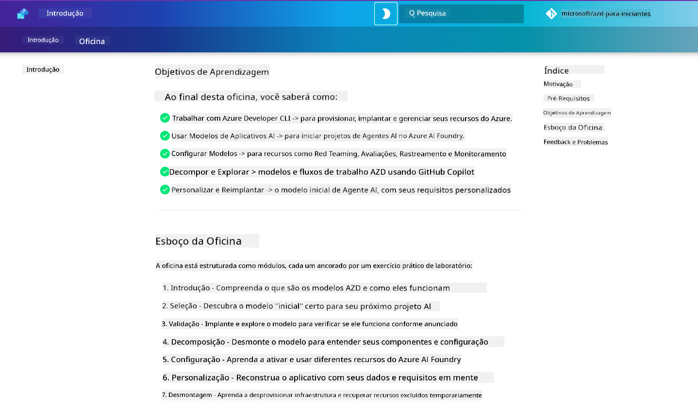

<!--
CO_OP_TRANSLATOR_METADATA:
{
  "original_hash": "9cc966416ab431c38b2ab863884b196c",
  "translation_date": "2025-09-24T09:51:45+00:00",
  "source_file": "workshop/README.md",
  "language_code": "pt"
}
-->
# Workshop AZD para Desenvolvedores de IA

Bem-vindo ao workshop prático para aprender a CLI do Desenvolvedor Azure (AZD) com foco na implementação de aplicações de IA. Este workshop ajuda-o a adquirir um entendimento prático dos modelos AZD em 3 etapas:

1. **Descoberta** - encontre o modelo certo para si.
1. **Implementação** - implemente e valide que funciona.
1. **Personalização** - modifique e itere para adaptá-lo às suas necessidades!

Ao longo deste workshop, também será introduzido a ferramentas e fluxos de trabalho essenciais para desenvolvedores, ajudando a simplificar a sua jornada de desenvolvimento de ponta a ponta.

<br/>

## Guia Baseado no Navegador

As lições do workshop estão em Markdown. Pode navegá-las diretamente no GitHub - ou lançar uma pré-visualização no navegador, como mostrado na imagem abaixo.



Para usar esta opção - faça um fork do repositório para o seu perfil e inicie o GitHub Codespaces. Assim que o terminal do VS Code estiver ativo, digite este comando:

```bash title="" linenums="0"
mkdocs serve > /dev/null 2>&1 &
```

Em poucos segundos, verá um diálogo pop-up. Selecione a opção `Open in browser`. O guia baseado no navegador será aberto numa nova aba. Alguns benefícios desta pré-visualização:

1. **Pesquisa integrada** - encontre palavras-chave ou lições rapidamente.
1. **Ícone de copiar** - passe o cursor sobre os blocos de código para ver esta opção.
1. **Alternar tema** - mude entre temas escuro e claro.
1. **Obter ajuda** - clique no ícone do Discord no rodapé para participar!

<br/>

## Visão Geral do Workshop

**Duração:** 3-4 horas  
**Nível:** Iniciante a Intermediário  
**Pré-requisitos:** Familiaridade com Azure, conceitos de IA, VS Code e ferramentas de linha de comando.

Este é um workshop prático onde aprende fazendo. Após concluir os exercícios, recomendamos revisar o currículo AZD Para Iniciantes para continuar a sua jornada de aprendizagem em práticas de Segurança e Produtividade.

| Tempo | Módulo  | Objetivo |
|:---|:---|:---|
| 15 mins | [Introdução](docs/instructions/0-Introduction.md) | Definir o contexto, entender os objetivos |
| 30 mins | [Selecionar Modelo de IA](docs/instructions/1-Select-AI-Template.md) | Explorar opções e escolher um modelo inicial | 
| 30 mins | [Validar Modelo de IA](docs/instructions/2-Validate-AI-Template.md) | Implementar solução padrão no Azure |
| 30 mins | [Desconstruir Modelo de IA](docs/instructions/3-Deconstruct-AI-Template.md) | Explorar estrutura e configuração |
| 30 mins | [Configurar Modelo de IA](docs/instructions/4-Configure-AI-Template.md) | Ativar e testar funcionalidades disponíveis |
| 30 mins | [Personalizar Modelo de IA](docs/instructions/5-Customize-AI-Template.md) | Adaptar o modelo às suas necessidades |
| 30 mins | [Desmontar Infraestrutura](docs/instructions/6-Teardown-Infrastructure.md) | Limpar e liberar recursos |
| 15 mins | [Encerramento e Próximos Passos](docs/instructions/7-Wrap-up.md) | Recursos de aprendizagem, desafio do workshop |

<br/>

## O Que Vai Aprender

Pense no Modelo AZD como um ambiente de aprendizagem para explorar várias capacidades e ferramentas para desenvolvimento de ponta a ponta no Azure AI Foundry. Ao final deste workshop, deverá ter uma compreensão intuitiva de várias ferramentas e conceitos neste contexto.

| Conceito  | Objetivo |
|:---|:---|
| **CLI do Desenvolvedor Azure** | Compreender comandos e fluxos de trabalho da ferramenta |
| **Modelos AZD**| Compreender estrutura e configuração de projetos |
| **Agente de IA do Azure**| Provisionar e implementar projeto no Azure AI Foundry |
| **Pesquisa de IA do Azure**| Ativar engenharia de contexto com agentes |
| **Observabilidade**| Explorar rastreamento, monitorização e avaliações |
| **Testes Adversariais**| Explorar testes adversariais e mitigações |

<br/>

## Estrutura do Workshop

O workshop está estruturado para levá-lo numa jornada desde a descoberta do modelo, até à implementação, desconstrução e personalização - usando o modelo inicial oficial [Getting Started with AI Agents](https://github.com/Azure-Samples/get-started-with-ai-agents) como base.

### [Módulo 1: Selecionar Modelo de IA](docs/instructions/1-Select-AI-Template.md) (30 mins)

- O que são Modelos de IA?
- Onde posso encontrar Modelos de IA?
- Como posso começar a construir Agentes de IA?
- **Laboratório**: Início rápido com GitHub Codespaces

### [Módulo 2: Validar Modelo de IA](docs/instructions/2-Validate-AI-Template.md) (30 mins)

- Qual é a Arquitetura do Modelo de IA?
- Qual é o Fluxo de Trabalho de Desenvolvimento AZD?
- Como posso obter ajuda com Desenvolvimento AZD?
- **Laboratório**: Implementar e Validar modelo de Agentes de IA

### [Módulo 3: Desconstruir Modelo de IA](docs/instructions/3-Deconstruct-AI-Template.md) (30 mins)

- Explorar o ambiente em `.azure/` 
- Explorar a configuração de recursos em `infra/` 
- Explorar a configuração AZD em `azure.yaml`s
- **Laboratório**: Modificar Variáveis de Ambiente e Reimplementar

### [Módulo 4: Configurar Modelo de IA](docs/instructions/4-Configure-AI-Template.md) (30 mins)
- Explorar: Geração Aumentada por Recuperação
- Explorar: Avaliação de Agentes e Testes Adversariais
- Explorar: Rastreamento e Monitorização
- **Laboratório**: Explorar Agente de IA + Observabilidade 

### [Módulo 5: Personalizar Modelo de IA](docs/instructions/5-Customize-AI-Template.md) (30 mins)
- Definir: PRD com Requisitos de Cenário
- Configurar: Variáveis de Ambiente para AZD
- Implementar: Hooks de Ciclo de Vida para tarefas adicionais
- **Laboratório**: Personalizar modelo para o meu cenário

### [Módulo 6: Desmontar Infraestrutura](docs/instructions/6-Teardown-Infrastructure.md) (30 mins)
- Recapitular: O que são Modelos AZD?
- Recapitular: Por que usar a CLI do Desenvolvedor Azure?
- Próximos Passos: Experimente um modelo diferente!
- **Laboratório**: Desprovisionar infraestrutura e limpar

<br/>

## Desafio do Workshop

Quer desafiar-se a fazer mais? Aqui estão algumas sugestões de projetos - ou partilhe as suas ideias connosco!!

| Projeto | Descrição |
|:---|:---|
|1. **Desconstruir um Modelo de IA Complexo** | Use o fluxo de trabalho e as ferramentas que delineamos e veja se consegue implementar, validar e personalizar um modelo de solução de IA diferente. _O que aprendeu?_|
|2. **Personalizar com o Seu Cenário**  | Experimente escrever um PRD (Documento de Requisitos de Produto) para um cenário diferente. Depois, use o GitHub Copilot no repositório do seu modelo em Modo Agente - e peça-lhe para gerar um fluxo de trabalho de personalização para si. _O que aprendeu? Como poderia melhorar estas sugestões?_|
| | |

## Tem feedback?

1. Publique um problema neste repositório - marque-o como `Workshop` para conveniência.
1. Junte-se ao Discord do Azure AI Foundry - conecte-se com os seus pares!


| | | 
|:---|:---|
| **📚 Página do Curso**| [AZD Para Iniciantes](../README.md)|
| **📖 Documentação** | [Introdução aos modelos de IA](https://learn.microsoft.com/en-us/azure/ai-foundry/how-to/develop/ai-template-get-started)|
| **🛠️Modelos de IA** | [Modelos do Azure AI Foundry](https://ai.azure.com/templates) |
|**🚀 Próximos Passos** | [Aceite o Desafio](../../../workshop) |
| | |

<br/>

---

**Anterior:** [Guia de Resolução de Problemas de IA](../docs/troubleshooting/ai-troubleshooting.md) | **Próximo:** Comece com [Laboratório 1: Fundamentos AZD](../../../workshop/lab-1-azd-basics)

**Pronto para começar a construir aplicações de IA com AZD?**

[Comece o Laboratório 1: Fundamentos AZD →](./lab-1-azd-basics/README.md)

---

