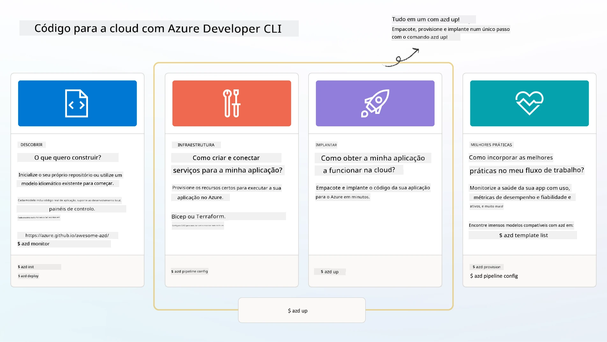

<!--
CO_OP_TRANSLATOR_METADATA:
{
  "original_hash": "06d6207eff634aefcaa41739490a5324",
  "translation_date": "2025-09-24T10:00:03+00:00",
  "source_file": "workshop/docs/instructions/1-Select-AI-Template.md",
  "language_code": "pt"
}
-->
# 1. Selecionar um Modelo

!!! tip "NO FINAL DESTE MÓDULO, SERÁ CAPAZ DE"

    - [ ] Descrever o que são os modelos AZD
    - [ ] Descobrir e utilizar modelos AZD para IA
    - [ ] Começar com o modelo AI Agents
    - [ ] **Laboratório 1:** Introdução ao AZD com GitHub Codespaces

---

## 1. Uma Analogia de Construção

Construir uma aplicação moderna de IA empresarial _do zero_ pode ser intimidante. É um pouco como construir a sua nova casa sozinho, tijolo por tijolo. Sim, é possível! Mas não é a forma mais eficaz de alcançar o resultado desejado!

Em vez disso, geralmente começamos com um _projeto arquitetónico_ existente e trabalhamos com um arquiteto para personalizá-lo de acordo com os nossos requisitos pessoais. E é exatamente essa abordagem que devemos adotar ao construir aplicações inteligentes. Primeiro, encontre uma boa arquitetura de design que se ajuste ao seu problema. Depois, trabalhe com um arquiteto de soluções para personalizar e desenvolver a solução para o seu cenário específico.

Mas onde podemos encontrar esses projetos arquitetónicos? E como encontrar um arquiteto disposto a ensinar-nos a personalizar e implementar esses projetos por conta própria? Neste workshop, respondemos a essas perguntas apresentando-lhe três tecnologias:

1. [Azure Developer CLI](https://aka.ms/azd) - uma ferramenta de código aberto que acelera o caminho do programador desde o desenvolvimento local (build) até à implementação na cloud (ship).
1. [Azure AI Foundry Templates](https://ai.azure.com/templates) - repositórios padronizados de código aberto que contêm código de exemplo, infraestrutura e ficheiros de configuração para implementar uma arquitetura de solução de IA.
1. [GitHub Copilot Agent Mode](https://code.visualstudio.com/docs/copilot/chat/chat-agent-mode) - um agente de programação baseado em conhecimento do Azure, que nos guia na navegação pelo código e na realização de alterações - usando linguagem natural.

Com estas ferramentas, podemos agora _descobrir_ o modelo certo, _implementá-lo_ para validar que funciona e _personalizá-lo_ para atender aos nossos cenários específicos. Vamos mergulhar e aprender como funcionam.

---

## 2. Azure Developer CLI

O [Azure Developer CLI](https://learn.microsoft.com/en-us/azure/developer/azure-developer-cli/) (ou `azd`) é uma ferramenta de linha de comando de código aberto que pode acelerar a sua jornada de código para cloud com um conjunto de comandos amigáveis para programadores que funcionam de forma consistente no seu IDE (desenvolvimento) e ambientes CI/CD (devops).

Com o `azd`, a sua jornada de implementação pode ser tão simples como:

- `azd init` - Inicializa um novo projeto de IA a partir de um modelo AZD existente.
- `azd up` - Provisiona infraestrutura e implementa a sua aplicação num único passo.
- `azd monitor` - Obtenha monitorização em tempo real e diagnósticos para a sua aplicação implementada.
- `azd pipeline config` - Configure pipelines CI/CD para automatizar a implementação no Azure.

**🎯 | EXERCÍCIO**: <br/> Explore a ferramenta de linha de comando `azd` no seu ambiente GitHub Codespaces agora. Comece por digitar este comando para ver o que a ferramenta pode fazer:

```bash title="" linenums="0"
azd help
```


---

## 3. O Modelo AZD

Para que o `azd` funcione, ele precisa saber qual infraestrutura provisionar, quais configurações aplicar e qual aplicação implementar. É aqui que entram os [modelos AZD](https://learn.microsoft.com/en-us/azure/developer/azure-developer-cli/azd-templates?tabs=csharp).

Os modelos AZD são repositórios de código aberto que combinam código de exemplo com ficheiros de infraestrutura e configuração necessários para implementar a arquitetura da solução.
Ao usar uma abordagem de _Infraestrutura como Código_ (IaC), permitem que as definições de recursos do modelo e as configurações sejam controladas por versão (tal como o código fonte da aplicação) - criando fluxos de trabalho reutilizáveis e consistentes entre os utilizadores desse projeto.

Ao criar ou reutilizar um modelo AZD para o _seu_ cenário, considere estas questões:

1. O que está a construir? → Existe um modelo que tenha código inicial para esse cenário?
1. Como está a sua solução arquitetada? → Existe um modelo que tenha os recursos necessários?
1. Como está a sua solução implementada? → Pense em `azd deploy` com ganchos de pré/pós-processamento!
1. Como pode otimizá-la ainda mais? → Pense em monitorização integrada e pipelines de automação!

**🎯 | EXERCÍCIO**: <br/> 
Visite a galeria [Awesome AZD](https://azure.github.io/awesome-azd/) e use os filtros para explorar os mais de 250 modelos atualmente disponíveis. Veja se consegue encontrar um que se alinhe aos requisitos do _seu_ cenário.



---

## 4. Modelos de Aplicações de IA

---

