<!--
CO_OP_TRANSLATOR_METADATA:
{
  "original_hash": "7816c6ec50c694c331e7c6092371be4d",
  "translation_date": "2025-09-24T10:06:01+00:00",
  "source_file": "workshop/docs/instructions/2-Validate-AI-Template.md",
  "language_code": "pt"
}
-->
# 2. Validar um Template

!!! tip "NO FINAL DESTE MÓDULO, SERÁ CAPAZ DE"

    - [ ] Analisar a Arquitetura de Soluções de IA
    - [ ] Compreender o Fluxo de Trabalho de Implementação do AZD
    - [ ] Utilizar o GitHub Copilot para obter ajuda sobre o uso do AZD
    - [ ] **Laboratório 2:** Implementar e Validar o template de Agentes de IA

---

## 1. Introdução

O [Azure Developer CLI](https://learn.microsoft.com/en-us/azure/developer/azure-developer-cli/) ou `azd` é uma ferramenta de linha de comando de código aberto que simplifica o fluxo de trabalho do desenvolvedor ao criar e implementar aplicações no Azure.

[Templates AZD](https://learn.microsoft.com/azure/developer/azure-developer-cli/azd-templates) são repositórios padronizados que incluem código de aplicação de exemplo, ativos de _infraestrutura como código_ e ficheiros de configuração `azd` para uma arquitetura de solução coesa. A provisão da infraestrutura torna-se tão simples quanto um comando `azd provision` - enquanto o uso de `azd up` permite provisionar a infraestrutura **e** implementar a aplicação de uma só vez!

Como resultado, iniciar o processo de desenvolvimento da sua aplicação pode ser tão simples quanto encontrar o _template inicial AZD_ que mais se aproxima das suas necessidades de aplicação e infraestrutura - e depois personalizar o repositório para atender aos requisitos do seu cenário.

Antes de começarmos, vamos garantir que tem o Azure Developer CLI instalado.

1. Abra um terminal no VS Code e digite este comando:

      ```bash title="" linenums="0"
      azd version
      ```

1. Deve ver algo como isto!

      ```bash title="" linenums="0"
      azd version 1.19.0 (commit b3d68cea969b2bfbaa7b7fa289424428edb93e97)
      ```

**Agora está pronto para selecionar e implementar um template com azd**

---

## 2. Seleção de Template

A plataforma Azure AI Foundry vem com um [conjunto de templates AZD recomendados](https://learn.microsoft.com/en-us/azure/ai-foundry/how-to/develop/ai-template-get-started) que abrangem cenários populares de solução, como _automação de fluxo de trabalho multi-agente_ e _processamento de conteúdo multimodal_. Também pode descobrir estes templates visitando o portal Azure AI Foundry.

1. Visite [https://ai.azure.com/templates](https://ai.azure.com/templates)
1. Faça login no portal Azure AI Foundry quando solicitado - verá algo como isto.

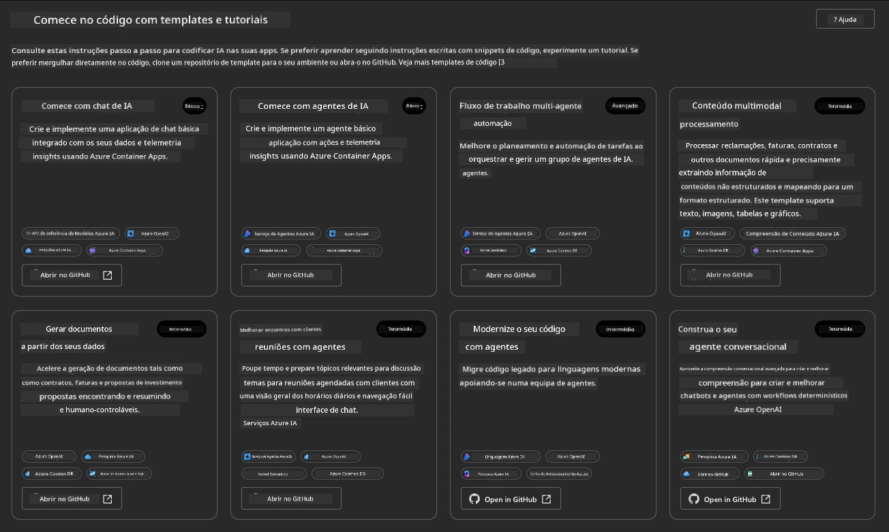

As opções **Básicas** são os seus templates iniciais:

1. [ ] [Get Started with AI Chat](https://github.com/Azure-Samples/get-started-with-ai-chat), que implementa uma aplicação de chat básica _com os seus dados_ no Azure Container Apps. Use isto para explorar um cenário básico de chatbot de IA.
1. [X] [Get Started with AI Agents](https://github.com/Azure-Samples/get-started-with-ai-agents), que também implementa um Agente de IA padrão (com o Azure AI Agent Service). Use isto para se familiarizar com soluções de IA baseadas em agentes que envolvem ferramentas e modelos.

Visite o segundo link numa nova aba do navegador (ou clique em `Open in GitHub` no cartão relacionado). Deve ver o repositório para este template AZD. Reserve um minuto para explorar o README. A arquitetura da aplicação é assim:

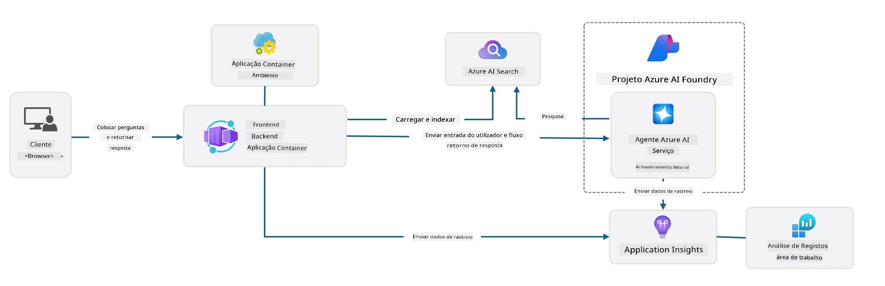

---

## 3. Ativação do Template

Vamos tentar implementar este template e garantir que é válido. Seguiremos as diretrizes na seção [Getting Started](https://github.com/Azure-Samples/get-started-with-ai-agents?tab=readme-ov-file#getting-started).

1. Clique [neste link](https://github.com/codespaces/new/Azure-Samples/get-started-with-ai-agents) - confirme a ação padrão para `Create codespace`
1. Isto abrirá uma nova aba no navegador - aguarde até que a sessão do GitHub Codespaces seja completamente carregada
1. Abra o terminal do VS Code no Codespaces - digite o seguinte comando:

   ```bash title="" linenums="0"
   azd up
   ```

Complete os passos do fluxo de trabalho que isto irá desencadear:

1. Será solicitado que faça login no Azure - siga as instruções para autenticar
1. Insira um nome de ambiente único - por exemplo, usei `nitya-mshack-azd`
1. Isto criará uma pasta `.azure/` - verá uma subpasta com o nome do ambiente
1. Será solicitado que selecione um nome de subscrição - selecione o padrão
1. Será solicitado que escolha uma localização - use `East US 2`

Agora, aguarde até que a provisão seja concluída. **Isto leva de 10 a 15 minutos**

1. Quando concluído, o seu console mostrará uma mensagem de SUCESSO como esta:
      ```bash title="" linenums="0"
      SUCCESS: Your up workflow to provision and deploy to Azure completed in 10 minutes 17 seconds.
      ```
1. O seu Portal Azure agora terá um grupo de recursos provisionado com o nome do ambiente:

      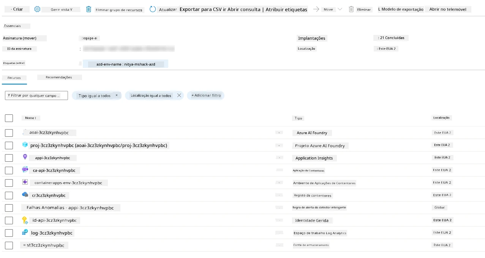

1. **Agora está pronto para validar a infraestrutura e aplicação implementadas**.

---

## 4. Validação do Template

1. Visite a página [Grupos de Recursos](https://portal.azure.com/#browse/resourcegroups) no Portal Azure - faça login quando solicitado
1. Clique no RG com o nome do seu ambiente - verá a página acima

      - clique no recurso Azure Container Apps
      - clique na URL da Aplicação na seção _Essentials_ (canto superior direito)

1. Deve ver uma interface de utilizador da aplicação hospedada como esta:

   

1. Experimente fazer algumas [perguntas de exemplo](https://github.com/Azure-Samples/get-started-with-ai-agents/blob/main/docs/sample_questions.md)

      1. Pergunte: ```Qual é a capital da França?``` 
      1. Pergunte: ```Qual é a melhor tenda abaixo de $200 para duas pessoas e quais são as suas características?```

1. Deve obter respostas semelhantes às mostradas abaixo. _Mas como isto funciona?_ 

      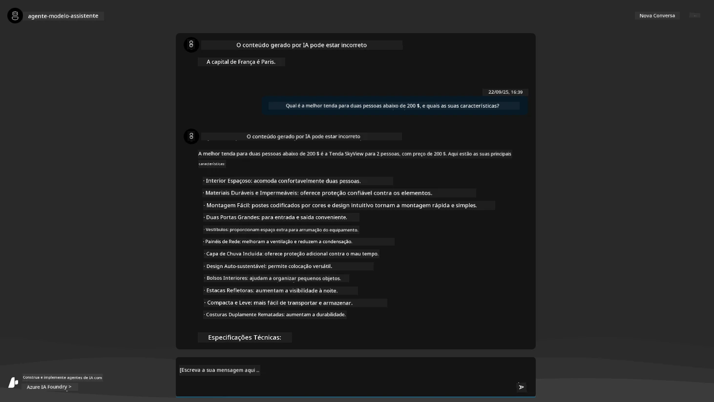

---

## 5. Validação do Agente

O Azure Container App implementa um endpoint que se conecta ao Agente de IA provisionado no projeto Azure AI Foundry para este template. Vamos ver o que isso significa.

1. Volte para a página _Overview_ do Portal Azure para o seu grupo de recursos

1. Clique no recurso `Azure AI Foundry` na lista

1. Deve ver isto. Clique no botão `Go to Azure AI Foundry Portal`. 
   

1. Deve ver a página do Projeto Foundry para a sua aplicação de IA
   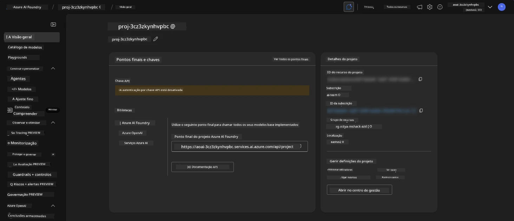

1. Clique em `Agents` - verá o Agente padrão provisionado no seu projeto
   

1. Selecione-o - e verá os detalhes do Agente. Note o seguinte:

      - O agente usa File Search por padrão (sempre)
      - O `Knowledge` do agente indica que tem 32 ficheiros carregados (para pesquisa de ficheiros)
      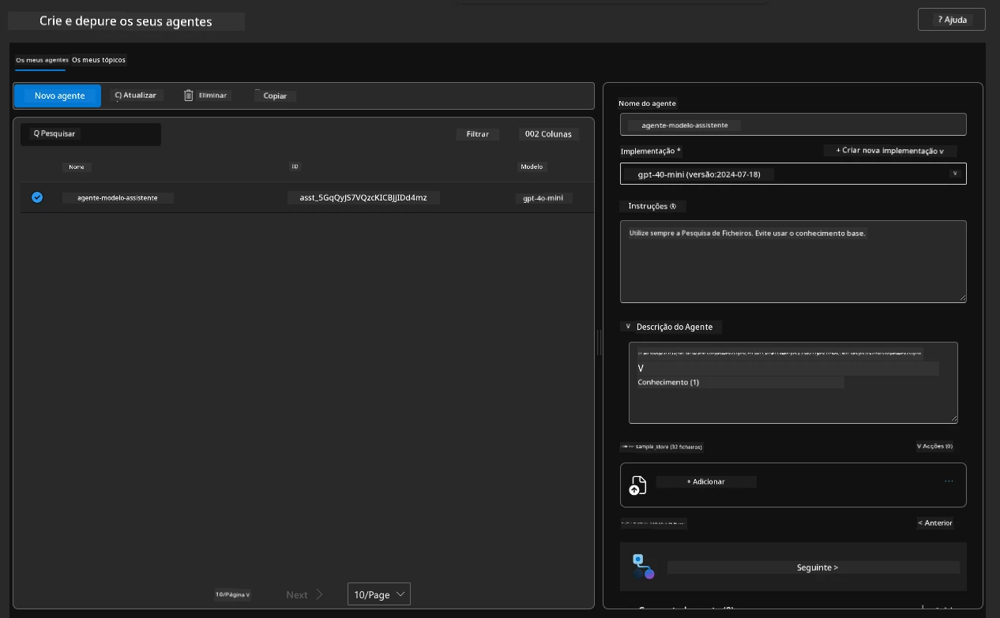

1. Procure a opção `Data+indexes` no menu à esquerda e clique para ver os detalhes. 

      - Deve ver os 32 ficheiros de dados carregados para conhecimento.
      - Estes correspondem aos 12 ficheiros de clientes e 20 ficheiros de produtos em `src/files` 
      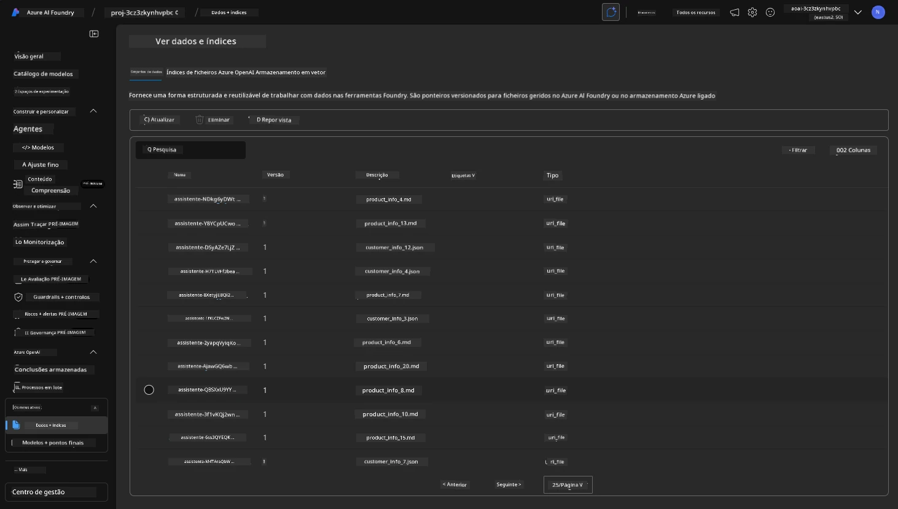

**Validou a operação do Agente!** 

1. As respostas do agente são baseadas no conhecimento desses ficheiros. 
1. Agora pode fazer perguntas relacionadas a esses dados e obter respostas fundamentadas.
1. Exemplo: `customer_info_10.json` descreve as 3 compras feitas por "Amanda Perez"

Volte para a aba do navegador com o endpoint do Container App e pergunte: `Quais produtos Amanda Perez possui?`. Deve ver algo como isto:


---

## 6. Playground do Agente

Vamos explorar um pouco mais as capacidades do Azure AI Foundry, experimentando o Agente no Playground de Agentes. 

1. Volte para a página `Agents` no Azure AI Foundry - selecione o agente padrão
1. Clique na opção `Try in Playground` - deve obter uma interface de Playground como esta
1. Pergunte a mesma questão: `Quais produtos Amanda Perez possui?`

    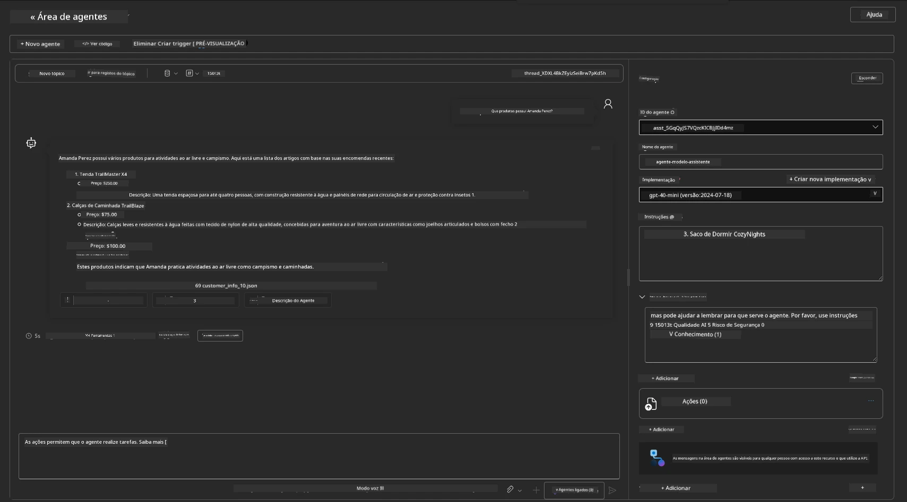

Obtém a mesma (ou semelhante) resposta - mas também recebe informações adicionais que pode usar para entender a qualidade, custo e desempenho da sua aplicação baseada em agentes. Por exemplo:

1. Note que a resposta cita ficheiros de dados usados para "fundamentar" a resposta
1. Passe o cursor sobre qualquer um desses rótulos de ficheiros - os dados correspondem à sua consulta e resposta exibida?

Também verá uma linha de _estatísticas_ abaixo da resposta. 

1. Passe o cursor sobre qualquer métrica - por exemplo, Segurança. Verá algo como isto
1. A classificação avaliada corresponde à sua intuição sobre o nível de segurança da resposta?

      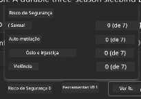

---x

## 7. Observabilidade Integrada

Observabilidade trata de instrumentar a sua aplicação para gerar dados que podem ser usados para entender, depurar e otimizar as suas operações. Para ter uma ideia disso:

1. Clique no botão `View Run Info` - deve ver esta vista. Este é um exemplo de [rastreamento de Agentes](https://learn.microsoft.com/en-us/azure/ai-foundry/how-to/develop/trace-agents-sdk#view-trace-results-in-the-azure-ai-foundry-agents-playground) em ação. _Também pode obter esta vista clicando em Thread Logs no menu principal_.

   - Obtenha uma ideia dos passos de execução e ferramentas envolvidas pelo agente
   - Compreenda o total de Tokens usados (vs. uso de tokens de saída) para a resposta
   - Compreenda a latência e onde o tempo está sendo gasto na execução

      

1. Clique na aba `Metadata` para ver atributos adicionais da execução, que podem fornecer contexto útil para depurar problemas mais tarde.   

      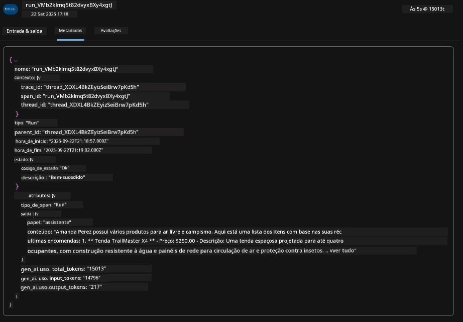

1. Clique na aba `Evaluations` para ver autoavaliações feitas na resposta do agente. Estas incluem avaliações de segurança (por exemplo, Auto-mutilação) e avaliações específicas do agente (por exemplo, Resolução de intenção, Adesão à tarefa).

      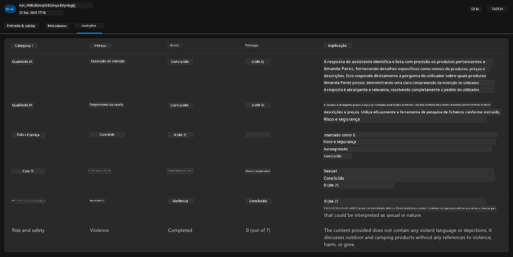

1. Por último, mas não menos importante, clique na aba `Monitoring` no menu lateral.

      - Selecione a aba `Resource usage` na página exibida - e veja as métricas.
      - Acompanhe o uso da aplicação em termos de custos (tokens) e carga (pedidos).
      - Acompanhe a latência da aplicação desde o primeiro byte (processamento de entrada) até o último byte (saída).

      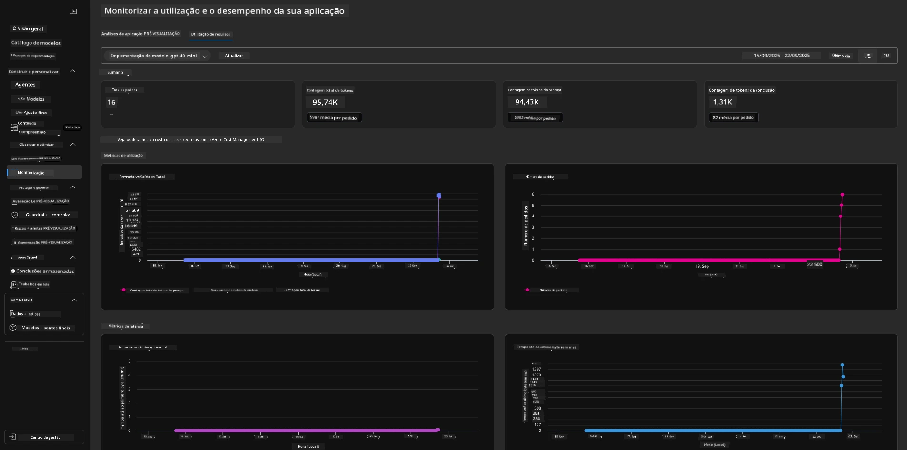

---

## 8. Variáveis de Ambiente

Até agora, percorremos a implementação no navegador - e validamos que a nossa infraestrutura foi provisionada e a aplicação está operacional. Mas para trabalhar com a aplicação _orientada por código_, precisamos configurar o nosso ambiente de desenvolvimento local com as variáveis relevantes necessárias para trabalhar com esses recursos. Usar `azd` torna isso fácil.

1. O Azure Developer CLI [usa variáveis de ambiente](https://learn.microsoft.com/en-us/azure/developer/azure-developer-cli/manage-environment-variables?tabs=bash) para armazenar e gerir configurações de implementação de aplicações.

1. As variáveis de ambiente são armazenadas em `.azure/<env-name>/.env` - isto limita-as ao ambiente `env-name` usado durante a implementação e ajuda a isolar ambientes entre diferentes alvos de implementação no mesmo repositório.

1. As variáveis de ambiente são automaticamente carregadas pelo comando `azd` sempre que executa um comando específico (por exemplo, `azd up`). Note que o `azd` não lê automaticamente variáveis de ambiente _a nível do sistema operativo_ (por exemplo, definidas no shell) - em vez disso, use `azd set env` e `azd get env` para transferir informações dentro de scripts.

Vamos experimentar alguns comandos:

1. Obtenha todas as variáveis de ambiente definidas para `azd` neste ambiente:

      ```bash title="" linenums="0"
      azd env get-values
      ```
      
      Verá algo como:

      ```bash title="" linenums="0"
      AZURE_AI_AGENT_DEPLOYMENT_NAME="gpt-4o-mini"
      AZURE_AI_AGENT_NAME="agent-template-assistant"
      AZURE_AI_EMBED_DEPLOYMENT_NAME="text-embedding-3-small"
      AZURE_AI_EMBED_DIMENSIONS=100
      ...
      ```

1. Obtenha um valor específico - por exemplo, quero saber se definimos o valor `AZURE_AI_AGENT_MODEL_NAME`

      ```bash title="" linenums="0"
      azd env get-value AZURE_AI_AGENT_MODEL_NAME 
      ```
      
      Verá algo como isto - não foi definido por padrão!

      ```bash title="" linenums="0"
      ERROR: key 'AZURE_AI_AGENT_MODEL_NAME' not found in the environment values
      ```

1. Defina uma nova variável de ambiente para `azd`. Aqui, atualizamos o nome do modelo do agente. _Nota: quaisquer alterações feitas serão imediatamente refletidas no ficheiro `.azure/<env-name>/.env`.

      ```bash title="" linenums="0"
      azd env set AZURE_AI_AGENT_MODEL_NAME gpt-4.1
      azd env set AZURE_AI_AGENT_MODEL_VERSION 2025-04-14
      azd env set AZURE_AI_AGENT_DEPLOYMENT_CAPACITY 150
      ```

      Agora, devemos encontrar o valor definido:

      ```bash title="" linenums="0"
      azd env get-value AZURE_AI_AGENT_MODEL_NAME 
      ```

1. Note que alguns recursos são persistentes (por exemplo, implementações de modelos) e exigirão mais do que apenas um `azd up` para forçar a reimplementação. Vamos tentar desmontar a implementação original e reimplementar com variáveis de ambiente alteradas.

1. **Atualizar** Se anteriormente implementou infraestrutura usando um template azd - pode _atualizar_ o estado das suas variáveis de ambiente locais com base no estado atual da sua implementação no Azure usando este comando:
      ```bash title="" linenums="0"
      azd env refresh
      ```

      Esta é uma forma poderosa de _sincronizar_ variáveis de ambiente entre dois ou mais ambientes de desenvolvimento local (por exemplo, uma equipa com vários programadores) - permitindo que a infraestrutura implementada sirva como a fonte de verdade para o estado das variáveis de ambiente. Os membros da equipa simplesmente _atualizam_ as variáveis para voltarem a estar sincronizados.

---

## 9. Parabéns 🏆

Acabaste de completar um fluxo de trabalho de ponta a ponta onde:

- [X] Selecionaste o Template AZD que querias usar
- [X] Lançaste o Template com GitHub Codespaces 
- [X] Implementaste o Template e validaste que funciona

---

