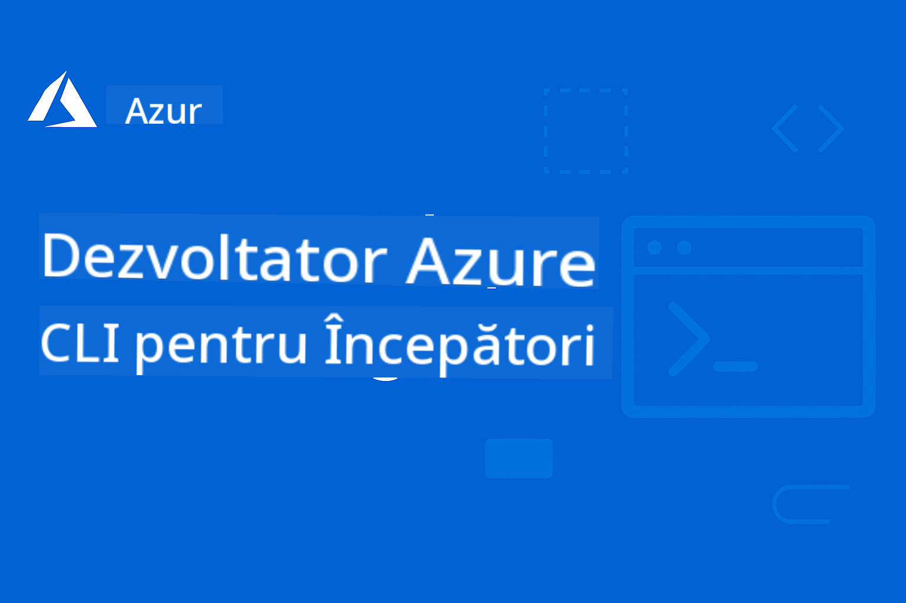

<!--
CO_OP_TRANSLATOR_METADATA:
{
  "original_hash": "c0984265b7a9357388f864c19606c80d",
  "translation_date": "2025-09-11T10:13:59+00:00",
  "source_file": "README.md",
  "language_code": "ro"
}
-->
# AZD Pentru Începători

 

[](https://GitHub.com/microsoft/azd-for-beginners/watchers/?WT.mc_id=academic-105485-koreyst)  
[](https://GitHub.com/microsoft/azd-for-beginners/network/?WT.mc_id=academic-105485-koreyst)  
[](https://GitHub.com/microsoft/azd-for-beginners/stargazers/?WT.mc_id=academic-105485-koreyst)  

[](https://discord.gg/microsoft-azure)  

[](https://discord.gg/kzRShWzttr)  

Urmați acești pași pentru a începe să utilizați aceste resurse:  
1. **Forkați Repozitoriul**: Click [](https://GitHub.com/microsoft/azd-for-beginners/fork)  
2. **Clonați Repozitoriul**:   `git clone https://github.com/microsoft/azd-for-beginners.git`  
3. [**Alăturați-vă Comunităților Azure Discord și întâlniți experți și alți dezvoltatori**](https://discord.com/invite/ByRwuEEgH4)  

### 🌐 Suport Multi-Limbă

#### Suportat prin GitHub Action (Automat & Mereu Actualizat)

[French](../fr/README.md) | [Spanish](../es/README.md) | [German](../de/README.md) | [Russian](../ru/README.md) | [Arabic](../ar/README.md) | [Persian (Farsi)](../fa/README.md) | [Urdu](../ur/README.md) | [Chinese (Simplified)](../zh/README.md) | [Chinese (Traditional, Macau)](../mo/README.md) | [Chinese (Traditional, Hong Kong)](../hk/README.md) | [Chinese (Traditional, Taiwan)](../tw/README.md) | [Japanese](../ja/README.md) | [Korean](../ko/README.md) | [Hindi](../hi/README.md) | [Bengali](../bn/README.md) | [Marathi](../mr/README.md) | [Nepali](../ne/README.md) | [Punjabi (Gurmukhi)](../pa/README.md) | [Portuguese (Portugal)](../pt/README.md) | [Portuguese (Brazil)](../br/README.md) | [Italian](../it/README.md) | [Polish](../pl/README.md) | [Turkish](../tr/README.md) | [Greek](../el/README.md) | [Thai](../th/README.md) | [Swedish](../sv/README.md) | [Danish](../da/README.md) | [Norwegian](../no/README.md) | [Finnish](../fi/README.md) | [Dutch](../nl/README.md) | [Hebrew](../he/README.md) | [Vietnamese](../vi/README.md) | [Indonesian](../id/README.md) | [Malay](../ms/README.md) | [Tagalog (Filipino)](../tl/README.md) | [Swahili](../sw/README.md) | [Hungarian](../hu/README.md) | [Czech](../cs/README.md) | [Slovak](../sk/README.md) | [Romanian](./README.md) | [Bulgarian](../bg/README.md) | [Serbian (Cyrillic)](../sr/README.md) | [Croatian](../hr/README.md) | [Slovenian](../sl/README.md) | [Ukrainian](../uk/README.md) | [Burmese (Myanmar)](../my/README.md)  

**Dacă doriți să aveți suport pentru alte limbi, acestea sunt listate [aici](https://github.com/Azure/co-op-translator/blob/main/getting_started/supported-languages.md)**  

## Introducere

Bine ați venit la ghidul complet pentru Azure Developer CLI (azd). Acest repo este conceput pentru a ajuta dezvoltatorii de toate nivelurile, de la studenți la profesioniști, să învețe și să stăpânească Azure Developer CLI pentru implementări eficiente în cloud. Această resursă de învățare structurată oferă experiență practică cu implementările în cloud Azure, rezolvarea problemelor comune și aplicarea celor mai bune practici pentru implementările de șabloane AZD.

## Obiective de Învățare

Lucrând prin acest repo, veți:  
- Stăpâni fundamentele și conceptele de bază ale Azure Developer CLI  
- Învăța să implementați și să provisionați resurse Azure folosind Infrastructure as Code  
- Dezvolta abilități de rezolvare a problemelor pentru problemele comune de implementare AZD  
- Înțelege validarea pre-implementare și planificarea capacității  
- Aplica cele mai bune practici de securitate și strategii de optimizare a costurilor  
- Câștiga încredere în implementarea aplicațiilor pregătite pentru producție în Azure  

## Rezultate de Învățare

După finalizarea acestui curs, veți putea:  
- Instala, configura și utiliza cu succes Azure Developer CLI  
- Crea și implementa aplicații folosind șabloane AZD  
- Rezolva probleme de autentificare, infrastructură și implementare  
- Efectua verificări pre-implementare, inclusiv planificarea capacității și selecția SKU  
- Aplica cele mai bune practici de monitorizare, securitate și gestionare a costurilor  
- Integra fluxurile de lucru AZD în pipeline-uri CI/CD  

## Cuprins

- [Ce este Azure Developer CLI?](../..)  
- [Start Rapid](../..)  
- [Documentație](../..)  
- [Exemple & Șabloane](../..)  
- [Resurse](../..)  
- [Contribuții](../..)  

## Ce este Azure Developer CLI?

Azure Developer CLI (azd) este o interfață de linie de comandă centrată pe dezvoltatori care accelerează procesul de construire și implementare a aplicațiilor în Azure. Oferă:  

- **Implementări bazate pe șabloane** - Utilizați șabloane pre-construite pentru modele comune de aplicații  
- **Infrastructure as Code** - Gestionați resursele Azure folosind Bicep sau Terraform  
- **Fluxuri de lucru integrate** - Provisionați, implementați și monitorizați aplicațiile fără probleme  
- **Prietenos pentru dezvoltatori** - Optimizat pentru productivitatea și experiența dezvoltatorilor  

## Start Rapid

### Cerințe Prealabile  
- Abonament Azure  
- Azure CLI instalat  
- Git (pentru clonarea șabloanelor)  

### Instalare  
```bash
# Windows (PowerShell)
powershell -ex AllSigned -c "Invoke-RestMethod 'https://aka.ms/install-azd.ps1' | Invoke-Expression"

# macOS/Linux
curl -fsSL https://aka.ms/install-azd.sh | bash
```  

### Prima Implementare  
```bash
# Initialize a new project
azd init --template todo-nodejs-mongo

# Provision Azure resources and deploy
azd up
```  

## Documentație

### Începeți  
- [**Bazele AZD**](docs/getting-started/azd-basics.md) - Concepte de bază și terminologie  
- [**Instalare & Configurare**](docs/getting-started/installation.md) - Ghiduri de instalare specifice platformei  
- [**Configurare**](docs/getting-started/configuration.md) - Setarea mediului și autentificarea  
- [**Primul Proiect**](docs/getting-started/first-project.md) - Tutorial pas cu pas  

### Implementare & Provisionare  
- [**Ghid de Implementare**](docs/deployment/deployment-guide.md) - Fluxuri complete de implementare  
- [**Provisionarea Resurselor**](docs/deployment/provisioning.md) - Gestionarea resurselor Azure  

### Verificări Pre-Implementare  
- [**Planificarea Capacității**](docs/pre-deployment/capacity-planning.md) - Validarea capacității resurselor Azure  
- [**Selecția SKU**](docs/pre-deployment/sku-selection.md) - Alegerea SKU-urilor potrivite Azure  
- [**Verificări Pre-Implementare**](docs/pre-deployment/preflight-checks.md) - Scripturi automate de validare  

### Rezolvarea Problemelor  
- [**Probleme Comune**](docs/troubleshooting/common-issues.md) - Probleme frecvent întâlnite și soluții  
- [**Ghid de Debugging**](docs/troubleshooting/debugging.md) - Strategii pas cu pas de debugging  

## Exemple & Șabloane  
- [**Exemple**](examples/README.md) - Exemple practice, șabloane și scenarii reale pentru a vă ajuta să învățați Azure Developer CLI prin practică. Fiecare exemplu oferă cod complet funcțional, șabloane de infrastructură și instrucțiuni detaliate pentru diferite arhitecturi de aplicații și modele de implementare.  

### Laborator Practic/Workshop  
- [**AZD Pentru Începători**](workshop/README.md) - Acest workshop se va concentra pe șablonul AZD Get Started with AI Agents și va oferi cele mai bune practici pentru implementarea serviciilor Azure AI folosind AZD.  

## Resurse

### Referințe Rapide  
- [**Fișă de Comenzi**](resources/cheat-sheet.md) - Comenzi esențiale azd  
- [**Glosar**](resources/glossary.md) - Terminologie Azure și azd  
- [**FAQ**](resources/faq.md) - Întrebări frecvente  
- [**Ghid de Studiu**](resources/study-guide.md) - Obiective de învățare cuprinzătoare și exerciții practice  

### Resurse Externe  
- [Documentația Azure Developer CLI](https://learn.microsoft.com/en-us/azure/developer/azure-developer-cli/)  
- [Centrul de Arhitectură Azure](https://learn.microsoft.com/en-us/azure/architecture/)  
- [Calculator de Prețuri Azure](https://azure.microsoft.com/pricing/calculator/)  
- [Status Azure](https://status.azure.com/)  

## Parcurs de Învățare

### Pentru Studenți & Începători  
1. Începeți cu [Bazele AZD](docs/getting-started/azd-basics.md)  
2. Urmați [Ghidul de Instalare](docs/getting-started/installation.md)  
3. Finalizați [Primul Proiect](docs/getting-started/first-project.md)  
4. Practicați cu [Exemplul de Aplicație Web Simplă](../../examples/simple-web-app)  

### Pentru Dezvoltatori  
1. Revizuiți [Ghidul de Configurare](docs/getting-started/configuration.md)  
2. Studiați [Ghidul de Implementare](docs/deployment/deployment-guide.md)  
3. Lucrați cu [Exemplul de Aplicație cu Bază de Date](../../examples/database-app)  
4. Explorați [Exemplul de Aplicație Container](../../examples/container-app)  

### Pentru Ingineri DevOps  
1. Stăpâniți [Provisionarea Resurselor](docs/deployment/provisioning.md)  
2. Implementați [Verificări Pre-Implementare](docs/pre-deployment/preflight-checks.md)  
3. Practicați [Planificarea Capacității](docs/pre-deployment/capacity-planning.md)  
4. Avansați cu [Exemplul de Microservicii](../../examples/microservices)  

## Contribuții

Acceptăm contribuții! Vă rugăm să citiți [Ghidul de Contribuții](CONTRIBUTING.md) pentru detalii despre:  
- Cum să raportați probleme și să solicitați funcționalități  
- Ghiduri pentru contribuții de cod  
- Îmbunătățiri ale documentației  
- Standardele comunității  

## Suport

- **Probleme**: [Raportați erori și solicitați funcționalități](https://github.com/microsoft/azd-for-beginners/issues)  
- **Discuții**: [Comunitatea Microsoft Azure Discord - Întrebări și discuții](https://discord.gg/microsoft-azure)  
- **Email**: Pentru întrebări private  
- **Microsoft Learn**: [Documentația oficială Azure Developer CLI](https://learn.microsoft.com/en-us/azure/developer/azure-developer-cli/)  

## Licență

Acest proiect este licențiat sub Licența MIT - vedeți fișierul [LICENSE](../../LICENSE) pentru detalii.  

## 🎒 Alte Cursuri

Echipa noastră produce alte cursuri! Verificați:  

- [**NOU** Protocolul Model Context (MCP) Pentru Începători](https://github.com/microsoft/mcp-for-beginners?WT.mc_id=academic-105485-koreyst)  
- [Agenți AI pentru Începători](https://github.com/microsoft/ai-agents-for-beginners?WT.mc_id=academic-105485-koreyst)  
- [Generative AI pentru Începători folosind .NET](https://github.com/microsoft/Generative-AI-for-beginners-dotnet?WT.mc_id=academic-105485-koreyst)  
- [Generative AI pentru Începători](https://github.com/microsoft/generative-ai-for-beginners?WT.mc_id=academic-105485-koreyst)  
- [Generative AI pentru Începători folosind Java](https://github.com/microsoft/generative-ai-for-beginners-java?WT.mc_id=academic-105485-koreyst)  
- [ML pentru Începători](https://aka.ms/ml-beginners?WT.mc_id=academic-105485-koreyst)  
- [Data Science pentru Începători](https://aka.ms/datascience-beginners?WT.mc_id=academic-105485-koreyst)  
- [AI pentru Începători](https://aka.ms/ai-beginners?WT.mc_id=academic-105485-koreyst)  
- [Cybersecurity pentru Începători](https://github.com/microsoft/Security-101??WT.mc_id=academic-96948-sayoung)  
- [Web Dev pentru Începători](https://aka.ms/webdev-beginners?WT.mc_id=academic-105485-koreyst)  
- [IoT pentru Începători](https://aka.ms/iot-beginners?WT.mc_id=academic-105485-koreyst)  
- [Dezvoltare XR pentru Începători](https://github.com/microsoft/xr-development-for-beginners?WT.mc_id=academic-105485-koreyst)  
- [Stăpânirea GitHub Copilot pentru Programare AI în Pereche](https://aka.ms/GitHubCopilotAI?WT.mc_id=academic-105485-koreyst)  
- [Stăpânirea GitHub Copilot pentru Dezvoltatori C#/.NET](https://github.com/microsoft/mastering-github-copilot-for-dotnet-csharp-developers?WT.mc_id=academic-105485-koreyst)  
- [Alege-ți Propria Aventură cu Copilot](https://github.com/microsoft/CopilotAdventures?WT.mc_id=academic-105485-koreyst)  

---

**Navigare**  
- **Următoarea Lecție**: [Bazele AZD](docs/getting-started/azd-basics.md)  

---

**Declinare de responsabilitate**:  
Acest document a fost tradus folosind serviciul de traducere AI [Co-op Translator](https://github.com/Azure/co-op-translator). Deși ne străduim să asigurăm acuratețea, vă rugăm să rețineți că traducerile automate pot conține erori sau inexactități. Documentul original în limba sa natală ar trebui considerat sursa autoritară. Pentru informații critice, se recomandă traducerea profesională realizată de un specialist uman. Nu ne asumăm responsabilitatea pentru eventualele neînțelegeri sau interpretări greșite care pot apărea din utilizarea acestei traduceri.