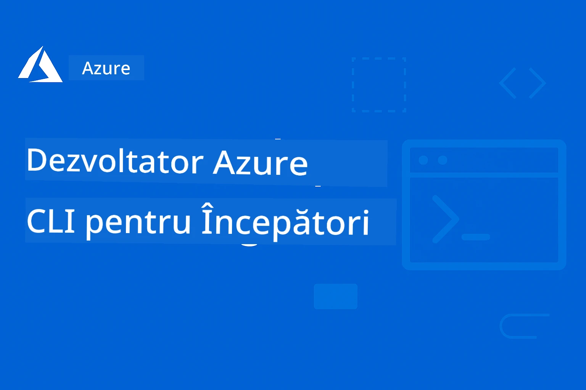

<!--
CO_OP_TRANSLATOR_METADATA:
{
  "original_hash": "068c87cc2641a81ca353ad7064ff326a",
  "translation_date": "2026-01-01T19:21:25+00:00",
  "source_file": "README.md",
  "language_code": "ro"
}
-->
# AZD For Beginners: A Structured Learning Journey

 

[](https://GitHub.com/microsoft/azd-for-beginners/watchers/)
[](https://GitHub.com/microsoft/azd-for-beginners/network/)
[](https://GitHub.com/microsoft/azd-for-beginners/stargazers/)

[](https://discord.gg/microsoft-azure)
[](https://discord.gg/nTYy5BXMWG)

## Începeți cu acest curs

Urmați acești pași pentru a începe călătoria dvs. de învățare AZD:

1. **Fork the Repository**: Click [](https://GitHub.com/microsoft/azd-for-beginners/fork)
2. **Clone the Repository**: `git clone https://github.com/microsoft/azd-for-beginners.git`
3. **Alăturați-vă comunității**: [Comunități Azure Discord](https://discord.com/invite/ByRwuEEgH4) pentru suport de la experți
4. **Alegeți-vă traseul de învățare**: Selectați un capitol de mai jos care se potrivește nivelului dvs. de experiență

### Suport multilingv

#### Traduceri automate (întotdeauna actualizate)

<!-- CO-OP TRANSLATOR LANGUAGES TABLE START -->
[Arabă](../ar/README.md) | [Bengaleză](../bn/README.md) | [Bulgară](../bg/README.md) | [Burmaneză (Myanmar)](../my/README.md) | [Chineză (Simplificată)](../zh/README.md) | [Chineză (Tradițională, Hong Kong)](../hk/README.md) | [Chineză (Tradițională, Macao)](../mo/README.md) | [Chineză (Tradițională, Taiwan)](../tw/README.md) | [Croată](../hr/README.md) | [Cehă](../cs/README.md) | [Daneză](../da/README.md) | [Olandeză](../nl/README.md) | [Estonă](../et/README.md) | [Finlandeză](../fi/README.md) | [Franceză](../fr/README.md) | [Germană](../de/README.md) | [Greacă](../el/README.md) | [Ebraică](../he/README.md) | [Hindi](../hi/README.md) | [Maghiară](../hu/README.md) | [Indoneziană](../id/README.md) | [Italiană](../it/README.md) | [Japoneză](../ja/README.md) | [Kannada](../kn/README.md) | [Coreeană](../ko/README.md) | [Lituaniană](../lt/README.md) | [Malaieză](../ms/README.md) | [Malayalam](../ml/README.md) | [Marathi](../mr/README.md) | [Nepaleză](../ne/README.md) | [Pidgin din Nigeria](../pcm/README.md) | [Norvegiană](../no/README.md) | [Persană (Farsi)](../fa/README.md) | [Poloneză](../pl/README.md) | [Portugheză (Brazilia)](../br/README.md) | [Portugheză (Portugalia)](../pt/README.md) | [Punjabi (Gurmukhi)](../pa/README.md) | [Română](./README.md) | [Rusă](../ru/README.md) | [Sârbă (chirilică)](../sr/README.md) | [Slovacă](../sk/README.md) | [Slovenă](../sl/README.md) | [Spaniolă](../es/README.md) | [Swahili](../sw/README.md) | [Suedeză](../sv/README.md) | [Tagalog (Filipineză)](../tl/README.md) | [Tamilă](../ta/README.md) | [Telugu](../te/README.md) | [Thailandeză](../th/README.md) | [Turcă](../tr/README.md) | [Ucraineană](../uk/README.md) | [Urdu](../ur/README.md) | [Vietnameză](../vi/README.md)
<!-- CO-OP TRANSLATOR LANGUAGES TABLE END -->

## Prezentare generală a cursului

Stăpânește Azure Developer CLI (azd) prin capitole structurate, concepute pentru învățare progresivă. **Accent special pe implementarea aplicațiilor AI cu integrarea Microsoft Foundry.**

### De ce este esențial acest curs pentru dezvoltatorii moderni

Pe baza perspectivelor din comunitatea Discord Microsoft Foundry, **45% dintre dezvoltatori doresc să utilizeze AZD pentru sarcini de lucru AI**, dar se confruntă cu provocări legate de:
- Arhitecturi AI complexe cu mai multe servicii
- Cele mai bune practici pentru implementarea AI în producție  
- Integrarea și configurarea serviciilor Azure AI
- Optimizarea costurilor pentru sarcinile AI
- Depanarea problemelor specifice implementărilor AI

### Obiective de învățare

Prin finalizarea acestui curs structurat, veți:
- **Stăpâni fundamentele AZD**: concepte de bază, instalare și configurare
- **Implementa aplicații AI**: utilizați AZD cu serviciile Microsoft Foundry
- **Implementa Infrastructură ca Cod**: gestionați resursele Azure cu șabloane Bicep
- **Depana implementările**: rezolvați probleme comune și depanați erori
- **Optima pentru producție**: securitate, scalare, monitorizare și gestionarea costurilor
- **Construi soluții multi-agent**: implementați arhitecturi AI complexe

## 📚 Capitole de învățare

*Selectați-vă traseul de învățare în funcție de nivelul de experiență și obiective*

### 🚀 Capitolul 1: Fundament & Pornire rapidă
**Precondiții**: abonament Azure, cunoștințe de bază de linie de comandă  
**Durata**: 30-45 minute  
**Complexitate**: ⭐

#### Ce veți învăța
- Înțelegerea conceptelor fundamentale ale Azure Developer CLI
- Instalarea AZD pe platforma dvs.
- Prima dvs. implementare reușită

#### Resurse de învățare
- **🎯 Începeți aici**: [What is Azure Developer CLI?](../..)
- **📖 Teorie**: [AZD Basics](docs/getting-started/azd-basics.md) - Concepte cheie și terminologie
- **⚙️ Configurare**: [Installation & Setup](docs/getting-started/installation.md) - Ghiduri specifice platformei
- **🛠️ Practică**: [Your First Project](docs/getting-started/first-project.md) - Tutorial pas cu pas
- **📋 Referință rapidă**: [Command Cheat Sheet](resources/cheat-sheet.md)

#### Exerciții practice
```bash
# Verificare rapidă a instalării
azd version

# Implementați prima aplicație
azd init --template todo-nodejs-mongo
azd up
```

**💡 Rezultatul capitolului**: Implementați cu succes o aplicație web simplă pe Azure folosind AZD

**✅ Validare a succesului:**
```bash
# După finalizarea Capitolului 1, ar trebui să puteți:
azd version              # Afișează versiunea instalată
azd init --template todo-nodejs-mongo  # Inițializează proiectul
azd up                  # Publică în Azure
azd show                # Afișează URL-ul aplicației care rulează
# Aplicația se deschide în browser și funcționează
azd down --force --purge  # Curăță resursele
```

**📊 Investiție de timp:** 30-45 minute  
**📈 Nivel de competență după:** Poate implementa aplicații de bază independent

**✅ Validare a succesului:**
```bash
# După parcurgerea Capitolului 1, ar trebui să puteți:
azd version              # Afișează versiunea instalată
azd init --template todo-nodejs-mongo  # Inițializează proiectul
azd up                  # Publică în Azure
azd show                # Afișează URL-ul aplicației care rulează
# Aplicația se deschide în browser și funcționează
azd down --force --purge  # Curăță resursele
```

**📊 Investiție de timp:** 30-45 minute  
**📈 Nivel de competență după:** Poate implementa aplicații de bază independent

---

### 🤖 Capitolul 2: Dezvoltare axată pe AI (Recomandat dezvoltatorilor AI)
**Precondiții**: Capitolul 1 finalizat  
**Durata**: 1-2 ore  
**Complexitate**: ⭐⭐

#### Ce veți învăța
- Integrarea Microsoft Foundry cu AZD
- Implementarea aplicațiilor bazate pe AI
- Înțelegerea configurărilor serviciilor AI

#### Resurse de învățare
- **🎯 Începeți aici**: [Microsoft Foundry Integration](docs/microsoft-foundry/microsoft-foundry-integration.md)
- **📖 Tipare**: [AI Model Deployment](docs/microsoft-foundry/ai-model-deployment.md) - Implementați și gestionați modele AI
- **🛠️ Atelier**: [AI Workshop Lab](docs/microsoft-foundry/ai-workshop-lab.md) - Pregătiți soluțiile AI pentru AZD
- **🎥 Ghid interactiv**: [Workshop Materials](workshop/README.md) - Învățare în browser cu MkDocs * DevContainer Environment
- **📋 Șabloane**: [Microsoft Foundry Templates](../..)
- **📝 Exemple**: [AZD Deployment Examples](examples/README.md)

#### Exerciții practice
```bash
# Lansează prima ta aplicație AI
azd init --template azure-search-openai-demo
azd up

# Încearcă șabloane AI suplimentare
azd init --template openai-chat-app-quickstart
azd init --template agent-openai-python-prompty
```

**💡 Rezultatul capitolului**: Implementați și configurați o aplicație de chat bazată pe AI cu capabilități RAG

**✅ Validare a succesului:**
```bash
# După Capitolul 2, ar trebui să puteți:
azd init --template azure-search-openai-demo
azd up
# Testați interfața de chat AI
# Puneți întrebări și primiți răspunsuri oferite de AI, cu surse
# Verificați că integrarea căutării funcționează
azd monitor  # Verificați că Application Insights afișează telemetria
azd down --force --purge
```

**📊 Investiție de timp:** 1-2 ore  
**📈 Nivel de competență după:** Poate implementa și configura aplicații AI pregătite pentru producție  
**💰 Conștientizare a costurilor:** Înțelege costurile de dezvoltare $80-150/lună, costurile de producție $300-3500/lună

#### 💰 Considerații privind costurile pentru implementările AI

**Mediu de dezvoltare (estimativ $80-150/lună):**
- Azure OpenAI (Pay-as-you-go): $0-50/lună (în funcție de utilizarea token-urilor)
- AI Search (nivel Basic): $75/lună
- Container Apps (Consumption): $0-20/lună
- Stocare (Standard): $1-5/lună

**Mediu de producție (estimativ $300-3,500+/lună):**
- Azure OpenAI (PTU pentru performanță consistentă): $3,000+/lună SAU Pay-as-go cu volum mare
- AI Search (nivel Standard): $250/lună
- Container Apps (Dedicated): $50-100/lună
- Application Insights: $5-50/lună
- Stocare (Premium): $10-50/lună

**💡 Sfaturi de optimizare a costurilor:**
- Folosiți **Free Tier** Azure OpenAI pentru învățare (50,000 token-uri/lună incluse)
- Rulați `azd down` pentru a elibera resursele când nu dezvoltați activ
- Începeți cu facturare pe consum, treceți la PTU doar pentru producție
- Folosiți `azd provision --preview` pentru a estima costurile înainte de implementare
- Activați autoscalarea: plătiți doar pentru utilizarea reală

**Monitorizarea costurilor:**
```bash
# Verifică costurile estimate lunare
azd provision --preview

# Monitorizează costurile reale în Portalul Azure
az consumption budget list --resource-group <your-rg>
```

---

### ⚙️ Capitolul 3: Configurare & Autentificare
**Precondiții**: Capitolul 1 finalizat  
**Durata**: 45-60 minute  
**Complexitate**: ⭐⭐

#### Ce veți învăța
- Configurarea și gestionarea mediilor
- Autentificare și bune practici de securitate
- Denumirea resurselor și organizarea

#### Resurse de învățare
- **📖 Configurare**: [Configuration Guide](docs/getting-started/configuration.md) - Setări de mediu
- **🔐 Securitate**: [Authentication patterns and managed identity](docs/getting-started/authsecurity.md) - Tipare de autentificare
- **📝 Exemple**: [Database App Example](examples/database-app/README.md) - Exemple AZD pentru baze de date

#### Exerciții practice
- Configurați medii multiple (dev, staging, prod)
- Configurați autentificarea prin identitate gestionată
- Implementați configurații specifice mediului

**💡 Rezultatul capitolului**: Gestionați mai multe medii cu autentificare și securitate adecvate

---

### 🏗️ Capitolul 4: Infrastructură ca Cod & Implementare
**Precondiții**: Capitolele 1-3 finalizate  
**Durata**: 1-1.5 ore  
**Complexitate**: ⭐⭐⭐

#### Ce veți învăța
- Tipare avansate de implementare
- Infrastructură ca Cod cu Bicep
- Strategii de provisioning a resurselor

#### Resurse de învățare
- **📖 Implementare**: [Deployment Guide](docs/deployment/deployment-guide.md) - Fluxuri de lucru complete
- **🏗️ Provisionare**: [Provisioning Resources](docs/deployment/provisioning.md) - Managementul resurselor Azure
- **📝 Exemple**: [Container App Example](../../examples/container-app) - Implementări containerizate

#### Exerciții practice
- Creați șabloane Bicep personalizate
- Implementați aplicații cu mai multe servicii
- Implementați strategii de deployment blue-green

**💡 Rezultatul capitolului**: Implementați aplicații complexe cu mai multe servicii folosind șabloane de infrastructură personalizate

---

### 🎯 Capitolul 5: Soluții AI Multi-Agent (Avansat)
**Precondiții**: Capitolele 1-2 finalizate  
**Durata**: 2-3 ore  
**Complexitate**: ⭐⭐⭐⭐

#### Ce veți învăța
- Tipare de arhitectură multi-agent
- Orchestrarea și coordonarea agenților
- Implementări AI pregătite pentru producție

#### Resurse de învățare
- **🤖 Proiect reprezentativ**: [Retail Multi-Agent Solution](examples/retail-scenario.md) - Implementare completă
- **🛠️ Șabloane ARM**: [Pachet șabloane ARM](../../examples/retail-multiagent-arm-template) - Implementare cu un singur clic
- **📖 Arhitectură**: [Tipare de coordonare multi-agent](/docs/pre-deployment/coordination-patterns.md) - Tipare

#### Exerciții practice
```bash
# Desfășurați soluția completă multi-agent pentru vânzare cu amănuntul
cd examples/retail-multiagent-arm-template
./deploy.sh

# Explorați configurațiile agenților
az deployment group show --resource-group <rg-name> --name <deployment-name>
```

**💡 Rezultat capitol**: Implementați și gestionați o soluție AI multi-agent pregătită pentru producție cu agenții Customer și Inventory

---

### 🔍 Capitolul 6: Validare și planificare înainte de implementare
**Cerințe prealabile**: Capitolul 4 finalizat  
**Durată**: 1 oră  
**Complexitate**: ⭐⭐

#### Ce vei învăța
- Planificarea capacității și validarea resurselor
- Strategii de selecție SKU
- Verificări prealabile și automatizare

#### Resurse de învățare
- **📊 Planificare**: [Planificarea capacității](docs/pre-deployment/capacity-planning.md) - Validarea resurselor
- **💰 Selecție**: [Selecție SKU](docs/pre-deployment/sku-selection.md) - Alegeri eficiente din punct de vedere al costurilor
- **✅ Validare**: [Verificări prealabile](docs/pre-deployment/preflight-checks.md) - Scripturi automate

#### Exerciții practice
- Rulați scripturi de validare a capacității
- Optimizați selecțiile SKU pentru cost
- Implementați verificări automate înainte de implementare

**💡 Rezultat capitol**: Validați și optimizați implementările înainte de execuție

---

### 🚨 Capitolul 7: Depanare & Debugging
**Cerințe prealabile**: Orice capitol de implementare finalizat  
**Durată**: 1-1.5 ore  
**Complexitate**: ⭐⭐

#### Ce vei învăța
- Abordări sistematice de depanare
- Probleme comune și soluții
- Depanare specifică AI

#### Resurse de învățare
- **🔧 Probleme comune**: [Probleme comune](docs/troubleshooting/common-issues.md) - FAQ și soluții
- **🕵️ Debugging**: [Ghid de depanare](docs/troubleshooting/debugging.md) - Strategii pas cu pas
- **🤖 Probleme AI**: [Depanare specifică AI](docs/troubleshooting/ai-troubleshooting.md) - Probleme ale serviciilor AI

#### Exerciții practice
- Diagnosticați erorile de implementare
- Rezolvați problemele de autentificare
- Depanați conectivitatea serviciilor AI

**💡 Rezultat capitol**: Diagnosticați și rezolvați independent probleme comune de implementare

---

### 🏢 Capitolul 8: Tipare pentru producție și întreprinderi
**Cerințe prealabile**: Capitolele 1-4 finalizate  
**Durată**: 2-3 ore  
**Complexitate**: ⭐⭐⭐⭐

#### Ce vei învăța
- Strategii de implementare în producție
- Tipare de securitate pentru întreprinderi
- Monitorizare și optimizarea costurilor

#### Resurse de învățare
- **🏭 Producție**: [Practici recomandate pentru AI în producție](docs/microsoft-foundry/production-ai-practices.md) - Tipare pentru întreprinderi
- **📝 Exemple**: [Exemplu Microservicii](../../examples/microservices) - Arhitecturi complexe
- **📊 Monitorizare**: [Integrare Application Insights](docs/pre-deployment/application-insights.md) - Monitorizare

#### Exerciții practice
- Implementați tipare de securitate pentru întreprinderi
- Configurați monitorizare cuprinzătoare
- Implementați în producție cu guvernanță adecvată

**💡 Rezultat capitol**: Implementați aplicații pregătite pentru întreprinderi cu capabilități complete pentru producție

---

## 🎓 Prezentare generală a workshopului: Experiență de învățare practică

> **⚠️ STARE WORKSHOP: Dezvoltare activă**  
> Materialele workshopului sunt în curs de dezvoltare și rafinare. Modulele de bază sunt funcționale, dar unele secțiuni avansate sunt incomplete. Lucrăm activ pentru a finaliza tot conținutul. [Urmăriți progresul →](workshop/README.md)

### Materiale interactive pentru workshop
**Învățare practică cuprinzătoare cu instrumente bazate pe browser și exerciții ghidate**

Materialele workshopului oferă o experiență de învățare structurată și interactivă care completează curriculumul bazat pe capitole de mai sus. Workshopul este conceput atât pentru învățare în ritm propriu, cât și pentru sesiuni conduse de instructor.

#### 🛠️ Caracteristici ale workshopului
- **Interfață bazată pe browser**: Workshop complet pe MkDocs cu funcții de căutare, copiere și teme
- **Integrare GitHub Codespaces**: Configurare a mediului de dezvoltare cu un singur clic
- **Cale de învățare structurată**: Exerciții ghidate în 7 pași (3.5 ore în total)
- **Descoperire → Implementare → Personalizare**: Metodologie progresivă
- **Mediu DevContainer interactiv**: Instrumente și dependențe preconfigurate

#### 📚 Structura workshopului
Workshopul urmează o metodologie **Descoperire → Implementare → Personalizare**:

1. **Faza de descoperire** (45 min)
   - Explorați șabloanele și serviciile Microsoft Foundry
   - Înțelegeți tiparele de arhitectură multi-agent
   - Revizuiți cerințele și precondițiile de implementare

2. **Faza de implementare** (2 ore)
   - Implementare practică a aplicațiilor AI cu AZD
   - Configurați serviciile Azure AI și endpoint-urile
   - Implementați tipare de securitate și autentificare

3. **Faza de personalizare** (45 min)
   - Modificați aplicațiile pentru cazuri de utilizare specifice
   - Optimizați pentru implementare în producție
   - Implementați monitorizare și gestionare a costurilor

#### 🚀 Începerea workshopului
```bash
# Opțiunea 1: GitHub Codespaces (Recomandat)
# Faceți clic pe „Code” → „Create codespace on main” în depozitul GitHub

# Opțiunea 2: Dezvoltare locală
git clone https://github.com/microsoft/azd-for-beginners.git
cd azd-for-beginners/workshop
# Urmați instrucțiunile de configurare din workshop/README.md
```

#### 🎯 Rezultate de învățare ale workshopului
Completând workshopul, participanții vor:
- **Implementați aplicații AI în producție**: Utilizați AZD cu serviciile Microsoft Foundry
- **Stăpâniți arhitecturile multi-agent**: Implementați soluții AI coordonate cu agenți
- **Implementați cele mai bune practici de securitate**: Configurați autentificarea și controlul accesului
- **Optimizați pentru scalare**: Proiectați implementări eficiente din punct de vedere al costurilor și performante
- **Depanați implementările**: Rezolvați probleme comune în mod independent

#### 📖 Resurse workshop
- **🎥 Ghid interactiv**: [Materiale workshop](workshop/README.md) - Mediu de învățare bazat pe browser
- **📋 Instrucțiuni pas cu pas**: [Exerciții ghidate](../../workshop/docs/instructions) - Parcurgeri detaliate
- **🛠️ Laborator AI**: [AI Workshop Lab](docs/microsoft-foundry/ai-workshop-lab.md) - Exerciții axate pe AI
- **💡 Pornire rapidă**: [Ghid de configurare workshop](workshop/README.md#quick-start) - Configurarea mediului

**Perfect pentru**: Instruire corporativă, cursuri universitare, învățare în ritm propriu și bootcamp-uri pentru dezvoltatori.

---

## 📖 Ce este Azure Developer CLI?

Azure Developer CLI (azd) este o interfață de linie de comandă centrată pe dezvoltator care accelerează procesul de construire și implementare a aplicațiilor pe Azure. Aceasta oferă:

- **Implementări bazate pe șabloane** - Utilizați șabloane preconstruite pentru tipare comune de aplicații
- **Infrastructură ca Cod** - Gestionează resursele Azure folosind Bicep sau Terraform  
- **Fluxuri de lucru integrate** - Provisionați, implementați și monitorizați aplicațiile fără întreruperi
- **Prietenos pentru dezvoltatori** - Optimizat pentru productivitatea și experiența dezvoltatorului

### **AZD + Microsoft Foundry: Perfect pentru implementările AI**

**De ce AZD pentru soluții AI?** AZD abordează principalele provocări cu care se confruntă dezvoltatorii AI:

- **Șabloane pregătite pentru AI** - Șabloane preconfigurate pentru Azure OpenAI, Cognitive Services și sarcini ML
- **Implementări AI securizate** - Tipare de securitate încorporate pentru servicii AI, chei API și endpoint-uri de model  
- **Tipare AI pentru producție** - Cele mai bune practici pentru implementări AI scalabile și eficiente din punct de vedere al costurilor
- **Fluxuri de lucru AI end-to-end** - De la dezvoltarea modelului la implementarea în producție cu monitorizare adecvată
- **Optimizarea costurilor** - Alocare inteligentă a resurselor și strategii de scalare pentru sarcinile AI
- **Integrare Microsoft Foundry** - Conexiune fără întreruperi la catalogul de modele și endpoint-urile Microsoft Foundry

---

## 🎯 Bibliotecă de șabloane și exemple

### Recomandate: Șabloane Microsoft Foundry
**Începeți aici dacă implementați aplicații AI!**

> **Notă:** Aceste șabloane demonstrează diverse tipare AI. Unele sunt Azure Samples externe, altele sunt implementări locale.

| Template | Capitol | Complexitate | Servicii | Tip |
|----------|---------|------------|----------|------|
| [**Începeți cu chat AI**](https://github.com/Azure-Samples/get-started-with-ai-chat) | Capitolul 2 | ⭐⭐ | AzureOpenAI + Azure AI Model Inference API + Azure AI Search + Azure Container Apps + Application Insights | Extern |
| [**Începeți cu agenți AI**](https://github.com/Azure-Samples/get-started-with-ai-agents) | Capitolul 2 | ⭐⭐ | Azure AI Agent Service + AzureOpenAI + Azure AI Search + Azure Container Apps + Application Insights| Extern |
| [**Azure Search + OpenAI Demonstrație**](https://github.com/Azure-Samples/azure-search-openai-demo) | Capitolul 2 | ⭐⭐ | AzureOpenAI + Azure AI Search + App Service + Storage | Extern |
| [**OpenAI Chat App Quickstart**](https://github.com/Azure-Samples/openai-chat-app-quickstart) | Capitolul 2 | ⭐ | AzureOpenAI + Container Apps + Application Insights | Extern |
| [**Agent OpenAI Python Prompty**](https://github.com/Azure-Samples/agent-openai-python-prompty) | Capitolul 5 | ⭐⭐⭐ | AzureOpenAI + Azure Functions + Prompty | Extern |
| [**Contoso Chat RAG**](https://github.com/Azure-Samples/contoso-chat) | Capitolul 8 | ⭐⭐⭐⭐ | AzureOpenAI + AI Search + Cosmos DB + Container Apps | Extern |
| [**Soluție multi-agent pentru retail**](examples/retail-scenario.md) | Capitolul 5 | ⭐⭐⭐⭐ | AzureOpenAI + AI Search + Storage + Container Apps + Cosmos DB | **Local** |

### În evidență: Scenarii complete de învățare
**Șabloane de aplicații pregătite pentru producție mapate pe capitolele de învățare**

| Template | Capitolul de învățare | Complexitate | Lecții cheie |
|----------|------------------|------------|--------------|
| [**openai-chat-app-quickstart**](https://github.com/Azure-Samples/openai-chat-app-quickstart) | Capitolul 2 | ⭐ | Tipare de implementare AI de bază |
| [**azure-search-openai-demo**](https://github.com/Azure-Samples/azure-search-openai-demo) | Capitolul 2 | ⭐⭐ | Implementare RAG cu Azure AI Search |
| [**ai-document-processing**](https://github.com/Azure-Samples/ai-document-processing) | Capitolul 4 | ⭐⭐ | Integrare Document Intelligence |
| [**agent-openai-python-prompty**](https://github.com/Azure-Samples/agent-openai-python-prompty) | Capitolul 5 | ⭐⭐⭐ | Framework de agenți și apeluri de funcții |
| [**contoso-chat**](https://github.com/Azure-Samples/contoso-chat) | Capitolul 8 | ⭐⭐⭐ | Orchestrare AI pentru întreprinderi |
| [**retail-multi-agent-solution**](examples/retail-scenario.md) | Capitolul 5 | ⭐⭐⭐⭐ | Arhitectură multi-agent cu agenții Customer și Inventory |

### Învățare prin tipul exemplului

> **📌 Exemple locale vs. externe:**  
> **Exemple locale** (în acest repo) = Gata de utilizare imediat  
> **Exemple externe** (Azure Samples) = Clonați din depozitele legate

#### Exemple locale (Gata de utilizare)
- [**Soluție multi-agent pentru retail**](examples/retail-scenario.md) - Implementare completă pregătită pentru producție cu șabloane ARM
  - Arhitectură multi-agent (Customer + Inventory agents)
  - Monitorizare și evaluare cuprinzătoare
  - Implementare cu un singur clic prin șablon ARM

#### Exemple locale - Aplicații Container (Capitolele 2-5)
**Exemple cuprinzătoare de implementare pentru containere în acest depozit:**
- [**Exemple aplicații Container**](examples/container-app/README.md) - Ghid complet pentru implementări containerizate
  - [Simple Flask API](../../examples/container-app/simple-flask-api) - API REST simplu cu scale-to-zero
  - [Arhitectură Microservicii](../../examples/container-app/microservices) - Implementare multi-serviciu pregătită pentru producție
  - Pornire rapidă, producție și tipare de implementare avansate
  - Ghidare pentru monitorizare, securitate și optimizarea costurilor

#### Exemple externe - Aplicații simple (Capitolele 1-2)
**Clonați aceste depozite Azure Samples pentru a începe:**
- [Aplicație web simplă - Node.js + MongoDB](https://github.com/Azure-Samples/todo-nodejs-mongo) - Tipare de implementare de bază
- [Site static - React SPA](https://github.com/Azure-Samples/todo-csharp-sql-swa-func) - Implementare conținut static
- [Aplicație Container - Python Flask](https://github.com/Azure-Samples/container-apps-store-api-microservice) - Implementare API REST

#### Exemple externe - Integrare bază de date (Capitolele 3-4)  
- [Aplicație bază de date - C# + SQL](https://github.com/Azure-Samples/todo-csharp-sql) - Tipare de conectivitate la bază de date
- [Functions + Cosmos DB](https://github.com/Azure-Samples/todo-python-mongo-swa-func) - Flux de lucru serverless pentru date

#### Exemple externe - Tipare avansate (Capitolele 4-8)
- [Java Microservices](https://github.com/Azure-Samples/java-microservices-aca-lab) - Arhitecturi multi-serviciu
- [Container Apps Jobs](https://github.com/Azure-Samples/container-apps-jobs) - Procesare în fundal  
- [Enterprise ML Pipeline](https://github.com/Azure-Samples/mlops-v2) - Tipare ML pregătite pentru producție

### Colecții externe de șabloane
- [**Galeria oficială de șabloane AZD**](https://azure.github.io/awesome-azd/) - Colecție selectată de șabloane oficiale și din comunitate
- [**Șabloane Azure Developer CLI**](https://learn.microsoft.com/en-us/azure/developer/azure-developer-cli/azd-templates) - Documentație Microsoft Learn pentru șabloane
- [**Examples Directory**](examples/README.md) - Exemple locale de învățare cu explicații detaliate

---

## 📚 Resurse de învățare și referințe

### Referințe rapide
- [**Fișă de comandă**](resources/cheat-sheet.md) - Comenzi azd esențiale organizate pe capitole
- [**Glosar**](resources/glossary.md) - Terminologie Azure și azd  
- [**FAQ**](resources/faq.md) - Întrebări frecvente organizate pe capitole de învățare
- [**Ghid de studiu**](resources/study-guide.md) - Exerciții practice cuprinzătoare

### Ateliere practice
- [**Laborator AI**](docs/microsoft-foundry/ai-workshop-lab.md) - Faceți soluțiile AI să poată fi implementate cu AZD (2-3 ore)
- [**Ghid workshop interactiv**](workshop/README.md) - Atelier bazat pe browser cu MkDocs și mediu DevContainer
- [**Parcurs de învățare structurat**](../../workshop/docs/instructions) - exerciții ghidate în 7 pași (Descoperire → Implementare → Personalizare)
- [**Atelier AZD pentru începători**](workshop/README.md) - Materiale complete de atelier practice cu integrare GitHub Codespaces

### Resurse externe de învățare
- [Azure Developer CLI Documentation](https://learn.microsoft.com/en-us/azure/developer/azure-developer-cli/)
- [Azure Architecture Center](https://learn.microsoft.com/en-us/azure/architecture/)
- [Azure Pricing Calculator](https://azure.microsoft.com/pricing/calculator/)
- [Azure Status](https://status.azure.com/)

---

## 🔧 Ghid rapid de depanare

**Probleme comune întâmpinate de începători și soluții imediate:**

### ❌ "azd: command not found"

```bash
# Instalați mai întâi AZD
# Windows (PowerShell):
winget install microsoft.azd

# macOS:
brew tap azure/azd && brew install azd

# Linux:
curl -fsSL https://aka.ms/install-azd.sh | bash

# Verificați instalarea
azd version
```

### ❌ "No subscription found" or "Subscription not set"

```bash
# Listează abonamentele disponibile
az account list --output table

# Setează abonamentul implicit
az account set --subscription "<subscription-id-or-name>"

# Setează pentru mediul AZD
azd env set AZURE_SUBSCRIPTION_ID "<subscription-id>"

# Verifică
az account show
```

### ❌ "InsufficientQuota" or "Quota exceeded"

```bash
# Încearcă o regiune Azure diferită
azd env set AZURE_LOCATION "westus2"
azd up

# Sau folosește SKU-uri mai mici în dezvoltare
# Editează infra/main.parameters.json:
{
  "sku": "B1"  // Instead of "P1V2"
}
```

### ❌ "azd up" fails halfway through

```bash
# Opțiunea 1: Curățați și încercați din nou
azd down --force --purge
azd up

# Opțiunea 2: Doar remediați infrastructura
azd provision

# Opțiunea 3: Verificați jurnalele detaliate
azd show
azd logs
```

### ❌ "Authentication failed" or "Token expired"

```bash
# Reautentificare
az logout
az login

azd auth logout
azd auth login

# Verifică autentificarea
az account show
```

### ❌ "Resource already exists" or naming conflicts

```bash
# AZD generează nume unice, dar în caz de conflict:
azd down --force --purge

# Apoi reîncercați cu un mediu nou
azd env new dev-v2
azd up
```

### ❌ Template deployment taking too long

**Timpuri de așteptare normale:**
- Aplicație web simplă: 5-10 minute
- Aplicație cu bază de date: 10-15 minute
- Aplicații AI: 15-25 minute (provisionarea OpenAI este lentă)

```bash
# Verificați progresul
azd show

# Dacă sunteți blocat mai mult de 30 de minute, verificați Portalul Azure:
azd monitor
# Căutați implementări eșuate
```

### ❌ "Permission denied" or "Forbidden"

```bash
# Verificați rolul dvs. în Azure
az role assignment list --assignee $(az account show --query user.name -o tsv)

# Aveți nevoie de cel puțin rolul "Contributor"
# Rugați administratorul Azure să acorde:
# - Contributor (pentru resurse)
# - User Access Administrator (pentru atribuirea rolurilor)
```

### ❌ Can't find deployed application URL

```bash
# Afișează toate endpoint-urile serviciilor
azd show

# Sau deschide Portalul Azure
azd monitor

# Verifică un serviciu specific
azd env get-values
# Caută variabilele *_URL
```

### 📚 Resurse complete de depanare

- **Ghid probleme comune:** [Soluții detaliate](docs/troubleshooting/common-issues.md)
- **Probleme specifice AI:** [Depanare AI](docs/troubleshooting/ai-troubleshooting.md)
- **Ghid de depanare:** [Depanare pas cu pas](docs/troubleshooting/debugging.md)
- **Obține ajutor:** [Azure Discord](https://discord.gg/microsoft-azure) #azure-developer-cli

---

## 🔧 Ghid rapid de depanare

**Probleme comune întâmpinate de începători și soluții imediate:**

<details>
<summary><strong>❌ "azd: comandă negăsită"</strong></summary>

```bash
# Instalați mai întâi AZD
# Windows (PowerShell):
winget install microsoft.azd

# macOS:
brew tap azure/azd && brew install azd

# Linux:
curl -fsSL https://aka.ms/install-azd.sh | bash

# Verificați instalarea
azd version
```
</details>

<details>
<summary><strong>❌ "Niciun abonament găsit" sau "Abonament neconfigurat"</strong></summary>

```bash
# Listează abonamentele disponibile
az account list --output table

# Setează abonamentul implicit
az account set --subscription "<subscription-id-or-name>"

# Setează pentru mediul AZD
azd env set AZURE_SUBSCRIPTION_ID "<subscription-id>"

# Verifică
az account show
```
</details>

<details>
<summary><strong>❌ "InsufficientQuota" sau "Quota exceeded"</strong></summary>

```bash
# Încearcă o regiune Azure diferită
azd env set AZURE_LOCATION "westus2"
azd up

# Sau folosește SKU-uri mai mici în dezvoltare
# Editează infra/main.parameters.json:
{
  "sku": "B1"  // Instead of "P1V2"
}
```
</details>

<details>
<summary><strong>❌ "azd up" eșuează la jumătate</strong></summary>

```bash
# Opțiunea 1: Curăță și încearcă din nou
azd down --force --purge
azd up

# Opțiunea 2: Doar repară infrastructura
azd provision

# Opțiunea 3: Verifică jurnalele detaliate
azd show
azd logs
```
</details>

<details>
<summary><strong>❌ "Autentificare eșuată" sau "Token expirat"</strong></summary>

```bash
# Reautentifică-te
az logout
az login

azd auth logout
azd auth login

# Verifică autentificarea
az account show
```
</details>

<details>
<summary><strong>❌ "Resursa există deja" sau conflicte de denumire</strong></summary>

```bash
# AZD generează nume unice, dar dacă apare un conflict:
azd down --force --purge

# Atunci reîncearcă cu un mediu curat
azd env new dev-v2
azd up
```
</details>

<details>
<summary><strong>❌ Implementarea șablonului durează prea mult</strong></summary>

**Timpuri de așteptare normale:**
- Aplicație web simplă: 5-10 minute
- Aplicație cu bază de date: 10-15 minute
- Aplicații AI: 15-25 minute (provisionarea OpenAI este lentă)

```bash
# Verifică progresul
azd show

# Dacă rămâi blocat mai mult de 30 de minute, verifică portalul Azure:
azd monitor
# Caută implementări eșuate
```
</details>

<details>
<summary><strong>❌ "Permisiune refuzată" sau "Interzis"</strong></summary>

```bash
# Verifică rolul tău în Azure
az role assignment list --assignee $(az account show --query user.name -o tsv)

# Ai nevoie cel puțin de rolul „Contributor”
# Roagă administratorul tău Azure să acorde:
# - Contributor (pentru resurse)
# - User Access Administrator (pentru atribuirea rolurilor)
```
</details>

<details>
<summary><strong>❌ Nu găsesc URL-ul aplicației implementate</strong></summary>

```bash
# Afișați toate punctele finale ale serviciilor
azd show

# Sau deschideți Portalul Azure
azd monitor

# Verificați un serviciu specific
azd env get-values
# Căutați variabilele *_URL
```
</details>

### 📚 Resurse complete de depanare

- **Ghid probleme comune:** [Soluții detaliate](docs/troubleshooting/common-issues.md)
- **Probleme specifice AI:** [Depanare AI](docs/troubleshooting/ai-troubleshooting.md)
- **Ghid de depanare:** [Depanare pas cu pas](docs/troubleshooting/debugging.md)
- **Obține ajutor:** [Azure Discord](https://discord.gg/microsoft-azure) #azure-developer-cli

---

## 🎓 Finalizarea cursului & Certificare

### Urmărirea progresului
Urmăriți progresul de învățare prin fiecare capitol:

- [ ] **Capitolul 1**: Fundamente & Pornire rapidă ✅
- [ ] **Capitolul 2**: Dezvoltare AI-First ✅  
- [ ] **Capitolul 3**: Configurare & Autentificare ✅
- [ ] **Capitolul 4**: Infrastructure as Code & Implementare ✅
- [ ] **Capitolul 5**: Soluții AI cu agenți multipli ✅
- [ ] **Capitolul 6**: Validare & Planificare pre-implementare ✅
- [ ] **Capitolul 7**: Depanare & Debugging ✅
- [ ] **Capitolul 8**: Modele pentru producție & companii ✅

### Verificarea învățării
După finalizarea fiecărui capitol, verificați-vă cunoștințele prin:
1. **Exercițiu practic**: Finalizați implementarea practică a capitolului
2. **Verificare a cunoștințelor**: Consultați secțiunea FAQ pentru capitolul dvs.
3. **Discuție comunitară**: Împărtășiți experiența în Azure Discord
4. **Capitol următor**: Treceți la următorul nivel de complexitate

### Beneficiile finalizării cursului
La finalizarea tuturor capitolelor, veți avea:
- **Experiență în producție**: Implementarea aplicațiilor AI reale în Azure
- **Abilități profesionale**: Capacități de implementare gata pentru întreprinderi  
- **Recunoaștere în comunitate**: Membru activ al comunității dezvoltatorilor Azure
- **Dezvoltare profesională**: Expertiză în AZD și implementarea AI cerută pe piață

---

## 🤝 Comunitate & Suport

### Obțineți ajutor și suport
- **Probleme tehnice**: [Raportați bug-uri și solicitați funcționalități](https://github.com/microsoft/azd-for-beginners/issues)
- **Întrebări despre învățare**: [Comunitatea Microsoft Azure Discord](https://discord.gg/microsoft-azure) și [](https://discord.gg/nTYy5BXMWG)
- **Ajutor specific pentru AI**: Alăturați-vă [](https://discord.gg/nTYy5BXMWG)
- **Documentație**: [Documentația oficială Azure Developer CLI](https://learn.microsoft.com/en-us/azure/developer/azure-developer-cli/)

### Perspective din comunitate de la Microsoft Foundry Discord

**Rezultatele recente ale sondajului din canalul #Azure:**
- **45%** dintre dezvoltatori doresc să utilizeze AZD pentru sarcini AI
- **Principalele provocări**: Implementări multi-serviciu, gestionarea acreditărilor, pregătirea pentru producție  
- **Cele mai solicitate**: șabloane specifice AI, ghiduri de depanare, bune practici

**Alăturați-vă comunității noastre pentru a:**
- Împărtăși experiențele AZD + AI și a primi ajutor
- Accesa previzualizări timpurii ale noilor șabloane AI
- Contribui la bunele practici pentru implementarea AI
- Influența dezvoltarea viitoare a funcțiilor AI + AZD

### Contribuții la curs
Binevenite contribuțiile! Vă rugăm să citiți [Ghidul de contribuție](CONTRIBUTING.md) pentru detalii despre:
- **Îmbunătățiri de conținut**: Îmbunătățiți capitolele și exemplele existente
- **Exemple noi**: Adăugați scenarii și șabloane din lumea reală  
- **Traducere**: Ajutați la menținerea suportului multilingv
- **Raportare erori**: Îmbunătățiți acuratețea și claritatea
- **Standarde comunitare**: Urmați ghidurile noastre comunitare incluzive

---

## 📄 Informații despre curs

### Licență
Acest proiect este licențiat sub Licența MIT - vedeți fișierul [LICENSE](../../LICENSE) pentru detalii.

### Resurse Microsoft de învățare conexe

Echipa noastră produce și alte cursuri de învățare cuprinzătoare:

<!-- CO-OP TRANSLATOR OTHER COURSES START -->
### LangChain
[](https://aka.ms/langchain4j-for-beginners)
[](https://aka.ms/langchainjs-for-beginners?WT.mc_id=m365-94501-dwahlin)

---

### Azure / Edge / MCP / Agents
[](https://github.com/microsoft/AZD-for-beginners?WT.mc_id=academic-105485-koreyst)
[](https://github.com/microsoft/edgeai-for-beginners?WT.mc_id=academic-105485-koreyst)
[](https://github.com/microsoft/mcp-for-beginners?WT.mc_id=academic-105485-koreyst)
[](https://github.com/microsoft/ai-agents-for-beginners?WT.mc_id=academic-105485-koreyst)

---
 
### Seria Generative AI
[](https://github.com/microsoft/generative-ai-for-beginners?WT.mc_id=academic-105485-koreyst)
[-9333EA?style=for-the-badge&labelColor=E5E7EB&color=9333EA)](https://github.com/microsoft/Generative-AI-for-beginners-dotnet?WT.mc_id=academic-105485-koreyst)
[-C084FC?style=for-the-badge&labelColor=E5E7EB&color=C084FC)](https://github.com/microsoft/generative-ai-for-beginners-java?WT.mc_id=academic-105485-koreyst)
[-E879F9?style=for-the-badge&labelColor=E5E7EB&color=E879F9)](https://github.com/microsoft/generative-ai-with-javascript?WT.mc_id=academic-105485-koreyst)

---
 
### Învățare de bază
[](https://aka.ms/ml-beginners?WT.mc_id=academic-105485-koreyst)
[](https://aka.ms/datascience-beginners?WT.mc_id=academic-105485-koreyst)
[](https://aka.ms/ai-beginners?WT.mc_id=academic-105485-koreyst)
[](https://github.com/microsoft/Security-101?WT.mc_id=academic-96948-sayoung)
[](https://aka.ms/webdev-beginners?WT.mc_id=academic-105485-koreyst)
[](https://aka.ms/iot-beginners?WT.mc_id=academic-105485-koreyst)
[](https://github.com/microsoft/xr-development-for-beginners?WT.mc_id=academic-105485-koreyst)

---
 
### Seria Copilot
[](https://aka.ms/GitHubCopilotAI?WT.mc_id=academic-105485-koreyst)
[](https://github.com/microsoft/mastering-github-copilot-for-dotnet-csharp-developers?WT.mc_id=academic-105485-koreyst)
[](https://github.com/microsoft/CopilotAdventures?WT.mc_id=academic-105485-koreyst)
<!-- CO-OP TRANSLATOR OTHER COURSES END -->

---

## 🗺️ Navigarea cursului

**🚀 Gata să începi să înveți?**

**Începători**: Începe cu [Capitolul 1: Fundamente & Pornire rapidă](../..)  
**Dezvoltatori AI**: Accesați [Capitolul 2: Dezvoltare orientată AI](../..)  
**Dezvoltatori cu experiență**: Începeți cu [Capitolul 3: Configurare & Autentificare](../..)

**Următorii pași**: [Începe Capitolul 1 - Bazele AZD](docs/getting-started/azd-basics.md) →

---

<!-- CO-OP TRANSLATOR DISCLAIMER START -->
**Declinare de responsabilitate**:
Acest document a fost tradus folosind serviciul de traducere AI [Co-op Translator](https://github.com/Azure/co-op-translator). Deși ne străduim pentru acuratețe, vă rugăm să rețineți că traducerile automate pot conține erori sau inexactități. Documentul original, în limba sa nativă, trebuie considerat sursa autorizată. Pentru informații critice, se recomandă o traducere profesională realizată de un traducător uman. Nu ne asumăm răspunderea pentru orice neînțelegeri sau interpretări greșite care pot rezulta din utilizarea acestei traduceri.
<!-- CO-OP TRANSLATOR DISCLAIMER END -->