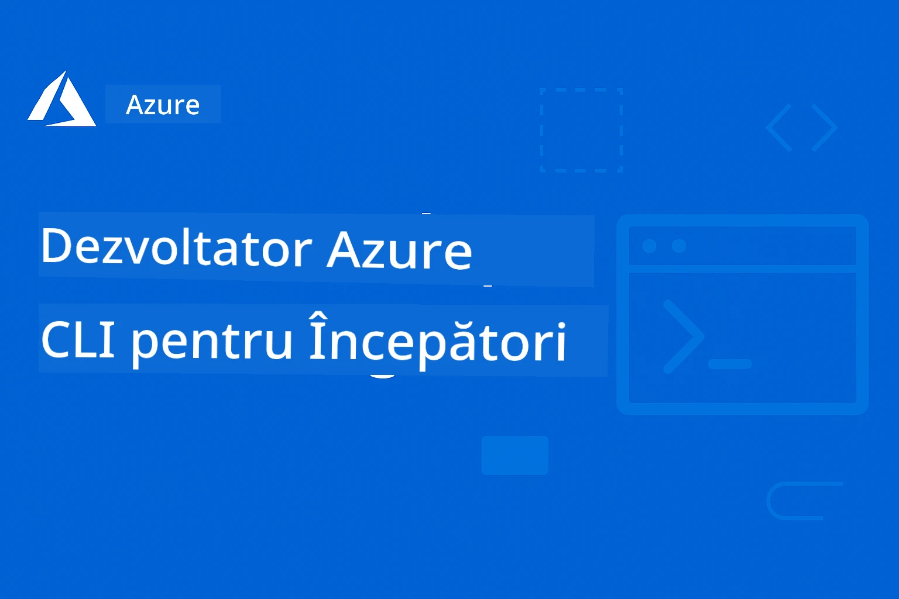

# AZD Pentru Începători: O Călătorie Structurată de Învățare

 

[](https://GitHub.com/microsoft/azd-for-beginners/watchers/)
[](https://GitHub.com/microsoft/azd-for-beginners/network/)
[](https://GitHub.com/microsoft/azd-for-beginners/stargazers/)

[](https://discord.gg/microsoft-azure)
[](https://discord.gg/nTYy5BXMWG)

---

### Traduceri Automate (Întotdeauna Actualizate)

<!-- CO-OP TRANSLATOR LANGUAGES TABLE START -->
[Arabic](../ar/README.md) | [Bengali](../bn/README.md) | [Bulgarian](../bg/README.md) | [Burmese (Myanmar)](../my/README.md) | [Chinese (Simplified)](../zh-CN/README.md) | [Chinese (Traditional, Hong Kong)](../zh-HK/README.md) | [Chinese (Traditional, Macau)](../zh-MO/README.md) | [Chinese (Traditional, Taiwan)](../zh-TW/README.md) | [Croatian](../hr/README.md) | [Czech](../cs/README.md) | [Danish](../da/README.md) | [Dutch](../nl/README.md) | [Estonian](../et/README.md) | [Finnish](../fi/README.md) | [French](../fr/README.md) | [German](../de/README.md) | [Greek](../el/README.md) | [Hebrew](../he/README.md) | [Hindi](../hi/README.md) | [Hungarian](../hu/README.md) | [Indonesian](../id/README.md) | [Italian](../it/README.md) | [Japanese](../ja/README.md) | [Kannada](../kn/README.md) | [Korean](../ko/README.md) | [Lithuanian](../lt/README.md) | [Malay](../ms/README.md) | [Malayalam](../ml/README.md) | [Marathi](../mr/README.md) | [Nepali](../ne/README.md) | [Nigerian Pidgin](../pcm/README.md) | [Norwegian](../no/README.md) | [Persian (Farsi)](../fa/README.md) | [Polish](../pl/README.md) | [Portuguese (Brazil)](../pt-BR/README.md) | [Portuguese (Portugal)](../pt-PT/README.md) | [Punjabi (Gurmukhi)](../pa/README.md) | [Romanian](./README.md) | [Russian](../ru/README.md) | [Serbian (Cyrillic)](../sr/README.md) | [Slovak](../sk/README.md) | [Slovenian](../sl/README.md) | [Spanish](../es/README.md) | [Swahili](../sw/README.md) | [Swedish](../sv/README.md) | [Tagalog (Filipino)](../tl/README.md) | [Tamil](../ta/README.md) | [Telugu](../te/README.md) | [Thai](../th/README.md) | [Turkish](../tr/README.md) | [Ukrainian](../uk/README.md) | [Urdu](../ur/README.md) | [Vietnamese](../vi/README.md)

> **Preferi să Clonezi Local?**
>
> Acest depozit include traduceri în peste 50 de limbi, ceea ce crește semnificativ dimensiunea descărcării. Pentru a clona fără traduceri, folosește sparse checkout:
>
> **Bash / macOS / Linux:**
> ```bash
> git clone --filter=blob:none --sparse https://github.com/microsoft/AZD-for-beginners.git
> cd AZD-for-beginners
> git sparse-checkout set --no-cone '/*' '!translations' '!translated_images'
> ```
>
> **CMD (Windows):**
> ```cmd
> git clone --filter=blob:none --sparse https://github.com/microsoft/AZD-for-beginners.git
> cd AZD-for-beginners
> git sparse-checkout set --no-cone "/*" "!translations" "!translated_images"
> ```
>
> Aceasta îți oferă tot ce ai nevoie pentru a finaliza cursul cu o descărcare mult mai rapidă.
<!-- CO-OP TRANSLATOR LANGUAGES TABLE END -->

## 🆕 Ce este Nou în azd Azi

Azure Developer CLI a crescut dincolo de aplicațiile web și API-urile tradiționale. Astăzi, azd este singurul instrument pentru a implementa **orice** aplicație în Azure — inclusiv aplicații AI și agenți inteligenți.

Iată ce înseamnă asta pentru tine:

- **Agenții AI sunt acum sarcini azd de primă clasă.** Poți iniția, implementa și gestiona proiecte cu agenți AI folosind același flux de lucru `azd init` → `azd up` pe care îl cunoști deja.
- **Integrarea Microsoft Foundry** aduce implementarea modelelor, găzduirea agenților și configurarea serviciilor AI direct în ecosistemul șabloanelor azd.
- **Fluxul de lucru principal nu s-a schimbat.** Indiferent dacă implementezi o aplicație todo, un microserviciu sau o soluție AI multi-agent, comenzile sunt aceleași.

Dacă ai folosit azd înainte, suportul AI este o extensie naturală — nu un instrument separat sau o cale avansată. Dacă începi de la zero, vei învăța un singur flux de lucru care funcționează pentru toate.

---

## 🚀 Ce este Azure Developer CLI (azd)?

**Azure Developer CLI (azd)** este un instrument de linie de comandă prietenos cu dezvoltatorii, care face simplă implementarea aplicațiilor în Azure. În loc să creezi și să conectezi manual zeci de resurse Azure, poți implementa aplicații complete cu o singură comandă.

### Magia lui `azd up`

```bash
# Această singură comandă face totul:
# ✅ Creează toate resursele Azure
# ✅ Configurează rețeaua și securitatea
# ✅ Construiește codul aplicației tale
# ✅ Publică în Azure
# ✅ Îți oferă o adresă URL funcțională
azd up
```

**Atât!** Fără click-uri în Azure Portal, fără să înveți întâi șabloane ARM complexe, fără configurare manuală — doar aplicații funcționale în Azure.

---

## ❓ Azure Developer CLI vs Azure CLI: Care este Diferența?

Aceasta este cea mai frecventă întrebare pe care o pun începătorii. Iată răspunsul simplu:

| Caracteristică | **Azure CLI (`az`)** | **Azure Developer CLI (`azd`)** |
|----------------|---------------------|--------------------------------|
| **Scop** | Gestionarea resurselor individuale Azure | Implementarea aplicațiilor complete |
| **Mentalitate** | Focalizat pe infrastructură | Focalizat pe aplicații |
| **Exemplu** | `az webapp create --name myapp...` | `azd up` |
| **Curba de învățare** | Trebuie să cunoști serviciile Azure | Trebuie să știi doar aplicația ta |
| **Cel mai potrivit pentru** | DevOps, Infrastructură | Dezvoltatori, Prototipare |

### Analogie Simplă

- **Azure CLI** este ca și cum ai avea toate uneltele pentru a construi o casă — ciocane, ferăstraie, cuie. Poți construi orice, dar trebuie să știi construcții.
- **Azure Developer CLI** este ca și cum ai angaja un antreprenor — descrii ce vrei și el se ocupă de construcție.

### Când să folosești fiecare

| Scenariu | Utilizează Aceasta |
|----------|-------------------|
| "Vreau să implementez rapid aplicația web" | `azd up` |
| "Trebuie să creez doar un cont de stocare" | `az storage account create` |
| "Construiesc o aplicație AI completă" | `azd init --template azure-search-openai-demo` |
| "Trebuie să debughez o resursă Azure specifică" | `az resource show` |
| "Vreau implementare pregătită pentru producție în câteva minute" | `azd up --environment production` |

### Funcționează Împreună!

AZD folosește Azure CLI în fundal. Poți utiliza ambele:
```bash
# Implementați aplicația dvs. cu AZD
azd up

# Apoi ajustați resursele specifice cu Azure CLI
az webapp config set --name myapp --always-on true
```

---

## 🌟 Găsește Șabloane în Awesome AZD

Nu începe de la zero! **Awesome AZD** este colecția comunității de șabloane gata de implementat:

| Resursă | Descriere |
|----------|-------------|
| 🔗 [**Galeria Awesome AZD**](https://azure.github.io/awesome-azd/) | Răsfoiește peste 200 de șabloane cu implementare dintr-un click |
| 🔗 [**Trimite un Șablon**](https://github.com/Azure/awesome-azd/issues) | Contribuie cu propriul tău șablon comunității |
| 🔗 [**Depozitul GitHub**](https://github.com/Azure/awesome-azd) | Apasă steaua și explorează sursa |

### Șabloane AI Populare din Awesome AZD

```bash
# RAG Chat cu modelele Microsoft Foundry + căutare AI
azd init --template azure-search-openai-demo

# Aplicație rapidă de chat AI
azd init --template openai-chat-app-quickstart

# Agenți AI cu agenți Foundry
azd init --template get-started-with-ai-agents
```

---

## 🎯 Începe în 3 Pași

### Pasul 1: Instalează AZD (2 minute)

**Windows:**
```powershell
winget install microsoft.azd
```

**macOS:**
```bash
brew tap azure/azd && brew install azd
```

**Linux:**
```bash
curl -fsSL https://aka.ms/install-azd.sh | bash
```

### Pasul 2: Conectează-te la Azure

```bash
azd auth login
```

### Pasul 3: Implementează Prima Ta Aplicație

```bash
# Inițializează dintr-un șablon
azd init --template todo-nodejs-mongo

# Desfășoară în Azure (creează totul!)
azd up
```

**🎉 Gata!** Aplicația ta este acum live pe Azure.

### Curățare (Nu Uita!)

```bash
# Remove all resources when done experimenting
azd down --force --purge
```

---

## 📚 Cum să Folosești Acest Curs

Acest curs este conceput pentru **învățare progresivă** — începe unde te simți confortabil și avansează:

| Experiența ta | Începe Aici |
|---------------|-------------|
| **Începător complet în Azure** | [Capitolul 1: Fundamente](#-chapter-1-foundation--quick-start) |
| **Cunoști Azure, dar AZD este nou pentru tine** | [Capitolul 1: Fundamente](#-chapter-1-foundation--quick-start) |
| **Vrei să implementezi aplicații AI** | [Capitolul 2: Dezvoltare cu AI pe Primul Loc](#-chapter-2-ai-first-development-recommended-for-ai-developers) |
| **Vrei practică hands-on** | [🎓 Atelier Interactiv](workshop/README.md) - laborator ghidat de 3-4 ore |
| **Ai nevoie de pattern-uri pentru producție** | [Capitolul 8: Producție & Enterprise](#-chapter-8-production--enterprise-patterns) |

### Configurare Rapidă

1. **Fork la Acest Depozit**: [](https://GitHub.com/microsoft/azd-for-beginners/fork)
2. **Clonează-l**: `git clone https://github.com/YOUR-USERNAME/azd-for-beginners.git`
3. **Cere Ajutor**: [Comunitatea Azure Discord](https://discord.com/invite/ByRwuEEgH4)

> **Preferi să Clonezi Local?**

> Acest depozit include traduceri în peste 50 de limbi, ceea ce crește semnificativ dimensiunea descărcării. Pentru a clona fără traduceri, folosește sparse checkout:
> ```bash
> git clone --filter=blob:none --sparse https://github.com/microsoft/AZD-for-beginners.git
> cd AZD-for-beginners
> git sparse-checkout set --no-cone '/*' '!translations' '!translated_images'
> ```
> Aceasta îți oferă tot ce ai nevoie pentru a finaliza cursul cu o descărcare mult mai rapidă.


## Prezentare Generală a Cursului

Stăpânește Azure Developer CLI (azd) prin capitole structurate, concepute pentru învățare progresivă. **Focus special pe implementarea aplicațiilor AI cu integrarea Microsoft Foundry.**

### De ce este Esențial acest Curs pentru Dezvoltatorii Moderni

Bazat pe feedback-ul comunității Microsoft Foundry Discord, **45% dintre dezvoltatori vor să folosească AZD pentru sarcini AI** dar se confruntă cu dificultăți legate de:
- Arhitecturi AI complexe multi-servicii
- Cele mai bune practici pentru implementarea AI în producție  
- Integrarea și configurarea serviciilor Azure AI
- Optimizarea costurilor pentru sarcinile AI
- Depanarea problemelor specifice implementării AI

### Obiectivele de Învățare

Parcurgând acest curs structurat, vei:
- **Stăpâni Bazele AZD**: Concepute cheie, instalare și configurare
- **Implementa Aplicații AI**: Folosește AZD împreună cu serviciile Microsoft Foundry
- **Implementa Infrastructure as Code**: Gestionează resurse Azure cu șabloane Bicep
- **Depana Implementările**: Rezolvă probleme comune și debugează
- **Optimizează pentru Producție**: Securitate, scalare, monitorizare și management de costuri
- **Construiește Soluții Multi-Agent**: Implementează arhitecturi AI complexe

## 🗺️ Harta Cursului: Navigare Rapidă pe Capitole

Fiecare capitol are un README dedicat cu obiective de învățare, quick start-uri și exerciții:

| Capitol | Subiect | Lecții | Durată | Complexitate |
|---------|---------|--------|--------|-------------|
| **[Cap 1: Fundament](docs/chapter-01-foundation/README.md)** | Început | [Bazele AZD](docs/chapter-01-foundation/azd-basics.md) &#124; [Instalare](docs/chapter-01-foundation/installation.md) &#124; [Primul Proiect](docs/chapter-01-foundation/first-project.md) | 30-45 min | ⭐ |
| **[Ch 2: Dezvoltare AI](docs/chapter-02-ai-development/README.md)** | Aplicații AI-First | [Integrare Foundry](docs/chapter-02-ai-development/microsoft-foundry-integration.md) &#124; [Agenți AI](docs/chapter-02-ai-development/agents.md) &#124; [Implementare Model](docs/chapter-02-ai-development/ai-model-deployment.md) &#124; [Atelier](docs/chapter-02-ai-development/ai-workshop-lab.md) | 1-2 ore | ⭐⭐ |
| **[Ch 3: Configurare](docs/chapter-03-configuration/README.md)** | Autentificare & Securitate | [Configurare](docs/chapter-03-configuration/configuration.md) &#124; [Autentificare & Securitate](docs/chapter-03-configuration/authsecurity.md) | 45-60 min | ⭐⭐ |
| **[Ch 4: Infrastructură](docs/chapter-04-infrastructure/README.md)** | IaC & Implementare | [Ghid de Implementare](docs/chapter-04-infrastructure/deployment-guide.md) &#124; [Provisionare](docs/chapter-04-infrastructure/provisioning.md) | 1-1.5 ore | ⭐⭐⭐ |
| **[Ch 5: Multi-Agenți](docs/chapter-05-multi-agent/README.md)** | Soluții Agenți AI | [Scenariu Retail](examples/retail-scenario.md) &#124; [Modele de Coordonare](docs/chapter-06-pre-deployment/coordination-patterns.md) | 2-3 ore | ⭐⭐⭐⭐ |
| **[Ch 6: Pre-Implementare](docs/chapter-06-pre-deployment/README.md)** | Planificare & Validare | [Verificări Prealabile](docs/chapter-06-pre-deployment/preflight-checks.md) &#124; [Planificare Capacitate](docs/chapter-06-pre-deployment/capacity-planning.md) &#124; [Selecție SKU](docs/chapter-06-pre-deployment/sku-selection.md) &#124; [App Insights](docs/chapter-06-pre-deployment/application-insights.md) | 1 oră | ⭐⭐ |
| **[Ch 7: Depanare](docs/chapter-07-troubleshooting/README.md)** | Depanare & Reparare | [Probleme Comune](docs/chapter-07-troubleshooting/common-issues.md) &#124; [Depanare](docs/chapter-07-troubleshooting/debugging.md) &#124; [Probleme AI](docs/chapter-07-troubleshooting/ai-troubleshooting.md) | 1-1.5 ore | ⭐⭐ |
| **[Ch 8: Producție](docs/chapter-08-production/README.md)** | Modele Enterprise | [Practici de Producție](docs/chapter-08-production/production-ai-practices.md) | 2-3 ore | ⭐⭐⭐⭐ |
| **[🎓 Atelier](workshop/README.md)** | Laborator Practic | [Introducere](workshop/docs/instructions/0-Introduction.md) &#124; [Selecție](workshop/docs/instructions/1-Select-AI-Template.md) &#124; [Validare](workshop/docs/instructions/2-Validate-AI-Template.md) &#124; [Deconstrucție](workshop/docs/instructions/3-Deconstruct-AI-Template.md) &#124; [Configurare](workshop/docs/instructions/4-Configure-AI-Template.md) &#124; [Personalizare](workshop/docs/instructions/5-Customize-AI-Template.md) &#124; [Dezafectare](workshop/docs/instructions/6-Teardown-Infrastructure.md) &#124; [Încheiere](workshop/docs/instructions/7-Wrap-up.md) | 3-4 ore | ⭐⭐ |

**Durata totală a cursului:** ~10-14 ore | **Progres Skill:** Începător → Pregătit pentru Producție

---

## 📚 Capitole de Învățare

*Selectați calea de învățare în funcție de nivelul de experiență și obiective*

### 🚀 Capitolul 1: Fundament și Start Rapid
**Prerechizite**: Abonament Azure, cunoștințe de bază comandă linie  
**Durata**: 30-45 minute  
**Complexitate**: ⭐

#### Ce Veți Învăța
- Fundamentele Azure Developer CLI
- Instalarea AZD pe platforma dvs.
- Prima implementare de succes

#### Resurse de Învățare
- **🎯 Începeți aici**: [Ce este Azure Developer CLI?](#what-is-azure-developer-cli)
- **📖 Teorie**: [Bazele AZD](docs/chapter-01-foundation/azd-basics.md) - Concepte și terminologie esențiale
- **⚙️ Configurare**: [Instalare și Configurare](docs/chapter-01-foundation/installation.md) - Ghiduri specifice platformei
- **🛠️ Practic**: [Primul tău proiect](docs/chapter-01-foundation/first-project.md) - Tutorial pas cu pas
- **📋 Referință Rapidă**: [Fișă Comenzi](resources/cheat-sheet.md)

#### Exerciții Practice
```bash
# Verificare rapidă a instalării
azd version

# Publicați prima dvs. aplicație
azd init --template todo-nodejs-mongo
azd up
```

**💡 Rezultat Capitol**: Implementarea cu succes a unei aplicații web simple pe Azure folosind AZD

**✅ Validarea Succesului:**
```bash
# După finalizarea Capitolului 1, ar trebui să puteți:
azd version              # Arată versiunea instalată
azd init --template todo-nodejs-mongo  # Initializează proiectul
azd up                  # Realizează implementarea pe Azure
azd show                # Afișează URL-ul aplicației care rulează
# Aplicația se deschide în browser și funcționează
azd down --force --purge  # Curăță resursele
```

**📊 Timp Investit:** 30-45 minute  
**📈 Nivel Abilități După:** Poate implementa aplicații de bază independent

---

### 🤖 Capitolul 2: Dezvoltare AI-First (Recomandat pentru Dezvoltatori AI)
**Prerechizite**: Capitolul 1 finalizat  
**Durata**: 1-2 ore  
**Complexitate**: ⭐⭐

#### Ce Veți Învăța
- Integrarea Microsoft Foundry cu AZD
- Implementarea aplicațiilor cu capabilități AI
- Înțelegerea configurațiilor serviciilor AI

#### Resurse de Învățare
- **🎯 Începeți aici**: [Integrare Microsoft Foundry](docs/chapter-02-ai-development/microsoft-foundry-integration.md)
- **🤖 Agenți AI**: [Ghid Agenți AI](docs/chapter-02-ai-development/agents.md) - Implementați agenți inteligenți cu AZD
- **📖 Modele**: [Implementare Model AI](docs/chapter-02-ai-development/ai-model-deployment.md) - Implementați și gestionați modele AI
- **🛠️ Atelier**: [Laborator AI](docs/chapter-02-ai-development/ai-workshop-lab.md) - Pregătiți soluțiile AI pentru AZD
- **🎥 Ghid Interactiv**: [Materiale Atelier](workshop/README.md) - Învățare în browser cu MkDocs * Mediu DevContainer
- **📋 Șabloane**: [Șabloane Microsoft Foundry](#resurse-atelier)
- **📝 Exemple**: [Exemple Implementare AZD](examples/README.md)

#### Exerciții Practice
```bash
# Implementați prima dvs. aplicație AI
azd init --template azure-search-openai-demo
azd up

# Încercați șabloane AI suplimentare
azd init --template openai-chat-app-quickstart
azd init --template agent-openai-python-prompty
```

**💡 Rezultat Capitol**: Implementare și configurare a unei aplicații de chat AI cu capabilități RAG

**✅ Validarea Succesului:**
```bash
# După Capitolul 2, ar trebui să puteți:
azd init --template azure-search-openai-demo
azd up
# Testa interfața de chat AI
# Pune întrebări și primi răspunsuri generate de AI cu surse
# Verificați dacă integrarea căutării funcționează
azd monitor  # Verificați dacă Application Insights afișează telemetria
azd down --force --purge
```

**📊 Timp Investit:** 1-2 ore  
**📈 Nivel Abilități După:** Poate implementa și configura aplicații AI pregătite pentru producție  
**💰 Conștientizare Costuri:** Înțelege costuri dezvoltare $80-150/lună, producție $300-3500/lună

#### 💰 Considerații de Cost pentru Implementările AI

**Mediu de Dezvoltare (Estimativ $80-150/lună):**
- Modele Microsoft Foundry (Plată pe utilizare): $0-50/lună (în funcție de utilizarea tokenilor)
- AI Search (nivel de bază): $75/lună
- Container Apps (Consum): $0-20/lună
- Stocare (Standard): $1-5/lună

**Mediu de Producție (Estimativ $300-3,500+/lună):**
- Modele Microsoft Foundry (PTU pentru performanță constantă): $3,000+/lună SAU Plată pe utilizare cu volum mare
- AI Search (nivel standard): $250/lună
- Container Apps (Dedicate): $50-100/lună
- Application Insights: $5-50/lună
- Stocare (Premium): $10-50/lună

**💡 Sfaturi Optimizare Costuri:**
- Folosiți **Nivel Gratuit** pentru Modele Microsoft Foundry pentru învățare (Azure OpenAI 50.000 tokeni/lună inclus)
- Rulați `azd down` pentru a dealoca resurse când nu dezvoltați activ
- Începeți cu facturare pe consum, treceți la PTU doar pentru producție
- Folosiți `azd provision --preview` pentru a estima costurile înainte de implementare
- Activați auto-scalare: plătiți doar pentru utilizarea efectivă

**Monitorizare Costuri:**
```bash
# Verifică costurile lunare estimate
azd provision --preview

# Monitorizează costurile reale în Azure Portal
az consumption budget list --resource-group <your-rg>
```

---

### ⚙️ Capitolul 3: Configurare & Autentificare
**Prerechizite**: Capitolul 1 finalizat  
**Durata**: 45-60 minute  
**Complexitate**: ⭐⭐

#### Ce Veți Învăța
- Configurarea și gestionarea mediilor
- Cele mai bune practici de autentificare și securitate
- Denumirea și organizarea resurselor

#### Resurse de Învățare
- **📖 Configurare**: [Ghid Configurare](docs/chapter-03-configuration/configuration.md) - Setarea mediului
- **🔐 Securitate**: [Pattern-uri Autentificare și Identitate Gestionată](docs/chapter-03-configuration/authsecurity.md) - Modele autentificare
- **📝 Exemple**: [Exemplu Aplicație Bază de Date](examples/database-app/README.md) - Exemple baze de date AZD

#### Exerciții Practice
- Configurați mai multe medii (dev, staging, prod)
- Configurați autentificarea cu identitate gestionată
- Implementați configurații specifice mediului

**💡 Rezultat Capitol**: Gestionarea mai multor medii cu autentificare și securitate adecvate

---

### 🏗️ Capitolul 4: Infrastructură ca și Cod & Implementare
**Prerechizite**: Capitolele 1-3 finalizate  
**Durata**: 1-1.5 ore  
**Complexitate**: ⭐⭐⭐

#### Ce Veți Învăța
- Modele avansate de implementare
- Infrastructură ca și Cod cu Bicep
- Strategii de provisionare resurse

#### Resurse de Învățare
- **📖 Implementare**: [Ghid de Implementare](docs/chapter-04-infrastructure/deployment-guide.md) - Workflows complete
- **🏗️ Provisionare**: [Provisionare Resurse](docs/chapter-04-infrastructure/provisioning.md) - Gestionare resurse Azure
- **📝 Exemple**: [Exemplu Container App](../../examples/container-app) - Implementări containerizate

#### Exerciții Practice
- Creați șabloane Bicep personalizate
- Implementați aplicații multi-serviciu
- Implementați strategii de implementare blue-green

**💡 Rezultat Capitol**: Implementarea aplicațiilor complexe multi-serviciu folosind șabloane de infrastructură personalizate

---

### 🎯 Capitolul 5: Soluții AI Multi-Agenți (Avansat)
**Prerechizite**: Capitolele 1-2 finalizate  
**Durata**: 2-3 ore  
**Complexitate**: ⭐⭐⭐⭐

#### Ce Veți Învăța
- Modele arhitecturale multi-agent
- Orchestrare și coordonare agenți
- Implementări AI pregătite pentru producție

#### Resurse de Învățare
- **🤖 Proiect Recomandat**: [Soluție Multi-Agent Retail](examples/retail-scenario.md) - Implementare completă
- **🛠️ Șabloane ARM**: [Pachet Șabloane ARM](../../examples/retail-multiagent-arm-template) - Implementare cu un singur click
- **📖 Arhitectură**: [Modele coordonare multi-agent](docs/chapter-06-pre-deployment/coordination-patterns.md) - Modele

#### Exerciții Practice
```bash
# Implementați soluția completă multi-agent pentru retail
cd examples/retail-multiagent-arm-template
./deploy.sh

# Explorați configurațiile agenților
az deployment group show --resource-group <rg-name> --name <deployment-name>
```

**💡 Rezultat Capitol**: Implementarea și gestionarea unei soluții AI multi-agent pregătite pentru producție cu agenți Client și Inventar

---

### 🔍 Capitolul 6: Validare & Planificare Pre-Implementare
**Prerechizite**: Capitolul 4 finalizat  
**Durata**: 1 oră  
**Complexitate**: ⭐⭐

#### Ce Veți Învăța
- Planificarea capacității și validarea resurselor
- Strategii de selecție SKU
- Verificări pre-implementare și automatizare

#### Resurse de Învățare
- **📊 Planificare**: [Planificare Capacitate](docs/chapter-06-pre-deployment/capacity-planning.md) - Validare resurse
- **💰 Selecție**: [Selecție SKU](docs/chapter-06-pre-deployment/sku-selection.md) - Alegeri eficiente cost
- **✅ Validare**: [Verificări Prealabile](docs/chapter-06-pre-deployment/preflight-checks.md) - Scripturi automate

#### Exerciții Practice
- Rulați scripturi validare capacitate
- Optimizați selecțiile SKU pentru cost
- Implementați verificări automate pre-implementare

**💡 Rezultat Capitol**: Validarea și optimizarea implementărilor înainte de execuție

---

### 🚨 Capitolul 7: Depanare & Debugging
**Prerechizite**: Orice capitol de implementare finalizat  
**Durata**: 1-1.5 ore  
**Complexitate**: ⭐⭐

#### Ce Veți Învăța
- Abordări sistematice de depanare
- Probleme și soluții comune
- Depanare specifică serviciilor AI

#### Resurse de Învățare
- **🔧 Probleme Comune**: [Probleme Comune](docs/chapter-07-troubleshooting/common-issues.md) - Întrebări frecvente și soluții
- **🕵️ Depanare**: [Ghid Depanare](docs/chapter-07-troubleshooting/debugging.md) - Strategii pas cu pas
- **🤖 Probleme AI**: [Depanare Servicii AI](docs/chapter-07-troubleshooting/ai-troubleshooting.md) - Probleme AI

#### Exerciții Practice
- Diagnosticarea eșecurilor de implementare
- Rezolvarea problemelor de autentificare
- Depanarea conectivității serviciilor AI

**💡 Rezultat Capitol**: Diagnosticați și rezolvați independent probleme comune de implementare

---

### 🏢 Capitolul 8: Producție & Modele Enterprise
**Prerechizite**: Capitolele 1-4 finalizate  
**Durata**: 2-3 ore  
**Complexitate**: ⭐⭐⭐⭐

#### Ce Veți Învăța
- Strategii de implementare în producție
- Modele de securitate enterprise
- Monitorizare și optimizare costuri

#### Resurse de Învățare
- **🏭 Producție**: [Practici recomandate AI în producție](docs/chapter-08-production/production-ai-practices.md) - Modele enterprise  
- **📝 Exemple**: [Exemplu Microservicii](../../examples/microservices) - Arhitecturi complexe  
- **📊 Monitorizare**: [Integrare Application Insights](docs/chapter-06-pre-deployment/application-insights.md) - Monitorizare

#### Exerciții practice
- Implementați modele de securitate enterprise  
- Configurați monitorizare cuprinzătoare  
- Implementați în producție cu guvernanță adecvată

**💡 Rezultatul capitolului**: Implementați aplicații pregătite pentru producție cu capabilități complete

---

## 🎓 Prezentarea atelierului: Experiență practică de învățare

> **⚠️ STARE ATELIER: Dezvoltare activă**  
> Materialele atelierului sunt în curs de dezvoltare și rafinare. Modulele principale sunt funcționale, dar unele secțiuni avansate sunt incomplete. Lucrăm activ pentru finalizarea întregului conținut. [Urmăriți progresul →](workshop/README.md)

### Materiale interactive pentru atelier  
**Învățare practică completă cu instrumente browser și exerciții ghidate**

Materialele atelierului oferă o experiență de învățare structurată și interactivă, complementară curriculei pe capitole de mai sus. Atelierul este conceput atât pentru învățare individuală, cât și pentru sesiuni conduse de instructor.

#### 🛠️ Caracteristici atelier
- **Interfață bazată pe browser**: Atelier complet alimentat de MkDocs cu căutare, copiere și teme  
- **Integrare GitHub Codespaces**: Configurarea mediului de dezvoltare cu un singur clic  
- **Parcurs de învățare structurat**: 8 module cu exerciții ghidate (3-4 ore total)  
- **Metodologie progresivă**: Introducere → Selecție → Validare → Deconstrucție → Configurare → Personalizare → Dezasamblare → Concluzii  
- **Mediu interactiv DevContainer**: Instrumente și dependențe preconfigurate  

#### 📚 Structura modulelor atelierului  
Atelierul urmează o **metodologie progresivă în 8 module** care te conduce de la descoperire la stăpânirea implementării:

| Modul | Subiect | Ce vei face | Durată |
|--------|---------|-------------|--------|
| **0. Introducere** | Prezentarea atelierului | Înțelegerea obiectivelor, prerechizitelor și structurii atelierului | 15 min |
| **1. Selecție** | Descoperire șabloane | Explorarea șabloanelor AZD și selecția celui potrivit pentru scenariul tău AI | 20 min |
| **2. Validare** | Implementare & verificare | Implementarea șablonului cu `azd up` și validarea funcționării infrastructurii | 30 min |
| **3. Deconstrucție** | Înțelegerea structurii | Folosirea GitHub Copilot pentru explorarea arhitecturii șablonului, fișiere Bicep și organizarea codului | 30 min |
| **4. Configurare** | Studio aprofundat azure.yaml | Stăpânirea configurației `azure.yaml`, hook-uri lifecycle și variabile de mediu | 30 min |
| **5. Personalizare** | Facă-l al tău | Activarea AI Search, tracing, evaluare și personalizare pentru scenariul propriu | 45 min |
| **6. Dezasamblare** | Curățare | Dezprovisionarea sigură a resurselor cu `azd down --purge` | 15 min |
| **7. Concluzii** | Pași următori | Recapitularea realizărilor, conceptelor cheie și continuarea procesului de învățare | 15 min |

**Flux atelier:**  
```
Introduction → Selection → Validation → Deconstruction → Configuration → Customization → Teardown → Wrap-up
     ↓            ↓           ↓              ↓               ↓              ↓            ↓           ↓
  Overview    Find the     Deploy &      Explore        Master         Customize     Clean up    Review &
             right        verify        code &        azure.yaml      for your      resources   next steps
             template                   structure                     scenario
```
  
#### 🚀 Primii pași cu atelierul  
```bash
# Opțiunea 1: GitHub Codespaces (Recomandat)
# Faceți clic pe "Code" → "Create codespace on main" în depozit

# Opțiunea 2: Dezvoltare locală
git clone https://github.com/microsoft/azd-for-beginners.git
cd azd-for-beginners/workshop
# Urmați instrucțiunile de configurare din workshop/README.md
```
  
#### 🎯 Rezultatele învățării în atelier  
Finalizând atelierul, participanții vor:  
- **Implementa aplicații AI în producție**: Folosind AZD cu serviciile Microsoft Foundry  
- **Stăpâni arhitecturi multi-agent**: Implementează soluții AI coordonate multi-agent  
- **Implementa cele mai bune practici de securitate**: Configurare autentificare și control acces  
- **Optimizeze pentru scalabilitate**: Proiectare implementări eficiente și cost-avantajoase  
- **Depaneze implementări**: Rezolve probleme comune independent  

#### 📖 Resurse atelier  
- **🎥 Ghid interactiv**: [Materiale Atelier](workshop/README.md) - Mediu de învățare în browser  
- **📋 Instrucțiuni modulate**:  
  - [0. Introducere](workshop/docs/instructions/0-Introduction.md) - Prezentare atelier și obiective  
  - [1. Selecție](workshop/docs/instructions/1-Select-AI-Template.md) - Găsește și selectează șabloane AI  
  - [2. Validare](workshop/docs/instructions/2-Validate-AI-Template.md) - Implementare și verificare șabloane  
  - [3. Deconstrucție](workshop/docs/instructions/3-Deconstruct-AI-Template.md) - Explorarea arhitecturii șablonului  
  - [4. Configurare](workshop/docs/instructions/4-Configure-AI-Template.md) - Stăpânirea azure.yaml  
  - [5. Personalizare](workshop/docs/instructions/5-Customize-AI-Template.md) - Personalizare pentru scenariul tău  
  - [6. Dezasamblare](workshop/docs/instructions/6-Teardown-Infrastructure.md) - Curățarea resurselor  
  - [7. Concluzii](workshop/docs/instructions/7-Wrap-up.md) - Recapitulare și pași următori  
- **🛠️ Laborator AI Atelier**: [Laborator AI Atelier](docs/chapter-02-ai-development/ai-workshop-lab.md) - Exerciții axate pe AI  
- **💡 Pornire rapidă**: [Ghid configurare atelier](workshop/README.md#quick-start) - Configurarea mediului

**Ideal pentru**: training corporativ, cursuri universitare, învățare auto-guiată și bootcamp-uri pentru dezvoltatori.

---

## 📖 Explorare detaliată: Capabilitățile AZD

Dincolo de bază, AZD oferă funcționalități puternice pentru implementări în producție:

- **Implementări bazate pe șabloane** - Folosește șabloane predefinite pentru modele comune de aplicații  
- **Infrastructure as Code** - Gestionează resurse Azure folosind Bicep sau Terraform  
- **Fluxuri de lucru integrate** - Provisionează, implementează și monitorizează aplicații fluent  
- **Prietenos cu dezvoltatorii** - Optimizat pentru productivitate și experiență dezvoltator  

### **AZD + Microsoft Foundry: Ideal pentru implementări AI**

**De ce AZD pentru soluții AI?** AZD răspunde principalelor provocări ale dezvoltatorilor AI:

- **Șabloane pregătite pentru AI** - Șabloane preconfigurate pentru modele Microsoft Foundry, Cognitive Services și sarcini ML  
- **Implementări AI securizate** - Modele de securitate integrate pentru servicii AI, chei API și endpoint-uri model  
- **Modele AI pentru producție** - Cele mai bune practici pentru implementări scalabile și eficiente cost  
- **Fluxuri AI end-to-end** - De la dezvoltare model la implementare în producție și monitorizare adecvată  
- **Optimizare costuri** - Alocare inteligentă a resurselor și strategii de scalare pentru workload-uri AI  
- **Integrare Microsoft Foundry** - Conectare perfectă la catalogul și endpoint-urile Microsoft Foundry  

---

## 🎯 Bibliotecă șabloane și exemple

### Recomandate: Șabloane Microsoft Foundry  
**Începe aici dacă implementezi aplicații AI!**

> **Notă:** Aceste șabloane demonstrează diverse modele AI. Unele sunt Azure Samples externe, altele implementări locale.

| Șablon | Capitol | Complexitate | Servicii | Tip |
|--------|---------|--------------|----------|-----|
| [**Începe cu chat AI**](https://github.com/Azure-Samples/get-started-with-ai-chat) | Capitolul 2 | ⭐⭐ | AzureOpenAI + Azure AI Model Inference API + Azure AI Search + Azure Container Apps + Application Insights | Extern |
| [**Începe cu agenți AI**](https://github.com/Azure-Samples/get-started-with-ai-agents) | Capitolul 2 | ⭐⭐ | Foundry Agents + AzureOpenAI + Azure AI Search + Azure Container Apps + Application Insights | Extern |
| [**Demo Azure Search + OpenAI**](https://github.com/Azure-Samples/azure-search-openai-demo) | Capitolul 2 | ⭐⭐ | AzureOpenAI + Azure AI Search + App Service + Storage | Extern |
| [**OpenAI Chat App Quickstart**](https://github.com/Azure-Samples/openai-chat-app-quickstart) | Capitolul 2 | ⭐ | AzureOpenAI + Container Apps + Application Insights | Extern |
| [**Agent OpenAI Python Prompty**](https://github.com/Azure-Samples/agent-openai-python-prompty) | Capitolul 5 | ⭐⭐⭐ | AzureOpenAI + Azure Functions + Prompty | Extern |
| [**Contoso Chat RAG**](https://github.com/Azure-Samples/contoso-chat) | Capitolul 8 | ⭐⭐⭐⭐ | AzureOpenAI + AI Search + Cosmos DB + Container Apps | Extern |
| [**Soluție Multi-Agent Retail**](examples/retail-scenario.md) | Capitolul 5 | ⭐⭐⭐⭐ | AzureOpenAI + AI Search + Storage + Container Apps + Cosmos DB | **Local** |

### Recomandate: Scenarii complete de învățare  
**Șabloane aplicații pregătite pentru producție, mapate după capitole**

| Șablon | Capitol Învățare | Complexitate | Învățare cheie |
|--------|------------------|--------------|---------------|
| [**openai-chat-app-quickstart**](https://github.com/Azure-Samples/openai-chat-app-quickstart) | Capitolul 2 | ⭐ | Modele de bază pentru implementări AI |
| [**azure-search-openai-demo**](https://github.com/Azure-Samples/azure-search-openai-demo) | Capitolul 2 | ⭐⭐ | Implementare RAG cu Azure AI Search |
| [**ai-document-processing**](https://github.com/Azure-Samples/ai-document-processing) | Capitolul 4 | ⭐⭐ | Integrare Document Intelligence |
| [**agent-openai-python-prompty**](https://github.com/Azure-Samples/agent-openai-python-prompty) | Capitolul 5 | ⭐⭐⭐ | Framework agenți și apel funcții |
| [**contoso-chat**](https://github.com/Azure-Samples/contoso-chat) | Capitolul 8 | ⭐⭐⭐ | Orchestrare AI enterprise |
| [**retail-multi-agent-solution**](examples/retail-scenario.md) | Capitolul 5 | ⭐⭐⭐⭐ | Arhitectură multi-agent cu agenți Client și Inventar |

### Învățare prin tip de exemplu  

> **📌 Exemple locale vs externe:**  
> **Exemple locale** (în acest repo) = Gata de utilizare imediată  
> **Exemple externe** (Azure Samples) = Clonează din repo-urile legate  

#### Exemple locale (gata de utilizare)  
- [**Soluție Multi-Agent Retail**](examples/retail-scenario.md) - Implementare completă pregătită pentru producție cu șabloane ARM  
  - Arhitectură multi-agent (agenți Client + Inventar)  
  - Monitorizare și evaluare cuprinzătoare  
  - Implementare cu un clic prin șablon ARM  

#### Exemple locale - Aplicații container (Capitolele 2-5)  
**Exemple complete de implementare container în acest repo:**  
- [**Exemple Container App**](examples/container-app/README.md) - Ghid complet pentru implementări containerizate  
  - [API Flask simplu](../../examples/container-app/simple-flask-api) - API REST de bază cu scalare la zero  
  - [Arhitectura Microservicii](../../examples/container-app/microservices) - Implementare multi-servicii pregătită pentru producție  
  - Modele de pornire rapidă, producție și implementări avansate  
  - Ghiduri pentru monitorizare, securitate și optimizare costuri  

#### Exemple externe - Aplicații simple (Capitolele 1-2)  
**Clonează aceste repo-uri Azure Samples pentru a începe:**  
- [Aplicație web simplă - Node.js + MongoDB](https://github.com/Azure-Samples/todo-nodejs-mongo) - Modele de bază implementare  
- [Website static - React SPA](https://github.com/Azure-Samples/todo-csharp-sql-swa-func) - Implementare conținut static  
- [Container App - Python Flask](https://github.com/Azure-Samples/container-apps-store-api-microservice) - Implementare REST API  

#### Exemple externe - Integrare bază de date (Capitolele 3-4)  
- [Aplicație bază de date - C# + SQL](https://github.com/Azure-Samples/todo-csharp-sql) - Modele de conectivitate bază de date  
- [Functions + Cosmos DB](https://github.com/Azure-Samples/todo-python-mongo-swa-func) - Flux date serverless  

#### Exemple externe - Modele avansate (Capitolele 4-8)  
- [Microservicii Java](https://github.com/Azure-Samples/java-microservices-aca-lab) - Arhitecturi multi-servicii  
- [Container Apps Jobs](https://github.com/Azure-Samples/container-apps-jobs) - Procesare background  
- [Pipeline ML enterprise](https://github.com/Azure-Samples/mlops-v2) - Modele ML pregătite pentru producție  

### Colecții șabloane externe  
- [**Galeria oficială șabloane AZD**](https://azure.github.io/awesome-azd/) - Colecție selectată de șabloane oficiale și comunitare  
- [**Șabloane Azure Developer CLI**](https://learn.microsoft.com/en-us/azure/developer/azure-developer-cli/azd-templates) - Documentație șabloane Microsoft Learn  
- [**Directorul Exemple**](examples/README.md) - Exemple locale de învățare cu explicații detaliate  

---

## 📚 Resurse de învățare & referințe

### Referințe rapide  
- [**Fișă comenzi**](resources/cheat-sheet.md) - Comenzi azd esențiale organizate pe capitole  
- [**Glosar**](resources/glossary.md) - Terminologie Azure și azd  
- [**Întrebări frecvente**](resources/faq.md) - Întrebări comune organizate pe capitolele de învățare  
- [**Ghid de studiu**](resources/study-guide.md) - Exerciții practice cuprinzătoare  

### Ateliere practice  
- [**Laborator AI Atelier**](docs/chapter-02-ai-development/ai-workshop-lab.md) - Fă soluțiile AI implementabile cu AZD (2-3 ore)  
- [**Atelier interactiv**](workshop/README.md) - Exerciții ghidate în 8 module cu MkDocs și GitHub Codespaces  
  - Urmează: Introducere → Selecție → Validare → Deconstrucție → Configurare → Personalizare → Dezasamblare → Concluzii  

### Resurse externe de învățare
- [Documentația Azure Developer CLI](https://learn.microsoft.com/en-us/azure/developer/azure-developer-cli/)
- [Centrul de Arhitectură Azure](https://learn.microsoft.com/en-us/azure/architecture/)
- [Calculatorul de prețuri Azure](https://azure.microsoft.com/pricing/calculator/)
- [Starea Azure](https://status.azure.com/)

### Abilități AI Agent pentru Editorul Tău
- [**Abilități Microsoft Azure pe skills.sh**](https://skills.sh/microsoft/github-copilot-for-azure) - 37 de abilități deschise pentru agenți AI Azure, Foundry, implementare, diagnosticare, optimizare costuri și altele. Instalează-le în GitHub Copilot, Cursor, Claude Code sau orice agent suportat:
  ```bash
  npx skills add microsoft/github-copilot-for-azure
  ```

---

## 🔧 Ghid Rapid de Depanare

**Probleme comune întâmpinate de începători și soluții imediate:**

<details>
<summary><strong>❌ "azd: comandă negăsită"</strong></summary>

```bash
# Instalați mai întâi AZD
# Windows (PowerShell):
winget install microsoft.azd

# macOS:
brew tap azure/azd && brew install azd

# Linux:
curl -fsSL https://aka.ms/install-azd.sh | bash

# Verificați instalarea
azd version
```
</details>

<details>
<summary><strong>❌ "Nu a fost găsit niciun abonament" sau "Abonamentul nu este setat"</strong></summary>

```bash
# Listează abonamentele disponibile
az account list --output table

# Setează abonamentul implicit
az account set --subscription "<subscription-id-or-name>"

# Setează pentru mediul AZD
azd env set AZURE_SUBSCRIPTION_ID "<subscription-id>"

# Verifică
az account show
```
</details>

<details>
<summary><strong>❌ "Quota insuficientă" sau "Cotă depășită"</strong></summary>

```bash
# Încearcă o regiune Azure diferită
azd env set AZURE_LOCATION "westus2"
azd up

# Sau folosește SKU-uri mai mici în dezvoltare
# Editează infra/main.parameters.json:
{
  "sku": "B1"  // Instead of "P1V2"
}
```
</details>

<details>
<summary><strong>❌ "azd up" eșuează la mijlocul procesului</strong></summary>

```bash
# Opțiunea 1: Curăță și încearcă din nou
azd down --force --purge
azd up

# Opțiunea 2: Remediază doar infrastructura
azd provision

# Opțiunea 3: Verifică starea detaliată
azd show

# Opțiunea 4: Verifică jurnalele în Azure Monitor
azd monitor --logs
```
</details>

<details>
<summary><strong>❌ "Autentificare eșuată" sau "Token expirat"</strong></summary>

```bash
# Reautentificare
az logout
az login

azd auth logout
azd auth login

# Verifică autentificarea
az account show
```
</details>

<details>
<summary><strong>❌ "Resursa există deja" sau conflicte de denumire</strong></summary>

```bash
# AZD generează nume unice, dar dacă există un conflict:
azd down --force --purge

# Atunci încearcă din nou cu un mediu nou
azd env new dev-v2
azd up
```
</details>

<details>
<summary><strong>❌ Implementarea șablonului durează prea mult</strong></summary>

**Timpuri normale de așteptare:**
- Aplicație web simplă: 5-10 minute
- Aplicație cu bază de date: 10-15 minute
- Aplicații AI: 15-25 minute (provisionarea OpenAI este lentă)

```bash
# Verifică progresul
azd show

# Dacă ești blocat >30 de minute, verifică portalul Azure:
azd monitor
# Caută implementări eșuate
```
</details>

<details>
<summary><strong>❌ "Permisiune refuzată" sau "Interzis"</strong></summary>

```bash
# Verificați rolul dvs. Azure
az role assignment list --assignee $(az account show --query user.name -o tsv)

# Aveți nevoie cel puțin de rolul "Contributor"
# Rugați administratorul dvs. Azure să acorde:
# - Contributor (pentru resurse)
# - Administrator acces utilizator (pentru atribuirea rolurilor)
```
</details>

<details>
<summary><strong>❌ Nu se găsește URL-ul aplicației implementate</strong></summary>

```bash
# Afișați toate punctele finale ale serviciului
azd show

# Sau deschideți portalul Azure
azd monitor

# Verificați serviciul specific
azd env get-values
# Căutați variabile *_URL
```
</details>

### 📚 Resurse Complete de Depanare

- **Ghid de Probleme Comune:** [Soluții Detaliate](docs/chapter-07-troubleshooting/common-issues.md)
- **Probleme Specifice AI:** [Depanarea AI](docs/chapter-07-troubleshooting/ai-troubleshooting.md)
- **Ghid de Debugging:** [Depanare pas cu pas](docs/chapter-07-troubleshooting/debugging.md)
- **Obține Ajutor:** [Azure Discord](https://discord.gg/microsoft-azure) #azure-developer-cli

---

## 🎓 Finalizarea Cursului & Certificare

### Urmărirea Progresului
Urmărește-ți progresul de învățare prin fiecare capitol:

- [ ] **Capitolul 1**: Bazele & Start Rapid ✅
- [ ] **Capitolul 2**: Dezvoltare AI-First ✅  
- [ ] **Capitolul 3**: Configurare & Autentificare ✅
- [ ] **Capitolul 4**: Infrastructură ca Cod & Implementare ✅
- [ ] **Capitolul 5**: Soluții AI Multi-Agent ✅
- [ ] **Capitolul 6**: Validare & Planificare Pre-Implementare ✅
- [ ] **Capitolul 7**: Depanare & Debugging ✅
- [ ] **Capitolul 8**: Modele pentru Producție & Enterprise ✅

### Verificarea Cunoștințelor
După terminarea fiecărui capitol, verifică-ți cunoștințele prin:
1. **Exercițiu Practic**: Completează implementarea practică a capitolului
2. **Test de Cunoștințe**: Recapitulează secțiunea FAQ pentru capitolul tău
3. **Discuție în Comunitate**: Împărtășește experiența în Azure Discord
4. **Capitolul Următor**: Treci la nivelul următor de complexitate

### Beneficii la Finalizarea Cursului
După finalizarea tuturor capitolelor, vei avea:
- **Experiență în Producție**: Ai implementat aplicații AI reale în Azure
- **Competențe Profesionale**: Capacități de implementare pregătite pentru mediul enterprise  
- **Recunoaștere în Comunitate**: Membru activ în comunitatea de dezvoltatori Azure
- **Avansare în Carieră**: Expertiză solicitată în AZD și implementare AI

---

## 🤝 Comunitate & Suport

### Obține Ajutor & Suport
- **Probleme Tehnice**: [Raportează erori și solicită funcționalități](https://github.com/microsoft/azd-for-beginners/issues)
- **Întrebări de Învățare**: [Comunitatea Microsoft Azure Discord](https://discord.gg/microsoft-azure) și [](https://discord.gg/nTYy5BXMWG)
- **Ajutor Specific AI**: Alătură-te [](https://discord.gg/nTYy5BXMWG)
- **Documentație**: [Documentația oficială Azure Developer CLI](https://learn.microsoft.com/en-us/azure/developer/azure-developer-cli/)

### Perspective Comunitare de la Microsoft Foundry Discord

**Rezultate recente ale sondajului din canalul #Azure:**
- **45%** dintre dezvoltatori doresc să folosească AZD pentru sarcini AI
- **Provocări principale**: implementări multi-servicii, gestionarea credentialelor, pregătirea pentru producție  
- **Cele mai solicitate**: șabloane specifice AI, ghiduri de depanare, bune practici

**Alătură-te comunității noastre pentru:**
- A împărtăși experiențele tale AZD + AI și a primi ajutor
- Acces la previzualizări timpurii ale noilor șabloane AI
- A contribui la bune practici pentru implementarea AI
- A influența dezvoltarea viitoarelor funcționalități AI + AZD

### Contribuții la Curs
Binevenite contribuțiile! Te rugăm să citești [Ghidul de Contribuire](CONTRIBUTING.md) pentru detalii despre:
- **Îmbunătățirea Conținutului**: Îmbunătățește capitolele și exemplele existente
- **Exemple Noi**: Adaugă scenarii și șabloane din lumea reală  
- **Traducere**: Ajută la menținerea suportului multilingv
- **Raportarea Erorilor**: Îmbunătățește acuratețea și claritatea
- **Standardele Comunității**: Urmează ghidurile noastre inclusive

---

## 📄 Informații despre Curs

### Licență
Acest proiect este licențiat sub Licența MIT - consultă fișierul [LICENSE](../../LICENSE) pentru detalii.

### Resurse Microsoft Learning Asociate

Echipa noastră produce alte cursuri cuprinzătoare:

<!-- CO-OP TRANSLATOR OTHER COURSES START -->
### LangChain
[](https://aka.ms/langchain4j-for-beginners)
[](https://aka.ms/langchainjs-for-beginners?WT.mc_id=m365-94501-dwahlin)
[](https://github.com/microsoft/langchain-for-beginners?WT.mc_id=m365-94501-dwahlin)
---

### Azure / Edge / MCP / Agenți
[](https://github.com/microsoft/AZD-for-beginners?WT.mc_id=academic-105485-koreyst)
[](https://github.com/microsoft/edgeai-for-beginners?WT.mc_id=academic-105485-koreyst)
[](https://github.com/microsoft/mcp-for-beginners?WT.mc_id=academic-105485-koreyst)
[](https://github.com/microsoft/ai-agents-for-beginners?WT.mc_id=academic-105485-koreyst)

---
 
### Seria AI Generativ
[](https://github.com/microsoft/generative-ai-for-beginners?WT.mc_id=academic-105485-koreyst)
[-9333EA?style=for-the-badge&labelColor=E5E7EB&color=9333EA)](https://github.com/microsoft/Generative-AI-for-beginners-dotnet?WT.mc_id=academic-105485-koreyst)
[-C084FC?style=for-the-badge&labelColor=E5E7EB&color=C084FC)](https://github.com/microsoft/generative-ai-for-beginners-java?WT.mc_id=academic-105485-koreyst)
[-E879F9?style=for-the-badge&labelColor=E5E7EB&color=E879F9)](https://github.com/microsoft/generative-ai-with-javascript?WT.mc_id=academic-105485-koreyst)

---
 
### Învățare de Bază
[](https://aka.ms/ml-beginners?WT.mc_id=academic-105485-koreyst)
[](https://aka.ms/datascience-beginners?WT.mc_id=academic-105485-koreyst)
[](https://aka.ms/ai-beginners?WT.mc_id=academic-105485-koreyst)
[](https://github.com/microsoft/Security-101?WT.mc_id=academic-96948-sayoung)
[](https://aka.ms/webdev-beginners?WT.mc_id=academic-105485-koreyst)
[](https://aka.ms/iot-beginners?WT.mc_id=academic-105485-koreyst)
[](https://github.com/microsoft/xr-development-for-beginners?WT.mc_id=academic-105485-koreyst)

---
 
### Seria Copilot
[](https://aka.ms/GitHubCopilotAI?WT.mc_id=academic-105485-koreyst)
[](https://github.com/microsoft/mastering-github-copilot-for-dotnet-csharp-developers?WT.mc_id=academic-105485-koreyst)
[](https://github.com/microsoft/CopilotAdventures?WT.mc_id=academic-105485-koreyst)
<!-- CO-OP TRANSLATOR OTHER COURSES END -->

---

## 🗺️ Navigarea cursului

**🚀 Gata să începi să înveți?**

**Începători**: Începe cu [Capitolul 1: Bazele & Pornire rapidă](#-chapter-1-foundation--quick-start)  
**Dezvoltatori AI**: Sare la [Capitolul 2: Dezvoltare AI-First](#-chapter-2-ai-first-development-recommended-for-ai-developers)  
**Dezvoltatori experimentați**: Începe cu [Capitolul 3: Configurare & Autentificare](#️-chapter-3-configuration--authentication)

**Următorii pași**: [Începe Capitolul 1 - Bazele AZD](docs/chapter-01-foundation/azd-basics.md) →

---

<!-- CO-OP TRANSLATOR DISCLAIMER START -->
**Declinare de responsabilitate**:  
Acest document a fost tradus folosind serviciul de traducere AI [Co-op Translator](https://github.com/Azure/co-op-translator). Deși ne străduim pentru acuratețe, vă rugăm să rețineți că traducerile automate pot conține erori sau inexactități. Documentul original în limba sa nativă ar trebui considerat sursa autoritară. Pentru informații critice, se recomandă traducerea profesională realizată de un specialist uman. Nu ne asumăm răspunderea pentru eventuale neînțelegeri sau interpretări greșite care pot apărea ca urmare a utilizării acestei traduceri.
<!-- CO-OP TRANSLATOR DISCLAIMER END -->