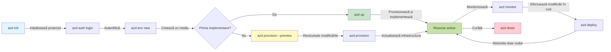

# AZD Basics - Înțelegerea Azure Developer CLI

# AZD Basics - Concepte de bază și fundamente

**Chapter Navigation:**
- **📚 Pagina cursului**: [AZD For Beginners](../../README.md)
- **📖 Capitolul curent**: Capitolul 1 - Fundament și Pornire rapidă
- **⬅️ Anterior**: [Course Overview](../../README.md#-chapter-1-foundation--quick-start)
- **➡️ Următor**: [Installation & Setup](installation.md)
- **🚀 Următorul capitol**: [Capitolul 2: Dezvoltare axată pe AI](../chapter-02-ai-development/microsoft-foundry-integration.md)

## Introducere

Această lecție te introduce în Azure Developer CLI (azd), o unealtă puternică de linie de comandă care îți accelerează trecerea de la dezvoltarea locală la implementarea în Azure. Vei învăța conceptele fundamentale, caracteristicile de bază și vei înțelege cum azd simplifică implementarea aplicațiilor cloud-native.

## Obiective de învățare

La sfârșitul acestei lecții, vei:
- Înțelege ce este Azure Developer CLI și scopul său principal
- Învață conceptele de bază despre template-uri, medii și servicii
- Explorează funcționalitățile cheie, inclusiv dezvoltarea bazată pe template-uri și Infrastructure as Code
- Înțelege structura proiectului azd și fluxul de lucru
- Fii pregătit să instalezi și să configurezi azd pentru mediul tău de dezvoltare

## Rezultate ale învățării

După ce finalizezi această lecție, vei putea:
- Explică rolul azd în fluxurile moderne de dezvoltare cloud
- Identifică componentele structurii unui proiect azd
- Descrie modul în care template-urile, mediile și serviciile lucrează împreună
- Înțelege beneficiile Infrastructure as Code cu azd
- Recunoaște diferitele comenzi azd și scopurile lor

## Ce este Azure Developer CLI (azd)?

Azure Developer CLI (azd) este o unealtă de linie de comandă concepută pentru a accelera trecerea de la dezvoltarea locală la implementarea în Azure. Simplifică procesul de construire, implementare și gestionare a aplicațiilor cloud-native pe Azure.

### 🎯 De ce să folosești AZD? O comparație din lumea reală

Să comparăm implementarea unei aplicații web simple cu bază de date:

#### ❌ FĂRĂ AZD: Implementare manuală în Azure (30+ minutes)

```bash
# Pas 1: Creează grup de resurse
az group create --name myapp-rg --location eastus

# Pas 2: Creează plan App Service
az appservice plan create --name myapp-plan \
  --resource-group myapp-rg \
  --sku B1 --is-linux

# Pas 3: Creează aplicație web
az webapp create --name myapp-web-unique123 \
  --resource-group myapp-rg \
  --plan myapp-plan \
  --runtime "NODE:18-lts"

# Pas 4: Creează cont Cosmos DB (10-15 minute)
az cosmosdb create --name myapp-cosmos-unique123 \
  --resource-group myapp-rg \
  --kind MongoDB

# Pas 5: Creează baza de date
az cosmosdb mongodb database create \
  --account-name myapp-cosmos-unique123 \
  --resource-group myapp-rg \
  --name tododb

# Pas 6: Creează colecție
az cosmosdb mongodb collection create \
  --account-name myapp-cosmos-unique123 \
  --resource-group myapp-rg \
  --database-name tododb \
  --name todos

# Pas 7: Obține șirul de conexiune
CONN_STR=$(az cosmosdb keys list \
  --name myapp-cosmos-unique123 \
  --resource-group myapp-rg \
  --type connection-strings \
  --query "connectionStrings[0].connectionString" -o tsv)

# Pas 8: Configurează setările aplicației
az webapp config appsettings set \
  --name myapp-web-unique123 \
  --resource-group myapp-rg \
  --settings MONGODB_URI="$CONN_STR"

# Pas 9: Activează jurnalizarea
az webapp log config --name myapp-web-unique123 \
  --resource-group myapp-rg \
  --application-logging filesystem \
  --detailed-error-messages true

# Pas 10: Configurează Application Insights
az monitor app-insights component create \
  --app myapp-insights \
  --location eastus \
  --resource-group myapp-rg

# Pas 11: Leagă App Insights de aplicația web
INSTRUMENTATION_KEY=$(az monitor app-insights component show \
  --app myapp-insights \
  --resource-group myapp-rg \
  --query "instrumentationKey" -o tsv)

az webapp config appsettings set \
  --name myapp-web-unique123 \
  --resource-group myapp-rg \
  --settings APPINSIGHTS_INSTRUMENTATIONKEY="$INSTRUMENTATION_KEY"

# Pas 12: Construiește aplicația local
npm install
npm run build

# Pas 13: Creează pachetul de implementare
zip -r app.zip . -x "*.git*" "node_modules/*"

# Pas 14: Implementează aplicația
az webapp deployment source config-zip \
  --resource-group myapp-rg \
  --name myapp-web-unique123 \
  --src app.zip

# Pas 15: Așteaptă și roagă-te să funcționeze 🙏
# (Fără validare automată, este necesară testarea manuală)
```

**Probleme:**
- ❌ Peste 15 comenzi de reținut și executat în ordine
- ❌ 30-45 minute de muncă manuală
- ❌ Ușor de făcut greșeli (greșeli de tastare, parametri incorecți)
- ❌ Stringurile de conectare expuse în istoricul terminalului
- ❌ Fără rollback automat dacă ceva eșuează
- ❌ Dificil de reprodus pentru membrii echipei
- ❌ Diferit de fiecare dată (nereproductibil)

#### ✅ CU AZD: Implementare automatizată (5 comenzi, 10-15 minutes)

```bash
# Pasul 1: Inițializați din șablon
azd init --template todo-nodejs-mongo

# Pasul 2: Autentificați-vă
azd auth login

# Pasul 3: Creați mediul
azd env new dev

# Pasul 4: Previzualizați modificările (opțional, dar recomandat)
azd provision --preview

# Pasul 5: Implementați totul
azd up

# ✨ Gata! Totul este implementat, configurat și monitorizat
```

**Beneficii:**
- ✅ **5 comenzi** vs. peste 15 pași manuali
- ✅ **10-15 minute** timp total (majoritar așteptare Azure)
- ✅ **Fără erori** - automatizat și testat
- ✅ **Secrete gestionate în siguranță** prin Key Vault
- ✅ **Rollback automat** la erori
- ✅ **Complet reproductibil** - același rezultat de fiecare dată
- ✅ **Pregătit pentru echipă** - oricine poate implementa cu aceleași comenzi
- ✅ **Infrastructure as Code** - template-uri Bicep controlate în versiuni
- ✅ **Monitorizare încorporată** - Application Insights configurat automat

### 📊 Reducerea timpului și a erorilor

| Metrică | Implementare manuală | Implementare AZD | Îmbunătățire |
|:-------|:------------------|:---------------|:------------|
| **Comenzi** | 15+ | 5 | cu 67% mai puține |
| **Timp** | 30-45 min | 10-15 min | cu 60% mai rapid |
| **Rata erorilor** | ~40% | <5% | reducere de 88% |
| **Consistență** | Scăzută (manual) | 100% (automatizat) | Perfectă |
| **Onboarding echipă** | 2-4 ore | 30 minute | cu 75% mai rapid |
| **Timp rollback** | 30+ min (manual) | 2 min (automatizat) | cu 93% mai rapid |

## Concepte de bază

### Template-uri
Template-urile sunt fundamentul azd. Ele conțin:
- **Codul aplicației** - Codul sursă și dependențele tale
- **Definiții de infrastructură** - Resurse Azure definite în Bicep sau Terraform
- **Fișiere de configurare** - Setări și variabile de mediu
- **Scripturi de implementare** - Fluxuri de lucru de implementare automatizate

### Medii
Mediile reprezintă ținte de implementare diferite:
- **Dezvoltare** - Pentru testare și dezvoltare
- **Staging** - Mediu pre-producție
- **Producție** - Mediu de producție live

Fiecare mediu își păstrează propriile:
- Azure resource group
- Setări de configurare
- Starea implementării

### Servicii
Serviciile sunt blocurile esențiale ale aplicației tale:
- **Frontend** - Aplicații web, SPA-uri
- **Backend** - API-uri, microservicii
- **Bază de date** - Soluții de stocare a datelor
- **Stocare** - Stocare de fișiere și bloburi

## Caracteristici cheie

### 1. Dezvoltare bazată pe template-uri
```bash
# Răsfoiți șabloanele disponibile
azd template list

# Inițializați dintr-un șablon
azd init --template <template-name>
```

### 2. Infrastructură ca Cod
- **Bicep** - Limbaj specific domeniului pentru Azure
- **Terraform** - Unealtă de infrastructură multi-cloud
- **ARM Templates** - Template-uri Azure Resource Manager

### 3. Fluxuri de lucru integrate
```bash
# Flux complet de implementare
azd up            # Provisionare + implementare — fără intervenție pentru configurarea inițială

# 🧪 NOU: Previzualizați modificările infrastructurii înainte de implementare (SIGUR)
azd provision --preview    # Simulați implementarea infrastructurii fără a face modificări

azd provision     # Creați resurse Azure — folosiți aceasta dacă actualizați infrastructura
azd deploy        # Implementați codul aplicației sau reimplementați-l după actualizare
azd down          # Curățați resursele
```

#### 🛡️ Planificare sigură a infrastructurii cu Preview
Comanda `azd provision --preview` este un factor decisiv pentru implementări sigure:
- **Analiză de tip dry-run** - Afișează ce va fi creat, modificat sau șters
- **Zero risc** - Nu se fac modificări reale în mediul tău Azure
- **Colaborare în echipă** - Partajează rezultatele preview înainte de implementare
- **Estimare costuri** - Înțelege costurile resurselor înainte de a te angaja

```bash
# Exemplu de flux de lucru pentru previzualizare
azd provision --preview           # Vezi ce se va schimba
# Revizuiește rezultatul, discută cu echipa
azd provision                     # Aplică modificările cu încredere
```

### 📊 Vizual: Fluxul de dezvoltare AZD


**Explicația fluxului de lucru:**
1. **Init** - Începe cu un template sau un proiect nou
2. **Auth** - Autentifică-te în Azure
3. **Environment** - Creează un mediu de implementare izolat
4. **Preview** - 🆕 Previzualizează întotdeauna schimbările de infrastructură mai întâi (practică sigură)
5. **Provision** - Creează/actualizează resurse Azure
6. **Deploy** - Publică codul aplicației tale
7. **Monitor** - Monitorizează performanța aplicației
8. **Iterate** - Fă modificări și redeploiează codul
9. **Cleanup** - Elimină resursele când ai terminat

### 4. Gestionarea mediilor
```bash
# Creează și gestionează medii
azd env new <environment-name>
azd env select <environment-name>
azd env list
```

## 📁 Structura proiectului

O structură tipică a unui proiect azd:
```
my-app/
├── .azd/                    # azd configuration
│   └── config.json
├── .azure/                  # Azure deployment artifacts
├── .devcontainer/          # Development container config
├── .github/workflows/      # GitHub Actions
├── .vscode/               # VS Code settings
├── infra/                 # Infrastructure code
│   ├── main.bicep        # Main infrastructure template
│   ├── main.parameters.json
│   └── modules/          # Reusable modules
├── src/                  # Application source code
│   ├── api/             # Backend services
│   └── web/             # Frontend application
├── azure.yaml           # azd project configuration
└── README.md
```

## 🔧 Fișiere de configurare

### azure.yaml
Fișierul principal de configurare al proiectului:
```yaml
name: my-awesome-app
metadata:
  template: my-template@1.0.0

services:
  web:
    project: ./src/web
    language: js
    host: appservice
  api:
    project: ./src/api
    language: js
    host: appservice

hooks:
  preprovision:
    shell: pwsh
    run: echo "Preparing to provision..."
```

### .azure/config.json
Configurare specifică mediului:
```json
{
  "version": 1,
  "defaultEnvironment": "dev",
  "environments": {
    "dev": {
      "subscriptionId": "your-subscription-id",
      "location": "eastus"
    }
  }
}
```

## 🎪 Fluxuri de lucru comune cu exerciții practice

> **💡 Sfat de învățare:** Urmează aceste exerciții în ordine pentru a-ți dezvolta abilitățile AZD progresiv.

### 🎯 Exercițiul 1: Inițializează primul tău proiect

**Scop:** Creează un proiect AZD și explorează-i structura

**Pași:**
```bash
# Folosește un șablon dovedit
azd init --template todo-nodejs-mongo

# Explorează fișierele generate
ls -la  # Vizualizează toate fișierele, inclusiv pe cele ascunse

# Fișierele cheie create:
# - azure.yaml (configurația principală)
# - infra/ (cod pentru infrastructură)
# - src/ (codul aplicației)
```

**✅ Succes:** Ai directoarele azure.yaml, infra/ și src/

---

### 🎯 Exercițiul 2: Implementare în Azure

**Scop:** Realizează implementarea end-to-end

**Pași:**
```bash
# 1. Autentifică-te
az login && azd auth login

# 2. Creează un mediu
azd env new dev
azd env set AZURE_LOCATION eastus

# 3. Previzualizează modificările (RECOMANDAT)
azd provision --preview

# 4. Desfășoară tot
azd up

# 5. Verifică implementarea
azd show    # Vizualizează URL-ul aplicației tale
```

**Timp estimat:** 10-15 minute  
**✅ Succes:** URL-ul aplicației se deschide în browser

---

### 🎯 Exercițiul 3: Medii multiple

**Scop:** Implementează în dev și staging

**Pași:**
```bash
# Există deja dev, creează staging
azd env new staging
azd env set AZURE_LOCATION westus2
azd up

# Comută între ele
azd env list
azd env select dev
```

**✅ Succes:** Două grupuri de resurse separate în Azure Portal

---

### 🛡️ Curățare completă: `azd down --force --purge`

Când ai nevoie de o resetare completă:

```bash
azd down --force --purge
```

**Ce face:**
- `--force`: Fără prompturi de confirmare
- `--purge`: Șterge tot starea locală și resursele Azure

**Folosește când:**
- Implementarea a eșuat pe parcurs
- Schimbi proiectele
- Ai nevoie de un start proaspăt

---

## 🎪 Referință pentru fluxul de lucru original

### Începerea unui proiect nou
```bash
# Metoda 1: Folosiți un șablon existent
azd init --template todo-nodejs-mongo

# Metoda 2: Porniți de la zero
azd init

# Metoda 3: Folosiți directorul curent
azd init .
```

### Ciclu de dezvoltare
```bash
# Configurează mediul de dezvoltare
azd auth login
azd env new dev
azd env select dev

# Desfășoară totul
azd up

# Efectuează modificări și redeployează
azd deploy

# Curăță când ai terminat
azd down --force --purge # Comanda din Azure Developer CLI este un **reset complet** pentru mediul tău—deosebit de utilă atunci când remediezi implementări eșuate, cureți resurse orfane sau te pregătești pentru o reimplementare curată.
```

## Înțelegerea lui `azd down --force --purge`
Comanda `azd down --force --purge` este o modalitate puternică de a demonta complet mediul tău azd și toate resursele asociate. Iată o explicație a ceea ce face fiecare flag:
```
--force
```
- Sari peste prompturile de confirmare.
- Util pentru automatizare sau scripting acolo unde inputul manual nu este fezabil.
- Asigură că demontarea continuă fără întrerupere, chiar dacă CLI detectează inconsistențe.

```
--purge
```
Șterge **toată metadata asociată**, inclusiv:
Starea mediului
Folderul local `.azure`
Informații de implementare în cache
Previne azd from "remembering" previous deployments, which can cause issues like mismatched resource groups or stale registry references.

### De ce să folosești ambele?
Când întâmpini blocaje cu `azd up` din cauza stării rămase sau a implementărilor parțiale, acest combo asigură un **început curat**.

Este deosebit de util după ștergeri manuale de resurse în portalul Azure sau când schimbi template-urile, mediile sau convențiile de denumire pentru grupurile de resurse.

### Gestionarea mai multor medii
```bash
# Creează mediu de staging
azd env new staging
azd env select staging
azd up

# Comută înapoi la dev
azd env select dev

# Compară mediile
azd env list
```

## 🔐 Autentificare și credențiale

Înțelegerea autentificării este crucială pentru implementări reușite cu azd. Azure folosește multiple metode de autentificare, iar azd valorifică același lanț de credențiale folosit de celelalte unelte Azure.

### Azure CLI Authentication (`az login`)

Înainte de a folosi azd, trebuie să te autentifici în Azure. Cel mai comun mod este utilizarea Azure CLI:

```bash
# Autentificare interactivă (deschide browserul)
az login

# Autentificare la un tenant specific
az login --tenant <tenant-id>

# Autentificare cu principal de serviciu
az login --service-principal -u <app-id> -p <password> --tenant <tenant-id>

# Verifică starea curentă a autentificării
az account show

# Listează abonamentele disponibile
az account list --output table

# Setează abonamentul implicit
az account set --subscription <subscription-id>
```

### Fluxul de autentificare
1. **Autentificare interactivă**: Deschide browserul implicit pentru autentificare
2. **Device Code Flow**: Pentru medii fără acces la browser
3. **Service Principal**: Pentru scenarii de automatizare și CI/CD
4. **Managed Identity**: Pentru aplicații găzduite în Azure

### Lanțul DefaultAzureCredential

`DefaultAzureCredential` este un tip de credențial care oferă o experiență simplificată de autentificare prin încercarea automată a mai multor surse de credențiale într-o anumită ordine:

#### Ordinea lanțului de acreditare
```mermaid
graph TD
    A[Autentificare implicită Azure] --> B[Variabile de mediu]
    B --> C[Identitate pentru sarcini de lucru]
    C --> D[Identitate gestionată]
    D --> E[Visual Studio]
    E --> F[Visual Studio Code]
    F --> G[Linie de comandă Azure (CLI)]
    G --> H[Azure PowerShell]
    H --> I[Navigare interactivă]
```
#### 1. Variabile de mediu
```bash
# Setați variabilele de mediu pentru principalul de serviciu
export AZURE_CLIENT_ID="<app-id>"
export AZURE_CLIENT_SECRET="<password>"
export AZURE_TENANT_ID="<tenant-id>"
```

#### 2. Workload Identity (Kubernetes/GitHub Actions)
Folosit automat în:
- Azure Kubernetes Service (AKS) cu Workload Identity
- GitHub Actions cu federare OIDC
- Alte scenarii de identitate federată

#### 3. Managed Identity
Pentru resurse Azure precum:
- Virtual Machines
- App Service
- Azure Functions
- Container Instances

```bash
# Verifică dacă rulează pe o resursă Azure cu identitate gestionată
az account show --query "user.type" --output tsv
# Returnează: "servicePrincipal" dacă folosește identitate gestionată
```

#### 4. Integrarea instrumentelor pentru dezvoltatori
- **Visual Studio**: Folosește automat contul autentificat
- **VS Code**: Folosește credențialele extensiei Azure Account
- **Azure CLI**: Folosește credențialele `az login` (cea mai folosită pentru dezvoltarea locală)

### Configurarea autentificării AZD

```bash
# Metoda 1: Utilizați Azure CLI (Recomandat pentru dezvoltare)
az login
azd auth login  # Utilizează acreditările Azure CLI existente

# Metoda 2: Autentificare directă azd
azd auth login --use-device-code  # Pentru medii fără interfață grafică

# Metoda 3: Verificarea stării autentificării
azd auth login --check-status

# Metoda 4: Deconectare și reautentificare
azd auth logout
azd auth login
```

### Cele mai bune practici pentru autentificare

#### Pentru dezvoltare locală
```bash
# 1. Autentifică-te cu Azure CLI
az login

# 2. Verifică că este abonamentul corect
az account show
az account set --subscription "Your Subscription Name"

# 3. Folosește azd cu informațiile de autentificare existente
azd auth login
```

#### Pentru pipeline-uri CI/CD
```yaml
# GitHub Actions example
- name: Azure Login
  uses: azure/login@v1
  with:
    creds: ${{ secrets.AZURE_CREDENTIALS }}

- name: Deploy with azd
  run: |
    azd auth login --client-id ${{ secrets.AZURE_CLIENT_ID }} \
                    --client-secret ${{ secrets.AZURE_CLIENT_SECRET }} \
                    --tenant-id ${{ secrets.AZURE_TENANT_ID }}
    azd up --no-prompt
```

#### Pentru mediile de producție
- Folosește **Managed Identity** când rulezi pe resurse Azure
- Folosește **Service Principal** pentru scenarii de automatizare
- Evită stocarea credențialelor în cod sau fișiere de configurare
- Folosește **Azure Key Vault** pentru configurație sensibilă

### Probleme comune de autentificare și soluții

#### Problema: "No subscription found"
```bash
# Soluție: Setați abonamentul implicit
az account list --output table
az account set --subscription "<subscription-id>"
azd env set AZURE_SUBSCRIPTION_ID "<subscription-id>"
```

#### Problema: "Insufficient permissions"
```bash
# Soluție: Verificați și atribuiți rolurile necesare
az role assignment list --assignee $(az account show --query user.name --output tsv)

# Roluri comune necesare:
# - Contributor (pentru gestionarea resurselor)
# - User Access Administrator (pentru atribuirea rolurilor)
```

#### Problema: "Token expired"
```bash
# Soluție: Reautentificare
az logout
az login
azd auth logout
azd auth login
```

### Autentificarea în diferite scenarii

#### Dezvoltare locală
```bash
# Cont de dezvoltare personală
az login
azd auth login
```

#### Dezvoltare în echipă
```bash
# Folosiți un tenant specific pentru organizație
az login --tenant contoso.onmicrosoft.com
azd auth login
```

#### Scenarii multi-tenant
```bash
# Comută între chiriași
az login --tenant tenant1.onmicrosoft.com
# Desfășoară în chiriașul 1
azd up

az login --tenant tenant2.onmicrosoft.com  
# Desfășoară în chiriașul 2
azd up
```

### Considerații de securitate

1. **Stocarea credențialelor**: Nu stoca niciodată credențialele în codul sursă
2. **Limitarea domeniului**: Folosește principiul privilegiului minim pentru service principals
3. **Rotirea token-urilor**: Rotirea periodică a secretelor pentru service principals
4. **Audit**: Monitorizează activitățile de autentificare și implementare
5. **Securitate rețea**: Folosește endpoint-uri private atunci când este posibil

### Depanare autentificare

```bash
# Depanare probleme de autentificare
azd auth login --check-status
az account show
az account get-access-token

# Comenzi comune de diagnostic
whoami                          # Contextul utilizatorului curent
az ad signed-in-user show      # Detalii despre utilizatorul Azure AD
az group list                  # Testează accesul la resurse
```

## Înțelegerea lui `azd down --force --purge`

### Descoperire
```bash
azd template list              # Răsfoiește șabloane
azd template show <template>   # Detalii șablon
azd init --help               # Opțiuni de inițializare
```

### Gestionarea proiectului
```bash
azd show                     # Prezentare generală a proiectului
azd env show                 # Mediu curent
azd config list             # Setări de configurare
```

### Monitorizare
```bash
azd monitor                  # Deschide monitorizarea din portalul Azure
azd monitor --logs           # Vizualizează jurnalele aplicației
azd monitor --live           # Vizualizează metrici în timp real
azd pipeline config          # Configurează CI/CD
```

## Cele mai bune practici

### 1. Folosește nume semnificative
```bash
# Bun
azd env new production-east
azd init --template web-app-secure

# Evitați
azd env new env1
azd init --template template1
```

### 2. Folosește template-uri
- Începe cu template-uri existente
- Personalizează pentru nevoile tale
- Creează template-uri reutilizabile pentru organizația ta

### 3. Izolarea mediilor
- Folosește medii separate pentru dev/staging/prod
- Nu implementa niciodată direct în producție de pe mașina locală
- Folosește pipeline-uri CI/CD pentru implementările în producție

### 4. Managementul configurației
- Folosește variabile de mediu pentru date sensibile
- Păstrează configurația în controlul versiunilor
- Documentează setările specifice mediului

## Progresie de învățare

### Începător (Săptămâna 1-2)
1. Instalează azd și autentifică-te
2. Implementează un template simplu
3. Înțelege structura proiectului
4. Învață comenzi de bază (up, down, deploy)

### Intermediar (Săptămâna 3-4)
1. Personalizează template-uri
2. Gestionează medii multiple
3. Înțelege codul de infrastructură
4. Configurează pipeline-uri CI/CD

### Avansat (Săptămâna 5+)
1. Creează template-uri customizate
2. Pattern-uri avansate de infrastructură
3. Implementări multi-regiune
4. Configurații la nivel enterprise

## Următorii pași

**📖 Continuă învățarea Capitolului 1:**
- [Instalare & Configurare](installation.md) - Obține azd instalat și configurat
- [Primul tău Proiect](first-project.md) - Tutorial practic complet
- [Ghid de Configurare](configuration.md) - Opțiuni avansate de configurare

**🎯 Gata pentru capitolul următor?**
- [Capitolul 2: Dezvoltare orientată spre AI](../chapter-02-ai-development/microsoft-foundry-integration.md) - Începe să construiești aplicații AI

## Resurse suplimentare

- [Prezentare generală Azure Developer CLI](https://learn.microsoft.com/en-us/azure/developer/azure-developer-cli/)
- [Galeria șabloanelor](https://azure.github.io/awesome-azd/)
- [Exemple din comunitate](https://github.com/Azure-Samples)

---

## 🙋 Întrebări frecvente

### Întrebări generale

**Q: What's the difference between AZD and Azure CLI?**

A: Azure CLI (`az`) is for managing individual Azure resources. AZD (`azd`) is for managing entire applications:

```bash
# Azure CLI - gestionare la nivel scăzut a resurselor
az webapp create --name myapp --resource-group rg
az sql server create --name myserver --resource-group rg
# ...sunt necesare multe alte comenzi

# AZD - gestionare la nivelul aplicației
azd up  # Desfășoară întreaga aplicație cu toate resursele
```

**Gândește-te astfel:**
- `az` = Operare asupra unor cărămizi Lego individuale
- `azd` = Lucrul cu seturi complete de Lego

---

**Q: Do I need to know Bicep or Terraform to use AZD?**

A: No! Start with templates:
```bash
# Folosește șablonul existent - nu sunt necesare cunoștințe IaC
azd init --template todo-nodejs-mongo
azd up
```

Poți învăța Bicep mai târziu pentru a personaliza infrastructura. Șabloanele oferă exemple funcționale din care să înveți.

---

**Q: How much does it cost to run AZD templates?**

A: Costs vary by template. Most development templates cost $50-150/month:

```bash
# Previzualizați costurile înainte de a implementa
azd provision --preview

# Curățați întotdeauna când nu folosiți
azd down --force --purge  # Elimină toate resursele
```

**Sfat util:** Folosește niveluri gratuite acolo unde sunt disponibile:
- App Service: nivelul F1 (Gratuit)
- Azure OpenAI: 50.000 tokeni/lună gratuit
- Cosmos DB: nivel gratuit de 1000 RU/s

---

**Q: Can I use AZD with existing Azure resources?**

A: Yes, but it's easier to start fresh. AZD works best when it manages the full lifecycle. For existing resources:

```bash
# Opțiunea 1: Importați resurse existente (avansat)
azd init
# Apoi modificați infra/ pentru a face referire la resursele existente

# Opțiunea 2: Porniți de la zero (recomandat)
azd init --template matching-your-stack
azd up  # Creează un mediu nou
```

---

**Q: How do I share my project with teammates?**

A: Commit the AZD project to Git (but NOT the .azure folder):

```bash
# Deja în .gitignore în mod implicit
.azure/        # Conține secrete și date de mediu
*.env          # Variabile de mediu

# Membrii echipei atunci:
git clone <your-repo>
azd auth login
azd env new <their-name>-dev
azd up
```

Everyone gets identical infrastructure from the same templates.

---

### Întrebări privind depanarea

**Q: "azd up" failed halfway. What do I do?**

A: Check the error, fix it, then retry:

```bash
# Vizualizați jurnale detaliate
azd show

# Remedieri comune:

# 1. Dacă cota este depășită:
azd env set AZURE_LOCATION "westus2"  # Încercați o regiune diferită

# 2. Dacă există conflict de nume pentru resursă:
azd down --force --purge  # Resetare completă
azd up  # Reîncercați

# 3. Dacă autentificarea a expirat:
az login
azd auth login
azd up
```

**Most common issue:** Wrong Azure subscription selected
```bash
az account list --output table
az account set --subscription "<correct-subscription>"
```

---

**Q: How do I deploy just code changes without reprovisioning?**

A: Use `azd deploy` instead of `azd up`:

```bash
azd up          # Prima dată: provisionare + implementare (lent)

# Fă modificări în cod...

azd deploy      # Ulterior: doar implementare (rapid)
```

Comparație de viteză:
- `azd up`: 10–15 minute (provisionează infrastructura)
- `azd deploy`: 2–5 minute (doar cod)

---

**Q: Can I customize the infrastructure templates?**

A: Yes! Edit the Bicep files in `infra/`:

```bash
# După azd init
cd infra/
code main.bicep  # Editează în VS Code

# Previzualizează modificările
azd provision --preview

# Aplică modificările
azd provision
```

**Sfat:** Începe cu pași mici - schimbă mai întâi SKU-urile:
```bicep
// infra/main.bicep
sku: {
  name: 'B1'  // Change to 'P1V2' for production
}
```

---

**Q: How do I delete everything AZD created?**

A: One command removes all resources:

```bash
azd down --force --purge

# Acest lucru șterge:
# - Toate resursele Azure
# - Grupul de resurse
# - Starea mediului local
# - Datele de implementare din cache
```

**Rulează întotdeauna asta când:**
- Ai terminat testarea unui șablon
- Treci la un proiect diferit
- Vrei să începi din nou

**Economii:** Ștergerea resurselor neutilizate = 0 USD costuri

---

**Q: What if I accidentally deleted resources in Azure Portal?**

A: AZD state can get out of sync. Clean slate approach:

```bash
# 1. Elimină starea locală
azd down --force --purge

# 2. Începe de la zero
azd up

# Alternativă: Permite AZD să detecteze și să repare
azd provision  # Va crea resursele lipsă
```

---

### Întrebări avansate

**Q: Can I use AZD in CI/CD pipelines?**

A: Yes! GitHub Actions example:

```yaml
# .github/workflows/deploy.yml
name: Deploy with AZD

on:
  push:
    branches: [main]

jobs:
  deploy:
    runs-on: ubuntu-latest
    steps:
      - uses: actions/checkout@v2
      
      - name: Install azd
        run: curl -fsSL https://aka.ms/install-azd.sh | bash
      
      - name: Azure Login
        run: |
          azd auth login \
            --client-id ${{ secrets.AZURE_CLIENT_ID }} \
            --client-secret ${{ secrets.AZURE_CLIENT_SECRET }} \
            --tenant-id ${{ secrets.AZURE_TENANT_ID }}
      
      - name: Deploy
        run: azd up --no-prompt
```

---

**Q: How do I handle secrets and sensitive data?**

A: AZD integrates with Azure Key Vault automatically:

```bash
# Secretele sunt stocate în Key Vault, nu în cod
azd env set DATABASE_PASSWORD "$(openssl rand -base64 32)"

# AZD în mod automat:
# 1. Creează Key Vault
# 2. Stochează secretul
# 3. Acordă aplicației acces prin identitate gestionată
# 4. Injectează la rulare
```

**Nu comite niciodată:**
- `.azure/` folder (contains environment data)
- `.env` files (local secrets)
- Connection strings

---

**Q: Can I deploy to multiple regions?**

A: Yes, create environment per region:

```bash
# Mediu East US
azd env new prod-eastus
azd env set AZURE_LOCATION eastus
azd up

# Mediu West Europe
azd env new prod-westeurope
azd env set AZURE_LOCATION westeurope
azd up

# Fiecare mediu este independent
azd env list
```

For true multi-region apps, customize Bicep templates to deploy to multiple regions simultaneously.

---

**Q: Where can I get help if I'm stuck?**

1. **Documentația AZD:** https://learn.microsoft.com/azure/developer/azure-developer-cli/
2. **Probleme GitHub:** https://github.com/Azure/azure-dev/issues
3. **Discord:** [Azure Discord](https://discord.gg/microsoft-azure) - #azure-developer-cli channel
4. **Stack Overflow:** Tag `azure-developer-cli`
5. **Acest curs:** [Ghid de depanare](../chapter-07-troubleshooting/common-issues.md)

**Sfat util:** Before asking, run:
```bash
azd show       # Afișează starea curentă
azd version    # Afișează versiunea ta
```
Include aceste informații în întrebarea ta pentru a primi ajutor mai rapid.

---

## 🎓 Ce urmează?

Acum înțelegi fundamentele AZD. Alege-ți traseul:

### 🎯 Pentru începători:
1. **Următor:** [Instalare & Configurare](installation.md) - Instalează AZD pe mașina ta
2. **Apoi:** [Primul tău Proiect](first-project.md) - Fă deploy primei tale aplicații
3. **Practică:** Finalizează toate cele 3 exerciții din această lecție

### 🚀 Pentru dezvoltatorii AI:
1. **Salt la:** [Capitolul 2: Dezvoltare orientată spre AI](../chapter-02-ai-development/microsoft-foundry-integration.md)
2. **Desfășurare:** Începe cu `azd init --template get-started-with-ai-chat`
3. **Învață:** Construiește în timp ce implementezi

### 🏗️ Pentru dezvoltatori experimentați:
1. **Revizuiește:** [Ghid de Configurare](configuration.md) - Setări avansate
2. **Explorează:** [Infrastructure as Code](../chapter-04-infrastructure/provisioning.md) - Analiză aprofundată Bicep
3. **Construiește:** Creează șabloane personalizate pentru stack-ul tău

---

**Navigare capitol:**
- **📚 Pagina principală a cursului**: [AZD pentru începători](../../README.md)
- **📖 Capitolul curent**: Capitolul 1 - Fundamente și Pornire rapidă  
- **⬅️ Anterior**: [Prezentare generală a cursului](../../README.md#-chapter-1-foundation--quick-start)
- **➡️ Următor**: [Instalare & Configurare](installation.md)
- **🚀 Următorul capitol**: [Capitolul 2: Dezvoltare orientată spre AI](../chapter-02-ai-development/microsoft-foundry-integration.md)

---

<!-- CO-OP TRANSLATOR DISCLAIMER START -->
Declinare de responsabilitate:
Acest document a fost tradus cu ajutorul serviciului de traducere AI [Co-op Translator](https://github.com/Azure/co-op-translator). Deși ne străduim pentru acuratețe, vă rugăm să rețineți că traducerile automate pot conține erori sau inexactități. Documentul original, în limba sa nativă, trebuie considerat sursa autoritativă. Pentru informații critice, se recomandă o traducere profesională realizată de un traducător uman. Nu suntem răspunzători pentru eventualele neînțelegeri sau interpretări greșite care pot apărea din utilizarea acestei traduceri.
<!-- CO-OP TRANSLATOR DISCLAIMER END -->