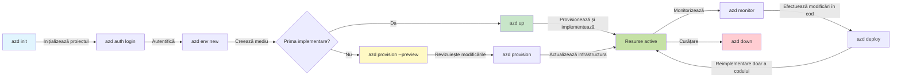
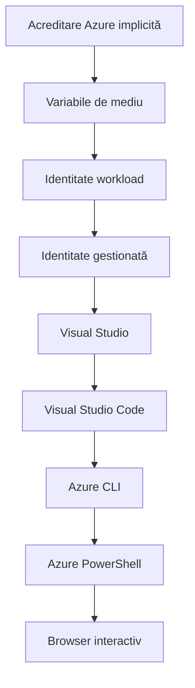

# AZD Basics - Understanding Azure Developer CLI

# AZD Basics - Core Concepts and Fundamentals

**Chapter Navigation:**
- **📚 Course Home**: [AZD For Beginners](../../README.md)
- **📖 Current Chapter**: Chapter 1 - Foundation & Quick Start
- **⬅️ Previous**: [Course Overview](../../README.md#-chapter-1-foundation--quick-start)
- **➡️ Next**: [Installation & Setup](installation.md)
- **🚀 Next Chapter**: [Chapter 2: AI-First Development](../chapter-02-ai-development/microsoft-foundry-integration.md)

## Introduction

Această lecție te introduce în Azure Developer CLI (azd), un instrument puternic de linie de comandă care accelerează trecerea ta de la dezvoltarea locală la implementarea în Azure. Vei învăța conceptele fundamentale, caracteristicile cheie și vei înțelege cum azd simplifică implementarea aplicațiilor cloud-native.

## Learning Goals

La sfârșitul acestei lecții, vei:
- Înțelege ce este Azure Developer CLI și scopul său principal
- Învăța conceptele de bază ale șabloanelor, mediilor și serviciilor
- Explora caracteristicile cheie, inclusiv dezvoltarea bazată pe șabloane și Infrastructure as Code
- Înțelege structura proiectului azd și fluxul de lucru
- Fi pregătit să instalezi și să configurezi azd pentru mediul tău de dezvoltare

## Learning Outcomes

După finalizarea acestei lecții, vei putea:
- Explica rolul azd în fluxurile moderne de dezvoltare cloud
- Identifica componentele unei structuri de proiect azd
- Descrie cum funcționează împreună șabloanele, mediile și serviciile
- Înțelege beneficiile Infrastructure as Code cu azd
- Recunoaște diferite comenzi azd și scopul lor

## What is Azure Developer CLI (azd)?

Azure Developer CLI (azd) este un instrument de linie de comandă conceput pentru a-ți accelera trecerea de la dezvoltarea locală la implementarea în Azure. Simplifică procesul de construire, implementare și gestionare a aplicațiilor cloud-native în Azure.

### What Can You Deploy with azd?

azd acceptă o gamă largă de tipuri de workload—and lista continuă să crească. Astăzi, poți folosi azd pentru a implementa:

| Workload Type | Examples | Same Workflow? |
|---------------|----------|----------------|
| **Traditional applications** | Web apps, REST APIs, static sites | ✅ `azd up` |
| **Services and microservices** | Container Apps, Function Apps, multi-service backends | ✅ `azd up` |
| **AI-powered applications** | Chat apps with Microsoft Foundry Models, RAG solutions with AI Search | ✅ `azd up` |
| **Intelligent agents** | Foundry-hosted agents, multi-agent orchestrations | ✅ `azd up` |

Ideea principală este că **ciclul de viață azd rămâne același indiferent de ceea ce implementezi**. Inițializezi un proiect, provizionezi infrastructura, implementezi codul, monitorizezi aplicația și cureți resursele—fie că este un site simplu sau un agent AI sofisticat.

Această continuitate este intenționată. azd tratează capabilitățile AI ca un alt tip de serviciu pe care aplicația ta îl poate utiliza, nu ca ceva fundamental diferit. Un endpoint de chat susținut de Microsoft Foundry Models este, din perspectiva azd, doar un alt serviciu de configurat și implementat.

### 🎯 Why Use AZD? A Real-World Comparison

Să comparăm implementarea unei aplicații web simple cu o bază de date:

#### ❌ WITHOUT AZD: Manual Azure Deployment (30+ minutes)

```bash
# Pasul 1: Creați un grup de resurse
az group create --name myapp-rg --location eastus

# Pasul 2: Creați un plan App Service
az appservice plan create --name myapp-plan \
  --resource-group myapp-rg \
  --sku B1 --is-linux

# Pasul 3: Creați o aplicație web
az webapp create --name myapp-web-unique123 \
  --resource-group myapp-rg \
  --plan myapp-plan \
  --runtime "NODE:18-lts"

# Pasul 4: Creați un cont Cosmos DB (10-15 minute)
az cosmosdb create --name myapp-cosmos-unique123 \
  --resource-group myapp-rg \
  --kind MongoDB

# Pasul 5: Creați o bază de date
az cosmosdb mongodb database create \
  --account-name myapp-cosmos-unique123 \
  --resource-group myapp-rg \
  --name tododb

# Pasul 6: Creați o colecție
az cosmosdb mongodb collection create \
  --account-name myapp-cosmos-unique123 \
  --resource-group myapp-rg \
  --database-name tododb \
  --name todos

# Pasul 7: Obțineți șirul de conexiune
CONN_STR=$(az cosmosdb keys list \
  --name myapp-cosmos-unique123 \
  --resource-group myapp-rg \
  --type connection-strings \
  --query "connectionStrings[0].connectionString" -o tsv)

# Pasul 8: Configurați setările aplicației
az webapp config appsettings set \
  --name myapp-web-unique123 \
  --resource-group myapp-rg \
  --settings MONGODB_URI="$CONN_STR"

# Pasul 9: Activați înregistrarea jurnalelor
az webapp log config --name myapp-web-unique123 \
  --resource-group myapp-rg \
  --application-logging filesystem \
  --detailed-error-messages true

# Pasul 10: Configurați Application Insights
az monitor app-insights component create \
  --app myapp-insights \
  --location eastus \
  --resource-group myapp-rg

# Pasul 11: Conectați App Insights la aplicația web
INSTRUMENTATION_KEY=$(az monitor app-insights component show \
  --app myapp-insights \
  --resource-group myapp-rg \
  --query "instrumentationKey" -o tsv)

az webapp config appsettings set \
  --name myapp-web-unique123 \
  --resource-group myapp-rg \
  --settings APPINSIGHTS_INSTRUMENTATIONKEY="$INSTRUMENTATION_KEY"

# Pasul 12: Construiți aplicația local
npm install
npm run build

# Pasul 13: Creați pachetul de implementare
zip -r app.zip . -x "*.git*" "node_modules/*"

# Pasul 14: Implementați aplicația
az webapp deployment source config-zip \
  --resource-group myapp-rg \
  --name myapp-web-unique123 \
  --src app.zip

# Pasul 15: Așteptați și rugați-vă să funcționeze 🙏
# (Fără validare automată, este necesară testare manuală)
```

**Problems:**
- ❌ 15+ commands to remember and execute in order
- ❌ 30-45 minutes of manual work
- ❌ Easy to make mistakes (typos, wrong parameters)
- ❌ Connection strings exposed in terminal history
- ❌ No automated rollback if something fails
- ❌ Hard to replicate for team members
- ❌ Different every time (not reproducible)

#### ✅ WITH AZD: Automated Deployment (5 commands, 10-15 minutes)

```bash
# Pasul 1: Inițializare din șablon
azd init --template todo-nodejs-mongo

# Pasul 2: Autentificare
azd auth login

# Pasul 3: Creare mediu
azd env new dev

# Pasul 4: Previzualizare modificări (opțional, dar recomandat)
azd provision --preview

# Pasul 5: Implementare completă
azd up

# ✨ Gata! Totul este implementat, configurat și monitorizat
```

**Benefits:**
- ✅ **5 commands** vs. 15+ manual steps
- ✅ **10-15 minutes** total time (mostly waiting for Azure)
- ✅ **Fewer manual mistakes** - consistent, template-driven workflow
- ✅ **Secure secret handling** - many templates use Azure-managed secret storage
- ✅ **Repeatable deployments** - same workflow every time
- ✅ **Fully reproducible** - same result every time
- ✅ **Team-ready** - anyone can deploy with same commands
- ✅ **Infrastructure as Code** - version controlled Bicep templates
- ✅ **Built-in monitoring** - Application Insights configured automatically

### 📊 Time & Error Reduction

| Metric | Manual Deployment | AZD Deployment | Improvement |
|:-------|:------------------|:---------------|:------------|
| **Commands** | 15+ | 5 | 67% fewer |
| **Time** | 30-45 min | 10-15 min | 60% faster |
| **Error Rate** | ~40% | <5% | 88% reduction |
| **Consistency** | Low (manual) | 100% (automated) | Perfect |
| **Team Onboarding** | 2-4 hours | 30 minutes | 75% faster |
| **Rollback Time** | 30+ min (manual) | 2 min (automated) | 93% faster |

## Core Concepts

### Templates
Șabloanele sunt fundamentul azd. Ele conțin:
- **Application code** - Codul sursă și dependențele tale
- **Infrastructure definitions** - Resurse Azure definite în Bicep sau Terraform
- **Configuration files** - Setări și variabile de mediu
- **Deployment scripts** - Fluxuri de lucru automate de implementare

### Environments
Mediile reprezintă diferite ținte de implementare:
- **Development** - Pentru testare și dezvoltare
- **Staging** - Mediu pre-producție
- **Production** - Mediu de producție live

Fiecare mediu își menține propriul:
- Azure resource group
- Configuration settings
- Deployment state

### Services
Serviciile sunt blocurile de bază ale aplicației tale:
- **Frontend** - Aplicații web, SPA-uri
- **Backend** - API-uri, microservicii
- **Database** - Soluții de stocare a datelor
- **Storage** - Stocare de fișiere și blob-uri

## Key Features

### 1. Template-Driven Development
```bash
# Răsfoiește șabloanele disponibile
azd template list

# Inițializează dintr-un șablon
azd init --template <template-name>
```

### 2. Infrastructure as Code
- **Bicep** - Limbajul specific domeniului al Azure
- **Terraform** - Instrument multi-cloud pentru infrastructură
- **ARM Templates** - Șabloane Azure Resource Manager

### 3. Integrated Workflows
```bash
# Flux complet de implementare
azd up            # Provisionare + Implementare — proces automat pentru configurarea inițială

# 🧪 NOU: Previzualizați modificările infrastructurii înainte de implementare (SIGUR)
azd provision --preview    # Simulați implementarea infrastructurii fără a face modificări

azd provision     # Creați resurse Azure — dacă actualizați infrastructura, folosiți această opțiune
azd deploy        # Implementați codul aplicației sau reimplementați-l după actualizare
azd down          # Curățați resursele
```

#### 🛡️ Safe Infrastructure Planning with Preview
Comanda `azd provision --preview` este un schimbător de joc pentru implementări sigure:
- **Analiză fără aplicare** - Arată ce va fi creat, modificat sau șters
- **Risc zero** - Nu se fac schimbări reale în mediul tău Azure
- **Colaborare în echipă** - Partajează rezultatele preview înainte de implementare
- **Estimare a costurilor** - Înțelege costul resurselor înainte de a te angaja

```bash
# Exemplu de flux de previzualizare
azd provision --preview           # Vedeți ce se va schimba
# Revizuiți rezultatul, discutați cu echipa
azd provision                     # Aplicați modificările cu încredere
```

### 📊 Visual: AZD Development Workflow


**Workflow Explanation:**
1. **Init** - Începe cu un șablon sau proiect nou
2. **Auth** - Autentifică-te cu Azure
3. **Environment** - Creează un mediu de implementare izolat
4. **Preview** - 🆕 Previzualizează întotdeauna schimbările de infrastructură mai întâi (practică sigură)
5. **Provision** - Creează/actualizează resursele Azure
6. **Deploy** - Trimite codul aplicației
7. **Monitor** - Observează performanța aplicației
8. **Iterate** - Fă modificări și redeploy codul
9. **Cleanup** - Elimină resursele când ai terminat

### 4. Environment Management
```bash
# Creează și gestionează medii
azd env new <environment-name>
azd env select <environment-name>
azd env list
```

### 5. Extensions and AI Commands

azd folosește un sistem de extensii pentru a adăuga capabilități dincolo de CLI-ul de bază. Acest lucru este deosebit de util pentru workload-urile AI:

```bash
# Listează extensiile disponibile
azd extension list

# Instalează extensia Foundry agents
azd extension install azure.ai.agents

# Inițializează un proiect de agent AI dintr-un manifest
azd ai agent init -m agent-manifest.yaml

# Pornește serverul MCP pentru dezvoltare asistată de AI (Alpha)
azd mcp start
```

> Extensions are covered in detail in [Chapter 2: AI-First Development](../chapter-02-ai-development/agents.md) and the [AZD AI CLI Commands](../chapter-08-production/production-ai-practices.md#azd-ai-cli-commands-and-extensions) reference.

## 📁 Project Structure

O structură tipică de proiect azd:
```
my-app/
├── .azd/                    # azd configuration
│   └── config.json
├── .azure/                  # Azure deployment artifacts
├── .devcontainer/          # Development container config
├── .github/workflows/      # GitHub Actions
├── .vscode/               # VS Code settings
├── infra/                 # Infrastructure code
│   ├── main.bicep        # Main infrastructure template
│   ├── main.parameters.json
│   └── modules/          # Reusable modules
├── src/                  # Application source code
│   ├── api/             # Backend services
│   └── web/             # Frontend application
├── azure.yaml           # azd project configuration
└── README.md
```

## 🔧 Configuration Files

### azure.yaml
Fișierul principal de configurare al proiectului:
```yaml
name: my-awesome-app
metadata:
  template: my-template@1.0.0

services:
  web:
    project: ./src/web
    language: js
    host: appservice
  api:
    project: ./src/api
    language: js
    host: appservice

hooks:
  preprovision:
    shell: pwsh
    run: echo "Preparing to provision..."
```

### .azure/config.json
Configurație specifică mediului:
```json
{
  "version": 1,
  "defaultEnvironment": "dev",
  "environments": {
    "dev": {
      "subscriptionId": "your-subscription-id",
      "location": "eastus"
    }
  }
}
```

## 🎪 Common Workflows with Hands-On Exercises

> **💡 Learning Tip:** Urmează aceste exerciții în ordine pentru a-ți construi progresiv abilitățile AZD.

### 🎯 Exercise 1: Initialize Your First Project

**Goal:** Creează un proiect AZD și explorează-i structura

**Steps:**
```bash
# Folosește un șablon dovedit
azd init --template todo-nodejs-mongo

# Explorează fișierele generate
ls -la  # Afișează toate fișierele, inclusiv cele ascunse

# Fișiere cheie create:
# - azure.yaml (configurație principală)
# - infra/ (cod pentru infrastructură)
# - src/ (codul aplicației)
```

**✅ Success:** Ai directoarele azure.yaml, infra/ și src/

---

### 🎯 Exercise 2: Deploy to Azure

**Goal:** Completează implementarea end-to-end

**Steps:**
```bash
# 1. Autentifică-te
az login && azd auth login

# 2. Creează un mediu
azd env new dev
azd env set AZURE_LOCATION eastus

# 3. Previzualizează modificările (RECOMANDAT)
azd provision --preview

# 4. Publică totul
azd up

# 5. Verifică implementarea
azd show    # Vizualizează URL-ul aplicației tale
```

**Expected Time:** 10-15 minutes  
**✅ Success:** URL-ul aplicației se deschide în browser

---

### 🎯 Exercise 3: Multiple Environments

**Goal:** Deploy în dev și staging

**Steps:**
```bash
# Avem deja dev, creează staging
azd env new staging
azd env set AZURE_LOCATION westus2
azd up

# Comută între ele
azd env list
azd env select dev
```

**✅ Success:** Două grupuri de resurse separate în Azure Portal

---

### 🛡️ Clean Slate: `azd down --force --purge`

Când ai nevoie să resetezi complet:

```bash
azd down --force --purge
```

**What it does:**
- `--force`: No confirmation prompts
- `--purge`: Deletes all local state and Azure resources

**Use when:**
- Deployment failed mid-way
- Switching projects
- Need fresh start

---

## 🎪 Original Workflow Reference

### Starting a New Project
```bash
# Metoda 1: Utilizați șablonul existent
azd init --template todo-nodejs-mongo

# Metoda 2: Începeți de la zero
azd init

# Metoda 3: Utilizați directorul curent
azd init .
```

### Development Cycle
```bash
# Configurează mediul de dezvoltare
azd auth login
azd env new dev
azd env select dev

# Implementează totul
azd up

# Fă modificări și reimplementează
azd deploy

# Curăță când ai terminat
azd down --force --purge # comanda din Azure Developer CLI este o **resetare completă** pentru mediul tău — deosebit de utilă când depanezi implementări eșuate, cureți resurse orfane sau pregătești o nouă implementare.
```

## Understanding `azd down --force --purge`
Comanda `azd down --force --purge` este o metodă puternică de a demonta complet mediul tău azd și toate resursele asociate. Iată o defalcare a ceea ce face fiecare flag:
```
--force
```
- Omite prompturile de confirmare.
- Util pentru automatizare sau scripting unde inputul manual nu este fezabil.
- Asigură că demontarea continuă fără întrerupere, chiar dacă CLI detectează inconsistențe.

```
--purge
```
Șterge **toată metadata asociată**, inclusiv:
Starea mediului
Folderul local `.azure`
Informații de implementare în cache
Previne ca azd să "țină minte" implementările anterioare, ceea ce poate cauza probleme precum grupuri de resurse nepotrivite sau referințe învechite la registre.


### Why use both?
Când ai întâmpinat probleme cu `azd up` din cauza stării persistente sau a implementărilor parțiale, acest combo asigură un **punct de pornire curat**.

Este deosebit de util după ștergeri manuale de resurse în portalul Azure sau când schimbi șabloane, medii sau convenții de denumire pentru grupurile de resurse.


### Managing Multiple Environments
```bash
# Creați mediul de staging
azd env new staging
azd env select staging
azd up

# Comutați înapoi la dev
azd env select dev

# Comparați mediile
azd env list
```

## 🔐 Authentication and Credentials

Înțelegerea autentificării este crucială pentru implementările reușite cu azd. Azure folosește mai multe metode de autentificare, iar azd valorifică același lanț de credențiale folosit de alte unelte Azure.

### Azure CLI Authentication (`az login`)

Înainte de a folosi azd, trebuie să te autentifici cu Azure. Cea mai comună metodă este folosirea Azure CLI:

```bash
# Autentificare interactivă (deschide browserul)
az login

# Autentificare cu un tenant specific
az login --tenant <tenant-id>

# Autentificare cu principalul de serviciu
az login --service-principal -u <app-id> -p <password> --tenant <tenant-id>

# Verifică starea curentă a autentificării
az account show

# Listează abonamentele disponibile
az account list --output table

# Setează abonamentul implicit
az account set --subscription <subscription-id>
```

### Authentication Flow
1. **Interactive Login**: Deschide browserul tău implicit pentru autentificare
2. **Device Code Flow**: Pentru medii fără acces la browser
3. **Service Principal**: Pentru scenarii de automatizare și CI/CD
4. **Managed Identity**: Pentru aplicații găzduite în Azure

### DefaultAzureCredential Chain

`DefaultAzureCredential` este un tip de credențial care oferă o experiență simplificată de autentificare prin încercarea automată a mai multor surse de credențiale într-o ordine specifică:

#### Credential Chain Order

#### 1. Environment Variables
```bash
# Setați variabilele de mediu pentru principalul de serviciu
export AZURE_CLIENT_ID="<app-id>"
export AZURE_CLIENT_SECRET="<password>"
export AZURE_TENANT_ID="<tenant-id>"
```

#### 2. Workload Identity (Kubernetes/GitHub Actions)
Folosit automat în:
- Azure Kubernetes Service (AKS) cu Workload Identity
- GitHub Actions cu federare OIDC
- Alte scenarii de identitate federată

#### 3. Managed Identity
Pentru resurse Azure precum:
- Virtual Machines
- App Service
- Azure Functions
- Container Instances

```bash
# Verifică dacă rulează pe o resursă Azure cu identitate gestionată
az account show --query "user.type" --output tsv
# Returnează: "servicePrincipal" dacă folosește identitate gestionată
```

#### 4. Developer Tools Integration
- **Visual Studio**: Folosește automat contul conectat
- **VS Code**: Folosește credențialele extensiei Azure Account
- **Azure CLI**: Folosește credențialele `az login` (cel mai comun pentru dezvoltarea locală)

### AZD Authentication Setup

```bash
# Metoda 1: Utilizați Azure CLI (recomandat pentru dezvoltare)
az login
azd auth login  # Folosește acreditările Azure CLI existente

# Metoda 2: Autentificare directă cu azd
azd auth login --use-device-code  # Pentru medii fără interfață grafică

# Metoda 3: Verificați starea autentificării
azd auth login --check-status

# Metoda 4: Deconectare și reautentificare
azd auth logout
azd auth login
```

### Authentication Best Practices

#### For Local Development
```bash
# 1. Autentificare cu Azure CLI
az login

# 2. Verificați abonamentul corect
az account show
az account set --subscription "Your Subscription Name"

# 3. Utilizați azd cu acreditările existente
azd auth login
```

#### For CI/CD Pipelines
```yaml
# GitHub Actions example
- name: Azure Login
  uses: azure/login@v1
  with:
    creds: ${{ secrets.AZURE_CREDENTIALS }}

- name: Deploy with azd
  run: |
    azd auth login --client-id ${{ secrets.AZURE_CLIENT_ID }} \
                    --client-secret ${{ secrets.AZURE_CLIENT_SECRET }} \
                    --tenant-id ${{ secrets.AZURE_TENANT_ID }}
    azd up --no-prompt
```

#### For Production Environments
- Folosește **Managed Identity** când rulezi pe resurse Azure
- Folosește **Service Principal** pentru scenarii de automatizare
- Evită stocarea credențialelor în cod sau fișiere de configurare
- Folosește **Azure Key Vault** pentru configurații sensibile

### Common Authentication Issues and Solutions

#### Issue: "No subscription found"
```bash
# Soluție: Setează abonamentul implicit
az account list --output table
az account set --subscription "<subscription-id>"
azd env set AZURE_SUBSCRIPTION_ID "<subscription-id>"
```

#### Issue: "Insufficient permissions"
```bash
# Soluție: Verificați și atribuiți rolurile necesare
az role assignment list --assignee $(az account show --query user.name --output tsv)

# Roluri comune necesare:
# - Contributor (pentru gestionarea resurselor)
# - User Access Administrator (pentru atribuirea rolurilor)
```

#### Issue: "Token expired"
```bash
# Soluție: Reautentificare
az logout
az login
azd auth logout
azd auth login
```

### Authentication in Different Scenarios

#### Local Development
```bash
# Cont de dezvoltare personală
az login
azd auth login
```

#### Team Development
```bash
# Folosiți un tenant specific pentru organizație
az login --tenant contoso.onmicrosoft.com
azd auth login
```

#### Multi-tenant Scenarios
```bash
# Comută între chiriași
az login --tenant tenant1.onmicrosoft.com
# Publică pentru chiriașul 1
azd up

az login --tenant tenant2.onmicrosoft.com  
# Publică pentru chiriașul 2
azd up
```

### Security Considerations
1. **Stocarea credențialelor**: Nu stoca niciodată credențialele în codul sursă
2. **Limitarea accesului**: Folosește principiul privilegiului minim pentru service principals
3. **Rotirea token-urilor**: Rotează regulat secretele service principal-urilor
4. **Jurnal de audit**: Monitorizează activitățile de autentificare și de implementare
5. **Securitate rețea**: Folosește endpoint-uri private când este posibil

### Depanarea autentificării

```bash
# Depanare probleme de autentificare
azd auth login --check-status
az account show
az account get-access-token

# Comenzi comune de diagnosticare
whoami                          # Contextul utilizatorului curent
az ad signed-in-user show      # Detalii despre utilizatorul Azure AD
az group list                  # Testează accesul la resurse
```

## Înțelegerea `azd down --force --purge`

### Descoperire
```bash
azd template list              # Răsfoiește șabloane
azd template show <template>   # Detalii șablon
azd init --help               # Opțiuni de inițializare
```

### Gestionarea proiectului
```bash
azd show                     # Prezentare generală a proiectului
azd env list                # Mediile disponibile și cel selectat implicit
azd config show            # Setări de configurare
```

### Monitorizare
```bash
azd monitor                  # Deschide monitorizarea din portalul Azure
azd monitor --logs           # Vizualizează jurnalele aplicației
azd monitor --live           # Vizualizează metricile în timp real
azd pipeline config          # Configurează CI/CD
```

## Cele mai bune practici

### 1. Folosește nume semnificative
```bash
# Bun
azd env new production-east
azd init --template web-app-secure

# Evită
azd env new env1
azd init --template template1
```

### 2. Folosește șabloane
- Începe cu șabloane existente
- Personalizează pentru nevoile tale
- Creează șabloane reutilizabile pentru organizația ta

### 3. Izolarea mediilor
- Folosește medii separate pentru dev/staging/prod
- Nu implementa niciodată direct în producție de pe mașina locală
- Folosește pipeline-uri CI/CD pentru implementările în producție

### 4. Managementul configurației
- Folosește variabile de mediu pentru date sensibile
- Păstrează configurația în controlul versiunilor
- Documentează setările specifice mediilor

## Progresul în învățare

### Începător (Săptămâna 1-2)
1. Instalează azd și autentifică-te
2. Implementează un șablon simplu
3. Înțelege structura proiectului
4. Învață comenzile de bază (up, down, deploy)

### Intermediar (Săptămâna 3-4)
1. Personalizează șabloanele
2. Gestionează medii multiple
3. Înțelege codul infrastructurii
4. Configurează pipeline-uri CI/CD

### Avansat (Săptămâna 5+)
1. Creează șabloane personalizate
2. Modele avansate de infrastructură
3. Implementări multi-regiune
4. Configurații pentru nivel enterprise

## Pașii următori

**📖 Continuă învățarea Capitolului 1:**
- [Instalare și configurare](installation.md) - Instalează și configurează azd
- [Primul tău proiect](first-project.md) - Finalizează tutorialul practic
- [Ghid de configurare](configuration.md) - Opțiuni avansate de configurare

**🎯 Ești gata pentru capitolul următor?**
- [Capitolul 2: Dezvoltare centrată pe AI](../chapter-02-ai-development/microsoft-foundry-integration.md) - Începe să construiești aplicații AI

## Resurse suplimentare

- [Prezentare generală Azure Developer CLI](https://learn.microsoft.com/en-us/azure/developer/azure-developer-cli/)
- [Galeria de șabloane](https://azure.github.io/awesome-azd/)
- [Exemple din comunitate](https://github.com/Azure-Samples)

---

## 🙋 Întrebări frecvente

### Întrebări generale

**Î: Care este diferența dintre AZD și Azure CLI?**

R: Azure CLI (`az`) este pentru gestionarea resurselor Azure individuale. AZD (`azd`) este pentru gestionarea aplicațiilor întregi:

```bash
# Azure CLI - gestionare la nivel scăzut a resurselor
az webapp create --name myapp --resource-group rg
az sql server create --name myserver --resource-group rg
# ...sunt necesare multe alte comenzi

# AZD - gestionare la nivel de aplicație
azd up  # Desfășoară întreaga aplicație cu toate resursele
```

**Gândește-te astfel:**
- `az` = Operarea pe cărămizi Lego individuale
- `azd` = Lucrul cu seturi complete de Lego

---

**Î: Trebuie să știu Bicep sau Terraform pentru a folosi AZD?**

R: Nu! Începe cu șabloane:
```bash
# Utilizați șablonul existent - nu sunt necesare cunoștințe IaC
azd init --template todo-nodejs-mongo
azd up
```

Poți învăța Bicep mai târziu pentru a personaliza infrastructura. Șabloanele oferă exemple funcționale din care să înveți.

---

**Î: Cât costă rularea șabloanelor AZD?**

R: Costurile variază în funcție de șablon. Majoritatea șabloanelor de dezvoltare costă $50-150/lună:

```bash
# Previzualizați costurile înainte de implementare
azd provision --preview

# Curățați întotdeauna când nu le folosiți
azd down --force --purge  # Elimină toate resursele
```

**Sfat profesionist:** Folosește nivelurile gratuite acolo unde sunt disponibile:
- App Service: nivel F1 (gratuit)
- Microsoft Foundry Models: Azure OpenAI 50,000 tokens/month free
- Cosmos DB: 1000 RU/s nivel gratuit

---

**Î: Pot folosi AZD cu resurse Azure existente?**

R: Da, dar e mai ușor să începi de la zero. AZD funcționează cel mai bine când gestionează întregul ciclu de viață. Pentru resurse existente:
```bash
# Opțiunea 1: Importă resurse existente (avansat)
azd init
# Apoi modifică infra/ pentru a face referire la resursele existente

# Opțiunea 2: Începe de la zero (recomandat)
azd init --template matching-your-stack
azd up  # Creează un mediu nou
```

---

**Î: Cum îmi partajez proiectul cu colegii?**

R: Commită proiectul AZD în Git (dar NU folderul .azure):
```bash
# Deja în .gitignore în mod implicit
.azure/        # Conține secrete și date de mediu
*.env          # Variabile de mediu

# Membrii echipei atunci:
git clone <your-repo>
azd auth login
azd env new <their-name>-dev
azd up
```

Toată lumea primește aceeași infrastructură din aceleași șabloane.

---

### Întrebări de depanare

**Î: „azd up” a eșuat la jumătate. Ce fac?**

R: Verifică eroarea, corecteaz-o, apoi încearcă din nou:
```bash
# Vizualizați jurnalele detaliate
azd show

# Remedieri comune:

# 1. Dacă cota a fost depășită:
azd env set AZURE_LOCATION "westus2"  # Încercați o regiune diferită

# 2. Dacă există un conflict de nume al resursei:
azd down --force --purge  # Porniți de la zero
azd up  # Încercați din nou

# 3. Dacă autentificarea a expirat:
az login
azd auth login
azd up
```

**Cea mai frecventă problemă:** A fost selectat abonamentul Azure greșit
```bash
az account list --output table
az account set --subscription "<correct-subscription>"
```

---

**Î: Cum pot implementa doar modificările de cod fără reprovisionare?**

R: Folosește `azd deploy` în loc de `azd up`:
```bash
azd up          # Prima dată: provisionare + implementare (lent)

# Fă modificări în cod...

azd deploy      # Următoarele ori: doar implementare (rapid)
```

Comparație de viteză:
- `azd up`: 10-15 minute (provisionează infrastructura)
- `azd deploy`: 2-5 minute (doar codul)

---

**Î: Pot personaliza șabloanele de infrastructură?**

R: Da! Editează fișierele Bicep din `infra/`:
```bash
# După azd init
cd infra/
code main.bicep  # Editează în VS Code

# Previzualizează modificările
azd provision --preview

# Aplică modificările
azd provision
```

**Sfat:** Începe cu pași mici - schimbă mai întâi SKU-urile:
```bicep
// infra/main.bicep
sku: {
  name: 'B1'  // Change to 'P1V2' for production
}
```

---

**Î: Cum șterg tot ce a creat AZD?**

R: O comandă elimină toate resursele:
```bash
azd down --force --purge

# Acest lucru șterge:
# - Toate resursele Azure
# - Grup de resurse
# - Starea mediului local
# - Date de implementare stocate în cache
```

**Rulează întotdeauna această comandă când:**
- Ai terminat testarea unui șablon
- Treci la un alt proiect
- Vrei să începi de la zero

**Economii:** Ștergerea resurselor neutilizate = costuri $0

---

**Î: Ce se întâmplă dacă am șters accidental resurse în Azure Portal?**

R: Starea AZD se poate desincroniza. Abordare de curățare completă:
```bash
# 1. Elimină starea locală
azd down --force --purge

# 2. Începe de la zero
azd up

# Alternativă: Lasă AZD să detecteze și să remedieze
azd provision  # Va crea resursele lipsă
```

---

### Întrebări avansate

**Î: Pot folosi AZD în pipeline-uri CI/CD?**

R: Da! Exemplu GitHub Actions:
```yaml
# .github/workflows/deploy.yml
name: Deploy with AZD

on:
  push:
    branches: [main]

jobs:
  deploy:
    runs-on: ubuntu-latest
    steps:
      - uses: actions/checkout@v2
      
      - name: Install azd
        run: curl -fsSL https://aka.ms/install-azd.sh | bash
      
      - name: Azure Login
        run: |
          azd auth login \
            --client-id ${{ secrets.AZURE_CLIENT_ID }} \
            --client-secret ${{ secrets.AZURE_CLIENT_SECRET }} \
            --tenant-id ${{ secrets.AZURE_TENANT_ID }}
      
      - name: Deploy
        run: azd up --no-prompt
```

---

**Î: Cum gestionez secretele și datele sensibile?**

R: AZD se integrează automat cu Azure Key Vault:
```bash
# Secretele sunt stocate în Key Vault, nu în cod
azd env set DATABASE_PASSWORD "$(openssl rand -base64 32)"

# AZD în mod automat:
# 1. Creează Key Vault
# 2. Stochează secretul
# 3. Acordă aplicației acces prin identitate gestionată
# 4. Injectează la rulare
```

**Nu comite niciodată:**
- folderul `.azure/` (conține date despre mediu)
- fișierele `.env` (secrete locale)
- șirurile de conexiune

---

**Î: Pot implementa în mai multe regiuni?**

R: Da, creează un mediu per regiune:
```bash
# Mediu în Estul SUA
azd env new prod-eastus
azd env set AZURE_LOCATION eastus
azd up

# Mediu în Vestul Europei
azd env new prod-westeurope
azd env set AZURE_LOCATION westeurope
azd up

# Fiecare mediu este independent
azd env list
```

Pentru aplicații cu adevărat multi-regiune, personalizează șabloanele Bicep pentru a implementa simultan în mai multe regiuni.

---

**Î: Unde pot obține ajutor dacă sunt blocat?**

1. **Documentația AZD:** https://learn.microsoft.com/azure/developer/azure-developer-cli/
2. **Probleme GitHub:** https://github.com/Azure/azure-dev/issues
3. **Discord:** [Azure Discord](https://discord.gg/microsoft-azure) - canalul #azure-developer-cli
4. **Stack Overflow:** Tag `azure-developer-cli`
5. **Acest curs:** [Ghid de depanare](../chapter-07-troubleshooting/common-issues.md)

**Sfat util:** Înainte de a întreba, rulează:
```bash
azd show       # Afișează starea curentă
azd version    # Afișează versiunea ta
```
Include aceste informații în întrebarea ta pentru ajutor mai rapid.

---

## 🎓 Ce urmează?

Acum înțelegi elementele fundamentale AZD. Alege-ți calea:

### 🎯 Pentru începători:
1. **Următorul:** [Instalare și configurare](installation.md) - Instalează AZD pe mașina ta
2. **Apoi:** [Primul tău proiect](first-project.md) - Implementează prima ta aplicație
3. **Practică:** Finalizează toate cele 3 exerciții din această lecție

### 🚀 Pentru dezvoltatorii AI:
1. **Sari la:** [Capitolul 2: Dezvoltare centrată pe AI](../chapter-02-ai-development/microsoft-foundry-integration.md)
2. **Implementează:** Începe cu `azd init --template get-started-with-ai-chat`
3. **Învață:** Construiește în timp ce implementezi

### 🏗️ Pentru dezvoltatori experimentați:
1. **Revizuiește:** [Ghid de configurare](configuration.md) - Setări avansate
2. **Explorează:** [Infrastructură ca Cod](../chapter-04-infrastructure/provisioning.md) - aprofundare Bicep
3. **Construiește:** Creează șabloane personalizate pentru stack-ul tău

---

**Navigare capitol:**
- **📚 Pagina cursului**: [AZD pentru începători](../../README.md)
- **📖 Capitolul curent**: Capitolul 1 - Fundamente & Start rapid  
- **⬅️ Anterior**: [Prezentare curs](../../README.md#-chapter-1-foundation--quick-start)
- **➡️ Următorul**: [Instalare și configurare](installation.md)
- **🚀 Capitolul următor**: [Capitolul 2: Dezvoltare centrată pe AI](../chapter-02-ai-development/microsoft-foundry-integration.md)

---

<!-- CO-OP TRANSLATOR DISCLAIMER START -->
**Declinare de responsabilitate**:
Acest document a fost tradus folosind serviciul de traducere AI [Co-op Translator](https://github.com/Azure/co-op-translator). Deși ne străduim pentru acuratețe, vă rugăm să rețineți că traducerile automate pot conține erori sau inexactități. Documentul original în limba sa nativă ar trebui considerat sursa autorizată. Pentru informații critice, se recomandă o traducere profesională realizată de un traducător uman. Nu suntem răspunzători pentru eventualele neînțelegeri sau interpretări eronate rezultate din utilizarea acestei traduceri.
<!-- CO-OP TRANSLATOR DISCLAIMER END -->