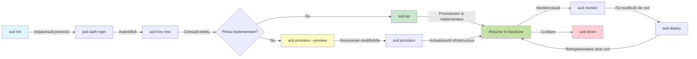
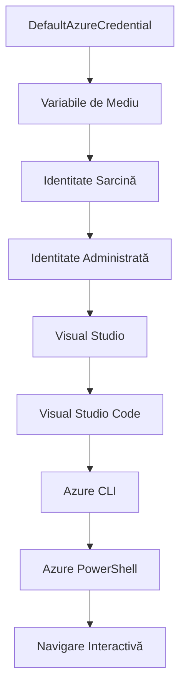

# Bazele AZD - Înțelegerea Azure Developer CLI

# Bazele AZD - Concepte și Fundamente de Bază

**Navigarea capitolelor:**
- **📚 Acasă curs**: [AZD Pentru Începători](../../README.md)
- **📖 Capitolul curent**: Capitolul 1 - Fundament & Start Rapid
- **⬅️ Anterior**: [Prezentare curs](../../README.md#-chapter-1-foundation--quick-start)
- **➡️ Următor**: [Instalare & Configurare](installation.md)
- **🚀 Capitolul următor**: [Capitolul 2: Dezvoltare AI-First](../chapter-02-ai-development/microsoft-foundry-integration.md)

## Introducere

Această lecție te introduce în Azure Developer CLI (azd), un instrument puternic de linie de comandă care accelerează drumul tău de la dezvoltare locală la implementarea în Azure. Vei învăța conceptele fundamentale, funcționalitățile principale și vei înțelege cum azd simplifică implementarea aplicațiilor cloud-native.

## Obiective de învățare

La sfârșitul acestei lecții, vei putea:
- Înțelege ce este Azure Developer CLI și scopul său principal
- Învăța conceptele fundamentale despre șabloane, medii și servicii
- Explora caracteristici cheie precum dezvoltarea bazată pe șabloane și Infrastructure as Code
- Înțelege structura proiectului azd și fluxul de lucru
- Fi pregătit să instalezi și configurezi azd pentru mediul tău de dezvoltare

## Rezultate așteptate

După ce finalizezi această lecție, vei putea:
- Explica rolul azd în fluxurile de dezvoltare moderne pentru cloud
- Identifica componentele structurii unui proiect azd
- Descrie cum funcționează împreună șabloanele, mediile și serviciile
- Înțelege beneficiile Infrastructure as Code cu azd
- Recunoaște diferite comenzi azd și scopurile lor

## Ce este Azure Developer CLI (azd)?

Azure Developer CLI (azd) este un instrument de linie de comandă conceput pentru a accelera drumul tău de la dezvoltare locală la implementarea în Azure. Simplifică procesul de construire, implementare și gestionare a aplicațiilor cloud-native pe Azure.

### Ce poți implementa cu azd?

azd suportă o gamă largă de încărcături de lucru — și lista continuă să crească. Astăzi poți folosi azd pentru a implementa:

| Tip încărcătură | Exemple | Același flux de lucru? |
|-----------------|----------|-----------------------|
| **Aplicații tradiționale** | Aplicații web, API REST, site-uri statice | ✅ `azd up` |
| **Servicii și microservicii** | Container Apps, Function Apps, backend-uri multi-servicii | ✅ `azd up` |
| **Aplicații bazate pe AI** | Aplicații chat cu Microsoft Foundry Models, soluții RAG cu AI Search | ✅ `azd up` |
| **Agenți inteligenți** | Agenți găzduiți în Foundry, orchestrade multi-agent | ✅ `azd up` |

Idea centrală este că **ciclul de viață azd rămâne același indiferent ce implementezi**. Inițiezi un proiect, aloci infrastructura, implementezi codul, monitorizezi aplicația și cureți resursele — fie că este un site simplu sau un agent AI sofisticat.

Această continuitate este proiectată astfel. azd tratează capabilitățile AI ca pe un alt tip de serviciu pe care aplicația ta îl poate utiliza, nu ca pe ceva fundamental diferit. Un endpoint de chat susținut de Microsoft Foundry Models este, din perspectiva azd, doar un alt serviciu de configurat și implementat.

### 🎯 De ce să folosești AZD? O comparație din lumea reală

Să comparăm implementarea unei aplicații web simple cu bază de date:

#### ❌ FĂRĂ AZD: Implementare manuală Azure (30+ minute)

```bash
# Pasul 1: Creează grupul de resurse
az group create --name myapp-rg --location eastus

# Pasul 2: Creează planul App Service
az appservice plan create --name myapp-plan \
  --resource-group myapp-rg \
  --sku B1 --is-linux

# Pasul 3: Creează aplicația web
az webapp create --name myapp-web-unique123 \
  --resource-group myapp-rg \
  --plan myapp-plan \
  --runtime "NODE:18-lts"

# Pasul 4: Creează contul Cosmos DB (10-15 minute)
az cosmosdb create --name myapp-cosmos-unique123 \
  --resource-group myapp-rg \
  --kind MongoDB

# Pasul 5: Creează baza de date
az cosmosdb mongodb database create \
  --account-name myapp-cosmos-unique123 \
  --resource-group myapp-rg \
  --name tododb

# Pasul 6: Creează colecția
az cosmosdb mongodb collection create \
  --account-name myapp-cosmos-unique123 \
  --resource-group myapp-rg \
  --database-name tododb \
  --name todos

# Pasul 7: Obține șirul de conexiune
CONN_STR=$(az cosmosdb keys list \
  --name myapp-cosmos-unique123 \
  --resource-group myapp-rg \
  --type connection-strings \
  --query "connectionStrings[0].connectionString" -o tsv)

# Pasul 8: Configurează setările aplicației
az webapp config appsettings set \
  --name myapp-web-unique123 \
  --resource-group myapp-rg \
  --settings MONGODB_URI="$CONN_STR"

# Pasul 9: Activează jurnalizarea
az webapp log config --name myapp-web-unique123 \
  --resource-group myapp-rg \
  --application-logging filesystem \
  --detailed-error-messages true

# Pasul 10: Configurează Application Insights
az monitor app-insights component create \
  --app myapp-insights \
  --location eastus \
  --resource-group myapp-rg

# Pasul 11: Leagă App Insights de aplicația web
INSTRUMENTATION_KEY=$(az monitor app-insights component show \
  --app myapp-insights \
  --resource-group myapp-rg \
  --query "instrumentationKey" -o tsv)

az webapp config appsettings set \
  --name myapp-web-unique123 \
  --resource-group myapp-rg \
  --settings APPINSIGHTS_INSTRUMENTATIONKEY="$INSTRUMENTATION_KEY"

# Pasul 12: Construiește aplicația local
npm install
npm run build

# Pasul 13: Creează pachetul de implementare
zip -r app.zip . -x "*.git*" "node_modules/*"

# Pasul 14: Implementează aplicația
az webapp deployment source config-zip \
  --resource-group myapp-rg \
  --name myapp-web-unique123 \
  --src app.zip

# Pasul 15: Așteaptă și roagă-te să funcționeze 🙏
# (Fără validare automată, este necesară testarea manuală)
```

**Probleme:**
- ❌ Peste 15 comenzi de reținut și executat în ordine
- ❌ 30-45 minute de muncă manuală
- ❌ Ușor de făcut greșeli (erori de tastare, parametri greșiți)
- ❌ Șiruri de conexiune expuse în istoricul terminalului
- ❌ Fără revenire automată dacă ceva eșuează
- ❌ Dificil de replicat pentru colegi
- ❌ Diferit de fiecare dată (neredabil)

#### ✅ CU AZD: Implementare automatizată (5 comenzi, 10-15 minute)

```bash
# Pasul 1: Inițializează din șablon
azd init --template todo-nodejs-mongo

# Pasul 2: Autentifică-te
azd auth login

# Pasul 3: Creează mediul
azd env new dev

# Pasul 4: Previzualizează modificările (opțional, dar recomandat)
azd provision --preview

# Pasul 5: Desfășoară totul
azd up

# ✨ Gata! Totul este desfășurat, configurat și monitorizat
```

**Beneficii:**
- ✅ **5 comenzi** versus 15+ pași manuali
- ✅ **10-15 minute** timp total (în majoritate așteptând Azure)
- ✅ **Mai puține greșeli manuale** - flux consistent, bazat pe șabloane
- ✅ **Gestionare sigură a secretelor** - multe șabloane folosesc stocare secretă gestionată de Azure
- ✅ **Implementări repetabile** - același flux de lucru de fiecare dată
- ✅ **Complet reproducibil** - același rezultat de fiecare dată
- ✅ **Pentru echipă** - oricine poate implementa cu aceleași comenzi
- ✅ **Infrastructure as Code** - șabloane Bicep versionate
- ✅ **Monitorizare integrată** - Application Insights configurat automat

### 📊 Reducerea timpului și a erorilor

| Metrică | Implementare manuală | Implementare AZD | Îmbunătățire |
|:--------|:--------------------|:-----------------|:-------------|
| **Comenzi** | 15+ | 5 | 67% mai puține |
| **Timp** | 30-45 min | 10-15 min | 60% mai rapid |
| **Rată eroare** | ~40% | <5% | Reducere 88% |
| **Consistență** | Scăzută (manual) | 100% (automatizat) | Perfectă |
| **Integrare echipă** | 2-4 ore | 30 minute | 75% mai rapid |
| **Timp revenire** | 30+ min (manual) | 2 min (automatizat) | 93% mai rapid |

## Concepte fundamentale

### Șabloane
Șabloanele sunt baza azd. Ele conțin:
- **Cod aplicație** - Sursa ta și dependențele
- **Definiții infrastructură** - Resurse Azure definite în Bicep sau Terraform
- **Fișiere de configurare** - Setări și variabile de mediu
- **Scripturi de implementare** - Fluxuri automatizate de implementare

### Medii
Mediile reprezintă obiective diferite de implementare:
- **Dezvoltare** - Pentru testare și dezvoltare
- **Staging** - Mediu pre-producție
- **Producție** - Mediu live

Fiecare mediu menține propriul:
- grup de resurse Azure
- setări de configurare
- stare a implementării

### Servicii
Serviciile sunt elementele componente ale aplicației tale:
- **Frontend** - Aplicații web, SPA-uri
- **Backend** - API-uri, microservicii
- **Bază de date** - Soluții de stocare date
- **Stocare** - Stocare de fișiere și blob-uri

## Caracteristici cheie

### 1. Dezvoltare bazată pe șabloane
```bash
# Răsfoiește șabloanele disponibile
azd template list

# Inițializează dintr-un șablon
azd init --template <template-name>
```

### 2. Infrastructure as Code
- **Bicep** - limbajul specific domeniului Azure
- **Terraform** - instrument multi-cloud pentru infrastructură
- **Șabloane ARM** - șabloane Azure Resource Manager

### 3. Fluxuri de lucru integrate
```bash
# Flux complet de implementare
azd up            # Provisionare + Implementare, este automat pentru configurarea inițială

# 🧪 NOU: Vizualizează modificările infrastructurii înainte de implementare (SIGUR)
azd provision --preview    # Simulează implementarea infrastructurii fără a face modificări

azd provision     # Creează resurse Azure, folosește aceasta dacă actualizezi infrastructura
azd deploy        # Implementare cod aplicație sau reimplementare cod aplicație după actualizare
azd down          # Curăță resursele
```

#### 🛡️ Planificare sigură a infrastructurii cu Preview
Comanda `azd provision --preview` este revoluționară pentru implementări sigure:
- **Analiză dry-run** - Arată ce va fi creat, modificat sau șters
- **Zero risc** - Nu sunt efectuate modificări reale în Azure
- **Colaborare în echipă** - Partajează rezultatele preview înainte de implementare
- **Estimare costuri** - Înțelege costurile resurselor înainte de angajament

```bash
# Exemplu de flux de lucru pentru previzualizare
azd provision --preview           # Vezi ce se va schimba
# Revizuiește rezultatul, discută cu echipa
azd provision                     # Aplică modificările cu încredere
```

### 📊 Vizual: Flux de dezvoltare AZD



**Explicația fluxului de lucru:**
1. **Init** - Pornește de la șablon sau proiect nou
2. **Auth** - Autentificare în Azure
3. **Environment** - Creează mediu izolat pentru implementare
4. **Preview** - 🆕 Întotdeauna previzualizează schimbările infrastructurii (practică sigură)
5. **Provision** - Crează/actualizează resurse Azure
6. **Deploy** - Trimite codul aplicației
7. **Monitor** - Observă performanța aplicației
8. **Iterate** - Fă modificări și implementează din nou codul
9. **Cleanup** - Elimină resursele când ai terminat

### 4. Managementul mediilor
```bash
# Creează și gestionează medii
azd env new <environment-name>
azd env select <environment-name>
azd env list
```

### 5. Extensii și comenzi AI

azd folosește un sistem de extensii pentru a adăuga capabilități dincolo de CLI-ul de bază. Acest lucru este foarte util pentru încărcături AI:

```bash
# Listează extensiile disponibile
azd extension list

# Instalează extensia agenților Foundry
azd extension install azure.ai.agents

# Inițializează un proiect agent AI dintr-un manifest
azd ai agent init -m agent-manifest.yaml

# Testează un agent implementat (afișează latența și timpul până la primul octet)
azd ai agent invoke

# Pornește serverul MCP pentru dezvoltare asistată de AI (Alpha)
azd mcp start
```

**Ciclul de viață al agentului, de la cap la coadă.** După ce ai instalat `azure.ai.agents`, un singur flux de lucru te duce de la idee la agentul în funcțiune și monitorizat. Nu ai nevoie de toate de la început — doar să știi că există:

| Etapă | Comandă | Ce face |
|-------|---------|---------|
| **Scaffold** | `azd ai agent init -m <manifest>` | Generează un proiect agent dintr-un manifest |
| **Test** | `azd ai agent invoke` | Apelează agentul și vezi timpul răspunsului |
| **Măsurare** | `azd ai agent eval generate` | Creează un set de date pentru evaluarea agentului |
| **Îmbunătățire** | `azd ai agent optimize` | Optimizează instrucțiunile agentului pe baza datelor tale |
| **Inspectare** | `azd ai agent endpoint show` | Vezi configurația endpoint-ului în timp real |
| **Curățare** | `azd ai agent delete` | Șterge un agent găzduit și toate versiunile sale |

> Extensiile sunt acoperite în detaliu în [Capitolul 2: Dezvoltare AI-First](../chapter-02-ai-development/agents.md) și în referința [Comenzilor AZD AI CLI](../chapter-08-production/production-ai-practices.md#azd-ai-cli-commands-and-extensions).

## 📁 Structura proiectului

O structură tipică de proiect azd:
```
my-app/
├── .azd/                    # azd configuration
│   └── config.json
├── .azure/                  # Azure deployment artifacts
├── .devcontainer/          # Development container config
├── .github/workflows/      # GitHub Actions
├── .vscode/               # VS Code settings
├── infra/                 # Infrastructure code
│   ├── main.bicep        # Main infrastructure template
│   ├── main.parameters.json
│   └── modules/          # Reusable modules
├── src/                  # Application source code
│   ├── api/             # Backend services
│   └── web/             # Frontend application
├── azure.yaml           # azd project configuration
└── README.md
```

## 🔧 Fișiere de configurare

### azure.yaml
Fișierul principal de configurare al proiectului:
```yaml
name: my-awesome-app
metadata:
  template: my-template@1.0.0

services:
  web:
    project: ./src/web
    language: js
    host: appservice
  api:
    project: ./src/api
    language: js
    host: appservice

hooks:
  preprovision:
    shell: pwsh
    run: echo "Preparing to provision..."
```

### .azure/config.json
Configurare specifică mediului:
```json
{
  "version": 1,
  "defaultEnvironment": "dev",
  "environments": {
    "dev": {
      "subscriptionId": "your-subscription-id",
      "location": "eastus"
    }
  }
}
```

## 🎪 Fluxuri comune cu exerciții practice

> **💡 Sfat de învățare:** Urmează aceste exerciții în ordine pentru a-ți dezvolta progresiv abilitățile AZD.

### 🎯 Exercițiul 1: Inițializează primul tău proiect

**Obiectiv:** Creează un proiect AZD și explorează structura sa

**Pași:**
```bash
# Folosește un șablon dovedit
azd init --template todo-nodejs-mongo

# Explorează fișierele generate
ls -la  # Vezi toate fișierele inclusiv cele ascunse

# Fișierele cheie create:
# - azure.yaml (configurația principală)
# - infra/ (codul pentru infrastructură)
# - src/ (codul aplicației)
```

**✅ Succes:** Ai directoarele azure.yaml, infra/ și src/

---

### 🎯 Exercițiul 2: Implementare în Azure

**Obiectiv:** Finalizează implementarea cap-coadă

**Pași:**
```bash
# 1. Autentificare
az login && azd auth login

# 2. Creare mediu
azd env new dev
azd env set AZURE_LOCATION eastus

# 3. Previzualizare modificări (RECOMANDAT)
azd provision --preview

# 4. Implementare totul
azd up

# 5. Verificare implementare
azd show    # Vizualizați URL-ul aplicației dvs.
```

**Timp estimat:** 10-15 minute  
**✅ Succes:** URL-ul aplicației se deschide în browser

---

### 🎯 Exercițiul 3: Medii multiple

**Obiectiv:** Implementează în dev și staging

**Pași:**
```bash
# Am deja dev, creează staging
azd env new staging
azd env set AZURE_LOCATION westus2
azd up

# Comută între ele
azd env list
azd env select dev
```

**✅ Succes:** Două grupuri separate de resurse în Azure Portal

---

### 🛡️ Reset complet: `azd down --force --purge`

Când trebuie să resetezi complet:

```bash
azd down --force --purge
```

**Ce face:**
- `--force`: Fără solicitări de confirmare
- `--purge`: Șterge tot starea locală și resursele Azure

**Folosește când:**
- Implementarea a eșuat la jumătate
- Schimbi proiectele
- Ai nevoie de un început nou

---

## 🎪 Referință flux original de lucru

### Pornirea unui proiect nou
```bash
# Metoda 1: Folosește un șablon existent
azd init --template todo-nodejs-mongo

# Metoda 2: Pornește de la zero
azd init

# Metoda 3: Folosește directorul curent
azd init .
```

### Ciclu de dezvoltare
```bash
# Configurați mediul de dezvoltare
azd auth login
azd env new dev
azd env select dev

# Implementați totul
azd up

# Faceți modificări și reimplementați
azd deploy

# Curățați când ați terminat
azd down --force --purge # comanda în Azure Developer CLI este o **resetare completă** pentru mediul dvs.—foarte utilă mai ales când depanați implementări eșuate, curățați resurse orfane sau vă pregătiți pentru o reimplementare proaspătă.
```

## Înțelegerea `azd down --force --purge`
Comanda `azd down --force --purge` este o metodă puternică pentru a demonta complet mediul azd și toate resursele asociate. Iată o prezentare a fiecărui flag:
```
--force
```
- Sare peste solicitările de confirmare.
- Util pentru automatizare sau scripting când inputul manual nu este posibil.
- Asigură continuarea demontării fără întreruperi, chiar dacă CLI detectează inconsistențe.

```
--purge
```
Șterge **toate metadatele asociate**, inclusiv:
Starea mediului  
Folderul local `.azure`  
Informații cache despre implementări  
Previne ca azd să „țină minte” implementări anterioare, ceea ce poate cauza probleme precum grupuri de resurse nepotrivite sau referințe perimate în registrul containerelor.

### De ce să folosești ambele?
Când întâmpini probleme cu `azd up` din cauza stării persistente sau a implementărilor parțiale, această combinație asigură o **curățare completă**.

Este util mai ales după ștergeri manuale de resurse din portalul Azure sau când schimbi șabloanele, mediile sau convențiile de denumire pentru grupurile de resurse.

### Gestionarea mai multor medii
```bash
# Creează mediul de testare
azd env new staging
azd env select staging
azd up

# Comută înapoi la dev
azd env select dev

# Compară mediile
azd env list
```

## 🔐 Autentificare și credențiale

Înțelegerea autentificării este crucială pentru implementările reușite cu azd. Azure folosește multiple metode de autentificare, iar azd utilizează aceeași succesiune de credențiale folosită de alte instrumente Azure.

### Autentificare Azure CLI (`az login`)

Înainte de a folosi azd, trebuie să te autentifici în Azure. Cea mai comună metodă este utilizarea Azure CLI:

```bash
# Autentificare interactivă (deschide browserul)
az login

# Autentificare cu un tenant specific
az login --tenant <tenant-id>

# Autentificare cu principal de serviciu
az login --service-principal -u <app-id> -p <password> --tenant <tenant-id>

# Verifică statusul curent de autentificare
az account show

# Listează abonamentele disponibile
az account list --output table

# Setează abonamentul implicit
az account set --subscription <subscription-id>
```

### Fluxul de autentificare
1. **Login interactiv**: Deschide browserul implicit pentru autentificare
2. **Device Code Flow**: Pentru medii fără acces la browser
3. **Service Principal**: Pentru automatizare și scenarii CI/CD
4. **Managed Identity**: Pentru aplicații găzduite în Azure

### Lanțul DefaultAzureCredential

`DefaultAzureCredential` este un tip de credențial care oferă o experiență simplificată de autentificare încercând automat multiple surse de credențiale într-o anumită ordine:

#### Ordinea lanțului de credențiale


#### 1. Variabile de mediu
```bash
# Setează variabilele de mediu pentru principalul serviciului
export AZURE_CLIENT_ID="<app-id>"
export AZURE_CLIENT_SECRET="<password>"
export AZURE_TENANT_ID="<tenant-id>"
```

#### 2. Workload Identity (Kubernetes/GitHub Actions)
Folosite automat în:
- Azure Kubernetes Service (AKS) cu Workload Identity
- GitHub Actions cu federare OIDC
- Alte scenarii cu identitate federată

#### 3. Managed Identity
Pentru resurse Azure precum:
- Mașini Virtuale
- App Service
- Azure Functions
- Container Instances

```bash
# Verifică dacă rulează pe o resursă Azure cu identitate administrată
az account show --query "user.type" --output tsv
# Returnează: "servicePrincipal" dacă se folosește identitatea administrată
```

#### 4. Integrare cu unelte dezvoltator
- **Visual Studio**: Folosește automat contul autentificat
- **VS Code**: Folosește credențialele extensiei Azure Account
- **Azure CLI**: Folosește credențialele rezultate din `az login` (cel mai comun pentru dezvoltare locală)

### Configurarea autentificării AZD

```bash
# Metoda 1: Folosește Azure CLI (Recomandat pentru dezvoltare)
az login
azd auth login  # Folosește credențiale Azure CLI existente

# Metoda 2: Autentificare directă azd
azd auth login --use-device-code  # Pentru medii fără interfață

# Metoda 3: Verifică starea autentificării
azd auth login --check-status

# Metoda 4: Delogare și reautentificare
azd auth logout
azd auth login
```

### Cele mai bune practici de autentificare

#### Pentru dezvoltare locală
```bash
# 1. Autentificare cu Azure CLI
az login

# 2. Verifică abonamentul corect
az account show
az account set --subscription "Your Subscription Name"

# 3. Folosește azd cu acreditările existente
azd auth login
```

#### Pentru pipeline-uri CI/CD
```yaml
# GitHub Actions example
- name: Azure Login
  uses: azure/login@v1
  with:
    creds: ${{ secrets.AZURE_CREDENTIALS }}

- name: Deploy with azd
  run: |
    azd auth login --client-id ${{ secrets.AZURE_CLIENT_ID }} \
                    --client-secret ${{ secrets.AZURE_CLIENT_SECRET }} \
                    --tenant-id ${{ secrets.AZURE_TENANT_ID }}
    azd up --no-prompt
```

#### Pentru medii de producție
- Folosiți **Managed Identity** când rulați pe resurse Azure
- Folosiți **Service Principal** pentru scenarii de automatizare
- Evitați stocarea credențialelor în cod sau fișiere de configurare
- Folosiți **Azure Key Vault** pentru configurații sensibile

### Probleme comune de autentificare și soluții

#### Problemă: „Nu a fost găsit niciun abonament”
```bash
# Soluție: Setează abonamentul implicit
az account list --output table
az account set --subscription "<subscription-id>"
azd env set AZURE_SUBSCRIPTION_ID "<subscription-id>"
```

#### Problemă: „Permisiuni insuficiente”
```bash
# Soluție: Verificați și atribuiți rolurile necesare
az role assignment list --assignee $(az account show --query user.name --output tsv)

# Roluri comune necesare:
# - Contributor (pentru gestionarea resurselor)
# - Administrator acces utilizatori (pentru atribuirea rolurilor)
```

#### Problemă: „Token expirat”
```bash
# Soluție: Reautentificare
az logout
az login
azd auth logout
azd auth login
```

### Autentificare în diferite scenarii

#### Dezvoltare locală
```bash
# Cont de dezvoltare personală
az login
azd auth login
```

#### Dezvoltare în echipă
```bash
# Folosește un tenant specific pentru organizație
az login --tenant contoso.onmicrosoft.com
azd auth login
```

#### Scenarii multi-chiriaș
```bash
# Comută între chiriași
az login --tenant tenant1.onmicrosoft.com
# Fă deployment pentru chiriașul 1
azd up

az login --tenant tenant2.onmicrosoft.com  
# Fă deployment pentru chiriașul 2
azd up
```

### Considerații de securitate

1. **Stocarea credențialelor**: Nu stocați niciodată credențialele în codul sursă
2. **Limitarea domeniului**: Folosiți principiul privilegiului minim pentru service principali
3. **Rotirea token-urilor**: Rotiți regulat secretele service principalilor
4. **Traseu de audit**: Monitorizați activitățile de autentificare și de implementare
5. **Securitatea rețelei**: Folosiți endpoint-uri private când este posibil

### Depanare autentificare

```bash
# Depanarea problemelor de autentificare
azd auth login --check-status
az account show
az account get-access-token

# Comenzi uzuale pentru diagnosticare
whoami                          # Contextul utilizatorului curent
az ad signed-in-user show      # Detalii utilizator Microsoft Entra ID
az group list                  # Testarea accesului la resurse
```

## Înțelegerea comenzii `azd down --force --purge`

### Descoperire
```bash
azd template list              # Răsfoiește șabloanele
azd template show <template>   # Detalii șablon
azd init --help               # Opțiuni de inițializare
```

### Managementul proiectului
```bash
azd show                     # Prezentare generală a proiectului
azd env list                # Medii disponibile și implicit selectat
azd config show            # Setări de configurare
```

### Monitorizare
```bash
azd monitor                  # Deschide monitorizarea portalului Azure
azd monitor --logs           # Vizualizează jurnalele aplicației
azd monitor --live           # Vizualizează metrici în timp real
azd pipeline config          # Configurează CI/CD
```

## Cele mai bune practici

### 1. Folosiți nume semnificative
```bash
# Bun
azd env new production-east
azd init --template web-app-secure

# Evită
azd env new env1
azd init --template template1
```

### 2. Utilizați șabloane
- Porniți de la șabloane existente
- Personalizați pentru nevoile dvs.
- Creați șabloane reutilizabile pentru organizația dvs.

### 3. Izolarea mediilor
- Folosiți medii separate pentru dev/staging/prod
- Nu implementați niciodată direct în producție de pe mașina locală
- Folosiți pipeline-uri CI/CD pentru implementări în producție

### 4. Managementul configurației
- Folosiți variabile de mediu pentru date sensibile
- Păstrați configurația în controlul versiunilor
- Documentați setările specifice mediului

## Progresul în învățare

### Începător (săptămânile 1-2)
1. Instalați azd și autentificați-vă
2. Implementați un șablon simplu
3. Înțelegeți structura proiectului
4. Învățați comenzile de bază (up, down, deploy)

### Intermediar (săptămânile 3-4)
1. Personalizați șabloanele
2. Gestionați medii multiple
3. Înțelegeți codul infrastructurii
4. Configurați pipeline-uri CI/CD

### Avansat (săptămâna 5+)
1. Creați șabloane personalizate
2. Modele avansate de infrastructură
3. Implementări multi-regiune
4. Configurații de nivel enterprise

## Pașii următori

**📖 Continuați capítolul 1:**
- [Instalare & Configurare](installation.md) - Instalați și configurați azd
- [Primul dvs. proiect](first-project.md) - Tutorial practic complet
- [Ghid de configurare](configuration.md) - Opțiuni avansate de configurare

**🎯 Pregătit pentru capitolul următor?**
- [Capitolul 2: Dezvoltare AI-First](../chapter-02-ai-development/microsoft-foundry-integration.md) - Începeți să construiți aplicații AI

## Resurse suplimentare

- [Prezentare Azure Developer CLI](https://learn.microsoft.com/en-us/azure/developer/azure-developer-cli/)
- [Galeria de șabloane](https://azure.github.io/awesome-azd/)
- [Exemple din comunitate](https://github.com/Azure-Samples)

---

## 🙋 Întrebări frecvente

### Întrebări generale

**Q: Care este diferența între AZD și Azure CLI?**

A: Azure CLI (`az`) este pentru gestionarea resurselor Azure individuale. AZD (`azd`) este pentru gestionarea aplicațiilor întregi:

```bash
# Azure CLI - Management la nivel scăzut al resurselor
az webapp create --name myapp --resource-group rg
az sql server create --name myserver --resource-group rg
# ...multe alte comenzi necesare

# AZD - Management la nivel de aplicație
azd up  # Deployează întreaga aplicație cu toate resursele
```

**Gândiți-vă astfel:**
- `az` = Operarea pe cărămizi Lego individuale
- `azd` = Lucrul cu seturi complete de Lego

---

**Q: Trebuie să cunosc Bicep sau Terraform pentru a folosi AZD?**

A: Nu! Începeți cu șabloane:
```bash
# Folosește șablonul existent - nu este necesară cunoașterea IaC
azd init --template todo-nodejs-mongo
azd up
```

Puteți învăța Bicep mai târziu pentru a personaliza infrastructura. Șabloanele oferă exemple funcționale de la care să învățați.

---

**Q: Cât costă să rulez șabloanele AZD?**

A: Costurile variază în funcție de șablon. Majoritatea șabloanelor de dezvoltare costă 50-150$ pe lună:

```bash
# Previzualizați costurile înainte de implementare
azd provision --preview

# Curățați întotdeauna când nu utilizați
azd down --force --purge  # Elimină toate resursele
```

**Sfat profesionist:** Folosiți nivelurile gratuite unde este posibil:
- App Service: nivelul F1 (gratuit)
- Modelele Microsoft Foundry: Azure OpenAI 50.000 tokeni pe lună gratuit
- Cosmos DB: nivel gratuit 1000 RU/s

---

**Q: Pot folosi AZD cu resurse Azure existente?**

A: Da, dar este mai ușor să începeți de la zero. AZD funcționează cel mai bine când gestionează ciclul complet de viață. Pentru resurse existente:

```bash
# Opțiunea 1: Importă resurse existente (avansat)
azd init
# Apoi modifică infra/ pentru a face referire la resursele existente

# Opțiunea 2: Pornește de la zero (recomandat)
azd init --template matching-your-stack
azd up  # Creează un mediu nou
```

---

**Q: Cum îmi pot împărtăși proiectul cu colegii?**

A: Comiteți proiectul AZD în Git (dar NU și folderul .azure):

```bash
# Deja în .gitignore implicit
.azure/        # Conține secrete și date de mediu
*.env          # Variabile de mediu

# Membrii echipei apoi:
git clone <your-repo>
azd auth login
azd env new <their-name>-dev
azd up
```

Toată lumea primește infrastructură identică din aceleași șabloane.

---

### Întrebări pentru depanare

**Q: „azd up” a eșuat pe jumătate. Ce fac?**

A: Verificați eroarea, remediați-o, apoi încercați din nou:

```bash
# Vizualizează jurnalele detaliate
azd show

# Remedieri comune:

# 1. Dacă cota a fost depășită:
azd env set AZURE_LOCATION "westus2"  # Încearcă o regiune diferită

# 2. Dacă există un conflict de nume al resursei:
azd down --force --purge  # Reîncepe de la zero
azd up  # Încearcă din nou

# 3. Dacă autentificarea a expirat:
az login
azd auth login
azd up
```

**Cea mai comună problemă:** Abonamentul Azure selectat este greșit
```bash
az account list --output table
az account set --subscription "<correct-subscription>"
```

---

**Q: Cum pot implementa doar modificările de cod fără reprovisionare?**

A: Folosiți `azd deploy` în loc de `azd up`:

```bash
azd up          # Prima dată: provisionare + implementare (lent)

# Faceți modificări în cod...

azd deploy      # Data viitoare: doar implementare (rapid)
```

Comparativ viteze:
- `azd up`: 10-15 minute (provisionare infrastructură)
- `azd deploy`: 2-5 minute (doar cod)

---

**Q: Pot personaliza șabloanele de infrastructură?**

A: Da! Editați fișierele Bicep din `infra/`:

```bash
# După azd init
cd infra/
code main.bicep  # Editează în VS Code

# Previzualizează modificările
azd provision --preview

# Aplică modificările
azd provision
```

**Sfat:** Începeți cu pași mici - modificați mai întâi SKUs:
```bicep
// infra/main.bicep
sku: {
  name: 'B1'  // Change to 'P1V2' for production
}
```

---

**Q: Cum șterg tot ce a creat AZD?**

A: O comandă elimină toate resursele:

```bash
azd down --force --purge

# Aceasta șterge:
# - Toate resursele Azure
# - Grupul de resurse
# - Starea mediului local
# - Datele de implementare în cache
```

**Rulați întotdeauna această comandă când:**
- Ați terminat testarea unui șablon
- Trecerea la alt proiect
- Doriți să începeți de la zero

**Economii:** Ștergerea resurselor neutilizate = costuri 0$

---

**Q: Ce fac dacă am șters accidental resurse în Azure Portal?**

A: Starea AZD poate deveni nesincronizată. Abordare reset curat:

```bash
# 1. Elimină starea locală
azd down --force --purge

# 2. Pornește de la zero
azd up

# Alternativ: Permite AZD să detecteze și să remedieze
azd provision  # Va crea resursele lipsă
```

---

### Întrebări avansate

**Q: Pot folosi AZD în pipeline-uri CI/CD?**

A: Da! Exemplu GitHub Actions:

```yaml
# .github/workflows/deploy.yml
name: Deploy with AZD

on:
  push:
    branches: [main]

jobs:
  deploy:
    runs-on: ubuntu-latest
    steps:
      - uses: actions/checkout@v2
      
      - name: Install azd
        run: curl -fsSL https://aka.ms/install-azd.sh | bash
      
      - name: Azure Login
        run: |
          azd auth login \
            --client-id ${{ secrets.AZURE_CLIENT_ID }} \
            --client-secret ${{ secrets.AZURE_CLIENT_SECRET }} \
            --tenant-id ${{ secrets.AZURE_TENANT_ID }}
      
      - name: Deploy
        run: azd up --no-prompt
```

---

**Q: Cum gestionez secretele și datele sensibile?**

A: AZD se integrează automat cu Azure Key Vault:

```bash
# Secretele sunt stocate în Key Vault, nu în cod
azd env set DATABASE_PASSWORD "$(openssl rand -base64 32)"

# AZD face automat:
# 1. Creează Key Vault
# 2. Stochează secretul
# 3. Oferă aplicației acces prin Identitate Gestionată
# 4. Procesează la rulare
```

**Nu comiteți niciodată:**
- folderul `.azure/` (conține date de mediu)
- fișiere `.env` (secrete locale)
- șiruri de conexiune

---

**Q: Pot implementa în mai multe regiuni?**

A: Da, creați un mediu per regiune:

```bash
# Mediu Est SUA
azd env new prod-eastus
azd env set AZURE_LOCATION eastus
azd up

# Mediu Vest Europa
azd env new prod-westeurope
azd env set AZURE_LOCATION westeurope
azd up

# Fiecare mediu este independent
azd env list
```

Pentru aplicații cu adevărat multi-regiune, personalizați șabloanele Bicep pentru implementare simultană în multiple regiuni.

---

**Q: Unde pot cere ajutor dacă sunt blocat?**

1. **Documentația AZD:** https://learn.microsoft.com/azure/developer/azure-developer-cli/
2. **GitHub Issues:** https://github.com/Azure/azure-dev/issues
3. **Discord:** [Azure Discord](https://discord.gg/microsoft-azure) - canalul #azure-developer-cli
4. **Stack Overflow:** Tag `azure-developer-cli`
5. **Acest curs:** [Ghid de depanare](../chapter-07-troubleshooting/common-issues.md)

**Sfat profesionist:** Înainte de a întreba, rulați:
```bash
azd show       # Arată starea curentă
azd version    # Arată versiunea ta
```
Includeți aceste informații în întrebarea dvs. pentru ajutor mai rapid.

---

## 🎓 Ce urmează?

Acum înțelegeți fundamentele AZD. Alegeți-vă drumul:

### 🎯 Pentru începători:
1. **Următorul pas:** [Instalare & Configurare](installation.md) - Instalați AZD pe mașina dvs.
2. **Apoi:** [Primul proiect](first-project.md) - Implementați prima aplicație
3. **Exersați:** Finalizați toate cele 3 exerciții din această lecție

### 🚀 Pentru dezvoltatori AI:
1. **Săriți la:** [Capitolul 2: Dezvoltare AI-First](../chapter-02-ai-development/microsoft-foundry-integration.md)
2. **Implementați:** Începeți cu `azd init --template get-started-with-ai-chat`
3. **Învățați:** Construiți în timp ce implementați

### 🏗️ Pentru dezvoltatori experimentați:
1. **Revizuiți:** [Ghid de configurare](configuration.md) - Setări avansate
2. **Explorați:** [Infrastructură ca cod](../chapter-04-infrastructure/provisioning.md) - aprofundare Bicep
3. **Construiți:** Creați șabloane personalizate pentru stiva dvs.

---

**Navigare capitole:**
- **📚 Acasă curs:** [AZD pentru începători](../../README.md)
- **📖 Capitol curent:** Capitolul 1 - Fundament & Start rapid  
- **⬅️ Anterior:** [Prezentare curs](../../README.md#-chapter-1-foundation--quick-start)
- **➡️ Următor:** [Instalare & Configurare](installation.md)
- **🚀 Capitol următor:** [Capitolul 2: Dezvoltare AI-First](../chapter-02-ai-development/microsoft-foundry-integration.md)

---

<!-- CO-OP TRANSLATOR DISCLAIMER START -->
**Declinare a responsabilității**:
Acest document a fost tradus folosind serviciul de traducere AI [Co-op Translator](https://github.com/Azure/co-op-translator). În timp ce ne străduim pentru acuratețe, vă rugăm să rețineți că traducerile automate pot conține erori sau inexactități. Documentul original în limba sa nativă trebuie considerat sursa autorizată. Pentru informații critice, se recomandă traducerea profesională realizată de un om. Nu ne asumăm responsabilitatea pentru eventualele neînțelegeri sau interpretări greșite care decurg din utilizarea acestei traduceri.
<!-- CO-OP TRANSLATOR DISCLAIMER END -->