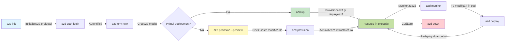
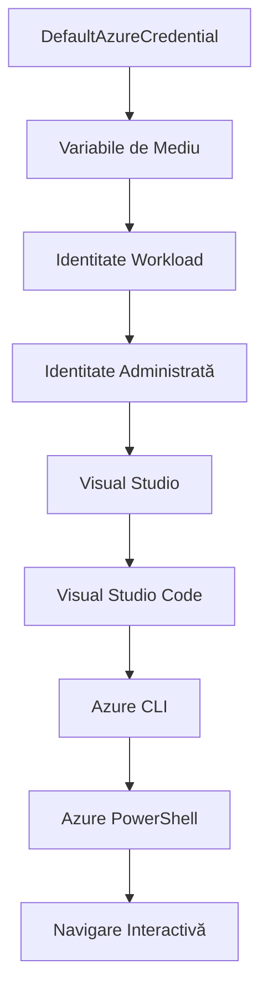

# AZD Basics - Înțelegerea Azure Developer CLI

# Bazele AZD - Concepte de bază și fundamente

**Navigare capitole:**
- **📚 Acasă curs**: [AZD Pentru Începători](../../README.md)
- **📖 Capitol curent**: Capitolul 1 - Fundament și Start Rapid
- **⬅️ Anterior**: [Prezentare curs](../../README.md#-chapter-1-foundation--quick-start)
- **➡️ Următor**: [Instalare și Configurare](installation.md)
- **🚀 Capitol următor**: [Capitolul 2: Dezvoltare AI-First](../chapter-02-ai-development/microsoft-foundry-integration.md)

## Introducere

Această lecție vă introduce în Azure Developer CLI (azd), un instrument de linie de comandă puternic care accelerează parcursul dvs. de la dezvoltarea locală la implementarea în Azure. Veți învăța conceptele fundamentale, caracteristicile de bază și veți înțelege cum azd simplifică implementarea aplicațiilor cloud-native.

## Obiective de învățare

La finalul acestei lecții, veți:
- Înțelege ce este Azure Developer CLI și scopul său principal
- Învăța conceptele de bază ale șabloanelor, mediilor și serviciilor
- Explora caracteristici cheie, inclusiv dezvoltarea bazată pe șabloane și Infrastructura ca și Cod
- Înțelege structura proiectului azd și fluxul de lucru
- Fi pregătiți să instalați și să configurați azd pentru mediul dvs. de dezvoltare

## Rezultate de învățare

După completarea acestei lecții, veți putea:
- Explica rolul azd în fluxurile moderne de dezvoltare cloud
- Identifica componentele structurii unui proiect azd
- Descrie modul în care șabloanele, mediile și serviciile funcționează împreună
- Înțelege beneficiile Infrastructure as Code cu azd
- Recunoaște diferite comenzi azd și scopurile lor

## Ce este Azure Developer CLI (azd)?

Azure Developer CLI (azd) este un instrument de linie de comandă proiectat să accelereze parcursul dvs. de la dezvoltarea locală la implementarea în Azure. Simplifică procesul de construire, implementare și gestionare a aplicațiilor cloud-native pe Azure.

### Ce puteți implementa cu azd?

azd suportă o gamă largă de sarcini de lucru—și lista continuă să crească. Astăzi, puteți folosi azd pentru a implementa:

| Tip sarcină de lucru | Exemple | Același flux de lucru? |
|---------------------|----------|------------------------|
| **Aplicații tradiționale** | Aplicații web, API-uri REST, site-uri statice | ✅ `azd up` |
| **Servicii și microservicii** | Aplicații container, Aplicații funcții, backend-uri multi-serviciu | ✅ `azd up` |
| **Aplicații alimentate de AI** | Aplicații chat cu modele Microsoft Foundry, soluții RAG cu AI Search | ✅ `azd up` |
| **Agenți inteligenți** | Agenți găzduiți Foundry, orchestrări multi-agente | ✅ `azd up` |

Ideea cheie este că **ciclul de viață azd rămâne același indiferent ce implementați**. Inițializați un proiect, aprovizionați infrastructura, implementați codul, monitorizați aplicația și curățați resursele—fie că este un site simplu sau un agent AI sofisticat.

Această continuitate este intenționată. azd tratează capabilitățile AI ca un alt tip de serviciu pe care aplicația dvs. îl poate folosi, nu ca ceva fundamental diferit. Un endpoint de chat susținut de modelele Microsoft Foundry este, din perspectiva azd, doar un alt serviciu de configurat și implementat.

### 🎯 De ce să folosiți AZD? O comparație din lumea reală

Să comparăm implementarea unui simplu web app cu o bază de date:

#### ❌ FĂRĂ AZD: Implementare manuală Azure (peste 30 de minute)

```bash
# Pasul 1: Creează grupul de resurse
az group create --name myapp-rg --location eastus

# Pasul 2: Creează planul App Service
az appservice plan create --name myapp-plan \
  --resource-group myapp-rg \
  --sku B1 --is-linux

# Pasul 3: Creează aplicația web
az webapp create --name myapp-web-unique123 \
  --resource-group myapp-rg \
  --plan myapp-plan \
  --runtime "NODE:18-lts"

# Pasul 4: Creează contul Cosmos DB (10-15 minute)
az cosmosdb create --name myapp-cosmos-unique123 \
  --resource-group myapp-rg \
  --kind MongoDB

# Pasul 5: Creează baza de date
az cosmosdb mongodb database create \
  --account-name myapp-cosmos-unique123 \
  --resource-group myapp-rg \
  --name tododb

# Pasul 6: Creează colecția
az cosmosdb mongodb collection create \
  --account-name myapp-cosmos-unique123 \
  --resource-group myapp-rg \
  --database-name tododb \
  --name todos

# Pasul 7: Obține șirul de conectare
CONN_STR=$(az cosmosdb keys list \
  --name myapp-cosmos-unique123 \
  --resource-group myapp-rg \
  --type connection-strings \
  --query "connectionStrings[0].connectionString" -o tsv)

# Pasul 8: Configurează setările aplicației
az webapp config appsettings set \
  --name myapp-web-unique123 \
  --resource-group myapp-rg \
  --settings MONGODB_URI="$CONN_STR"

# Pasul 9: Activează logarea
az webapp log config --name myapp-web-unique123 \
  --resource-group myapp-rg \
  --application-logging filesystem \
  --detailed-error-messages true

# Pasul 10: Configurează Application Insights
az monitor app-insights component create \
  --app myapp-insights \
  --location eastus \
  --resource-group myapp-rg

# Pasul 11: Leagă App Insights de aplicația web
INSTRUMENTATION_KEY=$(az monitor app-insights component show \
  --app myapp-insights \
  --resource-group myapp-rg \
  --query "instrumentationKey" -o tsv)

az webapp config appsettings set \
  --name myapp-web-unique123 \
  --resource-group myapp-rg \
  --settings APPINSIGHTS_INSTRUMENTATIONKEY="$INSTRUMENTATION_KEY"

# Pasul 12: Compilează aplicația local
npm install
npm run build

# Pasul 13: Creează pachetul de implementare
zip -r app.zip . -x "*.git*" "node_modules/*"

# Pasul 14: Publică aplicația
az webapp deployment source config-zip \
  --resource-group myapp-rg \
  --name myapp-web-unique123 \
  --src app.zip

# Pasul 15: Așteaptă și roagă-te să funcționeze 🙏
# (Fără validare automată, este necesară testarea manuală)
```

**Probleme:**
- ❌ Peste 15 comenzi de reținut și executat în ordine
- ❌ 30-45 minute de lucru manual
- ❌ Ușor să apară greșeli (greseli de tastare, parametri incorecți)
- ❌ Stringuri de conexiune expuse în istoricul terminalului
- ❌ Fără rollback automat dacă ceva eșuează
- ❌ Greu de replicat pentru membrii echipei
- ❌ Diferit de fiecare dată (nereproducibil)

#### ✅ CU AZD: Implementare automatizată (5 comenzi, 10-15 minute)

```bash
# Pasul 1: Inițializați din șablon
azd init --template todo-nodejs-mongo

# Pasul 2: Autentificare
azd auth login

# Pasul 3: Creați mediul
azd env new dev

# Pasul 4: Previzualizați modificările (opțional, dar recomandat)
azd provision --preview

# Pasul 5: Implementați totul
azd up

# ✨ Gata! Totul este implementat, configurat și monitorizat
```

**Beneficii:**
- ✅ **5 comenzi** față de 15+ pași manuali
- ✅ **10-15 minute** timp total (în mare parte așteptare Azure)
- ✅ **Zero erori** - automatizat și testat
- ✅ **Secrete gestionate securizat** prin Key Vault
- ✅ **Rollback automat** la eșecuri
- ✅ **Complet reproducibil** - același rezultat de fiecare dată
- ✅ **Pregătit pentru echipă** - oricine poate implementa cu aceleași comenzi
- ✅ **Infrastructură ca și Cod** - șabloane Bicep sub controlul versiunii
- ✅ **Monitorizare integrată** - Application Insights configurat automat

### 📊 Reducerea timpului & erorilor

| Metriă | Implementare manuală | Implementare AZD | Îmbunătățire |
|:-------|:--------------------|:-----------------|:-------------|
| **Comenzi** | 15+ | 5 | 67% mai puține |
| **Timp** | 30-45 min | 10-15 min | 60% mai rapid |
| **Rată erori** | ~40% | <5% | Reducere de 88% |
| **Consistență** | Scăzută (manual) | 100% (automatizat) | Perfectă |
| **Integrare echipă** | 2-4 ore | 30 minute | 75% mai rapid |
| **Timp rollback** | Peste 30 min (manual) | 2 min (automatizat) | 93% mai rapid |

## Concepte de bază

### Șabloane
Șabloanele sunt fundația azd. Ele conțin:
- **Cod aplicație** - Codul sursă și dependențele
- **Definiții infrastructură** - Resurse Azure definite în Bicep sau Terraform
- **Fișiere de configurare** - Setări și variabile de mediu
- **Scripturi de implementare** - Fluxuri de lucru automatizate pentru implementare

### Medii
Mediile reprezintă țintele diferite de implementare:
- **Dezvoltare** - Pentru testare și dezvoltare
- **Staging** - Mediu pre-producție
- **Producție** - Mediu live de producție

Fiecare mediu menține:
- Grupul de resurse Azure propriu
- Setări de configurare
- Starea implementării

### Servicii
Serviciile sunt blocurile de construcție ale aplicației dvs.:
- **Frontend** - Aplicații web, SPA
- **Backend** - API-uri, microservicii
- **Bază de date** - Soluții de stocare a datelor
- **Stocare** - Stocare de fișiere și blob-uri

## Caracteristici cheie

### 1. Dezvoltare bazată pe șabloane
```bash
# Răsfoiește șabloanele disponibile
azd template list

# Inițializează dintr-un șablon
azd init --template <template-name>
```

### 2. Infrastructure as Code
- **Bicep** - Limbaj specific domeniului Azure
- **Terraform** - Instrument multi-cloud pentru infrastructură
- **Șabloane ARM** - Șabloane Azure Resource Manager

### 3. Fluxuri de lucru integrate
```bash
# Flux complet de implementare
azd up            # Provisionare + Implementare, acest lucru este automat pentru configurarea inițială

# 🧪 NOU: Previzualizați schimbările în infrastructură înainte de implementare (SIGUR)
azd provision --preview    # Simulează implementarea infrastructurii fără a face modificări

azd provision     # Creează resurse Azure dacă actualizezi infrastructura, folosește aceasta
azd deploy        # Implementarea codului aplicației sau reimplementarea codului aplicației după actualizare
azd down          # Curățare resurse
```

#### 🛡️ Planificare sigură a infrastructurii cu previzualizare
Comanda `azd provision --preview` este un schimbător de joc pentru implementări sigure:
- **Analiză dry-run** - Arată ce va fi creat, modificat sau șters
- **Riscuri zero** - Nu se fac modificări reale în Azure
- **Colaborare în echipă** - Distribuiți rezultatele previzualizării înainte de implementare
- **Estimare costuri** - Înțelegeți costurile resurselor înainte de angajament

```bash
# Exemplu de flux de lucru pentru previzualizare
azd provision --preview           # Vezi ce se va schimba
# Revizuiește rezultatul, discută cu echipa
azd provision                     # Aplică modificările cu încredere
```

### 📊 Vizual: Fluxul de lucru AZD Development


**Explicația fluxului de lucru:**
1. **Init** - Începeți cu un șablon sau proiect nou
2. **Auth** - Autentificare în Azure
3. **Environment** - Creați un mediu de implementare izolat
4. **Preview** - 🆕 Întotdeauna previzualizați schimbările infrastructurii prima dată (practică sigură)
5. **Provision** - Creați/actualizați resurse Azure
6. **Deploy** - Împingeți codul aplicației
7. **Monitor** - Observați performanța aplicației
8. **Iterate** - Faceți modificări și redeplasați codul
9. **Cleanup** - Eliminați resursele când ați terminat

### 4. Gestionarea mediului
```bash
# Creați și gestionați mediile
azd env new <environment-name>
azd env select <environment-name>
azd env list
```

### 5. Extensii și comenzi AI

azd folosește un sistem de extensii pentru a adăuga capabilități dincolo de CLI de bază. Acesta este deosebit de util pentru sarcini AI:

```bash
# Listează extensiile disponibile
azd extension list

# Instalează extensia agenților Foundry
azd extension install azure.ai.agents

# Inițializează un proiect agent AI dintr-un manifest
azd ai agent init -m agent-manifest.yaml

# Pornește serverul MCP pentru dezvoltare asistată de AI (Alpha)
azd mcp start
```

> Extensiile sunt detaliate în [Capitolul 2: Dezvoltare AI-First](../chapter-02-ai-development/agents.md) și în referința [Comenzilor AI AZD CLI](../chapter-08-production/production-ai-practices.md#azd-ai-cli-commands-and-extensions).

## 📁 Structura proiectului

O structură tipică a proiectului azd:
```
my-app/
├── .azd/                    # azd configuration
│   └── config.json
├── .azure/                  # Azure deployment artifacts
├── .devcontainer/          # Development container config
├── .github/workflows/      # GitHub Actions
├── .vscode/               # VS Code settings
├── infra/                 # Infrastructure code
│   ├── main.bicep        # Main infrastructure template
│   ├── main.parameters.json
│   └── modules/          # Reusable modules
├── src/                  # Application source code
│   ├── api/             # Backend services
│   └── web/             # Frontend application
├── azure.yaml           # azd project configuration
└── README.md
```

## 🔧 Fișiere de configurare

### azure.yaml
Fișierul principal de configurare al proiectului:
```yaml
name: my-awesome-app
metadata:
  template: my-template@1.0.0

services:
  web:
    project: ./src/web
    language: js
    host: appservice
  api:
    project: ./src/api
    language: js
    host: appservice

hooks:
  preprovision:
    shell: pwsh
    run: echo "Preparing to provision..."
```

### .azure/config.json
Configurare specifică mediului:
```json
{
  "version": 1,
  "defaultEnvironment": "dev",
  "environments": {
    "dev": {
      "subscriptionId": "your-subscription-id",
      "location": "eastus"
    }
  }
}
```

## 🎪 Fluxuri de lucru comune cu exerciții practice

> **💡 Sfat de învățare:** Urmați aceste exerciții în ordine pentru a vă dezvolta abilitațile AZD în mod progresiv.

### 🎯 Exercițiul 1: Inițializați primul proiect

**Scop:** Creați un proiect AZD și explorați structura sa

**Pași:**
```bash
# Folosește un șablon dovedit
azd init --template todo-nodejs-mongo

# Explorează fișierele generate
ls -la  # Vizualizează toate fișierele, inclusiv cele ascunse

# Fișiere cheie create:
# - azure.yaml (configurația principală)
# - infra/ (codul infrastructurii)
# - src/ (codul aplicației)
```

**✅ Reușită:** Aveți directoarele azure.yaml, infra/ și src/

---

### 🎯 Exercițiul 2: Implementați în Azure

**Scop:** Completați o implementare end-to-end

**Pași:**
```bash
# 1. Autentificare
az login && azd auth login

# 2. Creează mediul
azd env new dev
azd env set AZURE_LOCATION eastus

# 3. Previzualizează modificările (RECOMANDAT)
azd provision --preview

# 4. Deplasează totul
azd up

# 5. Verifică implementarea
azd show    # Vizualizează URL-ul aplicației tale
```

**Timp estimat:** 10-15 minute  
**✅ Reușită:** URL-ul aplicației se deschide în browser

---

### 🎯 Exercițiul 3: Medii multiple

**Scop:** Implementați în dev și staging

**Pași:**
```bash
# Deja există dev, creează staging
azd env new staging
azd env set AZURE_LOCATION westus2
azd up

# Comută între ele
azd env list
azd env select dev
```

**✅ Reușită:** Două grupuri de resurse separate în portalul Azure

---

### 🛡️ Resetare completă: `azd down --force --purge`

Când trebuie să resetați complet:

```bash
azd down --force --purge
```

**Ce face:**
- `--force`: Fără solicitări de confirmare
- `--purge`: Șterge tot starea locală și resursele Azure

**Folosiți când:**
- Implementarea a eșuat pe parcurs
- Schimbarea proiectelor
- Aveți nevoie de un început curat

---

## 🎪 Referință flux de lucru original

### Începerea unui proiect nou
```bash
# Metoda 1: Folosește un șablon existent
azd init --template todo-nodejs-mongo

# Metoda 2: Pornește de la zero
azd init

# Metoda 3: Folosește directorul curent
azd init .
```

### Ciclu de dezvoltare
```bash
# Configurați mediul de dezvoltare
azd auth login
azd env new dev
azd env select dev

# Implementați totul
azd up

# Faceți modificări și reimplementați
azd deploy

# Curățați după ce ați terminat
azd down --force --purge # Comanda din Azure Developer CLI este un **reset complet** pentru mediul dvs.—deosebit de utilă atunci când depanați implementări eșuate, curățați resurse orfane sau pregătiți o reimplementare de la zero.
```

## Înțelegerea `azd down --force --purge`
Comanda `azd down --force --purge` este o metodă puternică pentru a elimina complet mediul azd și toate resursele asociate. Iată o defalcare a fiecărui flag:
```
--force
```
- Sare peste solicitările de confirmare.
- Util în automatizări sau scripturi unde nu este posibil input manual.
- Asigură continuarea demolării fără întreruperi, chiar dacă CLI detectează inconsistențe.

```
--purge
```
Șterge **toate metadatele asociate**, inclusiv:
Starea mediului  
Folderul local `.azure`  
Informații cache ale implementărilor  
Împiedică azd să „-își amintească-” implementările anterioare, ceea ce poate cauza probleme ca grupuri de resurse nepotrivite sau referințe vechi în registru.

### De ce să folosiți ambele?
Când întâmpinați probleme cu `azd up` din cauza stării persistente sau a implementărilor parțiale, această combinație asigură un **start curat**.

Este deosebit de utilă după ștergeri manuale de resurse în portalul Azure sau când schimbați șabloanele, mediile sau convențiile de denumire a grupurilor de resurse.

### Gestionarea mediilor multiple
```bash
# Creează mediul de testare
azd env new staging
azd env select staging
azd up

# Revino la dev
azd env select dev

# Compară mediile
azd env list
```

## 🔐 Autentificare și credențiale

Înțelegerea autentificării este crucială pentru implementări reușite cu azd. Azure folosește metode multiple de autentificare, iar azd valorifică același lanț de credențiale folosit și de alte instrumente Azure.

### Autentificare Azure CLI (`az login`)

Înainte de a folosi azd, trebuie să vă autentificați în Azure. Metoda cea mai comună este folosirea Azure CLI:

```bash
# Autentificare interactivă (deschide browser-ul)
az login

# Autentificare cu un tenant specific
az login --tenant <tenant-id>

# Autentificare cu principal de serviciu
az login --service-principal -u <app-id> -p <password> --tenant <tenant-id>

# Verifică starea curentă a autentificării
az account show

# Listează abonamentele disponibile
az account list --output table

# Setează abonamentul implicit
az account set --subscription <subscription-id>
```

### Flux de autentificare
1. **Login interactiv**: Deschide browserul implicit pentru autentificare
2. **Device Code Flow**: Pentru medii fără acces la browser
3. **Service Principal**: Pentru automatizare și scenarii CI/CD
4. **Managed Identity**: Pentru aplicații găzduite Azure

### Lanțul DefaultAzureCredential

`DefaultAzureCredential` este un tip de credential care oferă o experiență simplificată de autentificare încercând automat mai multe surse de credențiale într-o ordine specifică:

#### Ordinea lanțului de credențiale

#### 1. Variabile de mediu
```bash
# Setează variabilele de mediu pentru principalul serviciu
export AZURE_CLIENT_ID="<app-id>"
export AZURE_CLIENT_SECRET="<password>"
export AZURE_TENANT_ID="<tenant-id>"
```

#### 2. Workload Identity (Kubernetes/GitHub Actions)
Folosit automat în:
- Azure Kubernetes Service (AKS) cu Workload Identity
- GitHub Actions cu federare OIDC
- Alte scenarii federate de identitate

#### 3. Managed Identity
Pentru resurse Azure ca:
- Mașini Virtuale
- App Service
- Azure Functions
- Instanțe de containere

```bash
# Verifică dacă rulează pe o resursă Azure cu identitate administrată
az account show --query "user.type" --output tsv
# Returnează: "servicePrincipal" dacă utilizează identitate administrată
```

#### 4. Integrarea instrumentelor pentru dezvoltatori
- **Visual Studio**: Folosește automat contul autentificat
- **VS Code**: Folosește credențialele extensiei Azure Account
- **Azure CLI**: Folosește credențialele `az login` (cel mai comun pentru dezvoltare locală)

### Configurarea autentificării AZD

```bash
# Metoda 1: Folosiți Azure CLI (Recomandat pentru dezvoltare)
az login
azd auth login  # Folosește acreditările Azure CLI existente

# Metoda 2: Autentificare directă azd
azd auth login --use-device-code  # Pentru medii fără interfață

# Metoda 3: Verifică starea autentificării
azd auth login --check-status

# Metoda 4: Deconectare și reautentificare
azd auth logout
azd auth login
```

### Cele mai bune practici pentru autentificare

#### Pentru dezvoltare locală
```bash
# 1. Autentificare cu Azure CLI
az login

# 2. Verifică abonamentul corect
az account show
az account set --subscription "Your Subscription Name"

# 3. Folosește azd cu acreditările existente
azd auth login
```

#### Pentru pipeline-uri CI/CD
```yaml
# GitHub Actions example
- name: Azure Login
  uses: azure/login@v1
  with:
    creds: ${{ secrets.AZURE_CREDENTIALS }}

- name: Deploy with azd
  run: |
    azd auth login --client-id ${{ secrets.AZURE_CLIENT_ID }} \
                    --client-secret ${{ secrets.AZURE_CLIENT_SECRET }} \
                    --tenant-id ${{ secrets.AZURE_TENANT_ID }}
    azd up --no-prompt
```

#### Pentru medii de producție
- Folosiți **Managed Identity** când rulați pe resurse Azure
- Folosiți **Service Principal** pentru scenarii de automatizare
- Evitați stocarea credențialelor în cod sau fișiere de configurare
- Folosiți **Azure Key Vault** pentru configurații sensibile

### Probleme comune de autentificare și soluții

#### Problemă: "No subscription found"
```bash
# Soluție: Setează abonamentul implicit
az account list --output table
az account set --subscription "<subscription-id>"
azd env set AZURE_SUBSCRIPTION_ID "<subscription-id>"
```

#### Problemă: "Insufficient permissions"
```bash
# Soluție: Verificați și atribuiți rolurile necesare
az role assignment list --assignee $(az account show --query user.name --output tsv)

# Roluri comune necesare:
# - Contributor (pentru gestionarea resurselor)
# - Administrator Acces Utilizatori (pentru atribuirea rolurilor)
```

#### Problemă: "Token expired"
```bash
# Soluție: Re-autentificare
az logout
az login
azd auth logout
azd auth login
```

### Autentificare în diferite scenarii

#### Dezvoltare locală
```bash
# Cont de dezvoltare personală
az login
azd auth login
```

#### Dezvoltare în echipă
```bash
# Folosește un tenant specific pentru organizație
az login --tenant contoso.onmicrosoft.com
azd auth login
```

#### Scenarii multi-tenant
```bash
# Comută între chiriași
az login --tenant tenant1.onmicrosoft.com
# Deploy către chiriașul 1
azd up

az login --tenant tenant2.onmicrosoft.com  
# Deploy către chiriașul 2
azd up
```

### Considerații de securitate
1. **Stocarea acreditărilor**: Nu stocați niciodată acreditările în codul sursă  
2. **Limitarea domeniului**: Folosiți principiul celui mai mic privilegiu pentru principalii de serviciu  
3. **Rotirea tokenurilor**: Rotiți regulat secretele principalului de serviciu  
4. **Urmărirea auditului**: Monitorizați activitățile de autentificare și implementare  
5. **Securitatea rețelei**: Folosiți puncte finale private atunci când este posibil  

### Depanarea autentificării

```bash
# Depanare probleme de autentificare
azd auth login --check-status
az account show
az account get-access-token

# Comenzi de diagnostic comune
whoami                          # Contextul utilizatorului curent
az ad signed-in-user show      # Detalii utilizator Azure AD
az group list                  # Testare acces resurse
```
  
## Înțelegerea `azd down --force --purge`

### Descoperire  
```bash
azd template list              # Răsfoiește șabloane
azd template show <template>   # Detalii șablon
azd init --help               # Opțiuni de inițializare
```
  
### Managementul proiectului  
```bash
azd show                     # Prezentare generală a proiectului
azd env show                 # Mediu actual
azd config list             # Setări de configurare
```
  
### Monitorizare  
```bash
azd monitor                  # Deschide monitorizarea portalului Azure
azd monitor --logs           # Vizualizează jurnalele aplicației
azd monitor --live           # Vizualizează metrici în timp real
azd pipeline config          # Configurează CI/CD
```
  
## Cele mai bune practici

### 1. Folosiți nume semnificative  
```bash
# Bun
azd env new production-east
azd init --template web-app-secure

# Evită
azd env new env1
azd init --template template1
```
  
### 2. Folosiți șabloane  
- Începeți cu șabloane existente  
- Personalizați după nevoile dvs.  
- Creați șabloane reutilizabile pentru organizația dvs.  

### 3. Izolarea mediului  
- Folosiți medii separate pentru dev/staging/producție  
- Nu implementați niciodată direct în producție de pe mașina locală  
- Folosiți pipeline-uri CI/CD pentru implementările în producție  

### 4. Managementul configurației  
- Folosiți variabile de mediu pentru date sensibile  
- Păstrați configurația în controlul versiunilor  
- Documentați setările specifice mediului  

## Progresul în învățare

### Începători (Săptămânile 1-2)  
1. Instalați azd și autentificați-vă  
2. Implementați un șablon simplu  
3. Înțelegeți structura proiectului  
4. Învățați comenzile de bază (up, down, deploy)  

### Intermediari (Săptămânile 3-4)  
1. Personalizați șabloanele  
2. Gestionați mai multe medii  
3. Înțelegeți codul infrastructurii  
4. Configurați pipeline-uri CI/CD  

### Avansați (Săptămâna 5+)  
1. Creați șabloane personalizate  
2. Modele avansate de infrastructură  
3. Implementări multi-regiune  
4. Configurații de nivel enterprise  

## Pașii următori

**📖 Continuați Învățarea Capitoului 1:**  
- [Instalare și Configurare](installation.md) - Instalați și configurați azd  
- [Primul Dvs. Proiect](first-project.md) - Tutorial practic complet  
- [Ghidul de Configurare](configuration.md) - Opțiuni avansate de configurare  

**🎯 Pregătit pentru următorul capitol?**  
- [Capitolul 2: Dezvoltare AI-First](../chapter-02-ai-development/microsoft-foundry-integration.md) - Începeți să construiți aplicații AI  

## Resurse suplimentare

- [Prezentarea CLI pentru Dezvoltatori Azure](https://learn.microsoft.com/en-us/azure/developer/azure-developer-cli/)  
- [Galerie de Șabloane](https://azure.github.io/awesome-azd/)  
- [Exemple Comunitare](https://github.com/Azure-Samples)  

---

## 🙋 Întrebări frecvente

### Întrebări generale

**Î: Care e diferența între AZD și Azure CLI?**

R: Azure CLI (`az`) este pentru gestionarea resurselor individuale Azure. AZD (`azd`) este pentru gestionarea aplicațiilor întregi:  

```bash
# Azure CLI - Management la nivel scăzut al resurselor
az webapp create --name myapp --resource-group rg
az sql server create --name myserver --resource-group rg
# ...multe alte comenzi necesare

# AZD - Management la nivel de aplicație
azd up  # Desfășoară întreaga aplicație cu toate resursele
```
  
**Gândiți-vă așa:**  
- `az` = Operarea pe cărămizi Lego individuale  
- `azd` = Lucrul cu seturi complete Lego  

---

**Î: Trebuie să știu Bicep sau Terraform pentru a folosi AZD?**

R: Nu! Începeți cu șabloane:  
```bash
# Folosiți un șablon existent - nu este necesară cunoașterea IaC
azd init --template todo-nodejs-mongo
azd up
```
  
Puteți învăța Bicep mai târziu pentru a personaliza infrastructura. Șabloanele oferă exemple funcționale din care să învățați.  

---

**Î: Cât costă să rulez șabloanele AZD?**

R: Costurile variază în funcție de șablon. Majoritatea șabloanelor de dezvoltare costă 50-150 $/lună:  

```bash
# Previzualizează costurile înainte de implementare
azd provision --preview

# Curăță întotdeauna când nu este utilizat
azd down --force --purge  # Elimină toate resursele
```
  
**Sfat profesional:** Folosiți nivelurile gratuite când sunt disponibile:  
- App Service: nivelul F1 (gratuit)  
- Modelele Microsoft Foundry: Azure OpenAI 50.000 token-uri gratuite pe lună  
- Cosmos DB: nivel gratuit 1000 RU/s  

---

**Î: Pot folosi AZD cu resurse Azure existente?**

R: Da, dar este mai ușor să începeți de la zero. AZD funcționează cel mai bine când gestionează ciclul complet de viață. Pentru resurse existente:  

```bash
# Opțiunea 1: Importă resurse existente (avansat)
azd init
# Apoi modifică infra/ pentru a face referire la resursele existente

# Opțiunea 2: Începe de la zero (recomandat)
azd init --template matching-your-stack
azd up  # Creează un mediu nou
```
  
---

**Î: Cum împart proiectul cu colegii?**

R: Comitați proiectul AZD în Git (dar NU și folderul .azure):  

```bash
# Deja în .gitignore în mod implicit
.azure/        # Conține secrete și date de mediu
*.env          # Variabile de mediu

# Membrii echipei apoi:
git clone <your-repo>
azd auth login
azd env new <their-name>-dev
azd up
```
  
Toată lumea primește infrastructura identică din aceleași șabloane.  

---

### Întrebări de depanare

**Î: „azd up” a eșuat pe jumătate. Ce fac?**

R: Verificați eroarea, remediați-o, apoi reîncercați:  

```bash
# Vizualizați jurnalele detaliate
azd show

# Remedieri comune:

# 1. Dacă cota a fost depășită:
azd env set AZURE_LOCATION "westus2"  # Încercați o regiune diferită

# 2. Dacă există un conflict de nume al resursei:
azd down --force --purge  # Curățați totul
azd up  # Reîncercați

# 3. Dacă autentificarea a expirat:
az login
azd auth login
azd up
```
  
**Cea mai comună problemă:** Subscripția Azure selectată greșit  
```bash
az account list --output table
az account set --subscription "<correct-subscription>"
```
  
---

**Î: Cum pot implementa doar schimbările de cod fără reprovisionare?**

R: Folosiți `azd deploy` în loc de `azd up`:  

```bash
azd up          # Prima dată: provisioning + deploy (lent)

# Fă modificări în cod...

azd deploy      # Data viitoare: doar deploy (rapid)
```
  
Compararea vitezei:  
- `azd up`: 10-15 minute (provisionare infrastructură)  
- `azd deploy`: 2-5 minute (doar codul)  

---

**Î: Pot personaliza șabloanele de infrastructură?**

R: Da! Editați fișierele Bicep din `infra/`:  

```bash
# După azd init
cd infra/
code main.bicep  # Editează în VS Code

# Previzualizează modificările
azd provision --preview

# Aplică modificările
azd provision
```
  
**Sfat:** Începeți cu puțin – modificați mai întâi SKU-urile:  
```bicep
// infra/main.bicep
sku: {
  name: 'B1'  // Change to 'P1V2' for production
}
```
  
---

**Î: Cum șterg tot ce a creat AZD?**

R: O singură comandă elimină toate resursele:  

```bash
azd down --force --purge

# Aceasta șterge:
# - Toate resursele Azure
# - Grupul de resurse
# - Starea mediului local
# - Datele cache ale implementării
```
  
**Rulați întotdeauna când:**  
- Ați terminat testarea unui șablon  
- Treci la un alt proiect  
- Vrei să începi de la zero  

**Economii de cost:** Ștergerea resurselor neutilizate elimină costurile  

---

**Î: Ce fac dacă am șters din greșeală resurse în Azure Portal?**

R: Starea AZD se poate dezechilibra. Abordare cu reset complet:  

```bash
# 1. Elimină starea locală
azd down --force --purge

# 2. Începe de la zero
azd up

# Alternativă: Lasă AZD să detecteze și să repare
azd provision  # Va crea resursele lipsă
```
  
---

### Întrebări avansate

**Î: Pot folosi AZD în pipeline-urile CI/CD?**

R: Da! Exemplu GitHub Actions:  

```yaml
# .github/workflows/deploy.yml
name: Deploy with AZD

on:
  push:
    branches: [main]

jobs:
  deploy:
    runs-on: ubuntu-latest
    steps:
      - uses: actions/checkout@v2
      
      - name: Install azd
        run: curl -fsSL https://aka.ms/install-azd.sh | bash
      
      - name: Azure Login
        run: |
          azd auth login \
            --client-id ${{ secrets.AZURE_CLIENT_ID }} \
            --client-secret ${{ secrets.AZURE_CLIENT_SECRET }} \
            --tenant-id ${{ secrets.AZURE_TENANT_ID }}
      
      - name: Deploy
        run: azd up --no-prompt
```
  
---

**Î: Cum gestionez secretele și datele sensibile?**

R: AZD se integrează automat cu Azure Key Vault:  

```bash
# Secretele sunt stocate în Key Vault, nu în cod
azd env set DATABASE_PASSWORD "$(openssl rand -base64 32)"

# AZD face automat:
# 1. Creează Key Vault
# 2. Stochează secretul
# 3. Acordă acces aplicației prin Identitate Gestionată
# 4. Injecție la rulare
```
  
**Nu comitați niciodată:**  
- folderul `.azure/` (conține date de mediu)  
- fișiere `.env` (secrete locale)  
- string-uri de conexiune  

---

**Î: Pot implementa în mai multe regiuni?**

R: Da, creați câte un mediu pentru fiecare regiune:  

```bash
# Mediu East US
azd env new prod-eastus
azd env set AZURE_LOCATION eastus
azd up

# Mediu West Europe
azd env new prod-westeurope
azd env set AZURE_LOCATION westeurope
azd up

# Fiecare mediu este independent
azd env list
```
  
Pentru aplicații multi-regiune adevărate, personalizați șabloanele Bicep pentru a implementa simultan în mai multe regiuni.  

---

**Î: Unde pot primi ajutor dacă întâmpin probleme?**

1. **Documentația AZD:** https://learn.microsoft.com/azure/developer/azure-developer-cli/  
2. **Probleme GitHub:** https://github.com/Azure/azure-dev/issues  
3. **Discord:** [Azure Discord](https://discord.gg/microsoft-azure) - canalul #azure-developer-cli  
4. **Stack Overflow:** Tag-ul `azure-developer-cli`  
5. **Acest curs:** [Ghid de depanare](../chapter-07-troubleshooting/common-issues.md)  

**Sfat profesional:** Înainte să întrebați, rulați:  
```bash
azd show       # Arată starea curentă
azd version    # Arată versiunea ta
```
  
Includeți aceste informații în întrebare pentru un ajutor mai rapid.  

---

## 🎓 Ce urmează?

Acum înțelegeți elementele fundamentale AZD. Alegeți-vă calea:

### 🎯 Pentru începători:  
1. **Următorul pas:** [Instalare și Configurare](installation.md) - Instalați AZD pe mașina dvs.  
2. **Apoi:** [Primul dvs. proiect](first-project.md) - Implementați prima aplicație  
3. **Exersați:** Completați toate cele 3 exerciții din această lecție  

### 🚀 Pentru dezvoltatori AI:  
1. **Săriți la:** [Capitolul 2: Dezvoltare AI-First](../chapter-02-ai-development/microsoft-foundry-integration.md)  
2. **Implementați:** Începeți cu `azd init --template get-started-with-ai-chat`  
3. **Învățați:** Construiți în timp ce implementați  

### 🏗️ Pentru dezvoltatori experimentați:  
1. **Revizuiți:** [Ghidul de configurație](configuration.md) - Setări avansate  
2. **Explorați:** [Infrastructură ca Cod](../chapter-04-infrastructure/provisioning.md) - Detaliu Bicep  
3. **Construiți:** Creați șabloane personalizate pentru stack-ul dvs.  

---

**Navigare capitole:**  
- **📚 Acasă curs:** [AZD Pentru Începători](../../README.md)  
- **📖 Capitolul curent:** Capitolul 1 - Fundamente & Start rapid  
- **⬅️ Anterior:** [Prezentarea cursului](../../README.md#-chapter-1-foundation--quick-start)  
- **➡️ Următor:** [Instalare și Configurare](installation.md)  
- **🚀 Capitolul următor:** [Capitolul 2: Dezvoltare AI-First](../chapter-02-ai-development/microsoft-foundry-integration.md)

---

<!-- CO-OP TRANSLATOR DISCLAIMER START -->
**Declinare a responsabilității**:  
Acest document a fost tradus utilizând serviciul de traducere AI [Co-op Translator](https://github.com/Azure/co-op-translator). Deși ne străduim pentru acuratețe, vă rugăm să rețineți că traducerile automate pot conține erori sau inexactități. Documentul original în limba sa nativă trebuie considerat sursa autorizată. Pentru informații critice, se recomandă traducerea profesională realizată de un traducător uman. Nu ne asumăm responsabilitatea pentru eventualele neînțelegeri sau interpretări greșite rezultate din utilizarea acestei traduceri.
<!-- CO-OP TRANSLATOR DISCLAIMER END -->