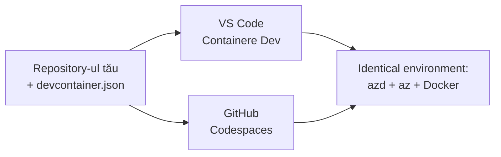

# Containere Dev & GitHub Codespaces pentru azd

**Navigare capitol:**
- **📚 Acasă curs**: [AZD Pentru Începători](../../README.md)
- **📖 Capitol curent**: Capitolul 1 - Bază și Pornire Rapidă
- **⬅️ Anterior**: [Adu-ți propria aplicație](bring-your-own-app.md)
- **🚀 Capitol următor**: [Capitolul 2: Dezvoltare AI-First](../chapter-02-ai-development/README.md)

> Validat cu `azd 1.27.1` în iulie 2026.

## Introducere

Instalarea azd, a runtime-ului limbajului corect, Docker și Azure CLI pe fiecare mașină este o corvoadă — și este motivul principal pentru care un tutorial care "funcționează pe mașina mea" eșuează pentru altcineva. Un **container dev** rezolvă acest lucru descriind întregul tău lanț de unelte într-un fișier. Oricine deschide proiectul în VS Code sau GitHub Codespaces primește exact același mediu, cu azd deja instalat. Această lecție îți arată cum să adaugi unul.

## Obiective de învățare

Până la finalul acestei lecții, vei:
- Înțelege ce este un container dev și de ce ajută cu azd
- Adăuga un minimal `.devcontainer/devcontainer.json` într-un proiect
- Include azd, Azure CLI și Docker prin *features* ale Containerului Dev
- Deschide proiectul în GitHub Codespaces sau VS Code

## Rezultate ale învățării

După ce termini această lecție, vei putea:
- Autor un `devcontainer.json` pentru un proiect azd
- Adăuga azd și uneltele Azure fără instalări manuale
- Rula `azd up` din interiorul unui container sau Codespace

---

## Ce este un Container Dev?

Un container dev este un mediu de dezvoltare bazat pe Docker definit printr-un fișier `.devcontainer/devcontainer.json` în depozitul tău. Când deschizi proiectul:

- **VS Code** (cu extensia Dev Containers) construiește containerul și se atașează la el.
- **GitHub Codespaces** construiește același container în cloud și îți oferă un editor bazat pe browser.

Oricum, fiecare contribuitor primește unelte identice — fără "ai instalat azd?" troubleshooting.



---

## Pasul 1: Creează fișierul devcontainer

Creează `.devcontainer/devcontainer.json` în rădăcina proiectului tău:

```json
{
  "name": "azd-project",
  "image": "mcr.microsoft.com/devcontainers/base:bookworm",
  "features": {
    "ghcr.io/devcontainers/features/azure-cli:1": {},
    "ghcr.io/azure/azure-dev/azd:latest": {},
    "ghcr.io/devcontainers/features/docker-in-docker:2": {},
    "ghcr.io/devcontainers/features/node:1": {}
  },
  "customizations": {
    "vscode": {
      "extensions": [
        "ms-azuretools.azure-dev",
        "ms-azuretools.vscode-bicep"
      ]
    }
  },
  "forwardPorts": [3000],
  "postCreateCommand": "azd version"
}
```

Ce face fiecare parte:

| Cheie | Scop |
|-----|---------|
| `image` | OS-ul de bază pentru container |
| `features` | Instalatori preconfigurați — aici: Azure CLI, **azd**, Docker și Node.js |
| `customizations.vscode.extensions` | Instalează automat extensiile azd și Bicep pentru VS Code |
| `forwardPorts` | Expune portul aplicației tale către browser |
| `postCreateCommand` | Rulează o dată după construirea containerului (aici, un test de integritate) |

> Feature-ul `ghcr.io/azure/azure-dev/azd:latest` este modalitatea oficială de a obține azd într-un container. Fixează o versiune specifică (de exemplu `azd:1.27.1`) dacă ai nevoie de reproductibilitate.

---

## Pasul 2: Potrivește Feature-ul cu limbajul aplicației tale

Înlocuiește feature-ul `node` cu ce folosește aplicația ta:

```jsonc
// Python project
"ghcr.io/devcontainers/features/python:1": {},

// .NET project
"ghcr.io/devcontainers/features/dotnet:2": {},

// Java project
"ghcr.io/devcontainers/features/java:1": {},

// Go project
"ghcr.io/devcontainers/features/go:1": {}
```

Păstrează `docker-in-docker` dacă `host`ul tău este `containerapp`, `aks` sau orice altceva care construiește o imagine de container — azd are nevoie de Docker pentru a construi și împinge imagini.

---

## Pasul 3: Deschide-l

**În VS Code:**
1. Instalează extensia **Dev Containers**.
2. Deschide directorul proiectului.
3. Click pe **Reopen in Container** când ți se cere (sau rulează *Dev Containers: Reopen in Container*).

**În GitHub Codespaces:**
1. Trimite repo-ul pe GitHub.
2. Click pe **Code → Codespaces → Create codespace on main**.
3. Așteaptă să se construiască containerul — azd este gata în terminal.

---

## Pasul 4: Deploy din interiorul containerului

Containerul are azd preinstalat, așa că fluxul normal doar funcționează:

```bash
azd auth login --use-device-code   # codul dispozitivului este util în interiorul Codespaces
azd up
```

> **De ce `--use-device-code`?** Într-un container remote sau Codespace nu există un browser local pentru redirecționare, așa că autentificarea cu codul de dispozitiv este calea de încredere. Vei introduce un cod într-o filă de browser pentru a finaliza autentificarea.

---

## Capcane frecvente

| Capcană | Soluție |
|---------|-----|
| `azd up` nu poate construi o imagine | Adaugă feature-ul `docker-in-docker` |
| Login-ul prin browser se blochează în Codespaces | Folosește `azd auth login --use-device-code` |
| Uneltele diferă între colegi | Fixează versiunile feature-urilor (ex. `azd:1.27.1`) |
| Aplicația nu este accesibilă în browser | Adaugă portul în `forwardPorts` |

---

## Rezumat

- Un container dev face lanțul tău de unelte azd reproducibil pentru toți.
- Adaugă azd, Azure CLI și Docker prin *features* ale Containerului Dev.
- Potrivește feature-ul limbajului cu aplicația ta și păstrează `docker-in-docker` pentru gazdele containerelor.
- Folosește autentificarea cu cod dispozitiv când rulezi în Codespaces.

---

## 🔗 Navigare

| Direcție | Resursă |
|-----------|----------|
| **Anterior** | [Adu-ți propria aplicație](bring-your-own-app.md) |
| **Acasă Capitol** | [Capitolul 1: Bază și Pornire Rapidă](README.md) |
| **Capitol următor** | [Capitolul 2: Dezvoltare AI-First](../chapter-02-ai-development/README.md) |

## 📖 Resurse conexe

- [Instalare & Configurare](installation.md)
- [Fișă de comandă](../../resources/cheat-sheet.md)
- [Specificația oficială a Containerelor Dev](https://containers.dev/)
- [Feature-ul azd Dev Container](https://github.com/Azure/azure-dev/tree/main/ext/devcontainer)

---

<!-- CO-OP TRANSLATOR DISCLAIMER START -->
**Declinare a responsabilității**:
Acest document a fost tradus folosind serviciul de traducere AI [Co-op Translator](https://github.com/Azure/co-op-translator). În timp ce ne străduim pentru acuratețe, vă rugăm să rețineți că traducerile automate pot conține erori sau inexactități. Documentul original în limba sa nativă trebuie considerat sursa autorizată. Pentru informații critice, se recomandă traducerea profesională realizată de un om. Nu ne asumăm responsabilitatea pentru eventualele neînțelegeri sau interpretări greșite care decurg din utilizarea acestei traduceri.
<!-- CO-OP TRANSLATOR DISCLAIMER END -->