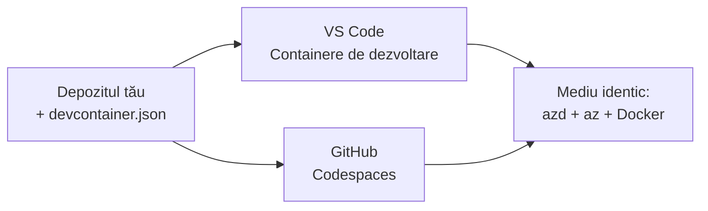

# Dev Containers & GitHub Codespaces pentru azd

**Navigare capitole:**
- **📚 Course Home**: [AZD pentru începători](../../README.md)
- **📖 Capitolul curent**: Capitolul 1 - Fundamente & Pornire rapidă
- **⬅️ Anterior**: [Adu-ți propria aplicație](bring-your-own-app.md)
- **🚀 Următorul capitol**: [Capitolul 2: Dezvoltare axată pe AI](../chapter-02-ai-development/README.md)

> Validat cu `azd 1.25.6` în iunie 2026.

## Introducere

Instalarea azd, a runtime-ului potrivit pentru limbaj, Docker și Azure CLI pe fiecare mașină este o corvoadă — și este motivul numărul unu pentru care un tutorial care „funcționează pe mașina mea” eșuează pentru altcineva. Un **dev container** rezolvă asta descriind întregul tău toolchain într-un fișier. Oricine deschide proiectul în VS Code sau GitHub Codespaces primește exact același mediu, cu azd deja instalat. Această lecție îți arată cum să adaugi unul.

## Obiective de învățare

La sfârșitul acestei lecții, vei:
- Înțelege ce este un dev container și de ce este util pentru azd
- Adaugă un `.devcontainer/devcontainer.json` minim într-un proiect
- Include azd, Azure CLI și Docker prin *funcționalități* ale Dev Container
- Deschide proiectul în GitHub Codespaces sau VS Code

## Rezultate așteptate

După finalizarea acestei lecții, vei putea:
- Crea un `devcontainer.json` pentru un proiect azd
- Adăuga azd și instrumentele Azure fără instalări manuale
- Rula `azd up` din interiorul unui container sau Codespace

---

## Ce este un Dev Container?

Un dev container este un mediu de dezvoltare bazat pe Docker definit printr-un fișier `.devcontainer/devcontainer.json` în repository-ul tău. Când deschizi proiectul:

- **VS Code** (cu extensia Dev Containers) construiește containerul și se atașează la el.
- **GitHub Codespaces** construiește același container în cloud și îți oferă un editor în browser.

Oricum, fiecare contributor primește aceleași unelte—fără nevoie de depanare de genul „ai instalat azd?”



---

## Pasul 1: Creează fișierul devcontainer

Creează `.devcontainer/devcontainer.json` în rădăcina proiectului tău:

```json
{
  "name": "azd-project",
  "image": "mcr.microsoft.com/devcontainers/base:bookworm",
  "features": {
    "ghcr.io/devcontainers/features/azure-cli:1": {},
    "ghcr.io/azure/azure-dev/azd:latest": {},
    "ghcr.io/devcontainers/features/docker-in-docker:2": {},
    "ghcr.io/devcontainers/features/node:1": {}
  },
  "customizations": {
    "vscode": {
      "extensions": [
        "ms-azuretools.azure-dev",
        "ms-azuretools.vscode-bicep"
      ]
    }
  },
  "forwardPorts": [3000],
  "postCreateCommand": "azd version"
}
```

Ce face fiecare parte:

| Cheie | Scop |
|-----|---------|
| `image` | Sistemul de operare de bază pentru container |
| `features` | Instalatori preconstruiți—aici: Azure CLI, **azd**, Docker și Node.js |
| `customizations.vscode.extensions` | Instalează automat extensiile azd și Bicep pentru VS Code |
| `forwardPorts` | Expune portul aplicației tale către browser |
| `postCreateCommand` | Rulează o singură dată după ce containerul e construit (aici, o verificare de sănătate) |

> Funcția `ghcr.io/azure/azure-dev/azd:latest` este modalitatea oficială de a obține azd într-un container. Specifică o versiune fixă (de exemplu `azd:1.25.6`) dacă ai nevoie de reproducibilitate.

---

## Pasul 2: Potrivește funcționalitatea cu limbajul aplicației tale

Înlocuiește funcționalitatea `node` cu ceea ce folosește aplicația ta:

```jsonc
// Python project
"ghcr.io/devcontainers/features/python:1": {},

// .NET project
"ghcr.io/devcontainers/features/dotnet:2": {},

// Java project
"ghcr.io/devcontainers/features/java:1": {},

// Go project
"ghcr.io/devcontainers/features/go:1": {}
```

Păstrează `docker-in-docker` dacă `host`-ul tău este `containerapp`, `aks`, sau orice altceva care construiește o imagine de container—azd are nevoie de Docker pentru a construi și împinge imagini.

---

## Pasul 3: Deschide-l

**În VS Code:**
1. Instalează extensia **Dev Containers**.
2. Deschide folderul proiectului.
3. Apasă **Reopen in Container** când ți se solicită (sau rulează *Dev Containers: Reopen in Container*).

**În GitHub Codespaces:**
1. Fă push al repo-ului pe GitHub.
2. Apasă **Code → Codespaces → Create codespace on main**.
3. Așteaptă ca containerul să se construiască—azd va fi gata în terminal.

---

## Pasul 4: Implementare din interiorul containerului

Containerul are azd preinstalat, deci fluxul normal de lucru funcționează direct:

```bash
azd auth login --use-device-code   # codul pentru dispozitiv este util în Codespaces
azd up
```

> **De ce `--use-device-code`?** Într-un container remote sau Codespace nu există un browser local la care să se facă redirecționarea, așa că autentificarea prin device-code este calea fiabilă. Vei lipi un cod într-o filă de browser pentru a finaliza autentificarea.

---

## Capcane comune

| Problemă | Soluție |
|---------|-----|
| `azd up` nu poate construi o imagine | Adaugă funcționalitatea `docker-in-docker` |
| Autentificarea în browser se blochează în Codespaces | Folosește `azd auth login --use-device-code` |
| Uneltele diferă între colegi | Fixează versiunile funcționalităților (de ex. `azd:1.25.6`) |
| Aplicația nu este accesibilă în browser | Adaugă portul la `forwardPorts` |

---

## Rezumat

- Un dev container face lanțul tău de unelte azd reproductibil pentru toată lumea.
- Adaugă azd, Azure CLI și Docker prin *funcționalități* Dev Container.
- Potrivește funcționalitatea pentru limbaj cu aplicația ta și păstrează `docker-in-docker` pentru gazdele de tip container.
- Folosește autentificarea prin device-code atunci când rulezi în Codespaces.

---

## 🔗 Navigare

| Direcție | Resursă |
|-----------|----------|
| **Anterior** | [Adu-ți propria aplicație](bring-your-own-app.md) |
| **Pagina capitolului** | [Capitolul 1: Fundamente & Pornire rapidă](README.md) |
| **Următorul capitol** | [Capitolul 2: Dezvoltare axată pe AI](../chapter-02-ai-development/README.md) |

## 📖 Resurse conexe

- [Instalare și configurare](installation.md)
- [Fișa de comenzi](../../resources/cheat-sheet.md)
- [Specificația oficială Dev Containers](https://containers.dev/)
- [Funcționalitatea Dev Container pentru azd](https://github.com/Azure/azure-dev/tree/main/ext/devcontainer)

---

<!-- CO-OP TRANSLATOR DISCLAIMER START -->
**Declinare a responsabilității**:
Acest document a fost tradus folosind serviciul de traducere AI [Co-op Translator](https://github.com/Azure/co-op-translator). În timp ce ne străduim pentru acuratețe, vă rugăm să rețineți că traducerile automate pot conține erori sau inexactități. Documentul original în limba sa nativă trebuie considerat sursa autorizată. Pentru informații critice, se recomandă traducerea profesională realizată de un om. Nu ne asumăm responsabilitatea pentru eventualele neînțelegeri sau interpretări greșite care decurg din utilizarea acestei traduceri.
<!-- CO-OP TRANSLATOR DISCLAIMER END -->