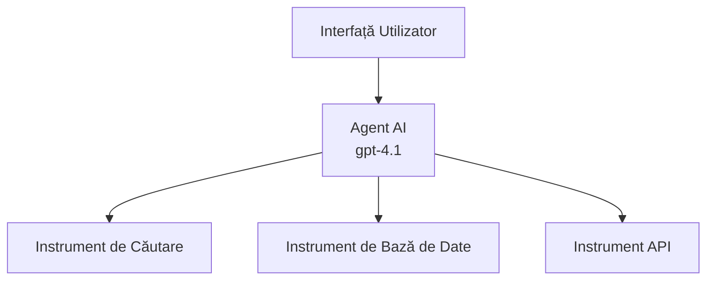
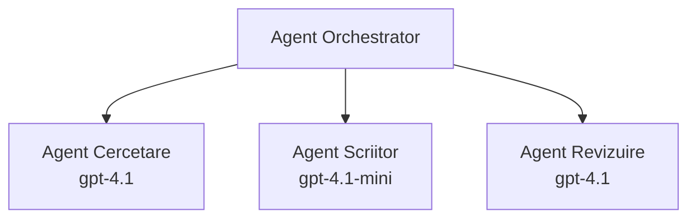

# Agenți AI cu Azure Developer CLI

**Navigare capitole:**
- **📚 Acasă curs**: [AZD Pentru Începători](../../README.md)
- **📖 Capitol curent**: Capitolul 2 - Dezvoltare AI-First
- **⬅️ Anterior**: [Integrare Microsoft Foundry](microsoft-foundry-integration.md)
- **➡️ Următor**: [Implementarea Modelului AI](ai-model-deployment.md)
- **🚀 Avansat**: [Soluții Multi-Agent](../../examples/retail-scenario.md)

---

## Introducere

Agenții AI sunt programe autonome care pot percepe mediul înconjurător, lua decizii și lua măsuri pentru a atinge obiective specifice. Spre deosebire de chatbot-uri simple care răspund la solicitări, agenții pot:

- **Folosi instrumente** - Apela API-uri, căuta în baze de date, executa cod
- **Planifica și raționa** - Împărți sarcini complexe în etape
- **Învăța din context** - Menține memorie și adaptează comportamentul
- **Colabora** - Lucra cu alți agenți (sisteme multi-agent)

Acest ghid îți arată cum să implementezi agenți AI în Azure folosind Azure Developer CLI (azd).

## Obiective de Învățare

Parcurgând acest ghid, vei:
- Înțelege ce sunt agenții AI și cum se diferențiază de chatbot-uri
- Implementa șabloane de agenți AI pre-construiți folosind AZD
- Configura Foundry Agents pentru agenți personalizați
- Implementa modele de bază pentru agenți (folosirea instrumentelor, RAG, multi-agent)
- Monitoriza și depanam agenți implementați

## Rezultate de Învățare

La final, vei putea:
- Implementa aplicații cu agenți AI în Azure cu o singură comandă
- Configura instrumentele și capabilitățile agentului
- Implementa generare augmentată prin recuperare (RAG) cu agenți
- Proiecta arhitecturi multi-agent pentru fluxuri de lucru complexe
- Depana probleme comune în implementarea agenților

---

## 🤖 Ce face un agent diferit față de un chatbot?

| Caracteristică | Chatbot | Agent AI |
|----------------|---------|----------|
| **Comportament** | Răspunde la solicitări | Ia acțiuni autonome |
| **Instrumente** | Niciunul | Poate apela API-uri, căuta, executa cod |
| **Memorie** | Doar pe sesiune | Memorie persistentă între sesiuni |
| **Planificare** | Răspuns simplu | Raționament în mai mulți pași |
| **Colaborare** | Entitate unică | Poate lucra cu alți agenți |

### Analog simplu

- **Chatbot** = O persoană de ajutor care răspunde întrebărilor la un birou de informații
- **Agent AI** = Un asistent personal care poate face apeluri, programa întâlniri și realiza sarcini pentru tine

---

## 🚀 Început rapid: Implementarea primului tău agent

### Opțiunea 1: Șablon Foundry Agents (Recomandat)

```bash
# Inițializează șablonul agenților AI
azd init --template get-started-with-ai-agents

# Desfășoară pe Azure
azd up
```

**Ce se implementează:**
- ✅ Foundry Agents
- ✅ Modele Microsoft Foundry (gpt-4.1)
- ✅ Azure AI Search (pentru RAG)
- ✅ Azure Container Apps (interfață web)
- ✅ Application Insights (monitorizare)

**Timp:** ~15-20 minute
**Cost:** ~$100-150/lună (dezvoltare)

### Opțiunea 2: Agent OpenAI cu Prompty

```bash
# Inițializează șablonul agentului bazat pe Prompty
azd init --template agent-openai-python-prompty

# Desfășoară pe Azure
azd up
```

**Ce se implementează:**
- ✅ Azure Functions (execuție agent serverless)
- ✅ Modele Microsoft Foundry
- ✅ Fișiere de configurare Prompty
- ✅ Implementare exemplu agent

**Timp:** ~10-15 minute
**Cost:** ~$50-100/lună (dezvoltare)

### Opțiunea 3: Agent Chat RAG

```bash
# Inițializează șablonul de chat RAG
azd init --template azure-search-openai-demo

# Implementare pe Azure
azd up
```

**Ce se implementează:**
- ✅ Modele Microsoft Foundry
- ✅ Azure AI Search cu date exemplu
- ✅ Pipeline de procesare documente
- ✅ Interfață chat cu citări

**Timp:** ~15-25 minute
**Cost:** ~$80-150/lună (dezvoltare)

### Opțiunea 4: AZD AI Agent Init (Bazat pe Manifest)

Dacă ai un fișier manifest pentru agent, poți folosi comanda `azd ai` pentru a genera un proiect Foundry Agent Service direct:

```bash
# Instalează extensia agenților AI
azd extension install azure.ai.agents

# Inițializează dintr-un manifest de agent
azd ai agent init -m agent-manifest.yaml

# Distribuie pe Azure
azd up
```

**Când să folosești `azd ai agent init` vs `azd init --template`:**

| Abordare | Cea mai bună pentru | Cum Funcționează |
|----------|---------------------|------------------|
| `azd init --template` | Pornind de la o aplicație exemplu funcțională | Clonează un repo complet cu cod + infrastructură |
| `azd ai agent init -m` | Construind de la propriul manifest agent | Generează structura proiectului din definiția agentului |

> **Sfat:** Folosește `azd init --template` când înveți (Opțiunile 1-3 de mai sus). Folosește `azd ai agent init` când construiești agenți de producție cu propriile manifeste. Vezi [Comenzi AZD AI CLI](../chapter-08-production/production-ai-practices.md#azd-ai-cli-commands-and-extensions) pentru referință completă.

---

## 🏗️ Modele de Arhitectură pentru Agenți

### Model 1: Agent unic cu instrumente

Cel mai simplu model de agent - un agent care poate folosi mai multe instrumente.


**Potrivit pentru:**
- Boți suport clienți
- Asistenți de cercetare
- Agenți de analiză date

**Șablon AZD:** `azure-search-openai-demo`

### Model 2: Agent RAG (Generare augmentată prin recuperare)

Un agent care recuperează documente relevante înainte de a genera răspunsuri.


**Potrivit pentru:**
- Baze de cunoștințe enterprise
- Sisteme Q&A pentru documente
- Cercetare juridică și conformitate

**Șablon AZD:** `azure-search-openai-demo`

### Model 3: Sistem Multi-Agent

Mai mulți agenți specializați care lucrează împreună la sarcini complexe.


**Potrivit pentru:**
- Generare de conținut complex
- Fluxuri de lucru în mai mulți pași
- Sarcini ce necesită expertize diverse

**Află mai mult:** [Modele de coordonare multi-agent](../chapter-06-pre-deployment/coordination-patterns.md)

---

## ⚙️ Configurarea Instrumentelor Agentului

Agenții devin puternici când pot folosi instrumente. Iată cum să configurezi instrumentele comune:

### Configurarea Instrumentelor în Foundry Agents

```python
# agent_config.py
from azure.ai.projects import AIProjectClient
from azure.ai.projects.models import FunctionTool, CodeInterpreterTool

# Definește unelte personalizate
search_tool = FunctionTool(
    name="search_knowledge_base",
    description="Search the company knowledge base for relevant documents",
    parameters={
        "type": "object",
        "properties": {
            "query": {
                "type": "string",
                "description": "The search query"
            }
        },
        "required": ["query"]
    }
)

# Creează agent cu unelte
agent = project_client.agents.create_agent(
    model="gpt-4.1",
    name="Support Agent",
    instructions="You are a helpful support agent. Use the search tool to find relevant information.",
    tools=[search_tool, CodeInterpreterTool()]
)
```

### Configurarea Mediului

```bash
# Configurează variabilele de mediu specifice agentului
azd env set AZURE_OPENAI_MODEL "gpt-4.1"
azd env set AGENT_INSTRUCTIONS "You are a helpful assistant..."
azd env set ENABLE_CODE_INTERPRETER "true"
azd env set ENABLE_FILE_SEARCH "true"

# Distribuie cu configurația actualizată
azd deploy
```

---

## 📊 Monitorizarea Agenților

### Integrarea Application Insights

Toate șabloanele AZD pentru agenți includ Application Insights pentru monitorizare:

```bash
# Deschideți panoul de monitorizare
azd monitor --overview

# Vizualizați jurnalele în timp real
azd monitor --logs

# Vizualizați metricile în timp real
azd monitor --live
```

### Metrice Cheie de Urmărit

| Metrică | Descriere | Țintă |
|---------|------------|-------|
| Latenta răspunsului | Timpul pentru generare răspuns | < 5 secunde |
| Utilizare tokeni | Tokeni per cerere | Monitorizare cost |
| Rata succes apel instrument | % execuții ale instrumentelor reușite | > 95% |
| Rata erorilor | Cereri agent eșuate | < 1% |
| Satisfacția utilizatorului | Scoruri feedback | > 4.0/5.0 |

### Logging personalizat pentru agenți

```python
import os
from azure.monitor.opentelemetry import configure_azure_monitor
from opentelemetry import trace

# Configurați Azure Monitor cu OpenTelemetry
configure_azure_monitor(
    connection_string=os.environ["APPLICATIONINSIGHTS_CONNECTION_STRING"]
)

tracer = trace.get_tracer(__name__)

def log_agent_interaction(user_query, agent_response, tools_used, latency_ms):
    with tracer.start_as_current_span("agent_interaction") as span:
        span.set_attributes({
            "user_query": user_query,
            "response_length": len(agent_response),
            "tools_used": tools_used,
            "latency_ms": latency_ms
        })
```

> **Notă:** Instalează pachetele necesare: `pip install azure-monitor-opentelemetry opentelemetry`

---

## 💰 Considerații legate de costuri

### Costuri lunare estimate pe model

| Model | Mediu Dev | Producție |
|-------|-----------|-----------|
| Agent unic | $50-100 | $200-500 |
| Agent RAG | $80-150 | $300-800 |
| Multi-Agent (2-3 agenți) | $150-300 | $500-1,500 |
| Multi-Agent Enterprise | $300-500 | $1,500-5,000+ |

### Sfaturi pentru optimizarea costurilor

1. **Folosește gpt-4.1-mini pentru sarcini simple**
   ```bash
   azd env set AZURE_OPENAI_MODEL "gpt-4.1-mini"
   ```

2. **Implementează caching pentru întrebările repetate**
   ```python
   from functools import lru_cache
   
   @lru_cache(maxsize=1000)
   def get_cached_response(query_hash):
       return agent.run(query_hash)
   ```

3. **Setează limite de tokeni pe execuție**
   ```python
   # Setează max_completion_tokens când rulezi agentul, nu în timpul creării
   run = project_client.agents.create_run(
       thread_id=thread.id,
       agent_id=agent.id,
       max_completion_tokens=1000  # Limitează lungimea răspunsului
   )
   ```

4. **Scalează la zero când nu este folosit**
   ```bash
   # Container Apps se scalează automat la zero
   azd env set MIN_REPLICAS "0"
   ```

---

## 🔧 Rezolvare probleme agenți

### Probleme comune și soluții

<details>
<summary><strong>❌ Agentul nu răspunde la apelurile instrumentelor</strong></summary>

```bash
# Verificați dacă uneltele sunt înregistrate corect
azd show

# Verificați implementarea OpenAI
az cognitiveservices account deployment list \
  --name $AZURE_OPENAI_NAME \
  --resource-group $RG_NAME

# Verificați jurnalul agentului
azd monitor --logs
```

**Cauze comune:**
- Semnătura funcției instrumentului nu se potrivește
- Permisiuni lipsă necesare
- Endpoint API inaccesibil
</details>

<details>
<summary><strong>❌ Răspunsuri cu latență ridicată ale agentului</strong></summary>

```bash
# Verificați Application Insights pentru blocaje
azd monitor --live

# Luați în considerare utilizarea unui model mai rapid
azd env set AZURE_OPENAI_MODEL "gpt-4.1-mini"
azd deploy
```

**Sfaturi de optimizare:**
- Folosește răspunsuri în streaming
- Implementează caching pentru răspunsuri
- Redu dimensiunea ferestrei de context
</details>

<details>
<summary><strong>❌ Agentul returnează informații incorecte sau halucinate</strong></summary>

```python
# Îmbunătățește cu prompturi de sistem mai bune
instructions = """
You are a helpful assistant. IMPORTANT:
- Only answer based on provided context
- If you don't know, say "I don't know"
- Always cite your sources
- Never make up information
"""

# Adaugă recuperare pentru ancorare
agent = project_client.agents.create_agent(
    model="gpt-4.1",
    instructions=instructions,
    tools=[FileSearchTool()]  # Ancorează răspunsurile în documente
)
```
</details>

<details>
<summary><strong>❌ Erori de depășire a limitei de tokeni</strong></summary>

```python
# Implementați gestionarea ferestrei contextuale
def truncate_context(messages, max_tokens=8000, model="gpt-4.1"):
    """Keep only recent messages within token limit."""
    import tiktoken
    encoding = tiktoken.encoding_for_model(model)
    total_tokens = 0
    truncated = []
    
    for msg in reversed(messages):
        msg_tokens = len(encoding.encode(msg.content))
        if total_tokens + msg_tokens > max_tokens:
            break
        truncated.insert(0, msg)
        total_tokens += msg_tokens
    
    return truncated
```
</details>

---

## 🎓 Exerciții practice

### Exercițiul 1: Implementarea unui agent de bază (20 minute)

**Obiectiv:** Să implementezi primul tău agent AI folosind AZD

```bash
# Pasul 1: Inițializează șablonul
azd init --template get-started-with-ai-agents

# Pasul 2: Autentificare în Azure
azd auth login

# Pasul 3: Implementare
azd up

# Pasul 4: Testează agentul
# Ieșirea așteptată după implementare:
#   Implementare finalizată!
#   Endpoint: https://<app-name>.<region>.azurecontainerapps.io
# Deschide URL-ul afișat în ieșire și încearcă să pui o întrebare

# Pasul 5: Vizualizează monitorizarea
azd monitor --overview

# Pasul 6: Curățare
azd down --force --purge
```

**Criterii de succes:**
- [ ] Agentul răspunde la întrebări
- [ ] Poate accesa dashboard-ul de monitorizare prin `azd monitor`
- [ ] Resursele sunt curățate cu succes

### Exercițiul 2: Adaugă un instrument personalizat (30 minute)

**Obiectiv:** Extinde un agent cu un instrument personalizat

1. Implementează șablonul agentului:
   ```bash
   azd init --template get-started-with-ai-agents
   azd up
   ```
2. Creează o nouă funcție pentru un instrument în codul agentului:
   ```python
   def get_weather(location: str) -> str:
       """Get current weather for a location."""
       # Apel API către serviciul meteo
       return f"Weather in {location}: Sunny, 72°F"
   ```
3. Înregistrează instrumentul cu agentul:
   ```python
   from azure.ai.projects.models import FunctionTool

   weather_tool = FunctionTool(
       name="get_weather",
       description="Get current weather for a location",
       parameters={
           "type": "object",
           "properties": {
               "location": {"type": "string", "description": "City name"}
           },
           "required": ["location"]
       }
   )

   agent = project_client.agents.create_agent(
       model="gpt-4.1",
       name="Weather Agent",
       tools=[weather_tool]
   )
   ```
4. Reimplementează și testează:
   ```bash
   azd deploy
   # Întreabă: "Cum este vremea în Seattle?"
   # Așteptat: Agentul apelează get_weather("Seattle") și returnează informații despre vreme
   ```

**Criterii de succes:**
- [ ] Agentul recunoaște întrebări legate de vreme
- [ ] Instrumentul este apelat corect
- [ ] Răspunsul include informații despre vreme

### Exercițiul 3: Construiește un agent RAG (45 minute)

**Obiectiv:** Creează un agent care răspunde la întrebări din documentele tale

```bash
# Pasul 1: Desfășurați șablonul RAG
azd init --template azure-search-openai-demo
azd up

# Pasul 2: Încărcați documentele dvs.
# Plasați fișiere PDF/TXT în directorul data/, apoi rulați:
python scripts/prepdocs.py

# Pasul 3: Testați cu întrebări specifice domeniului
# Deschideți URL-ul aplicației web din ieșirea azd up
# Puneți întrebări despre documentele încărcate
# Răspunsurile ar trebui să includă referințe de citare precum [doc.pdf]
```

**Criterii de succes:**
- [ ] Agentul răspunde din documentele încărcate
- [ ] Răspunsurile includ citări
- [ ] Nu apar halucinații pentru întrebări în afara domeniului

---

## 📚 Pași următori

Acum că ai înțeles agenții AI, explorează aceste subiecte avansate:

| Subiect | Descriere | Link |
|---------|------------|------|
| **Sisteme Multi-Agent** | Construiește sisteme cu mai mulți agenți colaborativi | [Exemplu Multi-Agent Retail](../../examples/retail-scenario.md) |
| **Modele de coordonare** | Învață modele de orchestrare și comunicare | [Modele de Coord.](../chapter-06-pre-deployment/coordination-patterns.md) |
| **Implementare în producție** | Implementarea agenților pregătiți pentru enterprise | [Practici AI în Producție](../chapter-08-production/production-ai-practices.md) |
| **Evaluarea agenților** | Testează și evaluează performanța agenților | [Depanare AI](../chapter-07-troubleshooting/ai-troubleshooting.md) |
| **Laborator AI Workshop** | Hands-on: Pregătește soluția ta AI pentru AZD | [Laborator AI Workshop](ai-workshop-lab.md) |

---

## 📖 Resurse suplimentare

### Documentație oficială
- [Azure AI Agent Service](https://learn.microsoft.com/azure/ai-services/agents/)
- [Azure AI Foundry Agent Service Quickstart](https://learn.microsoft.com/azure/ai-services/agents/quickstart)
- [Semantic Kernel Agent Framework](https://learn.microsoft.com/semantic-kernel/)

### Șabloane AZD pentru agenți
- [Începe cu agenții AI](https://github.com/Azure-Samples/get-started-with-ai-agents)
- [Agent OpenAI Python Prompty](https://github.com/Azure-Samples/agent-openai-python-prompty)
- [Demo Azure Search OpenAI](https://github.com/Azure-Samples/azure-search-openai-demo)

### Resurse comunitare
- [Awesome AZD - Șabloane pentru agenți](https://azure.github.io/awesome-azd/?tags=ai-agents)
- [Azure AI Discord](https://discord.gg/microsoft-azure)
- [Microsoft Foundry Discord](https://discord.gg/nTYy5BXMWG)

### Abilități agent pentru editorul tău
- [**Abilități Microsoft Azure Agent**](https://skills.sh/microsoft/github-copilot-for-azure) - Instalează abilități reutilizabile pentru agenți AI Azure în GitHub Copilot, Cursor sau orice agent suportat. Include abilități pentru [Azure AI](https://skills.sh/microsoft/github-copilot-for-azure/azure-ai), [Microsoft Foundry](https://skills.sh/microsoft/github-copilot-for-azure/microsoft-foundry), [implementare](https://skills.sh/microsoft/github-copilot-for-azure/azure-deploy) și [diagnosticare](https://skills.sh/microsoft/github-copilot-for-azure/azure-diagnostics):
  ```bash
  npx skills add microsoft/github-copilot-for-azure
  ```

---

**Navigare**
- **Lecția anterioară**: [Integrare Microsoft Foundry](microsoft-foundry-integration.md)
- **Lecția următoare**: [Implementarea Modelului AI](ai-model-deployment.md)

---

<!-- CO-OP TRANSLATOR DISCLAIMER START -->
**Declinare a responsabilității**:  
Acest document a fost tradus folosind serviciul de traducere AI [Co-op Translator](https://github.com/Azure/co-op-translator). Deși ne străduim pentru acuratețe, vă rugăm să rețineți că traducerile automate pot conține erori sau inexactități. Documentul original, în limba sa nativă, trebuie considerat sursa autorizată. Pentru informații critice, se recomandă traducerea profesională realizată de un specialist uman. Nu ne asumăm răspunderea pentru eventualele neînțelegeri sau interpretări greșite rezultate din utilizarea acestei traduceri.
<!-- CO-OP TRANSLATOR DISCLAIMER END -->