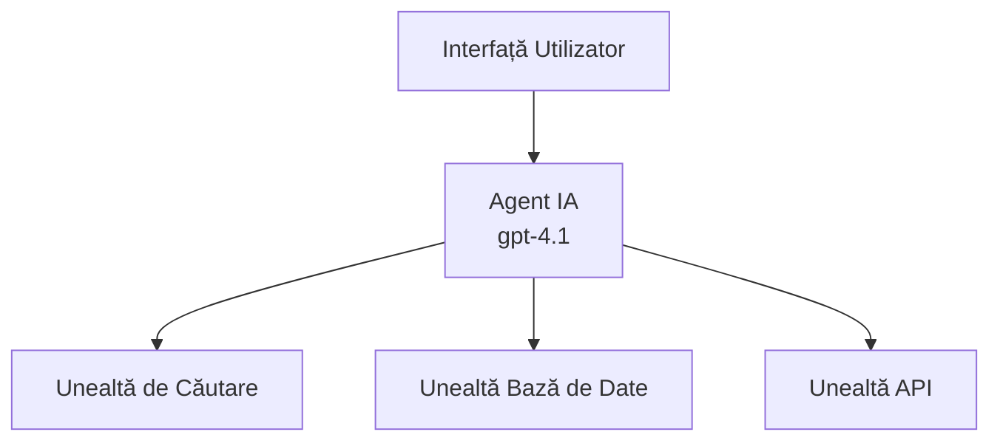
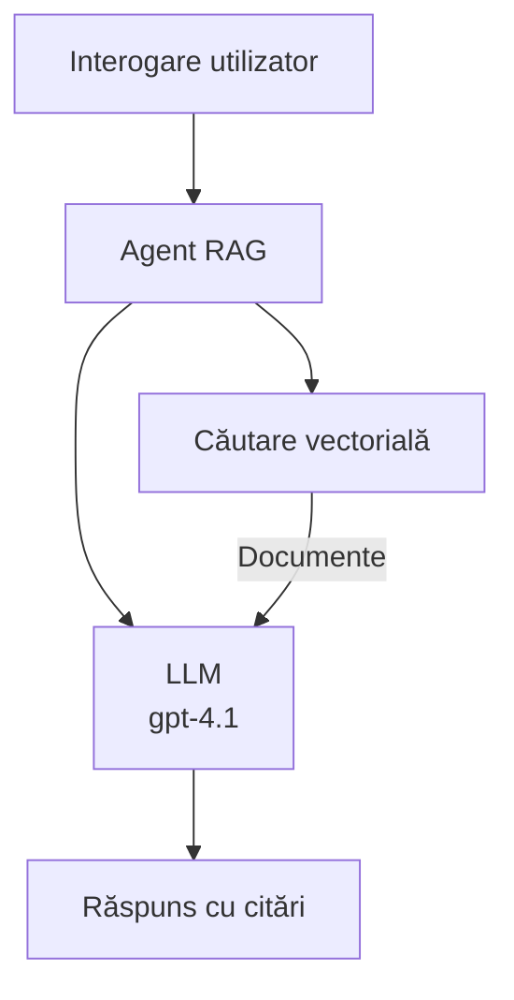
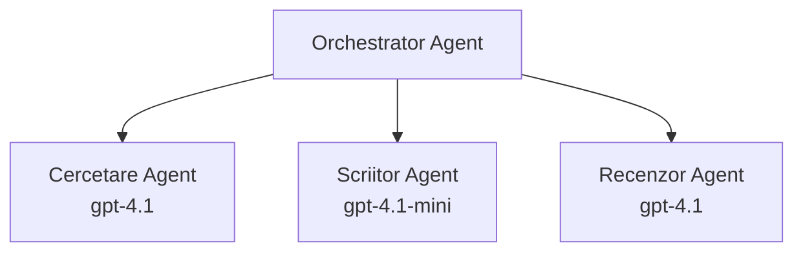

# Agenți AI cu Azure Developer CLI

**Navigare capitole:**
- **📚 Pagina cursului**: [AZD For Beginners](../../README.md)
- **📖 Capitolul curent**: Capitolul 2 - Dezvoltare orientată pe AI
- **⬅️ Anterior**: [Integrarea Microsoft Foundry](microsoft-foundry-integration.md)
- **➡️ Următor**: [Implementarea modelului AI](ai-model-deployment.md)
- **🚀 Avansat**: [Soluții multi-agent](../../examples/retail-scenario.md)

---

## Introducere

Agenții AI sunt programe autonome care pot percepe mediul, lua decizii și întreprinde acțiuni pentru a atinge obiective specifice. Spre deosebire de chatboții simpli care răspund la solicitări, agenții pot:

- **Folosește instrumente** - Apelare API-uri, căutare în baze de date, executare de cod
- **Planifică și raționează** - Împarte sarcini complexe în pași
- **Învăța din context** - Păstrează memorie și își adaptează comportamentul
- **Colaborează** - Lucrează cu alți agenți (sisteme multi-agent)

Acest ghid vă arată cum să implementați agenți AI în Azure folosind Azure Developer CLI (azd).

> **Notă de validare (2026-03-25):** Acest ghid a fost revizuit folosind `azd` `1.23.12` și `azure.ai.agents` `0.1.18-preview`. Experiența `azd ai` este încă în preview, așa că verificați ajutorul extensiei dacă flag-urile instalate diferă.

## Obiective de învățare

Parcurgând acest ghid, veți:
- Înțelegeți ce sunt agenții AI și cum se diferențiază de chatboți
- Implementați șabloane de agenți preconstruiți folosind AZD
- Configurați Agenții Foundry pentru agenți personalizați
- Implementați tipare de bază pentru agenți (utilizare instrumente, RAG, multi-agent)
- Monitorizați și depanați agenții implementați

## Rezultate ale învățării

La final, veți putea:
- Implementa aplicații cu agenți AI în Azure cu o singură comandă
- Configura instrumentele și capabilitățile agentului
- Implementa generare augmentată prin recuperare (RAG) cu agenți
- Proiecta arhitecturi multi-agent pentru fluxuri de lucru complexe
- Depana probleme comune la implementarea agenților

---

## 🤖 Ce face un agent diferit de un chatbot?

| Caracteristică | Chatbot | Agent AI |
|---------|---------|----------|
| **Comportament** | Răspunde la solicitări | Întreprinde acțiuni autonome |
| **Instrumente** | Niciunul | Poate apela API-uri, căuta, executa cod |
| **Memorie** | Doar pe sesiune | Memorie persistentă între sesiuni |
| **Planificare** | Răspuns unic | Raționament în mai mulți pași |
| **Colaborare** | Entitate unică | Poate colabora cu alți agenți |

### Analogie simplă

- **Chatbot** = O persoană de ajutor care răspunde la întrebări la un birou de informații
- **Agent AI** = Un asistent personal care poate efectua apeluri, programa întâlniri și finaliza sarcini pentru tine

---

## 🚀 Start rapid: Implementați primul agent

### Opțiunea 1: Șablon Foundry Agents (Recomandat)

```bash
# Inițializează șablonul agenților AI
azd init --template get-started-with-ai-agents

# Implementați în Azure
azd up
```

**Ce se implementează:**
- ✅ Foundry Agents
- ✅ Microsoft Foundry Models (gpt-4.1)
- ✅ Azure AI Search (pentru RAG)
- ✅ Azure Container Apps (interfață web)
- ✅ Application Insights (monitorizare)

**Timp:** ~15-20 minute
**Cost:** ~$100-150/lună (dezvoltare)

### Opțiunea 2: Agent OpenAI cu Prompty

```bash
# Inițializează șablonul agentului bazat pe Prompty
azd init --template agent-openai-python-prompty

# Desfășoară în Azure
azd up
```

**Ce se implementează:**
- ✅ Azure Functions (execuție agent serverless)
- ✅ Microsoft Foundry Models
- ✅ Fișiere de configurare Prompty
- ✅ Implementare exemplu agent

**Timp:** ~10-15 minute
**Cost:** ~$50-100/lună (dezvoltare)

### Opțiunea 3: Agent Chat RAG

```bash
# Inițializați șablonul de chat RAG
azd init --template azure-search-openai-demo

# Implementați în Azure
azd up
```

**Ce se implementează:**
- ✅ Microsoft Foundry Models
- ✅ Azure AI Search cu date de exemplu
- ✅ Pipeline de procesare a documentelor
- ✅ Interfață de chat cu citări

**Timp:** ~15-25 minute
**Cost:** ~$80-150/lună (dezvoltare)

### Opțiunea 4: AZD AI Agent Init (Previzualizare bazată pe manifest sau șablon)

Dacă aveți un fișier manifest al agentului, puteți folosi comanda `azd ai` pentru a crea un proiect Foundry Agent Service direct. Versiunile recente din preview au adăugat și suport pentru inițializare bazată pe șabloane, astfel încât fluxul exact de solicitări poate varia ușor în funcție de versiunea extensiei instalate.

```bash
# Instalează extensia agenților AI
azd extension install azure.ai.agents

# Opțional: verifică versiunea de previzualizare instalată
azd extension show azure.ai.agents

# Inițializează dintr-un manifest al agentului
azd ai agent init -m agent-manifest.yaml

# Desfășoară în Azure
azd up
```

**Când să folosiți `azd ai agent init` vs `azd init --template`:**

| Abordare | Potrivit pentru | Cum funcționează |
|----------|----------|------|
| `azd init --template` | Pornire de la o aplicație exemplu funcțională | Clonează un repo de șablon complet cu cod + infrastructură |
| `azd ai agent init -m` | Construire din propriul fișier manifest al agentului | Schițează structura proiectului din definiția agentului |

> **Sfat:** Folosiți `azd init --template` când învățați (Opțiunile 1-3 de mai sus). Folosiți `azd ai agent init` când construiți agenți pentru producție cu propriile manifeste. Consultați [Comenzi AZD AI CLI](../chapter-08-production/production-ai-practices.md#azd-ai-cli-commands-and-extensions) pentru referință completă.

---

## 🏗️ Modele de arhitectură ale agenților

### Model 1: Agent unic cu instrumente

Cel mai simplu model de agent - un agent care poate folosi mai multe instrumente.


**Potrivit pentru:**
- Boți de suport pentru clienți
- Asistenți de cercetare
- Agenți de analiză a datelor

**Șablon AZD:** `azure-search-openai-demo`

### Model 2: Agent RAG (Generare augmentată prin recuperare)

Un agent care recuperează documente relevante înainte de a genera răspunsuri.


**Potrivit pentru:**
- Bazele de cunoștințe enterprise
- Sisteme de întrebări și răspunsuri pe documente
- Cercetare juridică și conformitate

**Șablon AZD:** `azure-search-openai-demo`

### Model 3: Sistem multi-agent

Mai mulți agenți specializați care lucrează împreună la sarcini complexe.


**Potrivit pentru:**
- Generare de conținut complex
- Fluxuri de lucru în mai mulți pași
- Sarcini care necesită expertiză diferită

**Aflați mai multe:** [Modele de coordonare multi-agent](../chapter-06-pre-deployment/coordination-patterns.md)

---

## ⚙️ Configurarea instrumentelor agenților

Agenții devin puternici atunci când pot folosi instrumente. Iată cum să configurați instrumentele comune:

### Configurarea instrumentelor în Foundry Agents

```python
# agent_config.py
from azure.ai.projects import AIProjectClient
from azure.ai.projects.models import FunctionTool, CodeInterpreterTool

# Defineți instrumente personalizate
search_tool = FunctionTool(
    name="search_knowledge_base",
    description="Search the company knowledge base for relevant documents",
    parameters={
        "type": "object",
        "properties": {
            "query": {
                "type": "string",
                "description": "The search query"
            }
        },
        "required": ["query"]
    }
)

# Creați un agent cu instrumente
agent = project_client.agents.create_agent(
    model="gpt-4.1",
    name="Support Agent",
    instructions="You are a helpful support agent. Use the search tool to find relevant information.",
    tools=[search_tool, CodeInterpreterTool()]
)
```

### Configurarea mediului

```bash
# Configurează variabilele de mediu specifice agentului
azd env set AZURE_OPENAI_MODEL "gpt-4.1"
azd env set AGENT_INSTRUCTIONS "You are a helpful assistant..."
azd env set ENABLE_CODE_INTERPRETER "true"
azd env set ENABLE_FILE_SEARCH "true"

# Desfășoară cu configurația actualizată
azd deploy
```

---

## 📊 Monitorizarea agenților

### Integrarea Application Insights

Toate șabloanele agent AZD includ Application Insights pentru monitorizare:

```bash
# Deschide panoul de monitorizare
azd monitor --overview

# Vizualizează jurnalele în timp real
azd monitor --logs

# Vizualizează metricele în timp real
azd monitor --live
```

### Metrice cheie de urmărit

| Metrică | Descriere | Țintă |
|--------|-------------|--------|
| Latenta răspunsului | Timp pentru generarea răspunsului | < 5 secunde |
| Utilizare tokeni | Tokeni per cerere | Monitorizați pentru cost |
| Rata de succes a apelurilor către instrumente | % de execuții reușite ale instrumentelor | > 95% |
| Rata erorilor | Cereri agent eșuate | < 1% |
| Satisfacția utilizatorilor | Scoruri de feedback | > 4.0/5.0 |

### Logare personalizată pentru agenți

```python
import os
from azure.monitor.opentelemetry import configure_azure_monitor
from opentelemetry import trace

# Configurează Azure Monitor cu OpenTelemetry
configure_azure_monitor(
    connection_string=os.environ["APPLICATIONINSIGHTS_CONNECTION_STRING"]
)

tracer = trace.get_tracer(__name__)

def log_agent_interaction(user_query, agent_response, tools_used, latency_ms):
    with tracer.start_as_current_span("agent_interaction") as span:
        span.set_attributes({
            "user_query": user_query,
            "response_length": len(agent_response),
            "tools_used": tools_used,
            "latency_ms": latency_ms
        })
```

> **Notă:** Instalați pachetele necesare: `pip install azure-monitor-opentelemetry opentelemetry`

---

## 💰 Considerații privind costurile

### Costuri lunare estimate pe model

| Model | Mediu de dezvoltare | Producție |
|---------|-----------------|------------|
| Agent unic | $50-100 | $200-500 |
| Agent RAG | $80-150 | $300-800 |
| Multi-agent (2-3 agenți) | $150-300 | $500-1,500 |
| Multi-agent enterprise | $300-500 | $1,500-5,000+ |

### Sfaturi pentru optimizarea costurilor

1. **Folosiți gpt-4.1-mini pentru sarcini simple**
   ```bash
   azd env set AZURE_OPENAI_MODEL "gpt-4.1-mini"
   ```

2. **Implementați cache pentru interogări repetate**
   ```python
   from functools import lru_cache
   
   @lru_cache(maxsize=1000)
   def get_cached_response(query_hash):
       return agent.run(query_hash)
   ```

3. **Stabiliți limite de tokeni per execuție**
   ```python
   # Setați max_completion_tokens când rulați agentul, nu în timpul creării
   run = project_client.agents.create_run(
       thread_id=thread.id,
       agent_id=agent.id,
       max_completion_tokens=1000  # Limitați lungimea răspunsului
   )
   ```

4. **Scalare la zero când nu sunt utilizate**
   ```bash
   # Container Apps se scalează automat la zero
   azd env set MIN_REPLICAS "0"
   ```

---

## 🔧 Depanarea agenților

### Probleme comune și soluții

<details>
<summary><strong>❌ Agentul nu răspunde la apelurile către instrumente</strong></summary>

```bash
# Verifică dacă instrumentele sunt înregistrate corespunzător
azd show

# Verifică implementarea OpenAI
az cognitiveservices account deployment list \
  --name $AZURE_OPENAI_NAME \
  --resource-group $RG_NAME

# Verifică jurnalele agentului
azd monitor --logs
```

**Cauze comune:**
- Semnătura funcției instrumentului nu se potrivește
- Lipsesc permisiunile necesare
- Endpoint API inaccesibil
</details>

<details>
<summary><strong>❌ Latență mare în răspunsurile agentului</strong></summary>

```bash
# Verificați Application Insights pentru blocaje
azd monitor --live

# Luați în considerare utilizarea unui model mai rapid
azd env set AZURE_OPENAI_MODEL "gpt-4.1-mini"
azd deploy
```

**Sfaturi de optimizare:**
- Folosiți răspunsuri streaming
- Implementați cache pentru răspunsuri
- Reduceți dimensiunea ferestrei de context
</details>

<details>
<summary><strong>❌ Agentul returnează informații incorecte sau halucinate</strong></summary>

```python
# Îmbunătățește prin prompturi de sistem mai bune
instructions = """
You are a helpful assistant. IMPORTANT:
- Only answer based on provided context
- If you don't know, say "I don't know"
- Always cite your sources
- Never make up information
"""

# Adaugă recuperare pentru fundamentare
agent = project_client.agents.create_agent(
    model="gpt-4.1",
    instructions=instructions,
    tools=[FileSearchTool()]  # Ancorează răspunsurile în documente
)
```
</details>

<details>
<summary><strong>❌ Erori de depășire a limitei de tokeni</strong></summary>

```python
# Implementează gestionarea ferestrei de context
def truncate_context(messages, max_tokens=8000, model="gpt-4.1"):
    """Keep only recent messages within token limit."""
    import tiktoken
    encoding = tiktoken.encoding_for_model(model)
    total_tokens = 0
    truncated = []
    
    for msg in reversed(messages):
        msg_tokens = len(encoding.encode(msg.content))
        if total_tokens + msg_tokens > max_tokens:
            break
        truncated.insert(0, msg)
        total_tokens += msg_tokens
    
    return truncated
```
</details>

---

## 🎓 Exerciții practice

### Exercițiul 1: Implementați un agent de bază (20 minute)

**Scop:** Implementați primul dvs. agent AI folosind AZD

```bash
# Pasul 1: Inițializați șablonul
azd init --template get-started-with-ai-agents

# Pasul 2: Conectați-vă la Azure
azd auth login
# Dacă lucrați în mai mulți tenanți, adăugați --tenant-id <tenant-id>

# Pasul 3: Implementați
azd up

# Pasul 4: Testați agentul
# Rezultatul așteptat după implementare:
#   Implementare finalizată!
#   Punct de acces: https://<app-name>.<region>.azurecontainerapps.io
# Deschideți URL-ul afișat în ieșire și încercați să puneți o întrebare

# Pasul 5: Vizualizați monitorizarea
azd monitor --overview

# Pasul 6: Curățați resursele
azd down --force --purge
```

**Criterii de succes:**
- [ ] Agentul răspunde la întrebări
- [ ] Puteți accesa panoul de monitorizare prin `azd monitor`
- [ ] Resursele sunt curățate cu succes

### Exercițiul 2: Adăugați un instrument personalizat (30 minute)

**Scop:** Extindeți un agent cu un instrument personalizat

1. Implementați șablonul agentului:
   ```bash
   azd init --template get-started-with-ai-agents
   azd up
   ```
2. Creați o nouă funcție de instrument în codul agentului:
   ```python
   def get_weather(location: str) -> str:
       """Get current weather for a location."""
       # Apel API către serviciul meteo
       return f"Weather in {location}: Sunny, 72°F"
   ```
3. Înregistrați instrumentul cu agentul:
   ```python
   from azure.ai.projects.models import FunctionTool

   weather_tool = FunctionTool(
       name="get_weather",
       description="Get current weather for a location",
       parameters={
           "type": "object",
           "properties": {
               "location": {"type": "string", "description": "City name"}
           },
           "required": ["location"]
       }
   )

   agent = project_client.agents.create_agent(
       model="gpt-4.1",
       name="Weather Agent",
       tools=[weather_tool]
   )
   ```
4. Redeplasați și testați:
   ```bash
   azd deploy
   # Întreabă: "Care este vremea în Seattle?"
   # Așteptat: Agentul apelează get_weather("Seattle") și returnează informații despre vreme
   ```

**Criterii de succes:**
- [ ] Agentul recunoaște întrebări legate de vreme
- [ ] Instrumentul este apelat corect
- [ ] Răspunsul include informații despre vreme

### Exercițiul 3: Construiți un agent RAG (45 minute)

**Scop:** Creați un agent care răspunde la întrebări din documentele dvs.

```bash
# Pasul 1: Implementați șablonul RAG
azd init --template azure-search-openai-demo
azd up

# Pasul 2: Încărcați documentele
# Plasați fișiere PDF/TXT în directorul data/, apoi rulați:
python scripts/prepdocs.py

# Pasul 3: Testați cu întrebări specifice domeniului
# Deschideți adresa URL a aplicației web din rezultatul comenzii azd up
# Adresați întrebări despre documentele încărcate
# Răspunsurile ar trebui să includă referințe de citare precum [doc.pdf]
```

**Criterii de succes:**
- [ ] Agentul răspunde din documentele încărcate
- [ ] Răspunsurile includ citări
- [ ] Fără halucinații pentru întrebări în afara domeniului

---

## 📚 Pașii următori

Acum că înțelegeți agenții AI, explorați aceste subiecte avansate:

| Subiect | Descriere | Link |
|-------|-------------|------|
| **Sisteme multi-agent** | Construiți sisteme cu mai mulți agenți care colaborează | [Exemplu multi-agent retail](../../examples/retail-scenario.md) |
| **Modele de coordonare** | Învață modele de orchestrare și comunicare | [Modele de coordonare](../chapter-06-pre-deployment/coordination-patterns.md) |
| **Implementare în producție** | Implementare de agenți pregătită pentru mediul enterprise | [Practici AI pentru producție](../chapter-08-production/production-ai-practices.md) |
| **Evaluarea agenților** | Testați și evaluați performanța agenților | [Depanare AI](../chapter-07-troubleshooting/ai-troubleshooting.md) |
| **Lab de workshop AI** | Practic: Pregătiți soluția AI pentru AZD | [AI Workshop Lab](ai-workshop-lab.md) |

---

## 📖 Resurse suplimentare

### Documentație oficială
- [Azure AI Agent Service](https://learn.microsoft.com/azure/ai-services/agents/)
- [Azure AI Foundry Agent Service Quickstart](https://learn.microsoft.com/azure/ai-services/agents/quickstart)
- [Semantic Kernel Agent Framework](https://learn.microsoft.com/semantic-kernel/)

### Șabloane AZD pentru agenți
- [Get Started with AI Agents](https://github.com/Azure-Samples/get-started-with-ai-agents)
- [Agent OpenAI Python Prompty](https://github.com/Azure-Samples/agent-openai-python-prompty)
- [Azure Search OpenAI Demo](https://github.com/Azure-Samples/azure-search-openai-demo)

### Resurse comunitare
- [Awesome AZD - Agent Templates](https://azure.github.io/awesome-azd/?tags=ai-agents)
- [Azure AI Discord](https://discord.gg/microsoft-azure)
- [Microsoft Foundry Discord](https://discord.gg/nTYy5BXMWG)

### Abilități de agent pentru editorul dvs.
- [**Microsoft Azure Agent Skills**](https://skills.sh/microsoft/github-copilot-for-azure) - Instalați abilități reutilizabile pentru agenți AI pentru dezvoltarea Azure în GitHub Copilot, Cursor sau orice agent acceptat. Include abilități pentru [Azure AI](https://skills.sh/microsoft/github-copilot-for-azure/azure-ai), [Microsoft Foundry](https://skills.sh/microsoft/github-copilot-for-azure/microsoft-foundry), [implementare](https://skills.sh/microsoft/github-copilot-for-azure/azure-deploy), și [diagnosticare](https://skills.sh/microsoft/github-copilot-for-azure/azure-diagnostics):
  ```bash
  npx skills add microsoft/github-copilot-for-azure
  ```

---

**Navigare**
- **Lecția anterioară**: [Integrarea Microsoft Foundry](microsoft-foundry-integration.md)
- **Următoarea lecție**: [Implementarea modelului AI](ai-model-deployment.md)

---

<!-- CO-OP TRANSLATOR DISCLAIMER START -->
**Declinare de responsabilitate**:
Acest document a fost tradus folosind serviciul de traducere AI [Co-op Translator](https://github.com/Azure/co-op-translator). Deși ne străduim pentru acuratețe, vă rugăm să rețineți că traducerile automate pot conține erori sau inexactități. Documentul original în limba sa nativă trebuie considerat sursa autoritativă. Pentru informații critice, se recomandă traducerea profesională realizată de un traducător profesionist. Nu ne asumăm răspunderea pentru eventuale neînțelegeri sau interpretări eronate rezultând din utilizarea acestei traduceri.
<!-- CO-OP TRANSLATOR DISCLAIMER END -->