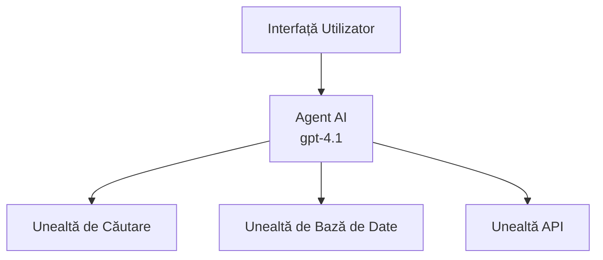
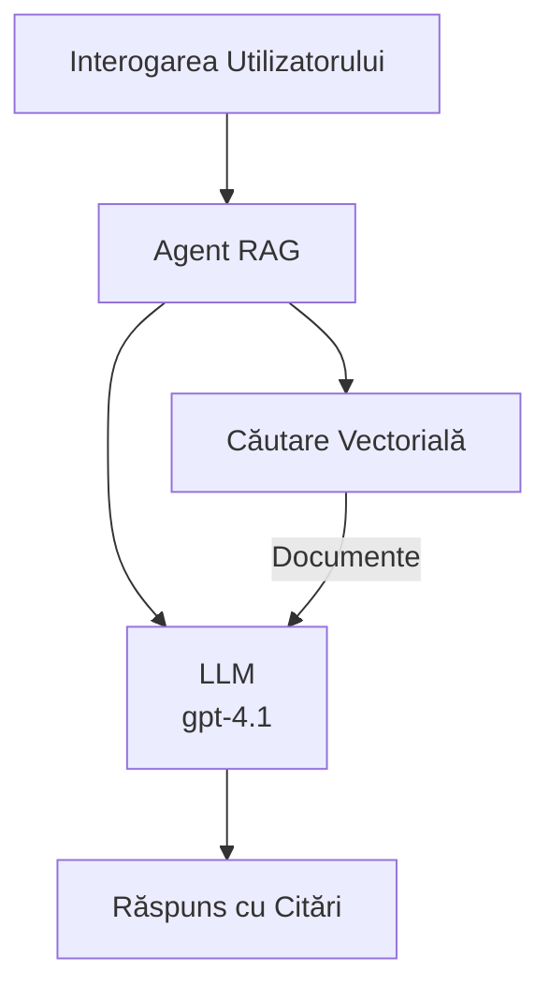
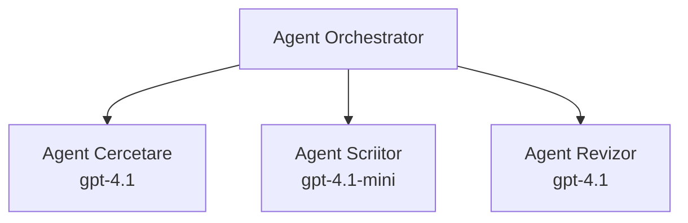

# Agenți AI cu Azure Developer CLI

**Navigare capitol:**
- **📚 Pagina principală curs**: [AZD Pentru Începători](../../README.md)
- **📖 Capitolul curent**: Capitolul 2 - Dezvoltare AI-First
- **⬅️ Anterior**: [Integrare Microsoft Foundry](microsoft-foundry-integration.md)
- **➡️ Următor**: [Implementarea Modelului AI](ai-model-deployment.md)
- **🚀 Avansat**: [Soluții Multi-Agent](../../examples/retail-scenario.md)

---

## Introducere

Agenții AI sunt programe autonome care pot percepe mediul înconjurător, pot lua decizii și pot întreprinde acțiuni pentru a atinge obiective specifice. Spre deosebire de chatbot-urile simple care răspund la comenzi, agenții pot:

- **Utiliza unelte** - Apelarea API-urilor, căutarea în baze de date, executarea codului
- **Planifica și raționa** - Împărțirea sarcinilor complexe în pași
- **Învăța din context** - Păstrarea memoriei și adaptarea comportamentului
- **Colabora** - Lucra împreună cu alți agenți (sisteme multi-agent)

Acest ghid vă arată cum să implementați agenți AI în Azure folosind Azure Developer CLI (azd).

> **Notă de validare (2026-03-25):** Acest ghid a fost revizuit conform versiunii `azd` `1.23.12` și `azure.ai.agents` `0.1.18-preview`. Experiența `azd ai` este încă în preview, deci verificați ajutorul extensiei dacă flag-urile instalate diferă.

## Obiective de învățare

Parcurgând acest ghid, veți:
- Înțelege ce sunt agenții AI și cum se diferențiază de chatbot-uri
- Implementa șabloane de agenți AI predefiniți folosind AZD
- Configura Foundry Agents pentru agenți personalizați
- Implementa modele de bază pentru agenți (utilizare unelte, RAG, multi-agent)
- Monitoriza și depana agenții implementați

## Rezultate de învățare

La final, veți putea:
- Implementa aplicații cu agenți AI pe Azure cu o singură comandă
- Configura uneltele și capabilitățile agenților
- Implementa generarea augmentată prin recuperare (RAG) cu agenți
- Proiecta arhitecturi multi-agent pentru fluxuri de lucru complexe
- Depana probleme comune în implementarea agenților

---

## 🤖 Ce face un agent diferit de un chatbot?

| Caracteristică | Chatbot | Agent AI |
|----------------|---------|----------|
| **Comportament** | Răspunde la comenzi | Ia acțiuni autonome |
| **Unelte** | Niciuna | Poate apela API-uri, căuta, executa cod |
| **Memorie** | Doar pe sesiune | Memorie persistentă între sesiuni |
| **Planificare** | Răspuns unic | Raționament în mai mulți pași |
| **Colaborare** | Entitate singulară | Poate lucra cu alți agenți |

### O analogie simplă

- **Chatbot** = O persoană de ajutor care răspunde la întrebări la un birou de informații
- **Agent AI** = Un asistent personal care poate face apeluri, programa întâlniri și finaliza sarcini pentru tine

---

## 🚀 Pornire rapidă: Implementați primul dvs. agent

### Opțiunea 1: Șablon Foundry Agents (Recomandat)

```bash
# Inițializează șablonul agenților AI
azd init --template get-started-with-ai-agents

# Desfășoară în Azure
azd up
```

**Ce se implementează:**
- ✅ Foundry Agents
- ✅ Modelele Microsoft Foundry (gpt-4.1)
- ✅ Azure AI Search (pentru RAG)
- ✅ Azure Container Apps (interfață web)
- ✅ Application Insights (monitorizare)

**Timp:** ~15-20 minute
**Cost:** ~$100-150/lună (dezvoltare)

### Opțiunea 2: Agent OpenAI cu Prompty

```bash
# Inițializează șablonul agentului bazat pe Prompty
azd init --template agent-openai-python-prompty

# Implementare pe Azure
azd up
```

**Ce se implementează:**
- ✅ Azure Functions (execuție serverless a agentului)
- ✅ Modelele Microsoft Foundry
- ✅ Fișiere de configurare Prompty
- ✅ Implementare exemplu agent

**Timp:** ~10-15 minute
**Cost:** ~$50-100/lună (dezvoltare)

### Opțiunea 3: Agent Chat RAG

```bash
# Inițializați șablonul de chat RAG
azd init --template azure-search-openai-demo

# Implementați pe Azure
azd up
```

**Ce se implementează:**
- ✅ Modelele Microsoft Foundry
- ✅ Azure AI Search cu date de exemplu
- ✅ Pipeline procesare documente
- ✅ Interfață chat cu citări

**Timp:** ~15-25 minute
**Cost:** ~$80-150/lună (dezvoltare)

### Opțiunea 4: AZD AI Agent Init (Preview pe bază de manifest sau șablon)

Dacă aveți un fișier manifest pentru agent, puteți folosi comanda `azd ai` pentru a crea direct un proiect Foundry Agent Service. Versiunile recente de preview au adăugat suport și pentru inițializarea pe bază de șablon, astfel că fluxul exact al promptului poate varia puțin în funcție de versiunea extensiei instalate.

```bash
# Instalează extensia agenților AI
azd extension install azure.ai.agents

# Opțional: verifică versiunea preview instalată
azd extension show azure.ai.agents

# Initializează dintr-un manifest al agentului
azd ai agent init -m agent-manifest.yaml

# Desfășoară în Azure
azd up

# Testează agentul desplegat (afișează latența + timpul până la primul byte)
azd ai agent invoke
```

**Când să folosiți `azd ai agent init` vs `azd init --template`:**

| Abordare | Cel mai potrivit | Cum funcționează |
|----------|------------------|------------------|
| `azd init --template` | Pornire de la o aplicație exemplu funcțională | Clonează un repo complet cu cod + infrastructură |
| `azd ai agent init -m` | Construire pornind de la propriul manifest al agentului | Creează structura proiectului din definiția agentului |

> **Sfat:** Folosiți `azd init --template` pentru învățare (Opțiunile 1-3 de mai sus). Folosiți `azd ai agent init` pentru agenți de producție cu propriile manifesțe.

După `azd up`, aceeași extensie vă ghidează prin restul ciclului de viață al agentului: `azd ai agent invoke` pentru testare, `azd ai agent eval generate` și `azd ai agent optimize` pentru măsurare și îmbunătățire, și `azd ai agent delete` pentru curățare. Consultați [Comenzile AZD AI CLI](../chapter-08-production/production-ai-practices.md#azd-ai-cli-commands-and-extensions) pentru referința completă.

---

## 🏗️ Modele de arhitectură pentru agenți

### Model 1: Agent unic cu unelte

Modelul cel mai simplu - un agent care poate folosi multiple unelte.



**Potrivit pentru:**
- Boți de suport clienți
- Asistenți de cercetare
- Agenți de analiză a datelor

**Șablon AZD:** `azure-search-openai-demo`

### Model 2: Agent RAG (Generare augmentată prin recuperare)

Un agent care recuperează documente relevante înainte de a genera răspunsuri.



**Potrivit pentru:**
- Baze de cunoștințe enterprise
- Sisteme de întrebări și răspunsuri pe documente
- Cercetare pentru conformitate și legalitate

**Șablon AZD:** `azure-search-openai-demo`

### Model 3: Sistem multi-agent

Mai mulți agenți specializați care lucrează împreună la sarcini complexe.



**Potrivit pentru:**
- Generare de conținut complexă
- Fluxuri de lucru în mai mulți pași
- Sarcini care necesită expertiză diversă

**Aflați mai multe:** [Modele de coordonare multi-agent](../chapter-06-pre-deployment/coordination-patterns.md)

---

## ⚙️ Configurarea uneltelor agenților

Agenții devin puternici când pot folosi unelte. Iată cum să configurați uneltele comune:

### Configurarea uneltelor în Foundry Agents

```python
# agent_config.py
from azure.ai.projects import AIProjectClient
from azure.ai.projects.models import FunctionTool, CodeInterpreterTool

# Definirea uneltelor personalizate
search_tool = FunctionTool(
    name="search_knowledge_base",
    description="Search the company knowledge base for relevant documents",
    parameters={
        "type": "object",
        "properties": {
            "query": {
                "type": "string",
                "description": "The search query"
            }
        },
        "required": ["query"]
    }
)

# Crearea agentului cu unelte
agent = project_client.agents.create_agent(
    model="gpt-4.1",
    name="Support Agent",
    instructions="You are a helpful support agent. Use the search tool to find relevant information.",
    tools=[search_tool, CodeInterpreterTool()]
)
```

### Configurarea mediului

```bash
# Configurează variabilele de mediu specifice agentului
azd env set AZURE_OPENAI_MODEL "gpt-4.1"
azd env set AGENT_INSTRUCTIONS "You are a helpful assistant..."
azd env set ENABLE_CODE_INTERPRETER "true"
azd env set ENABLE_FILE_SEARCH "true"

# Desfășoară cu configurația actualizată
azd deploy
```

---

## 📊 Monitorizarea agenților

### Integrarea Application Insights

Toate șabloanele AZD pentru agenți includ Application Insights pentru monitorizare:

```bash
# Deschideți panoul de monitorizare
azd monitor --overview

# Vizualizați jurnalele în timp real
azd monitor --logs

# Vizualizați metricile în timp real
azd monitor --live
```

### Metricas-cheie de urmărit

| Metrică | Descriere | Țintă |
|---------|-----------|-------|
| Latenta răspunsului | Timpul pentru generarea răspunsului | < 5 secunde |
| Utilizarea tokenilor | Tokeni per cerere | Monitorizați costurile |
| Rata de succes a apelurilor uneltelor | % execuții reușite | > 95% |
| Rata erorilor | Cereri eșuate ale agentului | < 1% |
| Satisfacția utilizatorului | Scoruri de feedback | > 4.0/5.0 |

### Logare personalizată pentru agenți

```python
import os
from azure.monitor.opentelemetry import configure_azure_monitor
from opentelemetry import trace

# Configurează Azure Monitor cu OpenTelemetry
configure_azure_monitor(
    connection_string=os.environ["APPLICATIONINSIGHTS_CONNECTION_STRING"]
)

tracer = trace.get_tracer(__name__)

def log_agent_interaction(user_query, agent_response, tools_used, latency_ms):
    with tracer.start_as_current_span("agent_interaction") as span:
        span.set_attributes({
            "user_query": user_query,
            "response_length": len(agent_response),
            "tools_used": tools_used,
            "latency_ms": latency_ms
        })
```

> **Notă:** Instalați pachetele necesare: `pip install azure-monitor-opentelemetry opentelemetry`

---

## 💰 Considerații privind costurile

### Costuri estimate lunare pe model

| Model | Mediu de dezvoltare | Producție |
|-------|--------------------|-----------|
| Agent unic | $50-100 | $200-500 |
| Agent RAG | $80-150 | $300-800 |
| Multi-agent (2-3 agenți) | $150-300 | $500-1,500 |
| Multi-agent enterprise | $300-500 | $1,500-5,000+ |

### Sfaturi pentru optimizarea costurilor

1. **Folosiți gpt-4.1-mini pentru sarcini simple**
   ```bash
   azd env set AZURE_OPENAI_MODEL "gpt-4.1-mini"
   ```

2. **Implementați caching pentru interogări repetate**
   ```python
   from functools import lru_cache
   
   @lru_cache(maxsize=1000)
   def get_cached_response(query_hash):
       return agent.run(query_hash)
   ```

3. **Stabiliți limite de tokeni per execuție**
   ```python
   # Setează max_completion_tokens când rulezi agentul, nu în timpul creării
   run = project_client.agents.create_run(
       thread_id=thread.id,
       agent_id=agent.id,
       max_completion_tokens=1000  # Limitează lungimea răspunsului
   )
   ```

4. **Dezpuneți la zero când nu sunt utilizate**
   ```bash
   # Aplicațiile Container se scalează automat la zero
   azd env set MIN_REPLICAS "0"
   ```

---

## 🔧 Depanarea agenților

### Probleme comune și soluții

<details>
<summary><strong>❌ Agentul nu răspunde la apelurile uneltelor</strong></summary>

```bash
# Verifică dacă instrumentele sunt înregistrate corect
azd show

# Verifică implementarea OpenAI
az cognitiveservices account deployment list \
  --name $AZURE_OPENAI_NAME \
  --resource-group $RG_NAME

# Verifică logurile agentului
azd monitor --logs
```

**Cauze comune:**
- Semnătura funcției uneltei nu corespunde
- Lipsă permisiuni necesare
- Endpoint API inaccesibil
</details>

<details>
<summary><strong>❌ Latenta mare în răspunsurile agentului</strong></summary>

```bash
# Verificați Application Insights pentru blocaje
azd monitor --live

# Luați în considerare utilizarea unui model mai rapid
azd env set AZURE_OPENAI_MODEL "gpt-4.1-mini"
azd deploy
```

**Sfaturi de optimizare:**
- Folosiți răspunsuri în streaming
- Implementați caching pentru răspunsuri
- Reduceți dimensiunea ferestrei de context
</details>

<details>
<summary><strong>❌ Agentul returnează informații incorecte sau halucinate</strong></summary>

```python
# Îmbunătățiți cu prompturi mai bune pentru sistem
instructions = """
You are a helpful assistant. IMPORTANT:
- Only answer based on provided context
- If you don't know, say "I don't know"
- Always cite your sources
- Never make up information
"""

# Adăugați recuperare pentru fundamentare
agent = project_client.agents.create_agent(
    model="gpt-4.1",
    instructions=instructions,
    tools=[FileSearchTool()]  # Fundamentați răspunsurile în documente
)
```
</details>

<details>
<summary><strong>❌ Erori de depășire a limitei de tokeni</strong></summary>

```python
# Implementați gestionarea ferestrei de context
def truncate_context(messages, max_tokens=8000, model="gpt-4.1"):
    """Keep only recent messages within token limit."""
    import tiktoken
    encoding = tiktoken.encoding_for_model(model)
    total_tokens = 0
    truncated = []
    
    for msg in reversed(messages):
        msg_tokens = len(encoding.encode(msg.content))
        if total_tokens + msg_tokens > max_tokens:
            break
        truncated.insert(0, msg)
        total_tokens += msg_tokens
    
    return truncated
```
</details>

---

## 🎓 Exerciții practice

### Exercițiul 1: Implementați un agent de bază (20 minute)

**Obiectiv:** Implementați primul dvs. agent AI folosind AZD

```bash
# Pasul 1: Inițializează șablonul
azd init --template get-started-with-ai-agents

# Pasul 2: Autentificare în Azure
azd auth login
# Dacă lucrezi cu mai mulți chiriași, adaugă --tenant-id <tenant-id>

# Pasul 3: Implementare
azd up

# Pasul 4: Testează agentul
# Rezultatul așteptat după implementare:
#   Implementare finalizată!
#   Endpoint: https://<app-name>.<region>.azurecontainerapps.io
# Deschide URL-ul afișat în rezultat și încearcă să pui o întrebare

# Pasul 5: Vizualizează monitorizarea
azd monitor --overview

# Pasul 6: Curățare
azd down --force --purge
```

**Criterii de succes:**
- [ ] Agentul răspunde la întrebări
- [ ] Acces la panoul de monitorizare prin `azd monitor`
- [ ] Resursele sunt curățate cu succes

### Exercițiul 2: Adăugați o unealtă personalizată (30 minute)

**Obiectiv:** Extindeți un agent cu o unealtă personalizată

1. Implementați șablonul agentului:
   ```bash
   azd init --template get-started-with-ai-agents
   azd up
   ```
2. Creați o nouă funcție unealtă în codul agentului:
   ```python
   def get_weather(location: str) -> str:
       """Get current weather for a location."""
       # Apel API către serviciul meteo
       return f"Weather in {location}: Sunny, 72°F"
   ```
3. Înregistrați unealta cu agentul:
   ```python
   from azure.ai.projects.models import FunctionTool

   weather_tool = FunctionTool(
       name="get_weather",
       description="Get current weather for a location",
       parameters={
           "type": "object",
           "properties": {
               "location": {"type": "string", "description": "City name"}
           },
           "required": ["location"]
       }
   )

   agent = project_client.agents.create_agent(
       model="gpt-4.1",
       name="Weather Agent",
       tools=[weather_tool]
   )
   ```
4. Reimplementați și testați:
   ```bash
   azd deploy
   # Întrebare: "Cum este vremea în Seattle?"
   # Așteptat: Agentul apelează get_weather("Seattle") și returnează informații despre vreme
   ```

**Criterii de succes:**
- [ ] Agentul recunoaște întrebări legate de vreme
- [ ] Unealta este apelată corect
- [ ] Răspunsul include informații despre vreme

### Exercițiul 3: Construiți un agent RAG (45 minute)

**Obiectiv:** Creați un agent care răspunde la întrebări din documentele dvs.

```bash
# Pasul 1: Implementați șablonul RAG
azd init --template azure-search-openai-demo
azd up

# Pasul 2: Încărcați documentele dvs.
# Plasați fișiere PDF/TXT în directorul data/, apoi rulați:
python scripts/prepdocs.py

# Pasul 3: Testați cu întrebări specifice domeniului
# Deschideți URL-ul aplicației web din ieșirea azd up
# Puneți întrebări despre documentele încărcate
# Răspunsurile ar trebui să includă referințe de citare precum [doc.pdf]
```

**Criterii de succes:**
- [ ] Agentul răspunde din documentele încărcate
- [ ] Răspunsurile includ citări
- [ ] Fără halucinații la întrebări în afara domeniului

---

## 📚 Pașii următori

Acum că ați înțeles agenții AI, explorați aceste subiecte avansate:

| Subiect | Descriere | Link |
|---------|-----------|------|
| **Sisteme Multi-Agent** | Construiți sisteme cu mai mulți agenți colaborativi | [Exemplu retail multi-agent](../../examples/retail-scenario.md) |
| **Modele de coordonare** | Învățați modele de orchestrare și comunicare | [Modele de coordonare](../chapter-06-pre-deployment/coordination-patterns.md) |
| **Implementare în producție** | Implementare agenți pregătiți pentru întreprinderi | [Practici AI în producție](../chapter-08-production/production-ai-practices.md) |
| **Evaluare agenți** | Testați și evaluați performanța agenților | [Depanare AI](../chapter-07-troubleshooting/ai-troubleshooting.md) |
| **Laborator AI Workshop** | Practic: faceți soluția dvs. AI gata pentru AZD | [Laborator AI Workshop](ai-workshop-lab.md) |

---

## 📖 Resurse suplimentare

### Documentație oficială
- [Microsoft Foundry Agent Service](https://learn.microsoft.com/azure/ai-services/agents/)
- [Microsoft Foundry Agent Service Ghid rapid](https://learn.microsoft.com/azure/ai-services/agents/quickstart)
- [Semantic Kernel Agent Framework](https://learn.microsoft.com/semantic-kernel/)

### Șabloane AZD pentru agenți
- [Începeți cu agenți AI](https://github.com/Azure-Samples/get-started-with-ai-agents)
- [Agent OpenAI Python Prompty](https://github.com/Azure-Samples/agent-openai-python-prompty)
- [Azure Search OpenAI Demo](https://github.com/Azure-Samples/azure-search-openai-demo)

### Resurse comunitare
- [Awesome AZD - Șabloane pentru agenți](https://azure.github.io/awesome-azd/?tags=ai-agents)
- [Azure AI Discord](https://discord.gg/microsoft-azure)
- [Microsoft Foundry Discord](https://discord.gg/nTYy5BXMWG)

### Abilități agent pentru editorul dvs.
- [**Microsoft Azure Agent Skills**](https://skills.sh/microsoft/github-copilot-for-azure) - Instalați abilități AI reutilizabile pentru dezvoltare Azure în GitHub Copilot, Cursor sau orice agent suportat. Include abilități pentru [Azure AI](https://skills.sh/microsoft/github-copilot-for-azure/azure-ai), [Microsoft Foundry](https://skills.sh/microsoft/github-copilot-for-azure/microsoft-foundry), [implementare](https://skills.sh/microsoft/github-copilot-for-azure/azure-deploy) și [diagnosticare](https://skills.sh/microsoft/github-copilot-for-azure/azure-diagnostics):
  ```bash
  npx skills add microsoft/github-copilot-for-azure
  ```

---

**Navigare**
- **Lecția anterioară**: [Integrare Microsoft Foundry](microsoft-foundry-integration.md)
- **Lecția următoare**: [Implementarea Modelului AI](ai-model-deployment.md)

---

<!-- CO-OP TRANSLATOR DISCLAIMER START -->
**Declinare a responsabilității**:
Acest document a fost tradus folosind serviciul de traducere AI [Co-op Translator](https://github.com/Azure/co-op-translator). În timp ce ne străduim pentru acuratețe, vă rugăm să rețineți că traducerile automate pot conține erori sau inexactități. Documentul original în limba sa nativă trebuie considerat sursa autorizată. Pentru informații critice, se recomandă traducerea profesională realizată de un om. Nu ne asumăm responsabilitatea pentru eventualele neînțelegeri sau interpretări greșite care decurg din utilizarea acestei traduceri.
<!-- CO-OP TRANSLATOR DISCLAIMER END -->