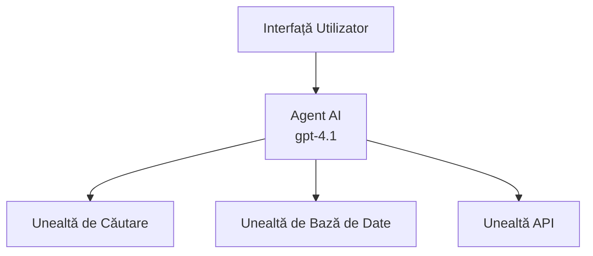
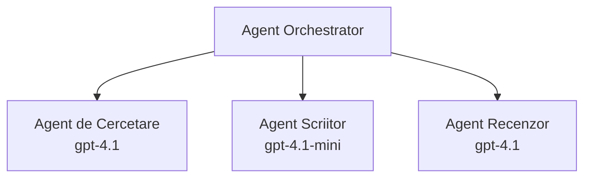

# Agenți AI cu Azure Developer CLI

**Navigare în capitol:**
- **📚 Pagina cursului**: [AZD pentru începători](../../README.md)
- **📖 Capitolul curent**: Capitolul 2 - Dezvoltare AI-First
- **⬅️ Anterior**: [Integrarea Microsoft Foundry](microsoft-foundry-integration.md)
- **➡️ Următor**: [Dezvoltarea modelului AI](ai-model-deployment.md)
- **🚀 Avansat**: [Soluții multi-agent](../../examples/retail-scenario.md)

---

## Introducere

Agenții AI sunt programe autonome care pot percepe mediul înconjurător, pot lua decizii și pot întreprinde acțiuni pentru a atinge obiective specifice. Spre deosebire de simplele chatbot-uri care răspund la prompturi, agenții pot:

- **Folosi unelte** - Apela API-uri, căuta în baze de date, executa cod
- **Planifica și raționa** - Împărți sarcinile complexe în pași
- **Învăța din context** - Menține memorie și adaptează comportamentul
- **Colabora** - Lucrează cu alți agenți (sisteme multi-agent)

Acest ghid îți arată cum să implementezi agenți AI în Azure folosind Azure Developer CLI (azd).

> **Notă validare (2026-07-13):** Acest ghid a fost verificat cu `azd` `1.27.1` și `azure.ai.agents` `1.0.0-beta.5`. Experiența `azd ai` este încă în previzualizare, așa că verifică ajutorul extensiei dacă versiunile instalate diferă.

## Obiective de învățare

Parcurgând acest ghid, vei:
- Înțelege ce sunt agenții AI și cum se deosebesc de chatbot-uri
- Implementa șabloane predefinite de agenți AI folosind AZD
- Configura Foundry Agents pentru agenți personalizați
- Implementa tipare de bază pentru agenți (folosirea uneltelor, RAG, multi-agent)
- Monitoriza și depana agenții implementați

## Rezultate așteptate

După finalizare, vei putea:
- Implementa aplicații de agenți AI în Azure cu o singură comandă
- Configura unelte și capabilități ale agenților
- Implementa generare augmentată prin recuperare (RAG) cu agenți
- Proiecta arhitecturi multi-agent pentru fluxuri de lucru complexe
- Depana probleme comune la implementarea agenților

---

## 🤖 Ce face un Agent diferit de un Chatbot?

| Caracteristică | Chatbot | Agent AI |
|---------|---------|----------|
| **Comportament** | Răspunde la prompturi | Întreprinde acțiuni autonome |
| **Unelte** | Niciuna | Poate apela API-uri, căuta, executa cod |
| **Memorie** | Doar pe sesiune | Memorie persistentă peste sesiuni |
| **Planificare** | Răspuns unic | Raționament în pași multipli |
| **Colaborare** | Entitate unică | Poate colabora cu alți agenți |

### O analogie simplă

- **Chatbot** = O persoană amabilă care răspunde întrebărilor la un birou de informații
- **Agent AI** = Un asistent personal care poate face apeluri, programa întâlniri și îndeplini sarcini pentru tine

---

## 🚀 Pornire rapidă: Implementarea primului agent

### Opțiunea 1: Șablon Foundry Agents (Recomandat)

```bash
# Inițializați șablonul agenților AI
azd init --template get-started-with-ai-agents

# Implementați în Azure
azd up
```

**Ce se implementează:**
- ✅ Foundry Agents
- ✅ Modele Microsoft Foundry (gpt-4.1)
- ✅ Azure AI Search (pentru RAG)
- ✅ Azure Container Apps (interfață web)
- ✅ Application Insights (monitorizare)

**Timp:** ~15-20 minute
**Cost:** ~$100-150/lună (dezvoltare)

### Opțiunea 2: Agent OpenAI cu Prompty

```bash
# Inițializează șablonul agentului bazat pe Prompty
azd init --template agent-openai-python-prompty

# Desfășoară în Azure
azd up
```

**Ce se implementează:**
- ✅ Azure Functions (execuție agent serverless)
- ✅ Modele Microsoft Foundry
- ✅ Fișiere de configurare Prompty
- ✅ Implementare exemplu agent

**Timp:** ~10-15 minute
**Cost:** ~$50-100/lună (dezvoltare)

### Opțiunea 3: Agent RAG Chat

```bash
# Inițializează șablonul de chat RAG
azd init --template azure-search-openai-demo

# Implementare pe Azure
azd up
```

**Ce se implementează:**
- ✅ Modele Microsoft Foundry
- ✅ Azure AI Search cu date de probă
- ✅ Pipeline de procesare documente
- ✅ Interfață chat cu citări

**Timp:** ~15-25 minute
**Cost:** ~$80-150/lună (dezvoltare)

### Opțiunea 4: AZD AI Agent Init (Previzualizare bazată pe manifest sau șablon)

Dacă ai un fișier manifest pentru agent, poți folosi comanda `azd ai` pentru a genera direct un proiect Foundry Agent Service. Lansările recente de previzualizare au adăugat și suportul pentru inițializarea pe bază de șablon, așa că fluxul exact de prompt poate diferi puțin în funcție de versiunea instalată a extensiei tale.

```bash
# Instalează extensia agenților AI
azd extension install azure.ai.agents

# Opțional: verifică versiunea de previzualizare instalată
azd extension show azure.ai.agents

# Inițializează dintr-un manifest al agentului
azd ai agent init -m agent-manifest.yaml

# Desfășoară în Azure
azd up

# Testează agentul desfășurat (afișează latența + timpul până la primul octet)
azd ai agent invoke
```

**Când să folosești `azd ai agent init` versus `azd init --template`:**

| Abordare | Potrivit pentru | Cum funcționează |
|----------|----------|------|
| `azd init --template` | Pornind de la o aplicație exemplu funcțională | Clonează un repo complet de șablon cu cod + infrastructură |
| `azd ai agent init -m` | Construind de la propriul manifest de agent | Generează structura proiectului din definiția agentului tău |

> **Sfat:** Folosește `azd init --template` când înveți (Opțiunile 1-3 de mai sus). Folosește `azd ai agent init` când construiești agenți de producție cu propriile manifeste.

După `azd up`, aceeași extensie te ghidează prin restul ciclului de viață al agentului: `azd ai agent invoke` pentru testare, `azd ai agent eval generate` și `azd ai agent optimize` pentru măsurarea și îmbunătățirea calității, și `azd ai agent delete` pentru curățare. Vezi [Comenzile AZD AI CLI](../chapter-08-production/production-ai-practices.md#azd-ai-cli-commands-and-extensions) pentru referința completă.

---

## 🏗️ Tipare de arhitectură pentru agenți

### Tiparul 1: Agent unitar cu unelte

Cel mai simplu tipar pentru agenți - un agent care poate folosi multiple unelte.



**Ideal pentru:**
- Bots pentru suport clienți
- Asistenți de cercetare
- Agenți pentru analiză de date

**Șablon AZD:** `azure-search-openai-demo`

### Tiparul 2: Agent RAG (Generare augmentată prin recuperare)

Un agent care recuperează documente relevante înainte de a genera răspunsuri.


**Ideal pentru:**
- Baze de cunoștințe enterprise
- Sisteme de întrebări & răspunsuri pe documente
- Cercetări de conformitate și juridice

**Șablon AZD:** `azure-search-openai-demo`

### Tiparul 3: Sistem multi-agent

Mai mulți agenți specializați care lucrează împreună la sarcini complexe.



**Ideal pentru:**
- Generare complexă de conținut
- Fluxuri de lucru în mai mulți pași
- Sarcini ce necesită expertiză diferită

**Află mai multe:** [Tipare de coordonare multi-agent](../chapter-06-pre-deployment/coordination-patterns.md)

---

## ⚙️ Configurarea uneltelor pentru agenți

Agenții devin puternici când pot folosi unelte. Iată cum să configurezi uneltele comune:

### Configurarea uneltelor în Foundry Agents

```python
# agent_config.py
from azure.ai.projects import AIProjectClient
from azure.ai.projects.models import FunctionTool, CodeInterpreterTool

# Definește unelte personalizate
search_tool = FunctionTool(
    name="search_knowledge_base",
    description="Search the company knowledge base for relevant documents",
    parameters={
        "type": "object",
        "properties": {
            "query": {
                "type": "string",
                "description": "The search query"
            }
        },
        "required": ["query"]
    }
)

# Creează agent cu unelte
agent = project_client.agents.create_agent(
    model="gpt-4.1",
    name="Support Agent",
    instructions="You are a helpful support agent. Use the search tool to find relevant information.",
    tools=[search_tool, CodeInterpreterTool()]
)
```

### Configurarea mediului

```bash
# Configurați variabilele de mediu specifice agentului
azd env set AZURE_OPENAI_MODEL "gpt-4.1"
azd env set AGENT_INSTRUCTIONS "You are a helpful assistant..."
azd env set ENABLE_CODE_INTERPRETER "true"
azd env set ENABLE_FILE_SEARCH "true"

# Implementați cu configurația actualizată
azd deploy
```

---

## 📊 Monitorizarea agenților

### Integrare Application Insights

Toate șabloanele de agenți AZD includ Application Insights pentru monitorizare:

```bash
# Deschideți tabloul de bord de monitorizare
azd monitor --overview

# Vizualizați jurnalele în timp real
azd monitor --logs

# Vizualizați metricile în timp real
azd monitor --live
```

### Indicatori cheie de monitorizat

| Indicator | Descriere | Țintă |
|--------|-------------|--------|
| Timp de răspuns | Timpul până la generarea răspunsului | < 5 secunde |
| Utilizare tokeni | Tokeni pe cerere | Monitorizează costul |
| Rata de succes apel unelte | % de execuții reușite ale uneltelor | > 95% |
| Rata de erori | Cereri agent eșuate | < 1% |
| Satisfacția utilizatorilor | Scoruri feedback | > 4.0/5.0 |

### Logare personalizată pentru agenți

```python
import os
from azure.monitor.opentelemetry import configure_azure_monitor
from opentelemetry import trace

# Configurați Azure Monitor cu OpenTelemetry
configure_azure_monitor(
    connection_string=os.environ["APPLICATIONINSIGHTS_CONNECTION_STRING"]
)

tracer = trace.get_tracer(__name__)

def log_agent_interaction(user_query, agent_response, tools_used, latency_ms):
    with tracer.start_as_current_span("agent_interaction") as span:
        span.set_attributes({
            "user_query": user_query,
            "response_length": len(agent_response),
            "tools_used": tools_used,
            "latency_ms": latency_ms
        })
```

> **Notă:** Instalează pachetele necesare: `pip install azure-monitor-opentelemetry opentelemetry`

---

## 💰 Considerații privind costurile

### Costuri lunare estimate după tipar

| Tipar | Mediu dezvoltare | Producție |
|---------|-----------------|------------|
| Agent unitar | $50-100 | $200-500 |
| Agent RAG | $80-150 | $300-800 |
| Multi-agent (2-3 agenți) | $150-300 | $500-1.500 |
| Multi-agent enterprise | $300-500 | $1.500-5.000+ |

### Sfaturi pentru optimizarea costurilor

1. **Folosește gpt-4.1-mini pentru sarcini simple**
   ```bash
   azd env set AZURE_OPENAI_MODEL "gpt-4.1-mini"
   ```

2. **Implementează caching pentru interogări repetate**
   ```python
   from functools import lru_cache
   
   @lru_cache(maxsize=1000)
   def get_cached_response(query_hash):
       return agent.run(query_hash)
   ```

3. **Setează limite de tokeni pe execuție**
   ```python
   # Setează max_completion_tokens atunci când rulezi agentul, nu în timpul creării
   run = project_client.agents.create_run(
       thread_id=thread.id,
       agent_id=agent.id,
       max_completion_tokens=1000  # Limitează lungimea răspunsului
   )
   ```

4. **Scalează la zero când nu sunt utilizate**
   ```bash
   # Container Apps se redimensionează automat la zero
   azd env set MIN_REPLICAS "0"
   ```

---

## 🔧 Depanarea agenților

### Probleme comune și soluții

<details>
<summary><strong>❌ Agentul nu răspunde la apelurile uneltelor</strong></summary>

```bash
# Verificați dacă uneltele sunt înregistrate corect
azd show

# Verificați implementarea OpenAI
az cognitiveservices account deployment list \
  --name $AZURE_OPENAI_NAME \
  --resource-group $RG_NAME

# Verificați jurnalele agentului
azd monitor --logs
```

**Cauze comune:**
- Semnătura funcției uneltei nu corespunde
- Lipsa permisiunilor necesare
- Endpoint-ul API nu este accesibil
</details>

<details>
<summary><strong>❌ Latentă mare în răspunsurile agentului</strong></summary>

```bash
# Verificați Application Insights pentru blocaje
azd monitor --live

# Luați în considerare utilizarea unui model mai rapid
azd env set AZURE_OPENAI_MODEL "gpt-4.1-mini"
azd deploy
```

**Sfaturi de optimizare:**
- Folosește răspunsuri în streaming
- Implementează caching-ul răspunsurilor
- Reduce dimensiunea ferestrei de context
</details>

<details>
<summary><strong>❌ Agentul oferă informații incorecte sau halucinate</strong></summary>

```python
# Îmbunătățiți cu prompturi mai bune ale sistemului
instructions = """
You are a helpful assistant. IMPORTANT:
- Only answer based on provided context
- If you don't know, say "I don't know"
- Always cite your sources
- Never make up information
"""

# Adăugați recuperare pentru fundamentare
agent = project_client.agents.create_agent(
    model="gpt-4.1",
    instructions=instructions,
    tools=[FileSearchTool()]  # Antrenați răspunsurile în documente
)
```
</details>

<details>
<summary><strong>❌ Erori de depășire a limitei de tokeni</strong></summary>

```python
# Implementați gestionarea ferestrei de context
def truncate_context(messages, max_tokens=8000, model="gpt-4.1"):
    """Keep only recent messages within token limit."""
    import tiktoken
    encoding = tiktoken.encoding_for_model(model)
    total_tokens = 0
    truncated = []
    
    for msg in reversed(messages):
        msg_tokens = len(encoding.encode(msg.content))
        if total_tokens + msg_tokens > max_tokens:
            break
        truncated.insert(0, msg)
        total_tokens += msg_tokens
    
    return truncated
```
</details>

---

## 🎓 Exerciții practice

### Exercițiul 1: Implementarea unui agent de bază (20 minute)

**Scop:** Implementarea primului tău agent AI folosind AZD

```bash
# Pasul 1: Inițializați șablonul
azd init --template get-started-with-ai-agents

# Pasul 2: Autentificați-vă în Azure
azd auth login
# Dacă lucrați pe mai mulți chiriași, adăugați --tenant-id <tenant-id>

# Pasul 3: Implementați
azd up

# Pasul 4: Testați agentul
# Rezultat așteptat după implementare:
#   Implementare finalizată!
#   Endpoint: https://<app-name>.<region>.azurecontainerapps.io
# Deschideți URL-ul afișat în rezultat și încercați să puneți o întrebare

# Pasul 5: Vizualizați monitorizarea
azd monitor --overview

# Pasul 6: Curățați mediul
azd down --force --purge
```

**Criterii de succes:**
- [ ] Agentul răspunde la întrebări
- [ ] Accesează panoul de monitorizare prin `azd monitor`
- [ ] Resursele sunt curățate cu succes

### Exercițiul 2: Adăugarea unei unelte personalizate (30 minute)

**Scop:** Extinde un agent cu o unealtă personalizată

1. Implementează șablonul agentului:
   ```bash
   azd init --template get-started-with-ai-agents
   azd up
   ```
2. Creează o funcție nouă pentru unealtă în codul agentului:
   ```python
   def get_weather(location: str) -> str:
       """Get current weather for a location."""
       # Apel API către serviciul meteo
       return f"Weather in {location}: Sunny, 72°F"
   ```
3. Înregistrează unealta cu agentul:
   ```python
   from azure.ai.projects.models import FunctionTool

   weather_tool = FunctionTool(
       name="get_weather",
       description="Get current weather for a location",
       parameters={
           "type": "object",
           "properties": {
               "location": {"type": "string", "description": "City name"}
           },
           "required": ["location"]
       }
   )

   agent = project_client.agents.create_agent(
       model="gpt-4.1",
       name="Weather Agent",
       tools=[weather_tool]
   )
   ```
4. Redeploy și testează:
   ```bash
   azd deploy
   # Întreabă: "Cum este vremea în Seattle?"
   # Așteptat: Agentul apelează funcția get_weather("Seattle") și returnează informații despre vreme
   ```

**Criterii de succes:**
- [ ] Agentul recunoaște întrebări legate de vreme
- [ ] Unealta este apelată corect
- [ ] Răspunsul include informații meteo

### Exercițiul 3: Construiește un agent RAG (45 minute)

**Scop:** Creează un agent care răspunde din documentele tale

```bash
# Pasul 1: Implementați șablonul RAG
azd init --template azure-search-openai-demo
azd up

# Pasul 2: Încărcați documentele dumneavoastră
# Plasați fișiere PDF/TXT în directorul data/, apoi rulați:
python scripts/prepdocs.py

# Pasul 3: Testați cu întrebări specifice domeniului
# Deschideți URL-ul aplicației web din ieșirea azd up
# Puneți întrebări despre documentele încărcate
# Răspunsurile ar trebui să includă referințe de citare precum [doc.pdf]
```

**Criterii de succes:**
- [ ] Agentul răspunde din documentele încărcate
- [ ] Răspunsurile includ citări
- [ ] Nu halucinează la întrebări în afara ariei

---

## 📚 Pașii următori

Acum că ai înțeles agenții AI, explorează aceste subiecte avansate:

| Subiect | Descriere | Link |
|-------|-------------|------|
| **Sisteme multi-agent** | Construiește sisteme cu agenți care colaborează | [Exemplu retail multi-agent](../../examples/retail-scenario.md) |
| **Tipare de coordonare** | Învață tipare de orchestrare și comunicare | [Tipare de coordonare](../chapter-06-pre-deployment/coordination-patterns.md) |
| **Implementare în producție** | Implementarea agenților gata pentru enterprise | [Practici AI în producție](../chapter-08-production/production-ai-practices.md) |
| **Evaluarea agenților** | Testează și evaluează performanța agenților | [Depanare AI](../chapter-07-troubleshooting/ai-troubleshooting.md) |
| **Laborator AI Workshop** | Practic: pregătește soluția ta AI cu AZD | [Laborator AI Workshop](ai-workshop-lab.md) |

---

## 📖 Resurse suplimentare

### Documentație oficială
- [Microsoft Foundry Agent Service](https://learn.microsoft.com/azure/ai-services/agents/)
- [Microsoft Foundry Agent Service Quickstart](https://learn.microsoft.com/azure/ai-services/agents/quickstart)
- [Semantic Kernel Agent Framework](https://learn.microsoft.com/semantic-kernel/)

### Șabloane AZD pentru agenți
- [Începe cu agenți AI](https://github.com/Azure-Samples/get-started-with-ai-agents)
- [Agent OpenAI Python Prompty](https://github.com/Azure-Samples/agent-openai-python-prompty)
- [Demo Azure Search OpenAI](https://github.com/Azure-Samples/azure-search-openai-demo)

### Resurse comunitare
- [Awesome AZD - Șabloane agenți](https://azure.github.io/awesome-azd/?tags=ai-agents)
- [Azure AI Discord](https://discord.gg/microsoft-azure)
- [Microsoft Foundry Discord](https://discord.gg/nTYy5BXMWG)

### Abilități de agent pentru editorul tău
- [**Microsoft Azure Agent Skills**](https://skills.sh/microsoft/github-copilot-for-azure) - Instalează abilități reutilizabile pentru agenți AI în dezvoltarea Azure în GitHub Copilot, Cursor sau orice agent suportat. Include abilități pentru [Azure AI](https://skills.sh/microsoft/github-copilot-for-azure/azure-ai), [Microsoft Foundry](https://skills.sh/microsoft/github-copilot-for-azure/microsoft-foundry), [implementare](https://skills.sh/microsoft/github-copilot-for-azure/azure-deploy), și [diagnosticare](https://skills.sh/microsoft/github-copilot-for-azure/azure-diagnostics):
  ```bash
  npx skills add microsoft/github-copilot-for-azure
  ```

---

**Navigare**
- **Lecția anterioară**: [Integrarea Microsoft Foundry](microsoft-foundry-integration.md)
- **Lecția următoare**: [Dezvoltarea modelului AI](ai-model-deployment.md)

---

<!-- CO-OP TRANSLATOR DISCLAIMER START -->
**Declinare a responsabilității**:
Acest document a fost tradus folosind serviciul de traducere AI [Co-op Translator](https://github.com/Azure/co-op-translator). În timp ce ne străduim pentru acuratețe, vă rugăm să rețineți că traducerile automate pot conține erori sau inexactități. Documentul original în limba sa nativă trebuie considerat sursa autorizată. Pentru informații critice, se recomandă traducerea profesională realizată de un om. Nu ne asumăm responsabilitatea pentru eventualele neînțelegeri sau interpretări greșite care decurg din utilizarea acestei traduceri.
<!-- CO-OP TRANSLATOR DISCLAIMER END -->