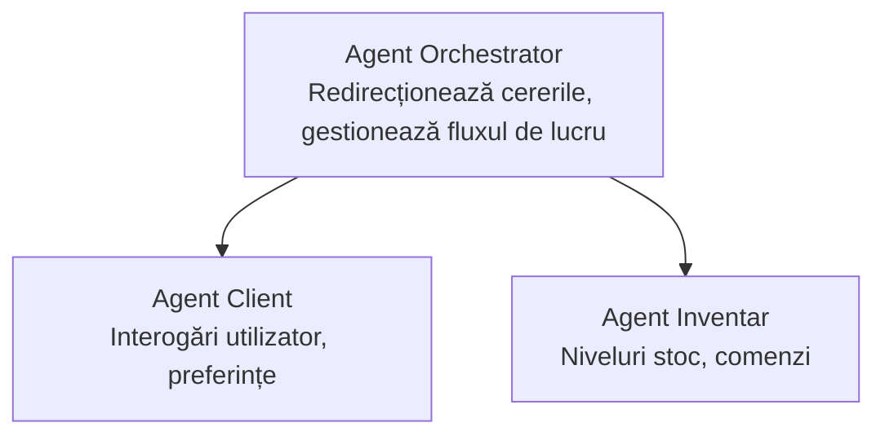

# Capitolul 5: Soluții AI Multi-Agent

**📚 Curs**: [AZD Pentru Începători](../../README.md) | **⏱️ Durată**: 2-3 ore | **⭐ Complexitate**: Avansat

---

## Prezentare generală

Acest capitol acoperă modele avansate de arhitectură multi-agent, orchestrarea agenților și implementările AI pregătite pentru producție în scenarii complexe.

## Obiective de învățare

După parcurgerea acestui capitol, vei:
- Înțelege modelele de arhitectură multi-agent
- Implementa sisteme coordonate de agenți AI
- Implementa comunicarea între agenți
- Construi soluții multi-agent pregătite pentru producție

---

## 📚 Lecții

| # | Lecție | Descriere | Durată |
|---|--------|-------------|------|
| 1 | [Soluție Multi-Agent pentru Retail](../../examples/retail-scenario.md) | Parcurgere completă a implementării | 90 min |
| 2 | [Modele de coordonare](../chapter-06-pre-deployment/coordination-patterns.md) | Strategii de orchestrare a agenților | 30 min |
| 3 | [Implementare Template ARM](../../examples/retail-multiagent-arm-template/README.md) | Implementare cu un singur clic | 30 min |

---

## 🚀 Pornire rapidă

```bash
# Opțiunea 1: Implementați dintr-un șablon
azd init --template agent-openai-python-prompty
azd up

# Opțiunea 2: Implementați dintr-un manifest al agentului (necesită extensia azure.ai.agents)
azd extension install azure.ai.agents
azd ai agent init -m agent-manifest.yaml
azd up
```

> **Ce abordare?** Folosește `azd init --template` pentru a începe de la un exemplu funcțional. Folosește `azd ai agent init` când ai propriul manifest de agent. Vezi [referința AZD AI CLI](../chapter-08-production/production-ai-practices.md#azd-ai-cli-commands-and-extensions) pentru detalii complete.

---

## 🤖 Arhitectura Multi-Agent


---

## 🎯 Soluția prezentată: Multi-Agent pentru Retail

[Soluția Multi-Agent pentru Retail](../../examples/retail-scenario.md) demonstrează:

- **Agent Client**: Gestionează interacțiunile și preferințele utilizatorului
- **Agent Inventar**: Administrează stocurile și procesarea comenzilor
- **Orchestrator**: Coordonează între agenți
- **Memorie Comună**: Gestionarea contextului între agenți

### Servicii utilizate

| Serviciu | Scop |
|---------|---------|
| Microsoft Foundry Models | Înțelegerea limbajului |
| Azure AI Search | Catalog de produse |
| Cosmos DB | Starea și memoria agentului |
| Container Apps | Găzduirea agenților |
| Application Insights | Monitorizare |

---

## 🔗 Navigare

| Direcție | Capitol |
|-----------|---------|
| **Anterior** | [Capitolul 4: Infrastructură](../chapter-04-infrastructure/README.md) |
| **Următor** | [Capitolul 6: Pre-Implementare](../chapter-06-pre-deployment/README.md) |

---

## 📖 Resurse conexe

- [Ghid Agenți AI](../chapter-02-ai-development/agents.md)
- [Practici AI pentru Producție](../chapter-08-production/production-ai-practices.md)
- [Depanare AI](../chapter-07-troubleshooting/ai-troubleshooting.md)

---

<!-- CO-OP TRANSLATOR DISCLAIMER START -->
**Declinare a responsabilității**:  
Acest document a fost tradus folosind serviciul de traducere AI [Co-op Translator](https://github.com/Azure/co-op-translator). Deși ne străduim pentru acuratețe, vă rugăm să fiți conștienți că traducerile automate pot conține erori sau inexactități. Documentul original în limba sa nativă trebuie considerat sursa autoritară. Pentru informații critice, se recomandă traducerea profesională realizată de un om. Nu ne asumăm răspunderea pentru eventualele neînțelegeri sau interpretări greșite rezultate din utilizarea acestei traduceri.
<!-- CO-OP TRANSLATOR DISCLAIMER END -->