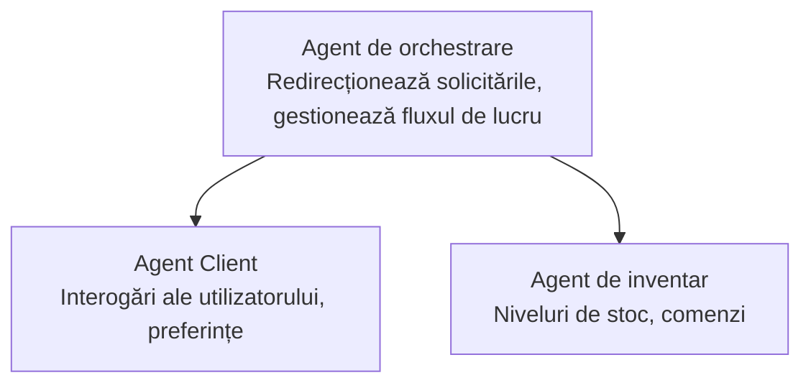

# Capitolul 5: Soluții AI multi-agent

**📚 Curs**: [AZD pentru începători](../../README.md) | **⏱️ Durată**: 2-3 ore | **⭐ Complexitate**: Avansat

---

## Prezentare generală

Acest capitol acoperă tipare avansate de arhitectură multi-agent, orchestrarea agenților și implementări AI pregătite pentru producție pentru scenarii complexe.

> Validat cu `azd 1.23.12` în martie 2026.

## Obiective de învățare

După parcurgerea acestui capitol, veți:
- Înțelegeți tiparele arhitecturii multi-agent
- Implementați sisteme de agenți AI coordonate
- Implementați comunicarea între agenți
- Construiți soluții multi-agent pregătite pentru producție

---

## 📚 Lecții

| # | Lecție | Descriere | Durată |
|---|--------|-------------|------|
| 1 | [Soluție multi-agent pentru retail](../../examples/retail-scenario.md) | Parcurgere completă a implementării | 90 min |
| 2 | [Tipare de coordonare](../chapter-06-pre-deployment/coordination-patterns.md) | Strategii de orchestrare a agenților | 30 min |
| 3 | [Implementare ARM Template](../../examples/retail-multiagent-arm-template/README.md) | Implementare cu un singur clic | 30 min |

---

## 🚀 Pornire rapidă

```bash
# Opțiunea 1: Implementare dintr-un șablon
azd init --template agent-openai-python-prompty
azd up

# Opțiunea 2: Implementare dintr-un manifest de agent (necesită extensia azure.ai.agents)
azd extension install azure.ai.agents
azd ai agent init -m agent-manifest.yaml
azd up
```

> **Ce abordare?** Folosiți `azd init --template` pentru a porni de la un exemplu funcțional. Folosiți `azd ai agent init` când aveți propriul manifest de agent. Consultați [Referința AZD AI CLI](../chapter-08-production/production-ai-practices.md#azd-ai-cli-commands-and-extensions) pentru detalii complete.

---

## 🤖 Arhitectură multi-agent


---

## 🎯 Soluția prezentată: Retail Multi-Agent

Exemplul [Soluție multi-agent pentru retail](../../examples/retail-scenario.md) demonstrează:

- **Agent Client**: Gestionează interacțiunile utilizatorului și preferințele
- **Agent de inventar**: Gestionează stocurile și procesarea comenzilor
- **Orchestrator**: Coordonează între agenți
- **Memorie partajată**: Gestionarea contextului între agenți

### Servicii utilizate

| Serviciu | Utilizare |
|---------|---------|
| Microsoft Foundry Models | Înțelegere a limbajului |
| Azure AI Search | Catalog de produse |
| Cosmos DB | Stare și memorie a agentului |
| Container Apps | Găzduirea agenților |
| Application Insights | Monitorizare |

---

## 🔗 Navigare

| Direcție | Capitol |
|-----------|---------|
| **Anterior** | [Capitolul 4: Infrastructură](../chapter-04-infrastructure/README.md) |
| **Următor** | [Capitolul 6: Pre-implementare](../chapter-06-pre-deployment/README.md) |

---

## 📖 Resurse conexe

- [Ghid Agenți AI](../chapter-02-ai-development/agents.md)
- [Practici AI pentru producție](../chapter-08-production/production-ai-practices.md)
- [Depanare AI](../chapter-07-troubleshooting/ai-troubleshooting.md)

---

<!-- CO-OP TRANSLATOR DISCLAIMER START -->
**Declinare de responsabilitate**:
Acest document a fost tradus folosind serviciul de traducere AI [Co-op Translator](https://github.com/Azure/co-op-translator). Deși ne străduim pentru acuratețe, vă rugăm să rețineți că traducerile automate pot conține erori sau inexactități. Documentul original în limba sa nativă ar trebui considerat sursa autorizată. Pentru informații critice, se recomandă o traducere profesională realizată de un traducător uman. Nu ne asumăm răspunderea pentru orice neînțelegeri sau interpretări greșite ce decurg din utilizarea acestei traduceri.
<!-- CO-OP TRANSLATOR DISCLAIMER END -->