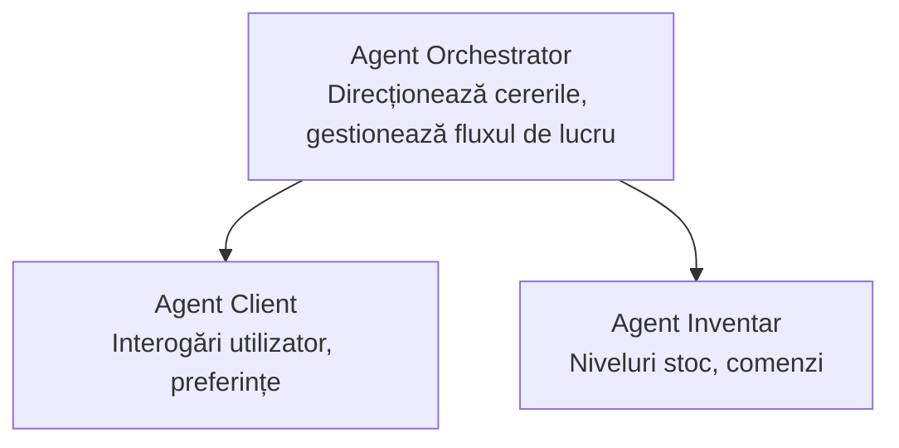

# Capitolul 5: Soluții AI Multi-Agent

**📚 Curs**: [AZD Pentru Începători](../../README.md) | **⏱️ Durată**: 2-3 ore | **⭐ Complexitate**: Avansat

---

## Prezentare generală

Acest capitol acoperă tipare avansate de arhitectură multi-agent, orchestrarea agenților și implementări AI pregătite pentru producție în scenarii complexe.

> Validat cu `azd 1.25.6` în iunie 2026.

## Obiective de învățare

După parcurgerea acestui capitol, vei:
- Înțelege tiparele de arhitectură multi-agent
- Implementa sisteme coordonate de agenți AI
- Implementa comunicarea între agenți
- Construi soluții multi-agent pregătite pentru producție

---

## 📚 Lecții

| # | Lecție | Descriere | Timp |
|---|--------|-----------|------|
| 1 | [Bazele Multi-Agent](multi-agent-basics.md) | Practic: implementează o aplicație multi-agent funcțională cu `azd up` | 45 min |
| 2 | [Tipare de Coordonare](../chapter-06-pre-deployment/coordination-patterns.md) | Strategii de orchestrare a agenților (continuă în Capitolul 6) | 30 min |
| 3 | [Implementare cu Template ARM](../../examples/retail-multiagent-arm-template/README.md) | Exemplu de implementare cu un singur click | 30 min |

> **Începe cu Lecția 1.** Este singura lecție complet practică, implementabilă din acest capitol. Lecția 2 se găsește în Capitolul 6 (este partajată cu planificarea pre-implementării), iar [Soluția Multi-Agent Retail](../../examples/retail-scenario.md) este un plan de arhitectură — un reper de design, nu un template cu o singură comandă.

---

## 🚀 Pornire rapidă

```bash
# Opțiunea 1: Implementați dintr-un șablon
azd init --template agent-openai-python-prompty
azd up

# Opțiunea 2: Implementați dintr-un manifest de agent (necesită extensia azure.ai.agents)
azd extension install azure.ai.agents
azd ai agent init -m agent-manifest.yaml
azd up
```

> **Ce abordare?** Folosește `azd init --template` pentru a începe de la un exemplu funcțional. Folosește `azd ai agent init` când ai propriul manifest al agentului. Vezi referința [AZD AI CLI](../chapter-08-production/production-ai-practices.md#azd-ai-cli-commands-and-extensions) pentru detalii complete.

---

## 🤖 Arhitectură Multi-Agent



---

## 🎯 Soluția prezentată: Multi-Agent Retail

[Soluția Multi-Agent Retail](../../examples/retail-scenario.md) demonstrează:

- **Agent Client**: Gestionează interacțiunile și preferințele utilizatorului
- **Agent Inventar**: Gestionează stocul și procesarea comenzilor
- **Orchestrator**: Coordonează între agenți
- **Memorie Partajată**: Gestionarea contextului între agenți

### Servicii utilizate

| Serviciu | Scop |
|----------|-------|
| Modele Microsoft Foundry | Înțelegerea limbajului |
| Azure AI Search | Catalogul de produse |
| Cosmos DB | Starea și memoria agentului |
| Container Apps | Găzduirea agenților |
| Application Insights | Monitorizare |

---

## 🔗 Navigare

| Direcție | Capitol |
|----------|---------|
| **Anterior** | [Capitolul 4: Infrastructură](../chapter-04-infrastructure/README.md) |
| **Următor** | [Capitolul 6: Pre-Implementare](../chapter-06-pre-deployment/README.md) |

---

## 📖 Resurse conexe

- [Ghid agenți AI](../chapter-02-ai-development/agents.md)
- [Practici AI pentru producție](../chapter-08-production/production-ai-practices.md)
- [Depanare AI](../chapter-07-troubleshooting/ai-troubleshooting.md)

---

<!-- CO-OP TRANSLATOR DISCLAIMER START -->
**Declinare a responsabilității**:
Acest document a fost tradus folosind serviciul de traducere AI [Co-op Translator](https://github.com/Azure/co-op-translator). În timp ce ne străduim pentru acuratețe, vă rugăm să rețineți că traducerile automate pot conține erori sau inexactități. Documentul original în limba sa nativă trebuie considerat sursa autorizată. Pentru informații critice, se recomandă traducerea profesională realizată de un om. Nu ne asumăm responsabilitatea pentru eventualele neînțelegeri sau interpretări greșite care decurg din utilizarea acestei traduceri.
<!-- CO-OP TRANSLATOR DISCLAIMER END -->