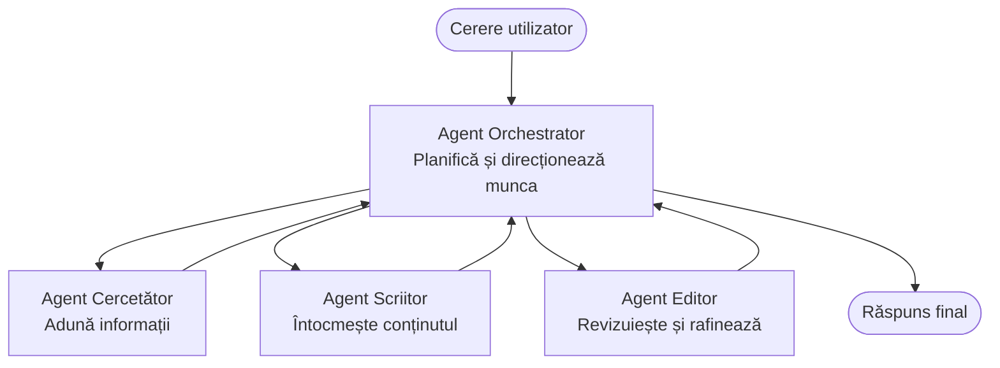

# Noțiuni de bază despre multi-agent - Desfășurați primul sistem AI coordonat

**Navigare capitol:**
- **📚 Acasă curs**: [AZD Pentru Începători](../../README.md)
- **📖 Capitolul curent**: Capitolul 5 - Soluții AI Multi-Agent
- **⬅️ Anterior**: [Capitolul 4: Infrastructură](../chapter-04-infrastructure/README.md)
- **➡️ Următor**: [Tipare de coordonare](../chapter-06-pre-deployment/coordination-patterns.md)

> Validat cu `azd 1.27.1` în iulie 2026.

## Introducere

În capitolele anterioare ai desfășurat o singură aplicație—iar în Capitolul 2 ai desfășurat un singur agent AI. Această lecție face pasul următor: desfășurarea unui **sistem multi-agent**, în care mai mulți agenți specializați lucrează împreună pentru a rezolva o problemă pe care niciun agent singur nu ar putea să o gestioneze bine.

Veștile bune pentru începători: **nu ai nevoie de comenzi noi.** O soluție multi-agent este tot un proiect azd. Vei face `azd init`, `azd up`, testezi și `azd down`—exact fluxul de lucru pe care îl cunoști deja. Ce se schimbă este *forma* aplicației din interior.

## Obiective de învățare

La finalul acestei lecții vei:
- Înțelege ce înseamnă „multi-agent” și când merită complexitatea suplimentară
- Recunoaște rolurile comune într-un sistem multi-agent (orchestrator + specialiști)
- Desfășura o șablon multi-agent real, funcțional, cu `azd up`
- Înțelege resursele Azure care susțin o aplicație multi-agent
- Știi cum să verifici, personalizezi și să demontezi soluția în siguranță

## Rezultate de învățare

După ce termini această lecție, vei putea:
- Explica diferența dintre un agent unic și un sistem multi-agent
- Alege între un agent unic cu unelte și un design adevărat multi-agent
- Desfășura și testa un șablon multi-agent complet cu azd
- Identifica unde rulează fiecare agent și cum comunică
- Curăța toate resursele pentru a evita taxe continue

---

## Ce este un sistem multi-agent?

Un agent AI unic este un model cu un set de instrucțiuni și (opțional) unele unelte. Acest lucru funcționează bine pentru sarcini concentrate. Dar pe măsură ce o sarcină crește—cercetare, apoi scriere, apoi editare, apoi verificare de fapte—dacă încerci să bagi totul într-un singur prompt, agentul devine mai lent, mai puțin de încredere și mai greu de depanat.

Un **sistem multi-agent** împarte munca în specialiști care fiecare fac bine o sarcină, coordonați de un orchestrator:



### Cele două roluri pe care le vei vedea mereu

| Rol | Sarcină | Exemplu |
|------|-----|---------|
| **Orchestrator** | Decide *ce se întâmplă mai departe* și direcționează munca între agenți | „Mai întâi cercetează, apoi scrie, apoi editează” |
| **Specialist** | Face o singură sarcină concentrată și returnează un rezultat | Un „cercetător” care doar adună fapte |

### Ai nevoie cu adevărat de mai mulți agenți?

Începe simplu. Folosește multi-agent **doar** când una dintre acestea este adevărată:

- ✅ Sarcina are **etape distincte** care beneficiază de instrucțiuni diferite (cercetare vs. scriere vs. revizuire)
- ✅ Vrei ca specialiștii să ruleze **în paralel** ca să economisești timp
- ✅ Pașii diferiți necesită **unelte sau surse de date diferite**
- ✅ Ai nevoie ca fiecare pas să fie **testabil și depanabil independent**

Dacă sarcina ta este o singură întrebare și răspuns sau un simplu apel de unealtă, un **agent unic cu unelte** (Capitolul 2) este mai simplu, mai ieftin și mai ușor de operat.

> **Sfat pentru începători:** „Mai mulți agenți” nu înseamnă „mai bine.” Fiecare agent adaugă latență, cost și o nouă entitate de monitorizat. Adaugă agenți doar atunci când problema se împarte clar în părți.

---

## Două moduri de a construi multi-agent pe Azure

| Abordare | Ce este | Cea mai potrivită pentru |
|----------|-----------|----------|
| **Agent unic + unelte** | Un agent Foundry care apelează funcții/unelete | Fluxuri de lucru simple, începuturi |
| **Mai mulți agenți coordonați** | Mai mulți agenți cu un orchestrator | Etape distincte, lucru paralel, specializare |

Această lecție se concentrează pe a doua abordare folosind un **șablon gata făcut**, ca să poți vedea un sistem multi-agent real în funcțiune înainte să-ți construiești propriul.

---

## Practic: Desfășoară o aplicație multi-agent funcțională

Vom desfășura **Contoso Creative Writer**, un exemplu oficial Azure care folosește mai mulți agenți (cercetător, scriitor, editor) coordonați pentru a produce un articol. Este o primă aplicație multi-agent excelentă pentru că rolurile sunt ușor de înțeles.

### Pasul 1: Inițializează șablonul

```bash
# Creează un folder de lucru
mkdir creative-writer && cd creative-writer

# Inițializează din șablonul oficial multi-agent
azd init --template contoso-creative-writer
```

> Răsfoiește oricând mai multe șabloane multi-agent în [galeria Awesome AZD AI](https://azure.github.io/awesome-azd/?tags=ai). Alte opțiuni prietenoase pentru începători includ `get-started-with-ai-agents` și `azure-ai-travel-agents`.

### Pasul 2: Autentifică-te

```bash
# Necesare pentru fluxurile de lucru azd
azd auth login
```

### Pasul 3: Creează un mediu

```bash
azd env new dev
```

### Pasul 4: Previzualizează, apoi desfășoară

```bash
# Vezi ce va fi creat înainte de a cheltui ceva (recomandat)
azd provision --preview

# Provisionați infrastructura și implementați toți agenții într-un singur pas
azd up
```

`azd up` va cere un abonament și o regiune, apoi va aproviziona resursele Azure și va desfășura aplicația. Desfășurările AI pot dura mai mult decât o simplă aplicație web—dacă desfășori modele mai mari, poți extinde timpul de așteptare pentru desfășurare:

```bash
azd deploy --timeout 1800
```

> **Atenție la cost și capacitate:** Aplicațiile multi-agent desfășoară modele AI care consumă cotă și generează costuri. Dacă `azd up` eșuează din cauza cotei pentru modele, vezi [Depanare AI](../chapter-07-troubleshooting/ai-troubleshooting.md) pentru remedieri legate de regiune și cotă, și Capitolul 6 [Planificare capacitate](../chapter-06-pre-deployment/capacity-planning.md).

---

## Înțelegerea a ceea ce ai desfășurat

O aplicație tipică multi-agent ca aceasta aproviziona un set de resurse Azure care corespund direct responsabilităților din diagrama de mai sus:

| Resursă | De ce este acolo |
|----------|----------------|
| **Microsoft Foundry / Modele** | Găzduiește modelele lingvistice pe care le folosește fiecare agent |
| **Azure AI Search** | Oferă agentului cercetător date fundamentate pentru căutare |
| **Container Apps** (sau App Service) | Găzduiește codul orchestratorului și al agenților |
| **Cosmos DB** (în unele exemple) | Stochează starea/memoria partajată transmisă între agenți |
| **Application Insights** | Urmărește cererile *printre* agenți pentru a putea depana fluxul |

### Cum comunică agenții între ei

În majoritatea exemplelor azd multi-agent, **orchestratorul rulează în codul aplicației** (de exemplu folosind un framework ca Semantic Kernel sau Microsoft Agent Framework). Orchestratorul apelează fiecare agent specialist pe rând, transmite rezultatele și asamblează răspunsul final. Agenții împart context prin:

- **Apeluri funcție/unealtă** — orchestratorul invocă un specialist și primește un rezultat înapoi
- **Memorie partajată** — o bază de date (adesea Cosmos DB) ține starea pe care ambii agenți o pot citi
- **Mesaje/evenimente** — pentru ocouplare mai relaxată, agenții comunică prin coadă sau Service Bus

> **De ce contează asta pentru depanare:** pentru că fiecare pas este separat, Application Insights îți arată *care* agent a fost lent sau a eșuat. Acesta este un motiv major pentru a împărți munca între agenți.

---

## Verifică desfășurarea

Confirmă că sistemul funcționează efectiv înainte de a continua:

```bash
# Afișați punctele finale implementate
azd show

# Deschideți panoul de monitorizare al aplicației
azd monitor

# Urmăriți jurnalele dacă ceva pare în neregulă
azd monitor --logs
```

Apoi deschide URL-ul aplicației din `azd show` și încearcă o cerere care să folosească toți agenții (pentru Creative Writer, cere să scrie un articol scurt pe un subiect). În căutarea de tranzacții din Application Insights, ar trebui să vezi cererea dispersându-se în pașii cercetător, scriitor și editor.

**Criterii de succes:**
- ✅ `azd show` afișează un endpoint accesibil
- ✅ O cerere produce un rezultat care a trecut clar prin mai multe etape
- ✅ Application Insights arată urmăriri pentru mai mult de un pas al agentului

---

## Personalizează: Adaugă sau ajustează un agent

Pentru că fiecare agent este doar instrucțiuni plus unelte, personalizarea este accesibilă:

1. **Găsește definițiile agentului** în șablon (adesea un set de fișiere `prompts/`, `agents/` sau `*.prompty`).
2. **Ajustează instrucțiunile unui agent** — de exemplu, spune agentului editor să impună un ton specific sau o limită de cuvinte.
3. **Redesfășoară doar codul** (infrastructura rămâne neschimbată):

   ```bash
   azd deploy
   ```

Pentru a merge mai departe și a construi agenți din propriul *manifest*, folosește extensia agent și ciclul său complet de viață:

```bash
azd extension install azure.ai.agents
azd ai agent init -m agent-manifest.yaml
azd up
azd ai agent invoke      # test, cu sincronizare a răspunsului
```

Vezi [Capitolul 2: Agenți](../chapter-02-ai-development/agents.md) și [referința AZD AI CLI](../chapter-08-production/production-ai-practices.md#azd-ai-cli-commands-and-extensions) pentru ciclul complet de viață al agentului (`invoke`, `eval generate`, `optimize`, `delete`).

---

## Curățare

Aplicațiile multi-agent rulează mai multe servicii taxabile. Demontează totul când ai terminat:

```bash
azd down --force --purge
```

Flag-ul `--purge` elimină și resursele AI șterse soft (cum ar fi conturile Foundry/Azure AI Services) ca să nu blocheze o noi desfășurare sau să nu mai genereze costuri.

---

## O notă despre sistemele multi-agent de producție

[Soluția Multi-Agent pentru Retail](../../examples/retail-scenario.md) din acest repo este un **plan de arhitectură**, nu un șablon cu o singură comandă—documentează cum ar fi construit un sistem retail de producție (și este explicit că o construcție completă este un efort substanțial). Folosește-l ca referință de design *după ce* ai desfășurat un exemplu funcțional aici. Pentru preocupări de producție (reziliență, cost, monitorizare, guvernanță), continuă cu [Capitolul 8: Practici AI de producție](../chapter-08-production/production-ai-practices.md).

---

## Rezumat

- Un sistem multi-agent împarte munca între specialiști coordonați de un orchestrator.
- Folosește-l doar când sarcina are etape distincte, paralelism sau unelte diferite pe pas—altfel preferă un singur agent.
- Fluxul de lucru azd rămâne neschimbat: `azd init` → `azd up` → test → `azd down`.
- Un șablon real precum `contoso-creative-writer` îți permite să vezi și să personalizezi astăzi o aplicație multi-agent funcțională.
- Urmărirea Application Insights printre agenți este unul dintre cele mai mari avantaje practice ale designului multi-agent.

---

## 🔗 Navigare

| Direcție | Lecție |
|-----------|--------|
| **Anterior** | [Capitolul 4: Infrastructură](../chapter-04-infrastructure/README.md) |
| **Următor** | [Tipare de coordonare](../chapter-06-pre-deployment/coordination-patterns.md) |

## 📖 Resurse conexe

- [Ghid Ai pentru agenți](../chapter-02-ai-development/agents.md)
- [Tipare de coordonare](../chapter-06-pre-deployment/coordination-patterns.md)
- [Practici AI de producție](../chapter-08-production/production-ai-practices.md)
- [Depanare AI](../chapter-07-troubleshooting/ai-troubleshooting.md)

---

<!-- CO-OP TRANSLATOR DISCLAIMER START -->
**Declinare a responsabilității**:
Acest document a fost tradus folosind serviciul de traducere AI [Co-op Translator](https://github.com/Azure/co-op-translator). În timp ce ne străduim pentru acuratețe, vă rugăm să rețineți că traducerile automate pot conține erori sau inexactități. Documentul original în limba sa nativă trebuie considerat sursa autorizată. Pentru informații critice, se recomandă traducerea profesională realizată de un om. Nu ne asumăm responsabilitatea pentru eventualele neînțelegeri sau interpretări greșite care decurg din utilizarea acestei traduceri.
<!-- CO-OP TRANSLATOR DISCLAIMER END -->