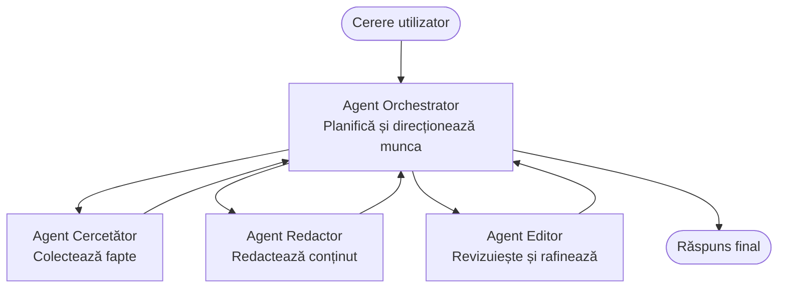

# Noțiuni de bază Multi-Agent - Desfășurați primul sistem AI coordonat

**Navigare capitol:**
- **📚 Pagina cursului**: [AZD pentru Începători](../../README.md)
- **📖 Capitolul curent**: Capitolul 5 - Soluții AI Multi-Agent
- **⬅️ Anterior**: [Chapter 4: Infrastructure](../chapter-04-infrastructure/README.md)
- **➡️ Următor**: [Coordination Patterns](../chapter-06-pre-deployment/coordination-patterns.md)

> Validat cu `azd 1.25.6` în iunie 2026.

## Introducere

În capitolele anterioare ai desfășurat o singură aplicație—și în Capitolul 2 ai desfășurat un singur agent AI. Această lecție face pasul următor: desfășurarea unui **sistem multi-agent**, în care mai mulți agenți specializați lucrează împreună pentru a rezolva o problemă pe care niciun agent singur nu ar putea să o gestioneze bine.

Vestea bună pentru începători: **nu aveți nevoie de comenzi noi.** O soluție multi-agent este tot un proiect azd. Vei rula `azd init`, `azd up`, testa și `azd down`—exact fluxul de lucru pe care îl cunoști deja. Ceea ce se schimbă este *forma* aplicației din interior.

## Obiectivele de învățare

La sfârșitul acestei lecții, vei:
- Înțelege ce înseamnă "multi-agent" și când merită complexitatea suplimentară
- Recunoaște rolurile comune într-un sistem multi-agent (orchestrator + specialiști)
- Desfășura un șablon multi-agent real, funcțional, cu `azd up`
- Înțelege resursele Azure care susțin o aplicație multi-agent
- Ști cum să verifici, personalizezi și să demontezi soluția în siguranță

## Rezultatele învățării

După finalizarea acestei lecții, vei fi capabil să:
- Explici diferența dintre un agent unic și un sistem multi-agent
- Alegi între un agent unic cu instrumente și un design multi-agent autentic
- Desfășori și testa un șablon multi-agent end-to-end cu azd
- Identifici unde rulează fiecare agent și cum comunică între ei
- Curăți toate resursele pentru a evita costuri continue

---

## Ce este un sistem multi-agent?

Un singur agent AI este un model cu un set de instrucțiuni și (opțional) unele instrumente. Asta funcționează bine pentru sarcini concentrate. Dar pe măsură ce o sarcină crește—cercetare, apoi scriere, apoi editare, apoi verificare a faptelor—încărcarea tuturor lucrurilor într-un singur prompt face agentul mai lent, mai puțin fiabil și mai dificil de depanat.

Un **sistem multi-agent** împarte munca în specialiști care fiecare îndeplinesc bine o singură sarcină, coordonați de un orchestrator:



### Cele două roluri pe care le vei vedea întotdeauna

| Rol | Sarcină | Exemplu |
|------|-----|---------|
| **Orchestrator** | Decide *ce se întâmplă în continuare* și direcționează munca între agenți | "Mai întâi cercetare, apoi scriere, apoi editare" |
| **Specialist** | Realizează o singură sarcină concentrată și returnează un rezultat | Un "cercetător" care colectează doar fapte |

### Ai nevoie cu adevărat de mai mulți agenți?

Începe simplu. Apelează la multi-agent **doar** când unul din următoarele este adevărat:

- ✅ Sarcina are **etape distincte** care beneficiază de instrucțiuni diferite (cercetare vs. scriere vs. revizuire)
- ✅ Dorești ca specialiștii să ruleze **paralel** pentru a economisi timp
- ✅ Pași diferiți necesită **instrumente sau surse de date diferite**
- ✅ Ai nevoie ca fiecare pas să fie **testabil și depanabil independent**

Dacă sarcina ta este o singură întrebare-răspuns sau un apel simplu de instrument, un **agent unic cu instrumente** (Capitolul 2) este mai simplu, mai ieftin și mai ușor de operat.

> **Sfat pentru începători:** "Mai mulți agenți" nu înseamnă "mai bine." Fiecare agent adaugă latență, cost și un nou lucru de monitorizat. Adaugă agenți doar când problema se împarte clar în părți.

---

## Două modalități de a construi sisteme multi-agent pe Azure

| Abordare | Ce este | Potrivit pentru |
|----------|-----------|----------|
| **Single agent + tools** | Un singur agent Foundry care apelează funcții/instrumente | Fluxuri de lucru simple, pentru început |
| **Multiple coordinated agents** | Mai mulți agenți cu un orchestrator | Etape distincte, muncă paralelă, specializare |

Această lecție se concentrează pe a doua abordare folosind un **șablon gata făcut**, astfel încât să poți vedea un sistem multi-agent real rulând înainte să îți construiești propriul.

---

## Practic: Desfășurați o aplicație multi-agent funcțională

Vom desfășura **Contoso Creative Writer**, un exemplu oficial Azure care folosește mai mulți agenți (cercetător, scriitor, editor) coordonați pentru a produce un articol. Este o primă aplicație multi-agent excelentă deoarece rolurile sunt ușor de înțeles.

### Pasul 1: Inițializează șablonul

```bash
# Creează un folder de lucru
mkdir creative-writer && cd creative-writer

# Inițializează din șablonul oficial multi-agent
azd init --template contoso-creative-writer
```

> Răsfoiește mai multe șabloane multi-agent oricând în [galeria Awesome AZD AI](https://azure.github.io/awesome-azd/?tags=ai). Alte opțiuni prietenoase pentru începători includ `get-started-with-ai-agents` și `azure-ai-travel-agents`.

### Pasul 2: Autentificare

```bash
# Necesare pentru fluxurile de lucru azd
azd auth login
```

### Pasul 3: Creează un mediu

```bash
azd env new dev
```

### Pasul 4: Previzualizează, apoi desfășoară

```bash
# Vezi ce va fi creat înainte de a cheltui ceva (recomandat)
azd provision --preview

# Provisionează infrastructura și instalează toți agenții într-un singur pas
azd up
```

`azd up` va solicita o subscripție și o regiune, apoi va provisiona resursele Azure și va implementa aplicația. Implementările AI pot dura mai mult decât o aplicație web simplă—dacă desfășori modele mai mari, poți extinde timpul de așteptare pentru deploy:

```bash
azd deploy --timeout 1800
```

> **Atenție la cost și capacitate:** Aplicațiile multi-agent implementează modele AI care consumă cotă și generează costuri. Dacă `azd up` eșuează din cauza cotei de model, vezi [Depanare AI](../chapter-07-troubleshooting/ai-troubleshooting.md) pentru soluții legate de regiune și cote, și Capitolul 6 [Planificarea capacității](../chapter-06-pre-deployment/capacity-planning.md).

---

## Înțelegerea a ceea ce ați desfășurat

O aplicație multi-agent tipică ca aceasta provisionează un set de resurse Azure care se map-ează direct pe responsabilitățile din diagrama de mai sus:

| Resursă | De ce este acolo |
|----------|----------------|
| **Microsoft Foundry / Models** | Găzduiește modelele de limbaj pe care le folosește fiecare agent |
| **Azure AI Search** | Oferă agentului cercetător date ancorate pentru căutare |
| **Container Apps** (or App Service) | Găzduiește orchestratorul și codul agenților |
| **Cosmos DB** (în unele exemple) | Stochează starea/memoria partajată transmisă între agenți |
| **Application Insights** | Înregistrează urmele solicitărilor *prin* agenți astfel încât să poți depana fluxul |

### Cum comunică agenții între ei

În majoritatea exemplelor azd multi-agent, **orchestratorul rulează în codul aplicației tale** (de exemplu, folosind un framework precum Semantic Kernel sau Microsoft Agent Framework). Orchestratorul apelează fiecare agent specialist pe rând, transmite rezultatele și asamblează răspunsul final. Agenții împărtășesc contextul prin:

- **Apeluri de funcții/instrumente** — orchestratorul invocă un specialist și primește un rezultat înapoi
- **Memorie partajată** — o bază de date (adesea Cosmos DB) stochează starea pe care ambele agenți o pot citi
- **Mesaje/evenimente** — pentru o cuplare mai slabă, agenții comunică printr-o coadă sau Service Bus

> **De ce contează asta pentru depanare:** pentru că fiecare pas este separat, Application Insights îți arată *care* agent a fost lent sau a eșuat. Acesta este un motiv major pentru a împărți munca între agenți.

---

## Verifică implementarea

Confirmă că sistemul funcționează înainte de a continua:

```bash
# Afișează endpoint-urile implementate
azd show

# Deschide tabloul de bord de monitorizare al aplicației
azd monitor

# Urmărește jurnalele în timp real dacă ceva pare în neregulă
azd monitor --logs
```

Apoi deschide URL-ul aplicației obținut de la `azd show` și încearcă o solicitare care să pună în funcțiune toți agenții (pentru Creative Writer, cere-i să scrie un articol scurt pe un subiect). În **transaction search** din Application Insights ar trebui să vezi solicitarea ramificându-se prin pașii cercetător, scriitor și editor.

**Criterii de succes:**
- ✅ `azd show` afișează un endpoint accesibil
- ✅ O solicitare produce un rezultat care a trecut clar prin mai multe etape
- ✅ Application Insights afișează urme pentru mai mult de un pas al agentului

---

## Personalizează: Adaugă sau ajustează un agent

Deoarece fiecare agent este doar instrucțiuni plus instrumente, personalizarea este accesibilă:

1. **Găsește definițiile agenților** în șablon (adesea un set de fișiere `prompts/`, `agents/`, sau `*.prompty`).
2. **Ajustează instrucțiunile unui agent** — de exemplu, spune agentului editor să impună un ton specific sau un număr de cuvinte.
3. **Retransmite doar codul** (infrastructura rămâne neschimbată):

   ```bash
   azd deploy
   ```

Pentru a merge mai departe și a construi agenți din propriul tău manifest, folosește extensia pentru agenți și ciclul ei complet de viață:

```bash
azd extension install azure.ai.agents
azd ai agent init -m agent-manifest.yaml
azd up
azd ai agent invoke      # test, cu măsurarea timpului de răspuns
```

Vezi [Capitolul 2: Agenți](../chapter-02-ai-development/agents.md) și [Referința AZD AI CLI](../chapter-08-production/production-ai-practices.md#azd-ai-cli-commands-and-extensions) pentru ciclul complet de viață al agentului (`invoke`, `eval generate`, `optimize`, `delete`).

---

## Curățare

Aplicațiile multi-agent rulează mai multe servicii taxabile. Elimină totul când ai terminat:

```bash
azd down --force --purge
```

Flag-ul `--purge` elimină de asemenea resursele AI marcate ca șterse logic (cum ar fi conturile Foundry/Azure AI Services) astfel încât să nu blocheze o reimplementare viitoare sau să continue să genereze costuri.

---

## O notă despre sistemele multi-agent de producție

[Soluția Multi-Agent pentru Retail](../../examples/retail-scenario.md) din acest repo este un **plan arhitectural**, nu un șablon ce se rulează cu o singură comandă—documentează cum *ar fi* construit un sistem retail de producție (și specifică explicit că o construire completă este un efort substanțial). Folosește-l ca referință de proiectare *după* ce ai desfășurat un exemplu funcțional aici. Pentru preocupări de producție (reziliență, cost, monitorizare, guvernanță), continuă cu [Capitolul 8: Practici AI de producție](../chapter-08-production/production-ai-practices.md).

---

## Rezumat

- Un sistem multi-agent împarte munca între specialiști coordonați de un orchestrator.
- Folosește-l doar când sarcina are etape distincte, paralelism sau instrumente diferite pe pas—în caz contrar preferă un agent unic.
- Fluxul de lucru azd rămâne neschimbat: `azd init` → `azd up` → test → `azd down`.
- Un șablon real precum `contoso-creative-writer` îți permite să vezi și să personalizezi azi o aplicație multi-agent funcțională.
- Urmărirea Application Insights prin agenți este unul dintre cele mai mari beneficii practice ale designului multi-agent.

---

## 🔗 Navigare

| Direcție | Lecție |
|-----------|--------|
| **Anterior** | [Chapter 4: Infrastructure](../chapter-04-infrastructure/README.md) |
| **Următor** | [Coordination Patterns](../chapter-06-pre-deployment/coordination-patterns.md) |

## 📖 Resurse conexe

- [Ghid agenți AI](../chapter-02-ai-development/agents.md)
- [Tipare de coordonare](../chapter-06-pre-deployment/coordination-patterns.md)
- [Practici AI de producție](../chapter-08-production/production-ai-practices.md)
- [Depanare AI](../chapter-07-troubleshooting/ai-troubleshooting.md)

---

<!-- CO-OP TRANSLATOR DISCLAIMER START -->
**Declinare a responsabilității**:
Acest document a fost tradus folosind serviciul de traducere AI [Co-op Translator](https://github.com/Azure/co-op-translator). În timp ce ne străduim pentru acuratețe, vă rugăm să rețineți că traducerile automate pot conține erori sau inexactități. Documentul original în limba sa nativă trebuie considerat sursa autorizată. Pentru informații critice, se recomandă traducerea profesională realizată de un om. Nu ne asumăm responsabilitatea pentru eventualele neînțelegeri sau interpretări greșite care decurg din utilizarea acestei traduceri.
<!-- CO-OP TRANSLATOR DISCLAIMER END -->