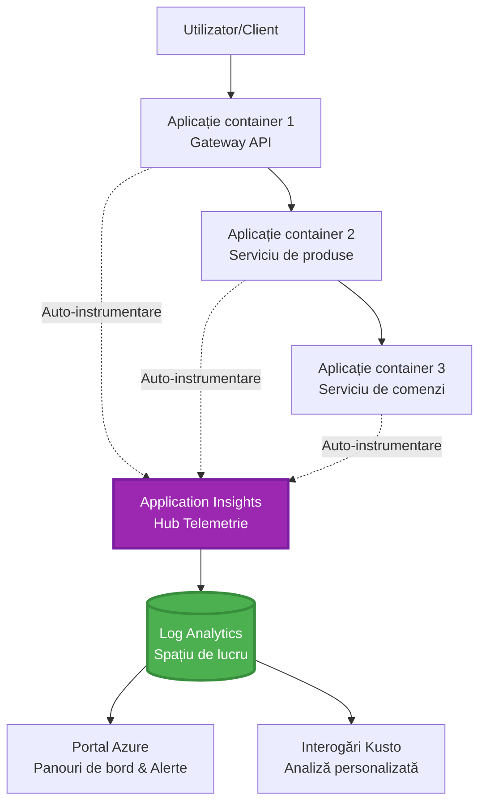
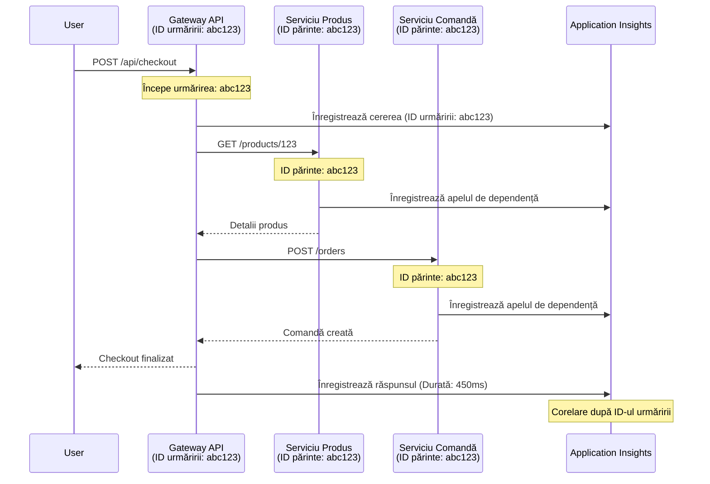

# Integrarea Application Insights cu AZD

⏱️ **Timp estimat**: 40-50 minutes | 💰 **Impact asupra costurilor**: ~\$5-15/lună | ⭐ **Complexity**: Intermediar

**📚 Parcurs de învățare:**
- ← Anterior: [Verificări prealabile](preflight-checks.md) - Validare înainte de implementare
- 🎯 **Ești aici**: Integrarea Application Insights (monitorizare, telemetrie, depanare)
- → Următor: [Ghid de implementare](../chapter-04-infrastructure/deployment-guide.md) - Implementare în Azure
- 🏠 [Pagina cursului](../../README.md)

---

## Ce vei învăța

După parcurgerea acestei lecții, vei:
- Integra automat Application Insights în proiectele AZD
- Configura tracing distribuit pentru microservicii
- Implementezi telemetrie personalizată (metrici, evenimente, dependențe)
- Configurezi Live Metrics pentru monitorizare în timp real
- Creezi alerte și tablouri de bord din implementările AZD
- Depanezi probleme din producție cu interogări de telemetrie
- Optimizezi costurile și strategiile de eșantionare
- Monitorizezi aplicații AI/LLM (tokeni, latență, costuri)

## De ce contează Application Insights cu AZD

### Provocarea: Observabilitate în producție

**Fără Application Insights:**
```
❌ No visibility into production behavior
❌ Manual log aggregation across services
❌ Reactive debugging (wait for customer complaints)
❌ No performance metrics
❌ Cannot trace requests across services
❌ Unknown failure rates and bottlenecks
```

**Cu Application Insights + AZD:**
```
✅ Automatic telemetry collection
✅ Centralized logs from all services
✅ Proactive issue detection
✅ End-to-end request tracing
✅ Performance metrics and insights
✅ Real-time dashboards
✅ AZD provisions everything automatically
```

**Analogie**: Application Insights este ca o "cutie neagră" pentru zbor + panoul de bord al cockpitului pentru aplicația ta. Vezi tot ce se întâmplă în timp real și poți revedea orice incident.

---

## Prezentare generală a arhitecturii

### Application Insights în arhitectura AZD


### Ce este monitorizat automat

| Tip Telemetrie | Ce Captură | Caz de utilizare |
|----------------|------------------|----------|
| **Requests** | Cereri HTTP, coduri de stare, durată | Monitorizarea performanței API-ului |
| **Dependencies** | Apeluri externe (DB, APIs, storage) | Identificarea blocajelor |
| **Exceptions** | Erori negestionate cu stack traces | Depanarea eșecurilor |
| **Custom Events** | Evenimente de business (signup, purchase) | Analiză și funnel-uri |
| **Metrics** | Contoare de performanță, metrici personalizate | Planificarea capacității |
| **Traces** | Mesaje de jurnal cu severitate | Depanare și audit |
| **Availability** | Uptime și teste de timp de răspuns | Monitorizare SLA |

---

## Cerințe prealabile

### Instrumente necesare

```bash
# Verificați Azure Developer CLI
azd version
# ✅ Așteptat: azd versiunea 1.0.0 sau o versiune mai nouă

# Verificați Azure CLI
az --version
# ✅ Așteptat: azure-cli 2.50.0 sau o versiune mai nouă
```

### Cerințe Azure

- Abonament Azure activ
- Permisiuni pentru a crea:
  - resurse Application Insights
  - spații de lucru Log Analytics
  - Container Apps
  - grupuri de resurse

### Cunoștințe prealabile

Ar trebui să fi finalizat:
- [Bazele AZD](../chapter-01-foundation/azd-basics.md) - Concepte fundamentale AZD
- [Configurare](../chapter-03-configuration/configuration.md) - Configurarea mediului
- [Primul proiect](../chapter-01-foundation/first-project.md) - Implementare de bază

---

## Lecția 1: Application Insights automat în AZD

### Cum alocă AZD Application Insights

AZD creează și configurează automat Application Insights atunci când implementezi. Hai să vedem cum funcționează.

### Structura proiectului

```
monitored-app/
├── azure.yaml                     # AZD configuration
├── infra/
│   ├── main.bicep                # Main infrastructure
│   ├── core/
│   │   └── monitoring.bicep      # Application Insights + Log Analytics
│   └── app/
│       └── api.bicep             # Container App with monitoring
└── src/
    ├── app.py                    # Application with telemetry
    ├── requirements.txt
    └── Dockerfile
```

---

### Pasul 1: Configurează AZD (azure.yaml)

**Fișier: `azure.yaml`**

```yaml
name: monitored-app
metadata:
  template: monitored-app@1.0.0

services:
  api:
    project: ./src
    language: python
    host: containerapp

# AZD automatically provisions monitoring!
```

**Asta e tot!** AZD va crea Application Insights implicit. Nu este nevoie de configurație suplimentară pentru monitorizarea de bază.

---

### Pasul 2: Infrastructură de monitorizare (Bicep)

**Fișier: `infra/core/monitoring.bicep`**

```bicep
param logAnalyticsName string
param applicationInsightsName string
param location string = resourceGroup().location
param tags object = {}

// Log Analytics Workspace (required for Application Insights)
resource logAnalytics 'Microsoft.OperationalInsights/workspaces@2022-10-01' = {
  name: logAnalyticsName
  location: location
  tags: tags
  properties: {
    sku: {
      name: 'PerGB2018'  // Pay-as-you-go pricing
    }
    retentionInDays: 30  // Keep logs for 30 days
    features: {
      enableLogAccessUsingOnlyResourcePermissions: true
    }
  }
}

// Application Insights
resource applicationInsights 'Microsoft.Insights/components@2020-02-02' = {
  name: applicationInsightsName
  location: location
  tags: tags
  kind: 'web'
  properties: {
    Application_Type: 'web'
    WorkspaceResourceId: logAnalytics.id
    IngestionMode: 'LogAnalytics'
    publicNetworkAccessForIngestion: 'Enabled'
    publicNetworkAccessForQuery: 'Enabled'
  }
}

// Outputs for Container Apps
output logAnalyticsWorkspaceId string = logAnalytics.id
output logAnalyticsWorkspaceName string = logAnalytics.name
output applicationInsightsConnectionString string = applicationInsights.properties.ConnectionString
output applicationInsightsInstrumentationKey string = applicationInsights.properties.InstrumentationKey
output applicationInsightsName string = applicationInsights.name
```

---

### Pasul 3: Conectează Container App la Application Insights

**Fișier: `infra/app/api.bicep`**

```bicep
param name string
param location string
param tags object = {}
param containerAppsEnvironmentName string
param applicationInsightsConnectionString string

resource containerApp 'Microsoft.App/containerApps@2023-05-01' = {
  name: name
  location: location
  tags: tags
  properties: {
    configuration: {
      ingress: {
        external: true
        targetPort: 8000
      }
      secrets: [
        {
          name: 'appinsights-connection-string'
          value: applicationInsightsConnectionString
        }
      ]
    }
    template: {
      containers: [
        {
          name: 'api'
          image: 'myregistry.azurecr.io/api:latest'
          resources: {
            cpu: json('0.5')
            memory: '1Gi'
          }
          env: [
            {
              name: 'APPLICATIONINSIGHTS_CONNECTION_STRING'
              secretRef: 'appinsights-connection-string'
            }
            {
              name: 'APPLICATIONINSIGHTS_ENABLED'
              value: 'true'
            }
          ]
        }
      ]
    }
  }
}

output uri string = 'https://${containerApp.properties.configuration.ingress.fqdn}'
```

---

### Pasul 4: Codul aplicației cu telemetrie

**Fișier: `src/app.py`**

```python
from flask import Flask, request, jsonify
from opencensus.ext.azure.log_exporter import AzureLogHandler
from opencensus.ext.azure.trace_exporter import AzureExporter
from opencensus.ext.flask.flask_middleware import FlaskMiddleware
from opencensus.trace.samplers import ProbabilitySampler
import logging
import os

app = Flask(__name__)

# Obține șirul de conexiune pentru Application Insights
connection_string = os.environ.get('APPLICATIONINSIGHTS_CONNECTION_STRING')

if connection_string:
    # Configurează trasarea distribuită
    middleware = FlaskMiddleware(
        app,
        exporter=AzureExporter(connection_string=connection_string),
        sampler=ProbabilitySampler(rate=1.0)  # Eșantionare 100% pentru dezvoltare
    )
    
    # Configurează jurnalizarea
    logger = logging.getLogger(__name__)
    logger.addHandler(AzureLogHandler(connection_string=connection_string))
    logger.setLevel(logging.INFO)
    
    print("✅ Application Insights enabled")
else:
    logger = logging.getLogger(__name__)
    logger.setLevel(logging.INFO)
    print("⚠️ Application Insights not configured")

@app.route('/health')
def health():
    logger.info('Health check endpoint called')
    return jsonify({'status': 'healthy', 'monitoring': 'enabled'})

@app.route('/api/products')
def get_products():
    logger.info('Fetching products')
    
    # Simulează apelul bazei de date (urmărit automat ca dependență)
    products = [
        {'id': 1, 'name': 'Laptop', 'price': 999.99},
        {'id': 2, 'name': 'Mouse', 'price': 29.99},
        {'id': 3, 'name': 'Keyboard', 'price': 79.99}
    ]
    
    logger.info(f'Returned {len(products)} products')
    return jsonify(products)

@app.route('/api/error-test')
def error_test():
    """Test error tracking"""
    logger.error('Testing error tracking')
    try:
        raise ValueError('This is a test exception')
    except Exception as e:
        logger.exception('Exception occurred in error-test endpoint')
        return jsonify({'error': str(e)}), 500

@app.route('/api/slow')
def slow_endpoint():
    """Test performance tracking"""
    import time
    logger.info('Slow endpoint called')
    time.sleep(3)  # Simulează o operațiune lentă
    logger.warning('Endpoint took 3 seconds to respond')
    return jsonify({'message': 'Slow operation completed'})

if __name__ == '__main__':
    app.run(host='0.0.0.0', port=8000)
```

**Fișier: `src/requirements.txt`**

```txt
Flask==3.0.0
opencensus-ext-azure==1.1.13
opencensus-ext-flask==0.8.1
gunicorn==21.2.0
```

---

### Pasul 5: Implementare și verificare

```bash
# Inițializează AZD
azd init

# Desfășoară (configurează automat Application Insights)
azd up

# Obține URL-ul aplicației
APP_URL=$(azd env get-values | grep API_URL | cut -d '=' -f2 | tr -d '"')

# Generează telemetrie
curl $APP_URL/health
curl $APP_URL/api/products
curl $APP_URL/api/error-test
curl $APP_URL/api/slow
```

**✅ Rezultat așteptat:**
```json
{
  "status": "healthy",
  "monitoring": "enabled"
}
```

---

### Pasul 6: Vizualizează telemetria în Azure Portal

```bash
# Obține detalii despre Application Insights
azd env get-values | grep APPLICATIONINSIGHTS

# Deschide în portalul Azure
az monitor app-insights component show \
  --app $(azd env get-values | grep APPLICATIONINSIGHTS_NAME | cut -d '=' -f2 | tr -d '"') \
  --resource-group $(azd env get-values | grep AZURE_RESOURCE_GROUP | cut -d '=' -f2 | tr -d '"') \
  --query "appId" -o tsv
```

**Navighează la Azure Portal → Application Insights → Căutare tranzacții**

Ar trebui să vezi:
- ✅ Cereri HTTP cu coduri de stare
- ✅ Durata cererilor (3+ secunde pentru `/api/slow`)
- ✅ Detalii despre excepții de la `/api/error-test`
- ✅ Mesaje de jurnal personalizate

---

## Lecția 2: Telemetrie și evenimente personalizate

### Urmărește evenimentele de business

Să adăugăm telemetrie personalizată pentru evenimente critice de business.

**Fișier: `src/telemetry.py`**

```python
from opencensus.ext.azure import metrics_exporter
from opencensus.stats import aggregation as aggregation_module
from opencensus.stats import measure as measure_module
from opencensus.stats import stats as stats_module
from opencensus.stats import view as view_module
from opencensus.tags import tag_map as tag_map_module
from opencensus.ext.azure.log_exporter import AzureLogHandler
from opencensus.ext.azure.trace_exporter import AzureExporter
from opencensus.trace import tracer as tracer_module
import logging
import os

class TelemetryClient:
    """Custom telemetry client for Application Insights"""
    
    def __init__(self, connection_string=None):
        self.connection_string = connection_string or os.environ.get('APPLICATIONINSIGHTS_CONNECTION_STRING')
        
        if not self.connection_string:
            print("⚠️ Application Insights connection string not found")
            return
        
        # Configurare logger
        self.logger = logging.getLogger(__name__)
        self.logger.addHandler(AzureLogHandler(connection_string=self.connection_string))
        self.logger.setLevel(logging.INFO)
        
        # Configurare exportator de metrici
        self.stats = stats_module.stats
        self.view_manager = self.stats.view_manager
        self.stats_recorder = self.stats.stats_recorder
        
        exporter = metrics_exporter.new_metrics_exporter(
            connection_string=self.connection_string
        )
        self.view_manager.register_exporter(exporter)
        
        # Configurare tracer
        self.tracer = tracer_module.Tracer(
            exporter=AzureExporter(connection_string=self.connection_string)
        )
        
        print("✅ Custom telemetry client initialized")
    
    def track_event(self, event_name: str, properties: dict = None):
        """Track custom business event"""
        properties = properties or {}
        self.logger.info(
            f"CustomEvent: {event_name}",
            extra={
                'custom_dimensions': {
                    'event_name': event_name,
                    **properties
                }
            }
        )
    
    def track_metric(self, metric_name: str, value: float, properties: dict = None):
        """Track custom metric"""
        properties = properties or {}
        self.logger.info(
            f"CustomMetric: {metric_name} = {value}",
            extra={
                'custom_dimensions': {
                    'metric_name': metric_name,
                    'value': value,
                    **properties
                }
            }
        )
    
    def track_dependency(self, name: str, dependency_type: str, duration: float, success: bool):
        """Track external dependency call"""
        with self.tracer.span(name=name) as span:
            span.add_attribute('dependency.type', dependency_type)
            span.add_attribute('duration', duration)
            span.add_attribute('success', success)

# Client global de telemetrie
telemetry = TelemetryClient()
```

### Actualizează aplicația cu evenimente personalizate

**Fișier: `src/app.py` (îmbunătățit)**

```python
from flask import Flask, request, jsonify
from telemetry import telemetry
import time
import random

app = Flask(__name__)

@app.route('/api/purchase', methods=['POST'])
def purchase():
    """Track purchase event with custom telemetry"""
    data = request.json
    product_id = data.get('product_id')
    quantity = data.get('quantity', 1)
    price = data.get('price', 0)
    
    # Urmărește eveniment de afaceri
    telemetry.track_event('Purchase', {
        'product_id': product_id,
        'quantity': quantity,
        'total_amount': price * quantity,
        'user_id': request.headers.get('X-User-Id', 'anonymous')
    })
    
    # Urmărește metrica veniturilor
    telemetry.track_metric('Revenue', price * quantity, {
        'product_id': product_id,
        'currency': 'USD'
    })
    
    return jsonify({
        'order_id': f'ORD-{random.randint(1000, 9999)}',
        'status': 'confirmed',
        'total': price * quantity
    })

@app.route('/api/search')
def search():
    """Track search queries"""
    query = request.args.get('q', '')
    
    start_time = time.time()
    
    # Simulează căutarea (ar fi o interogare reală a bazei de date)
    results = [{'id': 1, 'name': f'Result for {query}'}]
    
    duration = (time.time() - start_time) * 1000  # Convertește în ms
    
    # Urmărește eveniment de căutare
    telemetry.track_event('Search', {
        'query': query,
        'results_count': len(results),
        'duration_ms': duration
    })
    
    # Urmărește metrica de performanță a căutării
    telemetry.track_metric('SearchDuration', duration, {
        'query_length': len(query)
    })
    
    return jsonify({'results': results, 'count': len(results)})

@app.route('/api/external-call')
def external_call():
    """Track external API dependency"""
    import requests
    
    start_time = time.time()
    success = True
    
    try:
        # Simulează apel la API extern
        response = requests.get('https://api.example.com/data', timeout=5)
        result = response.json()
    except Exception as e:
        success = False
        result = {'error': str(e)}
    
    duration = (time.time() - start_time) * 1000
    
    # Urmărește dependență
    telemetry.track_dependency(
        name='ExternalAPI',
        dependency_type='HTTP',
        duration=duration,
        success=success
    )
    
    return jsonify(result)

if __name__ == '__main__':
    app.run(host='0.0.0.0', port=8000)
```

### Testează telemetria personalizată

```bash
# Urmărește evenimentul de achiziție
curl -X POST $APP_URL/api/purchase \
  -H "Content-Type: application/json" \
  -H "X-User-Id: user123" \
  -d '{"product_id": 1, "quantity": 2, "price": 29.99}'

# Urmărește evenimentul de căutare
curl "$APP_URL/api/search?q=laptop"

# Urmărește dependența externă
curl $APP_URL/api/external-call
```

**Vizualizează în Azure Portal:**

Navighează la Application Insights → Jurnale, apoi execută:

```kusto
// View purchase events
traces
| where customDimensions.event_name == "Purchase"
| project 
    timestamp,
    product_id = tostring(customDimensions.product_id),
    total_amount = todouble(customDimensions.total_amount),
    user_id = tostring(customDimensions.user_id)
| order by timestamp desc

// View revenue metrics
traces
| where customDimensions.metric_name == "Revenue"
| summarize TotalRevenue = sum(todouble(customDimensions.value)) by bin(timestamp, 1h)
| render timechart

// View search performance
traces
| where customDimensions.event_name == "Search"
| summarize 
    AvgDuration = avg(todouble(customDimensions.duration_ms)),
    SearchCount = count()
  by bin(timestamp, 5m)
| render timechart
```

---

## Lecția 3: Tracing distribuit pentru microservicii

### Activează urmărirea între servicii

Pentru microservicii, Application Insights corelează automat cererile între servicii.

**Fișier: `infra/main.bicep`**

```bicep
targetScope = 'subscription'

param environmentName string
param location string = 'eastus'

var tags = { 'azd-env-name': environmentName }

resource rg 'Microsoft.Resources/resourceGroups@2021-04-01' = {
  name: 'rg-${environmentName}'
  location: location
  tags: tags
}

// Monitoring (shared by all services)
module monitoring './core/monitoring.bicep' = {
  name: 'monitoring'
  scope: rg
  params: {
    logAnalyticsName: 'log-${environmentName}'
    applicationInsightsName: 'appi-${environmentName}'
    location: location
    tags: tags
  }
}

// API Gateway
module apiGateway './app/api-gateway.bicep' = {
  name: 'api-gateway'
  scope: rg
  params: {
    name: 'ca-gateway-${environmentName}'
    location: location
    tags: union(tags, { 'azd-service-name': 'gateway' })
    applicationInsightsConnectionString: monitoring.outputs.applicationInsightsConnectionString
  }
}

// Product Service
module productService './app/product-service.bicep' = {
  name: 'product-service'
  scope: rg
  params: {
    name: 'ca-products-${environmentName}'
    location: location
    tags: union(tags, { 'azd-service-name': 'products' })
    applicationInsightsConnectionString: monitoring.outputs.applicationInsightsConnectionString
  }
}

// Order Service
module orderService './app/order-service.bicep' = {
  name: 'order-service'
  scope: rg
  params: {
    name: 'ca-orders-${environmentName}'
    location: location
    tags: union(tags, { 'azd-service-name': 'orders' })
    applicationInsightsConnectionString: monitoring.outputs.applicationInsightsConnectionString
  }
}

output APPLICATIONINSIGHTS_CONNECTION_STRING string = monitoring.outputs.applicationInsightsConnectionString
output GATEWAY_URL string = apiGateway.outputs.uri
```

### Vizualizează tranzacția end-to-end


**Interoghează trasarea end-to-end:**

```kusto
// Find complete request flow
let traceId = "abc123...";  // Get from response header
dependencies
| union requests
| where operation_Id == traceId
| project 
    timestamp,
    type = itemType,
    name,
    duration,
    success,
    cloud_RoleName
| order by timestamp asc
```

---

## Lecția 4: Live Metrics și monitorizare în timp real

### Activează fluxul Live Metrics

Live Metrics oferă telemetrie în timp real cu latență <1 secundă.

**Accesează Live Metrics:**

```bash
# Obține resursa Application Insights
APPI_NAME=$(azd env get-values | grep APPLICATIONINSIGHTS_NAME | cut -d '=' -f2 | tr -d '"')

# Obține grupul de resurse
RG_NAME=$(azd env get-values | grep AZURE_RESOURCE_GROUP | cut -d '=' -f2 | tr -d '"')

echo "Navigate to: Azure Portal → Resource Groups → $RG_NAME → $APPI_NAME → Live Metrics"
```

**Ce vezi în timp real:**
- ✅ Rata de intrare a cererilor (cereri/sec)
- ✅ Apeluri de dependență ieșitoare
- ✅ Număr de excepții
- ✅ Utilizare CPU și memorie
- ✅ Număr de servere active
- ✅ Telemetrie eșantionată

### Generează încărcare pentru testare

```bash
# Generați încărcare pentru a vedea metricile în timp real
for i in {1..100}; do
  curl $APP_URL/api/products &
  curl $APP_URL/api/search?q=test$i &
done

# Vizualizați metricile în timp real în portalul Azure
# Ar trebui să vedeți un vârf al ratei cererilor
```

---

## Exerciții practice

### Exercițiul 1: Configurează alerte ⭐⭐ (Mediu)

**Obiectiv**: Creează alerte pentru rate mari de erori și răspunsuri lente.

**Pași:**

1. **Creează o alertă pentru rata de erori:**

```bash
# Obține ID-ul resursei Application Insights
APPI_ID=$(az monitor app-insights component show \
  --app $APPI_NAME \
  --resource-group $RG_NAME \
  --query "id" -o tsv)

# Creează o alertă metrică pentru cereri eșuate
az monitor metrics alert create \
  --name "High-Error-Rate" \
  --resource-group $RG_NAME \
  --scopes $APPI_ID \
  --condition "count requests/failed > 10" \
  --window-size 5m \
  --evaluation-frequency 1m \
  --description "Alert when error rate exceeds 10 per 5 minutes"
```

2. **Creează o alertă pentru răspunsuri lente:**

```bash
az monitor metrics alert create \
  --name "Slow-Responses" \
  --resource-group $RG_NAME \
  --scopes $APPI_ID \
  --condition "avg requests/duration > 3000" \
  --window-size 5m \
  --evaluation-frequency 1m \
  --description "Alert when average response time exceeds 3 seconds"
```

3. **Creează alerta prin Bicep (preferat pentru AZD):**

**Fișier: `infra/core/alerts.bicep`**

```bicep
param applicationInsightsId string
param actionGroupId string = ''
param location string = resourceGroup().location

// High error rate alert
resource errorRateAlert 'Microsoft.Insights/metricAlerts@2018-03-01' = {
  name: 'high-error-rate'
  location: 'global'
  properties: {
    description: 'Alert when error rate exceeds threshold'
    severity: 2
    enabled: true
    scopes: [
      applicationInsightsId
    ]
    evaluationFrequency: 'PT1M'
    windowSize: 'PT5M'
    criteria: {
      'odata.type': 'Microsoft.Azure.Monitor.SingleResourceMultipleMetricCriteria'
      allOf: [
        {
          name: 'Error rate'
          metricName: 'requests/failed'
          operator: 'GreaterThan'
          threshold: 10
          timeAggregation: 'Count'
        }
      ]
    }
    actions: actionGroupId != '' ? [
      {
        actionGroupId: actionGroupId
      }
    ] : []
  }
}

// Slow response alert
resource slowResponseAlert 'Microsoft.Insights/metricAlerts@2018-03-01' = {
  name: 'slow-responses'
  location: 'global'
  properties: {
    description: 'Alert when response time is too high'
    severity: 3
    enabled: true
    scopes: [
      applicationInsightsId
    ]
    evaluationFrequency: 'PT1M'
    windowSize: 'PT5M'
    criteria: {
      'odata.type': 'Microsoft.Azure.Monitor.SingleResourceMultipleMetricCriteria'
      allOf: [
        {
          name: 'Response duration'
          metricName: 'requests/duration'
          operator: 'GreaterThan'
          threshold: 3000
          timeAggregation: 'Average'
        }
      ]
    }
  }
}

output errorAlertId string = errorRateAlert.id
output slowResponseAlertId string = slowResponseAlert.id
```

4. **Testează alertele:**

```bash
# Generează erori
for i in {1..20}; do
  curl $APP_URL/api/error-test
done

# Generează răspunsuri lente
for i in {1..10}; do
  curl $APP_URL/api/slow
done

# Verifică starea alertei (așteaptă 5-10 minute)
az monitor metrics alert list \
  --resource-group $RG_NAME \
  --query "[].{Name:name, Enabled:enabled, State:properties.enabled}" \
  --output table
```

**✅ Criterii de succes:**
- ✅ Alerte create cu succes
- ✅ Alertele se declanșează când pragurile sunt depășite
- ✅ Poți vizualiza istoricul alertelor în Azure Portal
- ✅ Integrat cu implementarea AZD

**Timp**: 20-25 minute

---

### Exercițiul 2: Creează un tablou de bord personalizat ⭐⭐ (Mediu)

**Obiectiv**: Construiește un tablou de bord care afișează metricile cheie ale aplicației.

**Pași:**

1. **Creează tablou de bord prin Azure Portal:**

Navighează la: Azure Portal → Tablouri de bord → Tablou de bord nou

2. **Adaugă componente pentru metricile cheie:**

- Număr de cereri (ultimele 24 de ore)
- Timp mediu de răspuns
- Rata de erori
- Top 5 operațiuni cele mai lente
- Distribuția geografică a utilizatorilor

3. **Creează tablou de bord prin Bicep:**

**Fișier: `infra/core/dashboard.bicep`**

```bicep
param dashboardName string
param applicationInsightsId string
param location string = resourceGroup().location

resource dashboard 'Microsoft.Portal/dashboards@2020-09-01-preview' = {
  name: dashboardName
  location: location
  properties: {
    lenses: [
      {
        order: 0
        parts: [
          // Request count
          {
            position: { x: 0, y: 0, rowSpan: 4, colSpan: 6 }
            metadata: {
              type: 'Extension/Microsoft_OperationsManagementSuite_Workspace/PartType/LogsDashboardPart'
              inputs: [
                {
                  name: 'resourceId'
                  value: applicationInsightsId
                }
                {
                  name: 'query'
                  value: '''
                    requests
                    | summarize RequestCount = count() by bin(timestamp, 1h)
                    | render timechart
                  '''
                }
              ]
            }
          }
          // Error rate
          {
            position: { x: 6, y: 0, rowSpan: 4, colSpan: 6 }
            metadata: {
              type: 'Extension/Microsoft_OperationsManagementSuite_Workspace/PartType/LogsDashboardPart'
              inputs: [
                {
                  name: 'resourceId'
                  value: applicationInsightsId
                }
                {
                  name: 'query'
                  value: '''
                    requests
                    | summarize 
                        Total = count(),
                        Failed = countif(success == false)
                    | extend ErrorRate = (Failed * 100.0) / Total
                    | project ErrorRate
                  '''
                }
              ]
            }
          }
        ]
      }
    ]
  }
}

output dashboardId string = dashboard.id
```

4. **Implementează tablou de bord:**

```bash
# Adaugă în main.bicep
module dashboard './core/dashboard.bicep' = {
  name: 'dashboard'
  scope: rg
  params: {
    dashboardName: 'dashboard-${environmentName}'
    applicationInsightsId: monitoring.outputs.applicationInsightsId
    location: location
  }
}

# Desfășoară
azd up
```

**✅ Criterii de succes:**
- ✅ Tabloul de bord afișează metricile cheie
- ✅ Poți fixa pe pagina principală Azure Portal
- ✅ Se actualizează în timp real
- ✅ Deplasabil prin AZD

**Timp**: 25-30 minute

---

### Exercițiul 3: Monitorizează aplicația AI/LLM ⭐⭐⭐ (Avansat)

**Obiectiv**: Monitorizează utilizarea Azure OpenAI (tokeni, costuri, latență).

**Pași:**

1. **Creează un wrapper pentru monitorizarea AI:**

**Fișier: `src/ai_telemetry.py`**

```python
from telemetry import telemetry
from openai import AzureOpenAI
import time

class MonitoredAzureOpenAI:
    """Azure OpenAI client with automatic telemetry"""
    
    def __init__(self, api_key, endpoint, api_version="2024-02-01"):
        self.client = AzureOpenAI(
            api_key=api_key,
            api_version=api_version,
            azure_endpoint=endpoint
        )
    
    def chat_completion(self, model: str, messages: list, **kwargs):
        """Track chat completion with telemetry"""
        start_time = time.time()
        
        try:
            # Apelează Azure OpenAI
            response = self.client.chat.completions.create(
                model=model,
                messages=messages,
                **kwargs
            )
            
            duration = (time.time() - start_time) * 1000  # ms
            
            # Extrage utilizarea
            usage = response.usage
            prompt_tokens = usage.prompt_tokens
            completion_tokens = usage.completion_tokens
            total_tokens = usage.total_tokens
            
            # Calculează costul (tarifare GPT-4)
            prompt_cost = (prompt_tokens / 1000) * 0.03  # $0.03 pentru 1K de tokeni
            completion_cost = (completion_tokens / 1000) * 0.06  # $0.06 pentru 1K de tokeni
            total_cost = prompt_cost + completion_cost
            
            # Urmărește eveniment personalizat
            telemetry.track_event('OpenAI_Request', {
                'model': model,
                'prompt_tokens': prompt_tokens,
                'completion_tokens': completion_tokens,
                'total_tokens': total_tokens,
                'duration_ms': duration,
                'cost_usd': total_cost,
                'success': True
            })
            
            # Urmărește metrici
            telemetry.track_metric('OpenAI_Tokens', total_tokens, {
                'model': model,
                'type': 'total'
            })
            
            telemetry.track_metric('OpenAI_Cost', total_cost, {
                'model': model,
                'currency': 'USD'
            })
            
            telemetry.track_metric('OpenAI_Duration', duration, {
                'model': model
            })
            
            return response
            
        except Exception as e:
            duration = (time.time() - start_time) * 1000
            
            telemetry.track_event('OpenAI_Request', {
                'model': model,
                'duration_ms': duration,
                'success': False,
                'error': str(e)
            })
            
            raise
```

2. **Folosește clientul monitorizat:**

```python
from flask import Flask, request, jsonify
from ai_telemetry import MonitoredAzureOpenAI
import os

app = Flask(__name__)

# Inițializează clientul OpenAI monitorizat
openai_client = MonitoredAzureOpenAI(
    api_key=os.environ['AZURE_OPENAI_API_KEY'],
    endpoint=os.environ['AZURE_OPENAI_ENDPOINT']
)

@app.route('/api/chat', methods=['POST'])
def chat():
    data = request.json
    user_message = data.get('message')
    
    # Apel cu monitorizare automată
    response = openai_client.chat_completion(
        model='gpt-4',
        messages=[
            {'role': 'user', 'content': user_message}
        ]
    )
    
    return jsonify({
        'response': response.choices[0].message.content,
        'tokens': response.usage.total_tokens
    })
```

3. **Interoghează metricile AI:**

```kusto
// Total AI spend over time
traces
| where customDimensions.event_name == "OpenAI_Request"
| where customDimensions.success == "True"
| summarize TotalCost = sum(todouble(customDimensions.cost_usd)) by bin(timestamp, 1h)
| render timechart

// Token usage by model
traces
| where customDimensions.event_name == "OpenAI_Request"
| summarize 
    TotalTokens = sum(toint(customDimensions.total_tokens)),
    RequestCount = count()
  by Model = tostring(customDimensions.model)

// Average latency
traces
| where customDimensions.event_name == "OpenAI_Request"
| summarize AvgDuration = avg(todouble(customDimensions.duration_ms))
| project AvgDurationSeconds = AvgDuration / 1000

// Cost per request
traces
| where customDimensions.event_name == "OpenAI_Request"
| extend Cost = todouble(customDimensions.cost_usd)
| summarize 
    TotalCost = sum(Cost),
    RequestCount = count(),
    AvgCostPerRequest = avg(Cost)
```

**✅ Criterii de succes:**
- ✅ Fiecare apel OpenAI este urmărit automat
- ✅ Utilizarea tokenilor și costurile sunt vizibile
- ✅ Latența este monitorizată
- ✅ Poți seta alerte bugetare

**Timp**: 35-45 minute

---

## Optimizarea costurilor

### Strategii de eșantionare

Controlează costurile prin eșantionarea telemetriei:

```python
from opencensus.trace.samplers import ProbabilitySampler

# Dezvoltare: eșantionare 100%
sampler = ProbabilitySampler(rate=1.0)

# Producție: eșantionare 10% (reduce costurile cu 90%)
sampler = ProbabilitySampler(rate=0.1)

# Eșantionare adaptivă (se ajustează automat)
from opencensus.trace.samplers import AdaptiveSampler
sampler = AdaptiveSampler()
```

**În Bicep:**

```bicep
resource applicationInsights 'Microsoft.Insights/components@2020-02-02' = {
  name: applicationInsightsName
  properties: {
    SamplingPercentage: 10  // 10% sampling
  }
}
```

### Retenția datelor

```bicep
resource logAnalytics 'Microsoft.OperationalInsights/workspaces@2022-10-01' = {
  name: logAnalyticsName
  properties: {
    retentionInDays: 30  // Minimum (cheapest)
    // Options: 30, 31, 60, 90, 120, 180, 270, 365, 550, 730
  }
}
```

### Estimări lunare de cost

| Volum de date | Retenție | Cost lunar |
|-------------|-----------|--------------|
| 1 GB/lună | 30 zile | ~\$2-5 |
| 5 GB/lună | 30 zile | ~\$10-15 |
| 10 GB/lună | 90 zile | ~\$25-40 |
| 50 GB/lună | 90 zile | ~\$100-150 |

**Nivel gratuit**: 5 GB/lună inclus

---

## Punct de verificare a cunoștințelor

### 1. Integrare de bază ✓

Verifică-ți înțelegerea:

- [ ] **Întrebarea 1**: Cum alocă AZD Application Insights?
  - **R**: Automat, prin șabloane Bicep în `infra/core/monitoring.bicep`

- [ ] **Întrebarea 2**: Ce variabilă de mediu activează Application Insights?
  - **R**: `APPLICATIONINSIGHTS_CONNECTION_STRING`

- [ ] **Întrebarea 3**: Care sunt cele trei tipuri principale de telemetrie?
  - **R**: Cereri (apeluri HTTP), Dependențe (apeluri externe), Excepții (erori)

**Verificare practică:**
```bash
# Verifică dacă Application Insights este configurat
azd env get-values | grep APPLICATIONINSIGHTS

# Verifică dacă telemetria este transmisă
az monitor app-insights metrics show \
  --app $APPI_NAME \
  --resource-group $RG_NAME \
  --metric "requests/count"
```

---

### 2. Telemetrie personalizată ✓

Verifică-ți înțelegerea:

- [ ] **Întrebarea 1**: Cum urmărești evenimentele de business personalizate?
  - **R**: Folosește logger cu `custom_dimensions` sau `TelemetryClient.track_event()`

- [ ] **Întrebarea 2**: Care este diferența între evenimente și metrici?
  - **R**: Evenimentele sunt ocurențe discrete, metricile sunt măsurători numerice

- [ ] **Întrebarea 3**: Cum corelezi telemetria între servicii?
  - **R**: Application Insights folosește automat `operation_Id` pentru corelare

**Verificare practică:**
```kusto
// Verify custom events
traces
| where customDimensions.event_name != ""
| summarize count() by tostring(customDimensions.event_name)
```

---

### 3. Monitorizare în producție ✓

Verifică-ți înțelegerea:

- [ ] **Întrebarea 1**: Ce este eșantionarea și de ce să o folosești?
  - **R**: Eșantionarea reduce volumul de date (și costul) prin capturarea doar a unui procent din telemetrie

- [ ] **Întrebarea 2**: Cum configurezi alertele?
  - **R**: Folosește alerte pe metrici în Bicep sau Azure Portal bazate pe metricile Application Insights

- [ ] **Întrebarea 3**: Care e diferența între Log Analytics și Application Insights?
  - **R**: Application Insights stochează datele într-un workspace Log Analytics; App Insights oferă vizualizări specifice aplicației

**Verificare practică:**
```bash
# Verifică configurația de eșantionare
az monitor app-insights component show \
  --app $APPI_NAME \
  --resource-group $RG_NAME \
  --query "properties.SamplingPercentage"
```

---

## Bune practici

### ✅ CE SĂ FACI:

1. **Folosește ID-uri de corelare**
   ```python
   logger.info('Processing order', extra={
       'custom_dimensions': {
           'order_id': order_id,
           'user_id': user_id
       }
   })
   ```

2. **Configurează alerte pentru metricile critice**
   ```bicep
   // Error rate, slow responses, availability
   ```

3. **Folosește jurnalizare structurată**
   ```python
   # ✅ BUN: Structurat
   logger.info('User signup', extra={'custom_dimensions': {'user_id': 123}})
   
   # ❌ RĂU: Nestructurat
   logger.info(f'User 123 signed up')
   ```

4. **Monitorizează dependențele**
   ```python
   # Urmărește automat apelurile la baza de date, cererile HTTP etc.
   ```

5. **Folosește Live Metrics în timpul implementărilor**

### ❌ CE SĂ NU FACI:

1. **Nu loga date sensibile**
   ```python
   # ❌ RĂU
   logger.info(f'Login: {username}:{password}')
   
   # ✅ BUN
   logger.info('Login attempt', extra={'custom_dimensions': {'username': username}})
   ```

2. **Nu folosi eșantionare 100% în producție**
   ```python
   # ❌ Scump
   sampler = ProbabilitySampler(rate=1.0)
   
   # ✅ Rentabil
   sampler = ProbabilitySampler(rate=0.1)
   ```

3. **Nu ignora cozile dead-letter**

4. **Nu uita să setezi limite pentru retenția datelor**

---

## Depanare

### Problema: Nu apare telemetria

**Diagnostic:**
```bash
# Verificați dacă șirul de conectare este setat
azd env get-values | grep APPLICATIONINSIGHTS

# Verificați jurnalele aplicației prin Azure Monitor
azd monitor --logs

# Sau folosiți Azure CLI pentru Container Apps:
az containerapp logs show --name $APP_NAME --resource-group $RG_NAME --tail 50
```

**Soluție:**
```bash
# Verificați șirul de conexiune în Container App
az containerapp show \
  --name $APP_NAME \
  --resource-group $RG_NAME \
  --query "properties.template.containers[0].env" \
  | grep -i applicationinsights
```

---

### Problema: Costuri ridicate

**Diagnostic:**
```bash
# Verificați ingestia datelor
az monitor app-insights metrics show \
  --app $APPI_NAME \
  --resource-group $RG_NAME \
  --metric "availabilityResults/count"
```

**Soluție:**
- Redu rata de eșantionare
- Scade perioada de retenție
- Elimină jurnalizarea detaliată

---

## Află mai multe

### Documentație oficială
- [Prezentare generală Application Insights](https://learn.microsoft.com/azure/azure-monitor/app/app-insights-overview)
- [Application Insights pentru Python](https://learn.microsoft.com/azure/azure-monitor/app/opencensus-python)
- [Limbajul de interogare Kusto](https://learn.microsoft.com/azure/data-explorer/kusto/query/)
- [Monitorizare AZD](https://learn.microsoft.com/azure/developer/azure-developer-cli/monitor-your-app)

### Următorii pași în acest curs
- ← Anterior: [Verificări prealabile](preflight-checks.md)
- → Următor: [Ghid de implementare](../chapter-04-infrastructure/deployment-guide.md)
- 🏠 [Pagina cursului](../../README.md)

### Exemple conexe
- [Exemplu Azure OpenAI](../../../../examples/azure-openai-chat) - Telemetrie AI
- [Exemplu Microservicii](../../../../examples/microservices) - Tracing distribuit

---

## Rezumat

**Ai învățat:**
- ✅ Provizionare automată a Application Insights cu AZD
- ✅ Telemetrie personalizată (evenimente, metrici, dependențe)
- ✅ Tracing distribuit între microservicii
- ✅ Metrici în timp real și monitorizare în timp real
- ✅ Alerte și tablouri de bord
- ✅ Monitorizarea aplicațiilor AI/LLM
- ✅ Strategii de optimizare a costurilor

**Puncte cheie:**
1. **AZD configurează monitorizarea în mod automat** - Fără configurare manuală
2. **Utilizați logarea structurată** - Facilitează interogările
3. **Urmăriți evenimentele de business** - Nu doar metrici tehnice
4. **Monitorizați costurile AI** - Urmăriți tokenii și cheltuielile
5. **Configurați alertele** - Fiți proactiv, nu reactiv
6. **Optimizați costurile** - Utilizați eșantionare și limite de retenție

**Pașii următori:**
1. Finalizați exercițiile practice
2. Adăugați Application Insights la proiectele dvs. AZD
3. Creați tablouri de bord personalizate pentru echipa dvs.
4. Consultați [Ghidul de implementare](../chapter-04-infrastructure/deployment-guide.md)

---

<!-- CO-OP TRANSLATOR DISCLAIMER START -->
**Declinare de responsabilitate**:
Acest document a fost tradus folosind serviciul de traducere AI [Co-op Translator](https://github.com/Azure/co-op-translator). Deși ne străduim pentru acuratețe, vă rugăm să rețineți că traducerile automate pot conține erori sau inexactități. Documentul original în limba sa nativă trebuie considerat sursa autorizată. Pentru informații critice, se recomandă o traducere profesională realizată de un traducător uman. Nu ne asumăm răspunderea pentru eventualele neînțelegeri sau interpretări greșite care pot rezulta din utilizarea acestei traduceri.
<!-- CO-OP TRANSLATOR DISCLAIMER END -->