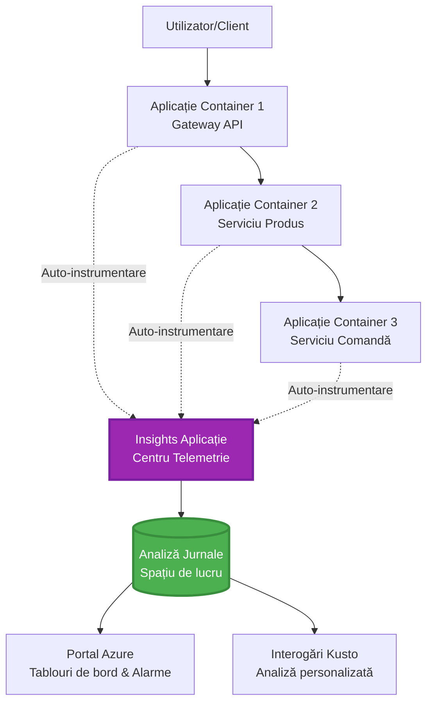
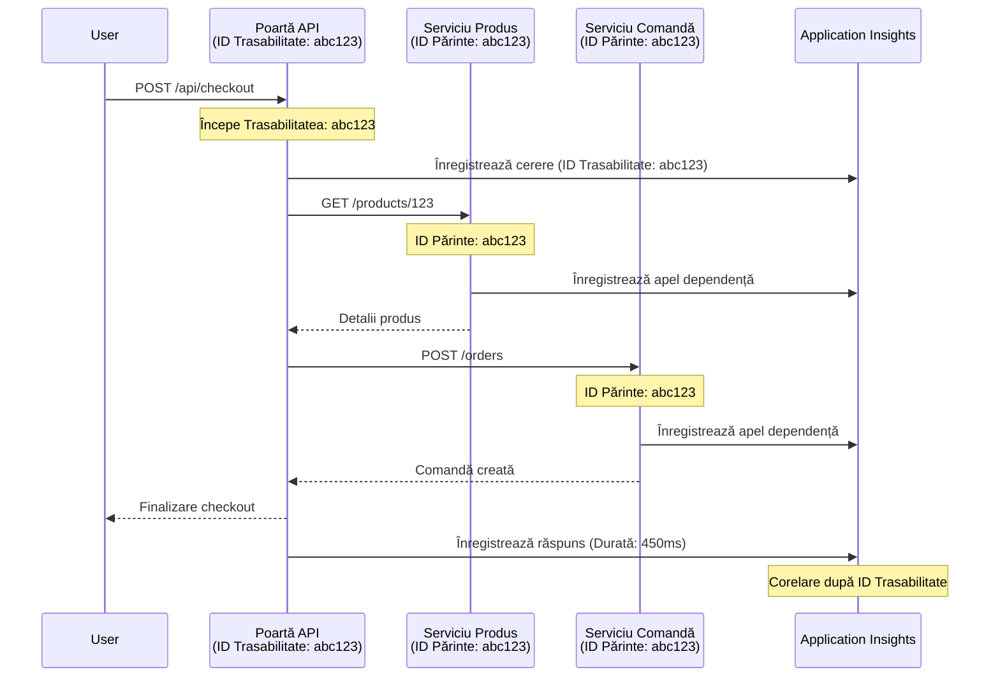

# Integrarea Application Insights cu AZD

⏱️ **Timp estimat**: 40-50 minute | 💰 **Impact costuri**: ~5-15$/lună | ⭐ **Complexitate**: Intermediar

**📚 Curs de învățare:**
- ← Anterior: [Preflight Checks](preflight-checks.md) - Validarea pre-deployment
- 🎯 **Ești aici**: Integrarea Application Insights (Monitorizare, telemetrie, depanare)
- → Următor: [Deployment Guide](../chapter-04-infrastructure/deployment-guide.md) - Deploy pe Azure
- 🏠 [Acasă curs](../../README.md)

---

## Ce vei învăța

Prin parcurgerea acestei lecții, vei:
- Integra automat **Application Insights** în proiectele AZD
- Configura **tracing distribuit** pentru microservicii
- Implementa **telemetrie personalizată** (metrici, evenimente, dependențe)
- Configura **live metrics** pentru monitorizare în timp real
- Crea **alerte și dashboard-uri** din deploy-urile AZD
- Depana probleme de producție cu **interogări de telemetrie**
- Optimiza **costuri și strategii de sampling**
- Monitoriza **aplicații AI/LLM** (tokeni, latență, costuri)

## De ce este important Application Insights cu AZD

### Provocarea: Observabilitatea în producție

**Fără Application Insights:**
```
❌ No visibility into production behavior
❌ Manual log aggregation across services
❌ Reactive debugging (wait for customer complaints)
❌ No performance metrics
❌ Cannot trace requests across services
❌ Unknown failure rates and bottlenecks
```

**Cu Application Insights + AZD:**
```
✅ Automatic telemetry collection
✅ Centralized logs from all services
✅ Proactive issue detection
✅ End-to-end request tracing
✅ Performance metrics and insights
✅ Real-time dashboards
✅ AZD provisions everything automatically
```

**Analogie**: Application Insights este ca o cutie neagră + bordul de pilotaj al aplicației tale. Vezi tot ce se întâmplă în timp real și poți revedea orice incident.

---

## Prezentare arhitectură

### Application Insights în arhitectura AZD


### Ce se monitorizează automat

| Tip telemetrie | Ce capturează | Utilizare |
|----------------|---------------|-----------|
| **Requests** | Cereri HTTP, coduri status, durată | Monitorizare performanță API |
| **Dependencies** | Apeluri externe (BD, API-uri, stocare) | Identificare blocaje |
| **Exceptions** | Erori necontrolate cu stack trace | Depanare defecte |
| **Custom Events** | Evenimente business (înregistrare, cumpărare) | Analize și conversii |
| **Metrics** | Contoare performanță, metrici personalizate | Planificare capacitate |
| **Traces** | Mesaje log cu severitate | Depanare și audit |
| **Availability** | Teste uptime și timp răspuns | Monitorizare SLA |

---

## Cerințe preliminare

### Unelte necesare

```bash
# Verifică Azure Developer CLI
azd version
# ✅ Așteptat: azd versiunea 1.0.0 sau mai mare

# Verifică Azure CLI
az --version
# ✅ Așteptat: azure-cli 2.50.0 sau mai mare
```

### Cerințe Azure

- Abonament Azure activ
- Permisiuni pentru a crea:
  - Resurse Application Insights
  - Workspace-uri Log Analytics
  - Container Apps
  - Grupuri de resurse

### Cunoștințe necesare

Trebuie să fi parcurs:
- [Bazele AZD](../chapter-01-foundation/azd-basics.md) - Concept AZD fundamentale
- [Configurare](../chapter-03-configuration/configuration.md) - Setare mediu
- [Primul proiect](../chapter-01-foundation/first-project.md) - Deploy de bază

---

## Lecția 1: Application Insights automat cu AZD

### Cum alocă AZD Application Insights

AZD creează și configurează automat Application Insights când faci deploy. Hai să vedem cum.

### Structura proiectului

```
monitored-app/
├── azure.yaml                     # AZD configuration
├── infra/
│   ├── main.bicep                # Main infrastructure
│   ├── core/
│   │   └── monitoring.bicep      # Application Insights + Log Analytics
│   └── app/
│       └── api.bicep             # Container App with monitoring
└── src/
    ├── app.py                    # Application with telemetry
    ├── requirements.txt
    └── Dockerfile
```

---

### Pasul 1: Configurare AZD (azure.yaml)

**Fișier: `azure.yaml`**

```yaml
name: monitored-app
metadata:
  template: monitored-app@1.0.0

services:
  api:
    project: ./src
    language: python
    host: containerapp

# AZD automatically provisions monitoring!
```

**Asta e tot!** AZD va crea implicit Application Insights. Nu ai nevoie de configurări suplimentare pentru monitorizare de bază.

---

### Pasul 2: Infrastructura monitorizare (Bicep)

**Fișier: `infra/core/monitoring.bicep`**

```bicep
param logAnalyticsName string
param applicationInsightsName string
param location string = resourceGroup().location
param tags object = {}

// Log Analytics Workspace (required for Application Insights)
resource logAnalytics 'Microsoft.OperationalInsights/workspaces@2022-10-01' = {
  name: logAnalyticsName
  location: location
  tags: tags
  properties: {
    sku: {
      name: 'PerGB2018'  // Pay-as-you-go pricing
    }
    retentionInDays: 30  // Keep logs for 30 days
    features: {
      enableLogAccessUsingOnlyResourcePermissions: true
    }
  }
}

// Application Insights
resource applicationInsights 'Microsoft.Insights/components@2020-02-02' = {
  name: applicationInsightsName
  location: location
  tags: tags
  kind: 'web'
  properties: {
    Application_Type: 'web'
    WorkspaceResourceId: logAnalytics.id
    IngestionMode: 'LogAnalytics'
    publicNetworkAccessForIngestion: 'Enabled'
    publicNetworkAccessForQuery: 'Enabled'
  }
}

// Outputs for Container Apps
output logAnalyticsWorkspaceId string = logAnalytics.id
output logAnalyticsWorkspaceName string = logAnalytics.name
output applicationInsightsConnectionString string = applicationInsights.properties.ConnectionString
output applicationInsightsInstrumentationKey string = applicationInsights.properties.InstrumentationKey
output applicationInsightsName string = applicationInsights.name
```

---

### Pasul 3: Conectează Container App la Application Insights

**Fișier: `infra/app/api.bicep`**

```bicep
param name string
param location string
param tags object = {}
param containerAppsEnvironmentName string
param applicationInsightsConnectionString string

resource containerApp 'Microsoft.App/containerApps@2023-05-01' = {
  name: name
  location: location
  tags: tags
  properties: {
    configuration: {
      ingress: {
        external: true
        targetPort: 8000
      }
      secrets: [
        {
          name: 'appinsights-connection-string'
          value: applicationInsightsConnectionString
        }
      ]
    }
    template: {
      containers: [
        {
          name: 'api'
          image: 'myregistry.azurecr.io/api:latest'
          resources: {
            cpu: json('0.5')
            memory: '1Gi'
          }
          env: [
            {
              name: 'APPLICATIONINSIGHTS_CONNECTION_STRING'
              secretRef: 'appinsights-connection-string'
            }
            {
              name: 'APPLICATIONINSIGHTS_ENABLED'
              value: 'true'
            }
          ]
        }
      ]
    }
  }
}

output uri string = 'https://${containerApp.properties.configuration.ingress.fqdn}'
```

---

### Pasul 4: Cod aplicație cu telemetrie

**Fișier: `src/app.py`**

```python
from flask import Flask, request, jsonify
from opencensus.ext.azure.log_exporter import AzureLogHandler
from opencensus.ext.azure.trace_exporter import AzureExporter
from opencensus.ext.flask.flask_middleware import FlaskMiddleware
from opencensus.trace.samplers import ProbabilitySampler
import logging
import os

app = Flask(__name__)

# Obțineți șirul de conexiune Application Insights
connection_string = os.environ.get('APPLICATIONINSIGHTS_CONNECTION_STRING')

if connection_string:
    # Configurați trasarea distribuită
    middleware = FlaskMiddleware(
        app,
        exporter=AzureExporter(connection_string=connection_string),
        sampler=ProbabilitySampler(rate=1.0)  # Eșantionare 100% pentru dezvoltare
    )
    
    # Configurați jurnalizarea
    logger = logging.getLogger(__name__)
    logger.addHandler(AzureLogHandler(connection_string=connection_string))
    logger.setLevel(logging.INFO)
    
    print("✅ Application Insights enabled")
else:
    logger = logging.getLogger(__name__)
    logger.setLevel(logging.INFO)
    print("⚠️ Application Insights not configured")

@app.route('/health')
def health():
    logger.info('Health check endpoint called')
    return jsonify({'status': 'healthy', 'monitoring': 'enabled'})

@app.route('/api/products')
def get_products():
    logger.info('Fetching products')
    
    # Simulați apelul bazei de date (urmărit automat ca dependență)
    products = [
        {'id': 1, 'name': 'Laptop', 'price': 999.99},
        {'id': 2, 'name': 'Mouse', 'price': 29.99},
        {'id': 3, 'name': 'Keyboard', 'price': 79.99}
    ]
    
    logger.info(f'Returned {len(products)} products')
    return jsonify(products)

@app.route('/api/error-test')
def error_test():
    """Test error tracking"""
    logger.error('Testing error tracking')
    try:
        raise ValueError('This is a test exception')
    except Exception as e:
        logger.exception('Exception occurred in error-test endpoint')
        return jsonify({'error': str(e)}), 500

@app.route('/api/slow')
def slow_endpoint():
    """Test performance tracking"""
    import time
    logger.info('Slow endpoint called')
    time.sleep(3)  # Simulați o operațiune lentă
    logger.warning('Endpoint took 3 seconds to respond')
    return jsonify({'message': 'Slow operation completed'})

if __name__ == '__main__':
    app.run(host='0.0.0.0', port=8000)
```

**Fișier: `src/requirements.txt`**

```txt
Flask==3.0.0
opencensus-ext-azure==1.1.13
opencensus-ext-flask==0.8.1
gunicorn==21.2.0
```

---

### Pasul 5: Deploy și verificare

```bash
# Inițializează AZD
azd init

# Implementare (provoacă configurarea automată a Application Insights)
azd up

# Obține URL-ul aplicației
APP_URL=$(azd env get-values | grep API_URL | cut -d '=' -f2 | tr -d '"')

# Generează telemetria
curl $APP_URL/health
curl $APP_URL/api/products
curl $APP_URL/api/error-test
curl $APP_URL/api/slow
```

**✅ Ieșire așteptată:**
```json
{
  "status": "healthy",
  "monitoring": "enabled"
}
```

---

### Pasul 6: Vezi telemetria în Azure Portal

```bash
# Obține detalii despre Application Insights
azd env get-values | grep APPLICATIONINSIGHTS

# Deschide în Azure Portal
az monitor app-insights component show \
  --app $(azd env get-values | grep APPLICATIONINSIGHTS_NAME | cut -d '=' -f2 | tr -d '"') \
  --resource-group $(azd env get-values | grep AZURE_RESOURCE_GROUP | cut -d '=' -f2 | tr -d '"') \
  --query "appId" -o tsv
```

**Navighează la Azure Portal → Application Insights → Transaction Search**

Ar trebui să vezi:
- ✅ Cereri HTTP cu coduri status
- ✅ Durată cereri (3+ secunde pentru `/api/slow`)
- ✅ Detalii excepții de la `/api/error-test`
- ✅ Mesaje log personalizate

---

## Lecția 2: Telemetrie și evenimente personalizate

### Urmărește evenimente business

Adaugă telemetrie personalizată pentru evenimente critice business.

**Fișier: `src/telemetry.py`**

```python
from opencensus.ext.azure import metrics_exporter
from opencensus.stats import aggregation as aggregation_module
from opencensus.stats import measure as measure_module
from opencensus.stats import stats as stats_module
from opencensus.stats import view as view_module
from opencensus.tags import tag_map as tag_map_module
from opencensus.ext.azure.log_exporter import AzureLogHandler
from opencensus.ext.azure.trace_exporter import AzureExporter
from opencensus.trace import tracer as tracer_module
import logging
import os

class TelemetryClient:
    """Custom telemetry client for Application Insights"""
    
    def __init__(self, connection_string=None):
        self.connection_string = connection_string or os.environ.get('APPLICATIONINSIGHTS_CONNECTION_STRING')
        
        if not self.connection_string:
            print("⚠️ Application Insights connection string not found")
            return
        
        # Configurare jurnalizare
        self.logger = logging.getLogger(__name__)
        self.logger.addHandler(AzureLogHandler(connection_string=self.connection_string))
        self.logger.setLevel(logging.INFO)
        
        # Configurare exportator de metrici
        self.stats = stats_module.stats
        self.view_manager = self.stats.view_manager
        self.stats_recorder = self.stats.stats_recorder
        
        exporter = metrics_exporter.new_metrics_exporter(
            connection_string=self.connection_string
        )
        self.view_manager.register_exporter(exporter)
        
        # Configurare trasator
        self.tracer = tracer_module.Tracer(
            exporter=AzureExporter(connection_string=self.connection_string)
        )
        
        print("✅ Custom telemetry client initialized")
    
    def track_event(self, event_name: str, properties: dict = None):
        """Track custom business event"""
        properties = properties or {}
        self.logger.info(
            f"CustomEvent: {event_name}",
            extra={
                'custom_dimensions': {
                    'event_name': event_name,
                    **properties
                }
            }
        )
    
    def track_metric(self, metric_name: str, value: float, properties: dict = None):
        """Track custom metric"""
        properties = properties or {}
        self.logger.info(
            f"CustomMetric: {metric_name} = {value}",
            extra={
                'custom_dimensions': {
                    'metric_name': metric_name,
                    'value': value,
                    **properties
                }
            }
        )
    
    def track_dependency(self, name: str, dependency_type: str, duration: float, success: bool):
        """Track external dependency call"""
        with self.tracer.span(name=name) as span:
            span.add_attribute('dependency.type', dependency_type)
            span.add_attribute('duration', duration)
            span.add_attribute('success', success)

# Client global de telemetrie
telemetry = TelemetryClient()
```

### Actualizează aplicația cu evenimente personalizate

**Fișier: `src/app.py` (extins)**

```python
from flask import Flask, request, jsonify
from telemetry import telemetry
import time
import random

app = Flask(__name__)

@app.route('/api/purchase', methods=['POST'])
def purchase():
    """Track purchase event with custom telemetry"""
    data = request.json
    product_id = data.get('product_id')
    quantity = data.get('quantity', 1)
    price = data.get('price', 0)
    
    # Urmărește evenimentul de afaceri
    telemetry.track_event('Purchase', {
        'product_id': product_id,
        'quantity': quantity,
        'total_amount': price * quantity,
        'user_id': request.headers.get('X-User-Id', 'anonymous')
    })
    
    # Urmărește metrica veniturilor
    telemetry.track_metric('Revenue', price * quantity, {
        'product_id': product_id,
        'currency': 'USD'
    })
    
    return jsonify({
        'order_id': f'ORD-{random.randint(1000, 9999)}',
        'status': 'confirmed',
        'total': price * quantity
    })

@app.route('/api/search')
def search():
    """Track search queries"""
    query = request.args.get('q', '')
    
    start_time = time.time()
    
    # Simulează căutarea (ar fi o interogare reală în bază de date)
    results = [{'id': 1, 'name': f'Result for {query}'}]
    
    duration = (time.time() - start_time) * 1000  # Convertește în ms
    
    # Urmărește evenimentul de căutare
    telemetry.track_event('Search', {
        'query': query,
        'results_count': len(results),
        'duration_ms': duration
    })
    
    # Urmărește metrica performanței căutării
    telemetry.track_metric('SearchDuration', duration, {
        'query_length': len(query)
    })
    
    return jsonify({'results': results, 'count': len(results)})

@app.route('/api/external-call')
def external_call():
    """Track external API dependency"""
    import requests
    
    start_time = time.time()
    success = True
    
    try:
        # Simulează un apel API extern
        response = requests.get('https://api.example.com/data', timeout=5)
        result = response.json()
    except Exception as e:
        success = False
        result = {'error': str(e)}
    
    duration = (time.time() - start_time) * 1000
    
    # Urmărește dependența
    telemetry.track_dependency(
        name='ExternalAPI',
        dependency_type='HTTP',
        duration=duration,
        success=success
    )
    
    return jsonify(result)

if __name__ == '__main__':
    app.run(host='0.0.0.0', port=8000)
```

### Testează telemetria personalizată

```bash
# Urmăriți evenimentul de cumpărare
curl -X POST $APP_URL/api/purchase \
  -H "Content-Type: application/json" \
  -H "X-User-Id: user123" \
  -d '{"product_id": 1, "quantity": 2, "price": 29.99}'

# Urmăriți evenimentul de căutare
curl "$APP_URL/api/search?q=laptop"

# Urmăriți dependența externă
curl $APP_URL/api/external-call
```

**Vezi în Azure Portal:**

Mergi la Application Insights → Logs și rulează:

```kusto
// View purchase events
traces
| where customDimensions.event_name == "Purchase"
| project 
    timestamp,
    product_id = tostring(customDimensions.product_id),
    total_amount = todouble(customDimensions.total_amount),
    user_id = tostring(customDimensions.user_id)
| order by timestamp desc

// View revenue metrics
traces
| where customDimensions.metric_name == "Revenue"
| summarize TotalRevenue = sum(todouble(customDimensions.value)) by bin(timestamp, 1h)
| render timechart

// View search performance
traces
| where customDimensions.event_name == "Search"
| summarize 
    AvgDuration = avg(todouble(customDimensions.duration_ms)),
    SearchCount = count()
  by bin(timestamp, 5m)
| render timechart
```

---

## Lecția 3: Tracing distribuit pentru microservicii

### Activează tracing cross-service

Pentru microservicii, Application Insights corelează automat cererile între servicii.

**Fișier: `infra/main.bicep`**

```bicep
targetScope = 'subscription'

param environmentName string
param location string = 'eastus'

var tags = { 'azd-env-name': environmentName }

resource rg 'Microsoft.Resources/resourceGroups@2021-04-01' = {
  name: 'rg-${environmentName}'
  location: location
  tags: tags
}

// Monitoring (shared by all services)
module monitoring './core/monitoring.bicep' = {
  name: 'monitoring'
  scope: rg
  params: {
    logAnalyticsName: 'log-${environmentName}'
    applicationInsightsName: 'appi-${environmentName}'
    location: location
    tags: tags
  }
}

// API Gateway
module apiGateway './app/api-gateway.bicep' = {
  name: 'api-gateway'
  scope: rg
  params: {
    name: 'ca-gateway-${environmentName}'
    location: location
    tags: union(tags, { 'azd-service-name': 'gateway' })
    applicationInsightsConnectionString: monitoring.outputs.applicationInsightsConnectionString
  }
}

// Product Service
module productService './app/product-service.bicep' = {
  name: 'product-service'
  scope: rg
  params: {
    name: 'ca-products-${environmentName}'
    location: location
    tags: union(tags, { 'azd-service-name': 'products' })
    applicationInsightsConnectionString: monitoring.outputs.applicationInsightsConnectionString
  }
}

// Order Service
module orderService './app/order-service.bicep' = {
  name: 'order-service'
  scope: rg
  params: {
    name: 'ca-orders-${environmentName}'
    location: location
    tags: union(tags, { 'azd-service-name': 'orders' })
    applicationInsightsConnectionString: monitoring.outputs.applicationInsightsConnectionString
  }
}

output APPLICATIONINSIGHTS_CONNECTION_STRING string = monitoring.outputs.applicationInsightsConnectionString
output GATEWAY_URL string = apiGateway.outputs.uri
```

### Vezi tranzacția end-to-end


**Interogare trace end-to-end:**

```kusto
// Find complete request flow
let traceId = "abc123...";  // Get from response header
dependencies
| union requests
| where operation_Id == traceId
| project 
    timestamp,
    type = itemType,
    name,
    duration,
    success,
    cloud_RoleName
| order by timestamp asc
```

---

## Lecția 4: Live Metrics și monitorizare în timp real

### Activează stream-ul Live Metrics

Live Metrics oferă telemetrie în timp real cu latență <1 secundă.

**Acces Live Metrics:**

```bash
# Obține resursa Application Insights
APPI_NAME=$(azd env get-values | grep APPLICATIONINSIGHTS_NAME | cut -d '=' -f2 | tr -d '"')

# Obține grupul de resurse
RG_NAME=$(azd env get-values | grep AZURE_RESOURCE_GROUP | cut -d '=' -f2 | tr -d '"')

echo "Navigate to: Azure Portal → Resource Groups → $RG_NAME → $APPI_NAME → Live Metrics"
```

**Ce vezi în timp real:**
- ✅ Rata de cereri primite (cereri/sec)
- ✅ Apeluri dependency iesite
- ✅ Număr excepții
- ✅ Utilizare CPU și memorie
- ✅ Număr servere active
- ✅ Telemetrie eșantionată

### Generează trafic pentru teste

```bash
# Generează încărcare pentru a vedea metrici în timp real
for i in {1..100}; do
  curl $APP_URL/api/products &
  curl $APP_URL/api/search?q=test$i &
done

# Urmărește metricile în timp real în Azure Portal
# Ar trebui să vezi o creștere bruscă a ratei cererilor
```

---

## Exerciții practice

### Exercițiul 1: Configurează alerte ⭐⭐ (Mediu)

**Obiectiv**: Creează alerte pentru rata mare de erori și răspunsuri lente.

**Pași:**

1. **Creează alertă pentru rata erorilor:**

```bash
# Obțineți ID-ul resursei Application Insights
APPI_ID=$(az monitor app-insights component show \
  --app $APPI_NAME \
  --resource-group $RG_NAME \
  --query "id" -o tsv)

# Creați o alertă metrica pentru cereri eșuate
az monitor metrics alert create \
  --name "High-Error-Rate" \
  --resource-group $RG_NAME \
  --scopes $APPI_ID \
  --condition "count requests/failed > 10" \
  --window-size 5m \
  --evaluation-frequency 1m \
  --description "Alert when error rate exceeds 10 per 5 minutes"
```

2. **Creează alertă pentru răspunsuri lente:**

```bash
az monitor metrics alert create \
  --name "Slow-Responses" \
  --resource-group $RG_NAME \
  --scopes $APPI_ID \
  --condition "avg requests/duration > 3000" \
  --window-size 5m \
  --evaluation-frequency 1m \
  --description "Alert when average response time exceeds 3 seconds"
```

3. **Creează alertă prin Bicep (preferat pentru AZD):**

**Fișier: `infra/core/alerts.bicep`**

```bicep
param applicationInsightsId string
param actionGroupId string = ''
param location string = resourceGroup().location

// High error rate alert
resource errorRateAlert 'Microsoft.Insights/metricAlerts@2018-03-01' = {
  name: 'high-error-rate'
  location: 'global'
  properties: {
    description: 'Alert when error rate exceeds threshold'
    severity: 2
    enabled: true
    scopes: [
      applicationInsightsId
    ]
    evaluationFrequency: 'PT1M'
    windowSize: 'PT5M'
    criteria: {
      'odata.type': 'Microsoft.Azure.Monitor.SingleResourceMultipleMetricCriteria'
      allOf: [
        {
          name: 'Error rate'
          metricName: 'requests/failed'
          operator: 'GreaterThan'
          threshold: 10
          timeAggregation: 'Count'
        }
      ]
    }
    actions: actionGroupId != '' ? [
      {
        actionGroupId: actionGroupId
      }
    ] : []
  }
}

// Slow response alert
resource slowResponseAlert 'Microsoft.Insights/metricAlerts@2018-03-01' = {
  name: 'slow-responses'
  location: 'global'
  properties: {
    description: 'Alert when response time is too high'
    severity: 3
    enabled: true
    scopes: [
      applicationInsightsId
    ]
    evaluationFrequency: 'PT1M'
    windowSize: 'PT5M'
    criteria: {
      'odata.type': 'Microsoft.Azure.Monitor.SingleResourceMultipleMetricCriteria'
      allOf: [
        {
          name: 'Response duration'
          metricName: 'requests/duration'
          operator: 'GreaterThan'
          threshold: 3000
          timeAggregation: 'Average'
        }
      ]
    }
  }
}

output errorAlertId string = errorRateAlert.id
output slowResponseAlertId string = slowResponseAlert.id
```

4. **Testează alertele:**

```bash
# Generează erori
for i in {1..20}; do
  curl $APP_URL/api/error-test
done

# Generează răspunsuri lente
for i in {1..10}; do
  curl $APP_URL/api/slow
done

# Verifică starea alertei (așteaptă 5-10 minute)
az monitor metrics alert list \
  --resource-group $RG_NAME \
  --query "[].{Name:name, Enabled:enabled, State:properties.enabled}" \
  --output table
```

**✅ Criterii de succes:**
- ✅ Alertele create cu succes
- ✅ Alertele se declanșează la depășirea pragurilor
- ✅ Istoric alerte vizibil în Azure Portal
- ✅ Integrate în procesul de deploy AZD

**Timp**: 20-25 minute

---

### Exercițiul 2: Creează un dashboard personalizat ⭐⭐ (Mediu)

**Obiectiv**: Construieste un dashboard cu metrici cheie aplicației.

**Pași:**

1. **Creează dashboard prin Azure Portal:**

Mergi la: Azure Portal → Dashboards → New Dashboard

2. **Adaugă widget-uri pentru metrici cheie:**

- Număr cereri (ultimele 24h)
- Timp mediu de răspuns
- Rata de erori
- Top 5 operații lente
- Distribuție geografică utilizatori

3. **Creează dashboard prin Bicep:**

**Fișier: `infra/core/dashboard.bicep`**

```bicep
param dashboardName string
param applicationInsightsId string
param location string = resourceGroup().location

resource dashboard 'Microsoft.Portal/dashboards@2020-09-01-preview' = {
  name: dashboardName
  location: location
  properties: {
    lenses: [
      {
        order: 0
        parts: [
          // Request count
          {
            position: { x: 0, y: 0, rowSpan: 4, colSpan: 6 }
            metadata: {
              type: 'Extension/Microsoft_OperationsManagementSuite_Workspace/PartType/LogsDashboardPart'
              inputs: [
                {
                  name: 'resourceId'
                  value: applicationInsightsId
                }
                {
                  name: 'query'
                  value: '''
                    requests
                    | summarize RequestCount = count() by bin(timestamp, 1h)
                    | render timechart
                  '''
                }
              ]
            }
          }
          // Error rate
          {
            position: { x: 6, y: 0, rowSpan: 4, colSpan: 6 }
            metadata: {
              type: 'Extension/Microsoft_OperationsManagementSuite_Workspace/PartType/LogsDashboardPart'
              inputs: [
                {
                  name: 'resourceId'
                  value: applicationInsightsId
                }
                {
                  name: 'query'
                  value: '''
                    requests
                    | summarize 
                        Total = count(),
                        Failed = countif(success == false)
                    | extend ErrorRate = (Failed * 100.0) / Total
                    | project ErrorRate
                  '''
                }
              ]
            }
          }
        ]
      }
    ]
  }
}

output dashboardId string = dashboard.id
```

4. **Deploy dashboard:**

```bash
# Adaugă la main.bicep
module dashboard './core/dashboard.bicep' = {
  name: 'dashboard'
  scope: rg
  params: {
    dashboardName: 'dashboard-${environmentName}'
    applicationInsightsId: monitoring.outputs.applicationInsightsId
    location: location
  }
}

# Implementare
azd up
```

**✅ Criterii de succes:**
- ✅ Dashboard afișează metrici cheie
- ✅ Poate fi fixat pe pagina principală Azure Portal
- ✅ Se actualizează în timp real
- ✅ Deployabil prin AZD

**Timp**: 25-30 minute

---

### Exercițiul 3: Monitorizează aplicație AI/LLM ⭐⭐⭐ (Avansat)

**Obiectiv**: Monitorizează utilizarea Microsoft Foundry Models (tokeni, costuri, latență).

**Pași:**

1. **Creează wrapper pentru monitorizare AI:**

**Fișier: `src/ai_telemetry.py`**

```python
from telemetry import telemetry
from openai import AzureOpenAI
import time

class MonitoredAzureOpenAI:
    """Microsoft Foundry Models client with automatic telemetry"""
    
    def __init__(self, api_key, endpoint, api_version="2024-02-01"):
        self.client = AzureOpenAI(
            api_key=api_key,
            api_version=api_version,
            azure_endpoint=endpoint
        )
    
    def chat_completion(self, model: str, messages: list, **kwargs):
        """Track chat completion with telemetry"""
        start_time = time.time()
        
        try:
            # Apelează modele Microsoft Foundry
            response = self.client.chat.completions.create(
                model=model,
                messages=messages,
                **kwargs
            )
            
            duration = (time.time() - start_time) * 1000  # ms
            
            # Extrage utilizarea
            usage = response.usage
            prompt_tokens = usage.prompt_tokens
            completion_tokens = usage.completion_tokens
            total_tokens = usage.total_tokens
            
            # Calculează costul (prețuri gpt-4.1)
            prompt_cost = (prompt_tokens / 1000) * 0.03  # 0,03 USD per 1K token-uri
            completion_cost = (completion_tokens / 1000) * 0.06  # 0,06 USD per 1K token-uri
            total_cost = prompt_cost + completion_cost
            
            # Urmărește eveniment personalizat
            telemetry.track_event('OpenAI_Request', {
                'model': model,
                'prompt_tokens': prompt_tokens,
                'completion_tokens': completion_tokens,
                'total_tokens': total_tokens,
                'duration_ms': duration,
                'cost_usd': total_cost,
                'success': True
            })
            
            # Urmărește metrici
            telemetry.track_metric('OpenAI_Tokens', total_tokens, {
                'model': model,
                'type': 'total'
            })
            
            telemetry.track_metric('OpenAI_Cost', total_cost, {
                'model': model,
                'currency': 'USD'
            })
            
            telemetry.track_metric('OpenAI_Duration', duration, {
                'model': model
            })
            
            return response
            
        except Exception as e:
            duration = (time.time() - start_time) * 1000
            
            telemetry.track_event('OpenAI_Request', {
                'model': model,
                'duration_ms': duration,
                'success': False,
                'error': str(e)
            })
            
            raise
```

2. **Folosește client monitorizat:**

```python
from flask import Flask, request, jsonify
from ai_telemetry import MonitoredAzureOpenAI
import os

app = Flask(__name__)

# Inițializează clientul OpenAI monitorizat
openai_client = MonitoredAzureOpenAI(
    api_key=os.environ['AZURE_OPENAI_API_KEY'],
    endpoint=os.environ['AZURE_OPENAI_ENDPOINT']
)

@app.route('/api/chat', methods=['POST'])
def chat():
    data = request.json
    user_message = data.get('message')
    
    # Apel cu monitorizare automată
    response = openai_client.chat_completion(
        model='gpt-4.1',
        messages=[
            {'role': 'user', 'content': user_message}
        ]
    )
    
    return jsonify({
        'response': response.choices[0].message.content,
        'tokens': response.usage.total_tokens
    })
```

3. **Interoghează metrici AI:**

```kusto
// Total AI spend over time
traces
| where customDimensions.event_name == "OpenAI_Request"
| where customDimensions.success == "True"
| summarize TotalCost = sum(todouble(customDimensions.cost_usd)) by bin(timestamp, 1h)
| render timechart

// Token usage by model
traces
| where customDimensions.event_name == "OpenAI_Request"
| summarize 
    TotalTokens = sum(toint(customDimensions.total_tokens)),
    RequestCount = count()
  by Model = tostring(customDimensions.model)

// Average latency
traces
| where customDimensions.event_name == "OpenAI_Request"
| summarize AvgDuration = avg(todouble(customDimensions.duration_ms))
| project AvgDurationSeconds = AvgDuration / 1000

// Cost per request
traces
| where customDimensions.event_name == "OpenAI_Request"
| extend Cost = todouble(customDimensions.cost_usd)
| summarize 
    TotalCost = sum(Cost),
    RequestCount = count(),
    AvgCostPerRequest = avg(Cost)
```

**✅ Criterii de succes:**
- ✅ Fiecare apel OpenAI este urmărit automat
- ✅ Utilizarea tokenilor și costurile sunt vizibile
- ✅ Latența este monitorizată
- ✅ Se pot seta alerte buget

**Timp**: 35-45 minute

---

## Optimizarea costurilor

### Strategii de sampling

Controlează costurile prin samplingul telemetriei:

```python
from opencensus.trace.samplers import ProbabilitySampler

# Dezvoltare: eşantionare 100%
sampler = ProbabilitySampler(rate=1.0)

# Producţie: eşantionare 10% (reduce costurile cu 90%)
sampler = ProbabilitySampler(rate=0.1)

# Eşantionare adaptivă (se ajustează automat)
from opencensus.trace.samplers import AdaptiveSampler
sampler = AdaptiveSampler()
```

**În Bicep:**

```bicep
resource applicationInsights 'Microsoft.Insights/components@2020-02-02' = {
  name: applicationInsightsName
  properties: {
    SamplingPercentage: 10  // 10% sampling
  }
}
```

### Retenția datelor

```bicep
resource logAnalytics 'Microsoft.OperationalInsights/workspaces@2022-10-01' = {
  name: logAnalyticsName
  properties: {
    retentionInDays: 30  // Minimum (cheapest)
    // Options: 30, 31, 60, 90, 120, 180, 270, 365, 550, 730
  }
}
```

### Estimări costuri lunare

| Volum date | Retenție | Cost lunar |
|------------|----------|------------|
| 1 GB/lună | 30 zile | ~2-5$ |
| 5 GB/lună | 30 zile | ~10-15$ |
| 10 GB/lună | 90 zile | ~25-40$ |
| 50 GB/lună | 90 zile | ~100-150$ |

**Nivel gratuit**: inclus 5 GB/lună

---

## Verificare cunoștințe

### 1. Integrare de bază ✓

Testează-ți înțelegerea:

- [ ] **Întrebarea 1**: Cum alocă AZD Application Insights?
  - **R**: Automat prin template-uri Bicep din `infra/core/monitoring.bicep`

- [ ] **Întrebarea 2**: Care variabilă de mediu activează Application Insights?
  - **R**: `APPLICATIONINSIGHTS_CONNECTION_STRING`

- [ ] **Întrebarea 3**: Care sunt cele trei tipuri principale de telemetrie?
  - **R**: Cereri (HTTP), Dependențe (apeluri externe), Excepții (erori)

**Verificare practică:**
```bash
# Verificați dacă Application Insights este configurat
azd env get-values | grep APPLICATIONINSIGHTS

# Verificați dacă telemetria este transmisă
az monitor app-insights metrics show \
  --app $APPI_NAME \
  --resource-group $RG_NAME \
  --metric "requests/count"
```

---

### 2. Telemetrie personalizată ✓

Testează-ți înțelegerea:

- [ ] **Întrebarea 1**: Cum urmărești evenimente business personalizate?
  - **R**: Folosind logger cu `custom_dimensions` sau `TelemetryClient.track_event()`

- [ ] **Întrebarea 2**: Care este diferența dintre evenimente și metrici?
  - **R**: Evenimente = apariții discrete, metrici = măsurători numerice

- [ ] **Întrebarea 3**: Cum corelezi telemetria între servicii?
  - **R**: Application Insights folosește automat `operation_Id` pentru corelare

**Verificare practică:**
```kusto
// Verify custom events
traces
| where customDimensions.event_name != ""
| summarize count() by tostring(customDimensions.event_name)
```

---

### 3. Monitorizare producție ✓

Testează-ți înțelegerea:

- [ ] **Întrebarea 1**: Ce este sampling și de ce îl folosești?
  - **R**: Sampling reduce volumul de date (și costul) prin capturarea doar a unui procent din telemetrie

- [ ] **Întrebarea 2**: Cum setezi alerte?
  - **R**: Folosești metric alerts în Bicep sau Azure Portal pe baza metricilor Application Insights

- [ ] **Întrebarea 3**: Care e diferența dintre Log Analytics și Application Insights?
  - **R**: Application Insights stochează date în Log Analytics; App Insights oferă vizualizări specifice aplicației

**Verificare practică:**
```bash
# Verifică configurația de eșantionare
az monitor app-insights component show \
  --app $APPI_NAME \
  --resource-group $RG_NAME \
  --query "properties.SamplingPercentage"
```

---

## Best Practices

### ✅ FA

1. **Folosește correlation IDs**
   ```python
   logger.info('Processing order', extra={
       'custom_dimensions': {
           'order_id': order_id,
           'user_id': user_id
       }
   })
   ```

2. **Configurează alerte pentru metrici critice**
   ```bicep
   // Error rate, slow responses, availability
   ```

3. **Folosește logging structurat**
   ```python
   # ✅ BUN: Structurat
   logger.info('User signup', extra={'custom_dimensions': {'user_id': 123}})
   
   # ❌ RĂU: Nestrcturat
   logger.info(f'User 123 signed up')
   ```

4. **Monitorizează dependențele**
   ```python
   # Urmărește automat apelurile bazei de date, cererile HTTP, etc.
   ```

5. **Folosește Live Metrics în timpul deploy-urilor**

### ❌ NU FACE

1. **Nu loga date sensibile**
   ```python
   # ❌ RĂU
   logger.info(f'Login: {username}:{password}')
   
   # ✅ BUN
   logger.info('Login attempt', extra={'custom_dimensions': {'username': username}})
   ```

2. **Nu folosi 100% sampling în producție**
   ```python
   # ❌ Scump
   sampler = ProbabilitySampler(rate=1.0)
   
   # ✅ Rentabil
   sampler = ProbabilitySampler(rate=0.1)
   ```

3. **Nu ignora cozi de tip dead letter**

4. **Nu uita să setezi limite de retenție a datelor**

---

## Depanare

### Problemă: Nu apare telemetrie

**Diagnostic:**
```bash
# Verifică dacă șirul de conexiune este setat
azd env get-values | grep APPLICATIONINSIGHTS

# Verifică jurnalele aplicației prin Azure Monitor
azd monitor --logs

# Sau folosește Azure CLI pentru Container Apps:
az containerapp logs show --name $APP_NAME --resource-group $RG_NAME --tail 50
```

**Soluție:**
```bash
# Verificați șirul de conexiune în aplicația Container
az containerapp show \
  --name $APP_NAME \
  --resource-group $RG_NAME \
  --query "properties.template.containers[0].env" \
  | grep -i applicationinsights
```

---

### Problemă: Costuri mari

**Diagnostic:**
```bash
# Verifică ingestia datelor
az monitor app-insights metrics show \
  --app $APPI_NAME \
  --resource-group $RG_NAME \
  --metric "availabilityResults/count"
```

**Soluție:**
- Redu rata de sampling
- Scade perioada de retenție
- Elimină logging verbose

---

## Afla mai multe

### Documentație oficială
- [Prezentare Application Insights](https://learn.microsoft.com/azure/azure-monitor/app/app-insights-overview)
- [Application Insights pentru Python](https://learn.microsoft.com/azure/azure-monitor/app/opencensus-python)
- [Kusto Query Language](https://learn.microsoft.com/azure/data-explorer/kusto/query/)
- [Monitorizare AZD](https://learn.microsoft.com/azure/developer/azure-developer-cli/monitor-your-app)

### Pașii următori în acest curs
- ← Anterior: [Preflight Checks](preflight-checks.md)
- → Următor: [Deployment Guide](../chapter-04-infrastructure/deployment-guide.md)
- 🏠 [Acasă curs](../../README.md)

### Exemple conexe
- [Exemplu Microsoft Foundry Models](../../../../examples/azure-openai-chat) - telemetrie AI
- [Exemplu Microservicii](../../../../examples/microservices) - tracing distribuit

---

## Rezumat

**Ai învățat:**
- ✅ Alocarea automatizată Application Insights cu AZD
- ✅ Telemetrie personalizată (evenimente, metrici, dependențe)
- ✅ Tracing distribuit între microservicii
- ✅ Live metrics și monitorizare în timp real
- ✅ Alerte și dashboard-uri
- ✅ Monitorizare aplicații AI/LLM
- ✅ Strategii de optimizare a costurilor

**Concluzii cheie:**
1. **Monitorizarea prevederilor AZD automat** - Fără configurare manuală  
2. **Folosește logare structurată** - Facilitează interogarea  
3. **Urmărește evenimentele de business** - Nu doar metrici tehnici  
4. **Monitorizează costurile AI** - Urmărește tokenii și cheltuielile  
5. **Configurează alerte** - Fii proactiv, nu reactiv  
6. **Optimizează costurile** - Folosește eșantionarea și limitele de retenție  

**Pașii următori:**  
1. Finalizează exercițiile practice  
2. Adaugă Application Insights proiectelor tale AZD  
3. Creează panouri de control personalizate pentru echipa ta  
4. Învață [Deployment Guide](../chapter-04-infrastructure/deployment-guide.md)

---

<!-- CO-OP TRANSLATOR DISCLAIMER START -->
**Declinarea responsabilității**:  
Acest document a fost tradus folosind serviciul de traducere AI [Co-op Translator](https://github.com/Azure/co-op-translator). Deși ne străduim pentru acuratețe, vă rugăm să rețineți că traducerile automate pot conține erori sau inexactități. Documentul original în limba sa nativă trebuie considerat sursa autoritară. Pentru informații critice, se recomandă traducerea profesională realizată de un specialist uman. Nu suntem responsabili pentru eventualele neînțelegeri sau interpretări greșite provenite din utilizarea acestei traduceri.
<!-- CO-OP TRANSLATOR DISCLAIMER END -->