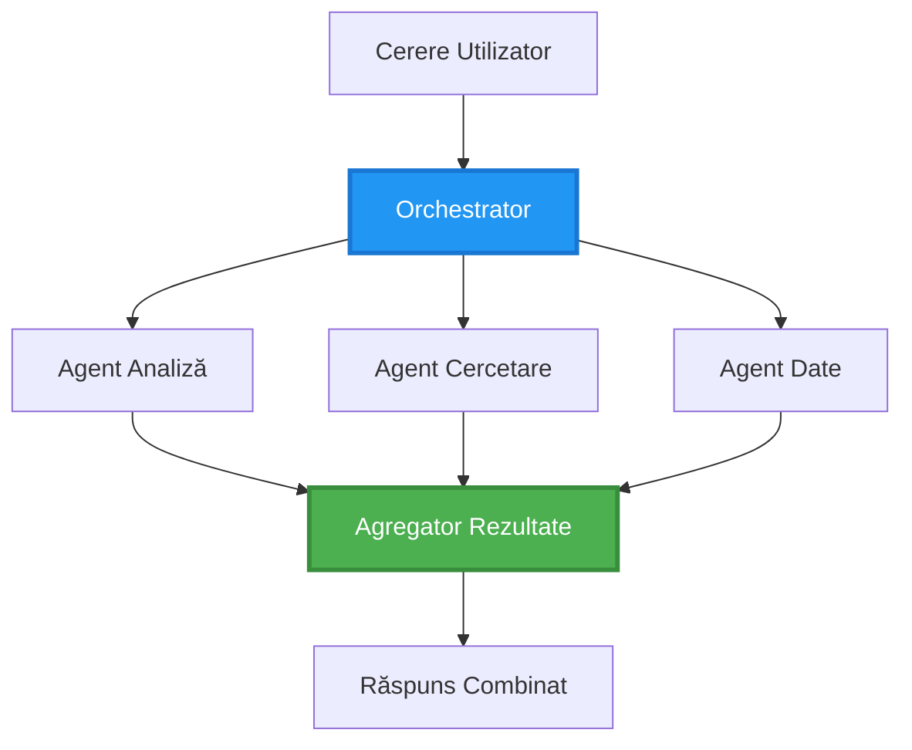
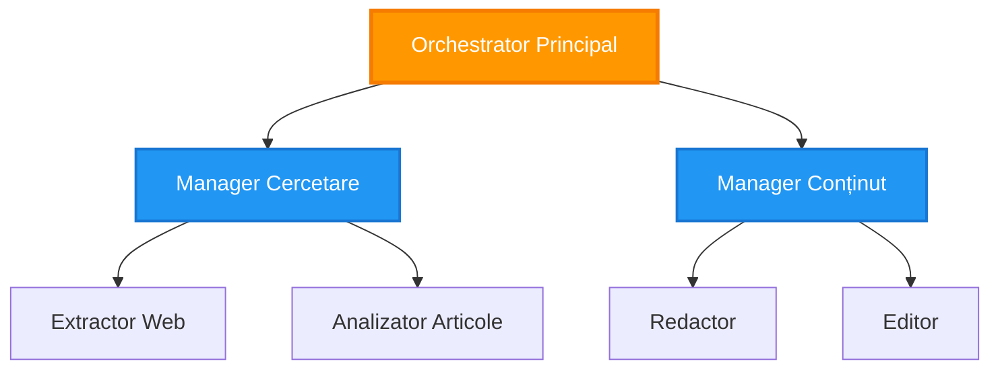
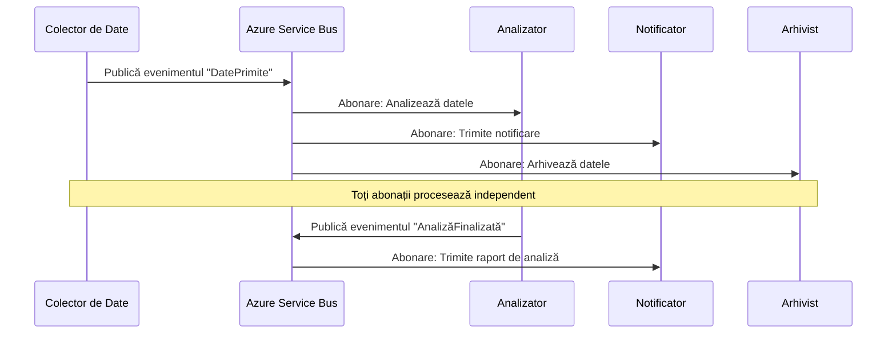
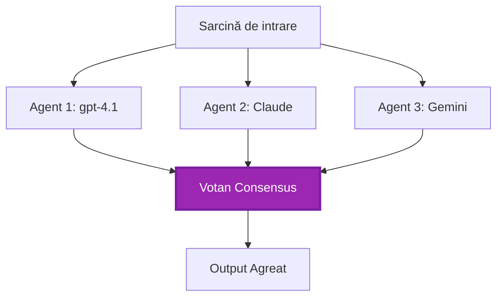
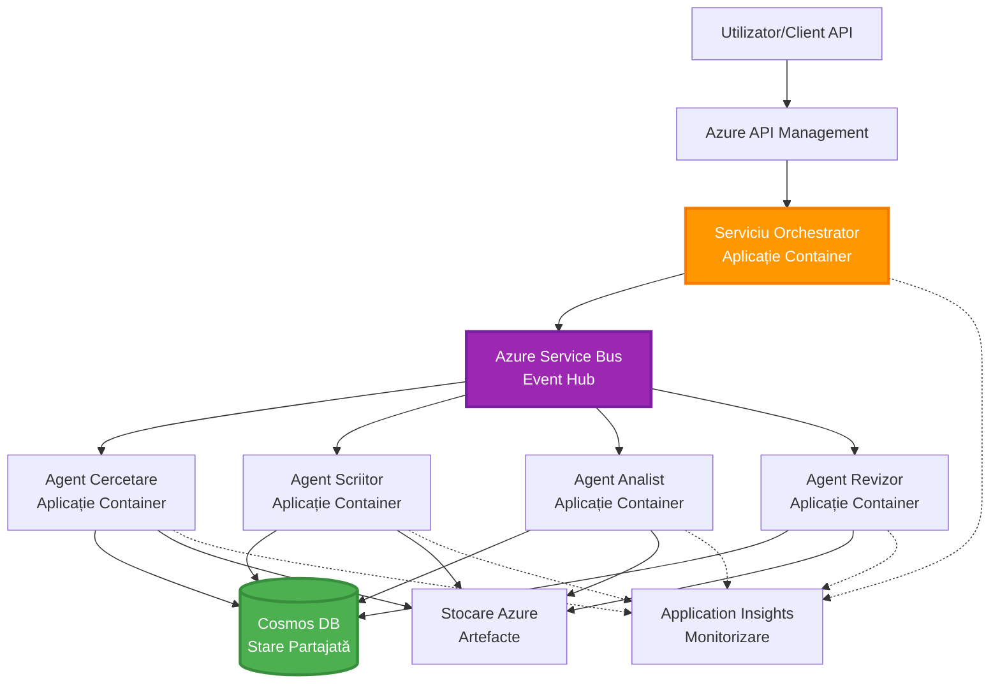

# Modele de coordonare multi-agent

⏱️ **Timp estimat**: 60-75 minute | 💰 **Cost estimat**: ~100-300 USD/lună | ⭐ **Complexitate**: Avansat

**📚 Parcurs de învățare:**
- ← Anterior: [Planificarea capacității](capacity-planning.md) - Strategii de dimensionare și scalare a resurselor
- 🎯 **Ești aici**: Modele de coordonare multi-agent (Orchestrare, comunicare, gestionare stare)
- → Următor: [Selectarea SKU](sku-selection.md) - Alegerea serviciilor Azure potrivite
- 🏠 [Pagina principală a cursului](../../README.md)

---

## Ce vei învăța

Prin parcurgerea acestei lecții, vei:
- Înțelege modelele de **arhitectură multi-agent** și când să le folosești
- Implementa **modele de orchestrare** (centralizată, descentralizată, ierarhică)
- Proiecta strategii de **comunicare între agenți** (sincronă, asincronă, bazată pe evenimente)
- Gestiona **starea partajată** între agenți distribuiți
- Implementa sisteme **multi-agent** pe Azure cu AZD
- Aplica **modele de coordonare** pentru scenarii reale AI
- Monitoriza și depana sisteme distribuite de agenți

## De ce contează coordonarea multi-agent

### Evoluția: De la agent unic la multi-agent

**Agent unic (Simplu):**
```
User → Agent → Response
```
- ✅ Ușor de înțeles și implementat
- ✅ Rapid pentru sarcini simple
- ❌ Limitat de capacitățile unui singur model
- ❌ Nu poate paraleliza sarcini complexe
- ❌ Fără specializare

**Sistem multi-agent (Avansat):**
```mermaid
graph TD
    Orchestrator[Orchestrator] --> Agent1[Agent1<br/>Planificare]
    Orchestrator --> Agent2[Agent2<br/>Cod]
    Orchestrator --> Agent3[Agent3<br/>Revizuire]
```- ✅ Agenți specializați pentru sarcini specifice
- ✅ Execuție paralelă pentru viteză
- ✅ Modular și ușor de întreținut
- ✅ Mai bun pentru fluxuri de lucru complexe
- ⚠️ Necesită logică de coordonare

**Analogie**: Agentul unic este ca o singură persoană care face toate sarcinile. Multi-agent este ca o echipă în care fiecare membru are abilități specializate (cercetător, programator, recenzor, scriitor) care lucrează împreună.

---

## Modele principale de coordonare

### Modelul 1: Coordonare secvențială (Lanțul responsabilității)

**Când să folosești**: Sarcinile trebuie să se finalizeze într-o ordine specifică, fiecare agent construind pe ieșirea precedentă.

```mermaid
sequenceDiagram
    participant User
    participant Orchestrator
    participant Agent1 as Agent de Cercetare
    participant Agent2 as Agent Scriitor
    participant Agent3 as Agent Editor
    
    User->>Orchestrator: "Scrie articol despre AI"
    Orchestrator->>Agent1: Cercetează subiectul
    Agent1-->>Orchestrator: Rezultate cercetare
    Orchestrator->>Agent2: Scrie schiță (folosind cercetarea)
    Agent2-->>Orchestrator: Schiță articol
    Orchestrator->>Agent3: Editează și îmbunătățește
    Agent3-->>Orchestrator: Articol final
    Orchestrator-->>User: Articol finisat
    
    Note over User,Agent3: Secvențial: Fiecare pas așteaptă pe precedentul
```
**Beneficii:**
- ✅ Flux clar de date
- ✅ Ușor de depanat
- ✅ Ordine previzibilă a execuției

**Limitări:**
- ❌ Mai lent (fără paralelism)
- ❌ O singură eroare blochează întreg lanțul
- ❌ Nu poate gestiona sarcini interdependente

**Exemple de utilizare:**
- Flux de creare conținut (cercetare → scriere → editare → publicare)
- Generare de cod (planificare → implementare → testare → implementare)
- Generare de rapoarte (colectare date → analiză → vizualizare → sumar)

---

### Modelul 2: Coordonare paralelă (Fan-Out/Fan-In)

**Când să folosești**: Sarcini independente ce pot rula simultan, rezultatele sunt combinate la final.


**Beneficii:**
- ✅ Rapid (execuție paralelă)
- ✅ Tolerant la erori (rezultate parțiale acceptabile)
- ✅ Scalabil orizontal

**Limitări:**
- ⚠️ Rezultatele pot ajunge în ordine aleatorie
- ⚠️ Necesită logică de agregare
- ⚠️ Gestionarea stării este complexă

**Exemple de utilizare:**
- Colectare date din multiple surse (API-uri + baze de date + web scraping)
- Analiză competitivă (mai multe modele generează soluții, se selectează cea mai bună)
- Servicii de traduceri (traducere simultană în multiple limbi)

---

### Modelul 3: Coordonare ierarhică (Manager-Lucrător)

**Când să folosești**: Fluxuri de lucru complexe cu sub-sarcini, necesară delegarea.


**Beneficii:**
- ✅ Gestionează fluxuri complexe
- ✅ Modular și ușor de întreținut
- ✅ Responsabilități clare

**Limitări:**
- ⚠️ Arhitectură mai complexă
- ⚠️ Latență mai mare (mai multe niveluri de coordonare)
- ⚠️ Necesită orchestrare sofisticată

**Exemple de utilizare:**
- Procesare documente în întreprinderi (clasificare → rutare → procesare → arhivare)
- Pipelines de date multi-etapă (ingestie → curățare → transformare → analiză → raport)
- Fluxuri automate complexe (planificare → alocare resurse → execuție → monitorizare)

---

### Modelul 4: Coordonare bazată pe evenimente (Publicare-Abonare)

**Când să folosești**: Agenții trebuie să reacționeze la evenimente, se dorește cuplare slabă.


**Beneficii:**
- ✅ Cuplare slabă între agenți
- ✅ Ușor de adăugat agenți noi (doar se abonează)
- ✅ Procesare asincronă
- ✅ Reziliență (persistența mesajelor)

**Limitări:**
- ⚠️ Consistență eventuală
- ⚠️ Depanare complexă
- ⚠️ Provocări în ordonarea mesajelor

**Exemple de utilizare:**
- Sisteme de monitorizare în timp real (alerte, tablouri de bord, loguri)
- Notificări multi-canal (email, SMS, push, Slack)
- Pipelines de procesare date (mai mulți consumatori pentru aceleași date)

---

### Modelul 5: Coordonare bazată pe consens (Vot/Quorum)

**Când să folosești**: Este necesar acordul mai multor agenți înainte de a continua.


**Beneficii:**
- ✅ Acuratețe crescută (mai multe opinii)
- ✅ Toleranță la erori (acceptă eșecuri minoritare)
- ✅ Asigurarea calității integrată

**Limitări:**
- ❌ Costisitor (apeluri multiple către modele)
- ❌ Mai lent (așteptarea tuturor agenților)
- ⚠️ Necesită rezolvare a conflictelor

**Exemple de utilizare:**
- Moderarea conținutului (revizuirea conținutului de mai multe modele)
- Revizuire cod (mai mulți linters/analyzers)
- Diagnostic medical (mai multe modele AI, validare expert)

---

## Prezentare arhitectură

### Sistem multi-agent complet pe Azure


**Componente cheie:**

| Componentă | Scop | Serviciu Azure |
|-----------|---------|---------------|
| **API Gateway** | Punct de intrare, limitarea ratei, autentificare | API Management |
| **Orchestrator** | Coordonează fluxurile de lucru ale agenților | Container Apps |
| **Message Queue** | Comunicare asincronă | Service Bus / Event Hubs |
| **Agenți** | Lucrători AI specializați | Container Apps / Functions |
| **Store stare** | Stare partajată, urmărire sarcini | Cosmos DB |
| **Depozit artefacte** | Documente, rezultate, loguri | Blob Storage |
| **Monitorizare** | Urmărire distribuită, loguri | Application Insights |

---

## Cerințe prealabile

### Unelte necesare

```bash
# Verifică Azure Developer CLI
azd version
# ✅ Așteptat: azd versiunea 1.0.0 sau mai mare

# Verifică Azure CLI
az --version
# ✅ Așteptat: azure-cli 2.50.0 sau mai mare

# Verifică Docker (pentru testare locală)
docker --version
# ✅ Așteptat: Docker versiunea 20.10 sau mai mare
```

### Cerințe Azure

- Abonament Azure activ
- Permisiuni pentru crearea:
  - Container Apps
  - Namespace-uri Service Bus
  - Conturi Cosmos DB
  - Conturi de stocare
  - Application Insights

### Cunoștințe prealabile

Trebuie să fi parcurs:
- [Managementul configurației](../chapter-03-configuration/configuration.md)
- [Autentificare și securitate](../chapter-03-configuration/authsecurity.md)
- [Exemplu Microservicii](../../../../examples/microservices)

---

## Ghid de implementare

### Structura proiectului

```
multi-agent-system/
├── azure.yaml                    # AZD configuration
├── infra/
│   ├── main.bicep               # Main infrastructure
│   ├── core/
│   │   ├── servicebus.bicep     # Message queue
│   │   ├── cosmos.bicep         # State store
│   │   ├── storage.bicep        # Artifact storage
│   │   └── monitoring.bicep     # Application Insights
│   └── app/
│       ├── orchestrator.bicep   # Orchestrator service
│       └── agent.bicep          # Agent template
└── src/
    ├── orchestrator/            # Orchestration logic
    │   ├── app.py
    │   ├── workflows.py
    │   └── Dockerfile
    ├── agents/
    │   ├── research/            # Research agent
    │   ├── writer/              # Writer agent
    │   ├── analyst/             # Analyst agent
    │   └── reviewer/            # Reviewer agent
    └── shared/
        ├── state_manager.py     # Shared state logic
        └── message_handler.py   # Message handling
```

---

## Lecția 1: Model de coordonare secvențială

### Implementare: Pipeline de creare conținut

Să construim un pipeline secvențial: Cercetare → Scriere → Editare → Publicare

### 1. Configurare AZD

**Fișier: `azure.yaml`**

```yaml
name: content-pipeline
metadata:
  template: multi-agent-sequential@1.0.0

services:
  orchestrator:
    project: ./src/orchestrator
    language: python
    host: containerapp
  
  research-agent:
    project: ./src/agents/research
    language: python
    host: containerapp
  
  writer-agent:
    project: ./src/agents/writer
    language: python
    host: containerapp
  
  editor-agent:
    project: ./src/agents/editor
    language: python
    host: containerapp
```

### 2. Infrastructură: Service Bus pentru coordonare

**Fișier: `infra/core/servicebus.bicep`**

```bicep
param name string
param location string
param tags object = {}

resource serviceBusNamespace 'Microsoft.ServiceBus/namespaces@2022-10-01-preview' = {
  name: name
  location: location
  tags: tags
  sku: {
    name: 'Standard'
    tier: 'Standard'
  }
  properties: {
    minimumTlsVersion: '1.2'
  }
}

// Queue for orchestrator → research agent
resource researchQueue 'Microsoft.ServiceBus/namespaces/queues@2022-10-01-preview' = {
  parent: serviceBusNamespace
  name: 'research-tasks'
  properties: {
    maxDeliveryCount: 3
    lockDuration: 'PT5M'
    deadLetteringOnMessageExpiration: true
  }
}

// Queue for research agent → writer agent
resource writerQueue 'Microsoft.ServiceBus/namespaces/queues@2022-10-01-preview' = {
  parent: serviceBusNamespace
  name: 'writer-tasks'
  properties: {
    maxDeliveryCount: 3
    lockDuration: 'PT5M'
  }
}

// Queue for writer agent → editor agent
resource editorQueue 'Microsoft.ServiceBus/namespaces/queues@2022-10-01-preview' = {
  parent: serviceBusNamespace
  name: 'editor-tasks'
  properties: {
    maxDeliveryCount: 3
    lockDuration: 'PT5M'
  }
}

output namespace string = serviceBusNamespace.name
output connectionString string = listKeys('${serviceBusNamespace.id}/AuthorizationRules/RootManageSharedAccessKey', serviceBusNamespace.apiVersion).primaryConnectionString
```

### 3. Manager stare partajată

**Fișier: `src/shared/state_manager.py`**

```python
from azure.cosmos import CosmosClient, PartitionKey
from datetime import datetime
import os

class StateManager:
    """Manages shared state across agents using Cosmos DB"""
    
    def __init__(self):
        endpoint = os.environ['COSMOS_ENDPOINT']
        key = os.environ['COSMOS_KEY']
        
        self.client = CosmosClient(endpoint, key)
        self.database = self.client.get_database_client('agent-state')
        self.container = self.database.get_container_client('tasks')
    
    def create_task(self, task_id: str, task_type: str, input_data: dict):
        """Create a new task"""
        task = {
            'id': task_id,
            'type': task_type,
            'status': 'pending',
            'input': input_data,
            'created_at': datetime.utcnow().isoformat(),
            'steps': []
        }
        self.container.create_item(task)
        return task
    
    def update_task_step(self, task_id: str, step_name: str, result: dict):
        """Update task with completed step"""
        task = self.container.read_item(task_id, partition_key=task_id)
        
        task['steps'].append({
            'name': step_name,
            'completed_at': datetime.utcnow().isoformat(),
            'result': result
        })
        
        self.container.replace_item(task_id, task)
        return task
    
    def complete_task(self, task_id: str, final_result: dict):
        """Mark task as complete"""
        task = self.container.read_item(task_id, partition_key=task_id)
        task['status'] = 'completed'
        task['result'] = final_result
        task['completed_at'] = datetime.utcnow().isoformat()
        self.container.replace_item(task_id, task)
        return task
    
    def get_task(self, task_id: str):
        """Retrieve task state"""
        return self.container.read_item(task_id, partition_key=task_id)
```

### 4. Serviciu Orchestrator

**Fișier: `src/orchestrator/app.py`**

```python
from flask import Flask, request, jsonify
from azure.servicebus import ServiceBusClient, ServiceBusMessage
import json
import uuid
import os
from shared.state_manager import StateManager

app = Flask(__name__)
state_manager = StateManager()

# Conexiune Service Bus
servicebus_connection_str = os.environ['SERVICEBUS_CONNECTION_STRING']
servicebus_client = ServiceBusClient.from_connection_string(servicebus_connection_str)

@app.route('/health', methods=['GET'])
def health():
    return jsonify({'status': 'healthy', 'service': 'orchestrator'})

@app.route('/create-content', methods=['POST'])
def create_content():
    """
    Sequential workflow: Research → Write → Edit → Publish
    """
    data = request.json
    topic = data.get('topic')
    
    if not topic:
        return jsonify({'error': 'Topic required'}), 400
    
    # Creează task în magazinul de stări
    task_id = str(uuid.uuid4())
    task = state_manager.create_task(
        task_id=task_id,
        task_type='content_creation',
        input_data={'topic': topic}
    )
    
    # Trimite mesaj agentului de cercetare (primul pas)
    sender = servicebus_client.get_queue_sender('research-tasks')
    message = ServiceBusMessage(
        body=json.dumps({
            'task_id': task_id,
            'topic': topic,
            'next_queue': 'writer-tasks'  # Unde să se trimită rezultatele
        }),
        content_type='application/json'
    )
    
    with sender:
        sender.send_messages(message)
    
    return jsonify({
        'task_id': task_id,
        'status': 'started',
        'workflow': 'sequential',
        'steps': ['research', 'write', 'edit', 'publish'],
        'message': 'Content creation pipeline initiated'
    }), 202

@app.route('/task/<task_id>', methods=['GET'])
def get_task_status(task_id):
    """Check task status"""
    try:
        task = state_manager.get_task(task_id)
        return jsonify(task)
    except Exception as e:
        return jsonify({'error': str(e)}), 404

if __name__ == '__main__':
    app.run(host='0.0.0.0', port=8080)
```

### 5. Agent Cercetare

**Fișier: `src/agents/research/app.py`**

```python
from azure.servicebus import ServiceBusClient, ServiceBusMessage
from openai import AzureOpenAI
import json
import os
import time
from shared.state_manager import StateManager

# Inițializează clienții
state_manager = StateManager()
servicebus_client = ServiceBusClient.from_connection_string(
    os.environ['SERVICEBUS_CONNECTION_STRING']
)

openai_client = AzureOpenAI(
    api_key=os.environ['AZURE_OPENAI_API_KEY'],
    api_version="2024-02-01",
    azure_endpoint=os.environ['AZURE_OPENAI_ENDPOINT']
)

def process_research_task(message_data):
    """Process research request and pass to writer"""
    task_id = message_data['task_id']
    topic = message_data['topic']
    next_queue = message_data['next_queue']
    
    print(f"🔬 Researching: {topic}")
    
    # Apelează modelele Microsoft Foundry pentru cercetare
    response = openai_client.chat.completions.create(
        model="gpt-4.1",
        messages=[
            {"role": "system", "content": "You are a research assistant. Provide comprehensive research on the given topic."},
            {"role": "user", "content": f"Research this topic thoroughly: {topic}"}
        ],
        max_tokens=1500
    )
    
    research_results = response.choices[0].message.content
    
    # Actualizează starea
    state_manager.update_task_step(
        task_id=task_id,
        step_name='research',
        result={'research': research_results}
    )
    
    # Trimite către următorul agent (scriitor)
    sender = servicebus_client.get_queue_sender(next_queue)
    message = ServiceBusMessage(
        body=json.dumps({
            'task_id': task_id,
            'topic': topic,
            'research': research_results,
            'next_queue': 'editor-tasks'
        }),
        content_type='application/json'
    )
    
    with sender:
        sender.send_messages(message)
    
    print(f"✅ Research complete for task {task_id}")

def main():
    """Listen to research queue"""
    receiver = servicebus_client.get_queue_receiver('research-tasks')
    
    print("🔬 Research Agent started, listening for tasks...")
    
    with receiver:
        while True:
            messages = receiver.receive_messages(max_wait_time=5)
            for message in messages:
                try:
                    message_data = json.loads(str(message))
                    process_research_task(message_data)
                    receiver.complete_message(message)
                except Exception as e:
                    print(f"❌ Error processing message: {e}")
                    receiver.abandon_message(message)

if __name__ == '__main__':
    main()
```

### 6. Agent Scriitor

**Fișier: `src/agents/writer/app.py`**

```python
from azure.servicebus import ServiceBusClient, ServiceBusMessage
from openai import AzureOpenAI
import json
import os
from shared.state_manager import StateManager

state_manager = StateManager()
servicebus_client = ServiceBusClient.from_connection_string(
    os.environ['SERVICEBUS_CONNECTION_STRING']
)

openai_client = AzureOpenAI(
    api_key=os.environ['AZURE_OPENAI_API_KEY'],
    api_version="2024-02-01",
    azure_endpoint=os.environ['AZURE_OPENAI_ENDPOINT']
)

def process_writing_task(message_data):
    """Write article based on research"""
    task_id = message_data['task_id']
    topic = message_data['topic']
    research = message_data['research']
    next_queue = message_data['next_queue']
    
    print(f"✍️ Writing article: {topic}")
    
    # Apelează modelele Microsoft Foundry pentru a scrie articolul
    response = openai_client.chat.completions.create(
        model="gpt-4.1",
        messages=[
            {"role": "system", "content": "You are a professional writer. Write engaging, well-structured articles."},
            {"role": "user", "content": f"Based on this research:\n\n{research}\n\nWrite a comprehensive article about: {topic}"}
        ],
        max_tokens=2000
    )
    
    article_draft = response.choices[0].message.content
    
    # Actualizează starea
    state_manager.update_task_step(
        task_id=task_id,
        step_name='writing',
        result={'draft': article_draft}
    )
    
    # Trimite către editor
    sender = servicebus_client.get_queue_sender(next_queue)
    message = ServiceBusMessage(
        body=json.dumps({
            'task_id': task_id,
            'topic': topic,
            'draft': article_draft
        }),
        content_type='application/json'
    )
    
    with sender:
        sender.send_messages(message)
    
    print(f"✅ Article draft complete for task {task_id}")

def main():
    """Listen to writer queue"""
    receiver = servicebus_client.get_queue_receiver('writer-tasks')
    
    print("✍️ Writer Agent started, listening for tasks...")
    
    with receiver:
        while True:
            messages = receiver.receive_messages(max_wait_time=5)
            for message in messages:
                try:
                    message_data = json.loads(str(message))
                    process_writing_task(message_data)
                    receiver.complete_message(message)
                except Exception as e:
                    print(f"❌ Error: {e}")
                    receiver.abandon_message(message)

if __name__ == '__main__':
    main()
```

### 7. Agent Editor

**Fișier: `src/agents/editor/app.py`**

```python
from azure.servicebus import ServiceBusClient
from openai import AzureOpenAI
import json
import os
from shared.state_manager import StateManager

state_manager = StateManager()
servicebus_client = ServiceBusClient.from_connection_string(
    os.environ['SERVICEBUS_CONNECTION_STRING']
)

openai_client = AzureOpenAI(
    api_key=os.environ['AZURE_OPENAI_API_KEY'],
    api_version="2024-02-01",
    azure_endpoint=os.environ['AZURE_OPENAI_ENDPOINT']
)

def process_editing_task(message_data):
    """Edit and finalize article"""
    task_id = message_data['task_id']
    topic = message_data['topic']
    draft = message_data['draft']
    
    print(f"📝 Editing article: {topic}")
    
    # Apelează modelele Microsoft Foundry pentru editare
    response = openai_client.chat.completions.create(
        model="gpt-4.1",
        messages=[
            {"role": "system", "content": "You are an expert editor. Improve grammar, clarity, and structure."},
            {"role": "user", "content": f"Edit and improve this article:\n\n{draft}"}
        ],
        max_tokens=2000
    )
    
    final_article = response.choices[0].message.content
    
    # Marchează sarcina ca finalizată
    state_manager.complete_task(
        task_id=task_id,
        final_result={
            'topic': topic,
            'final_article': final_article,
            'word_count': len(final_article.split())
        }
    )
    
    print(f"✅ Article finalized for task {task_id}")

def main():
    """Listen to editor queue"""
    receiver = servicebus_client.get_queue_receiver('editor-tasks')
    
    print("📝 Editor Agent started, listening for tasks...")
    
    with receiver:
        while True:
            messages = receiver.receive_messages(max_wait_time=5)
            for message in messages:
                try:
                    message_data = json.loads(str(message))
                    process_editing_task(message_data)
                    receiver.complete_message(message)
                except Exception as e:
                    print(f"❌ Error: {e}")
                    receiver.abandon_message(message)

if __name__ == '__main__':
    main()
```

### 8. Deploy și testare

```bash
# Opțiunea A: Implementare bazată pe șablon
azd init
azd up

# Opțiunea B: Implementare manifest agent (necessită extensie)
azd extension install azure.ai.agents
azd ai agent init -m agent-manifest.yaml
azd up
```

> Vezi [Comenzile AZD AI CLI](../chapter-08-production/production-ai-practices.md#azd-ai-cli-commands-and-extensions) pentru toate flag-urile și opțiunile `azd ai`.

```bash
# Obține URL-ul orchestratorului
ORCHESTRATOR_URL=$(azd env get-values | grep ORCHESTRATOR_URL | cut -d '=' -f2 | tr -d '"')

# Creează conținutul
curl -X POST $ORCHESTRATOR_URL/create-content \
  -H "Content-Type: application/json" \
  -d '{"topic": "The Future of AI in Healthcare"}'
```

**✅ Ieșire așteptată:**
```json
{
  "task_id": "a1b2c3d4-e5f6-7890-abcd-ef1234567890",
  "status": "started",
  "workflow": "sequential",
  "steps": ["research", "write", "edit", "publish"],
  "message": "Content creation pipeline initiated"
}
```

**Verifică progresul sarcinilor:**
```bash
TASK_ID="a1b2c3d4-e5f6-7890-abcd-ef1234567890"
curl $ORCHESTRATOR_URL/task/$TASK_ID
```

**✅ Ieșire așteptată (finalizat):**
```json
{
  "id": "a1b2c3d4-e5f6-7890-abcd-ef1234567890",
  "type": "content_creation",
  "status": "completed",
  "steps": [
    {
      "name": "research",
      "completed_at": "2025-11-19T10:30:00Z",
      "result": {"research": "..."}
    },
    {
      "name": "writing",
      "completed_at": "2025-11-19T10:32:00Z",
      "result": {"draft": "..."}
    }
  ],
  "result": {
    "topic": "The Future of AI in Healthcare",
    "final_article": "...",
    "word_count": 1500
  }
}
```

---

## Lecția 2: Model de coordonare paralelă

### Implementare: Agregator Cercetare Multi-Sursă

Să construim un sistem paralel care adună informații din multiple surse simultan.

### Orchestrator paralel

**Fișier: `src/orchestrator/parallel_workflow.py`**

```python
from flask import Flask, request, jsonify
from azure.servicebus import ServiceBusClient, ServiceBusMessage
import json
import uuid
import os
from shared.state_manager import StateManager

app = Flask(__name__)
state_manager = StateManager()

servicebus_client = ServiceBusClient.from_connection_string(
    os.environ['SERVICEBUS_CONNECTION_STRING']
)

@app.route('/research-parallel', methods=['POST'])
def research_parallel():
    """
    Parallel workflow: Multiple agents work simultaneously
    """
    data = request.json
    query = data.get('query')
    
    task_id = str(uuid.uuid4())
    task = state_manager.create_task(
        task_id=task_id,
        task_type='parallel_research',
        input_data={
            'query': query,
            'agents': ['web', 'academic', 'news', 'social']
        }
    )
    
    # Răspândire: Trimite tuturor agenților simultan
    agents = [
        ('web-research-queue', 'web'),
        ('academic-research-queue', 'academic'),
        ('news-research-queue', 'news'),
        ('social-research-queue', 'social')
    ]
    
    for queue_name, agent_type in agents:
        sender = servicebus_client.get_queue_sender(queue_name)
        message = ServiceBusMessage(
            body=json.dumps({
                'task_id': task_id,
                'query': query,
                'agent_type': agent_type,
                'result_queue': 'aggregation-queue'
            }),
            content_type='application/json'
        )
        
        with sender:
            sender.send_messages(message)
    
    return jsonify({
        'task_id': task_id,
        'status': 'started',
        'workflow': 'parallel',
        'agents_dispatched': 4,
        'message': 'Parallel research initiated'
    }), 202

if __name__ == '__main__':
    app.run(host='0.0.0.0', port=8080)
```

### Logică de agregare

**Fișier: `src/agents/aggregator/app.py`**

```python
from azure.servicebus import ServiceBusClient
import json
import os
from collections import defaultdict
from shared.state_manager import StateManager

state_manager = StateManager()
servicebus_client = ServiceBusClient.from_connection_string(
    os.environ['SERVICEBUS_CONNECTION_STRING']
)

# Urmărește rezultatele pentru fiecare sarcină
task_results = defaultdict(list)
expected_agents = 4  # web, academic, știri, social

def process_result(message_data):
    """Aggregate results from parallel agents"""
    task_id = message_data['task_id']
    agent_type = message_data['agent_type']
    result = message_data['result']
    
    # Stochează rezultatul
    task_results[task_id].append({
        'agent': agent_type,
        'data': result
    })
    
    print(f"📊 Received result from {agent_type} agent ({len(task_results[task_id])}/{expected_agents})")
    
    # Verifică dacă toți agenții au terminat (fan-in)
    if len(task_results[task_id]) == expected_agents:
        print(f"✅ All agents completed for task {task_id}. Aggregating...")
        
        # Combină rezultatele
        aggregated = {
            'query': message_data['query'],
            'sources': task_results[task_id],
            'summary': generate_summary(task_results[task_id])
        }
        
        # Marchează ca finalizat
        state_manager.complete_task(task_id, aggregated)
        
        # Curăță resursele
        del task_results[task_id]
        
        print(f"✅ Aggregation complete for task {task_id}")

def generate_summary(results):
    """Generate summary from all sources"""
    summaries = [r['data'].get('summary', '') for r in results]
    return '\n\n'.join(summaries)

def main():
    """Listen to aggregation queue"""
    receiver = servicebus_client.get_queue_receiver('aggregation-queue')
    
    print("📊 Aggregator started, listening for results...")
    
    with receiver:
        while True:
            messages = receiver.receive_messages(max_wait_time=5)
            for message in messages:
                try:
                    message_data = json.loads(str(message))
                    process_result(message_data)
                    receiver.complete_message(message)
                except Exception as e:
                    print(f"❌ Error: {e}")
                    receiver.abandon_message(message)

if __name__ == '__main__':
    main()
```

**Beneficii ale modelului paralel:**
- ⚡ **de 4x mai rapid** (agenții rulează simultan)
- 🔄 **Tolerant la erori** (rezultate parțiale acceptabile)
- 📈 **Scalabil** (adaugă ușor mai mulți agenți)

---

## Exerciții practice

### Exercițiul 1: Adaugă gestionare timeout ⭐⭐ (Mediu)

**Scop**: Implementează logica de timeout astfel încât agregatorul să nu aștepte la nesfârșit agenții lenți.

**Pași**:

1. **Adaugă urmărire timeout în agregator:**

```python
from datetime import datetime, timedelta

task_timeouts = {}  # task_id -> timp_de_expirare

def process_result(message_data):
    task_id = message_data['task_id']
    
    # Setează timpul de expirare la primul rezultat
    if task_id not in task_timeouts:
        task_timeouts[task_id] = datetime.utcnow() + timedelta(seconds=30)
    
    task_results[task_id].append({
        'agent': message_data['agent_type'],
        'data': message_data['result']
    })
    
    # Verifică dacă este complet SAU a expirat timpul
    if len(task_results[task_id]) == expected_agents or \
       datetime.utcnow() > task_timeouts[task_id]:
        
        print(f"📊 Aggregating with {len(task_results[task_id])}/{expected_agents} results")
        
        aggregated = {
            'query': message_data['query'],
            'sources': task_results[task_id],
            'completed_agents': len(task_results[task_id]),
            'timed_out': len(task_results[task_id]) < expected_agents
        }
        
        state_manager.complete_task(task_id, aggregated)
        
        # Curățare
        del task_results[task_id]
        del task_timeouts[task_id]
```

2. **Testează cu întârzieri artificiale:**

```python
# Într-un agent, adaugă o întârziere pentru a simula procesarea lentă
import time
time.sleep(35)  # Depășește limita de 30 de secunde de timeout
```

3. **Deploy și verificare:**

```bash
azd deploy aggregator

# Trimite sarcină
curl -X POST $ORCHESTRATOR_URL/research-parallel \
  -H "Content-Type: application/json" \
  -d '{"query": "AI safety research"}'

# Verifică rezultatele după 30 de secunde
curl $ORCHESTRATOR_URL/task/$TASK_ID
```

**✅ Criterii de succes:**
- ✅ Sarcina se finalizează după 30 de secunde chiar dacă agenții nu au terminat
- ✅ Răspunsul indică rezultate parțiale (`"timed_out": true`)
- ✅ Se returnează rezultatele disponibile (3 din 4 agenți)

**Timp**: 20-25 minute

---

### Exercițiul 2: Implementează logica retry ⭐⭐⭐ (Avansat)

**Scop**: Retrimiterea automată a sarcinilor agenților eșuați înainte de renunțare.

**Pași**:

1. **Adaugă urmărire retry în orchestrator:**

```python
from dataclasses import dataclass
from typing import Dict

@dataclass
class RetryConfig:
    max_retries: int = 3
    backoff_seconds: int = 5

retry_counts: Dict[str, int] = {}  # message_id -> număr_de_încercări

def send_with_retry(queue_name: str, message_data: dict, retry_config: RetryConfig):
    """Send message with retry metadata"""
    message_id = message_data.get('message_id', str(uuid.uuid4()))
    message_data['message_id'] = message_id
    message_data['retry_count'] = retry_counts.get(message_id, 0)
    message_data['max_retries'] = retry_config.max_retries
    
    sender = servicebus_client.get_queue_sender(queue_name)
    message = ServiceBusMessage(
        body=json.dumps(message_data),
        content_type='application/json',
        message_id=message_id
    )
    
    with sender:
        sender.send_messages(message)
```

2. **Adaugă handler retry la agenți:**

```python
def process_with_retry(message, receiver, process_func):
    """Process message with automatic retry on failure"""
    try:
        message_data = json.loads(str(message))
        
        # Procesează mesajul
        process_func(message_data)
        
        # Succes - complet
        receiver.complete_message(message)
        
    except Exception as e:
        message_id = message.message_id
        retry_count = message_data.get('retry_count', 0)
        max_retries = message_data.get('max_retries', 3)
        
        if retry_count < max_retries:
            # Reîncearcă: abandonează și reintrodu în coadă cu numărătoare incrementată
            print(f"⚠️ Retry {retry_count + 1}/{max_retries} for message {message_id}")
            
            message_data['retry_count'] = retry_count + 1
            
            # Retrimite în aceeași coadă cu întârziere
            time.sleep(5 * (retry_count + 1))  # Întârziere exponențială
            send_with_retry(queue_name, message_data, RetryConfig())
            
            receiver.complete_message(message)  # Elimină originalul
        else:
            # Numărul maxim de încercări depășit - mută în coada mesajelor moarte
            print(f"❌ Max retries exceeded for message {message_id}")
            receiver.dead_letter_message(
                message,
                reason="MaxRetriesExceeded",
                error_description=str(e)
            )
```

3. **Monitorizează coada de dead letter:**

```python
def monitor_dead_letters():
    """Check dead letter queue for failed messages"""
    receiver = servicebus_client.get_queue_receiver(
        'research-queue',
        sub_queue='deadletter'
    )
    
    with receiver:
        messages = receiver.receive_messages(max_wait_time=5)
        for message in messages:
            print(f"☠️ Dead letter: {message.message_id}")
            print(f"Reason: {message.dead_letter_reason}")
            print(f"Description: {message.dead_letter_error_description}")
```

**✅ Criterii de succes:**
- ✅ Sarcinile eșuate sunt retrimise automat (până la 3 încercări)
- ✅ Backoff exponențial între încercări (5s, 10s, 15s)
- ✅ După retry-uri maxime, mesajele sunt trimise în coada dead letter
- ✅ Coada dead letter poate fi monitorizată și redată

**Timp**: 30-40 minute

---

### Exercițiul 3: Implementează Circuit Breaker ⭐⭐⭐ (Avansat)

**Scop**: Preveni eșecurile în cascadă prin oprirea cererilor către agenții care dau eroare.

**Pași**:

1. **Creează clasa circuit breaker:**

```python
from enum import Enum
from datetime import datetime, timedelta

class CircuitState(Enum):
    CLOSED = "closed"      # Operare normală
    OPEN = "open"          # Eșec, respinge cererile
    HALF_OPEN = "half_open"  # Testare dacă s-a recuperat

class CircuitBreaker:
    def __init__(self, failure_threshold=5, timeout_seconds=60):
        self.failure_threshold = failure_threshold
        self.timeout_seconds = timeout_seconds
        self.failure_count = 0
        self.last_failure_time = None
        self.state = CircuitState.CLOSED
    
    def call(self, func):
        """Execute function with circuit breaker protection"""
        if self.state == CircuitState.OPEN:
            # Verifică dacă timpul de expirare a trecut
            if datetime.utcnow() - self.last_failure_time > timedelta(seconds=self.timeout_seconds):
                self.state = CircuitState.HALF_OPEN
                print("🔄 Circuit breaker: HALF_OPEN (testing)")
            else:
                raise Exception(f"Circuit breaker OPEN for agent. Try again in {self.timeout_seconds}s")
        
        try:
            result = func()
            
            # Succes
            if self.state == CircuitState.HALF_OPEN:
                self.state = CircuitState.CLOSED
                self.failure_count = 0
                print("✅ Circuit breaker: CLOSED (recovered)")
            
            return result
            
        except Exception as e:
            self.failure_count += 1
            self.last_failure_time = datetime.utcnow()
            
            if self.failure_count >= self.failure_threshold:
                self.state = CircuitState.OPEN
                print(f"🔴 Circuit breaker: OPEN (too many failures)")
            
            raise e
```

2. **Aplică la apelurile către agenți:**

```python
# În orchestrator
agent_circuits = {
    'web': CircuitBreaker(failure_threshold=5, timeout_seconds=60),
    'academic': CircuitBreaker(failure_threshold=5, timeout_seconds=60),
    'news': CircuitBreaker(failure_threshold=5, timeout_seconds=60),
    'social': CircuitBreaker(failure_threshold=5, timeout_seconds=60)
}

def send_to_agent(agent_type, message_data):
    """Send with circuit breaker protection"""
    circuit = agent_circuits[agent_type]
    
    try:
        circuit.call(lambda: send_message(agent_type, message_data))
    except Exception as e:
        print(f"⚠️ Skipping {agent_type} agent: {e}")
        # Continuă cu alți agenți
```

3. **Testează circuit breaker:**

```bash
# Simulează eșecuri repetate (oprește un agent)
az containerapp stop --name web-research-agent --resource-group rg-agents

# Trimite multiple cereri
for i in {1..10}; do
  curl -X POST $ORCHESTRATOR_URL/research-parallel \
    -H "Content-Type: application/json" \
    -d '{"query": "test query '$i'"}'
  sleep 2
done

# Verifică jurnalele - ar trebui să vezi circuitul deschis după 5 eșecuri
# Folosește Azure CLI pentru jurnalele Container App:
az containerapp logs show --name orchestrator --resource-group $RG_NAME --tail 50
```

**✅ Criterii de succes:**
- ✅ După 5 eșecuri, circuitul se deschide (refuză cererile)
- ✅ După 60 secunde, circuitul trece în starea half-open (testează recuperarea)
- ✅ Alți agenți continuă să funcționeze normal
- ✅ Circuitul se închide automat când agentul se recuperează

**Timp**: 40-50 minute

---

## Monitorizare și depanare

### Tracing distribuit cu Application Insights

**Fișier: `src/shared/tracing.py`**

```python
from opencensus.ext.azure.log_exporter import AzureLogHandler
from opencensus.ext.azure.trace_exporter import AzureExporter
from opencensus.trace import config_integration
from opencensus.trace.tracer import Tracer
from opencensus.trace.samplers import AlwaysOnSampler
import logging
import os

# Configurează trasarea
config_integration.trace_integrations(['requests', 'logging'])

connection_string = os.environ.get('APPLICATIONINSIGHTS_CONNECTION_STRING')

# Creează tracer
tracer = Tracer(
    exporter=AzureExporter(connection_string=connection_string),
    sampler=AlwaysOnSampler()
)

# Configurează jurnalizarea
logger = logging.getLogger(__name__)
logger.addHandler(AzureLogHandler(connection_string=connection_string))
logger.setLevel(logging.INFO)

def trace_agent_call(agent_name, task_id, operation):
    """Trace agent operations"""
    with tracer.span(name=f'{agent_name}.{operation}') as span:
        span.add_attribute('agent', agent_name)
        span.add_attribute('task_id', task_id)
        span.add_attribute('operation', operation)
        
        try:
            result = operation()
            span.add_attribute('status', 'success')
            return result
        except Exception as e:
            span.add_attribute('status', 'error')
            span.add_attribute('error', str(e))
            raise
```

### Interogări Application Insights

**Urmărește fluxurile multi-agent:**

```kusto
// Trace complete workflow for a task
traces
| where customDimensions.task_id == "a1b2c3d4-..."
| project timestamp, message, customDimensions.agent, customDimensions.operation
| order by timestamp asc
```

**Comparația performanțelor agenților:**

```kusto
// Compare agent execution times
dependencies
| where name contains "agent"
| summarize 
    avg_duration = avg(duration),
    p95_duration = percentile(duration, 95),
    count = count()
  by agent = tostring(customDimensions.agent)
| order by avg_duration desc
```

**Analiza erorilor:**

```kusto
// Find which agents fail most
exceptions
| where customDimensions.agent != ""
| summarize 
    failure_count = count(),
    unique_errors = dcount(outerMessage)
  by agent = tostring(customDimensions.agent)
| order by failure_count desc
```

---

## Analiza costurilor

### Costuri sistem multi-agent (estimări lunare)

| Componentă | Configurație | Cost |
|-----------|--------------|------|
| **Orchestrator** | 1 Container App (1 vCPU, 2GB) | 30-50 USD |
| **4 Agenți** | 4 Container Apps (0.5 vCPU, 1GB fiecare) | 60-120 USD |
| **Service Bus** | Nivel standard, 10M mesaje | 10-20 USD |
| **Cosmos DB** | Serverless, 5GB stocare, 1M RUs | 25-50 USD |
| **Blob Storage** | 10GB stocare, 100K operațiuni | 5-10 USD |
| **Application Insights** | 5GB ingestie | 10-15 USD |
| **Modele Microsoft Foundry** | gpt-4.1, 10M tokeni | 100-300 USD |
| **Total** | | **240-565 USD/lună** |

### Strategii de optimizare a costurilor

1. **Folosește serverless unde e posibil:**
   ```bicep
   // Cosmos DB serverless (no minimum cost)
   properties: {
     databaseAccountOfferType: 'Standard'
     capabilities: [{ name: 'EnableServerless' }]
   }
   ```

2. **Scalează agenții la zero când sunt inactivi:**
   ```bicep
   scale: {
     minReplicas: 0  // Scale to zero when no messages
     maxReplicas: 10
   }
   ```

3. **Folosește batch-uri pentru Service Bus:**
   ```python
   # Trimite mesaje în loturi (mai ieftin)
   sender.send_messages([message1, message2, message3])
   ```

4. **Cachează rezultatele folosite frecvent:**
   ```python
   # Folosiți Azure Cache pentru Redis
   if cache.exists(query_hash):
       return cache.get(query_hash)
   ```

---

## Cele mai bune practici

### ✅ FĂ:

1. **Folosește operațiuni idempotente**
   ```python
   # Agentul poate procesa în siguranță același mesaj de mai multe ori
   def process_task(task_id):
       if state_manager.task_exists(task_id):
           print(f"Task {task_id} already processed, skipping")
           return
       # Procesează sarcina...
   ```

2. **Implementează logare cuprinzătoare**
   ```python
   logger.info(f"Agent: {agent_name}, Task: {task_id}, Action: {action}")
   ```

3. **Folosește ID-uri de corelare**
   ```python
   # Transmite task_id prin întregul flux de lucru
   message_data = {
       'task_id': task_id,  # ID-ul de corelație
       'timestamp': datetime.utcnow().isoformat()
   }
   ```

4. **Setează TTL pentru mesaje (time-to-live)**
   ```bicep
   properties: {
     defaultMessageTimeToLive: 'PT1H'  // 1 hour max
   }
   ```

5. **Monitorizează cozile dead letter**
   ```python
   # Monitorizare regulată a mesajelor eșuate
   monitor_dead_letters()
   ```

### ❌ NU FACE:

1. **Nu crea dependențe circulare**
   ```python
   # ❌ RĂU: Agent A → Agent B → Agent A (ciclu infinit)
   # ✅ BUN: Definiți un graf orientat aciclic (DAG) clar
   ```

2. **Nu bloca firele agenților**
   ```python
   # ❌ GREȘIT: Așteptare sincronă
   while not task_complete:
       time.sleep(1)
   
   # ✅ BINE: Folosește callback-uri pentru coada de mesaje
   ```

3. **Nu ignora eșecurile parțiale**
   ```python
   # ❌ RĂU: Eșuează întregul flux de lucru dacă un agent eșuează
   # ✅ BINE: Returnează rezultate parțiale cu indicatori de eroare
   ```

4. **Nu folosi încercări nelimitate**
   ```python
   # ❌ RĂU: reîncearcă la nesfârșit
   # ✅ BUN: max_retries = 3, apoi scrie în coada de mesaje nereușite
   ```

---

## Ghid de depanare

### Problemă: Mesaje blocate în coadă

**Simptome:**
- Mesajele se acumulează în coadă
- Agenții nu procesează
- Starea sarcinii rămâne „în așteptare”

**Diagnostic:**
```bash
# Verifică adâncimea cozii
az servicebus queue show \
  --namespace-name mybus \
  --name research-tasks \
  --query "countDetails"

# Verifică jurnalele agentului folosind Azure CLI
az containerapp logs show --name research-agent --resource-group $RG_NAME --tail 50
```

**Soluții:**

1. **Mărește numărul de replici ale agentului:**
   ```bash
   az containerapp update \
     --name research-agent \
     --min-replicas 3 \
     --max-replicas 10
   ```

2. **Verifică coada de mesaje eșuate (dead letter queue):**
   ```bash
   az servicebus queue show \
     --namespace-name mybus \
     --name research-tasks \
     --query "countDetails.deadLetterMessageCount"
   ```

---

### Problemă: Timeout la sarcină / sarcina nu se finalizează niciodată

**Simptome:**
- Starea sarcinii rămâne „în desfășurare”
- Unii agenți finalizează, alții nu
- Fără mesaje de eroare

**Diagnostic:**
```bash
# Verifică starea sarcinii
curl $ORCHESTRATOR_URL/task/$TASK_ID

# Verifică Application Insights
# Rulează interogarea: traces | where customDimensions.task_id == "..."
```

**Soluții:**

1. **Implementează timeout în agregator (Exercițiul 1)**

2. **Verifică eventualele erori ale agenților folosind Azure Monitor:**
   ```bash
   # Vizualizați jurnalele prin azd monitor
   azd monitor --logs
   
   # Sau utilizați Azure CLI pentru a verifica jurnalele aplicației container specifice
   az containerapp logs show --name <agent-name> --resource-group $RG_NAME --follow | grep "ERROR\|FAIL"
   ```

3. **Verifică dacă toți agenții rulează:**
   ```bash
   az containerapp list \
     --resource-group rg-agents \
     --query "[].{name:name, status:properties.runningStatus}"
   ```

---

## Află mai multe

### Documentație oficială
- [Azure Service Bus](https://learn.microsoft.com/azure/service-bus-messaging/service-bus-messaging-overview)
- [Cosmos DB](https://learn.microsoft.com/azure/cosmos-db/introduction)
- [Container Apps DAPR](https://learn.microsoft.com/azure/container-apps/dapr-overview)
- [Tipare de design Multi-Agent](https://learn.microsoft.com/azure/architecture/guide/ai/multi-agent-systems)

### Următorii pași în acest curs
- ← Anterior: [Planificarea capacității](capacity-planning.md)
- → Următor: [Selecția SKU](sku-selection.md)
- 🏠 [Pagina principală a cursului](../../README.md)

### Exemple conexe
- [Exemplu Microservicii](../../../../examples/microservices) - Tipare de comunicare între servicii
- [Exemplu Microsoft Foundry Models](../../../../examples/azure-openai-chat) - Integrare AI

---

## Rezumat

**Ai învățat:**
- ✅ Cinci tipare de coordonare (secvențial, paralel, ierarhic, bazat pe evenimente, consens)
- ✅ Arhitectura multi-agent pe Azure (Service Bus, Cosmos DB, Container Apps)
- ✅ Gestionarea stării în multiple agenți distribuiți
- ✅ Gestionarea timeout-urilor, reîncercărilor și circuit breaker-elor
- ✅ Monitorizarea și depanarea sistemelor distribuite
- ✅ Strategii de optimizare a costurilor

**Aspecte esențiale de reținut:**
1. **Alege tiparul potrivit** - Secvențial pentru fluxuri ordonate, paralel pentru viteză, bazat pe evenimente pentru flexibilitate
2. **Gestionează cu atenție starea** - Folosește Cosmos DB sau similar pentru starea partajată
3. **Gestionează eroarile cu grație** - Timeout-uri, reîncercări, circuit breakers, cozi pentru mesaje eșuate
4. **Monitorizează tot** - Trasabilitatea distribuită este esențială pentru depanare
5. **Optimizează costurile** - Scalează la zero, folosește serverless, implementează caching

**Următorii pași:**
1. Completează exercițiile practice
2. Construiește un sistem multi-agent pentru cazul tău de utilizare
3. Studiază [Selecția SKU](sku-selection.md) pentru a optimiza performanța și costurile

---

<!-- CO-OP TRANSLATOR DISCLAIMER START -->
**Declinare a responsabilității**:  
Acest document a fost tradus folosind serviciul de traducere AI [Co-op Translator](https://github.com/Azure/co-op-translator). Deși ne străduim pentru acuratețe, vă rugăm să țineți cont că traducerile automate pot conține erori sau inexactități. Documentul original în limba sa nativă trebuie considerat sursa autoritară. Pentru informații critice, se recomandă traducerea profesională realizată de un traducător uman. Nu ne asumăm responsabilitatea pentru eventualele neînțelegeri sau interpretări greșite apărute în urma utilizării acestei traduceri.
<!-- CO-OP TRANSLATOR DISCLAIMER END -->