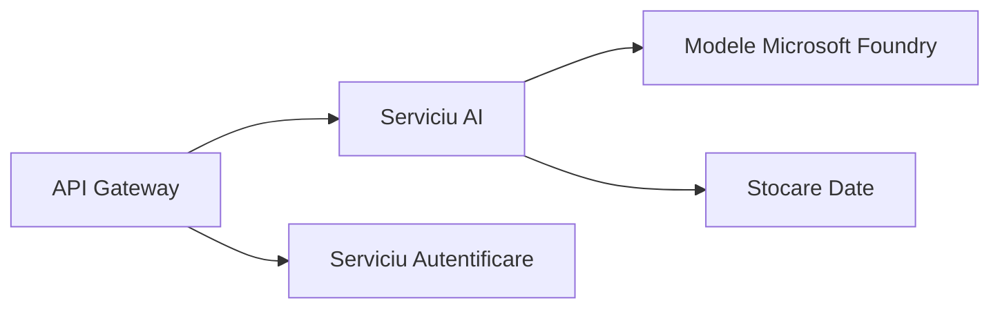
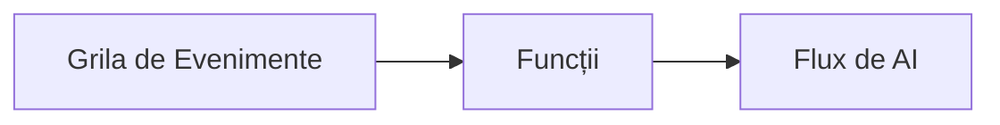

# Capitolul 8: Modele de Producție și Enterprise

**📚 Curs**: [AZD Pentru Începători](../../README.md) | **⏱️ Durată**: 2-3 ore | **⭐ Complexitate**: Avansat

---

## Prezentare Generală

Acest capitol acoperă modele de implementare pregătite pentru mediul enterprise, întărirea securității, monitorizarea și optimizarea costurilor pentru sarcini de lucru AI în producție.

## Obiective de Învățare

Prin finalizarea acestui capitol, vei:
- Implementa aplicații reziliente multi-regiune
- Implementa modele de securitate enterprise
- Configura monitorizare completă
- Optimiza costurile la scară
- Configura pipeline-uri CI/CD cu AZD

---

## 📚 Lecții

| # | Lecție | Descriere | Durată |
|---|--------|-----------|--------|
| 1 | [Practici AI de Producție](production-ai-practices.md) | Modele de implementare enterprise | 90 min |

---

## 🚀 Lista de Verificare pentru Producție

- [ ] Implementare multi-regiune pentru reziliență
- [ ] Identitate gestionată pentru autentificare (fără chei)
- [ ] Application Insights pentru monitorizare
- [ ] Bugete de cost și alerte configurate
- [ ] Scanare de securitate activată
- [ ] Integrare pipeline CI/CD
- [ ] Plan de recuperare în caz de dezastru

---

## 🏗️ Modele de Arhitectură

### Modelul 1: Microservicii AI


### Modelul 2: AI bazat pe Evenimente


---

## 🔐 Cele Mai Bune Practici de Securitate

```bicep
// Use managed identity
identity: {
  type: 'SystemAssigned'
}

// Private endpoints for AI services
properties: {
  publicNetworkAccess: 'Disabled'
  networkAcls: {
    defaultAction: 'Deny'
  }
}
```

---

## 💰 Optimizarea Costurilor

| Strategie | Economii |
|-----------|----------|
| Scalare la zero (Container Apps) | 60-80% |
| Folosirea nivelurilor de consum pentru dezvoltare | 50-70% |
| Scalare programată | 30-50% |
| Capacitate rezervată | 20-40% |

```bash
# Setează alerte pentru buget
az consumption budget create \
  --budget-name "AI-Budget" \
  --amount 500 \
  --category Cost \
  --time-grain Monthly
```

---

## 📊 Configurarea Monitorizării

```bash
# Flux de jurnale
azd monitor --logs

# Verifică Application Insights
azd monitor

# Vizualizează metrici
az monitor metrics list --resource <resource-id>
```

---

## 🔗 Navigare

| Direcție | Capitol |
|----------|---------|
| **Anterior** | [Capitolul 7: Depanare](../chapter-07-troubleshooting/README.md) |
| **Curs Finalizat** | [Pagina Cursului](../../README.md) |

---

## 📖 Resurse Aferente

- [Ghid Agenți AI](../chapter-02-ai-development/agents.md)
- [Application Insights](../chapter-06-pre-deployment/application-insights.md)
- [Soluții Multi-Agent](../chapter-05-multi-agent/README.md)
- [Exemplu Microservicii](../../examples/microservices/README.md)

---

<!-- CO-OP TRANSLATOR DISCLAIMER START -->
**Declinare a responsabilității**:  
Acest document a fost tradus folosind serviciul de traducere AI [Co-op Translator](https://github.com/Azure/co-op-translator). Deși ne străduim pentru acuratețe, vă rugăm să rețineți că traducerile automate pot conține erori sau inexactități. Documentul original în limba sa nativă trebuie considerat sursa autorizată. Pentru informații esențiale, se recomandă traducerea profesională realizată de un specialist uman. Nu ne asumăm responsabilitatea pentru eventualele neînțelegeri sau interpretări greșite rezultate din folosirea acestei traduceri.
<!-- CO-OP TRANSLATOR DISCLAIMER END -->