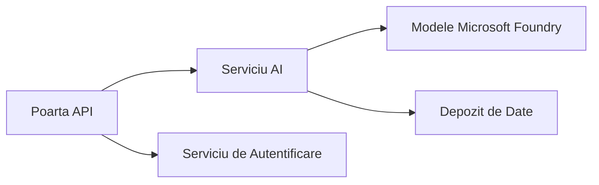
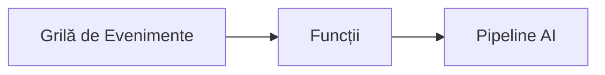

# Capitolul 8: Modele de Producție și Enterprise

**📚 Curs**: [AZD Pentru Începători](../../README.md) | **⏱️ Durată**: 2-3 ore | **⭐ Complexitate**: Avansat

---

## Prezentare generală

Acest capitol acoperă modele de implementare pregătite pentru întreprinderi, consolidarea securității, monitorizarea și optimizarea costurilor pentru sarcini de lucru AI în producție.

> Validat cu `azd 1.27.1` în iulie 2026.

## Obiective de învățare

Parcurgând acest capitol, vei:
- Implementa aplicații rezistente multi-regiune
- Implementa modele de securitate enterprise
- Configura monitorizare cuprinzătoare
- Optimiza costurile la scară largă
- Configura pipeline-uri CI/CD cu AZD

---

## 📚 Lecții

| # | Lecție | Descriere | Durată |
|---|--------|-------------|------|
| 1 | [Practici AI în Producție](production-ai-practices.md) | Modele de implementare enterprise | 90 min |

---

## 🚀 Lista de verificare pentru producție

- [ ] Implementare multi-regiune pentru reziliență
- [ ] Identitate gestionată pentru autentificare (fără chei)
- [ ] Application Insights pentru monitorizare
- [ ] Bugete și alerte de cost configurate
- [ ] Scanare de securitate activată
- [ ] Integrare pipeline CI/CD
- [ ] Plan de recuperare în caz de dezastru

---

## 🏗️ Modele arhitecturale

### Modelul 1: Microservicii AI



### Modelul 2: AI Eveniment-Condus



---

## 🔐 Cele mai bune practici de securitate

```bicep
// Use managed identity
identity: {
  type: 'SystemAssigned'
}

// Private endpoints for AI services
properties: {
  publicNetworkAccess: 'Disabled'
  networkAcls: {
    defaultAction: 'Deny'
  }
}
```

---

## 💰 Optimizarea costurilor

| Strategie | Economii |
|----------|---------|
| Scalare până la zero (Container Apps) | 60-80% |
| Folosirea nivelurilor de consum pentru dev | 50-70% |
| Scalare programată | 30-50% |
| Capacitate rezervată | 20-40% |

```bash
# Setează alerte de buget
az consumption budget create \
  --budget-name "AI-Budget" \
  --amount 500 \
  --category Cost \
  --time-grain Monthly
```

---

## 📊 Configurarea monitorizării

```bash
# Flux de jurnale
azd monitor --logs

# Verifică Application Insights
azd monitor --overview

# Vizualizează metrici
az monitor metrics list --resource <resource-id>
```

---

## 🔗 Navigare

| Direcție | Capitol |
|-----------|---------|
| **Anterior** | [Capitolul 7: Rezolvarea problemelor](../chapter-07-troubleshooting/README.md) |
| **Curs terminat** | [Pagina principală a cursului](../../README.md) |

---

## 📖 Resurse conexe

- [Ghid Agenți AI](../chapter-02-ai-development/agents.md)
- [Application Insights](../chapter-06-pre-deployment/application-insights.md)
- [Soluții Multi-Agent](../chapter-05-multi-agent/README.md)
- [Exemplu Microservicii](../../examples/microservices/README.md)

---

<!-- CO-OP TRANSLATOR DISCLAIMER START -->
**Declinare a responsabilității**:
Acest document a fost tradus folosind serviciul de traducere AI [Co-op Translator](https://github.com/Azure/co-op-translator). În timp ce ne străduim pentru acuratețe, vă rugăm să rețineți că traducerile automate pot conține erori sau inexactități. Documentul original în limba sa nativă trebuie considerat sursa autorizată. Pentru informații critice, se recomandă traducerea profesională realizată de un om. Nu ne asumăm responsabilitatea pentru eventualele neînțelegeri sau interpretări greșite care decurg din utilizarea acestei traduceri.
<!-- CO-OP TRANSLATOR DISCLAIMER END -->