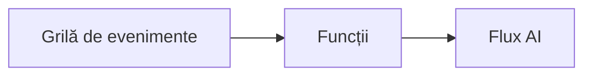

# Capitolul 8: Modele pentru Producție și Întreprinderi

**📚 Curs**: [AZD For Beginners](../../README.md) | **⏱️ Durată**: 2-3 hours | **⭐ Complexitate**: Avansat

---

## Prezentare generală

Acest capitol acoperă modele de implementare pregătite pentru întreprinderi, consolidarea securității, monitorizarea și optimizarea costurilor pentru sarcini AI de producție.

> Validat cu `azd 1.23.12` în martie 2026.

## Obiective de învățare

Prin finalizarea acestui capitol, veți:
- Desfășura aplicații reziliente în mai multe regiuni
- Implementa modele de securitate pentru întreprinderi
- Configura monitorizare completă
- Optimiza costurile la scară
- Configura pipeline-uri CI/CD cu AZD

---

## 📚 Lecții

| # | Lecție | Descriere | Durată |
|---|--------|-------------|------|
| 1 | [Practici AI pentru producție](production-ai-practices.md) | Modele de implementare pentru întreprinderi | 90 min |

---

## 🚀 Lista de verificare pentru producție

- [ ] Implementare multi-regiune pentru reziliență
- [ ] Identitate gestionată pentru autentificare (fără chei)
- [ ] Application Insights pentru monitorizare
- [ ] Bugete de cost și alerte configurate
- [ ] Scanare de securitate activată
- [ ] Integrare pipeline CI/CD
- [ ] Plan de recuperare în caz de dezastru

---

## 🏗️ Modele de arhitectură

### Model 1: Microservicii AI


### Model 2: AI orientat pe evenimente


---

## 🔐 Cele mai bune practici de securitate

```bicep
// Use managed identity
identity: {
  type: 'SystemAssigned'
}

// Private endpoints for AI services
properties: {
  publicNetworkAccess: 'Disabled'
  networkAcls: {
    defaultAction: 'Deny'
  }
}
```

---

## 💰 Optimizarea costurilor

| Strategie | Economii |
|----------|---------|
| Scalare la zero (Container Apps) | 60-80% |
| Utilizați niveluri pe consum pentru dezvoltare | 50-70% |
| Scalare programată | 30-50% |
| Capacitate rezervată | 20-40% |

```bash
# Setați alertele de buget
az consumption budget create \
  --budget-name "AI-Budget" \
  --amount 500 \
  --category Cost \
  --time-grain Monthly
```

---

## 📊 Configurare monitorizare

```bash
# Transmite jurnalele
azd monitor --logs

# Verifică Application Insights
azd monitor --overview

# Vizualizează metrici
az monitor metrics list --resource <resource-id>
```

---

## 🔗 Navigare

| Direcție | Capitol |
|-----------|---------|
| **Anterior** | [Capitolul 7: Depanare](../chapter-07-troubleshooting/README.md) |
| **Curs complet** | [Pagina cursului](../../README.md) |

---

## 📖 Resurse conexe

- [Ghid agenților AI](../chapter-02-ai-development/agents.md)
- [Application Insights](../chapter-06-pre-deployment/application-insights.md)
- [Soluții multi-agent](../chapter-05-multi-agent/README.md)
- [Exemplu de microservicii](../../examples/microservices/README.md)

---

<!-- CO-OP TRANSLATOR DISCLAIMER START -->
**Declinare de responsabilitate**:
Acest document a fost tradus folosind serviciul de traducere AI [Co-op Translator](https://github.com/Azure/co-op-translator). Deși ne străduim pentru acuratețe, vă rugăm să rețineți că traducerile automate pot conține erori sau inexactități. Documentul original în limba sa nativă ar trebui considerat sursa autorizată. Pentru informații critice, se recomandă traducerea profesională realizată de un traducător uman. Nu suntem răspunzători pentru niciun fel de neînțelegeri sau interpretări greșite care rezultă din utilizarea acestei traduceri.
<!-- CO-OP TRANSLATOR DISCLAIMER END -->