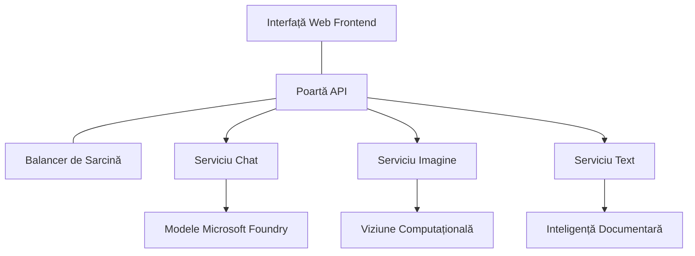

# Best Practices pentru Sarcini AI în Producție cu AZD

**Navigare capitole:**
- **📚 Acasă curs**: [AZD Pentru Începători](../../README.md)
- **📖 Capitol curent**: Capitolul 8 - Modele de Producție & Întreprindere
- **⬅️ Capitol anterior**: [Capitolul 7: Depanare](../chapter-07-troubleshooting/debugging.md)
- **⬅️ De asemenea legat**: [Laborator AI Workshop](ai-workshop-lab.md)
- **🎯 Curs complet**: [AZD Pentru Începători](../../README.md)

## Prezentare generală

Acest ghid oferă cele mai bune practici cuprinzătoare pentru implementarea sarcinilor AI pregătite pentru producție folosind Azure Developer CLI (AZD). Bazat pe feedback-ul comunității Microsoft Foundry Discord și pe implementările reale ale clienților, aceste practici abordează cele mai frecvente provocări în sistemele AI de producție.

## Provocări cheie abordate

Bazat pe rezultatele sondajului comunității noastre, acestea sunt principalele provocări cu care se confruntă dezvoltatorii:

- **45%** se luptă cu implementări AI multi-serviciu
- **38%** au probleme cu gestionarea acreditărilor și secretelor  
- **35%** consideră dificilă pregătirea pentru producție și scalarea
- **32%** au nevoie de strategii mai bune de optimizare a costurilor
- **29%** necesită monitorizare și depanare îmbunătățite

## Modele de arhitectură pentru AI în producție

### Modelul 1: Arhitectura AI bazată pe Microservicii

**Când se folosește**: Aplicații AI complexe cu multiple capabilități



**Implementare AZD**:

```yaml
# azure.yaml
name: enterprise-ai-platform
services:
  web:
    project: ./web
    host: staticwebapp
  api-gateway:
    project: ./api-gateway
    host: containerapp
  chat-service:
    project: ./services/chat
    host: containerapp
  vision-service:
    project: ./services/vision
    host: containerapp
  text-service:
    project: ./services/text
    host: containerapp
```

### Modelul 2: Procesare AI Bazată pe Evenimente

**Când se folosește**: Procesare în batch, analiză documente, fluxuri de lucru asincrone

```bicep
// Event Hub for AI processing pipeline
resource eventHub 'Microsoft.EventHub/namespaces@2023-01-01-preview' = {
  name: eventHubNamespaceName
  location: location
  sku: {
    name: 'Standard'
    tier: 'Standard'
    capacity: 1
  }
}

// Service Bus for reliable message processing
resource serviceBus 'Microsoft.ServiceBus/namespaces@2022-10-01-preview' = {
  name: serviceBusNamespaceName
  location: location
  sku: {
    name: 'Premium'
    tier: 'Premium'
    capacity: 1
  }
}

// Function App for processing
resource functionApp 'Microsoft.Web/sites@2023-01-01' = {
  name: functionAppName
  location: location
  kind: 'functionapp,linux'
  properties: {
    siteConfig: {
      appSettings: [
        {
          name: 'FUNCTIONS_EXTENSION_VERSION'
          value: '~4'
        }
        {
          name: 'AZURE_OPENAI_ENDPOINT'
          value: '@Microsoft.KeyVault(VaultName=${keyVault.name};SecretName=openai-endpoint)'
        }
      ]
    }
  }
}
```

## Gândind la Sănătatea Agentului AI

Când o aplicație web tradițională se strică, simptomele sunt familiare: o pagină nu se încarcă, o API returnează o eroare sau o implementare eșuează. Aplicațiile bazate pe AI se pot strica în toate aceste moduri – dar pot avea și comportamente subtile care nu produc mesaje de eroare evidente.

Această secțiune te ajută să construiești un model mental pentru monitorizarea sarcinilor AI ca să știi unde să te uiți când lucrurile nu par în regulă.

### Cum diferă sănătatea agentului de sănătatea unei aplicații tradiționale

O aplicație tradițională fie funcționează, fie nu. Un agent AI poate părea că funcționează, dar să ofere rezultate slabe. Gândește sănătatea agentului în două straturi:

| Strat | Ce să urmărești | Unde să te uiți |
|-------|-----------------|-----------------|
| **Sănătatea infrastructurii** | Serviciul este în funcțiune? Sunt resursele provisionate? Sunt punctele finale accesibile? | `azd monitor`, sănătatea resurselor din Azure Portal, jurnalele containerului/aplicației |
| **Sănătatea comportamentală** | Agentul răspunde corect? Răspunsurile sunt rapide? Modelul este apelat corect? | Trasee Application Insights, metrici de latență apel model, jurnale de calitate a răspunsului |

Sănătatea infrastructurii este familiară – este aceeași pentru orice aplicație azd. Sănătatea comportamentală este noul strat pe care îl introduc sarcinile AI.

### Unde să te uiți când aplicațiile AI nu se comportă așa cum se așteaptă

Dacă aplicația ta AI nu produce rezultatele așteptate, iată o listă conceptuală:

1. **Începe cu elementele de bază.** Aplicația rulează? Poate accesa dependențele? Verifică `azd monitor` și sănătatea resurselor așa cum ai face pentru orice aplicație.
2. **Verifică conexiunea cu modelul.** Aplicația ta apelează cu succes modelul AI? Apelurile modelului eșuate sau cu timeout sunt cauza cea mai comună a problemelor aplicațiilor AI și vor apărea în jurnalele aplicației.
3. **Privește ce a primit modelul.** Răspunsurile AI depind de input (promptul și orice context preluat). Dacă outputul este greșit, inputul este de obicei greșit. Verifică dacă aplicația ta trimite datele corecte către model.
4. **Revizuiește latența răspunsului.** Apelurile la modelele AI sunt mai lente decât apelurile API obișnuite. Dacă aplicația pare lentă, verifică dacă timpul de răspuns al modelului a crescut – acest lucru poate indica throttling, limite de capacitate sau congestie la nivel de regiune.
5. **Fii atent la semnalele legate de costuri.** Creșteri neașteptate în utilizarea tokenilor sau apeluri API pot indica un loop, un prompt configurat greșit sau retry-uri excesive.

Nu trebuie să stăpânești imediat unelte de observabilitate. Principala concluzie este că aplicațiile AI au un strat suplimentar de comportament de monitorizat, iar monitorizarea încorporată azd (`azd monitor`) îți oferă un punct de plecare pentru investigarea ambelor straturi.

---

## Cele mai bune practici de securitate

### 1. Model de securitate Zero-Trust

**Strategie de implementare**:
- Nicio comunicare serviciu-la-serviciu fără autentificare
- Toate apelurile API folosesc identități gestionate
- Izolare de rețea cu puncte finale private
- Controale de acces cu privilegiu minim

```bicep
// Managed Identity for each service
resource chatServiceIdentity 'Microsoft.ManagedIdentity/userAssignedIdentities@2023-01-31' = {
  name: 'chat-service-identity'
  location: location
}

// Role assignments with minimal permissions
resource openAIUserRole 'Microsoft.Authorization/roleAssignments@2022-04-01' = {
  scope: openAIAccount
  name: guid(openAIAccount.id, chatServiceIdentity.id, openAIUserRoleDefinitionId)
  properties: {
    roleDefinitionId: subscriptionResourceId('Microsoft.Authorization/roleDefinitions', '5e0bd9bd-7b93-4f28-af87-19fc36ad61bd')
    principalId: chatServiceIdentity.properties.principalId
    principalType: 'ServicePrincipal'
  }
}
```

### 2. Gestionarea securizată a secretelor

**Model de integrare Key Vault**:

```bicep
// Key Vault with proper access policies
resource keyVault 'Microsoft.KeyVault/vaults@2023-02-01' = {
  name: keyVaultName
  location: location
  properties: {
    tenantId: tenant().tenantId
    sku: {
      family: 'A'
      name: 'premium'  // Use premium for production
    }
    enableRbacAuthorization: true  // Use RBAC instead of access policies
    enablePurgeProtection: true    // Prevent accidental deletion
    enableSoftDelete: true
    softDeleteRetentionInDays: 90
  }
}

// Store all AI service credentials
resource openAIKeySecret 'Microsoft.KeyVault/vaults/secrets@2023-02-01' = {
  parent: keyVault
  name: 'openai-api-key'
  properties: {
    value: openAIAccount.listKeys().key1
    attributes: {
      enabled: true
    }
  }
}
```

### 3. Securitatea rețelei

**Configurare punct final privat**:

```bicep
// Virtual Network for AI services
resource virtualNetwork 'Microsoft.Network/virtualNetworks@2023-04-01' = {
  name: vnetName
  location: location
  properties: {
    addressSpace: {
      addressPrefixes: ['10.0.0.0/16']
    }
    subnets: [
      {
        name: 'ai-services-subnet'
        properties: {
          addressPrefix: '10.0.1.0/24'
          privateEndpointNetworkPolicies: 'Disabled'
        }
      }
      {
        name: 'app-services-subnet'
        properties: {
          addressPrefix: '10.0.2.0/24'
          delegations: [
            {
              name: 'Microsoft.Web/serverFarms'
              properties: {
                serviceName: 'Microsoft.Web/serverFarms'
              }
            }
          ]
        }
      }
    ]
  }
}

// Private endpoints for all AI services
resource openAIPrivateEndpoint 'Microsoft.Network/privateEndpoints@2023-04-01' = {
  name: '${openAIAccountName}-pe'
  location: location
  properties: {
    subnet: {
      id: virtualNetwork.properties.subnets[0].id
    }
    privateLinkServiceConnections: [
      {
        name: 'openai-connection'
        properties: {
          privateLinkServiceId: openAIAccount.id
          groupIds: ['account']
        }
      }
    ]
  }
}
```

## Performanță și scalare

### 1. Strategii de auto-scalare

**Auto-scalare pentru container apps**:

```bicep
resource containerApp 'Microsoft.App/containerApps@2023-05-01' = {
  name: containerAppName
  location: location
  properties: {
    configuration: {
      ingress: {
        external: true
        targetPort: 8000
        transport: 'http'
      }
    }
    template: {
      scale: {
        minReplicas: 2  // Always have 2 instances minimum
        maxReplicas: 50 // Scale up to 50 for high load
        rules: [
          {
            name: 'http-scaling'
            http: {
              metadata: {
                concurrentRequests: '20'  // Scale when >20 concurrent requests
              }
            }
          }
          {
            name: 'cpu-scaling'
            custom: {
              type: 'cpu'
              metadata: {
                type: 'Utilization'
                value: '70'  // Scale when CPU >70%
              }
            }
          }
        ]
      }
    }
  }
}
```

### 2. Strategii de caching

**Cache Redis pentru răspunsurile AI**:

```bicep
// Redis Premium for production workloads
resource redisCache 'Microsoft.Cache/redis@2023-04-01' = {
  name: redisCacheName
  location: location
  properties: {
    sku: {
      name: 'Premium'
      family: 'P'
      capacity: 1
    }
    enableNonSslPort: false
    minimumTlsVersion: '1.2'
    redisConfiguration: {
      'maxmemory-policy': 'allkeys-lru'
    }
    // Enable clustering for high availability
    redisVersion: '6.0'
    shardCount: 2
  }
}

// Cache configuration in application
var cacheConnectionString = '${redisCache.properties.hostName}:6380,password=${redisCache.listKeys().primaryKey},ssl=True,abortConnect=False'
```

### 3. Echilibrare sarcină și management trafic

**Application Gateway cu WAF**:

```bicep
// Application Gateway with Web Application Firewall
resource applicationGateway 'Microsoft.Network/applicationGateways@2023-04-01' = {
  name: appGatewayName
  location: location
  properties: {
    sku: {
      name: 'WAF_v2'
      tier: 'WAF_v2'
      capacity: 2
    }
    webApplicationFirewallConfiguration: {
      enabled: true
      firewallMode: 'Prevention'
      ruleSetType: 'OWASP'
      ruleSetVersion: '3.2'
    }
    // Backend pools for AI services
    backendAddressPools: [
      {
        name: 'ai-services-pool'
        properties: {
          backendAddresses: [
            {
              fqdn: '${containerApp.properties.configuration.ingress.fqdn}'
            }
          ]
        }
      }
    ]
  }
}
```

## 💰 Optimizarea costurilor

### 1. Dimensiunea corectă a resurselor

**Configurații specifice mediului**:

```bash
# Mediu de dezvoltare
azd env new development
azd env set AZURE_OPENAI_SKU "S0"
azd env set AZURE_OPENAI_CAPACITY 10
azd env set AZURE_SEARCH_SKU "basic"
azd env set CONTAINER_CPU 0.5
azd env set CONTAINER_MEMORY 1.0

# Mediu de producție
azd env new production
azd env set AZURE_OPENAI_SKU "S0"
azd env set AZURE_OPENAI_CAPACITY 100
azd env set AZURE_SEARCH_SKU "standard"
azd env set CONTAINER_CPU 2.0
azd env set CONTAINER_MEMORY 4.0
```

### 2. Monitorizarea costurilor și bugete

```bicep
// Cost management and budgets
resource budget 'Microsoft.Consumption/budgets@2023-05-01' = {
  name: 'ai-workload-budget'
  properties: {
    timePeriod: {
      startDate: '2024-01-01'
      endDate: '2024-12-31'
    }
    timeGrain: 'Monthly'
    amount: 2000  // $2000 monthly budget
    category: 'Cost'
    notifications: {
      warning: {
        enabled: true
        operator: 'GreaterThan'
        threshold: 80
        contactEmails: [
          'finance@company.com'
          'engineering@company.com'
        ]
        contactRoles: [
          'Owner'
          'Contributor'
        ]
      }
      critical: {
        enabled: true
        operator: 'GreaterThan'
        threshold: 95
        contactEmails: [
          'cto@company.com'
        ]
      }
    }
  }
}
```

### 3. Optimizarea utilizării tokenilor

**Managementul costurilor OpenAI**:

```typescript
// Optimizarea token-urilor la nivel de aplicație
class TokenOptimizer {
  private readonly maxTokens = 4000;
  private readonly reserveTokens = 500;
  
  optimizePrompt(userInput: string, context: string): string {
    const availableTokens = this.maxTokens - this.reserveTokens;
    const estimatedTokens = this.estimateTokens(userInput + context);
    
    if (estimatedTokens > availableTokens) {
      // Trunchiază contextul, nu intrarea utilizatorului
      context = this.truncateContext(context, availableTokens - this.estimateTokens(userInput));
    }
    
    return `${context}\n\nUser: ${userInput}`;
  }
  
  private estimateTokens(text: string): number {
    // Estimare aproximativă: 1 token ≈ 4 caractere
    return Math.ceil(text.length / 4);
  }
}
```

## Monitorizare și observabilitate

### 1. Application Insights complet

```bicep
// Application Insights with advanced features
resource applicationInsights 'Microsoft.Insights/components@2020-02-02' = {
  name: applicationInsightsName
  location: location
  kind: 'web'
  properties: {
    Application_Type: 'web'
    WorkspaceResourceId: logAnalyticsWorkspace.id
    SamplingPercentage: 100  // Full sampling for AI apps
    DisableIpMasking: false  // Enable for security
  }
}

// Custom metrics for AI operations
resource aiMetricAlerts 'Microsoft.Insights/metricAlerts@2018-03-01' = {
  name: 'ai-high-error-rate'
  location: 'global'
  properties: {
    description: 'Alert when AI service error rate is high'
    severity: 2
    enabled: true
    scopes: [
      applicationInsights.id
    ]
    evaluationFrequency: 'PT1M'
    windowSize: 'PT5M'
    criteria: {
      'odata.type': 'Microsoft.Azure.Monitor.SingleResourceMultipleMetricCriteria'
      allOf: [
        {
          name: 'high-error-rate'
          metricName: 'requests/failed'
          operator: 'GreaterThan'
          threshold: 10
          timeAggregation: 'Count'
        }
      ]
    }
  }
}
```

### 2. Monitorizare specifică AI

**Dashboard-uri personalizate pentru metrici AI**:

```json
// Dashboard configuration for AI workloads
{
  "dashboard": {
    "name": "AI Application Monitoring",
    "tiles": [
      {
        "name": "OpenAI Request Volume",
        "query": "requests | where name contains 'openai' | summarize count() by bin(timestamp, 5m)"
      },
      {
        "name": "AI Response Latency",
        "query": "requests | where name contains 'openai' | summarize avg(duration) by bin(timestamp, 5m)"
      },
      {
        "name": "Token Usage",
        "query": "customMetrics | where name == 'openai_tokens_used' | summarize sum(value) by bin(timestamp, 1h)"
      },
      {
        "name": "Cost per Hour",
        "query": "customMetrics | where name == 'openai_cost' | summarize sum(value) by bin(timestamp, 1h)"
      }
    ]
  }
}
```

### 3. Verificări de sănătate și monitorizare uptime

```bicep
// Application Insights availability tests
resource availabilityTest 'Microsoft.Insights/webtests@2022-06-15' = {
  name: 'ai-app-availability-test'
  location: location
  tags: {
    'hidden-link:${applicationInsights.id}': 'Resource'
  }
  properties: {
    SyntheticMonitorId: 'ai-app-availability-test'
    Name: 'AI Application Availability Test'
    Description: 'Tests AI application endpoints'
    Enabled: true
    Frequency: 300  // 5 minutes
    Timeout: 120    // 2 minutes
    Kind: 'ping'
    Locations: [
      {
        Id: 'us-east-2-azr'
      }
      {
        Id: 'us-west-2-azr'
      }
    ]
    Configuration: {
      WebTest: '''
        <WebTest Name="AI Health Check" 
                 Id="8d2de8d2-a2b0-4c2e-9a0d-8f9c9a0b8c8d" 
                 Enabled="True" 
                 CssProjectStructure="" 
                 CssIteration="" 
                 Timeout="120" 
                 WorkItemIds="" 
                 xmlns="http://microsoft.com/schemas/VisualStudio/TeamTest/2010" 
                 Description="" 
                 CredentialUserName="" 
                 CredentialPassword="" 
                 PreAuthenticate="True" 
                 Proxy="default" 
                 StopOnError="False" 
                 RecordedResultFile="" 
                 ResultsLocale="">
          <Items>
            <Request Method="GET" 
                     Guid="a5f10126-e4cd-570d-961c-cea43999a200" 
                     Version="1.1" 
                     Url="${webApp.properties.defaultHostName}/health" 
                     ThinkTime="0" 
                     Timeout="120" 
                     ParseDependentRequests="True" 
                     FollowRedirects="True" 
                     RecordResult="True" 
                     Cache="False" 
                     ResponseTimeGoal="0" 
                     Encoding="utf-8" 
                     ExpectedHttpStatusCode="200" 
                     ExpectedResponseUrl="" 
                     ReportingName="" 
                     IgnoreHttpStatusCode="False" />
          </Items>
        </WebTest>
      '''
    }
  }
}
```

## Recuperare după dezastru și disponibilitate ridicată

### 1. Implementare multi-regiune

```yaml
# azure.yaml - Multi-region configuration
name: ai-app-multiregion
services:
  api-primary:
    project: ./api
    host: containerapp
    env:
      - AZURE_REGION=eastus
  api-secondary:
    project: ./api
    host: containerapp
    env:
      - AZURE_REGION=westus2
```

```bicep
// Traffic Manager for global load balancing
resource trafficManager 'Microsoft.Network/trafficManagerProfiles@2022-04-01' = {
  name: trafficManagerProfileName
  location: 'global'
  properties: {
    profileStatus: 'Enabled'
    trafficRoutingMethod: 'Priority'
    dnsConfig: {
      relativeName: trafficManagerProfileName
      ttl: 30
    }
    monitorConfig: {
      protocol: 'HTTPS'
      port: 443
      path: '/health'
      intervalInSeconds: 30
      toleratedNumberOfFailures: 3
      timeoutInSeconds: 10
    }
    endpoints: [
      {
        name: 'primary-endpoint'
        type: 'Microsoft.Network/trafficManagerProfiles/azureEndpoints'
        properties: {
          targetResourceId: primaryAppService.id
          endpointStatus: 'Enabled'
          priority: 1
        }
      }
      {
        name: 'secondary-endpoint'
        type: 'Microsoft.Network/trafficManagerProfiles/azureEndpoints'
        properties: {
          targetResourceId: secondaryAppService.id
          endpointStatus: 'Enabled'
          priority: 2
        }
      }
    ]
  }
}
```

### 2. Backup și recuperare date

```bicep
// Backup configuration for critical data
resource backupVault 'Microsoft.DataProtection/backupVaults@2023-05-01' = {
  name: backupVaultName
  location: location
  identity: {
    type: 'SystemAssigned'
  }
  properties: {
    storageSettings: [
      {
        datastoreType: 'VaultStore'
        type: 'LocallyRedundant'
      }
    ]
  }
}

// Backup policy for AI models and data
resource backupPolicy 'Microsoft.DataProtection/backupVaults/backupPolicies@2023-05-01' = {
  parent: backupVault
  name: 'ai-data-backup-policy'
  properties: {
    policyRules: [
      {
        backupParameters: {
          backupType: 'Full'
          objectType: 'AzureBackupParams'
        }
        trigger: {
          schedule: {
            repeatingTimeIntervals: [
              'R/2024-01-01T02:00:00+00:00/P1D'  // Daily at 2 AM
            ]
          }
          objectType: 'ScheduleBasedTriggerContext'
        }
        dataStore: {
          datastoreType: 'VaultStore'
          objectType: 'DataStoreInfoBase'
        }
        name: 'BackupDaily'
        objectType: 'AzureBackupRule'
      }
    ]
  }
}
```

## Integrare DevOps și CI/CD

### 1. Flux de lucru GitHub Actions

```yaml
# .github/workflows/deploy-ai-app.yml
name: Deploy AI Application

on:
  push:
    branches: [main]
  pull_request:
    branches: [main]

jobs:
  test:
    runs-on: ubuntu-latest
    steps:
      - uses: actions/checkout@v4
      
      - name: Setup Python
        uses: actions/setup-python@v4
        with:
          python-version: '3.11'
          
      - name: Install dependencies
        run: |
          pip install -r requirements.txt
          pip install pytest
          
      - name: Run tests
        run: pytest tests/
        
      - name: AI Safety Tests
        run: |
          python scripts/test_ai_safety.py
          python scripts/validate_prompts.py

  deploy-staging:
    needs: test
    if: github.event_name == 'pull_request'
    runs-on: ubuntu-latest
    steps:
      - uses: actions/checkout@v4
      
      - name: Setup AZD
        uses: Azure/setup-azd@v2
        
      - name: Login to Azure
        uses: azure/login@v1
        with:
          creds: ${{ secrets.AZURE_CREDENTIALS }}
          
      - name: Deploy to Staging
        run: |
          azd env select staging
          azd deploy

  deploy-production:
    needs: test
    if: github.ref == 'refs/heads/main'
    runs-on: ubuntu-latest
    steps:
      - uses: actions/checkout@v4
      
      - name: Setup AZD
        uses: Azure/setup-azd@v2
        
      - name: Login to Azure
        uses: azure/login@v1
        with:
          creds: ${{ secrets.AZURE_CREDENTIALS }}
          
      - name: Deploy to Production
        run: |
          azd env select production
          azd deploy
          
      - name: Run Production Health Checks
        run: |
          python scripts/health_check.py --env production
```

### 2. Validarea infrastructurii

```bash
# scripts/validate_infrastructure.sh
#!/bin/bash

echo "Validating AI infrastructure deployment..."

# Verifică dacă toate serviciile necesare sunt în funcțiune
services=("openai" "search" "storage" "keyvault")
for service in "${services[@]}"; do
    echo "Checking $service..."
    if ! az resource list --resource-type "Microsoft.CognitiveServices/accounts" --query "[?contains(name, '$service')]" -o tsv; then
        echo "ERROR: $service not found"
        exit 1
    fi
done

# Validează implementările modelelor OpenAI
echo "Validating OpenAI model deployments..."
models=$(az cognitiveservices account deployment list --name $AZURE_OPENAI_NAME --resource-group $AZURE_RESOURCE_GROUP --query "[].name" -o tsv)
if [[ ! $models == *"gpt-4.1-mini"* ]]; then
  echo "ERROR: Required model gpt-4.1-mini not deployed"
    exit 1
fi

# Testează conectivitatea serviciului AI
echo "Testing AI service connectivity..."
python scripts/test_connectivity.py

echo "Infrastructure validation completed successfully!"
```

## Lista de verificare pentru pregătirea în producție

### Securitate ✅
- [ ] Toate serviciile folosesc identități gestionate
- [ ] Secretele stocate în Key Vault
- [ ] Puncte finale private configurate
- [ ] Grupuri de securitate rețea implementate
- [ ] RBAC cu privilegiu minim
- [ ] WAF activat pe punctele finale publice

### Performanță ✅
- [ ] Auto-scalare configurată
- [ ] Caching implementat
- [ ] Echilibrare sarcină configurată
- [ ] CDN pentru conținut static
- [ ] Pooling conexiuni bază de date
- [ ] Optimizare utilizare tokeni

### Monitorizare ✅
- [ ] Application Insights configurat
- [ ] Metrici personalizate definite
- [ ] Reguli de alertare setate
- [ ] Dashboard creat
- [ ] Verificări de sănătate implementate
- [ ] Politici de retenție loguri

### Fiabilitate ✅
- [ ] Implementare multi-regiune
- [ ] Plan de backup și recuperare
- [ ] Circuit breakere implementate
- [ ] Politici de retry configurate
- [ ] Degradare grațioasă
- [ ] Endpoints pentru verificări de sănătate

### Gestionarea costurilor ✅
- [ ] Alarme pentru buget configurate
- [ ] Dimensionarea corectă a resurselor
- [ ] Discount-uri pentru dev/test aplicate
- [ ] Instanțe rezervate cumpărate
- [ ] Dashboard pentru monitorizarea costurilor
- [ ] Recenzii regulate ale costurilor

### Conformitate ✅
- [ ] Cerințe de rezidență a datelor îndeplinite
- [ ] Auditare log activată
- [ ] Politici de conformitate aplicate
- [ ] Bazele de securitate implementate
- [ ] Evaluări regulate de securitate
- [ ] Plan de răspuns la incidente

## Repere de performanță

### Metrici tipice pentru producție

| Metrică | Țintă | Monitorizare |
|---------|-------|--------------|
| **Timp răspuns** | < 2 secunde | Application Insights |
| **Disponibilitate** | 99.9% | Monitorizare uptime |
| **Rata erorilor** | < 0.1% | Jurnale aplicație |
| **Utilizare tokeni** | < 500 $/lună | Management costuri |
| **Utilizatori concurenți** | 1000+ | Testare încărcare |
| **Timp de recuperare** | < 1 oră | Teste recuperare după dezastru |

### Testare de încărcare

```bash
# Script de testare a încărcării pentru aplicații AI
python scripts/load_test.py \
  --endpoint https://your-ai-app.azurewebsites.net \
  --concurrent-users 100 \
  --duration 300 \
  --ramp-up 60
```

## 🤝 Cele mai bune practici ale comunității

Bazat pe feedback-ul comunității Microsoft Foundry Discord:

### Cele mai bune recomandări din partea comunității:

1. **Începe mic, scalează gradual**: Începe cu SKU-uri de bază și crește în funcție de utilizarea reală
2. **Monitorizează totul**: Configurează monitorizarea completă de la prima zi
3. **Automatizează securitatea**: Folosește infrastructura ca și cod pentru securitate consecventă
4. **Testează temeinic**: Include teste specifice AI în pipeline-ul tău
5. **Planifică costurile**: Monitorizează utilizarea tokenilor și setează alerte de buget devreme

### Capcane comune de evitat:

- ❌ Stocarea cheilor API direct în cod
- ❌ Lipsa configurării monitorizării
- ❌ Ignorarea optimizării costurilor
- ❌ Lipsa testării scenariilor de eșec
- ❌ Implementări fără verificări de sănătate

## Comenzi și extensii AZD AI CLI

AZD include un set în creștere de comenzi și extensii specifice AI care facilitează fluxurile de lucru AI în producție. Aceste instrumente fac legătura între dezvoltarea locală și implementarea în producție a sarcinilor AI.

### Extensii AZD pentru AI

AZD folosește un sistem de extensii pentru a adăuga capabilități specifice AI. Instalează și gestionează extensiile cu:

```bash
# Listează toate extensiile disponibile (inclusiv AI)
azd extension list

# Inspectează detaliile extensiilor instalate
azd extension show azure.ai.agents

# Instalează extensia agenților Foundry
azd extension install azure.ai.agents

# Instalează extensia pentru ajustare fină
azd extension install azure.ai.finetune

# Instalează extensia pentru modele personalizate
azd extension install azure.ai.models

# Actualizează toate extensiile instalate
azd extension upgrade --all
```

**Extensii AI disponibile:**

| Extensie | Scop | Stare |
|----------|-------|-------|
| `azure.ai.agents` | Gestionare Foundry Agent Service | Preview |
| `azure.ai.skills` | Abilități reutilizabile ale agentului | Preview |
| `azure.ai.connections` | Conexiuni Foundry (surse de date, unelte) | Preview |
| `azure.ai.finetune` | Fine-tuning model Foundry | Preview |
| `azure.ai.models` | Modele personalizate Foundry | Preview |
| `azure.coding-agent` | Configurare agent de codare | Disponibil |

> Extensia `azure.ai.agents` evoluează rapid. Acest curs este validat pentru `0.1.40-preview`. Rulează `azd extension upgrade --all` pentru a prelua cele mai recente comenzi, și `azd extension show azure.ai.agents` pentru a verifica versiunea instalată.

**Ce sunt noile extensii `skills` și `connections`?**

Două extensii preview au apărut odată cu uneltele agentului și merită să le înțelegi chiar și ca începător:

- **`azure.ai.skills`** — O **abilitate (skill)** este o capacitate reutilizabilă (un instrument sau comportament ambalat) pe care o poți atașa unul sau mai mulți agenți în loc să o implementezi de fiecare dată. Gândește-o ca pe un bloc de construcție partajat: definește o abilitate „căutare în documentație” sau „căutare comandă” o dată, apoi recicleaz-o între agenți. Aceasta menține consistente sistemele multi-agent (Capitolul 5) și evită copy-paste-ul.
- **`azure.ai.connections`** — O **conexiune** este un link gestionat din proiectul tău Foundry către o resursă externă de care agenții au nevoie – o sursă de date (cum ar fi Azure AI Search), un endpoint de unelte sau un alt serviciu. Conexiunile centralizează *unde* și *cum* agenții accesează date, astfel încât acreditările și punctele finale să fie într-un loc guvernat în loc să fie împrăștiate în cod.

Nu ai nevoie de acestea pentru a implementa primii agenți – rămâi la `azure.ai.agents` până înveți. Folosește `skills` când observi că duplici același instrument printre agenți, iar `connections` când mai mulți agenți împart aceeași sursă de date.

### Inițializarea proiectelor agent cu `azd ai agent init`

Comanda `azd ai agent init` creează un proiect agent AI pregătit pentru producție, integrat cu Microsoft Foundry Agent Service:

```bash
# Inițializează un nou proiect agent dintr-un manifest agent
azd ai agent init -m <manifest-path-or-uri>

# Inițializează și vizează un proiect Foundry specific
azd ai agent init -m agent-manifest.yaml --project-id <foundry-project-id>

# Inițializează cu un director sursă personalizat
azd ai agent init -m agent-manifest.yaml --src ./agents/my-agent

# Vizează Container Apps ca gazdă
azd ai agent init -m agent-manifest.yaml --host containerapp
```

**Flag-uri cheie:**

| Flag | Descriere |
|------|-----------|
| `-m, --manifest` | Calea sau URI către un manifest agent de adăugat în proiect |
| `-p, --project-id` | ID-ul proiectului Microsoft Foundry existent pentru mediul azd |
| `-s, --src` | Director de descărcare al definiției agentului (implicit `src/<agent-id>`) |
| `--host` | Suprascrie host-ul implicit (exemplu: `containerapp`) |
| `-e, --environment` | Mediul azd de utilizat |

**Sfat pentru producție**: Folosește `--project-id` pentru a te conecta direct la un proiect Foundry existent, menținând codul agentului și resursele cloud legate de la început.

### Gestionarea ciclului de viață al agentului

Dincolo de `init`, extensia `azure.ai.agents` oferă comenzi pentru întregul ciclu de viață al unui agent găzduit — testare, evaluare, optimizare și retragere:

```bash
# Invocă un agent implementat și vizualizează timpul răspunsului serverului
# (latența totală și timpul până la primul octet)
azd ai agent invoke

# Afișează configurația endpoint-ului live înainte de a o modifica
azd ai agent endpoint show

# Generează un set de date de evaluare pentru agent
azd ai agent eval generate --dataset ./eval/dataset.jsonl

# Optimizează instrucțiunile agentului pe baza datelor tale de evaluare
# (necesită un optimization_model în proiectul agentului)
azd ai agent optimize

# Descarcă sursa implementată a unui agent găzduit bazat pe cod
# (cu verificare SHA-256)
azd ai agent code download

# Șterge un agent găzduit și toate versiunile sale
# (--force încheie sesiunile active)
azd ai agent delete --force
```

**Ciclul de viață pe scurt:**

| Etapă | Comandă | Utilizare în producție |
|--------|---------|-----------------------|
| Test | `azd ai agent invoke` | Validarea răspunsurilor și măsurarea latenței înainte de lansare |
| Inspectare | `azd ai agent endpoint show` | Revizuirea autentificării/configurării endpoint; identificare schimbări critice devreme |
| Măsurare | `azd ai agent eval generate` | Construirea unui set de evaluare repetabil din date reale |
| Îmbunătățire | `azd ai agent optimize` | Ajustarea instrucțiunilor în funcție de calitatea măsurată |
| Recuperare | `azd ai agent code download` | Recuperarea exactă a sursei implementate pentru audit/rollback |
| Retragere | `azd ai agent delete --force` | Dezmembrarea unui agent și a versiunilor sale curat |

> Aceste comenzi sunt în preview și pot varia între versiuni ale extensiei. Rulează `azd ai agent --help` pentru a vedea subcomenzile disponibile în versiunea ta instalată.

### Protocolul de context al modelului (MCP) cu `azd mcp`
AZD include suport încorporat pentru serverul MCP (Alpha), permițând agenților AI și uneltelor să interacționeze cu resursele tale Azure printr-un protocol standardizat:

```bash
# Porniți serverul MCP pentru proiectul dvs.
azd mcp start

# Revizuiți regulile actuale de consimțământ Copilot pentru executarea instrumentului
azd copilot consent list
```

Serverul MCP expune contextul proiectului tău azd — medii, servicii și resurse Azure — către uneltele de dezvoltare asistate de AI. Aceasta permite:

- **Implementare asistată de AI**: Permite agenților de codare să interogheze starea proiectului tău și să declanșeze implementări
- **Descoperirea resurselor**: Uneltele AI pot descoperi ce resurse Azure folosește proiectul tău
- **Gestionarea mediilor**: Agenții pot comuta între mediile dev/staging/production

### Generarea infrastructurii cu `azd infra generate`

Pentru sarcini AI în producție, poți genera și personaliza Infrastructure as Code în loc să te bazezi pe aprovizionarea automată:

```bash
# Generează fișiere Bicep/Terraform din definiția proiectului tău
azd infra generate
```

Aceasta scrie IaC pe disc pentru a putea:
- Revizui și audita infrastructura înainte de implementare
- Adăuga politici de securitate personalizate (reguli de rețea, endpointuri private)
- Integra cu procesele existente de revizuire IaC
- Controla versiunile modificărilor infrastructurii separat de codul aplicației

### Hook-uri în ciclul de viață al producției

Hook-urile AZD îți permit să injecți logică personalizată în fiecare etapă a ciclului de viață al implementării — critic pentru fluxurile de lucru AI în producție:

```yaml
# azure.yaml - Production hooks example
name: ai-production-app
hooks:
  preprovision:
    shell: sh
    run: scripts/validate-quotas.sh    # Check AI model quota before provisioning
  postprovision:
    shell: sh
    run: scripts/configure-networking.sh  # Set up private endpoints
  predeploy:
    shell: sh
    run: scripts/run-ai-safety-tests.sh  # Run prompt safety checks
  postdeploy:
    shell: sh
    run: scripts/smoke-test.sh           # Verify agent responses post-deploy
services:
  agent-api:
    project: ./src/agent
    host: containerapp
    hooks:
      predeploy:
        shell: sh
        run: scripts/validate-model-access.sh  # Per-service hook
```

```bash
# Rulează manual un hook specific în timpul dezvoltării
azd hooks run predeploy
```

**Hook-uri recomandate pentru producție în sarcinile AI:**

| Hook | Caz de utilizare |
|------|------------------|
| `preprovision` | Validarea cotelor de abonament pentru capacitatea modelului AI |
| `postprovision` | Configurarea endpointurilor private, implementarea greutăților modelului |
| `predeploy` | Rulare teste de siguranță AI, validarea șabloanelor de prompt |
| `postdeploy` | Testare preliminară a răspunsurilor agenților, verificarea conectivității modelului |

### Configurarea pipeline-ului CI/CD

Folosește `azd pipeline config` pentru a conecta proiectul tău la GitHub Actions sau Azure Pipelines cu autentificare securizată Azure:

```bash
# Configurează pipeline-ul CI/CD (interactiv)
azd pipeline config

# Configurează cu un furnizor specific
azd pipeline config --provider github
```

Această comandă:
- Creează un principal de serviciu cu acces minim necesar
- Configurează acreditări federate (fără secrete stocate)
- Generează sau actualizează fișierul de definiție pipeline
- Setează variabilele de mediu necesare în sistemul tău CI/CD

#### Pas cu pas: primul tău pipeline GitHub Actions

Iată ghidul complet de la un proiect azd funcțional până la implementări automate la fiecare push.

**1. Asigură-te că proiectul tău este pe GitHub**

```bash
git init
git add .
git commit -m "Initial azd project"
gh repo create my-ai-app --private --source=. --push
```

**2. Rulează pipeline config**

```bash
azd pipeline config --provider github
```

azd va:
- Întreba interactiv ce abonament Azure și ce mediu să fie ținta
- Crea o înregistrare app Entra **+ principal de serviciu** pentru pipeline
- Configura **acreditări federate (OIDC)** — astfel GitHub se autentifică la Azure cu token-uri scurte și **nu se stochează secrete**
- Împinge **variabilele** necesare în repo-ul tău GitHub (`AZURE_CLIENT_ID`, `AZURE_TENANT_ID`, `AZURE_SUBSCRIPTION_ID`, `AZURE_ENV_NAME`, `AZURE_LOCATION`)

**3. Înțelege workflow-ul generat**

azd adaugă `.github/workflows/azure-dev.yml`. Părțile cheie arată astfel:

```yaml
# .github/workflows/azure-dev.yml
on:
  push:
    branches: [ main ]
  workflow_dispatch:        # lets you run it manually too

permissions:
  id-token: write           # required for OIDC federated login
  contents: read

jobs:
  build:
    runs-on: ubuntu-latest
    env:
      AZURE_CLIENT_ID: ${{ vars.AZURE_CLIENT_ID }}
      AZURE_TENANT_ID: ${{ vars.AZURE_TENANT_ID }}
      AZURE_SUBSCRIPTION_ID: ${{ vars.AZURE_SUBSCRIPTION_ID }}
      AZURE_ENV_NAME: ${{ vars.AZURE_ENV_NAME }}
      AZURE_LOCATION: ${{ vars.AZURE_LOCATION }}
    steps:
      - uses: actions/checkout@v4
      - name: Install azd
        uses: Azure/setup-azd@v2
      - name: Log in with OIDC
        run: azd auth login --client-id "$AZURE_CLIENT_ID" --federated-credential-provider "github" --tenant-id "$AZURE_TENANT_ID"
      - name: Provision infrastructure
        run: azd provision --no-prompt
      - name: Deploy application
        run: azd deploy --no-prompt
```

**4. Verifică dacă funcționează**

```bash
# Apasă o modificare pentru a declanșa procesul de execuție
git commit -am "Trigger pipeline" --allow-empty
git push
```

Deschide fila **Actions** în repo-ul tău GitHub și urmărește workflow-ul care rulează automat `azd provision` și `azd deploy`.

> **De ce contează acreditările federate:** pipeline-urile vechi stocau un secret client în GitHub. Acreditările federate OIDC elimină complet acest secret — GitHub solicită un token scurt la runtime, care este mai sigur și nu trebuie rotit sau expus. Aceasta este configurația implicită a `azd pipeline config`.

> **Secrete vs. variabile:** identificatorii nesensibili (`AZURE_CLIENT_ID` etc.) merg ca variabile în repo. Dacă aplicația ta are într-adevăr nevoie de un secret la build time, adaugă-l ca secret GitHub și fă referire cu `${{ secrets.NAME }}`, dar preferă Key Vault + identitate gestionată la runtime (vezi [Capitolul 3](../chapter-03-configuration/authsecurity.md)).

**Flux de lucru în producție cu pipeline config:**

```bash
# 1. Configurați mediul de producție
azd env new production
azd env set AZURE_OPENAI_CAPACITY 100

# 2. Configurați fluxul de lucru
azd pipeline config --provider github

# 3. Fluxul de lucru rulează azd deploy la fiecare push către main
```

#### Pas cu pas: Azure DevOps Pipelines

Preferi Azure DevOps în loc de GitHub Actions? azd îl suportă nativ cu provider-ul `azdo`. Fluxul este aproape identic — azd generează fișierul pipeline, creează o conexiune de serviciu și configurează autentificarea.

**1. Asigură-te că ai un proiect Azure DevOps**

Ai nevoie de o organizație și un proiect la `https://dev.azure.com/<your-org>`. Generează un Personal Access Token (PAT) cu permisiuni **Build (Read & execute)**, **Code (Read & write)** și **Service Connections (Read, query & manage)** — azd îți va cere acest token.

**2. Configurează pipeline-ul**

```bash
azd pipeline config --provider azdo
```

azd va:
- Întreba detalii despre organizația și proiectul Azure DevOps
- Crea (sau reutiliza) o **conexiune de serviciu** către Azure folosind principalul de serviciu
- Configura **federarea identității de lucru (OIDC)** pentru a nu stoca secretul client
- Commită un fișier de definiție pipeline `azure-dev.yml` în repo-ul tău

**3. Revizuiește `azure-dev.yml` generat**

azd scrie un pipeline care provisionează și implementează la fiecare push către `main`:

```yaml
# azure-dev.yml
trigger:
  - main

pool:
  vmImage: ubuntu-latest

steps:
  - task: setup-azd@1
    displayName: Install azd

  - script: azd provision --no-prompt
    displayName: Provision Infrastructure
    env:
      AZURE_SUBSCRIPTION_ID: $(AZURE_SUBSCRIPTION_ID)
      AZURE_ENV_NAME: $(AZURE_ENV_NAME)
      AZURE_LOCATION: $(AZURE_LOCATION)

  - script: azd deploy --no-prompt
    displayName: Deploy Application
    env:
      AZURE_SUBSCRIPTION_ID: $(AZURE_SUBSCRIPTION_ID)
      AZURE_ENV_NAME: $(AZURE_ENV_NAME)
      AZURE_LOCATION: $(AZURE_LOCATION)
```

**4. De unde vin variabilele**

azd stochează valorile mediului (`AZURE_ENV_NAME`, `AZURE_LOCATION`, `AZURE_SUBSCRIPTION_ID`) ca un **grup de variabile** în Azure DevOps astfel încât pipeline-ul să le poată citi. Le poți vizualiza și edita la **Pipelines → Library**.

> **Beneficiu OIDC la fel ca GitHub:** provider-ul `azdo` configurează și el federarea identității implicit, deci nu stochează niciun secret client în conexiunea de serviciu — Azure DevOps schimbă la runtime un token scurt. Folosește `--auth-type client-credentials` doar dacă organizația ta nu poate folosi încă OIDC.

**5. Rulează-l**

```bash
git commit -am "Add Azure DevOps pipeline" --allow-empty
git push
```

Deschide **Pipelines** în Azure DevOps pentru a urmări rularea comenzilor `azd provision` și `azd deploy`.

### Adăugarea componentelor cu `azd add`

Adaugă treptat servicii Azure într-un proiect existent:

```bash
# Adaugă un nou component de serviciu interactiv
azd add
```

Acest lucru este util mai ales pentru extinderea aplicațiilor AI în producție — de exemplu, adăugarea unui serviciu de căutare vectorială, un nou endpoint pentru agenți sau un component de monitorizare la o implementare existentă.

## Resurse suplimentare

- **Azure Well-Architected Framework**: [Ghid pentru sarcini AI](https://learn.microsoft.com/azure/well-architected/ai/)
- **Documentația Microsoft Foundry**: [Documentație oficială](https://learn.microsoft.com/azure/ai-studio/)
- **Șabloane comunitare**: [Azure Samples](https://github.com/Azure-Samples)
- **Comunitate Discord**: [canalul #Azure](https://discord.gg/microsoft-azure)
- **Agent Skills for Azure**: [microsoft/github-copilot-for-azure pe skills.sh](https://skills.sh/microsoft/github-copilot-for-azure) - 37 de skill-uri deschise pentru agenți AI, Foundry, implementare, optimizare costuri și diagnosticare. Instalează-le în editorul tău:
  ```bash
  npx skills add microsoft/github-copilot-for-azure
  ```

---

**Navigare capitole:**
- **📚 Acasă curs**: [AZD Pentru Începători](../../README.md)
- **📖 Capitolul curent**: Capitolul 8 - Modele pentru Producție & Enterprise
- **⬅️ Capitol anterior**: [Capitolul 7: Depanare](../chapter-07-troubleshooting/debugging.md)
- **⬅️ De asemenea înrudite**: [Laborator AI Workshop](ai-workshop-lab.md)
- **� Final curs**: [AZD Pentru Începători](../../README.md)

**Reține**: Sarcinile AI în producție necesită planificare atentă, monitorizare și optimizare continuă. Începe cu aceste modele și adaptează-le cerințelor tale specifice.

---

<!-- CO-OP TRANSLATOR DISCLAIMER START -->
**Declinare a responsabilității**:
Acest document a fost tradus folosind serviciul de traducere AI [Co-op Translator](https://github.com/Azure/co-op-translator). În timp ce ne străduim pentru acuratețe, vă rugăm să rețineți că traducerile automate pot conține erori sau inexactități. Documentul original în limba sa nativă trebuie considerat sursa autorizată. Pentru informații critice, se recomandă traducerea profesională realizată de un om. Nu ne asumăm responsabilitatea pentru eventualele neînțelegeri sau interpretări greșite care decurg din utilizarea acestei traduceri.
<!-- CO-OP TRANSLATOR DISCLAIMER END -->