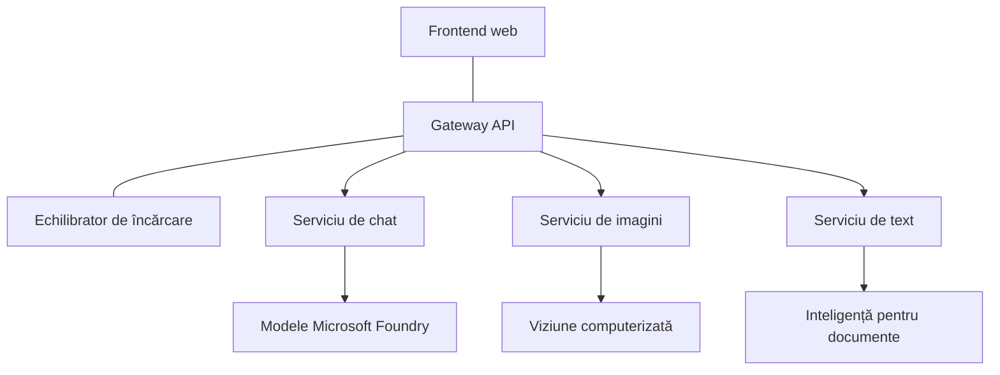

# Cele mai bune practici pentru sarcini AI de producție cu AZD

**Navigare capitol:**
- **📚 Pagina cursului**: [AZD pentru Începători](../../README.md)
- **📖 Capitolul curent**: Capitolul 8 - Modele pentru producție și întreprinderi
- **⬅️ Capitolul anterior**: [Capitolul 7: Depanare](../chapter-07-troubleshooting/debugging.md)
- **⬅️ De asemenea relevant**: [Laborator AI](ai-workshop-lab.md)
- **🎯 Curs finalizat**: [AZD pentru Începători](../../README.md)

## Prezentare generală

Acest ghid oferă cele mai bune practici cuprinzătoare pentru implementarea sarcinilor AI pregătite pentru producție folosind Azure Developer CLI (AZD). Bazate pe feedbackul din comunitatea Microsoft Foundry Discord și pe implementările reale ale clienților, aceste practici abordează cele mai frecvente provocări din sistemele AI de producție.

## Provocări cheie abordate

Conform rezultatelor sondajului nostru din comunitate, acestea sunt principalele provocări cu care se confruntă dezvoltatorii:

- **45%** se confruntă cu implementări AI multi-serviciu
- **38%** au probleme cu gestionarea credentialelor și a secretelor  
- **35%** consideră dificilă pregătirea pentru producție și scalarea
- **32%** au nevoie de strategii mai bune de optimizare a costurilor
- **29%** solicită monitorizare și depanare îmbunătățite

## Modele de arhitectură pentru AI în producție

### Modelul 1: Arhitectură AI pe microservicii

**Când să utilizați**: Aplicații AI complexe cu multiple capabilități


**Implementare AZD**:

```yaml
# azure.yaml
name: enterprise-ai-platform
services:
  web:
    project: ./web
    host: staticwebapp
  api-gateway:
    project: ./api-gateway
    host: containerapp
  chat-service:
    project: ./services/chat
    host: containerapp
  vision-service:
    project: ./services/vision
    host: containerapp
  text-service:
    project: ./services/text
    host: containerapp
```

### Modelul 2: Procesare AI bazată pe evenimente

**Când să utilizați**: Procesare batch, analiză de documente, fluxuri de lucru asincrone

```bicep
// Event Hub for AI processing pipeline
resource eventHub 'Microsoft.EventHub/namespaces@2023-01-01-preview' = {
  name: eventHubNamespaceName
  location: location
  sku: {
    name: 'Standard'
    tier: 'Standard'
    capacity: 1
  }
}

// Service Bus for reliable message processing
resource serviceBus 'Microsoft.ServiceBus/namespaces@2022-10-01-preview' = {
  name: serviceBusNamespaceName
  location: location
  sku: {
    name: 'Premium'
    tier: 'Premium'
    capacity: 1
  }
}

// Function App for processing
resource functionApp 'Microsoft.Web/sites@2023-01-01' = {
  name: functionAppName
  location: location
  kind: 'functionapp,linux'
  properties: {
    siteConfig: {
      appSettings: [
        {
          name: 'FUNCTIONS_EXTENSION_VERSION'
          value: '~4'
        }
        {
          name: 'AZURE_OPENAI_ENDPOINT'
          value: '@Microsoft.KeyVault(VaultName=${keyVault.name};SecretName=openai-endpoint)'
        }
      ]
    }
  }
}
```

## Considerații privind sănătatea agenților AI

Când o aplicație web tradițională se defectează, simptomele sunt familiare: o pagină nu se încarcă, un API returnează o eroare sau o implementare eșuează. Aplicațiile alimentate de AI se pot defecta în aceleași moduri—dar pot și să se comporte greșit în moduri mai subtile care nu generează mesaje de eroare evidente.

Această secțiune vă ajută să construiți un model mental pentru monitorizarea sarcinilor AI, astfel încât să știți unde să căutați când ceva nu pare în regulă.

### Cum diferă sănătatea agentului față de sănătatea aplicațiilor tradiționale

O aplicație tradițională fie funcționează, fie nu. Un agent AI poate părea că funcționează, dar poate produce rezultate slabe. Gândiți-vă la sănătatea agentului în două straturi:

| Strat | Ce să urmăriți | Unde să căutați |
|-------|----------------|------------------|
| **Sănătatea infrastructurii** | Rulează serviciul? Sunt resursele provisionate? Sunt endpoint-urile accesibile? | `azd monitor`, Azure Portal resource health, container/app logs |
| **Sănătatea comportamentală** | Răspunde agentul corect? Sunt răspunsurile oferite la timp? Modelul este apelat corect? | Application Insights traces, model call latency metrics, response quality logs |

Sănătatea infrastructurii este familiară—este aceeași pentru orice aplicație azd. Sănătatea comportamentală este stratul nou pe care îl introduc sarcinile AI.

### Unde să căutați când aplicațiile AI nu se comportă așa cum vă așteptați

Dacă aplicația AI nu produce rezultatele așteptate, iată o listă conceptuală de verificare:

1. **Începeți cu elementele de bază.** Aplicația rulează? Poate ajunge la dependențele ei? Verificați `azd monitor` și starea resurselor, la fel ca pentru orice aplicație.
2. **Verificați conexiunea cu modelul.** Aplicația dumneavoastră apelează cu succes modelul AI? Apelurile către model care eșuează sau expiră sunt cauza cea mai comună a problemelor aplicațiilor AI și vor apărea în jurnalele aplicației.
3. **Uitați-vă la ce a primit modelul.** Răspunsurile AI depind de intrare (promptul și orice context recuperat). Dacă ieșirea este greșită, de obicei intrarea este greșită. Verificați dacă aplicația trimite datele corecte către model.
4. **Revizuiți latența răspunsurilor.** Apelurile către modele AI sunt mai lente decât apelurile API obișnuite. Dacă aplicația pare lentă, verificați dacă timpii de răspuns ai modelului au crescut—acest lucru poate indica throttling, limite de capacitate sau congestie la nivel de regiune.
5. **Urmăriți semnalele de cost.** Creșterile neașteptate ale utilizării token-ilor sau ale apelurilor API pot indica un loop, un prompt configurat greșit sau retry-uri excesive.

Nu trebuie să stăpâniți instrumentele de observabilitate imediat. Concluzia importantă este că aplicațiile AI au un strat suplimentar de comportament de monitorizat, iar monitorizarea încorporată a azd (`azd monitor`) vă oferă un punct de plecare pentru investigarea ambelor straturi.

---

## Cele mai bune practici de securitate

### 1. Model de securitate Zero-Trust

**Strategia de implementare**:
- Fără comunicare service-to-service fără autentificare
- Toate apelurile API folosesc managed identities
- Izolare de rețea cu endpoint-uri private
- Controale de acces cu privilegiu minim

```bicep
// Managed Identity for each service
resource chatServiceIdentity 'Microsoft.ManagedIdentity/userAssignedIdentities@2023-01-31' = {
  name: 'chat-service-identity'
  location: location
}

// Role assignments with minimal permissions
resource openAIUserRole 'Microsoft.Authorization/roleAssignments@2022-04-01' = {
  scope: openAIAccount
  name: guid(openAIAccount.id, chatServiceIdentity.id, openAIUserRoleDefinitionId)
  properties: {
    roleDefinitionId: subscriptionResourceId('Microsoft.Authorization/roleDefinitions', '5e0bd9bd-7b93-4f28-af87-19fc36ad61bd')
    principalId: chatServiceIdentity.properties.principalId
    principalType: 'ServicePrincipal'
  }
}
```

### 2. Management sigur al secretelor

**Model de integrare Key Vault**:

```bicep
// Key Vault with proper access policies
resource keyVault 'Microsoft.KeyVault/vaults@2023-02-01' = {
  name: keyVaultName
  location: location
  properties: {
    tenantId: tenant().tenantId
    sku: {
      family: 'A'
      name: 'premium'  // Use premium for production
    }
    enableRbacAuthorization: true  // Use RBAC instead of access policies
    enablePurgeProtection: true    // Prevent accidental deletion
    enableSoftDelete: true
    softDeleteRetentionInDays: 90
  }
}

// Store all AI service credentials
resource openAIKeySecret 'Microsoft.KeyVault/vaults/secrets@2023-02-01' = {
  parent: keyVault
  name: 'openai-api-key'
  properties: {
    value: openAIAccount.listKeys().key1
    attributes: {
      enabled: true
    }
  }
}
```

### 3. Securitatea rețelei

**Configurarea endpoint-urilor private**:

```bicep
// Virtual Network for AI services
resource virtualNetwork 'Microsoft.Network/virtualNetworks@2023-04-01' = {
  name: vnetName
  location: location
  properties: {
    addressSpace: {
      addressPrefixes: ['10.0.0.0/16']
    }
    subnets: [
      {
        name: 'ai-services-subnet'
        properties: {
          addressPrefix: '10.0.1.0/24'
          privateEndpointNetworkPolicies: 'Disabled'
        }
      }
      {
        name: 'app-services-subnet'
        properties: {
          addressPrefix: '10.0.2.0/24'
          delegations: [
            {
              name: 'Microsoft.Web/serverFarms'
              properties: {
                serviceName: 'Microsoft.Web/serverFarms'
              }
            }
          ]
        }
      }
    ]
  }
}

// Private endpoints for all AI services
resource openAIPrivateEndpoint 'Microsoft.Network/privateEndpoints@2023-04-01' = {
  name: '${openAIAccountName}-pe'
  location: location
  properties: {
    subnet: {
      id: virtualNetwork.properties.subnets[0].id
    }
    privateLinkServiceConnections: [
      {
        name: 'openai-connection'
        properties: {
          privateLinkServiceId: openAIAccount.id
          groupIds: ['account']
        }
      }
    ]
  }
}
```

## Performanță și scalare

### 1. Strategii de auto-scalare

**Auto-scalare pentru Container Apps**:

```bicep
resource containerApp 'Microsoft.App/containerApps@2023-05-01' = {
  name: containerAppName
  location: location
  properties: {
    configuration: {
      ingress: {
        external: true
        targetPort: 8000
        transport: 'http'
      }
    }
    template: {
      scale: {
        minReplicas: 2  // Always have 2 instances minimum
        maxReplicas: 50 // Scale up to 50 for high load
        rules: [
          {
            name: 'http-scaling'
            http: {
              metadata: {
                concurrentRequests: '20'  // Scale when >20 concurrent requests
              }
            }
          }
          {
            name: 'cpu-scaling'
            custom: {
              type: 'cpu'
              metadata: {
                type: 'Utilization'
                value: '70'  // Scale when CPU >70%
              }
            }
          }
        ]
      }
    }
  }
}
```

### 2. Strategii de caching

**Redis Cache pentru răspunsuri AI**:

```bicep
// Redis Premium for production workloads
resource redisCache 'Microsoft.Cache/redis@2023-04-01' = {
  name: redisCacheName
  location: location
  properties: {
    sku: {
      name: 'Premium'
      family: 'P'
      capacity: 1
    }
    enableNonSslPort: false
    minimumTlsVersion: '1.2'
    redisConfiguration: {
      'maxmemory-policy': 'allkeys-lru'
    }
    // Enable clustering for high availability
    redisVersion: '6.0'
    shardCount: 2
  }
}

// Cache configuration in application
var cacheConnectionString = '${redisCache.properties.hostName}:6380,password=${redisCache.listKeys().primaryKey},ssl=True,abortConnect=False'
```

### 3. Echilibrare a încărcării și gestionarea traficului

**Application Gateway cu WAF**:

```bicep
// Application Gateway with Web Application Firewall
resource applicationGateway 'Microsoft.Network/applicationGateways@2023-04-01' = {
  name: appGatewayName
  location: location
  properties: {
    sku: {
      name: 'WAF_v2'
      tier: 'WAF_v2'
      capacity: 2
    }
    webApplicationFirewallConfiguration: {
      enabled: true
      firewallMode: 'Prevention'
      ruleSetType: 'OWASP'
      ruleSetVersion: '3.2'
    }
    // Backend pools for AI services
    backendAddressPools: [
      {
        name: 'ai-services-pool'
        properties: {
          backendAddresses: [
            {
              fqdn: '${containerApp.properties.configuration.ingress.fqdn}'
            }
          ]
        }
      }
    ]
  }
}
```

## 💰 Optimizarea costurilor

### 1. Dimensionarea corectă a resurselor

**Configurații specifice mediului**:

```bash
# Mediu de dezvoltare
azd env new development
azd env set AZURE_OPENAI_SKU "S0"
azd env set AZURE_OPENAI_CAPACITY 10
azd env set AZURE_SEARCH_SKU "basic"
azd env set CONTAINER_CPU 0.5
azd env set CONTAINER_MEMORY 1.0

# Mediu de producție
azd env new production
azd env set AZURE_OPENAI_SKU "S0"
azd env set AZURE_OPENAI_CAPACITY 100
azd env set AZURE_SEARCH_SKU "standard"
azd env set CONTAINER_CPU 2.0
azd env set CONTAINER_MEMORY 4.0
```

### 2. Monitorizarea costurilor și bugete

```bicep
// Cost management and budgets
resource budget 'Microsoft.Consumption/budgets@2023-05-01' = {
  name: 'ai-workload-budget'
  properties: {
    timePeriod: {
      startDate: '2024-01-01'
      endDate: '2024-12-31'
    }
    timeGrain: 'Monthly'
    amount: 2000  // $2000 monthly budget
    category: 'Cost'
    notifications: {
      warning: {
        enabled: true
        operator: 'GreaterThan'
        threshold: 80
        contactEmails: [
          'finance@company.com'
          'engineering@company.com'
        ]
        contactRoles: [
          'Owner'
          'Contributor'
        ]
      }
      critical: {
        enabled: true
        operator: 'GreaterThan'
        threshold: 95
        contactEmails: [
          'cto@company.com'
        ]
      }
    }
  }
}
```

### 3. Optimizarea utilizării token-ilor

**Gestionarea costurilor OpenAI**:

```typescript
// Optimizarea tokenilor la nivelul aplicației
class TokenOptimizer {
  private readonly maxTokens = 4000;
  private readonly reserveTokens = 500;
  
  optimizePrompt(userInput: string, context: string): string {
    const availableTokens = this.maxTokens - this.reserveTokens;
    const estimatedTokens = this.estimateTokens(userInput + context);
    
    if (estimatedTokens > availableTokens) {
      // Trunchiați contextul, nu intrarea utilizatorului
      context = this.truncateContext(context, availableTokens - this.estimateTokens(userInput));
    }
    
    return `${context}\n\nUser: ${userInput}`;
  }
  
  private estimateTokens(text: string): number {
    // Estimare aproximativă: 1 token ≈ 4 caractere
    return Math.ceil(text.length / 4);
  }
}
```

## Monitorizare și observabilitate

### 1. Application Insights cuprinzător

```bicep
// Application Insights with advanced features
resource applicationInsights 'Microsoft.Insights/components@2020-02-02' = {
  name: applicationInsightsName
  location: location
  kind: 'web'
  properties: {
    Application_Type: 'web'
    WorkspaceResourceId: logAnalyticsWorkspace.id
    SamplingPercentage: 100  // Full sampling for AI apps
    DisableIpMasking: false  // Enable for security
  }
}

// Custom metrics for AI operations
resource aiMetricAlerts 'Microsoft.Insights/metricAlerts@2018-03-01' = {
  name: 'ai-high-error-rate'
  location: 'global'
  properties: {
    description: 'Alert when AI service error rate is high'
    severity: 2
    enabled: true
    scopes: [
      applicationInsights.id
    ]
    evaluationFrequency: 'PT1M'
    windowSize: 'PT5M'
    criteria: {
      'odata.type': 'Microsoft.Azure.Monitor.SingleResourceMultipleMetricCriteria'
      allOf: [
        {
          name: 'high-error-rate'
          metricName: 'requests/failed'
          operator: 'GreaterThan'
          threshold: 10
          timeAggregation: 'Count'
        }
      ]
    }
  }
}
```

### 2. Monitorizare specifică AI

**Tablouri de bord personalizate pentru metrice AI**:

```json
// Dashboard configuration for AI workloads
{
  "dashboard": {
    "name": "AI Application Monitoring",
    "tiles": [
      {
        "name": "OpenAI Request Volume",
        "query": "requests | where name contains 'openai' | summarize count() by bin(timestamp, 5m)"
      },
      {
        "name": "AI Response Latency",
        "query": "requests | where name contains 'openai' | summarize avg(duration) by bin(timestamp, 5m)"
      },
      {
        "name": "Token Usage",
        "query": "customMetrics | where name == 'openai_tokens_used' | summarize sum(value) by bin(timestamp, 1h)"
      },
      {
        "name": "Cost per Hour",
        "query": "customMetrics | where name == 'openai_cost' | summarize sum(value) by bin(timestamp, 1h)"
      }
    ]
  }
}
```

### 3. Verificări de sănătate și monitorizarea disponibilității

```bicep
// Application Insights availability tests
resource availabilityTest 'Microsoft.Insights/webtests@2022-06-15' = {
  name: 'ai-app-availability-test'
  location: location
  tags: {
    'hidden-link:${applicationInsights.id}': 'Resource'
  }
  properties: {
    SyntheticMonitorId: 'ai-app-availability-test'
    Name: 'AI Application Availability Test'
    Description: 'Tests AI application endpoints'
    Enabled: true
    Frequency: 300  // 5 minutes
    Timeout: 120    // 2 minutes
    Kind: 'ping'
    Locations: [
      {
        Id: 'us-east-2-azr'
      }
      {
        Id: 'us-west-2-azr'
      }
    ]
    Configuration: {
      WebTest: '''
        <WebTest Name="AI Health Check" 
                 Id="8d2de8d2-a2b0-4c2e-9a0d-8f9c9a0b8c8d" 
                 Enabled="True" 
                 CssProjectStructure="" 
                 CssIteration="" 
                 Timeout="120" 
                 WorkItemIds="" 
                 xmlns="http://microsoft.com/schemas/VisualStudio/TeamTest/2010" 
                 Description="" 
                 CredentialUserName="" 
                 CredentialPassword="" 
                 PreAuthenticate="True" 
                 Proxy="default" 
                 StopOnError="False" 
                 RecordedResultFile="" 
                 ResultsLocale="">
          <Items>
            <Request Method="GET" 
                     Guid="a5f10126-e4cd-570d-961c-cea43999a200" 
                     Version="1.1" 
                     Url="${webApp.properties.defaultHostName}/health" 
                     ThinkTime="0" 
                     Timeout="120" 
                     ParseDependentRequests="True" 
                     FollowRedirects="True" 
                     RecordResult="True" 
                     Cache="False" 
                     ResponseTimeGoal="0" 
                     Encoding="utf-8" 
                     ExpectedHttpStatusCode="200" 
                     ExpectedResponseUrl="" 
                     ReportingName="" 
                     IgnoreHttpStatusCode="False" />
          </Items>
        </WebTest>
      '''
    }
  }
}
```

## Recuperare în caz de dezastru și disponibilitate ridicată

### 1. Implementare multi-regiune

```yaml
# azure.yaml - Multi-region configuration
name: ai-app-multiregion
services:
  api-primary:
    project: ./api
    host: containerapp
    env:
      - AZURE_REGION=eastus
  api-secondary:
    project: ./api
    host: containerapp
    env:
      - AZURE_REGION=westus2
```

```bicep
// Traffic Manager for global load balancing
resource trafficManager 'Microsoft.Network/trafficManagerProfiles@2022-04-01' = {
  name: trafficManagerProfileName
  location: 'global'
  properties: {
    profileStatus: 'Enabled'
    trafficRoutingMethod: 'Priority'
    dnsConfig: {
      relativeName: trafficManagerProfileName
      ttl: 30
    }
    monitorConfig: {
      protocol: 'HTTPS'
      port: 443
      path: '/health'
      intervalInSeconds: 30
      toleratedNumberOfFailures: 3
      timeoutInSeconds: 10
    }
    endpoints: [
      {
        name: 'primary-endpoint'
        type: 'Microsoft.Network/trafficManagerProfiles/azureEndpoints'
        properties: {
          targetResourceId: primaryAppService.id
          endpointStatus: 'Enabled'
          priority: 1
        }
      }
      {
        name: 'secondary-endpoint'
        type: 'Microsoft.Network/trafficManagerProfiles/azureEndpoints'
        properties: {
          targetResourceId: secondaryAppService.id
          endpointStatus: 'Enabled'
          priority: 2
        }
      }
    ]
  }
}
```

### 2. Backup și recuperare a datelor

```bicep
// Backup configuration for critical data
resource backupVault 'Microsoft.DataProtection/backupVaults@2023-05-01' = {
  name: backupVaultName
  location: location
  identity: {
    type: 'SystemAssigned'
  }
  properties: {
    storageSettings: [
      {
        datastoreType: 'VaultStore'
        type: 'LocallyRedundant'
      }
    ]
  }
}

// Backup policy for AI models and data
resource backupPolicy 'Microsoft.DataProtection/backupVaults/backupPolicies@2023-05-01' = {
  parent: backupVault
  name: 'ai-data-backup-policy'
  properties: {
    policyRules: [
      {
        backupParameters: {
          backupType: 'Full'
          objectType: 'AzureBackupParams'
        }
        trigger: {
          schedule: {
            repeatingTimeIntervals: [
              'R/2024-01-01T02:00:00+00:00/P1D'  // Daily at 2 AM
            ]
          }
          objectType: 'ScheduleBasedTriggerContext'
        }
        dataStore: {
          datastoreType: 'VaultStore'
          objectType: 'DataStoreInfoBase'
        }
        name: 'BackupDaily'
        objectType: 'AzureBackupRule'
      }
    ]
  }
}
```

## DevOps și integrare CI/CD

### 1. Flux de lucru GitHub Actions

```yaml
# .github/workflows/deploy-ai-app.yml
name: Deploy AI Application

on:
  push:
    branches: [main]
  pull_request:
    branches: [main]

jobs:
  test:
    runs-on: ubuntu-latest
    steps:
      - uses: actions/checkout@v4
      
      - name: Setup Python
        uses: actions/setup-python@v4
        with:
          python-version: '3.11'
          
      - name: Install dependencies
        run: |
          pip install -r requirements.txt
          pip install pytest
          
      - name: Run tests
        run: pytest tests/
        
      - name: AI Safety Tests
        run: |
          python scripts/test_ai_safety.py
          python scripts/validate_prompts.py

  deploy-staging:
    needs: test
    if: github.event_name == 'pull_request'
    runs-on: ubuntu-latest
    steps:
      - uses: actions/checkout@v4
      
      - name: Setup AZD
        uses: Azure/setup-azd@v2
        
      - name: Login to Azure
        uses: azure/login@v1
        with:
          creds: ${{ secrets.AZURE_CREDENTIALS }}
          
      - name: Deploy to Staging
        run: |
          azd env select staging
          azd deploy

  deploy-production:
    needs: test
    if: github.ref == 'refs/heads/main'
    runs-on: ubuntu-latest
    steps:
      - uses: actions/checkout@v4
      
      - name: Setup AZD
        uses: Azure/setup-azd@v2
        
      - name: Login to Azure
        uses: azure/login@v1
        with:
          creds: ${{ secrets.AZURE_CREDENTIALS }}
          
      - name: Deploy to Production
        run: |
          azd env select production
          azd deploy
          
      - name: Run Production Health Checks
        run: |
          python scripts/health_check.py --env production
```

### 2. Validarea infrastructurii

```bash
# scripts/validate_infrastructure.sh
#!/bin/bash

echo "Validating AI infrastructure deployment..."

# Verifică dacă toate serviciile necesare rulează
services=("openai" "search" "storage" "keyvault")
for service in "${services[@]}"; do
    echo "Checking $service..."
    if ! az resource list --resource-type "Microsoft.CognitiveServices/accounts" --query "[?contains(name, '$service')]" -o tsv; then
        echo "ERROR: $service not found"
        exit 1
    fi
done

# Validează implementările modelelor OpenAI
echo "Validating OpenAI model deployments..."
models=$(az cognitiveservices account deployment list --name $AZURE_OPENAI_NAME --resource-group $AZURE_RESOURCE_GROUP --query "[].name" -o tsv)
if [[ ! $models == *"gpt-4.1-mini"* ]]; then
  echo "ERROR: Required model gpt-4.1-mini not deployed"
    exit 1
fi

# Testează conectivitatea serviciului AI
echo "Testing AI service connectivity..."
python scripts/test_connectivity.py

echo "Infrastructure validation completed successfully!"
```

## Lista de verificare pentru pregătirea pentru producție

### Securitate ✅
- [ ] Toate serviciile folosesc identități gestionate
- [ ] Secrete stocate în Key Vault
- [ ] Endpoint-uri private configurate
- [ ] Grupuri de securitate a rețelei implementate
- [ ] RBAC cu privilegiu minim
- [ ] WAF activat pe endpoint-urile publice

### Performanță ✅
- [ ] Auto-scalare configurată
- [ ] Cache implementat
- [ ] Echilibrare a încărcării configurată
- [ ] CDN pentru conținut static
- [ ] Pooling pentru conexiuni la baza de date
- [ ] Optimizarea utilizării token-ilor

### Monitorizare ✅
- [ ] Application Insights configurat
- [ ] Metrice personalizate definite
- [ ] Reguli de alertare configurate
- [ ] Tablou de bord creat
- [ ] Verificări de sănătate implementate
- [ ] Politici de reținere a jurnalelor

### Fiabilitate ✅
- [ ] Implementare multi-regiune
- [ ] Plan de backup și recuperare
- [ ] Circuit breakers implementate
- [ ] Politici de reîncercare configurate
- [ ] Degradare grațioasă
- [ ] Endpoint-uri pentru verificări de sănătate

### Gestionarea costurilor ✅
- [ ] Alerte la buget configurate
- [ ] Dimensionarea corectă a resurselor
- [ ] Discounturi pentru dev/test aplicate
- [ ] Instanțe rezervate achiziționate
- [ ] Tablou de bord pentru monitorizarea costurilor
- [ ] Revizii periodice ale costurilor

### Conformitate ✅
- [ ] Cerințele privind rezidența datelor respectate
- [ ] Jurnalizare audit activată
- [ ] Politici de conformitate aplicate
- [ ] Linii de bază de securitate implementate
- [ ] Evaluări de securitate periodice
- [ ] Plan de răspuns la incidente

## Repere de performanță

### Metrici tipice de producție

| Metrică | Țintă | Monitorizare |
|--------|--------|------------|
| **Timp de răspuns** | < 2 seconds | Application Insights |
| **Disponibilitate** | 99.9% | Uptime monitoring |
| **Rată de erori** | < 0.1% | Application logs |
| **Utilizare token-ilor** | < $500/month | Cost management |
| **Utilizatori concurenți** | 1000+ | Load testing |
| **Timp de recuperare** | < 1 hour | Disaster recovery tests |

### Testare de încărcare

```bash
# Script de testare a încărcării pentru aplicații AI
python scripts/load_test.py \
  --endpoint https://your-ai-app.azurewebsites.net \
  --concurrent-users 100 \
  --duration 300 \
  --ramp-up 60
```

## 🤝 Practici recomandate ale comunității

Pe baza feedbackului din comunitatea Microsoft Foundry Discord:

### Cele mai importante recomandări din partea comunității:

1. **Porniți mic, scalați treptat**: Începeți cu SKU-uri de bază și scalați în funcție de utilizarea reală
2. **Monitorizați totul**: Configurați monitorizare cuprinzătoare din prima zi
3. **Automatizați securitatea**: Folosiți infrastructure as code pentru securitate consecventă
4. **Testați temeinic**: Includeți testare specifică AI în pipeline-ul dvs.
5. **Planificați costurile**: Monitorizați utilizarea token-ilor și setați alerte de buget devreme

### Capcane comune de evitat:

- ❌ Hardcodarea cheilor API în cod
- ❌ Neconfigurarea monitorizării adecvate
- ❌ Ignorarea optimizării costurilor
- ❌ Ne-testarea scenariilor de eșec
- ❌ Implementarea fără verificări de sănătate

## Comenzi AZD AI CLI și extensii

AZD include un set în creștere de comenzi și extensii specifice AI care simplifică fluxurile de lucru AI pentru producție. Aceste instrumente reduc distanța între dezvoltarea locală și implementarea în producție pentru sarcinile AI.

### Extensii AZD pentru AI

AZD folosește un sistem de extensii pentru a adăuga capabilități specifice AI. Instalați și gestionați extensii cu:

```bash
# Listează toate extensiile disponibile (inclusiv AI)
azd extension list

# Inspectează detaliile extensiei instalate
azd extension show azure.ai.agents

# Instalează extensia Foundry Agents
azd extension install azure.ai.agents

# Instalează extensia pentru ajustare fină
azd extension install azure.ai.finetune

# Instalează extensia pentru modele personalizate
azd extension install azure.ai.models

# Actualizează toate extensiile instalate
azd extension upgrade --all
```

**Extensii AI disponibile:**

| Extensie | Scop | Stare |
|-----------|---------|--------|
| `azure.ai.agents` | Gestionarea serviciului Foundry Agent | Previzualizare |
| `azure.ai.finetune` | Ajustare fină a modelelor Foundry | Previzualizare |
| `azure.ai.models` | Modele personalizate Foundry | Previzualizare |
| `azure.coding-agent` | Configurare agent de codare | Disponibil |

### Inițializarea proiectelor de agenți cu `azd ai agent init`

Comanda `azd ai agent init` scaffoldează un proiect de agent AI pregătit pentru producție, integrat cu Microsoft Foundry Agent Service:

```bash
# Inițializează un nou proiect de agent dintr-un manifest de agent
azd ai agent init -m <manifest-path-or-uri>

# Inițializează și selectează un proiect Foundry specific
azd ai agent init -m agent-manifest.yaml --project-id <foundry-project-id>

# Inițializează folosind un director sursă personalizat
azd ai agent init -m agent-manifest.yaml --src ./agents/my-agent

# Setează Container Apps ca gazdă
azd ai agent init -m agent-manifest.yaml --host containerapp
```

**Flag-uri cheie:**

| Flag | Descriere |
|------|-------------|
| `-m, --manifest` | Path or URI to an agent manifest to add to your project |
| `-p, --project-id` | Existing Microsoft Foundry Project ID for your azd environment |
| `-s, --src` | Directory to download the agent definition (defaults to `src/<agent-id>`) |
| `--host` | Override the default host (e.g., `containerapp`) |
| `-e, --environment` | The azd environment to use |

**Sfat pentru producție**: Folosiți `--project-id` pentru a vă conecta direct la un proiect Foundry existent, păstrând codul agentului și resursele cloud legate de la început.

### Protocolul de context al modelului (MCP) cu `azd mcp`

AZD include suport încorporat pentru serverul MCP (Alpha), permițând agenților AI și instrumentelor să interacționeze cu resursele Azure printr-un protocol standardizat:

```bash
# Pornește serverul MCP pentru proiectul tău
azd mcp start

# Revizuiește regulile curente de consimțământ Copilot pentru execuția instrumentelor
azd copilot consent list
```

Serverul MCP expune contextul proiectului azd—medii, servicii și resurse Azure—către instrumentele asistate de AI. Aceasta permite:

- **Implementare asistată de AI**: Permite agenților de codare să interogheze starea proiectului și să declanșeze implementări
- **Descoperire de resurse**: Instrumentele AI pot descoperi ce resurse Azure folosește proiectul dvs.
- **Gestionarea mediilor**: Agenții pot comuta între medii dev/staging/production

### Generarea infrastructurii cu `azd infra generate`

Pentru sarcini AI de producție, puteți genera și personaliza Infrastructure as Code în loc să vă bazați pe provisioning automat:

```bash
# Generați fișiere Bicep/Terraform din definiția proiectului dvs.
azd infra generate
```

Aceasta scrie IaC pe disc astfel încât puteți:
- Revizui și audita infrastructura înainte de a o implementa
- Adăuga politici de securitate personalizate (reguli de rețea, endpoint-uri private)
- Integra cu procesele existente de revizuire IaC
- Controla versiuni pentru modificările infrastructurii separat de codul aplicației

### Hook-uri pentru ciclul de viață în producție

Hook-urile AZD vă permit să injectați logică personalizată în fiecare etapă a ciclului de viață al implementării—critice pentru fluxurile de lucru AI în producție:

```yaml
# azure.yaml - Production hooks example
name: ai-production-app
hooks:
  preprovision:
    shell: sh
    run: scripts/validate-quotas.sh    # Check AI model quota before provisioning
  postprovision:
    shell: sh
    run: scripts/configure-networking.sh  # Set up private endpoints
  predeploy:
    shell: sh
    run: scripts/run-ai-safety-tests.sh  # Run prompt safety checks
  postdeploy:
    shell: sh
    run: scripts/smoke-test.sh           # Verify agent responses post-deploy
services:
  agent-api:
    project: ./src/agent
    host: containerapp
    hooks:
      predeploy:
        shell: sh
        run: scripts/validate-model-access.sh  # Per-service hook
```

```bash
# Rulează manual un anumit hook în timpul dezvoltării
azd hooks run predeploy
```

**Hook-uri recomandate pentru producție pentru sarcinile AI:**

| Hook | Caz de utilizare |
|------|----------|
| `preprovision` | Validarea cotelor de subscripție pentru capacitatea modelului AI |
| `postprovision` | Configurarea endpoint-urilor private, implementarea greutăților modelului |
| `predeploy` | Rularea testelor de siguranță AI, validarea sabloanelor de prompt |
| `postdeploy` | Testare rapidă a răspunsurilor agenților, verificarea conectivității la model |

### Configurarea pipeline-ului CI/CD

Folosiți `azd pipeline config` pentru a conecta proiectul la GitHub Actions sau Azure Pipelines cu autentificare Azure securizată:

```bash
# Configurează fluxul CI/CD (interactiv)
azd pipeline config

# Configurează cu un furnizor specific
azd pipeline config --provider github
```

Această comandă:
- Creează un service principal cu acces cu privilegii minime
- Configurează credențiale federate (fără secrete stocate)
- Generează sau actualizează fișierul de definiție al pipeline-ului
- Setează variabilele de mediu necesare în sistemul CI/CD

**Flux de lucru pentru producție cu pipeline config:**

```bash
# 1. Configurați mediul de producție
azd env new production
azd env set AZURE_OPENAI_CAPACITY 100

# 2. Configurați pipeline-ul
azd pipeline config --provider github

# 3. Pipeline-ul rulează 'azd deploy' la fiecare push către main
```

### Adăugarea de componente cu `azd add`

Adăugați incremental servicii Azure la un proiect existent:

```bash
# Adaugă interactiv o nouă componentă de serviciu
azd add
```

Acest lucru este deosebit de util pentru extinderea aplicațiilor AI în producție—de exemplu, adăugarea unui serviciu de căutare vectorială, un nou endpoint de agent sau un component de monitorizare la o implementare existentă.

## Resurse suplimentare
- **Azure Well-Architected Framework**: [Ghid pentru încărcături de lucru AI](https://learn.microsoft.com/azure/well-architected/ai/)
- **Microsoft Foundry Documentation**: [Documentație oficială](https://learn.microsoft.com/azure/ai-studio/)
- **Community Templates**: [Azure Samples](https://github.com/Azure-Samples)
- **Discord Community**: [canalul #Azure](https://discord.gg/microsoft-azure)
- **Agent Skills for Azure**: [microsoft/github-copilot-for-azure on skills.sh](https://skills.sh/microsoft/github-copilot-for-azure) - 37 abilități agent deschise pentru Azure AI, Foundry, implementare, optimizarea costurilor și diagnosticare. Instalează în editorul tău:
  ```bash
  npx skills add microsoft/github-copilot-for-azure
  ```

---

**Navigare capitole:**
- **📚 Pagina cursului**: [AZD For Beginners](../../README.md)
- **📖 Capitolul curent**: Capitolul 8 - Tipare pentru producție și întreprinderi
- **⬅️ Capitolul anterior**: [Capitolul 7: Depanare](../chapter-07-troubleshooting/debugging.md)
- **⬅️ Legături conexe**: [AI Workshop Lab](ai-workshop-lab.md)
- **� Curs finalizat**: [AZD For Beginners](../../README.md)

**Rețineți**: Încărcăturile de lucru AI de producție necesită planificare atentă, monitorizare și optimizare continuă. Începeți cu aceste tipare și adaptați-le la cerințele dumneavoastră specifice.

---

<!-- CO-OP TRANSLATOR DISCLAIMER START -->
**Declinare a responsabilității**:
Acest document a fost tradus folosind serviciul de traducere AI [Co-op Translator](https://github.com/Azure/co-op-translator). Deși ne străduim pentru acuratețe, vă rugăm să rețineți că traducerile automate pot conține erori sau inexactități. Documentul original în limba sa nativă ar trebui considerat sursa autorizată. Pentru informații critice, se recomandă traducerea profesională realizată de un traducător uman. Nu ne asumăm responsabilitatea pentru eventualele neînțelegeri sau interpretări greșite rezultate din utilizarea acestei traduceri.
<!-- CO-OP TRANSLATOR DISCLAIMER END -->