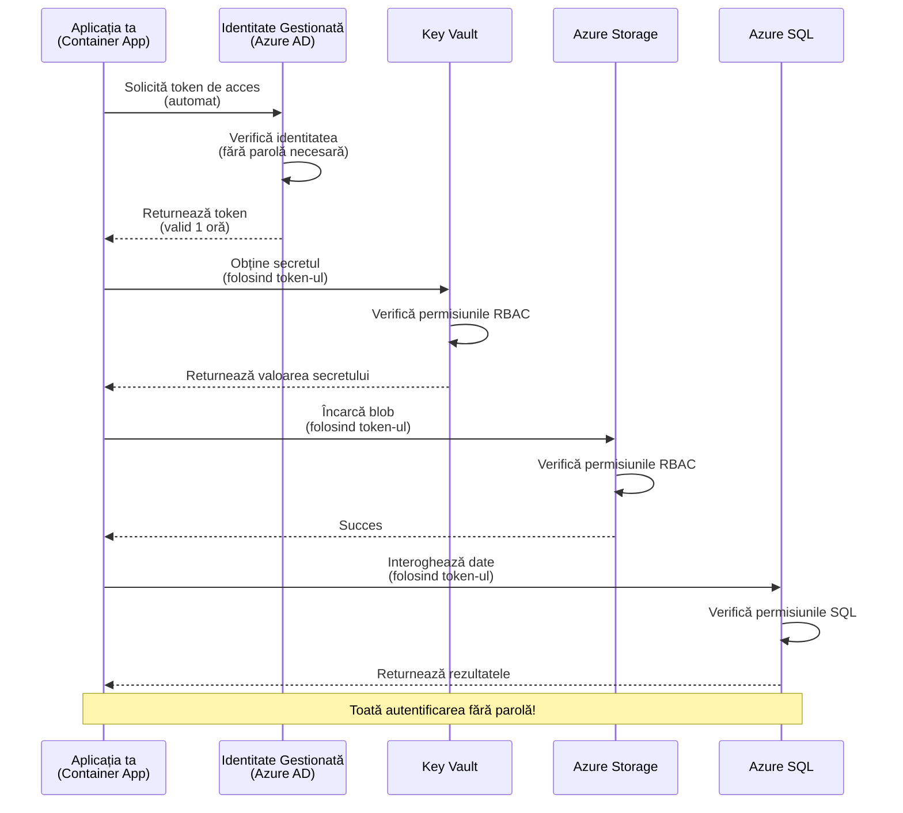
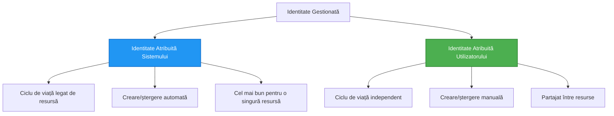

<!--
CO_OP_TRANSLATOR_METADATA:
{
  "original_hash": "e13ff6e1197e0a7462ed0aede7df9f23",
  "translation_date": "2025-11-23T20:30:40+00:00",
  "source_file": "docs/getting-started/authsecurity.md",
  "language_code": "ro"
}
-->
# Modele de Autentificare și Identitate Gestionată

⏱️ **Timp Estimat**: 45-60 minute | 💰 **Impact Cost**: Gratuit (fără costuri suplimentare) | ⭐ **Complexitate**: Intermediar

**📚 Parcurs de Învățare:**
- ← Anterior: [Managementul Configurației](configuration.md) - Gestionarea variabilelor de mediu și a secretelor
- 🎯 **Ești Aici**: Autentificare & Securitate (Identitate Gestionată, Key Vault, modele sigure)
- → Următor: [Primul Proiect](first-project.md) - Construiește prima ta aplicație AZD
- 🏠 [Pagina Principală a Cursului](../../README.md)

---

## Ce Vei Învăța

Finalizând această lecție, vei:
- Înțelege modelele de autentificare Azure (chei, string-uri de conexiune, identitate gestionată)
- Implementa **Identitate Gestionată** pentru autentificare fără parolă
- Securiza secretele cu integrarea **Azure Key Vault**
- Configura **controlul accesului bazat pe roluri (RBAC)** pentru implementările AZD
- Aplica cele mai bune practici de securitate în Container Apps și serviciile Azure
- Migra de la autentificarea bazată pe chei la cea bazată pe identitate

## De ce Contează Identitatea Gestionată

### Problema: Autentificarea Tradițională

**Înainte de Identitatea Gestionată:**
```javascript
// ❌ RISC DE SECURITATE: Secrete codificate direct în cod
const connectionString = "Server=mydb.database.windows.net;User=admin;Password=P@ssw0rd123";
const storageKey = "xK7mN9pQ2wR5tY8uI0oP3aS6dF1gH4jK...";
const cosmosKey = "C2x7B9n4M1p8Q5w3E6r0T2y5U8i1O4p7...";
```

**Probleme:**
- 🔴 **Secrete expuse** în cod, fișiere de configurare, variabile de mediu
- 🔴 **Rotirea credențialelor** necesită modificări în cod și reimplementare
- 🔴 **Coșmaruri de audit** - cine a accesat ce și când?
- 🔴 **Fragmentare** - secrete împrăștiate în mai multe sisteme
- 🔴 **Riscuri de conformitate** - eșecuri la auditurile de securitate

### Soluția: Identitatea Gestionată

**După Identitatea Gestionată:**
```javascript
// ✅ SECURE: Nicio informație secretă în cod
const credential = new DefaultAzureCredential();
const client = new BlobServiceClient(
  "https://mystorageaccount.blob.core.windows.net",
  credential  // Azure gestionează automat autentificarea
);
```

**Beneficii:**
- ✅ **Fără secrete** în cod sau configurație
- ✅ **Rotire automată** - gestionată de Azure
- ✅ **Istoric complet de audit** în jurnalele Azure AD
- ✅ **Securitate centralizată** - gestionare în Azure Portal
- ✅ **Gata pentru conformitate** - respectă standardele de securitate

**Analogie**: Autentificarea tradițională este ca și cum ai purta mai multe chei fizice pentru uși diferite. Identitatea Gestionată este ca un ecuson de securitate care îți oferă automat acces pe baza identității tale—fără chei de pierdut, copiat sau rotit.

---

## Prezentare Generală a Arhitecturii

### Fluxul de Autentificare cu Identitate Gestionată


### Tipuri de Identități Gestionate


| Caracteristică | Atribuită Sistemului | Atribuită Utilizatorului |
|----------------|----------------------|--------------------------|
| **Ciclu de viață** | Legată de resursă | Independentă |
| **Creare** | Automată cu resursa | Creare manuală |
| **Ștergere** | Ștearsă cu resursa | Persistă după ștergerea resursei |
| **Partajare** | O singură resursă | Mai multe resurse |
| **Caz de utilizare** | Scenarii simple | Scenarii complexe multi-resursă |
| **Implicit AZD** | ✅ Recomandat | Opțional |

---

## Cerințe Prealabile

### Instrumente Necesare

Ar trebui să ai deja instalate următoarele din lecțiile anterioare:

```bash
# Verificați Azure Developer CLI
azd version
# ✅ Așteptat: versiunea azd 1.0.0 sau mai mare

# Verificați Azure CLI
az --version
# ✅ Așteptat: azure-cli 2.50.0 sau mai mare
```

### Cerințe Azure

- Abonament Azure activ
- Permisiuni pentru:
  - Crearea identităților gestionate
  - Atribuirea rolurilor RBAC
  - Crearea resurselor Key Vault
  - Implementarea Container Apps

### Cunoștințe Prealabile

Ar trebui să fi finalizat:
- [Ghid de Instalare](installation.md) - Configurare AZD
- [Bazele AZD](azd-basics.md) - Concepte de bază
- [Managementul Configurației](configuration.md) - Variabile de mediu

---

## Lecția 1: Înțelegerea Modelelor de Autentificare

### Modelul 1: String-uri de Conexiune (Legacy - Evită)

**Cum funcționează:**
```bash
# Stringul de conexiune conține acreditive
STORAGE_CONNECTION_STRING="DefaultEndpointsProtocol=https;AccountName=myaccount;AccountKey=xK7mN9pQ2wR5..."
COSMOS_CONNECTION_STRING="AccountEndpoint=https://myaccount.documents.azure.com:443/;AccountKey=C2x7..."
SQL_CONNECTION_STRING="Server=myserver.database.windows.net;User=admin;Password=P@ssw0rd..."
```

**Probleme:**
- ❌ Secrete vizibile în variabilele de mediu
- ❌ Înregistrate în sistemele de implementare
- ❌ Dificil de rotit
- ❌ Fără istoric de audit al accesului

**Când să folosești:** Doar pentru dezvoltare locală, niciodată în producție.

---

### Modelul 2: Referințe Key Vault (Mai Bine)

**Cum funcționează:**
```bicep
// Store secret in Key Vault
resource keyVault 'Microsoft.KeyVault/vaults@2023-02-01' = {
  name: 'mykv'
  properties: {
    enableRbacAuthorization: true
  }
}

// Reference in Container App
env: [
  {
    name: 'STORAGE_KEY'
    secretRef: 'storage-key'  // References Key Vault
  }
]
```

**Beneficii:**
- ✅ Secrete stocate în siguranță în Key Vault
- ✅ Management centralizat al secretelor
- ✅ Rotire fără modificări în cod

**Limitări:**
- ⚠️ Încă folosește chei/parole
- ⚠️ Necesită gestionarea accesului la Key Vault

**Când să folosești:** Pas de tranziție de la string-uri de conexiune la identitate gestionată.

---

### Modelul 3: Identitate Gestionată (Cea Mai Bună Practică)

**Cum funcționează:**
```bicep
// Enable managed identity
resource containerApp 'Microsoft.App/containerApps@2023-05-01' = {
  name: 'myapp'
  identity: {
    type: 'SystemAssigned'  // Automatically creates identity
  }
}

// Grant permissions
resource roleAssignment 'Microsoft.Authorization/roleAssignments@2022-04-01' = {
  scope: storageAccount
  properties: {
    roleDefinitionId: storageBlobDataContributorRole
    principalId: containerApp.identity.principalId
  }
}
```

**Codul aplicației:**
```javascript
// Nu sunt necesare secrete!
const { DefaultAzureCredential } = require('@azure/identity');
const { BlobServiceClient } = require('@azure/storage-blob');

const credential = new DefaultAzureCredential();
const blobServiceClient = new BlobServiceClient(
  'https://mystorageaccount.blob.core.windows.net',
  credential
);
```

**Beneficii:**
- ✅ Fără secrete în cod/configurație
- ✅ Rotire automată a credențialelor
- ✅ Istoric complet de audit
- ✅ Permisiuni bazate pe RBAC
- ✅ Gata pentru conformitate

**Când să folosești:** Întotdeauna, pentru aplicațiile de producție.

---

## Lecția 2: Implementarea Identității Gestionate cu AZD

### Implementare Pas cu Pas

Să construim o aplicație Container App sigură care folosește identitatea gestionată pentru a accesa Azure Storage și Key Vault.

### Structura Proiectului

```
secure-app/
├── azure.yaml                 # AZD configuration
├── infra/
│   ├── main.bicep            # Main infrastructure
│   ├── core/
│   │   ├── identity.bicep    # Managed identity setup
│   │   ├── keyvault.bicep    # Key Vault configuration
│   │   └── storage.bicep     # Storage with RBAC
│   └── app/
│       └── container-app.bicep
└── src/
    ├── app.js                # Application code
    ├── package.json
    └── Dockerfile
```

### 1. Configurare AZD (azure.yaml)

```yaml
name: secure-app
metadata:
  template: secure-app@1.0.0

services:
  api:
    project: ./src
    language: js
    host: containerapp

# Enable managed identity (AZD handles this automatically)
```

### 2. Infrastructură: Activarea Identității Gestionate

**Fișier: `infra/main.bicep`**

```bicep
targetScope = 'subscription'

param environmentName string
param location string = 'eastus'

var tags = { 'azd-env-name': environmentName }

// Resource group
resource rg 'Microsoft.Resources/resourceGroups@2021-04-01' = {
  name: 'rg-${environmentName}'
  location: location
  tags: tags
}

// Storage Account
module storage './core/storage.bicep' = {
  name: 'storage'
  scope: rg
  params: {
    name: 'st${uniqueString(rg.id)}'
    location: location
    tags: tags
  }
}

// Key Vault
module keyVault './core/keyvault.bicep' = {
  name: 'keyvault'
  scope: rg
  params: {
    name: 'kv-${uniqueString(rg.id)}'
    location: location
    tags: tags
  }
}

// Container App with Managed Identity
module containerApp './app/container-app.bicep' = {
  name: 'container-app'
  scope: rg
  params: {
    name: 'ca-${environmentName}'
    location: location
    tags: tags
    storageAccountName: storage.outputs.name
    keyVaultName: keyVault.outputs.name
  }
}

// Grant Container App access to Storage
module storageRoleAssignment './core/role-assignment.bicep' = {
  name: 'storage-role'
  scope: rg
  params: {
    principalId: containerApp.outputs.identityPrincipalId
    roleDefinitionId: 'ba92f5b4-2d11-453d-a403-e96b0029c9fe'  // Storage Blob Data Contributor
    targetResourceId: storage.outputs.id
  }
}

// Grant Container App access to Key Vault
module kvRoleAssignment './core/role-assignment.bicep' = {
  name: 'kv-role'
  scope: rg
  params: {
    principalId: containerApp.outputs.identityPrincipalId
    roleDefinitionId: '4633458b-17de-408a-b874-0445c86b69e6'  // Key Vault Secrets User
    targetResourceId: keyVault.outputs.id
  }
}

// Outputs
output AZURE_STORAGE_ACCOUNT_NAME string = storage.outputs.name
output AZURE_KEY_VAULT_NAME string = keyVault.outputs.name
output APP_URL string = containerApp.outputs.url
```

### 3. Container App cu Identitate Atribuită Sistemului

**Fișier: `infra/app/container-app.bicep`**

```bicep
param name string
param location string
param tags object = {}
param storageAccountName string
param keyVaultName string

resource containerApp 'Microsoft.App/containerApps@2023-05-01' = {
  name: name
  location: location
  tags: tags
  identity: {
    type: 'SystemAssigned'  // 🔑 Enable managed identity
  }
  properties: {
    configuration: {
      ingress: {
        external: true
        targetPort: 3000
      }
    }
    template: {
      containers: [
        {
          name: 'api'
          image: 'myregistry.azurecr.io/api:latest'
          resources: {
            cpu: json('0.5')
            memory: '1Gi'
          }
          env: [
            {
              name: 'AZURE_STORAGE_ACCOUNT_NAME'
              value: storageAccountName
            }
            {
              name: 'AZURE_KEY_VAULT_NAME'
              value: keyVaultName
            }
            // 🔑 No secrets - managed identity handles authentication!
          ]
        }
      ]
    }
  }
}

// Output the identity for RBAC assignments
output identityPrincipalId string = containerApp.identity.principalId
output id string = containerApp.id
output url string = 'https://${containerApp.properties.configuration.ingress.fqdn}'
```

### 4. Modul de Atribuire a Rolurilor RBAC

**Fișier: `infra/core/role-assignment.bicep`**

```bicep
param principalId string
param roleDefinitionId string  // Azure built-in role ID
param targetResourceId string

resource roleAssignment 'Microsoft.Authorization/roleAssignments@2022-04-01' = {
  name: guid(principalId, roleDefinitionId, targetResourceId)
  scope: resourceId('Microsoft.Resources/resourceGroups', resourceGroup().name)
  properties: {
    roleDefinitionId: subscriptionResourceId('Microsoft.Authorization/roleDefinitions', roleDefinitionId)
    principalId: principalId
    principalType: 'ServicePrincipal'
  }
}

output id string = roleAssignment.id
```

### 5. Codul Aplicației cu Identitate Gestionată

**Fișier: `src/app.js`**

```javascript
const express = require('express');
const { DefaultAzureCredential } = require('@azure/identity');
const { BlobServiceClient } = require('@azure/storage-blob');
const { SecretClient } = require('@azure/keyvault-secrets');

const app = express();
const PORT = process.env.PORT || 3000;

// 🔑 Inițializați acreditivul (funcționează automat cu identitate gestionată)
const credential = new DefaultAzureCredential();

// Configurare Azure Storage
const storageAccountName = process.env.AZURE_STORAGE_ACCOUNT_NAME;
const blobServiceClient = new BlobServiceClient(
  `https://${storageAccountName}.blob.core.windows.net`,
  credential  // Nu sunt necesare chei!
);

// Configurare Key Vault
const keyVaultName = process.env.AZURE_KEY_VAULT_NAME;
const secretClient = new SecretClient(
  `https://${keyVaultName}.vault.azure.net`,
  credential  // Nu sunt necesare chei!
);

// Verificare sănătate
app.get('/health', (req, res) => {
  res.json({ status: 'healthy', authentication: 'managed-identity' });
});

// Încărcați fișierul în blob storage
app.post('/upload', async (req, res) => {
  try {
    const containerClient = blobServiceClient.getContainerClient('uploads');
    await containerClient.createIfNotExists();
    
    const blobName = `file-${Date.now()}.txt`;
    const blockBlobClient = containerClient.getBlockBlobClient(blobName);
    
    await blockBlobClient.upload('Hello from managed identity!', 30);
    
    res.json({
      success: true,
      blobName: blobName,
      message: 'File uploaded using managed identity!'
    });
  } catch (error) {
    console.error('Upload error:', error);
    res.status(500).json({ error: error.message });
  }
});

// Obțineți secretul din Key Vault
app.get('/secret/:name', async (req, res) => {
  try {
    const secretName = req.params.name;
    const secret = await secretClient.getSecret(secretName);
    
    res.json({
      name: secretName,
      value: secret.value,
      message: 'Secret retrieved using managed identity!'
    });
  } catch (error) {
    console.error('Secret error:', error);
    res.status(500).json({ error: error.message });
  }
});

// Listați containerele blob (demonstrează accesul de citire)
app.get('/containers', async (req, res) => {
  try {
    const containers = [];
    for await (const container of blobServiceClient.listContainers()) {
      containers.push(container.name);
    }
    
    res.json({
      containers: containers,
      count: containers.length,
      message: 'Containers listed using managed identity!'
    });
  } catch (error) {
    console.error('List error:', error);
    res.status(500).json({ error: error.message });
  }
});

app.listen(PORT, () => {
  console.log(`Secure API listening on port ${PORT}`);
  console.log('Authentication: Managed Identity (passwordless)');
});
```

**Fișier: `src/package.json`**

```json
{
  "name": "secure-app",
  "version": "1.0.0",
  "dependencies": {
    "express": "^4.18.2",
    "@azure/identity": "^4.0.0",
    "@azure/storage-blob": "^12.17.0",
    "@azure/keyvault-secrets": "^4.7.0"
  },
  "scripts": {
    "start": "node app.js"
  }
}
```

### 6. Implementare și Testare

```bash
# Inițializați mediul AZD
azd init

# Implementați infrastructura și aplicația
azd up

# Obțineți URL-ul aplicației
APP_URL=$(azd env get-values | grep APP_URL | cut -d '=' -f2 | tr -d '"')

# Testați verificarea stării
curl $APP_URL/health
```

**✅ Rezultat așteptat:**
```json
{
  "status": "healthy",
  "authentication": "managed-identity"
}
```

**Testare încărcare blob:**
```bash
curl -X POST $APP_URL/upload
```

**✅ Rezultat așteptat:**
```json
{
  "success": true,
  "blobName": "file-1700404800000.txt",
  "message": "File uploaded using managed identity!"
}
```

**Testare listare containere:**
```bash
curl $APP_URL/containers
```

**✅ Rezultat așteptat:**
```json
{
  "containers": ["uploads"],
  "count": 1,
  "message": "Containers listed using managed identity!"
}
```

---

## Roluri RBAC Comune în Azure

### ID-uri de Rol Predefinite pentru Identitate Gestionată

| Serviciu | Nume Rol | ID Rol | Permisiuni |
|----------|----------|--------|------------|
| **Storage** | Storage Blob Data Reader | `2a2b9908-6b94-4a3d-8e5a-a7d8f8cc8a12` | Citire blob-uri și containere |
| **Storage** | Storage Blob Data Contributor | `ba92f5b4-2d11-453d-a403-e96b0029c9fe` | Citire, scriere, ștergere blob-uri |
| **Storage** | Storage Queue Data Contributor | `974c5e8b-45b9-4653-ba55-5f855dd0fb88` | Citire, scriere, ștergere mesaje coadă |
| **Key Vault** | Key Vault Secrets User | `4633458b-17de-408a-b874-0445c86b69e6` | Citire secrete |
| **Key Vault** | Key Vault Secrets Officer | `b86a8fe4-44ce-4948-aee5-eccb2c155cd7` | Citire, scriere, ștergere secrete |
| **Cosmos DB** | Cosmos DB Built-in Data Reader | `00000000-0000-0000-0000-000000000001` | Citire date Cosmos DB |
| **Cosmos DB** | Cosmos DB Built-in Data Contributor | `00000000-0000-0000-0000-000000000002` | Citire, scriere date Cosmos DB |
| **SQL Database** | SQL DB Contributor | `9b7fa17d-e63e-47b0-bb0a-15c516ac86ec` | Gestionare baze de date SQL |
| **Service Bus** | Azure Service Bus Data Owner | `090c5cfd-751d-490a-894a-3ce6f1109419` | Trimitere, primire, gestionare mesaje |

### Cum să Găsești ID-urile Rolurilor

```bash
# Listează toate rolurile încorporate
az role definition list --query "[].{Name:roleName, ID:name}" --output table

# Caută un rol specific
az role definition list --query "[?contains(roleName, 'Storage Blob')].{Name:roleName, ID:name}" --output table

# Obține detalii despre rol
az role definition list --name "Storage Blob Data Contributor"
```

---

## Exerciții Practice

### Exercițiul 1: Activarea Identității Gestionate pentru o Aplicație Existenta ⭐⭐ (Mediu)

**Obiectiv**: Adaugă identitate gestionată unei implementări existente de Container App

**Scenariu**: Ai o Container App care folosește string-uri de conexiune. Convertește-o la identitate gestionată.

**Punct de Pornire**: Container App cu această configurație:

```bicep
// ❌ Current: Using connection string
env: [
  {
    name: 'STORAGE_CONNECTION_STRING'
    secretRef: 'storage-connection'
  }
]
```

**Pași**:

1. **Activează identitatea gestionată în Bicep:**

```bicep
resource containerApp 'Microsoft.App/containerApps@2023-05-01' = {
  name: 'myapp'
  identity: {
    type: 'SystemAssigned'  // Add this
  }
  // ... rest of configuration
}
```

2. **Atribuie acces la Storage:**

```bicep
// Get storage account reference
resource storageAccount 'Microsoft.Storage/storageAccounts@2023-01-01' existing = {
  name: storageAccountName
}

// Assign role
resource roleAssignment 'Microsoft.Authorization/roleAssignments@2022-04-01' = {
  name: guid(containerApp.id, 'ba92f5b4-2d11-453d-a403-e96b0029c9fe', storageAccount.id)
  scope: storageAccount
  properties: {
    roleDefinitionId: subscriptionResourceId('Microsoft.Authorization/roleDefinitions', 'ba92f5b4-2d11-453d-a403-e96b0029c9fe')
    principalId: containerApp.identity.principalId
    principalType: 'ServicePrincipal'
  }
}
```

3. **Actualizează codul aplicației:**

**Înainte (string de conexiune):**
```javascript
const { BlobServiceClient } = require('@azure/storage-blob');

const blobServiceClient = BlobServiceClient.fromConnectionString(
  process.env.STORAGE_CONNECTION_STRING
);
```

**După (identitate gestionată):**
```javascript
const { DefaultAzureCredential } = require('@azure/identity');
const { BlobServiceClient } = require('@azure/storage-blob');

const credential = new DefaultAzureCredential();
const blobServiceClient = new BlobServiceClient(
  `https://${process.env.STORAGE_ACCOUNT_NAME}.blob.core.windows.net`,
  credential
);
```

4. **Actualizează variabilele de mediu:**

```bicep
env: [
  {
    name: 'STORAGE_ACCOUNT_NAME'
    value: storageAccountName  // Just the name, no secrets!
  }
  // Remove STORAGE_CONNECTION_STRING
]
```

5. **Implementează și testează:**

```bash
# Redistribuie
azd up

# Testează dacă încă funcționează
curl https://myapp.azurecontainerapps.io/upload
```

**✅ Criterii de Succes:**
- ✅ Aplicația se implementează fără erori
- ✅ Operațiunile pe Storage funcționează (încărcare, listare, descărcare)
- ✅ Fără string-uri de conexiune în variabilele de mediu
- ✅ Identitatea vizibilă în Azure Portal sub secțiunea "Identity"

**Verificare:**

```bash
# Verificați dacă identitatea gestionată este activată
az containerapp show \
  --name myapp \
  --resource-group rg-myapp \
  --query "identity.type"
# ✅ Așteptat: "SystemAssigned"

# Verificați atribuirea rolului
az role assignment list \
  --assignee $(az containerapp show --name myapp --resource-group rg-myapp --query "identity.principalId" -o tsv) \
  --scope /subscriptions/{sub-id}/resourceGroups/rg-myapp/providers/Microsoft.Storage/storageAccounts/mystorageaccount
# ✅ Așteptat: Afișează rolul "Storage Blob Data Contributor"
```

**Timp**: 20-30 minute

---

### Exercițiul 2: Acces Multi-Serviciu cu Identitate Atribuită Utilizatorului ⭐⭐⭐ (Avansat)

**Obiectiv**: Creează o identitate atribuită utilizatorului partajată între mai multe Container Apps

**Scenariu**: Ai 3 microservicii care au nevoie de acces la același cont de Storage și Key Vault.

**Pași**:

1. **Creează identitatea atribuită utilizatorului:**

**Fișier: `infra/core/identity.bicep`**

```bicep
param name string
param location string
param tags object = {}

resource userAssignedIdentity 'Microsoft.ManagedIdentity/userAssignedIdentities@2023-01-31' = {
  name: name
  location: location
  tags: tags
}

output id string = userAssignedIdentity.id
output principalId string = userAssignedIdentity.properties.principalId
output clientId string = userAssignedIdentity.properties.clientId
```

2. **Atribuie roluri identității atribuite utilizatorului:**

```bicep
// In main.bicep
module userIdentity './core/identity.bicep' = {
  name: 'user-identity'
  scope: rg
  params: {
    name: 'id-${environmentName}'
    location: location
    tags: tags
  }
}

// Grant Storage access
resource storageRoleAssignment 'Microsoft.Authorization/roleAssignments@2022-04-01' = {
  name: guid(userIdentity.outputs.principalId, 'storage-contributor')
  scope: storageAccount
  properties: {
    roleDefinitionId: subscriptionResourceId('Microsoft.Authorization/roleDefinitions', 'ba92f5b4-2d11-453d-a403-e96b0029c9fe')
    principalId: userIdentity.outputs.principalId
    principalType: 'ServicePrincipal'
  }
}

// Grant Key Vault access
resource kvRoleAssignment 'Microsoft.Authorization/roleAssignments@2022-04-01' = {
  name: guid(userIdentity.outputs.principalId, 'kv-secrets-user')
  scope: keyVault
  properties: {
    roleDefinitionId: subscriptionResourceId('Microsoft.Authorization/roleDefinitions', '4633458b-17de-408a-b874-0445c86b69e6')
    principalId: userIdentity.outputs.principalId
    principalType: 'ServicePrincipal'
  }
}
```

3. **Atribuie identitatea la mai multe Container Apps:**

```bicep
resource apiGateway 'Microsoft.App/containerApps@2023-05-01' = {
  name: 'api-gateway'
  identity: {
    type: 'UserAssigned'
    userAssignedIdentities: {
      '${userIdentity.outputs.id}': {}
    }
  }
  // ... rest of config
}

resource productService 'Microsoft.App/containerApps@2023-05-01' = {
  name: 'product-service'
  identity: {
    type: 'UserAssigned'
    userAssignedIdentities: {
      '${userIdentity.outputs.id}': {}
    }
  }
  // ... rest of config
}

resource orderService 'Microsoft.App/containerApps@2023-05-01' = {
  name: 'order-service'
  identity: {
    type: 'UserAssigned'
    userAssignedIdentities: {
      '${userIdentity.outputs.id}': {}
    }
  }
  // ... rest of config
}
```

4. **Codul aplicației (toate serviciile folosesc același model):**

```javascript
const { DefaultAzureCredential, ManagedIdentityCredential } = require('@azure/identity');

// Pentru identitatea atribuită utilizatorului, specificați ID-ul clientului
const credential = new ManagedIdentityCredential(
  process.env.AZURE_CLIENT_ID  // ID-ul clientului pentru identitatea atribuită utilizatorului
);

// Sau utilizați DefaultAzureCredential (detectare automată)
const credential = new DefaultAzureCredential();

const blobServiceClient = new BlobServiceClient(
  `https://${process.env.STORAGE_ACCOUNT_NAME}.blob.core.windows.net`,
  credential
);
```

5. **Implementează și verifică:**

```bash
azd up

# Testați dacă toate serviciile pot accesa stocarea
curl https://api-gateway.azurecontainerapps.io/upload
curl https://product-service.azurecontainerapps.io/upload
curl https://order-service.azurecontainerapps.io/upload
```

**✅ Criterii de Succes:**
- ✅ O singură identitate partajată între 3 servicii
- ✅ Toate serviciile pot accesa Storage și Key Vault
- ✅ Identitatea persistă dacă ștergi un serviciu
- ✅ Management centralizat al permisiunilor

**Beneficii ale Identității Atribuite Utilizatorului:**
- O singură identitate de gestionat
- Permisiuni consistente între servicii
- Supraviețuiește ștergerii unui serviciu
- Mai bună pentru arhitecturi complexe

**Timp**: 30-40 minute

---

### Exercițiul 3: Implementarea Rotirii Secretelor în Key Vault ⭐⭐⭐ (Avansat)

**Obiectiv**: Stochează chei API terțe în Key Vault și accesează-le folosind identitatea gestionată

**Scenariu**: Aplicația ta trebuie să apeleze o API externă (OpenAI, Stripe, SendGrid) care necesită chei API.

**Pași**:

1. **Creează Key Vault cu RBAC:**

**Fișier: `infra/core/keyvault.bicep`**

```bicep
param name string
param location string
param tags object = {}

resource keyVault 'Microsoft.KeyVault/vaults@2023-02-01' = {
  name: name
  location: location
  tags: tags
  properties: {
    enableRbacAuthorization: true  // Use RBAC instead of access policies
    sku: {
      family: 'A'
      name: 'standard'
    }
    tenantId: subscription().tenantId
    enableSoftDelete: true
    softDeleteRetentionInDays: 90
  }
}

// Allow Container App to read secrets
output id string = keyVault.id
output name string = keyVault.name
output uri string = keyVault.properties.vaultUri
```

2. **Stochează secrete în Key Vault:**

```bash
# Obțineți numele Key Vault
KV_NAME=$(azd env get-values | grep AZURE_KEY_VAULT_NAME | cut -d '=' -f2 | tr -d '"')

# Stocați cheile API ale terților
az keyvault secret set \
  --vault-name $KV_NAME \
  --name "OpenAI-ApiKey" \
  --value "sk-proj-xxxxxxxxxxxxx"

az keyvault secret set \
  --vault-name $KV_NAME \
  --name "Stripe-ApiKey" \
  --value "sk_live_xxxxxxxxxxxxx"

az keyvault secret set \
  --vault-name $KV_NAME \
  --name "SendGrid-ApiKey" \
  --value "SG.xxxxxxxxxxxxx"
```

3. **Codul aplicației pentru a prelua secrete:**

**Fișier: `src/config.js`**

```javascript
const { DefaultAzureCredential } = require('@azure/identity');
const { SecretClient } = require('@azure/keyvault-secrets');

class Config {
  constructor() {
    this.credential = new DefaultAzureCredential();
    this.secretClient = new SecretClient(
      `https://${process.env.AZURE_KEY_VAULT_NAME}.vault.azure.net`,
      this.credential
    );
    this.cache = {};
  }

  async getSecret(secretName) {
    // Verificați mai întâi memoria cache
    if (this.cache[secretName]) {
      return this.cache[secretName];
    }

    try {
      const secret = await this.secretClient.getSecret(secretName);
      this.cache[secretName] = secret.value;
      console.log(`✅ Retrieved secret: ${secretName}`);
      return secret.value;
    } catch (error) {
      console.error(`❌ Failed to get secret ${secretName}:`, error.message);
      throw error;
    }
  }

  async getOpenAIKey() {
    return this.getSecret('OpenAI-ApiKey');
  }

  async getStripeKey() {
    return this.getSecret('Stripe-ApiKey');
  }

  async getSendGridKey() {
    return this.getSecret('SendGrid-ApiKey');
  }
}

module.exports = new Config();
```

4. **Folosește secretele în aplicație:**

**Fișier: `src/app.js`**

```javascript
const express = require('express');
const config = require('./config');
const { OpenAI } = require('openai');

const app = express();

// Inițializează OpenAI cu cheia din Key Vault
let openaiClient;

async function initializeServices() {
  const openaiKey = await config.getOpenAIKey();
  openaiClient = new OpenAI({ apiKey: openaiKey });
  console.log('✅ Services initialized with secrets from Key Vault');
}

// Apelează la pornire
initializeServices().catch(console.error);

app.post('/chat', async (req, res) => {
  try {
    const completion = await openaiClient.chat.completions.create({
      model: 'gpt-4',
      messages: [{ role: 'user', content: 'Hello!' }]
    });
    
    res.json({
      response: completion.choices[0].message.content,
      authentication: 'Key from Key Vault via Managed Identity'
    });
  } catch (error) {
    res.status(500).json({ error: error.message });
  }
});

app.listen(3000, () => {
  console.log('Secure API with Key Vault integration running');
});
```

5. **Implementează și testează:**

```bash
azd up

# Testați că cheile API funcționează
curl -X POST https://myapp.azurecontainerapps.io/chat \
  -H "Content-Type: application/json" \
  -d '{"message":"Hello AI"}'
```

**✅ Criterii de Succes:**
- ✅ Fără chei API în cod sau variabile de mediu
- ✅ Aplicația preia cheile din Key Vault
- ✅ API-urile terțe funcționează corect
- ✅ Poți roti cheile fără modificări în cod

**Rotirea unui secret:**

```bash
# Actualizează secretul în Key Vault
az keyvault secret set \
  --vault-name $KV_NAME \
  --name "OpenAI-ApiKey" \
  --value "sk-proj-NEW_KEY_HERE"

# Repornește aplicația pentru a prelua noua cheie
az containerapp revision restart \
  --name myapp \
  --resource-group rg-myapp
```

**Timp**: 25-35 minute

---

## Punct de Verificare a Cunoștințelor

### 1. Modele de Autentificare ✓

Testează-ți înțelegerea:

- [ ] **Î1**: Care sunt cele trei principale modele de autentificare? 
  - **R**: String-uri de conexiune (legacy), Referințe Key Vault (tranziție), Identitate Gestionată (cel mai bun)

- [ ] **Î2**: De ce este identitatea gestionată mai bună decât string-urile de conexiune?
  - **R**: Fără secrete în cod, rotire automată, istoric complet de audit, permisiuni RBAC

- [ ] **Î3**: Când ai folosi identitatea atribuită utilizatorului în loc de cea atribuită sistemului?
  - **R**: Când partajezi identitatea între mai multe resurse sau când ciclul de viață al identității este independent de cel al resursei

**Verificare Practică:**
```bash
# Verificați ce tip de identitate folosește aplicația dvs.
az containerapp show \
  --name myapp \
  --resource-group rg-myapp \
  --query "identity.type"

# Listați toate atribuțiile de rol pentru identitate
az role assignment list \
  --assignee $(az containerapp show --name myapp --resource-group rg-myapp --query "identity.principalId" -o tsv)
```

---

### 2. RBAC și Permisiuni ✓

Testează-ți înțelegerea:

- [ ] **Î1**: Care este ID-ul rolului pentru "Storage Blob Data Contributor"?
  - **R**: `ba92f5b4-2d11-453d-a403-e96b0029c9fe`

- [ ] **Î2**: Ce permisiuni oferă "Key Vault Secrets User"?
  - **R**: Acces doar pentru citirea secretelor (nu poate crea, actualiza sau șterge)

- [ ] **Î3**: Cum oferi acces unei Container App la Azure SQL?
  - **R**: Atribui rolul "SQL DB Contributor" sau configurezi autentificarea Azure AD pentru SQL

**Verificare Practică:**
```bash
# Găsiți rolul specific
az role definition list --name "Storage Blob Data Contributor"

# Verificați ce roluri sunt atribuite identității dvs.
PRINCIPAL_ID=$(az containerapp show --name myapp --resource-group rg-myapp --query "identity.principalId" -o tsv)
az role assignment list --assignee $PRINCIPAL_ID --output table
```

---

### 3. Integrarea Key Vault ✓

Testează-ți înțelegerea:
- [ ] **Î1**: Cum activezi RBAC pentru Key Vault în loc de politici de acces?
  - **R**: Setează `enableRbacAuthorization: true` în Bicep

- [ ] **Î2**: Ce bibliotecă Azure SDK gestionează autentificarea cu identitate gestionată?
  - **R**: `@azure/identity` cu clasa `DefaultAzureCredential`

- [ ] **Î3**: Cât timp rămân secretele Key Vault în cache?
  - **R**: Depinde de aplicație; implementează propria strategie de caching

**Verificare Practică:**
```bash
# Testați accesul la Key Vault
az keyvault secret show \
  --vault-name $KV_NAME \
  --name "OpenAI-ApiKey" \
  --query "value"

# Verificați dacă RBAC este activat
az keyvault show \
  --name $KV_NAME \
  --query "properties.enableRbacAuthorization"
# ✅ Așteptat: adevărat
```

---

## Cele mai bune practici de securitate

### ✅ FĂ:

1. **Folosește întotdeauna identitatea gestionată în producție**
   ```bicep
   identity: {
     type: 'SystemAssigned'
   }
   ```

2. **Utilizează roluri RBAC cu privilegii minime**
   - Folosește roluri "Reader" când este posibil
   - Evită rolurile "Owner" sau "Contributor" decât dacă este necesar

3. **Stochează cheile terților în Key Vault**
   ```javascript
   const apiKey = await secretClient.getSecret('ThirdPartyApiKey');
   ```

4. **Activează jurnalizarea auditului**
   ```bicep
   diagnosticSettings: {
     logs: [{ category: 'AuditEvent', enabled: true }]
   }
   ```

5. **Folosește identități diferite pentru dev/staging/prod**
   ```bash
   azd env new dev
   azd env new staging
   azd env new prod
   ```

6. **Rotește secretele în mod regulat**
   - Setează date de expirare pentru secretele Key Vault
   - Automatizează rotația cu Azure Functions

### ❌ NU FĂ:

1. **Nu hardcoda niciodată secretele**
   ```javascript
   // ❌ RĂU
   const apiKey = "sk-proj-xxxxxxxxxxxxx";
   ```

2. **Nu folosi stringuri de conexiune în producție**
   ```javascript
   // ❌ RĂU
   BlobServiceClient.fromConnectionString(process.env.STORAGE_CONNECTION_STRING)
   ```

3. **Nu acorda permisiuni excesive**
   ```bicep
   // ❌ BAD - too much access
   roleDefinitionId: 'Owner'
   
   // ✅ GOOD - least privilege
   roleDefinitionId: 'Storage Blob Data Reader'
   ```

4. **Nu jurnaliza secretele**
   ```javascript
   // ❌ RĂU
   console.log('API Key:', apiKey);
   
   // ✅ BUN
   console.log('API Key retrieved successfully');
   ```

5. **Nu partaja identități de producție între medii**
   ```bicep
   // ❌ BAD - same identity for dev and prod
   // ✅ GOOD - separate identities per environment
   ```

---

## Ghid de depanare

### Problemă: "Unauthorized" la accesarea Azure Storage

**Simptome:**
```
Error: Unauthorized (403)
AuthorizationPermissionMismatch: This request is not authorized to perform this operation
```

**Diagnostic:**

```bash
# Verificați dacă identitatea gestionată este activată
az containerapp show \
  --name myapp \
  --resource-group rg-myapp \
  --query "identity.type"
# ✅ Așteptat: "SystemAssigned" sau "UserAssigned"

# Verificați atribuțiile de rol
PRINCIPAL_ID=$(az containerapp show --name myapp --resource-group rg-myapp --query "identity.principalId" -o tsv)
az role assignment list --assignee $PRINCIPAL_ID

# Așteptat: Ar trebui să vedeți "Storage Blob Data Contributor" sau un rol similar
```

**Soluții:**

1. **Acordă rolul RBAC corect:**
```bash
STORAGE_ID=$(az storage account show --name mystorageaccount --resource-group rg-myapp --query "id" -o tsv)
az role assignment create \
  --assignee $PRINCIPAL_ID \
  --role "Storage Blob Data Contributor" \
  --scope $STORAGE_ID
```

2. **Așteaptă propagarea (poate dura 5-10 minute):**
```bash
# Verificați starea atribuirii rolului
az role assignment list --assignee $PRINCIPAL_ID --scope $STORAGE_ID
```

3. **Verifică dacă codul aplicației folosește credentialele corecte:**
```javascript
// Asigurați-vă că utilizați DefaultAzureCredential
const credential = new DefaultAzureCredential();
```

---

### Problemă: Acces refuzat la Key Vault

**Simptome:**
```
Error: Forbidden (403)
The user, group or application does not have secrets get permission
```

**Diagnostic:**

```bash
# Verificați dacă RBAC pentru Key Vault este activat
az keyvault show \
  --name $KV_NAME \
  --query "properties.enableRbacAuthorization"
# ✅ Așteptat: adevărat

# Verificați atribuțiile de rol
az role assignment list \
  --assignee $PRINCIPAL_ID \
  --scope /subscriptions/{sub-id}/resourceGroups/rg-myapp/providers/Microsoft.KeyVault/vaults/$KV_NAME
```

**Soluții:**

1. **Activează RBAC pe Key Vault:**
```bash
az keyvault update \
  --name $KV_NAME \
  --enable-rbac-authorization true
```

2. **Acordă rolul Key Vault Secrets User:**
```bash
KV_ID=$(az keyvault show --name $KV_NAME --query "id" -o tsv)
az role assignment create \
  --assignee $PRINCIPAL_ID \
  --role "Key Vault Secrets User" \
  --scope $KV_ID
```

---

### Problemă: DefaultAzureCredential eșuează local

**Simptome:**
```
Error: DefaultAzureCredential failed to retrieve a token
CredentialUnavailableError: No credential available
```

**Diagnostic:**

```bash
# Verificați dacă sunteți autentificat
az account show

# Verificați autentificarea Azure CLI
az ad signed-in-user show
```

**Soluții:**

1. **Autentifică-te în Azure CLI:**
```bash
az login
```

2. **Setează subscripția Azure:**
```bash
az account set --subscription "Your Subscription Name"
```

3. **Pentru dezvoltare locală, folosește variabile de mediu:**
```bash
export AZURE_TENANT_ID="your-tenant-id"
export AZURE_CLIENT_ID="your-client-id"
export AZURE_CLIENT_SECRET="your-client-secret"
```

4. **Sau folosește o altă acreditare locală:**
```javascript
const { DefaultAzureCredential, AzureCliCredential } = require('@azure/identity');

// Utilizați AzureCliCredential pentru dezvoltare locală
const credential = process.env.NODE_ENV === 'production' 
  ? new DefaultAzureCredential()
  : new AzureCliCredential();
```

---

### Problemă: Propagarea rolului atribuit durează prea mult

**Simptome:**
- Rolul a fost atribuit cu succes
- Primești în continuare erori 403
- Acces intermitent (uneori funcționează, alteori nu)

**Explicație:**
Modificările RBAC în Azure pot dura 5-10 minute pentru propagare globală.

**Soluție:**

```bash
# Așteptați și încercați din nou
echo "Waiting for RBAC propagation..."
sleep 300  # Așteptați 5 minute

# Testați accesul
curl https://myapp.azurecontainerapps.io/upload

# Dacă încă nu funcționează, reporniți aplicația
az containerapp revision restart \
  --name myapp \
  --resource-group rg-myapp
```

---

## Considerații de cost

### Costuri pentru identitatea gestionată

| Resursă | Cost |
|---------|------|
| **Identitate gestionată** | 🆓 **GRATUIT** - Fără costuri |
| **Atribuiri de rol RBAC** | 🆓 **GRATUIT** - Fără costuri |
| **Solicitări de token Azure AD** | 🆓 **GRATUIT** - Inclus |
| **Operațiuni Key Vault** | $0.03 per 10.000 operațiuni |
| **Stocare Key Vault** | $0.024 per secret pe lună |

**Identitatea gestionată economisește bani prin:**
- ✅ Eliminarea operațiunilor Key Vault pentru autentificarea între servicii
- ✅ Reducerea incidentelor de securitate (fără credențiale scurse)
- ✅ Scăderea efortului operațional (fără rotație manuală)

**Exemplu de comparație costuri (lunar):**

| Scenariu | Stringuri de conexiune | Identitate gestionată | Economii |
|----------|-----------------------|-----------------------|----------|
| Aplicație mică (1M cereri) | ~$50 (Key Vault + operațiuni) | ~$0 | $50/lună |
| Aplicație medie (10M cereri) | ~$200 | ~$0 | $200/lună |
| Aplicație mare (100M cereri) | ~$1,500 | ~$0 | $1,500/lună |

---

## Află mai multe

### Documentație oficială
- [Azure Managed Identity](https://learn.microsoft.com/entra/identity/managed-identities-azure-resources/overview)
- [Azure RBAC](https://learn.microsoft.com/azure/role-based-access-control/overview)
- [Azure Key Vault](https://learn.microsoft.com/azure/key-vault/general/overview)
- [DefaultAzureCredential](https://learn.microsoft.com/dotnet/api/azure.identity.defaultazurecredential)

### Documentație SDK
- [@azure/identity (Node.js)](https://www.npmjs.com/package/@azure/identity)
- [Azure.Identity (C#)](https://www.nuget.org/packages/Azure.Identity/)
- [azure-identity (Python)](https://pypi.org/project/azure-identity/)

### Următorii pași în acest curs
- ← Anterior: [Managementul Configurației](configuration.md)
- → Următor: [Primul Proiect](first-project.md)
- 🏠 [Pagina principală a cursului](../../README.md)

### Exemple conexe
- [Exemplu Azure OpenAI Chat](../../../../examples/azure-openai-chat) - Folosește identitatea gestionată pentru Azure OpenAI
- [Exemplu Microservicii](../../../../examples/microservices) - Modele de autentificare multi-serviciu

---

## Rezumat

**Ai învățat:**
- ✅ Trei modele de autentificare (stringuri de conexiune, Key Vault, identitate gestionată)
- ✅ Cum să activezi și să configurezi identitatea gestionată în AZD
- ✅ Atribuiri de rol RBAC pentru serviciile Azure
- ✅ Integrarea Key Vault pentru secretele terților
- ✅ Identități atribuite utilizatorului vs sistemului
- ✅ Cele mai bune practici de securitate și depanare

**Aspecte cheie:**
1. **Folosește întotdeauna identitatea gestionată în producție** - Fără secrete, rotație automată
2. **Utilizează roluri RBAC cu privilegii minime** - Acordă doar permisiunile necesare
3. **Stochează cheile terților în Key Vault** - Management centralizat al secretelor
4. **Separă identitățile pe medii** - Izolare pentru dev, staging, prod
5. **Activează jurnalizarea auditului** - Urmărește cine a accesat ce

**Următorii pași:**
1. Completează exercițiile practice de mai sus
2. Migrează o aplicație existentă de la stringuri de conexiune la identitate gestionată
3. Construiește primul proiect AZD cu securitate de la început: [Primul Proiect](first-project.md)

---

<!-- CO-OP TRANSLATOR DISCLAIMER START -->
**Declinare de responsabilitate**:  
Acest document a fost tradus folosind serviciul de traducere AI [Co-op Translator](https://github.com/Azure/co-op-translator). Deși ne străduim să asigurăm acuratețea, vă rugăm să fiți conștienți că traducerile automate pot conține erori sau inexactități. Documentul original în limba sa natală ar trebui considerat sursa autoritară. Pentru informații critice, se recomandă traducerea profesională realizată de oameni. Nu ne asumăm responsabilitatea pentru neînțelegeri sau interpretări greșite care pot apărea din utilizarea acestei traduceri.
<!-- CO-OP TRANSLATOR DISCLAIMER END -->