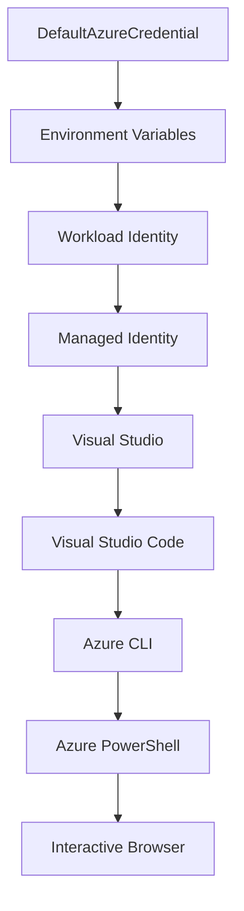

<!--
CO_OP_TRANSLATOR_METADATA:
{
  "original_hash": "4dc26ed8004b58a51875efd07203340f",
  "translation_date": "2025-09-26T18:44:37+00:00",
  "source_file": "docs/getting-started/azd-basics.md",
  "language_code": "ro"
}
-->
# AZD Bazele - Înțelegerea Azure Developer CLI

# AZD Bazele - Concepte de bază și fundamente

**Navigare capitol:**
- **📚 Acasă Curs**: [AZD Pentru Începători](../../README.md)
- **📖 Capitol Curent**: Capitolul 1 - Fundamente & Start Rapid
- **⬅️ Precedent**: [Prezentare Generală Curs](../../README.md#-chapter-1-foundation--quick-start)
- **➡️ Următor**: [Instalare & Configurare](installation.md)
- **🚀 Capitol Următor**: [Capitolul 2: Dezvoltare AI-First](../ai-foundry/azure-ai-foundry-integration.md)

## Introducere

Această lecție te introduce în Azure Developer CLI (azd), un instrument puternic de linie de comandă care accelerează tranziția de la dezvoltarea locală la implementarea în Azure. Vei învăța conceptele fundamentale, caracteristicile de bază și vei înțelege cum azd simplifică implementarea aplicațiilor cloud-native.

## Obiective de Învățare

Până la finalul acestei lecții, vei:
- Înțelege ce este Azure Developer CLI și scopul său principal
- Învață conceptele de bază despre șabloane, medii și servicii
- Explorează caracteristicile cheie, inclusiv dezvoltarea bazată pe șabloane și Infrastructure as Code
- Înțelege structura proiectului azd și fluxul de lucru
- Fii pregătit să instalezi și să configurezi azd pentru mediul tău de dezvoltare

## Rezultate de Învățare

După finalizarea acestei lecții, vei putea:
- Explica rolul azd în fluxurile moderne de dezvoltare cloud
- Identifica componentele structurii unui proiect azd
- Descrie cum funcționează împreună șabloanele, mediile și serviciile
- Înțelege beneficiile Infrastructure as Code cu azd
- Recunoaște diferite comenzi azd și scopurile lor

## Ce este Azure Developer CLI (azd)?

Azure Developer CLI (azd) este un instrument de linie de comandă conceput pentru a accelera tranziția de la dezvoltarea locală la implementarea în Azure. Simplifică procesul de construire, implementare și gestionare a aplicațiilor cloud-native pe Azure.

## Concepte de Bază

### Șabloane
Șabloanele sunt fundamentul azd. Ele conțin:
- **Codul aplicației** - Codul sursă și dependențele tale
- **Definiții de infrastructură** - Resurse Azure definite în Bicep sau Terraform
- **Fișiere de configurare** - Setări și variabile de mediu
- **Scripturi de implementare** - Fluxuri de lucru automate pentru implementare

### Medii
Mediile reprezintă diferite ținte de implementare:
- **Dezvoltare** - Pentru testare și dezvoltare
- **Staging** - Mediu pre-producție
- **Producție** - Mediu de producție live

Fiecare mediu menține propriul:
- Grup de resurse Azure
- Setări de configurare
- Stare de implementare

### Servicii
Serviciile sunt blocurile de construcție ale aplicației tale:
- **Frontend** - Aplicații web, SPAs
- **Backend** - API-uri, microservicii
- **Bază de date** - Soluții de stocare a datelor
- **Stocare** - Stocare de fișiere și blob-uri

## Caracteristici Cheie

### 1. Dezvoltare Bazată pe Șabloane
```bash
# Browse available templates
azd template list

# Initialize from a template
azd init --template <template-name>
```

### 2. Infrastructure as Code
- **Bicep** - Limbaj specific domeniului Azure
- **Terraform** - Instrument multi-cloud pentru infrastructură
- **ARM Templates** - Șabloane Azure Resource Manager

### 3. Fluxuri de Lucru Integrate
```bash
# Complete deployment workflow
azd up            # Provision + Deploy this is hands off for first time setup
azd provision     # Create Azure resources if you update the infrastructure use this
azd deploy        # Deploy application code or redeploy application code once update
azd down          # Clean up resources
```

### 4. Gestionarea Mediilor
```bash
# Create and manage environments
azd env new <environment-name>
azd env select <environment-name>
azd env list
```

## 📁 Structura Proiectului

O structură tipică de proiect azd:
```
my-app/
├── .azd/                    # azd configuration
│   └── config.json
├── .azure/                  # Azure deployment artifacts
├── .devcontainer/          # Development container config
├── .github/workflows/      # GitHub Actions
├── .vscode/               # VS Code settings
├── infra/                 # Infrastructure code
│   ├── main.bicep        # Main infrastructure template
│   ├── main.parameters.json
│   └── modules/          # Reusable modules
├── src/                  # Application source code
│   ├── api/             # Backend services
│   └── web/             # Frontend application
├── azure.yaml           # azd project configuration
└── README.md
```

## 🔧 Fișiere de Configurare

### azure.yaml
Fișierul principal de configurare al proiectului:
```yaml
name: my-awesome-app
metadata:
  template: my-template@1.0.0

services:
  web:
    project: ./src/web
    language: js
    host: appservice
  api:
    project: ./src/api
    language: js
    host: appservice

hooks:
  preprovision:
    shell: pwsh
    run: echo "Preparing to provision..."
```

### .azure/config.json
Configurare specifică mediului:
```json
{
  "version": 1,
  "defaultEnvironment": "dev",
  "environments": {
    "dev": {
      "subscriptionId": "your-subscription-id",
      "location": "eastus"
    }
  }
}
```

## 🎪 Fluxuri Comune de Lucru

### Începerea unui Proiect Nou
```bash
# Method 1: Use existing template
azd init --template todo-nodejs-mongo

# Method 2: Start from scratch
azd init

# Method 3: Use current directory
azd init .
```

### Ciclu de Dezvoltare
```bash
# Set up development environment
azd auth login
azd env new dev
azd env select dev

# Deploy everything
azd up

# Make changes and redeploy
azd deploy

# Clean up when done
azd down --force --purge # command in the Azure Developer CLI is a **hard reset** for your environment—especially useful when you're troubleshooting failed deployments, cleaning up orphaned resources, or prepping for a fresh redeploy.
```

## Înțelegerea `azd down --force --purge`
Comanda `azd down --force --purge` este o modalitate puternică de a elimina complet mediul azd și toate resursele asociate. Iată o descriere a ceea ce face fiecare flag:
```
--force
```
- Sare peste solicitările de confirmare.
- Util pentru automatizare sau scripting unde inputul manual nu este fezabil.
- Asigură că procesul de eliminare continuă fără întreruperi, chiar dacă CLI detectează inconsistențe.

```
--purge
```
Șterge **toate metadatele asociate**, inclusiv:
Starea mediului
Folderul local `.azure`
Informațiile de implementare cache
Previne ca azd să "își amintească" implementările anterioare, ceea ce poate cauza probleme precum grupuri de resurse nepotrivite sau referințe vechi la registre.


### De ce să folosești ambele?
Când te confrunți cu probleme la `azd up` din cauza stării persistente sau implementărilor parțiale, această combinație asigură un **nou început**.

Este deosebit de utilă după ștergeri manuale de resurse în portalul Azure sau când schimbi șabloane, medii sau convenții de denumire a grupurilor de resurse.


### Gestionarea Mediilor Multiple
```bash
# Create staging environment
azd env new staging
azd env select staging
azd up

# Switch back to dev
azd env select dev

# Compare environments
azd env list
```

## 🔐 Autentificare și Acreditive

Înțelegerea autentificării este crucială pentru implementările reușite azd. Azure folosește mai multe metode de autentificare, iar azd utilizează același lanț de acreditive folosit de alte instrumente Azure.

### Autentificare Azure CLI (`az login`)

Înainte de a folosi azd, trebuie să te autentifici cu Azure. Metoda cea mai comună este utilizarea Azure CLI:

```bash
# Interactive login (opens browser)
az login

# Login with specific tenant
az login --tenant <tenant-id>

# Login with service principal
az login --service-principal -u <app-id> -p <password> --tenant <tenant-id>

# Check current login status
az account show

# List available subscriptions
az account list --output table

# Set default subscription
az account set --subscription <subscription-id>
```

### Fluxul de Autentificare
1. **Login Interactiv**: Deschide browserul implicit pentru autentificare
2. **Fluxul de Cod Dispozitiv**: Pentru medii fără acces la browser
3. **Principal de Serviciu**: Pentru automatizare și scenarii CI/CD
4. **Identitate Gestionată**: Pentru aplicații găzduite pe Azure

### Lanțul DefaultAzureCredential

`DefaultAzureCredential` este un tip de acreditiv care oferă o experiență simplificată de autentificare prin încercarea automată a mai multor surse de acreditive într-o ordine specifică:

#### Ordinea Lanțului de Acreditive


#### 1. Variabile de Mediu
```bash
# Set environment variables for service principal
export AZURE_CLIENT_ID="<app-id>"
export AZURE_CLIENT_SECRET="<password>"
export AZURE_TENANT_ID="<tenant-id>"
```

#### 2. Identitate Workload (Kubernetes/GitHub Actions)
Utilizat automat în:
- Azure Kubernetes Service (AKS) cu Workload Identity
- GitHub Actions cu OIDC federation
- Alte scenarii de identitate federată

#### 3. Identitate Gestionată
Pentru resurse Azure precum:
- Mașini Virtuale
- App Service
- Azure Functions
- Instanțe de Container

```bash
# Check if running on Azure resource with managed identity
az account show --query "user.type" --output tsv
# Returns: "servicePrincipal" if using managed identity
```

#### 4. Integrare cu Instrumente de Dezvoltare
- **Visual Studio**: Utilizează automat contul conectat
- **VS Code**: Utilizează acreditivele extensiei Azure Account
- **Azure CLI**: Utilizează acreditivele `az login` (cel mai comun pentru dezvoltarea locală)

### Configurarea Autentificării AZD

```bash
# Method 1: Use Azure CLI (Recommended for development)
az login
azd auth login  # Uses existing Azure CLI credentials

# Method 2: Direct azd authentication
azd auth login --use-device-code  # For headless environments

# Method 3: Check authentication status
azd auth login --check-status

# Method 4: Logout and re-authenticate
azd auth logout
azd auth login
```

### Cele Mai Bune Practici de Autentificare

#### Pentru Dezvoltare Locală
```bash
# 1. Login with Azure CLI
az login

# 2. Verify correct subscription
az account show
az account set --subscription "Your Subscription Name"

# 3. Use azd with existing credentials
azd auth login
```

#### Pentru Pipeline-uri CI/CD
```yaml
# GitHub Actions example
- name: Azure Login
  uses: azure/login@v1
  with:
    creds: ${{ secrets.AZURE_CREDENTIALS }}

- name: Deploy with azd
  run: |
    azd auth login --client-id ${{ secrets.AZURE_CLIENT_ID }} \
                    --client-secret ${{ secrets.AZURE_CLIENT_SECRET }} \
                    --tenant-id ${{ secrets.AZURE_TENANT_ID }}
    azd up --no-prompt
```

#### Pentru Medii de Producție
- Utilizează **Identitate Gestionată** când rulezi pe resurse Azure
- Utilizează **Principal de Serviciu** pentru scenarii de automatizare
- Evită stocarea acreditivelor în cod sau fișiere de configurare
- Utilizează **Azure Key Vault** pentru configurări sensibile

### Probleme Comune de Autentificare și Soluții

#### Problemă: "Nu s-a găsit nicio subscripție"
```bash
# Solution: Set default subscription
az account list --output table
az account set --subscription "<subscription-id>"
azd env set AZURE_SUBSCRIPTION_ID "<subscription-id>"
```

#### Problemă: "Permisiuni insuficiente"
```bash
# Solution: Check and assign required roles
az role assignment list --assignee $(az account show --query user.name --output tsv)

# Common required roles:
# - Contributor (for resource management)
# - User Access Administrator (for role assignments)
```

#### Problemă: "Token expirat"
```bash
# Solution: Re-authenticate
az logout
az login
azd auth logout
azd auth login
```

### Autentificare în Diferite Scenarii

#### Dezvoltare Locală
```bash
# Personal development account
az login
azd auth login
```

#### Dezvoltare în Echipe
```bash
# Use specific tenant for organization
az login --tenant contoso.onmicrosoft.com
azd auth login
```

#### Scenarii Multi-tenant
```bash
# Switch between tenants
az login --tenant tenant1.onmicrosoft.com
# Deploy to tenant 1
azd up

az login --tenant tenant2.onmicrosoft.com  
# Deploy to tenant 2
azd up
```

### Considerații de Securitate

1. **Stocarea Acreditivelor**: Nu stoca niciodată acreditivele în cod sursă
2. **Limitarea Domeniului**: Utilizează principiul privilegiului minim pentru principalii de serviciu
3. **Rotirea Token-urilor**: Rotește regulat secretele principalilor de serviciu
4. **Trail de Audit**: Monitorizează activitățile de autentificare și implementare
5. **Securitatea Rețelei**: Utilizează puncte finale private când este posibil

### Depanarea Autentificării

```bash
# Debug authentication issues
azd auth login --check-status
az account show
az account get-access-token

# Common diagnostic commands
whoami                          # Current user context
az ad signed-in-user show      # Azure AD user details
az group list                  # Test resource access
```

## Înțelegerea `azd down --force --purge`

### Descoperire
```bash
azd template list              # Browse templates
azd template show <template>   # Template details
azd init --help               # Initialization options
```

### Gestionarea Proiectului
```bash
azd show                     # Project overview
azd env show                 # Current environment
azd config list             # Configuration settings
```

### Monitorizare
```bash
azd monitor                  # Open Azure portal
azd pipeline config          # Set up CI/CD
azd logs                     # View application logs
```

## Cele Mai Bune Practici

### 1. Folosește Nume Semnificative
```bash
# Good
azd env new production-east
azd init --template web-app-secure

# Avoid
azd env new env1
azd init --template template1
```

### 2. Utilizează Șabloane
- Începe cu șabloane existente
- Personalizează pentru nevoile tale
- Creează șabloane reutilizabile pentru organizația ta

### 3. Izolarea Mediilor
- Utilizează medii separate pentru dev/staging/prod
- Nu implementa direct în producție de pe mașina locală
- Utilizează pipeline-uri CI/CD pentru implementări în producție

### 4. Gestionarea Configurării
- Utilizează variabile de mediu pentru date sensibile
- Păstrează configurarea în controlul versiunilor
- Documentează setările specifice mediului

## Progresul Învățării

### Începător (Săptămâna 1-2)
1. Instalează azd și autentifică-te
2. Implementează un șablon simplu
3. Înțelege structura proiectului
4. Învață comenzile de bază (up, down, deploy)

### Intermediar (Săptămâna 3-4)
1. Personalizează șabloanele
2. Gestionează medii multiple
3. Înțelege codul de infrastructură
4. Configurează pipeline-uri CI/CD

### Avansat (Săptămâna 5+)
1. Creează șabloane personalizate
2. Modele avansate de infrastructură
3. Implementări multi-regiune
4. Configurări de nivel enterprise

## Pași Următori

**📖 Continuă Învățarea Capitolului 1:**
- [Instalare & Configurare](installation.md) - Instalează și configurează azd
- [Primul Tău Proiect](first-project.md) - Completează tutorialul practic
- [Ghid de Configurare](configuration.md) - Opțiuni avansate de configurare

**🎯 Pregătit pentru Capitolul Următor?**
- [Capitolul 2: Dezvoltare AI-First](../ai-foundry/azure-ai-foundry-integration.md) - Începe să construiești aplicații AI

## Resurse Suplimentare

- [Prezentare Generală Azure Developer CLI](https://learn.microsoft.com/en-us/azure/developer/azure-developer-cli/)
- [Galerie de Șabloane](https://azure.github.io/awesome-azd/)
- [Exemple Comunitare](https://github.com/Azure-Samples)

---

**Navigare capitol:**
- **📚 Acasă Curs**: [AZD Pentru Începători](../../README.md)
- **📖 Capitol Curent**: Capitolul 1 - Fundamente & Start Rapid  
- **⬅️ Precedent**: [Prezentare Generală Curs](../../README.md#-chapter-1-foundation--quick-start)
- **➡️ Următor**: [Instalare & Configurare](installation.md)
- **🚀 Capitol Următor**: [Capitolul 2: Dezvoltare AI-First](../ai-foundry/azure-ai-foundry-integration.md)

---

